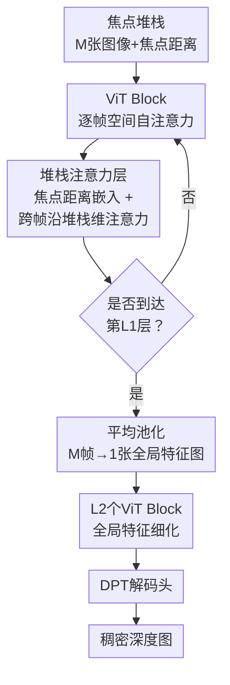

# Zero-Shot Depth from Defocus: 从对焦堆栈零样本估计度量深度

**会议**: ECCV 2026  
**arXiv**: [2603.26658](https://arxiv.org/abs/2603.26658)  
**代码**: [https://github.com/princeton-vl/FOSSA](https://github.com/princeton-vl/FOSSA)  
**领域**: 3D视觉  
**关键词**: 对焦深度估计, 零样本泛化, Transformer, 焦点堆栈注意力, 深度基准

## 一句话总结
本文提出 FOSSA，一个基于 Transformer 的零样本对焦深度估计网络，通过新颖的堆栈注意力层高效聚合焦点堆栈中的散焦线索，并在大规模合成数据上训练后实现了跨数据集、跨场景的强零样本泛化；同时发布了 ZEDD——一个包含 100 个场景、4K 分辨率、LiDAR 真值的高质量对焦深度实测基准。

## 研究背景与动机

对焦深度估计（Depth from Defocus, DfD）的任务是从一组同一视角、不同对焦距离拍摄的图像（即焦点堆栈, focus stack）中恢复出每像素的度量深度。当相机从近到远扫描焦平面时，场景中不同深度的物体依次进入清晰状态后又再变模糊——这种随对焦距离变化的模糊模式天然编码了几何深度信息，因此 DfD 在后期散焦控制、视图合成、重照明等下游应用中具有独特价值。然而现有 DfD 方法几乎全部局限于同域（in-domain）设置：在某个小规模数据集上训练和测试，一旦场景、相机参数或光照条件变化，性能就急剧下降，远达不到零样本泛化的实际部署要求。

造成这一困境的原因有两个。其一是缺少高质量的实测 DfD 基准。已有的 DDFF 数据集仅含 12 个场景、图像来自光场相机合成（光圈极小、散焦效应几乎不可见），且深度真值来自结构光传感器（分辨率低、噪声大、测距仅到 3.5m）。其二是现有 DfD 网络设计容量不足，大多依赖手工设计的专用层（如差分焦点体积、变分求解器），难以规模化扩展并受益于大规模预训练的通用视觉模型。这两个问题相互纠缠：没有大而好的基准，就难以开发出鲁棒的网络；网络能力弱，又无法在大数据上有效学习。

本文从基准和模型两端同时破局。在基准侧，作者构建了 ZEDD——用 4K DSLR、多档光圈（最大 F/1.4）和高端 Ouster LiDAR 采集了 100 个多样室内外场景，场景数是 DDFF 的 8.3 倍，且散焦效果真实可见、深度真值高精度高密度。在模型侧，提出了 FOSSA（FOCus Stack Attention Transformer），一个基于 ViT 但专门适配 DfD 任务的轻量级架构，并搭配了一条域随机化的合成数据管线，使得模型在 ZEDD 和各种跨域数据集上均能零样本工作。**核心 idea：在 ViT 各层之间插入一维堆栈注意力层，以焦点距离嵌入编码每帧的几何位置，让网络沿堆栈维度高效交换散焦线索——这种 "逐帧空间编码 + 跨帧堆栈交互" 的解耦设计既保留了大模型预训练权重，又精确捕捉了 DfD 特有的随对焦距离变化的模糊模式，实现了零样本场景下高达 55.7% 的误差降幅。**

## 方法详解

### 整体框架

FOSSA 的输入是一个焦点堆栈 $\mathbf{I} = (\mathbf{I}_1, \dots, \mathbf{I}_M)$（$M$ 张像素对齐的 RGB 图像）以及对应的焦点距离 $\mathbf{d}=(d_1,\dots,d_M)$（单位：米），输出是一张稠密度量深度图 $\hat{\mathbf{D}} \in \mathbb{R}^{H \times W}$。整个前向过程分为两个阶段。

第一阶段是**逐帧特征提取**。每张图像独立经过 $L_1$ 层特征提取器，每层包含两个子模块：一个权重共享的 ViT Block（对每帧图像做空间自注意力）和一个新颖的堆栈注意力层（跨 $M$ 帧做交换）。第二阶段是**特征融合与细化**。将 $M$ 个逐帧特征图沿堆栈维度做平均池化收缩为一张全局特征图，再经过 $L_2$ 个 ViT Block 进一步细化，最后通过 DPT 解码头回归出稠密深度图。

这种设计的关键策略是：在特征提取的早期就进行跨帧信息交换，而非独立的逐帧处理到末端才融合。前者能让散焦线索在全局理解中互相增强，后者则容易丢失细微的跨帧差异。

### 关键设计

**1. 堆栈注意力层：用焦点距离引导跨帧信息交换**

DfD 的核心信号不在任何单张图像中，而在**同一空间位置在不同对焦距离下从模糊到清晰再到模糊的变化模式**中。要捕捉这种模式，网络需要在不同对焦距离的图像之间显式传递信息。最直接的方式是将 $M$ 帧的所有特征图拉到一起做全注意力，但计算量 $O(MHW)$ 巨大。本文的关键洞察是：跨帧交互只需要发生在**同空间位置的不同焦点版本之间**——因为散焦信号是逐像素位置独立变化的。

基于这一洞察，堆栈注意力层的机制分为三步。首先，将每张图像的焦点距离 $d_i$ 通过两层 MLP 编码为 $C$ 维向量（焦点距离嵌入），加到该帧的所有图像 token 上。然后，将 $M$ 帧的特征图在堆栈维度上拼接为一个 4D 张量 $\mathbf{F}' \in \mathbb{R}^{M \times C \times (H/p \times W/p)}$。最后，对**每个空间位置独立**地在堆栈维度（大小 $M$）上做标准的 self-attention——即同一 patch 位置上的 $M$ 个特征向量彼此交互，感知 "谁是最清晰的、谁是最模糊的，以及焦点距离各自是多少"。

这个设计的巧妙之处在于计算效率：注意力的复杂度 $O(M^2)$ 只取决于堆栈大小 $M$（实验中 $M=5$），远小于空间 token 数 $HW/p^2$（通常 $>10^3$）。换句话说，它用极小的额外代价实现了关键的多帧信息交换，而其焦点距离嵌入则像一把几何标尺——告诉模型每个特征向量是在什么深度水平上采集的，使得模型能够从模糊程度的有序变化中解码出绝对深度。

**2. 合成数据与域随机化管线：让零样本泛化成为可能**

大规模 DfD 数据集不存在——真实焦点堆栈的采集需要精准的硬件同步和高精度的深度真值，成本极高。因此 FOSSA 完全在合成焦点堆栈上训练。合成管线以现有 RGBD 数据集（Hypersim 室内 66K 样本 + TartanAir 室外 307K 样本）为基础，利用物理散焦模型生成逼真的焦点堆栈。

核心公式是弥散圆（Circle of Confusion, CoC）：
$$\text{CoC} = \frac{|\mathbf{D} - d|}{\mathbf{D}} \cdot \frac{f^2}{N(d-f)}$$

其中 $d$ 是焦距离、$f$ 是焦距、$N$ 是光圈数。根据 CoC 可以生成逐像素的模糊核（点扩散函数 PSF），再与原图做卷积得到散焦图像。但真实相机的 PSF 形状并非单一固定的：小光圈/衍射主导时为类高斯型，大光圈/几何光学主导时趋近均匀圆盘型。为了弥合合成到真实之间的域差距，本文提出一个广义 PSF 公式：
$$\mathcal{F}^{\text{Generalized}}(u,v,p) = \frac{1}{c^2} \exp\!\left(-2\left(\frac{u^2+v^2}{c^2}\right)^{\frac{p}{2}}\right)$$

当形状参数 $p=2$ 时为高斯 PSF，$p \to +\infty$ 时为均匀圆盘 PSF。训练时随机采样 $p \sim 2^{U(1,5)}$ 来覆盖从高斯到超圆盘的完整连续谱。同时，光圈数 $N$ 在 $[1.0, 1.4, 2.0, 2.8, 4.0]$ 中随机选取，焦距离也使用两种模式（摄影者手动指定 vs. 自动预置）混合采样。这种极尽全面的域随机化使得模型在完全合成训练后，面对真实相机的各种光学设置仍能鲁棒工作。

**3. 早融合策略：在特征提取早期做堆栈坍缩**

大多数 DfD 方法选择对所有 $M$ 帧独立跑完完整编码器后再融合特征。但 FOSSA 采用了相反的思路——在仅经过 $L_1=4$ 层提取后，就通过平均池化将 $M$ 帧的特征图坍缩为一张全局特征图，然后由后续 $L_2=8$ 层 ViT Block 做单一图的深度推理。

这一策略的动机是：散焦线索在浅层特征中最为关键——模糊程度的细微差异在最浅层的空间细节（纹理、边缘）上最明显，深层语义特征反而被高度抽象后丢失了模糊对比。因此尽早坍缩并用较强的后段网络统一推理，既避免了 $M$ 路并行编码的冗余计算（后 $L_2$ 层只需处理一张特征图），又能让后续细化阶段在一个完整的全局上下文中理解深度关系。直觉上，这相当于把 DfD 任务拆成了"浅层散焦信号提取 + 深层单目深度推理"两段，各自发挥 ViT 的强项。

### 损失函数 / 训练策略

损失函数是 SiLog 损失（$\lambda=0.5$ 平衡度量与相对深度）与梯度匹配损失的加权和：
$$L(\hat{\mathbf{D}}, \mathbf{D}) = \text{SiLog}(\hat{\mathbf{D}}, \mathbf{D}) + 0.1 \cdot \text{GradientMatching}(\hat{\mathbf{D}}, \mathbf{D})$$

ViT Block 初始化自 DepthAnythingv2 的室内度量深度预训练权重（零样本推理关键），堆栈注意力层中的 MLP 零初始化。训练 40 个 epoch，batch size 8，在 4×L40 GPU 上耗时 2 天。学习率采用指数衰减，预训练骨干的学习率缩放因子为 0.5。

## 实验关键数据

### 主实验

| 数据集 | 指标 | Ours (ViT-B) | 之前最佳 (DepthPro) | 提升 |
|--------|------|-------------|---------------------|------|
| ZEDD (test) | AbsRel ↓ | **0.089** | 0.201 | **-55.7%** |
| ZEDD (test) | δ₁.₂₅ ↑ | **0.918** | 0.665 | +38.0% |
| Infinigen Defocus | AbsRel ↓ | **0.091** | 0.176 (DepthPro) | -48.3% |
| DDFF | MSE ↓ | **—** (finetuned) | — | -40.4% vs DualFocus |

### 消融与分析

| 配置 | ZEDD AbsRel | 说明 |
|------|-------------|------|
| Ours (ViT-B) | **0.089** | 完整模型 |
| Ours (ViT-S) | 0.098 | 小模型也大幅领先全部基线 |
| DFF-DFV (retrained w/ same data) | — | 用相同数据管线重训后仍有差距，证明架构贡献 |
| 单目基线 DepthPro | 0.201 | 最领先的单目方法，仍被大幅超越 |
| HybridDepth | 0.754 | 传统 DfD 方法在零样本下近乎失效 |

### 关键发现

- **零样本泛化鸿沟**：所有传统 DfD 方法（HybridDepth、DFF、DEReD）在 ZEDD 上表现极差（δ₁.₂₅ < 0.58），甚至不如单目方法，证实了它们完全不具备跨域能力；FOSSA 则一枝独秀（δ₁.₂₅ = 0.918），表明架构+数据管线的整体设计是有效的。
- **消融归因**：即使给 DFF-DFV 提供完全相同的训练数据，FOSSA 仍然全面领先，说明 FOSSA 的架构设计（堆栈注意力+早融合）本身贡献了核心增益，并非单纯数据优势。
- **对透明物体（HAMMER）的优异表现**：在 HAMMER 数据集（透明/反射物）上，FOSSA 达到 δ₁.₂₅=0.999、AbsRel=0.017，几乎完美——这可能得益于堆栈注意力层通过焦点距离嵌入学会了利用透明物体的散焦特征（透明物体虽然难被普通深度传感器捕捉，但其散焦模式仍然可辨识）。
- **鲁棒性强**：在光圈数 F/1.4~F/5.6 范围和焦点堆栈大小 3~9 张的评估中，FOSSA 的降点幅度均明显小于基线方法，显示出良好的环境适应性。

## 亮点与洞察

- **堆栈注意力的计算效率设计**：把注意力限制在堆栈维度（$M$ 一般仅 5），而不用在空间维度做全连接，既交换了跨帧散焦信息又保持计算开销极低。这是 DfD 任务独有的"信息在同一位置不同焦点间传递"的结构先验。
- **早融合替代晚融合**：大多数方法 $M$ 路独立编码到底再融合，FOSSA 浅层融合的做法出人意料但有效——说明散焦线索本质上是底层视觉信号，深层语义反而帮不上忙，提前坍缩让后续深度推理更专注。
- **用焦点距离作为学习锚点**：传统的 DfD 方法（如 DDFS）需要嵌入完整相机参数（焦距、光圈、像元尺寸等），FOSSA只用焦点距离做语义嵌入，其他参数靠训练时的多样化随机化隐式学习，简化了模型但泛化性反而更强。
- **物理启发的 PSF 形状域随机化**：用一个形状参数 $p$ 将高斯和圆盘型 PSF 统一为连续谱系，在训练时随机扫过各种光学退化形态，巧妙弥合了合成数据与真实相机之间的模拟盲区。

## 局限与展望

- 当前模型仅支持静态场景——如果拍摄过程中相机或被摄物移动，焦点堆栈会对不准。未来可以引入光流对齐或时序建模来处理手持拍摄或动态场景。
- 合成数据管线虽然做了域随机化，但简单的 PSF 卷积仍与真实相机的复杂光学退化（像差、镜头畸变等）存在差距。使用更逼真的学习式散焦渲染（如 BokehMe）可能是下一步的提升方向。
- 堆栈大小固定为 5 张——在 ZEDD 测试中，模型在 9 张输入时性能接近饱和，未来可探索自适应堆栈大小或变长堆栈的推理策略。

## 相关工作与启发

- **vs 传统 DfD 方法（HybridDepth/DFV/DefocusNet）**：它们采用手工定制的网络层（差分焦点体积、多阶段对齐、变分求解器），在训练域内有效但无法零样本迁移。FOSSA 改用 ViT 基础架构+堆栈注意力，借力大规模预训练，突破了这一限制。
- **vs 单目深度估计（DepthPro/DepthAnythingv2）**：单目方法用一张全焦图推断深度，虽零样本能力强但难以获得精确的**度量**深度（存在尺度模糊）。FOSSA 利用焦点堆栈的多视角模糊变化解开了尺度歧义，在度量精度上具有天然优势。
- **vs ZEDD 与 DDFF**：ZEDD 的拍摄质量（4K 分辨率、F/1.4 大光圈、LiDAR 真值）远超 DDFF（低分辨率、光场合成散焦几不可见、结构光深度仅 3.5m），提供了一个更具挑战性和实用价值的 DfD 测试平台。

## 评分
- 新颖性: ⭐⭐⭐⭐☆ FOSSA 将标准 ViT+堆栈注意力这一简洁适配用于 DfD 而非手工定制网络，思想新颖；ZEDD 基准贡献虽大但偏工程。
- 实验充分度: ⭐⭐⭐⭐⭐ 在 6 个数据集（含合成+真实+跨域）上做了全面评估，消融实验清晰分离了架构和数据管线的各自贡献，鲁棒性分析充分。
- 写作质量: ⭐⭐⭐⭐⭐ 动机清晰（两个问题的互锁关系叙述扎实），方法详实且图表示意到位，附录含大量实现细节可复现。
- 价值: ⭐⭐⭐⭐⭐ 同时提供了模型+基准+数据管线三项落地资源，对 DfD 领域从"小域拟合"推进到"零样本泛化"有切实的推动作用。

<!-- RELATED:START -->

## 相关论文

- [\[CVPR 2026\] Zero-Shot Depth Completion with Vision-Language Model](../../CVPR2026/3d_vision/zero-shot_depth_completion_with_vision-language_model.md)
- [\[ECCV 2026\] Agentic Collaborative Cognition for Zero-Shot 3D Understanding](agentic_collaborative_cognition_for_zero-shot_3d_understanding.md)
- [\[CVPR 2025\] Depth Any Camera: Zero-Shot Metric Depth Estimation from Any Camera](../../CVPR2025/3d_vision/depth_any_camera_zero-shot_metric_depth_estimation_from_any_camera.md)
- [\[CVPR 2026\] SpiderCam: Low-Power Snapshot Depth from Differential Defocus](../../CVPR2026/3d_vision/spidercam_low-power_snapshot_depth_from_differential_defocus.md)
- [\[CVPR 2026\] VGGT-360: Geometry-Consistent Zero-Shot Panoramic Depth Estimation](../../CVPR2026/3d_vision/vggt-360_geometry-consistent_zero-shot_panoramic_depth_estimation.md)

<!-- RELATED:END -->
