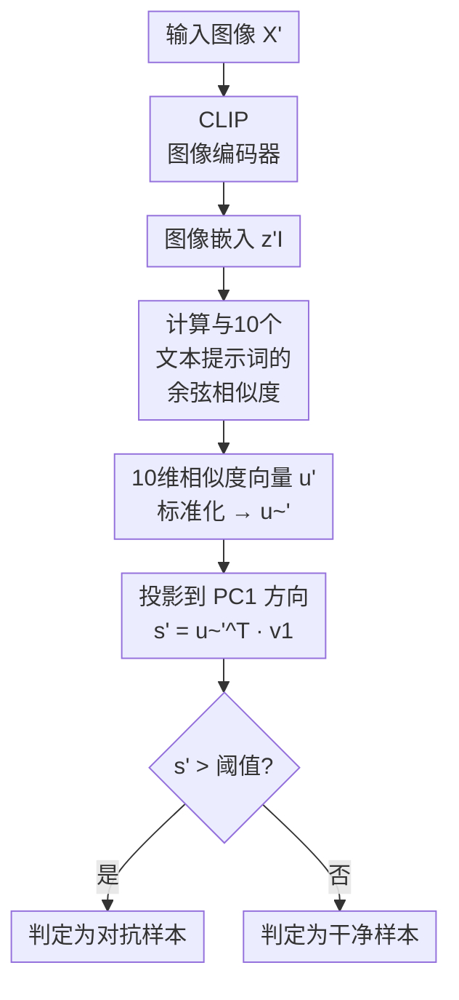

# A Classifier-Agnostic Zero-Shot Adversarial Attack Detection via CLIP

**会议**: ECCV 2026  
**arXiv**: [2606.30342](https://arxiv.org/abs/2606.30342)  
**代码**: 无  
**领域**: AI安全 / 对抗攻击检测  
**关键词**: 对抗攻击检测, CLIP, 零样本检测, 分类器无关, 基于提示的检测  

## 一句话总结

提出 A4D，一个完全黑盒、零样本的对抗攻击检测框架——利用 CLIP 对微小扰动的敏感性，通过将图像嵌入与一组精心设计的文本提示词比较余弦相似度，再经 PCA 聚合为单一检测分数，无需知道攻击类型或分类器结构即可检测对抗样本，在多个攻击/数据集/分类器上达到 SOTA。

## 研究背景与动机

**领域现状**：现有对抗攻击检测方法大致分三类：**攻击特定检测**（学习阈值或训练分类器区分干净与对抗样本，需假设攻击类型）、**基于分类器内部表征**（利用隐藏层激活或架构特性，与分类器紧耦合）、**基于训练**（需同时使用干净和对抗样本训练检测器）。这三类方法都依赖于额外的先验信息——要么知道攻击类型，要么能访问分类器结构或训练数据——在真实场景中这些信息往往不可用。

**核心矛盾**：理想检测器应能在**完全黑盒**条件下工作：不知道攻击类型、不知道分类器架构、没有对抗样本用于训练。同时，新分类器和新型攻击不断涌现，检测方法必须具备泛化到未知攻击和未来分类器的能力。如何在如此受限的条件下提取可区分干净与对抗样本的信号？

**核心 idea**：本文的关键洞察是 CLIP 的嵌入空间不仅擅长语义对齐，还对**非语义的微小扰动**异常敏感——即使是肉眼不可见的对抗扰动，也会在 CLIP 嵌入空间中产生可测量的、有偏的偏移。更重要的是，这种偏移并非随机：被攻击样本在嵌入空间中会集中到特定区域，因此可以**用文本提示词来编码"被攻击"这个抽象概念**，通过计算图像与提示词的相似度来判断是否受到了攻击。基于此提出 A4D（Attack- and Architecture-Agnostic Adversarial Detector）。

## 方法详解

### 整体框架

A4D 的核心思想是将对抗检测转化为一个**基于 CLIP 语义空间的零样本分类问题**。整体流程如下：输入图像经 CLIP 图像编码器得到嵌入向量；同时用一组描述噪声/异常特征的文本提示词经 CLIP 文本编码器得到对应的嵌入；计算图像嵌入与每个提示词嵌入的余弦相似度，得到一个 N 维相似度向量（本文 N=10）；用少量干净图像组成代表集，在该集上估算相似度矩阵的 PCA 第一主成分方向 v1；对测试图像的相似度向量做同样的标准化后，投影到 v1 上得到一维检测分数 s'；分数越高表示越可能是对抗样本。

### 关键设计

**1. 文本提示词词典构建：用自然语言编码"被攻击"的概念**

为了利用 CLIP 的语义空间来表征对抗扰动的特征，本文手动构造了一个包含 10 个提示词的词典。这些提示词从不同角度描述图像被噪声或人为修改的迹象，例如 "An image with noise"、"An image with unnatural texture"、"An image with adversarial perturbations"、"An image with high-frequency noise" 等。选择多个而非单个提示词的原因有二：（1）不同攻击在嵌入空间中引起的偏移模式不同（如图 4 所示），多个提示词可以覆盖更多攻击类型；（2）多提示词的集合可以降低检测信号的方差。图 5 的互相关热图显示，这些提示词之间的相关性较低，说明它们确实提供了多样化的检测信号。需要特别注意的是，并非所有语义相关的噪声类提示词都有效——例如 "A noisy image" 这个看似合理的提示词在所有攻击上都不具区分力（图 4 第三个子图），说明提示词选择对性能影响很大。

**2. 基于 PCA 的相似度向量聚合：从高维信号中提取最鲁棒的检测因子**

得到 10 维相似度向量后，需要将其聚合成一个标量检测分数。本文对比了四种聚合策略：最大百分位、最小百分位、均值百分位和 PCA 投影。PCA 方法的核心步骤是：从目标数据集中取 M=200 张干净图像组成代表集，计算它们的相似度矩阵 $P \in \mathbb{R}^{M \times N}$；对 P 逐列标准化后做 PCA，取第一主成分方向 $v_1 \in \mathbb{R}^N$（即解释方差最大的方向）；测试时，将新图像的标准化相似度向量 $\tilde{u}'$ 投影到 $v_1$ 上得到分数 $s' = \tilde{u}'^{\top} v_1$。PCA 优于简单统计量的原因在于：PC1 方向能自动学习不同提示词在区分干净/对抗样本时的权重，利用提示词间的协方差结构找到最优投影方向，而不是对所有提示词等权平均。

**3. 零样本检测协议：无需对抗样本、无需分类器信息的推理流程**

整个检测过程不需要任何对抗样本参与训练。验证集仅需 200 张干净图像，且这些图像只用来估算 PCA 方向——不涉及模型微调或参数更新。推理时，单张图像只需一次 CLIP 前向传播（0.0091 秒/图），后续操作只是低维相似度向量的标准化和投影。这意味着 A4D 可以即插即用到任意分类器之上：不管分类器是什么结构（Transformer / CNN / MLP），不管对抗攻击是什么类型（白盒/黑盒、$\ell_\infty$/$\ell_2$ 约束），框架本身无需调整。

### 一个完整示例：DeiT-Small 上的 FGSM 检测

假设我们用 DeiT-Small 分类器处理 Tiny-ImageNet 数据集，攻击者用 FGSM（$\epsilon=8/255$）生成对抗样本。检测流程如下：（1）先从训练集中随机取 200 张干净图像，用 CLIP（如 ViT-B/32）提取嵌入，同时用 10 个提示词文本提取嵌入；（2）计算 200×10 的相似度矩阵 P，标准化后做 PCA 得到 v1；（3）测试时，对输入图像提取嵌入，计算与 10 个提示词的相似度，标准化后与 v1 内积得检测分数 s'。在 FGSM 攻击下，对抗样本的 s' 相比干净样本显著偏高（因为其"噪声"特征被多个提示词捕获），在表 3 中 FGSM 的 AU-ROC 达到 99.24。

## 实验关键数据

### 主实验

以下结果在 Tiny-ImageNet 数据集、DeiT-Small 分类器上测得。对比基线包括基于噪声统计的 MAD 和 Wavelet 方法。指标为 AU-ROC（%）。

| 攻击方法 | A4D (本文) | MAD | Wavelet |
|----------|------------|-----|---------|
| FGSM | 99.24 | 73.46 | 95.99 |
| PGD | 98.16 | 71.07 | 95.05 |
| AutoAttack | 98.39 | 85.95 | 93.69 |
| BIM | 97.76 | 83.46 | 90.36 |
| CW | 77.31 | 50.68 | 50.92 |
| DeepFool | 78.62 | 50.46 | 50.62 |
| Square | 97.84 | 63.52 | 56.88 |
| **平均** | **92.47** | **68.37** | **76.22** |

在另外三种分类器（Wide-ResNet 平均 92.53、ResNet34 平均 93.32、ConvNeXt-Tiny 平均 84.97）上也得到类似结论：A4D 在所有分类器上的平均 AU-ROC 碾压 MAD 和 Wavelet 基线，且在绝大多数攻击上取得最优或次优。与需要分类器内部信息的 Mahalanobis 方法相比（其攻击无关变体在 DeiT-Small 上仅 54.96），A4D 在完全黑盒设定下实现了大幅领先。

### 消融实验

不同聚合策略对检测性能的影响（Tiny-ImageNet, DeiT-Small, AU-ROC %）。

| 聚合方法 | FGSM | PGD | AutoAttack | BIM | CW | DeepFool | Square | 平均 |
|----------|------|-----|------------|-----|----|----------|--------|------|
| Max 百分位 | 99.25 | 98.54 | 98.63 | 97.99 | 74.70 | 76.22 | 95.35 | 91.53 |
| Min 百分位 | 93.07 | 89.84 | 89.73 | 85.66 | 69.01 | 69.75 | 88.05 | 83.58 |
| Mean 百分位 | 98.63 | 97.44 | 97.61 | 96.81 | 75.19 | 76.86 | 94.77 | 91.04 |
| **PCA (本文)** | **99.24** | **98.16** | **98.39** | **97.76** | **77.31** | **78.62** | **97.84** | **92.47** |

PCA 在所有攻击上一致优于或持平于其他聚合策略，7 项攻击中 5 项最优、2 项次优。值得注意的是，在 CW 和 DeepFool 这两个最难的攻击上，PCA 的优势最为明显（比均值百分位分别高出 2.1 和 1.8 个百分点）。

### 关键发现

- **类噪声攻击 vs 结构化攻击的表现差异**：方法对 FGSM、PGD、AutoAttack、BIM、Square 这类产生类噪声扰动的攻击检测效果极好（AU-ROC > 95%），但对 CW 和 DeepFool 效果明显下降（约 77-78%）。原因是 CW 和 DeepFool 的扰动与图像边缘高度相关（图 7 定量证实），其结构化模式与 "noise" 类提示词的语义有偏差，导致相似度信号较弱。
- **PCA 聚合的稳定性优势**：相比简单的 Max/Min/Mean 聚合，PCA 通过捕获提示词之间的协方差结构，在多个攻击类型上更稳定。特别地，Min 百分位策略效果最差（平均 83.58），说明单个最不相似的提示词不足以可靠区分干净与对抗样本。
- **跨分类器的泛化性**：A4D 在 4 种结构差异较大的分类器（ViT-like DeiT-Small、CNN-like Wide-ResNet/ResNet34、轻量 ConvNeXt-Tiny）上都稳定有效，平均 AU-ROC 在 84.97-93.32 之间，证实了分类器无关性。

## 亮点与洞察

- **用文本提示词编码对抗扰动**：将"是否被攻击"这个二分类问题转化为"图像与一组噪声/异常描述文本的语义距离"问题，是一种优雅的问题转换。这利用了 CLIP 联合嵌入空间的特性——既能理解"自然纹理"，也能理解"数字失真"等抽象概念。
- **真正零样本、零训练开销**：A4D 不需要任何对抗样本参与训练或验证，也不需要对 CLIP 做任何微调。仅有的一次统计计算（200 张干净图像的 PCA）耗时可忽略，推理速度达 0.0091 秒/图（含所有提示词计算），具备实时处理能力。
- **对 CLIP 非语义特性的新认知**：CLIP 通常被视为一个语义对齐模型，本文则发掘了它对非语义、低层视觉特征的敏感性——这在 CVPR 2026 上被验证是检测对抗攻击的关键。这个发现本身有迁移价值：其他需要低层特征判别力的任务（如图像伪造检测、JPEG 伪影检测）也能受益。
- **简洁且可解释的检测信号**：PCA 投影方向 v1 的各个分量权重可以解释为每个提示词对检测的贡献度，比端到端黑盒检测器更具可解释性。

## 局限与展望

- **提示词依赖手工选择**：当前 10 个提示词是作者基于验证集表现手工挑选的，不同提示词的检测能力差异巨大（如 "A noisy image" 在所有攻击上完全失效）。更系统的自动提示词选择/学习策略是一个自然的改进方向，但需注意学习过程不能坍缩为对特定攻击的过拟合。
- **CW 和 DeepFool 检测效果有限**：对于产生结构化扰动（与图像边缘相关）的攻击，AU-ROC 仅约 77-78%。提升这类攻击的检测能力可能需要增加描述"边缘扰动"或"纹理变化"等结构化特征的提示词。
- **分布漂移假设**：方法假设可以从目标数据集中获取部分干净图像来估算 PCA 方向。当测试分布与验证集出现漂移时，检测性能可能下降。如何在无任何目标数据先验的条件下做检测（真正的零样本）仍是一个开放问题。
- **CLIP 本身的质量瓶颈**：方法性能受限于 CLIP 特征的质量。未来更强的视觉-语言模型（如 SigLIP、EVA-CLIP）可能直接带来检测性能的提升。

## 相关工作与启发

- **vs Mahalanobis 检测 (Lee et al., 2018)**：Mahalanobis 方法基于分类器的隐藏层特征计算马氏距离来检测对抗样本，需要访问分类器内部表征，本质上是分类器相关的。A4D 则是完全黑盒，不依赖任何分类器内部信息。实验表明在攻击无关设定下 Mahalanobis 仅 54.96（DeiT-Small 平均），A4D 的 92.47 是压倒性优势。
- **vs AnomalyCLIP (Zhou et al., 2023)**：AnomalyCLIP 利用 CLIP 的文本提示进行零样本异常检测，关注的是语义上的"异常"（与训练集不同的物体类别或缺陷模式）。A4D 关注的是**非语义的对抗扰动**——图像主体内容不变，仅像素级修改。两者共享相似的技术框架（CLIP + 提示词），但检测目标根本不同。
- **vs 传统攻击特定检测 (Metzen et al., 2017)**：传统方法需要假设攻击类型（如 FGSM 或 PGD），训练排他性的检测器。A4D 无需此类假设，因此可以检测训练时未见过的攻击类型，泛化性更强。

## 评分

- 新颖性: ⭐⭐⭐⭐ 首个利用 CLIP 做零样本对抗攻击检测的工作，问题转换思路（对抗扰动 → 语义相似度）巧妙
- 实验充分度: ⭐⭐⭐⭐⭐ 覆盖 7 种攻击（白盒+黑盒）、4 种架构不同的分类器、2 个数据集，消融完整（聚合策略对比、图 7 的扰动结构分析），业界良心
- 写作质量: ⭐⭐⭐⭐ 动机清晰、方法论自洽，但提示词选择过程可以更透明化说明
- 价值: ⭐⭐⭐⭐ 完全黑盒 + 零训练开销 + 实时推理，非常适合实际部署；为视觉-语言模型在非语义任务上的应用打开了新的想象空间

<!-- RELATED:START -->

## 相关论文

- [\[ICML 2026\] Calibrating Uncertainty for Zero-Shot Adversarial CLIP](../../ICML2026/ai_safety/calibrating_uncertainty_for_zero-shot_adversarial_clip.md)
- [\[CVPR 2026\] Hierarchically Robust Zero-shot Vision-language Models](../../CVPR2026/ai_safety/hierarchically_robust_zero-shot_vision-language_models.md)
- [\[ICLR 2026\] Test-Time Poisoned Sample Detection by Exploiting Shallow Malicious Matching in Backdoored CLIP](../../ICLR2026/ai_safety/test-time_poisoned_sample_detection_by_exploiting_shallow_malicious_matching_in_.md)
- [\[ECCV 2026\] Exploiting Local Flatness for Efficient Out-of-Distribution Detection](exploiting_local_flatness_for_efficient_out_of_distribution_detection.md)
- [\[ECCV 2026\] Improving Adversarial Robustness via Activation Amplification and Attenuation](improving_adversarial_robustness_via_activation_amplification_and_attenuation.md)

<!-- RELATED:END -->
