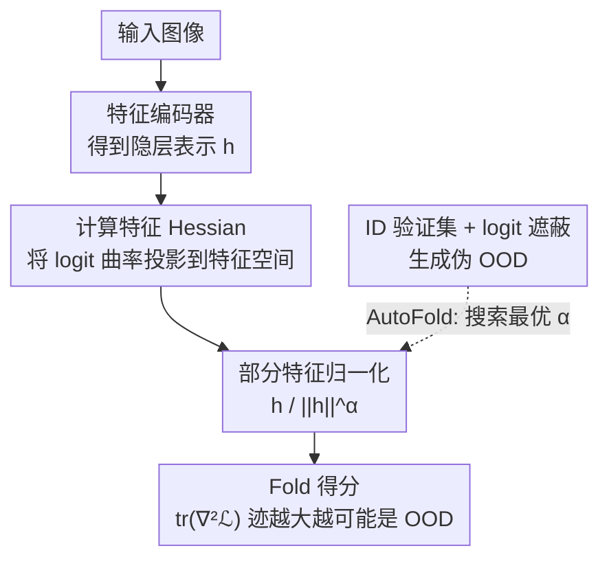

# Exploiting Local Flatness for Efficient Out-of-Distribution Detection

**会议**: ECCV 2026  
**arXiv**: [2606.29952](https://arxiv.org/abs/2606.29952)  
**代码**: [https://github.com/shpark97/Fold](https://github.com/shpark97/Fold)  
**领域**: AI 安全 / OOD 检测  
**关键词**: OOD检测, 损失景观曲率, 特征Hessian, 部分特征归一化, 自监督标定

## 一句话总结
本文首次系统分析了 OOD 样本与 ID 样本在损失景观曲率上的差异，发现 OOD 输入的 Hessian 曲率更大且随分布偏移加剧而增大；基于此提出轻量级 OOD 检测器 Fold，用特征空间 Hessian 替代昂贵的参数空间曲率近似，配合部分特征归一化增强 ID-OOD 可分性，并用自监督 logit 遮蔽（AutoFold）自动标定归一化参数，在多个 benchmark 上平均 AUROC 提升 1.63%、FPR95 降低 2.30%，计算开销仅与单次前向传播相当。

## 研究背景与动机

**领域现状**：OOD 检测的主流范式之一是 post-hoc 方法——直接在预训练模型上提取判别信号，无需重新训练。这些方法主要沿三个方向展开：基于输出层的不确定性估计（如 MSP、ODIN、Energy）、基于中间层激活的阈值截断（如 ReAct、ASH）、以及基于梯度或神经元统计量的方法（如 GradNorm）。其中，利用损失景观曲率通过 Laplace 近似估计贝叶斯后验是一条有理论吸引力的路线，但计算完整 Hessian 的开销与参数量平方成正比。

**现有痛点**：基于参数空间曲率的 OOD 检测方法（如 Laplace 近似类方法）虽然理论上优雅，但即使用 Hutchinson 随机估计等近似手段，计算成本仍然过高，无法在实时部署场景中使用。此外，这些方法隐含依赖一个未经严格验证的假设：ID 数据诱导的损失景观比 OOD 数据更平坦。

**核心矛盾**：曲率信号富含 ID/OOD 判别信息，但获取它的代价太高——参数空间 Hessian 的高昂计算成本与 post-hoc 方法追求的轻量高效之间存在根本冲突。同时，学界对这个"曲率差异"假设本身缺乏系统的实证检验，不知道差异有多大、在什么条件下成立。

**本文目标**：(1) 首次对 ID-OOD 曲率差异做系统性实证分析；(2) 在避开参数空间 Hessian 的前提下，设计一种能利用曲率信号的轻量 OOD 检测方法；(3) 解决超参数对数据集的敏感性，实现免外部 OOD 数据的自动标定。

**切入角度**：作者观察到 logit 空间的 Hessian 与完整参数 Hessian 有强烈的谱对应关系（Lee et al. 2023），而分类器的线性映射矩阵本身编码了 ID 特征的判别几何——如果把 logit 空间曲率通过分类器"输送"回特征空间，就能同时捕捉预测不确定性和特征空间的几何结构，且计算量远小于参数空间 Hessian。

**核心 idea**：用特征 Hessian（feature Hessian）替代参数 Hessian 来度量曲率，再用部分特征归一化放大 ID-OOD 曲率差距，最后用自监督 logit 遮蔽实现超参数的免 OOD 数据自动选择。

## 方法详解

### 整体框架

Fold 的整体流程分三步：给定一个输入，首先通过特征编码器得到隐层表示，计算其在特征空间中的 Hessian 曲率（将 logit 空间曲率经分类器权重矩阵投影回特征空间）；然后对特征做部分归一化（除以范数的 alpha 次幂，0 < alpha <= 1），压制幅度对曲率估计的退化影响；最后以归一化后特征 Hessian 的迹作为 OOD 检测得分——迹越大，越可能是 OOD。AutoFold 变体在前两步基础上，用 ID 验证集的 logit 遮蔽生成伪 OOD 样本来自动搜索最优 alpha，完全不再依赖外部 OOD 数据。

### 关键设计

**1. 特征 Hessian：将 logit 空间曲率投影到特征空间，用线性分类器的判别几何替代昂贵的参数 Hessian**

痛点很直接：参数 Hessian 捕获了 ID/OOD 的曲率差异，但对 ResNet-50 这样的网络，即使 Hutchinson 近似也仍然太慢。作者的关键洞察是，logit 空间 Hessian 保留了与完整 Hessian 相似的谱特性（Lee et al. 2023），但 logit 空间维度仅为类别数 C（如 ImageNet 的 1000），远小于参数量，计算轻得多。

然而，纯粹在 logit 空间测曲率丢掉了分类器自身编码的判别几何——分类器权重矩阵的 Jacobian 刻画了特征空间中各类别决策边界的走向，这些几何结构对 OOD 检测至关重要（如 VIM 方法所利用的）。因此作者用二阶链式法则将 logit 曲率"输送"回特征空间：

$$\nabla_{\mathbf{h}}^2 \mathcal{L} = (\nabla_{\mathbf{h}}g)(\nabla_{\mathbf{z}}^2 \mathcal{L})(\nabla_{\mathbf{h}}g)^\top$$

由于分类器 g 是线性层，其二阶导为零，右边第二项消失。这里 $\nabla_{\mathbf{h}}g \in \mathbb{R}^{C \times d}$ 就是分类器权重矩阵，$\nabla_{\mathbf{z}}^2 \mathcal{L}$ 是 logit 空间中对 energy 函数 $\mathcal{L}(\mathbf{z}) = \log(\sum \exp(z_i))$ 的 Hessian。结果是：特征 Hessian 将预测不确定性从 logit 空间沿着类别判别方向投影，使得曲率信号与分类器学到的特征流形对齐。消融实验（Table 4）证实特征 Hessian 在 ImageNet-200/1K 等复杂数据集上明显优于纯 logit Hessian（平均 AUROC 86.81 vs 86.02）。

**2. 部分特征归一化：用 $h / \|h\|^\alpha$ 压制幅度退化，在不同数据集上用不同 alpha 平衡方向与幅度信息**

特征 Hessian 有一个致命缺陷：它对特征范数高度敏感。特征范数越大，logit 越大，softmax 越趋于饱和，loss landscape 越平坦，导致 Hessian 趋近于零——此时曲率估计退化为无意义噪声。但完全归一化（令 alpha=1，即纯方向向量）也有问题：对于复杂数据集（如 ImageNet），特征幅度本身携带有用的细粒度语义信息，完全丢掉会严重损害检测性能（ImageNet-200 上 alpha=1 时 AUROC 从 87.64 掉到 79.02）。

作者提出的部分归一化公式为 $\widetilde{\bm{h}} = \bm{h} / \|\bm{h}\|^\alpha$，其中 $0 < \alpha \leq 1$。这等价于对 logit 施加一个样本依赖的温度缩放，在完全保留幅度（alpha=0）和完全归一化（alpha=1）之间连续调节。实验显示最优 alpha 与数据集复杂度相关：CIFAR-10 上 alpha 越大越好（~1.0），ImageNet 上则偏好较小的 alpha（~0.2），因为复杂数据需要保留幅度中的细粒度信息。

谱分析（Figure 6）给出了更深入的机理解释：不做归一化时，ID 与 OOD 的谱差异集中在前 10 个最大特征值（即最坏情况曲率）；完全归一化则使两条谱完全重叠，不可区分；而部分归一化在保持最大特征值差距的同时，在中段特征值范围拉大了谱分离——这说明它利用了更分布式的"平均情况"曲率信息，而非仅依赖最极端的几个方向。

**3. AutoFold：用 ID logit 遮蔽生成伪 OOD 信号，自监督搜索最优 alpha，彻底消除对外部 OOD 数据的依赖**

传统 post-hoc 方法的超参数调优需要一个辅助的 OOD 验证集，这在实际部署中意味着需要预知 OOD 分布——一个不现实的假设。AutoFold 的解法非常简洁：取一个 ID 验证样本（已知类别 k），将其第 k 个 logit 设为负无穷（$\tilde{z}_k = -\infty$），强制模型依赖剩余类别的 logit 做判断。这模拟了"遇到未知类"的预测模糊状态，生成了伪 OOD 信号，且全程不需要额外训练或重训。

具体搜索目标为：对 K 个类别分别做 logit 遮蔽，最大化原 ID 样本与遮蔽后样本 Fold 得分之间的 AUROC（即让两者尽量可分）。与留一类的训练时方法（需 K 轮重训）不同，AutoFold 完全是推理时操作，开销可忽略。搜索精度为 0.01 步长（100 个候选 alpha），而手动 Fold 只搜 10 个点，所以 AutoFold 偶尔能拿到比手动 Fold 更好的结果。更重要的是，它的 setup 时间比需要外部 OOD 验证集的竞争方法（KNN、VIM、RMDS 等）低数个数量级。

### 损失函数 / 训练策略

Fold 是纯 post-hoc 方法，不需要任何训练。唯一需要确定的超参数是归一化系数 alpha。对于标准 Fold，alpha 在 {0.1, 0.2, ..., 1.0} 上做网格搜索，以辅助 OOD 验证集上的 AUROC 为选择标准。对于 AutoFold，alpha 在 {0.01, 0.02, ..., 1.00} 上搜索，以公式 (7) 的自监督 AUROC 为选择标准。所有预训练模型保持冻结，ID 分类性能不受影响。

## 实验关键数据

### 主实验

下表为 Fold 及变体在 CIFAR 和 ImageNet 四个 benchmark 上与代表性基线的平均比较（完整结果见 Table 2）：

| 方法 | CIFAR-10 AUROC / FPR95 | CIFAR-100 AUROC / FPR95 | ImageNet-200 AUROC / FPR95 | ImageNet-1K AUROC / FPR95 | 平均 AUROC / FPR95 |
|------|------------------------|------------------------|---------------------------|--------------------------|---------------------|
| MSP | 89.83 / 37.21 | 78.60 / 57.40 | 87.41 / 43.19 | 81.55 / 57.14 | 84.35 / 48.73 |
| EBO | 90.00 / 48.24 | 80.15 / 56.26 | 87.51 / 45.01 | 84.03 / 50.46 | 85.42 / 49.99 |
| ReAct | 89.31 / 51.12 | 80.52 / 54.93 | 88.13 / 42.10 | 87.15 / 42.46 | 86.28 / 47.65 |
| VIM | 91.88 / 31.65 | 79.46 / 54.70 | 86.23 / 39.99 | 84.44 / 43.34 | 85.50 / 42.42 |
| KNN | 92.19 / 27.52 | 81.66 / 56.17 | 88.52 / 40.43 | 82.55 / 48.83 | 86.23 / 43.24 |
| ASH | 77.42 / 81.61 | 79.79 / 61.37 | 89.29 / 42.33 | 88.71 / 37.02 | 83.80 / 55.58 |
| **Fold** | 92.46 / 29.43 | 81.94 / 51.62 | 88.65 / 40.30 | 85.74 / 48.35 | **87.20 / 42.42** |
| **Fold-r** | 92.30 / 30.65 | 82.22 / 50.55 | 89.07 / 38.92 | 88.04 / 40.36 | **87.91 / 40.12** |
| **Fold-a** | 89.43 / 49.18 | 81.98 / 54.26 | 89.68 / 37.06 | 88.28 / 37.03 | **87.34 / 44.38** |

Fold-r（与 ReAct 结合）取得最佳平均结果，AUROC 87.91%、FPR95 40.12%，较之前最优基线分别提升 1.63% 和 2.30%。Fold-a（与 ASH 结合）在 ImageNet 上尤为突出。关键的是，Fold 系列方法在 CIFAR 和 ImageNet 大规模场景下性能一致稳定，不像某些基线在不同 benchmark 间波动剧烈。

### 消融实验

| 消融配置 | CIFAR-10 AUROC | ImageNet-200 AUROC | 说明 |
|---------|---------------|-------------------|------|
| Logit Hessian（无特征投影） | 92.52 | 86.35 | 去掉特征空间投影，纯 logit 曲率 |
| Feature Hessian（Fold 完整） | 92.46 | 88.65 | 完整特征 Hessian；复杂数据集上优势明显 |
| alpha=0（无归一化） | 89.72 | 87.81 | 不做归一化，CIFAR 上几乎没影响 |
| alpha=1（完全归一化） | 92.46 | 62.23 | ImageNet 上完全归一化严重退化 |
| 部分归一化（最优 alpha） | 92.46 | 88.65 | 保留适量幅度信息，效果最好 |
| 部分归一化对各基线平均增益 | +4.00 AUROC (CIFAR-10) | +2.27 AUROC (ImageNet-200) | 部分归一化作为即插即用组件普遍有效 |

### 关键发现

- 部分归一化的贡献在复杂数据集上远大于简单数据集：CIFAR-10 上 alpha=0、部分、alpha=1 三者差距不大，ImageNet-200 上 alpha=1 直接让平均 AUROC 从 87.64 崩到 79.02，说明复杂场景下特征幅度中的语义信息不可丢弃。
- Cohen's d 效应量分析（Figure 5）表明部分归一化将 ID-OOD 得分分布的可分性从 1.605 提升到 1.689，同时 OOD 方差显著压缩；而完全归一化后 Cohen's d 坍缩到 0.520，两组分布几乎重叠。
- AutoFold 在 CIFAR-100 上略逊于手动调参（79.76 vs 81.94 AUROC），但在其他三个 benchmark 上均接近或匹配最优，且完全不需要 OOD 数据。在 ImageNet-1K 上，AutoFold 的 setup 时间远低于 KNN（需收集所有训练特征）和 VIM（需估计 PCA 子空间），且这些基线的 setup 时间还未计入它们在外部 OOD 验证集上做超参数搜索的开销。
- 跨架构泛化（Table 5）：Fold 在 RegNet、DenseNet、WRN、ResNeXt 四种不同 backbone 上均稳定优于基线，Fold-a 取得平均最高 AUROC 87.08%。

## 亮点与洞察

- **特征 Hessian 的推导非常干净**：利用分类器为线性层的性质，二阶链式法则的复杂项直接消失，得到 $(\nabla_{\mathbf{h}}g)(\nabla_{\mathbf{z}}^2 \mathcal{L})(\nabla_{\mathbf{h}}g)^\top$ 这个简洁形式——本质上就是在分类器权重矩阵定义的判别子空间中度量 logit 曲率。这种"用线性层的特殊结构化简复杂公式"是值得记住的技巧。
- **部分归一化是通用增强组件**：Table 3 显示把部分归一化加到 MSP、EBO、ReAct、ASH 上均有稳定增益，且效果优于完全归一化。这意味着它不限于 Fold 自身，可以即插即用到任何依赖特征表示的 post-hoc 方法。它为"特征幅度到底该不该留"这个 OOD 领域的老问题提供了一个优雅的答案：根据数据集复杂度自适应地留一部分。
- **logit 遮蔽作为伪 OOD 生成**：不需要训练、不需要外部数据、不需要生成模型，仅将真实类 logit 置为负无穷就能制造出有效的伪 OOD 信号。这个思路简单但巧妙，本质上利用了分类器在失去"正确答案"后的行为来模拟遇到未知类的情形。
- **理论分析虽简化但自洽**：在二分类高斯混合模型的设定下，作者证明了 OOD 样本的期望特征 Hessian 迹确实更大，条件是 $c|\mu^\top \Sigma^{-1} R\mu| \leq \mu^\top \Sigma^{-1} \mu$。这个条件直观上意味着分布偏移不能太极端以至于改变分类边界的相对方向。

## 局限与展望

- **理论分析的简化假设**：定理 6.1 建立在二分类、高斯混合、线性分类器的设定上，且未纳入部分归一化的影响。实际中面对的是深度非线性网络的多分类场景，理论与实验之间存在显著 gap。但作者诚实标注了这一点，将其定位为"直觉支撑"而非严格保证。
- **alpha 的物理含义不明确**：虽然实验清晰展示了不同数据集的最优 alpha 不同，但对"为什么 CIFAR 需要 ~1.0、ImageNet 需要 ~0.2"的解释停留在数据集复杂度的定性层面，缺乏定量的特征幅度分布分析来指导 alpha 选择。
- **AutoFold 在 CIFAR-100 上的降级**：自监督选出的 alpha 在该场景下明显不如手动在 OOD 验证集上调参（AUROC 差距约 2.2%），说明 logit 遮蔽生成的伪 OOD 无法完全模拟某些真实 OOD 的曲率特征。可能原因是 CIFAR-100 类间语义更细粒度，遮蔽一个类后残差 logit 的模式仍与真实 OOD 不同。
- **对网络结构的隐性依赖**：特征 Hessian 的推导依赖分类器为线性层——这对 ResNet 等标准架构成立，但对使用非线性分类头（如某些 ViT 变体）的模型可能需要重新推导。
- **改进思路**：(1) 用特征幅度的 per-class 统计量替代全局 alpha，实现类别自适应的部分归一化；(2) 将 Fold 得分与其他互补信号（如距离类方法 VIM/KNN）做 ensemble，因为曲率信号和距离信号可能捕获不同类型的分布偏移；(3) 探索是否可以用更细粒度的 logit 遮蔽策略（如遮蔽 top-k 个 logit 而非仅真实类）生成更逼真的伪 OOD 信号。

## 相关工作与启发

- **vs 参数空间 Laplace 近似方法（Ritter 2018, Kristiadi 2020）**: 它们用参数 Hessian 的 Laplace 近似估计贝叶斯后验，优点是有理论支撑，缺点是即使经过 KFAC 等近似仍需大量计算。Fold 的贡献在于指出"你不需要参数 Hessian——logit Hessian 加分类器投影就够了"，把计算量从 O(参数量的平方) 级降到 O(特征维度的平方) 级，且后者在 ResNet 中通常只有 512-2048，远小于参数总量。
- **vs ReAct / ASH（Sun 2021, ASH）**: 这些方法通过截断或裁剪异常激活值来增强 ID-OOD 分离，Focus 在特征值的幅度分布；Fold 则是从曲率角度切入，关注 loss landscape 的平坦度。两者互补：Fold-r 和 Fold-a 的组合实验直接证明曲率信号 + 激活塑形可以叠加收益。但 ReAct/ASH 需要手动设阈值，Fold 的超参数 alpha 有 AutoFold 自动选择。
- **vs VIM / KNN（Wang 2022, Sun 2022）**: VIM 用特征残差与 PCA 主空间的偏离做检测，KNN 用特征空间的近邻距离。这些方法本质上度量"特征在训练分布中的典型性"，而 Fold 度量"模型对输入的敏感度"——一个截然不同的信号源。实验显示 Fold 在 ImageNet 上的效率优势尤其明显，因为不用维护训练集特征库或 PCA 基。
- **vs 基于梯度的方法（GradNorm）**: GradNorm 用梯度范数做 OOD 得分，与 Fold 同为"模型敏感度"信号但算的是参数梯度而非特征 Hessian。特征 Hessian 的优势在于它天然排除了分类器权重的影响（因为线性层二阶导为零），更集中在特征流形本身上。

## 评分
- 新颖性: ⭐⭐⭐⭐ 首次系统验证 ID-OOD 曲率差异的实证规律，特征 Hessian + 部分归一化的组合简洁有效，logit 遮蔽自监督标定是一条漂亮的新路线；但基本组件（energy score、特征 Hessian 的推导、归一化）分别有前人工作铺垫。
- 实验充分度: ⭐⭐⭐⭐⭐ 覆盖 4 个 benchmark（CIFAR-10/100, ImageNet-200/1K），对比 10+ 基线，消融覆盖特征 Hessian vs logit Hessian、三种归一化方案、alpha 敏感度全谱、跨架构泛化、推理时间测量、谱分析、Cohen's d 效应量——几乎每种设计选择都有对应的消融证明。
- 写作质量: ⭐⭐⭐⭐ 结构清晰，从观察到方法到实验再到理论的线性叙事流畅；方法部分的推导步骤完整；但 Section 7 Discussion 略显散乱，且理论部分与方法的对应关系交代得不够紧密。
- 价值: ⭐⭐⭐⭐ 为 post-hoc OOD 检测提供了一个新的信号维度（曲率），计算成本低到实际可用；部分归一化是通用插件，AutoFold 解决了部署中的一阶痛点（需要 OOD 数据调参）。适合作为实时 OOD 检测系统的基底方法。

<!-- RELATED:START -->

## 相关论文

- [\[CVPR 2026\] RankOOD: Class Ranking-based Out-of-Distribution Detection](../../CVPR2026/ai_safety/rankood_-_class_ranking-based_out-of-distribution_detection.md)
- [\[CVPR 2026\] Enhancing Out-of-Distribution Detection with Extended Logit Normalization](../../CVPR2026/ai_safety/enhancing_out-of-distribution_detection_with_extended_logit_normalization.md)
- [\[CVPR 2026\] Bypassing the Transport Plan: Dynamic Reweighting for Out-of-Distribution Detection with Optimal Transport](../../CVPR2026/ai_safety/bypassing_the_transport_plan_dynamic_reweighting_for_out-of-distribution_detecti.md)
- [\[CVPR 2026\] Sparsity as a Key: Unlocking New Insights from Latent Structures for Out-of-Distribution Detection](../../CVPR2026/ai_safety/sparsity_as_a_key_unlocking_new_insights_from_latent_structures_for_out-of-distr.md)
- [\[ICLR 2026\] AP-OOD: Attention Pooling for Out-of-Distribution Detection](../../ICLR2026/ai_safety/ap-ood_attention_pooling_for_out-of-distribution_detection.md)

<!-- RELATED:END -->
