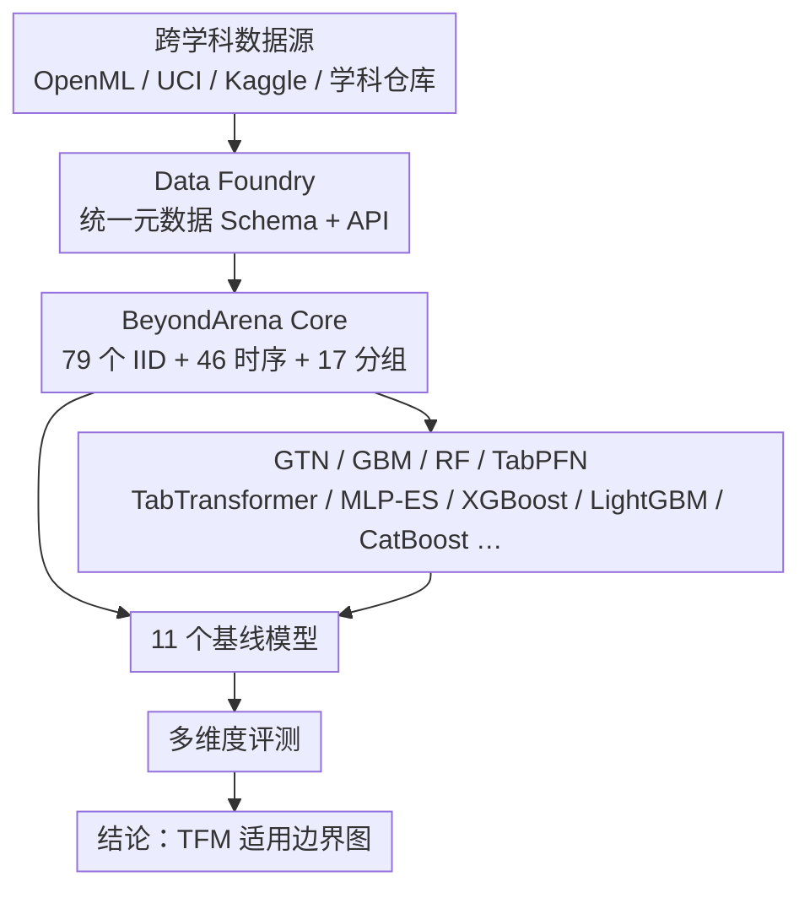

# Beyond IID: How General Are Tabular Foundation Models, Really?

**会议**: misc  
**arXiv**: [2606.30410](https://arxiv.org/abs/2606.30410)  
**领域**: 机器学习 / 表格数据 / 基准测评  
**关键词**: Tabular Foundation Models, IID Generalization, Non-IID, Benchmark, Data Foundry

## 一句话总结

本文构建了首个统一、跨学科的表格数据基准 BeyondArena（含 142 个数据集、覆盖 IID/时序/分组任务），系统评测 11 个主流表格基础模型后发现：当前模型仅在中小规模 IID 数据上领先，而在非 IID、大规模、高维度场景中传统树模型和深度学习模型仍占主导。

## 研究背景与动机

预训练基础模型在 NLP 和视觉领域的成功催生了表格基础模型（Tabular Foundation Model, TFM）的热潮——这类模型将表格行/列视为序列，通过大规模预训练学习跨数据集的通用模式，以期在少样本或零样本设定下超越传统树模型（XGBoost / LightGBM / CatBoost）和 DNN。学术界和工业界近年来涌现了大量 TFM（如 TabPFN、TabTransformer 变体、FT-Transformer 等），并在各个学科数据集上被反复评测。然而，这些评测分散在各学科论文中，使用的协议、数据版本和评估指标千差万别——模型研究者根本无法系统对比不同 TFM 的实力边界。

标准基准（如 OpenML-CC18）虽然统一了协议，却存在一个隐蔽但致命的偏置：它们几乎只包含中小规模的 IID 分类/回归任务。这正是 TFM 最容易表现好的区间。在这样的基准上反复迭代，研究者倾向于在 IID 方向上做边际改进，而表格数据真实的挑战——时序依赖、分组结构、高维特征、大规模样本——被系统性地排除在外。核心矛盾在于：TFM 宣称具有「基础」模型的泛化能力，但现有基准从未真正考验它们在非 IID、大规模、高维场景下的泛化极限。**本文的核心 idea 是：构建一个覆盖多任务类型（IID、时序、分组）、多规模尺度（样本数、特征维度）、多特征类型（含文本、高基类别）的统一基准 BeyondArena，系统回答 TFM 究竟在哪些场景下真正有用、又在哪些场景下不如传统方法。**

## 方法详解

这篇论文的核心贡献是评测基准和支撑框架，而非一个新方法。在结构上，它将"如何构建一个全面的表格基准"本身作为方法论来讲述。

### 整体框架

BeyondArena 基准的构建遵循两条主线：一是**数据治理**——如何从异构学科来源筛选、标注、统一表格数据集；二是**评测协议**——如何定义多任务类型（IID / 时序 / 分组）及其评估标准。整体流程分为四个阶段：数据集搜集与元数据标注 → 统一转化为 Data Foundry 标准格式 → 按任务类型分组 → 运行 11 个基线模型并聚合结果。以下框架图呈现这一流程：

**Data Foundry 层**是支撑 BeyondArena 的基础设施——一个 Python 框架与元数据 Schema，负责把来自不同学科（生物学、经济学、医学、物理……）的异构数据统一定义为包含 `task_type`（iid / temporal / grouped）、`n_samples`、`n_features`、`feature_types`（numeric / categorical / text / high_cardinality）等字段的元数据格式。这解决了学科间评测碎片化的根本问题：任何学科的数据集经过 Data Foundry 描述后都能在统一协议下与其他数据集对比。

### 关键设计

**1. 四维任务空间：超越 IID 的结构化评测**

现有表格基准只玩 IID 一个维度。BeyondArena 在任务类型上做了**结构化展开**：IID（标准分类/回归）、Temporal（时序依赖，如股票预测）、Grouped（分组结构，如按患者分组的医疗数据）。每种任务类型都有对应的评估协议——时序任务要求前向验证而非随机交叉验证，分组任务要求组级别而非样本级别的泛化。这种设计使得评测结果能回答「不同 TFM 在什么数据形态下有效」，而非仅仅「哪个模型平均分最高」。评测维度同时覆盖样本规模（tiny < 500 到 large > 100K）和特征维度（low < 20 到 high > 1000），形成一个二维适用边界图。

**2. Data Foundry：学科无关的元数据治理方案**

标准基准开放重复使用而缺乏学科多样性；学科特定评测数据丰富但协议不统一。Data Foundry 通过一个轻量级的 YAML 元数据 Schema + Python API 作为中间层——每个数据集只需补充一个 `foundry.yaml` 文件描述其来源、任务类型、特征类型、许可信息，就可以被 BeyondArena 评测管线消费。这个设计的关键巧妙之处在于它不要求数据格式统一（仍然允许 CSV、Parquet、ARFF 等原始格式），只在元数据层统一描述，从而最小化了数据迁移成本。Data Foundry 本身是一个可独立复用的工具，未来其他表格模型基准可以直接采用其 Schema。

**3. 系统性的失败分析框架**

与传统基准只报告汇总平均分数不同，BeyondArena 在所有结果上公开记录了每个模型-数据集对的完整表现，并按三个维度切片分析——任务类型、样本规模、特征维度。这种设计使得失败模式一目了然：TabPFN 在 tiny-to-medium IID 分类数据上几乎无敌，但在时序任务上不如传统 LightGBM；FT-Transformer 在大样本场景下输给 XGBoost；高维度下所有 TFM 均不如 GBMs。每个「输掉」的场景都有明确的模型-数据集对应关系，而非模糊的「总体 Avg Rank」。

### 一个完整示例

以 TabPFN（当前最受欢迎的 TFM）为例走一遍 BeyondArena 的数据管线：首先，其训练配置与推理代码被包装到 Data Foundry 的 `ModelAdapter` 接口中，保留其默认的零样本超参。然后从 142 个已注册数据集中选取一个时序任务——某股票波动率预测数据集（n=5,000, features=12）——触发 Temporal 评测协议：按日期切 70/30 前向验证。结果 TabPFN 的 RMSE 比 CatBoost 高 15%。这个例子清晰地揭示了 TabPFN 的适用边界：它依赖 IID 假设，不能利用时序模式的连续性。

## 实验关键数据

### 主实验：11 模型 × 142 数据集总体表现

| 设定 | 最佳模型 | 关键发现 |
|------|---------|---------|
| IID tiny-to-medium（<10K 样本） | TabPFN / 其他 TFM | TFM 在 IID 分类上显著领先传统方法，尤其 <1K 时优势最大 |
| IID 大样本（>10K） | XGBoost / LightGBM / CatBoost | GBM 重回榜首，TFM 随样本增加优势消失 |
| 时序任务 | LightGBM / CatBoost | 所有 TFM 均不如 GBMs，差距可达 10%+ |
| 分组任务 | 随机森林 / XGBoost | TFM 在分组泛化上不稳定 |
| 高维特征（>500） | 弹性网络 / LightGBM | TFM 在高维下表现最差 |
| 含文本特征 | TabPFN / FT-Transformer | TFM 优势——能处理文本特征是其核心卖点之一 |

### 消融与分析

| 分析角度 | 关键结论 |
|---------|---------|
| 样本规模与 TFM 优势的关系 | TFM 的优势随训练样本数单调递减，拐点约在 3K-10K 样本 |
| 特征维度影响 | 维度 > 100 时 TFM 开始落后 GBM；> 500 时全面落败 |
| 任务类型影响 | TFM 在 IID 分类任务上最强，回归次之，时序/分组显著弱 |
| 预训练数据偏置 | TFM 在物种/医疗数据上的表现受限于预训练数据分布 |
| 模型间排名一致性 | 在不同学科数据上，TFM 排名不一致——没有单一 TFM 在所有场景都赢 |

### 关键发现

- **TabPFN 是 IID 小样本王者**：在 <1K 样本的 IID 分类上，TabPFN 的准确率平均比 GBM 高 5-8 个百分点，这是 TFM 最有说服力的应用场景。但样本超过 10K 后，这个优势消失。
- **时序和分组是 TFM 的阿克琉斯之踵**：所有 TFM 在这两类非 IID 任务上均显著不如传统方法，因为 TFM 的训练目标天然假设样本独立同分布。
- **「基础」之名尚未兑现**：真正的基础模型应该在不同数据形态下均有竞争力，而当前 TFM 在非 IID/大规模/高维场景上系统性失败——距离「表格基础模型」还有实质差距。

## 亮点与洞察

- **四维消融带来的泛化边界图**：比「模型 A 比 B 好 X%」更有价值的是「模型 A 在什么条件下好、在什么条件下差」——BeyondArena 的结构化切片分析为实际选型提供了可操作指南：TFM 优先用于 IID 小样本分类，GBM 用于时序和大样本场景。
- **Data Foundry 作为开源基础设施**：将元数据治理与评估管线解耦的设计使得 BeyondArena 可以无限扩展——任何学科的新数据集只需一个 YAML 文件就能加入评测。这种「接口标准 > 数据格式统一」的思路值得其他基准项目参考。
- **「系统性失败分析」取代「汇总排名」**：多数基准只关心谁第一，而 BeyondArena 把「每个模型在哪些场景输、输给谁」公开记录下来，让后续研究者知道改进方向。这种透明度在 ML 基准领域少有。

## 局限与展望

- **模型版本快照**：评测结果仅代表截至投稿时各 TFM 的版本（TabPFN v2、TabTransformer 特定 checkpoint），随着模型更新结论可能变化。BeyondArena 设计了版本追踪机制，但需要社区持续维护。
- **数据集覆盖有领域偏置**：尽管 142 个数据集覆盖多样学科，但这些数据集本身倾向于基准常见任务（OpenML 主导），真实的「长尾表格数据」场景（如极稀疏、不规则采样）尚未覆盖。
- **计算成本未纳入评测**：评测只比较预测性能，不考虑推理速度、内存消耗。TFM（尤其 TabPFN 的推理）计算成本远高于树模型，这在生产环境中可能是决定性因素。
- **未来方向**：TFM 需要针对性改进对时序依赖和非 IID 结构的学习能力；Data Foundry 可扩展为社区维护的活基准（leaderboard + 自动 CI 评测）。

## 相关工作与启发

- **vs TabPFN / FT-Transformer / TabTransformer**: 这些 TFM 在各自论文中只评测了 IID 分类/回归，而 BeyondArena 揭示了它们在非 IID 设定下的系统性劣势——这是 TFM 社区最需要的现实检视。
- **vs OpenML-CC18 / AutoML benchmarks**: 这些经典基准是 IID 偏置的代表，BeyondArena 首次填补了非 IID 场景的空白。
- **vs 学科特定评测**: 各学科有自己的 benchmark（如医疗 MIMIC、金融股票预测），但 BeyondArena 通过 Data Foundry 将它们统一在同一协议下——这是跨学科对比的第一个尝试。

## 评分

- 新颖性: ⭐⭐⭐⭐ 首次系统评测 TFM 在非 IID 场景下的泛化极限，Benchmark 论文的核心贡献是问题定义和实验框架，而非方法——这方面做得扎实。
- 实验充分度: ⭐⭐⭐⭐⭐ 142 数据集 × 11 模型，覆盖 IID/时序/分组、多规模多维度，实验非常充分。
- 写作质量: ⭐⭐⭐⭐ 结构清晰，结论有数据支撑，但部分消融图表的解读可以更深入。
- 价值: ⭐⭐⭐⭐⭐ 填补了 TFM 评测的重要空白——比一篇新 TFM 方法论文对该领域的长远指导意义更大。

<!-- RELATED:START -->

## 相关论文

- [\[AAAI 2026\] Towards Effective, Stealthy, and Persistent Backdoor Attacks Targeting Graph Foundation Models](../../AAAI2026/ai_safety/towards_effective_stealthy_and_persistent_backdoor_attacks_targeting_graph_found.md)
- [\[ICCV 2025\] A Framework for Double-Blind Federated Adaptation of Foundation Models](../../ICCV2025/ai_safety/a_framework_for_doubleblind_federated_adaptation_of_foundati.md)
- [\[CVPR 2026\] Federated Active Learning Under Extreme Non-IID and Global Class Imbalance](../../CVPR2026/ai_safety/federated_active_learning_extreme_noniid.md)
- [\[ICLR 2026\] MUSE: Model-Agnostic Tabular Watermarking via Multi-Sample Selection](../../ICLR2026/ai_safety/muse_model-agnostic_tabular_watermarking_via_multi-sample_selection.md)
- [\[ICLR 2026\] Convergent Differential Privacy Analysis for General Federated Learning](../../ICLR2026/ai_safety/convergent_differential_privacy_analysis_for_general_federated_learning.md)

<!-- RELATED:END -->
