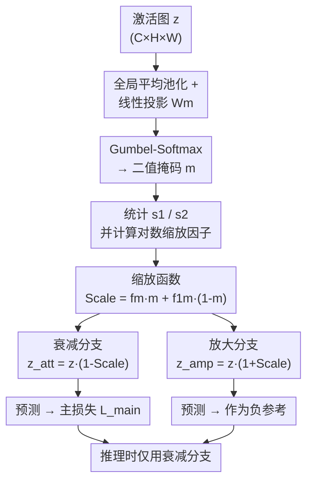

# Improving Adversarial Robustness via Activation Amplification and Attenuation

**会议**: ECCV 2026  
**arXiv**: [2606.27784](https://arxiv.org/abs/2606.27784)  
**代码**: [https://github.com/tgoncalv/A3](https://github.com/tgoncalv/A3)  
**领域**: AI 安全  
**关键词**: 对抗鲁棒性, 激活缩放, 插拔式防御, 对比学习, 排名损失

## 一句话总结

本文提出 A3（Activation Amplification and Attenuation），一个轻量的可学习激活缩放模块，通过同一组参数实现激活放大与衰减两种模式——训练时利用放大模式的降级预测作为负参考构造对比/排名损失，推理时仅用衰减模式即可在不引入显著计算开销的前提下提升对抗鲁棒性。

## 研究背景与动机

对抗攻击通过在输入上添加人眼不可察的微小扰动来误导深度神经网络的预测，已成为 AI 安全领域的核心威胁。现有防御策略大致分为两类：一类是改进训练策略（如 AT、TRADES、MART），在 min-max 框架中生成对抗样本并优化模型参数；另一类是在骨干网络中插入轻量模块，直接修改中间层的特征表示来增强内在鲁棒性。近年来的插拔模块大多遵循一个共同范式：计算一个掩码来识别并压制非鲁棒特征——CAS 和 CIFS 检测非鲁棒特征集中的通道并逐样本压制，FPCM 从频率域入手重配高低频分量。然而 FSR 等近期工作指出，完全丢弃非鲁棒特征并非最优选择，因为这些特征中仍可能保留部分有用的预测信号，并因此提出将特征分为鲁棒和非鲁棒两部分后重组非鲁棒分量的策略。

这种「压制 vs. 保留」的矛盾本质上是平衡问题：既要削弱对抗扰动引入的噪声影响，又不能矫枉过正丢失判别信息。A3 的作者注意到，OOD 检测领域的近期工作（ASH、SCALE）发现一个有趣现象——在能量分数函数中适当缩放激活值可以显著拉大 ID 与 OOD 样本之间的分数差距。既然对抗样本本质上也属于一种分布外数据，这一思路是否可以迁移到对抗鲁棒性中？不同于 OOD 检测仅在推理时用缩放改善分数分离，对抗训练需要全程可微的端到端优化，并且可以更进一步：既然缩放能把「有用」和「无用」的信号分开，那能否同时训练模型不仅学会衰减无用信号，还要学会主动放大无用信号作为「反面教材」？

**核心 idea**：设计一个可学习的激活缩放模块 A3，同一组可学习参数通过反转缩放操作的符号即可在「放大」和「衰减」两种模式间切换——训练时并行输出衰减分支（用于正常预测）和放大分支（作为负参考），通过排名损失确保衰减分支的预测损失始终低于放大分支，同时用对比对数损失拉近衰减分支在干净和对抗样本上的 logits 并推远与放大分支的距离，从而在推理时只用衰减分支即可获得更强的鲁棒表示。

## 方法详解

### 整体框架

A3 是一个即插即用模块，可插入骨干网络中间某层（通常是最后一层 block）之后。其核心处理流程如下：输入当前层的激活图 z，首先通过全局平均池化和可学习线性投影得到通道级特征，再经 Gumbel-Softmax 近似采样得到一个通道级的二值掩码 m。利用该掩码和原始激活幅度分布计算两个缩放因子 fm 和 f1m，再组合为最终的缩放函数 Scale(z,m) ∈ [0,1]。通过简单的符号翻转即可同时得到衰减版本 z_att = z·[1 − Scale(z,m)] 和放大版本 z_amp = z·[1 + Scale(z,m)]。训练时两个分支同时运行：衰减分支的输出用于主损失，放大分支的输出作为负参考参与排名损失和对比损失；推理时只保留衰减分支。

### 关键设计

**1. 可微的通道级掩码生成**

A3 需要识别哪些通道携带「需要被差异化处理」的激活模式。它对当前层的激活图先做全局平均池化（GAP），将空间维度压缩为通道级描述向量，再通过可学习权重矩阵 Wm ∈ R^(C×C) 线性投影到同一维度，最后经 Gumbel-Softmax 得到近似二值的掩码 m。Gumbel-Softmax 通过重参数化技巧将离散采样平滑为连续可微操作，避免了传统 top-k 硬阈值导致的梯度模糊问题——这正是前驱工作 k-WTA 被适应性攻击攻破的根本原因。消融实验表明，用硬阈值替代 Gumbel-Softmax 后 A3 仍有鲁棒性提升（说明缩放机制本身有效），但可微版本高出约 4 个百分点的 AA 精度。

**2. 基于激活幅度的对数缩放因子**

掩码 m 确定后需要计算一个具体的缩放量。A3 统计两个标量：s1 = 全部通道激活绝对值之和（衡量整体激活强度），以及 s2 = 被掩码选中通道的激活绝对值之和（衡量「待处理通道」的激活强度）。定义 fm = ln(1+s2)/ln(1+s1)，f1m = 1 − fm，则最终缩放函数为 Scale = fm·m + f1m·(1−m)，即被掩码选中的通道乘以 fm、未选中的乘 f1m。对数公式相比 OOD 检测中使用的指数公式有两个关键优势：一是导数随输入增大平滑衰减，有效缓解对抗训练中扰动引起的梯度尖峰问题；二是天然有界性（s2 ≤ s1 保证了 fm ∈ [0,1]），确保缩放操作不会过度畸变原始激活。消融实验比较了线性、二次、指数和对数四种变体，对数版在 PGD-100 上高出线性版约 7.5 个百分点。

**3. 符号翻转的双模式机制与对比排名损失**

A3 最巧妙的设计是同一组参数同时支持两种模式：z_att = z·(1−Scale) 和 z_amp = z·(1+Scale)。由于 Scale 始终在 [0,1] 之间，激活值在衰减模式被压缩到 [0, z] 区间，放大模式被扩展到 [z, 2z] 区间。Grad-CAM 可视化清晰显示：衰减分支抑制了激活图中与背景等无关区域的响应、聚焦于类别相关区域，而放大分支则反向强化了无关区域。推理时只用衰减分支，但放大分支扮演了不可或缺的「负面教师」角色——正是它的降级预测为排名损失提供了明确优化目标。具体地，A3 定义了两种辅助损失：排名损失 L_rank = max(CE(p_att^adv, y) − CE(p_amp, y), 0) 以 hinge 形式确保衰减分支的交叉熵损失严格低于放大分支；对比对数损失 L_cl = −log(exp(sim(l_att^adv, l_att)/τ) / [exp(sim(l_att^adv, l_att)/τ) + exp(sim(l_att^adv, l_amp)/τ)]) 拉近衰减分支在干净和对抗样本上的 logits，同时将其与放大分支的 logits 拉开。两者的消融实验显示 L_rank 贡献更大（去掉后 AA 从 47.28% 降至 45.41%），且 hinge 公式优于直接用交叉熵差值的形式。

### 损失函数/训练策略

A3 的总损失为 L = L_main + λ_rank·L_rank + λ_cl·L_cl，其中 L_main 是所选对抗训练方法的主损失（可根据 AT、TRADES 或 MART 灵活替换）。默认权重 λ_rank=1, λ_cl=5。训练使用 PGD-10 生成对抗样本（扰动上界 ε=8/255，步长 ε/4），SGD 优化器（momentum 0.9, weight decay 5e−4），初始学习率 0.1 并在第 75/90 epoch 衰减 10 倍，共 100 epoch。超参数 τ_m = 0.1（Gumbel-Softmax 温度），τ_cl = 10（对比损失温度）。A3 模块插入位置：ResNet-18 的 block 4 后，WideResNet-34-10 的 block 3 后。

## 实验关键数据

### 主实验

以 ResNet-18 在 CIFAR-10/100 上 AT 训练为例：

| 数据集 | 攻击 | 基线 (AT) | +A3 | 提升 |
|--------|------|-----------|-----|------|
| CIFAR-10 | PGD-100 | 47.51 | 57.01 | +9.50 |
| CIFAR-10 | C&W | 48.19 | 52.33 | +4.14 |
| CIFAR-10 | Ensemble | 46.05 | 51.04 | +4.99 |
| CIFAR-10 | AutoAttack | 44.28 | 47.28 | +3.00 |
| CIFAR-100 | PGD-100 | 24.16 | 31.78 | +7.62 |
| CIFAR-100 | Ensemble | 22.85 | 26.52 | +3.67 |

在 WideResNet-34-10 上增益更加显著：AT 训练下 CIFAR-10 AutoAttack 从 48.18% 提升到 51.62%（+3.44%），CIFAR-100 从 23.70% 提升到 27.68%（+3.98%）。在 Tiny ImageNet 上也呈现一致增益。A3 兼容多种对抗训练策略：在 TRADES 和 MART 框架下同样取得持续提升，且不依赖特定训练范式。

### 消融实验

| 配置 | Ensemble | AA | 说明 |
|------|----------|-----|------|
| A3 (完整) | 51.04 | 47.28 | 完整模型 |
| w/o L_cl | 50.24 | 46.70 | 去掉对比损失 |
| w/o L_rank | 48.11 | 45.41 | 去掉排名损失后显著下降 |
| 纯衰减无放大训练 | 48.73 | 46.72 | 去掉双模式，仅作为常规缩放模块 |
| Hinge → CE差值 (Eq.13a) | 48.74 | 46.84 | 去掉 hinge 后部分退化 |
| 对数 → 线性缩放 | 48.58 | 46.85 | 换用线性缩放公式 |

### 关键发现

- 排名损失贡献最大：去掉 L_rank 后 Ensemble 从 51.04% 降至 48.11%，说明放大分支作为负参考的 hinge 排名机制是鲁棒性提升的核心驱力
- 对数缩放公式在六种变体中表现最优，验证了对数形式在梯度稳定性和有界性上的双重优势
- A3 极为轻量：ResNet-18 仅增加 0.27M 参数（相对增加 2.4%）和 0.0021G FLOPs，远低于 FSR（+1.26M）和 FTA2C（+10.71M）；WideResNet-34-10 增加 0.41M 参数
- 衰减模式还能降低模型对对抗样本的过度自信：Expected Calibration Error (ECE) 从 14.62%（基线）降至 11.12%（A3 衰减模式），而放大模式的 ECE 升至 26.90%
- 模块对位置敏感：插在 ResNet-18 浅层（block 1-3）鲁棒性提升有限，block 4 最佳；同时在 block 3+4 插入反而导致精度大幅下降（AA 跌至 36.87%）

## 亮点与洞察

- 本文最巧妙的设计是「用降级来促进升级」：让模型同时学如何把预测做差（放大模式）和做好（衰减模式），将两者之间的差距作为优化信号——这比单纯压制非鲁棒特征更灵活，因为模型必须真正理解哪些信号是有用或有害的，才能在高维空间中找到优劣分界线
- 符号翻转机制极其优雅，同一组参数通过改变一个符号即可切换放大/衰减，在训练时互为负/正参考而不需要额外参数
- 将 OOD 检测中的激活缩放思路迁移到对抗训练领域，并且通过 Gumbel-Softmax 替换不可微的 top-k 操作+对数替换指数缩放，解决了两个关键适配挑战：梯度模糊和数值不稳定

## 局限与展望

- A3 在干净图像上的准确率相比基线略有下降（约 0.5-1%），作者认为这是因为干净图像中缺乏需要衰减的有害激活，无法从衰减操作中获益
- 模块的插入位置高度敏感：如果插在浅层会严重干扰低层特征学习（WideResNet block 1 后 AA 仅 42.55% vs. block 3 的 51.62%），实际应用时需要仔细选择插入点
- 实验仅在 CIFAR-10/100 和 Tiny ImageNet（64×64）上进行，未覆盖更大规模数据集如 ImageNet-1K，在更大输入尺寸和高分辨率场景下的计算开销和效果尚不明确
- 训练时放大模式需要额外的前向计算，虽然参数量极少，但在更大模型上的训练吞吐影响值得进一步评估

## 相关工作与启发

- **vs FSR（CVPR 2023）**: FSR 将特征显式分离为鲁棒和非鲁棒两个分量并通过 MLP 重组后者；A3 不做显式分离而是通过可学习的缩放因子在连续空间中调整激活取值，设计更简洁、参数量更少
- **vs ASH / SCALE（OOD 检测）**: A3 的核心缩放公式受 OOD 检测中激活缩放思路启发，但用 Gumbel-Softmax 代替不可微 top-k、用对数代替指数缩放，解决了对抗训练场景下梯度模糊和数值溢出的问题
- **vs k-WTA**: k-WTA 也使用 top-k 操作压制非鲁棒特征，但因不可微导致梯度模糊后被适应性攻击攻破；A3 全程可微，且通过了 AutoAttack 框架下的三项梯度模糊验证

## 评分

- 新颖性: ⭐⭐⭐⭐ 将 OOD 激活缩放的思路系统性地迁移到对抗鲁棒性领域，并设计了双模式缩放+对比排名损失框架，立意巧妙且构思完整
- 实验充分度: ⭐⭐⭐⭐⭐ 在两种骨干、三个数据集、三种对抗训练策略上全面评估，消融覆盖损失组件、缩放公式、模块位置、掩码类型、缩放强度五类核心设计维度
- 写作质量: ⭐⭐⭐⭐⭐ 动机引出自然、方法推导层层递进、可视化（Grad-CAM 与激活分布直方图）与文字论述相互印证，整体逻辑链条完整
- 价值: ⭐⭐⭐⭐ 以极小的参数量和计算开销引入一致的鲁棒性提升，适合作为即插即用模块集成到现有对抗训练管线中

<!-- RELATED:START -->

## 相关论文

- [\[NeurIPS 2025\] Understanding and Improving Adversarial Robustness of Neural Probabilistic Circuits](../../NeurIPS2025/ai_safety/understanding_and_improving_adversarial_robustness_of_neural_probabilistic_circu.md)
- [\[CVPR 2026\] Mitigating Error Amplification in Fast Adversarial Training](../../CVPR2026/ai_safety/mitigating_error_amplification_in_fast_adversarial_training.md)
- [\[ICLR 2026\] On the Interaction of Compressibility and Adversarial Robustness](../../ICLR2026/ai_safety/on_the_interaction_of_compressibility_and_adversarial_robustness.md)
- [\[CVPR 2026\] Improving Adversarial Transferability with Local Perturbation Augmentation](../../CVPR2026/ai_safety/improving_adversarial_transferability_with_local_perturbation_augmentation.md)
- [\[ICLR 2026\] When Flatness Does (Not) Guarantee Adversarial Robustness](../../ICLR2026/ai_safety/when_flatness_does_not_guarantee_adversarial_robustness.md)

<!-- RELATED:END -->
