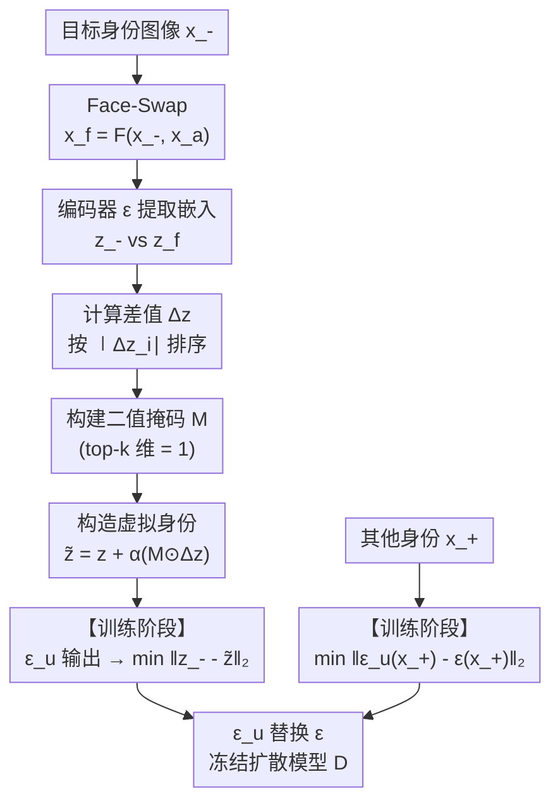

# IREU: Identity-Related Encoder-Only Unlearning for Customized Portrait Generation

**会议**: ECCV2026  
**arXiv**: [2606.29880](https://arxiv.org/abs/2606.29880)  
**代码**: 待确认  
**领域**: AI 安全  
**关键词**: 身份遗忘, 定制人像生成, 编码器微调, Face-Swap, 隐私保护

## 一句话总结

IREU 首次针对定制人像生成（CPG）提出身份遗忘问题，通过 Face-Swap 定位嵌入空间中的身份相关维度、仅在这些维度上做特征扰动，实现只更新图像编码器即可去除目标身份生成能力、同时保持其他身份生成保真度的遗忘管线，且遗忘后的编码器可零微调迁移到不同 CPG 生成器。

## 研究背景与动机

定制人像生成（Customized Portrait Generation, CPG）技术近年发展迅猛——以 PhotoMaker、FastComposer 为代表的管线通过预训练图像编码器提取输入人像的身份嵌入，再送入 Stable Diffusion 等扩散模型完成带文本引导的高保真人像编辑（属性修改、身份融合、场景重上下文化等）。然而，这种便利也带来了严重的隐私风险：攻击者可以利用公开的 CPG 生成器伪造他人肖像，用于冒充、深度伪造乃至社会信任破坏。

现有针对此风险的防御主要停留在图像层面——给用户图像注入人眼不可见的对抗扰动，使模型无法正常利用这些图像生成。这类方法的前提是目标身份的所有图像都能被保护起来，这在现实中几乎不可能：已流传的旧照、偷拍照片等不受控来源无法覆盖。更重要的是，根据 GDPR 等法规，模型提供方有义务在用户请求时删除该用户的"可生成能力"——即必须在模型内部做遗忘（unlearning），而非仅在输入侧加噪音。

作者于是将目光投向模型层面的生成遗忘。然而现有生成遗忘方法（如 BIA）都在 U-Net 或去噪网络上做微调——这会把遗忘和某一特定生成器（denoiser）紧耦合，换一个生成器就得重新遗忘。而且 U-Net 的参数量巨大、内含大量生成先验知识，在其参数空间里擦除身份信息很容易引发灾难性遗忘，导致所有生成图像质量下降。作者观察到：当前主流 CPG 管线共享同一个编码器家族（CLIP ViT），但各自使用不同的扩散 backbone。如果遗忘只发生在编码器侧，那么一个"被遗忘"的编码器可以即插即用到任何共享该编码器的生成器上。**核心 idea：仅更新图像编码器（图像编码器即可），通过 Face-Swap 定位嵌入空间中专门承载身份信息的维度、只在这些维度上做特征扰动，从而精确擦除目标身份，同时保留其他身份的保真度和跨生成器迁移能力。**

## 方法详解

### 整体框架

IREU 是一个编码器-only 的身份遗忘框架，工作流程分为两大阶段。第一阶段（离线定位）：用 Face-Swap 为目标身份图像生成一张仅替换身份的人像，计算原始编码器下二者嵌入的差值向量，按绝对值大小降序排列，取 top-k 维度构建二值掩码——这些维度即为身份相关特征。第二阶段（在线遗忘冻结扩散模型）：对遗忘身份图像，沿掩码选中的维度按可调幅度进行定向偏移，构造一个"虚拟身份"嵌入作为优化目标，最小化训练中编码器输出与虚拟嵌入的距离；对于被保留的其他身份图像，则最小化遗忘后编码器与原始编码器输出的差异。推理时直接用遗忘后的编码器替换原始编码器即可，扩散模型完全不动。

### 关键设计

**1. Face-Swap 定位身份相关特征的维度掩码**

这里的核心洞察是：在 CLIP 图像嵌入空间中，身份信息的分布并不均匀——某些维度对身份变化高度敏感，而其他维度几乎不变。为了找到这些敏感维度，作者利用现成的 Face-Swap 工具，对目标身份图像 x_- 和随机采样的其他身份图像 x_a（仅身份不同、上下文一致）生成一张换脸图像 x_f = F(x_-, x_a)。计算二者在原始编码器 ε 下的嵌入差异 Δz = z_- - z_f，该差值向量的每个分量绝对值 |Δz_i| 反映了该维度对身份变化的敏感度。对 1000 对 Face-Swap 图像的统计验证了这种偏置确实存在：高响应维度稳定出现在特定位置上。于是将所有维度按 |Δz_i| 降序排列，取前 k 比例构建二值掩码 M（M_i = 1 表示该维是身份相关、会被扰动）。这个掩码的本质是一个不考虑正负方向的身份相关维度选择器，使得后续扰动攻击只作用于"身份神经"。

**2. 身份相关变换构造虚拟身份**

拿到掩码后，需要在训练时为遗忘身份图像明确一个"遗忘目标"——即生成图像应该变成什么身份。作者不是随机生成一个陌生人嵌入，而是沿着 Δz 的方向、沿掩码选中的维度做受控偏移：z̃_- = z_- + α(M ⊙ Δz)。这里的 α 控制偏移幅度（实验中 α=100 达到饱和）。这样做的好处是：只有被掩码选中的身份相关维度发生了变化，而姿势、背景、光照这些身份无关特征被保留在原始值上，不会因为"为了推远身份"而被连带破坏。随后的遗忘损失就是让训练中的编码器 ε_u 对 x_- 的输出尽可能贴近这个虚拟身份：L_f = ‖ε_u(x_-) - z̃_-‖₂。由于虚拟身份 z̃_- 的身份信息已被大幅削弱（沿身份敏感方向偏移了很大距离），最小化这个损失等价于强迫编码器把 x_- 的身份映射到一个"去了身份"的区域。

**3. 保留身份的一致性保持损失**

对于不需要遗忘的身份 x_+，IREU 的保留损失与基线完全一致：L_r = ‖ε_u(x_+) - ε(x_+)‖₂，即让遗忘后编码器和原始编码器对这些身份的输出尽可能一致。关键区别在于，基线的全局扰动在遗忘多个身份时会把整个特征空间搅乱——所有图像（包括被保留身份）的嵌入都被动偏移，导致 fiveID 设置下保留身份的保真度崩溃（ID_other^o 从 0.51 掉到 0.01）。IREU 的局部扰动把身份相关和身份无关维度分开处理，即使遗忘 5 个身份，保留身份的嵌入在身份无关维度上几乎不受影响，保持高保真度（ID_other^o = 0.53, PSNR 28.25）。

**4. 编码器-only 的跨生成器零迁移**

这是全框架最实用的设计：遗忘只修改图像编码器 ε_u，扩散模型 D 和文本编码器完全冻结。这意味着训练完成后，ε_u 可以直接插到任意共享同一编码器家族的 CPG 生成器（FastComposer、PhotoMaker 等）中，无需任何额外的微调。实验验证了这一优势：将 ε_u 直接插入 PhotoMaker，ΔID 达到 0.7007（基线只有 0.1108），证明身份相关扰动在跨生成器场景下更加鲁棒。这种即插即用的特性对于实际部署极为重要——服务提供商只需维护一组遗忘编码器，而无需为每个生成器分别做遗忘。

### 损失函数 / 训练策略

总损失为遗忘损失和保留损失的加权和：

- 遗忘损失：L_f = ‖ε_u(x_-) - z̃_-‖₂，其中 z̃_- = z_- + α(M ⊙ Δz)
- 保留损失：L_r = ‖ε_u(x_+) - ε(x_+)‖₂
- 总损失：L_u = λ₁L_f + L_r，实验取 λ₁=0.1

训练配置：Adam 优化器，lr=1e-5，batch size=1，单 3090 GPU。oneID 设置训练 1000 步，fiveID 设置训练 12000 步。掩码比例 k=0.4（即选择 top 40% 维度作为身份相关），偏移幅度 α=100（饱和值）。

## 实验关键数据

### 主实验

在 CelebA-HQ 上评估，以下为 FastComposer 上的单身份（oneID）遗忘设置结果：

| 指标 | 含义 | BIA | Baseline | IREU |
|------|------|-----|----------|------|
| ID_target^o (↓) | 生成图与输入图身份相似度 | 0.05 | 0.03 | **0.01** |
| ID_target^g (↓) | 遗忘前后生成图相似度 | 0.30 | 0.03 | 0.21 |
| ID_other^o (↑) | 保留身份生成保真度 | 0.55 | 0.14 | **0.55** |
| ID_other^g (↑) | 保留身份前后相似度 | 0.82 | 0.51 | **0.85** |
| ΔID (↑) | 保-忘差距 | 0.52 | 0.48 | **0.64** |
| PSNR (↑) | 保留身份保真度 | 20.51 | 22.82 | **28.88** |
| SSIM (↑) | 保留身份结构相似度 | 0.70 | 0.79 | **0.92** |
| ΔFID (↓) | 保留身份 FID 退化 | 4.14 | 4.33 | **1.02** |

### 消融实验

| 配置 | 关键发现 |
|------|---------|
| 全局扰动（Baseline） | oneID 下 ID_other^o=0.14（退化明显）；fiveID 下崩到 0.01，无法同时遗忘多个身份 |
| IREU（k=0.4, α=100） | oneID 下 ΔID=0.64, fiveID 下 ΔID=0.55，最佳权衡 |
| 掩码比例 k | k>0.4 时 ΔFID 快速上升、SSIM 方差增大，说明扰动蔓延到身份无关维度 |
| 偏移幅度 α | α<100 时遗忘不充分；α≥100 后 ID_target^o 饱和 |
| 不同 x_a 稳定性 | 10 次不同 x_a 的掩码重叠率平均 70.46%，说明选中的身份相关维度稳定 |
| 跨生成器迁移（PhotoMaker） | IREU ΔID=0.7007，基线 ΔID=0.1108，IREU 在跨生成器场景优势更大 |

### 关键发现

- 最大贡献是**身份相关维度掩码**：去掉它（用全局扰动）后，fiveID 下保留身份保真度从 0.53 降到 0.01，几乎完全失效。说明在不分离身份和身份无关特征的情况下，一旦需要遗忘多个身份，全局特征空间会被彻底搅乱。
- IREU 的一个实际优势出人意料：在迁移到 PhotoMaker 时，基线的保留身份 ΔID 几乎消失（0.1108），而 IREU 保持良好（0.7007）。原因是基线的全局扰动对编码器的输出分布做了过大改变，新生成器对这种偏移不适应；IREU 的局部扰动保持了大部分输出分布不变，从而保持了迁移鲁棒性。
- 遗忘对未见过的同一身份图像也有效（ID_target^o,unseen 保持 0.15 vs 原始编码器的 0.55 以上），说明遗忘后的编码器确实在特征空间层面改变了身份映射，而非仅在训练集图像上过拟合。

## 亮点与洞察

- **Face-Swap 找出身份相关维度的思路非常巧妙**：用换脸构造的配对（仅身份不同）天然分离了身份因素，差分向量高响应维度就是身份特征维度，无需任何标注或先验知识。这个离线定位一次做好的掩码可以在后续训练中直接复用。
- **局部扰动 vs 全局扰动的区分是核心洞察**：基线方法（全局扰动）在 oneID 下已经让保留身份保真度明显下降，fiveID 下彻底崩塌。IREU 证明大部分编码器维度是身份无关的——扰动它们除了降低保真度外没有意义。
- **编码器-only 的设计带来实用价值**：遗忘管线的训练量极小（单 3090、1k-12k 步），推理时只是换一个编码器权重文件。这在现实部署中意味着一个 CPG 服务商可以维护一套遗忘编码器库，用户申请删除后直接替换部署的编码器，无需重新部署整个生成管线。
- **掩码的稳定性验证很扎实**：消融显示不同 x_a 下掩码重叠率 70.46%±5.19%，远超随机期望（40%），说明身份相关维度确实是嵌入空间中稳定的结构属性。

## 局限与展望

- 假定了 Face-Swap 工具本身不泄漏身份信息——如果换脸工具质量不够高（残留原身份纹理），差分向量 Δz 会混入非身份噪声，降低掩码精度。
- 离线定位掩码需要访问目标身份图像 x_- 和一个其他身份图像 x_a，对于只有一个公开图像、且无法找到合适 x_a 的边缘场景可能失效。
- 编码器-only 的设计依赖各 CPG 管线共享同一编码器家族（CLIP ViT）。如果未来主流 CPG 走向端到端学习、抛弃 CLIP 编码器，本方法的即插即用优势会减弱。

## 相关工作与启发

- **vs BIA（CVPR 2025）**：BIA 在 U-Net bottleneck 做黑洞式吸收（身份表示被"吸入"bottleneck），只能针对特定生成器；IREU 在编码器嵌入空间做定向扰动，可跨生成器迁移。BIA 在 ID 遗忘后 ID_target^o 仍达 0.05（保留过多身份痕迹），IREU 可降到 0.01。
- **vs GUIDE**：GUIDE 是基于 GAN 的身份遗忘，不适用于主流扩散 CPG 管线；IREU 天然适配 CLIP + Stable Diffusion 架构。
- **vs 传统概念擦除（concept erasure）**：概念擦除在交叉注意力层抑制概念，适用于"风格""物体类别"级别；IREU 针对的是细粒度的身份级遗忘，且证明编码器嵌入空间的维度级定位在高细粒度任务（同一人脸的不同身份）上可行。

## 评分

- 新颖性: ⭐⭐⭐⭐⭐ 首次提出 CPG 场景下的身份遗忘问题，且 Face-Swap 定位身份相关维度的方式简洁有效
- 实验充分度: ⭐⭐⭐⭐ 主实验、消融、跨生成器迁移、未见图像测试覆盖全面，但仅在 CelebA-HQ 一个数据集上验证
- 写作质量: ⭐⭐⭐⭐⭐ 动机链清晰、方法叙述自洽、消融实验针对每个关键设计点
- 价值: ⭐⭐⭐⭐⭐ 编码器-only 的设计兼具实用迁移能力和极小训练成本，有直接部署价值

<!-- RELATED:START -->

## 相关论文

- [\[CVPR 2026\] Bridging Privacy and Provenance: Traceable Virtual Identity Generation](../../CVPR2026/ai_safety/bridging_privacy_and_provenance_traceable_virtual_identity_generation.md)
- [\[CVPR 2026\] Reinforcement-Guided Synthetic Data Generation for Privacy-Sensitive Identity Recognition](../../CVPR2026/ai_safety/reinforcement-guided_synthetic_data_generation_for_privacy-sensitive_identity_re.md)
- [\[CVPR 2026\] No Way To Steal My Face: Proactive Defense Against Identity-Preserving Personalized Generation](../../CVPR2026/ai_safety/no_way_to_steal_my_face_proactive_defense_against_identity-preserving_personaliz.md)
- [\[ECCV 2026\] Moiré Video Authentication: A Physical Signature Against AI Video Generation](moiré_video_authentication_a_physical_signature_against_ai_video_generation.md)
- [\[ICCV 2025\] Ask and Remember: A Questions-Only Replay Strategy for Continual Visual Question Answering](../../ICCV2025/ai_safety/ask_and_remember_a_questions-only_replay_strategy_for_continual_visual_question_.md)

<!-- RELATED:END -->
