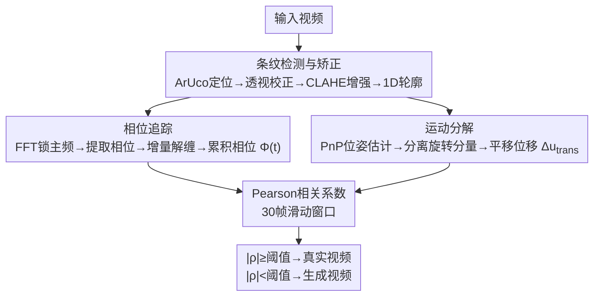

# Moiré Video Authentication: A Physical Signature Against AI Video Generation

**会议**: ECCV 2026  
**arXiv**: [2604.01654](https://arxiv.org/abs/2604.01654)  
**项目页**: [https://yuanqing-ai.github.io/physical_video_signature/](https://yuanqing-ai.github.io/physical_video_signature/)  
**代码**: 无  
**领域**: AI 安全  
**关键词**: 莫尔条纹, 视频认证, AI生成视频检测, 物理签名, 光学不变量

## 一句话总结
本文提出利用莫尔干涉条纹作为物理签名来认证视频真伪：将紧凑的双层光栅结构放置在拍摄场景中，通过计算条纹相位变化与光栅图像平移位移之间的 Pearson 相关系数区分真实视频与 AI 生成视频——真实视频中两者由光学几何定律严格耦合（相关系数均值 0.87），而当前最强视频生成模型（Veo 3.1、Grok Imagine、LTX-2）在最优配置下也无法精确复现这种耦合（相关系数均值 0.57），Cohen's d 达 1.71，差异高度显著。

## 研究背景与动机

AI 生成视频正以惊人的速度渗透到信息生态中。从 Sora、Veo 到 Grok Imagine 和 LTX-2，这些模型产出的视频已逼真到人类肉眼、自动化检测器甚至取证分析师都难以区分的程度。2024 年香港某跨国公司职员在视频会议中被深度伪造的高管面孔骗走 2500 万美元，2025 年爱尔兰总统候选人被 AI 生成的退选声明视频冒名并趁社交媒体传播数小时——这些并非危言耸听，而是已经发生的事件。现有的视频鉴真手段陷入两难困境：基于事后取证的被动检测器（如 FaceForensics、CNN-based fingerprint）与生成模型处于军备竞赛状态——每一代新模型都会淘汰旧检测器依赖的伪影，需要持续重训，无法提供持久的可靠性保证；数字水印方案（如 C2PA 元数据、SynthID）虽然能在创建时嵌入溯源信息，但元数据可以被剥离或伪造，水印在常见后处理操作下也会退化。

这两类方法的共同缺陷在于它们都没有建立从被摄场景到最终视频的不可伪造的物理关联。本文提出一个根本性的思路转变：不是去"发现"生成视频的痕迹，而是让真实相机天然产生一种生成模型无法精确复现的物理信号。关键洞察在于：真实视频由光学系统按照物理定律产生，而生成模型从数据中学习统计关联，很少建模底层的物理过程。如果有一种物理现象，其外观与精确的光学几何紧密耦合，那么它就可以作为真实相机自然产生、但当前生成模型无法正确合成的签名。本文的选择是莫尔条纹——当两个精细周期结构（线光栅）叠合时产生的干涉图案对相机与光栅之间的几何关系极其敏感：相机微小移动会引发条纹的确定性位移，且这种位移遵循严格的光学几何公式。**核心 idea：利用莫尔条纹运动不变量作为认证判据——条纹相位变化与光栅图像平移位移由光学几何线性耦合，相关系数理论上接近 1，且与观察距离和光栅结构参数无关；在真实视频中这种耦合自然成立，而在 AI 生成视频中，由于生成模型不求解光学方程，无法复现这一线性关系，相关系数显著偏低，从而实现无需任何先验标定的视频真伪鉴别。**

## 方法详解

本文的认证系统由一块紧凑的三层光栅组件（前层透镜膜 + 中层印刷条纹 + 底层亚克力基底）和一个基于光学推导的三段式视频分析流水线组成。使用者将光栅组件佩戴或放置在拍摄场景中（如演讲者的胸牌、新闻发布会的背景标牌），由自然的人体运动和相机运动产生相对位移。流水线从视频中独立提取条纹的累积相位信号和光栅组件的纯平移位移信号，计算两者的相关系数作为认证判据。

### 整体框架

认证流水线以含光栅组件的视频为输入，经过三个核心处理阶段后输出认证决策。第一阶段的输出同时供给第二和第三阶段，两条信号在最后汇聚。

Phase 1（条纹检测与矫正）：检测并跟踪光栅组件四角的 ArUco 标记，计算单应性矩阵将条纹区域透视校正到正面标准视角，经 CLAHE 增强对比度后沿条纹方向平均压缩为一维强度轮廓。Phase 2（相位追踪）：对一维轮廓做 FFT，锁定莫尔拍频的主导频率分量，逐帧提取相位角并通过增量解缠绕累积为平滑的相位信号 Φ(t)。Phase 3（运动分解与认证）：利用 ArUco 标记提供的 3D-2D 对应关系做 PnP 位姿估计，从原始中心轨迹中分离旋转分量（旋转不产生视差、不影响条纹相位），只保留平移位移 Δu_trans 并投影到条纹敏感方向，最后在 30 帧滑动窗口上计算 Φ(t) 与 Δu_trans 的 Pearson 相关系数。

### 关键设计

**1. 莫尔运动不变量：消除距离依赖的理论基石**

莫尔条纹认证的核心理论挑战在于相机与光栅之间的距离 D 是未知且变化的，而条纹相位变化同时依赖于相机位移和距离二者——如果直接比较相位变化量就需要先标定距离。本文的关键理论突破是发现一个不依赖于 D 的不变量。对于前层光栅周期 p_f、后层光栅周期 p_r，层间距为 g，相机横向位移 Δx_c 产生视差 δ = g·Δx_c/D，导致条纹相位变化 Δφ = 2πΔx_m/p_m。代入拍频周期 p_m 和位移放大关系后化简，同时注意到光栅组件中心的像面位移 Δu_trans = f·Δx_c/D，两个表达式共享共同的因子 Δx_c/D，消去后得到 Δφ = 2πg/(p_r·f) · Δu_trans。相位变化与像面位移之间的线性比例系数只依赖于固定参数（层间距 g、后层周期 p_r、焦距 f），与观察距离 D 完全无关。更重要的是，纯旋转运动对视差不产生贡献——旋转同时移动两层光栅，相对位置不变，因此只有平移分量驱动相位变化，上式在包含旋转的通用相机运动下仍然成立（只需从总位移中减去旋转分量即可）。这意味着验真器只需从视频中分别提取累积相位信号和纯平移位移信号，计算两者的 Pearson 相关系数，而不需要知道任何场景几何参数。相关系数天然消去了比例因子的影响，只检测两条信号之间是否存在线性耦合。这一理论设计的优雅之处在于把认证问题从"精确测量未知参数"转化为"检测两个可观测信号之间是否存在预期的统计关系"。

**2. FFT 相位追踪：从视频帧中提取亚像素级条纹位移**

从单帧图像中稳定提取条纹相位是该系统实用化的关键工程挑战。条纹图案经过透视校正和 CLAHE 对比度增强后，沿条纹方向平均压缩为一维强度轮廓。莫尔拍频是轮廓中的主导周期性成分，因此一维 FFT 的对应频率分量直接编码了条纹的横向位置。流水线在首帧识别并锁定主导频点 k*，后续帧直接读取该频点的相位角即可。为避免 2π 相位跳变，采用增量解缠绕策略：将帧间相位差用 wrap 函数限制到 [-π, π) 再累加，得到平滑的累积相位信号 Φ(t) = Σ wrap(φ(τ) - φ(τ-1))。这个方法的优势在于完全无参——不需要手动调参、不需要模板匹配、对对比度变化、局部遮挡和轻微模糊都具有天然的鲁棒性。实测中 CLAHE 增强是决定成败的关键预处理步骤：在低对比度或光照不均的场景中，不经增强的 FFT 峰值不够稳定，容易跳频到噪声分量，导致相位追踪失败。

**3. PnP 旋转补偿：从混合相机运动中复原纯平移信号**

真实的视频拍摄中相机运动几乎总是平移与旋转的混合。理论分析表明只有平移分量通过视差产生相位变化，纯旋转不贡献条纹位移。但光栅中心的原始像素轨迹 c̄(t) 是两种运动的叠加——直接用原始轨迹计算相关度会严重污染信号。本文利用已经存在于光栅组件四角的 ArUco 标记来实现旋转补偿：四个共面标记提供稳定的 3D-2D 对应点，调用 PnP 求解器恢复每帧的相机位姿 (R_i, t_i)。然后固定参考帧的朝向 R_ref，用每帧的相机位置重新投影光栅组件的三维中心，得到的位移仅包含平移分量，再将其投影到垂直于条纹线的方向即得标量位移信号 Δu_trans。这个设计的巧妙之处在于 ArUco 标记已经服务于条纹区域定位和透视校正，同时又为 PnP 提供了匹配点——同一个标记复用两个功能，不增加任何硬件复杂度。实测中旋转补偿对相关系数的影响极大：未补偿时真实视频的相关度从 0.87 骤降至约 0.5，几乎不可区分于生成视频，证明了这一环节是整个流水线的支柱。

## 实验关键数据

### 主实验

论文采集了 12 位受试者在 29 个场景（25 室内、4 室外）中的 87 段真实视频（iPhone 15，1080p@60fps），涵盖静态相机/运动光栅、运动相机/静态光栅、两者同时运动三种运动配置，拍摄距离约 1-3 米。同时用 Blender Cycles 物理渲染引擎生成 70 段理想条件验证视频以确认流水线的上限性能。AI 生成方面采用最强的攻击设置——图像到视频生成（以真实首帧为条件），从 317 段候选视频中筛选出 92 段经过人工确认的"高难度"样本。

| 视频类别 | 数量 | 平均 |ρ| | 标准差 | Cohen's d vs 真实 |
|---------|------|------|--------|------------------|
| 真实视频（室内+室外） | 87 | 0.87 | 0.14 | - |
| AI 生成视频（全部） | 92 | 0.57 | 0.21 | 1.71 |
| Blender 物理渲染 | 70 | 0.99 | - | - |
| Welch t 检验 | t(160) = 11.6, p < 10⁻²⁰ | | | |

| 生成模型 | 平均 |ρ| |
|---------|---------|
| Veo 3.1 | 0.58 |
| Grok Imagine | 0.56 |
| LTX-2 | 0.57 |

三个模型的表现几乎没有差异，说明这不是某个特定模型架构的偶然失败，而是当前所有视频生成模型在物理光学模拟上的系统性短板。全数据集 ROC 分析得到 AUC = 0.8453，最优判定阈值 τ* ≈ 0.927。需注意该 AUC 仅在 92 个经过人工筛选的高难度负样本上计算——原始 317 段生成视频中有 225 段因光栅结构严重变形被排除，这些肉眼可辨的失败样本在实际部署中不构成威胁，因此真实场景中的分离度应更高。

### 额外鲁棒性测试

| 配置 | 窗口平均 |ρ| | 变换范围 | 说明 |
|------|--------|---------|------|
| 正交双方向条纹 | 0.95 / 0.85 | [0.56, 0.99] | 两个方向分别追踪，均保持高相关 |
| 面内旋转条纹 | 0.76-0.81 | [0.03, 0.99] | 旋转补偿后仍可测量，窗口稳定性略降 |
| 45° 倾斜视角 | 0.72 | [0.14, 0.99] | 非正面视角下信号减弱但不变为零 |
| 双轴条纹 + 复合旋转 | 0.57-0.67 | [0.004, 0.99] | 最挑战配置，但判定仍为真实 |

结果表明 3D 倾斜主要降低信噪比而不破坏物理耦合关系，窗口级相关度仍然远高于生成视频的水平。

### 关键发现
- **旋转补偿是系统成败的关键**：去除旋转补偿后真实视频与生成视频的相关系数分布几乎重叠，失去了区分能力——PnP 分解是整个流水线的支柱组件，远非可选的改进模块。
- **当前最强生成模型全线溃败**：无论闭源（Veo 3.1、Grok Imagine）还是开源（LTX-2），即使在最有优势的 I2V 设置下（输入真实首帧作为条件），生成的条纹运动都无法通过物理一致性检验，且三者表现几乎一致。
- **纯 T2V 生成阶段零通过**：三个模型都完全无法生成可识别的莫尔条纹图案——这些模型从根本上缺少对这种精细周期结构的表征能力。
- **拼接攻击自身可证伪**：将一段真实视频中的条纹区域拼接到另一段目标视频，移植的相位信号反映的是源视频的相机-光栅几何，与目标视频的位移轨迹不匹配，相关系数必然偏低。
- **换脸攻击是明确定义的盲区**：如果只修改光栅区域之外的画面（如换脸），莫尔认证无法检测。但这也是现有换脸检测器（82-97% 准确率）擅长的问题，两类方法可以互补构成多层验证管线。

## 亮点与洞察

- **"物理不变量"比"找统计伪影"更耐久**：本文最核心的洞察是不要陷入与生成模型的军备竞赛（修补已知伪影），而是让真实物理过程产生 AI 无法伪造的确定性信号。即使未来生成模型学会了画莫尔条纹，要精确模拟帧间相位-位移耦合仍然需要求解光学方程——这等价于在生成管线中嵌入全波光学渲染器，计算代价极高，与"低成本批量生成"的攻击场景属于不同量级。
- **无标定认证的设计优雅**：莫尔运动不变量利用未知距离 D 同时出现在相位变化和图像位移两个表达式中且被消去这一事实，使 Pearson 相关系数成为距离无关的判据。验真器不需要知道焦距、光栅周期、层间间距等任何参数——只需检测两条信号是否存在线性耦合。这种"不测量、只检测关系"的原则在很多物理感知领域都值得借鉴。
- **ArUco 标记的双重角色是巧妙工程复用**：四角的 ArUco 标记同时服务于条纹区域定位 / 透视校正和 PnP 位姿估计 / 旋转补偿，一个标记实现了两个各自关键的功能，不增加硬件复杂度。生产系统可以用更鲁棒的定位方法替代，但原型阶段这种复用显著降低了工程门槛。
- **威胁模型的分类思考使论文边界清晰**：论文系统性地将伪造分为 T2V 生成、I2V 生成、拼接攻击、换脸编辑四类，分别分析每类的攻防边界并明确承认盲区。这种诚实且结构化的威胁分析比"宣称解决了所有问题"的研究更有价值，也让后续研究者清楚本方法在整个取证管线中的定位——它解决的是"视频是否由物理相机拍摄"的问题，而不是"是否有人为编辑"的问题。

## 局限与展望

- **依赖相对运动**：认证要求相机与光栅之间存在位移以产生可测量的条纹相位变化。两者完全静止时认证无法进行。在实用设计中需要加入交互提示（如"请左右摆动佩戴的签名卡"），在固定监控等场景中则受限。
- **未来可能被物理渲染引擎击败**：如果攻击者在生成管线中嵌入完整的光线追踪（如用 Blender Cycles 或 Unreal Engine 渲染光栅再合成到背景中），理论上能复现正确的耦合。但这类攻击需要大量手工工程（场景匹配、光照对齐、视角追踪），与"一键批量造伪"的威胁模型属于不同量级，目前不是紧迫风险。
- **部署过程中的噪声耐受性**：原型在受控条件下表现出色，但户外、运动模糊、低照度、社交媒体 H.264/H.265 压缩等恶劣条件下的表现仍需大规模验证。作者提出了多方向正交光栅模式、窗口级置信度过滤等改进方向。
- **用户接受度与规模化的平衡**：要求用户佩戴或携带光栅组件是一种主动参与式认证，不像被动检测那么透明。在新闻现场认证、视频会议、司法取证等高价值场景中可接受（类似于记者采访证），但大规模推广需要降低组件成本和提升美观度。

## 相关工作与启发

- **vs 被动深度学习检测器（FaceForensics、CNNfingerprint 等）**: 被动检测器依赖特定生成模型的伪影，处于军备竞赛劣势。本文的物理签名不依赖具体模型特征，提供更本质的认证手段。两者互补：被动检测器负责局部编辑（换脸）检测，莫尔签名负责"视频是否源于物理光学系统"的整体认证。
- **vs 数字水印（C2PA、SynthID）**: 水印可被剥离、重编码或伪造，且需在创建端嵌入。莫尔签名在拍摄时自然产生，无需后期步骤。但水印可扩展至任意内容，莫尔签名需特定硬件。
- **vs 主动光照签名（VeriLight、Michael et al.）**: 主动方法需要专用发射器投射调制光（structed light），硬件复杂且需电源。莫尔签名完全被动——仅靠双层光栅的几何光学效应，硬件成本极低（约 10 美元的透镜膜 + 打印纸），且无需任何能源。
- **vs 莫尔感知研究（MoiréBoard、MoiréTracker、MoiréVision）**: 这些工作利用莫尔条纹作为测量信号做位姿估计，推导方向是从观测反推未知的相机位姿。本文在推导上反其道而行——主动保留并利用被消去的距离项来构造认证不变量。应用目标也从"测量"转向"认证"。

## 评分
- 新颖性: ⭐⭐⭐⭐⭐ 将莫尔条纹从镜头伪影/位姿估计工具重新发现为物理认证签名，思路极具原创性。"用物理规律而非统计检测做认证"超越当前被动检测范式的思维框架。
- 实验充分度: ⭐⭐⭐⭐ 系统性地验证了 12 场景、3 种运动配置、3 个不同模型的攻击，含 I2V 强攻击设置和威胁模型分析。但测试规模略小（87+92 视频），缺少大规模野外部署数据和多平台压缩/光照退化下的定量测试。
- 写作质量: ⭐⭐⭐⭐⭐ 理论推导严密（从不变量推导到工程实现再到威胁分析，逻辑链条完整），图例精美，附录提供了完整的复现指南和 prompt 模板，可复现性极佳。
- 价值: ⭐⭐⭐⭐⭐ 在 AI 生成视频日益逼真的时代提供了一种理论上更持久、实际可部署的物理认证方案。实用化潜力巨大——视频会议、新闻认证、司法取证、直播真实性担保等场景均可落地。

<!-- RELATED:START -->

## 相关论文

- [\[CVPR 2026\] VMD-FACT: A New Video Dataset and MLLM-based method for Detecting Realistic AI-Generated Video Misinformation](../../CVPR2026/ai_safety/vmd-fact_a_new_video_dataset_and_mllm-based_method_for_detecting_realistic_ai-ge.md)
- [\[CVPR 2026\] Skyra: AI-Generated Video Detection via Grounded Artifact Reasoning](../../CVPR2026/ai_safety/skyra_ai-generated_video_detection_via_grounded_artifact_reasoning.md)
- [\[ICLR 2026\] Video Unlearning via Low-Rank Refusal Vector](../../ICLR2026/ai_safety/video_unlearning_via_low-rank_refusal_vector.md)
- [\[CVPR 2026\] RunawayEvil: Jailbreaking the Image-to-Video Generative Models](../../CVPR2026/ai_safety/runawayevil_jailbreaking_the_image-to-video_generative_models.md)
- [\[ICLR 2026\] Jailbreaking on Text-to-Video Models via Scene Splitting Strategy](../../ICLR2026/ai_safety/jailbreaking_on_text-to-video_models_via_scene_splitting_strategy.md)

<!-- RELATED:END -->
