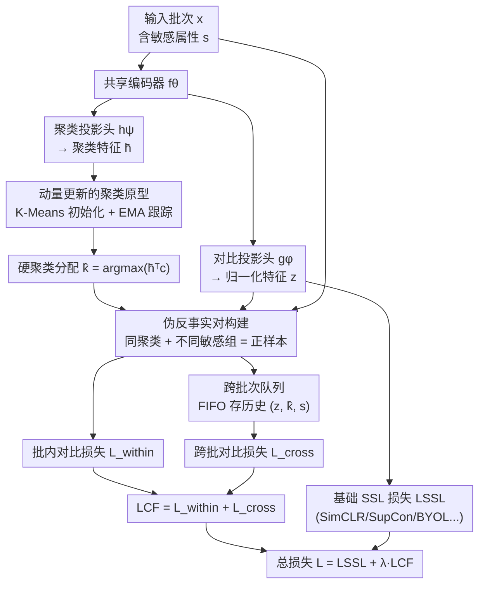

# ProtoFair: Fair Self-Supervised Contrastive Learning via Pseudo-Counterfactual Pairs

**会议**: ECCV 2026  
**arXiv**: [2605.01971](https://arxiv.org/abs/2605.01971)  
**代码**: 无  
**领域**: AI安全 / 公平性 / 自监督学习  
**关键词**: 自监督学习, 对比学习, 公平性表征, 伪反事实对, 聚类原型

## 一句话总结
ProtoFair 提出一种即插即用的公平性正则项，在不修改现有自监督对比学习目标的前提下，通过动量更新的无监督聚类原型发现「同语义内容但不同敏感组」的伪反事实对，在嵌入空间中拉近这些跨组样本，迫使编码器学习对敏感属性不变的表征；在 CelebA、UTKFace 和 NIH Chest X-rays 上搭配 SimCLR / SupCon / BarlowTwins / BYOL 均能显著降低 Equalized Odds 同时保持竞争力准确率。

## 研究背景与动机
自监督对比学习（SimCLR、SupCon、BYOL 等）已成为不依赖标注学习高质量视觉表征的主流范式，在多个下游任务上媲美甚至超越监督方法。然而，近年的研究揭示了一个令人不安的事实：即使训练过程不接触显式标签，这些自监督表征仍然会编码训练数据中的人口统计偏差——例如在人脸属性分类中，模型会系统性地利用性别、种族等敏感信息做预测，导致不同群体的错误率显著分化。

针对这一问题，现有两条主流路线均存在根本性局限。**对抗去偏方法**（如 GRL、LNL）训练辅助判别器从表征中剔除敏感信息，但引入的极小极大优化训练不稳定，超参敏感，且本质上修改了训练过程本身而非补充原有目标。**修改对比目标的方法**（如 FSCL）重新设计损失函数中的正负样本采样策略来减少偏差，但这类方法与特定 SSL 框架紧耦合——每出现一种新的 SOTA 自监督方法，公平性方案就需要从头重新设计。两条路线的共同痛点在于：**它们要求替换或根本改变基础训练目标，在 SSL 方法快速迭代的当下可移植性极差**。

本文提出一个不同的问题：能否不重新设计 SSL 目标，而是引入一个轻量级的附加正则项，让现有 SSL 方法自然而然地变得更公平？核心 idea 来自反事实公平（counterfactual fairness）的直觉——如果一个个体的敏感属性不同但其表征保持不变，则该表征是公平的。ProtoFair 通过无监督聚类作为语义内容的代理，构造伪反事实对（同一聚类但不同敏感组的样本），在嵌入空间中将它们拉近，主动鼓励编码器学习对敏感属性不变的特征。

## 方法详解

### 整体框架
ProtoFair 的核心思路是将公平性正则化作为一个即插即用的辅助损失 $\mathcal{L}_{\text{CF}}$，附加到任意现有 SSL 损失 $\mathcal{L}_{\text{SSL}}$ 之上，总损失为 $\mathcal{L} = \mathcal{L}_{\text{SSL}} + \lambda \mathcal{L}_{\text{CF}}$，其中 $\lambda$ 控制公平性正则化强度。基础 SSL 目标完全保持不变，ProtoFair 仅通过 $\mathcal{L}_{\text{CF}}$ 的梯度影响编码器。

整体 pipeline 分三条并行支路：共享编码器 $f_\theta$ 接收输入样本后，分别经过对比投影头 $g_\phi$（产生 L2 归一化特征 $z_i$，供基础 SSL 损失和 ProtoFair 损失共同使用）和聚类投影头 $h_\psi$（产生聚类空间特征 $\bar{h}_i$，专供原型分配使用）。聚类侧维护 $K$ 个动量更新的原型向量 $\{c_k\}_{k=1}^K$，通过 K-Means 初始化和 EMA 跟踪来为每个样本分配硬聚类标签 $\hat{k}_i$。这些聚类标签与敏感属性 $s_i$ 联合定义伪反事实正样本集 $\mathcal{P}_i = \{j \mid \hat{k}_j = \hat{k}_i \text{ 且 } s_j \neq s_i\}$。正样本对分别在当前批次内（$\mathcal{L}_{\text{within}}$）和一个跨批次 FIFO 队列（$\mathcal{L}_{\text{cross}}$）中检索，两个组件相加构成 $\mathcal{L}_{\text{CF}}$，再与 $\mathcal{L}_{\text{SSL}}$ 加权求和。聚类分配在传入 ProtoFair 损失时从计算图中 detach，形成 EM 式交替优化：E 步固定聚类伪标签，M 步优化编码器和对比头。

### 关键设计

**1. 动量更新的聚类原型：无标签下获取语义内容代理**

ProtoFair 构造伪反事实对需要一个前提——知道哪些样本在语义内容上相似。在没有目标标签的自监督场景下，本文用无监督聚类原型的分配结果作为内容相似性的代理。具体做法是：在聚类嵌入空间（由 $h_\psi$ 输出）中维护 $K$ 个原型向量 $\{c_k\}_{k=1}^K$，它们**不是通过反向传播学习的参数**，而是作为非可学习的运行估计来维护。经过若干 epoch 的预热期（仅用 $\mathcal{L}_{\text{SSL}}$ 训练编码器），用 K-Means 在整个训练集上进行聚类初始化：$\{c_k\} \leftarrow \text{K-Means}(\{\bar{h}_i = \frac{h_\psi(f_\theta(x_i))}{\|h_\psi(f_\theta(x_i))\|}\}_{i=1}^N)$。此后，每 $R$ 个 epoch 重新执行一次全量 K-Means 初始化以防止原型漂移，而在重新初始化之间，每步迭代通过指数移动平均（EMA）平滑跟踪特征空间的演化：$c_k \leftarrow \text{normalize}(m \cdot c_k + (1-m) \cdot \frac{\sum_{i:\hat{k}_i=k} \bar{h}_i}{|\{i:\hat{k}_i=k\}|})$，其中 $m \in [0,1)$ 是动量系数。每个样本通过余弦相似度就近分配：$\hat{k}_i = \arg\max_k \bar{h}_i^\top c_k$。

这个设计的巧妙之处在于三重解耦：(i) 聚类原型与编码器参数解耦（原型不经梯度更新），避免了退化到把所有样本坍缩到同一聚类的平凡解；(ii) 聚类头 $h_\psi$ 与对比头 $g_\phi$ 分离，保证基础 SSL 质量和公平性正则各自在独立子空间中运作；(iii) 聚类分配的 detach 操作形成 EM 交替优化——E 步的聚类结构反映的是「当前表征下的内容相似性」而非被公平性损失反向塑造的虚假结构。

**2. 伪反事实对构建：跨组拉近的内容匹配机制**

有了聚类分配和敏感属性后，ProtoFair 定义了三类样本对关系。正样本对（被拉近）的条件是**同一聚类且不同敏感组**：$\mathcal{P}_i = \{j \neq i \mid \hat{k}_j = \hat{k}_i \text{ 且 } s_j \neq s_i\}$。这一条件直接将反事实公平的直觉操作化——如果两个样本语义内容相同（同聚类）但敏感属性不同，它们的表征应该一致。其余两类对不出现在分子中：(i) 不同聚类的样本在分母中作为负样本被推开；(ii) **同一聚类且同一敏感组**的样本也不被视为正样本——这一排除至关重要，因为它确保损失专门针对跨组对齐而非聚类内的一般相似性，避免模型仅仅学到一个对组内样本更紧致的聚类而并未消除跨组差异。

批次内对比公平损失遵循标准对比学习框架：

$$\mathcal{L}_{\text{within}} = -\frac{1}{|\mathcal{V}|}\sum_{i\in\mathcal{V}}\frac{1}{|\mathcal{P}_i|}\sum_{j\in\mathcal{P}_i}\log\frac{\exp(z_i^\top z_j / \tau)}{\sum_{k=1,k\neq i}^{B}\exp(z_i^\top z_k / \tau)}$$

其中 $\mathcal{V} = \{i : |\mathcal{P}_i| > 0\}$ 是批次内至少有一个伪反事实伙伴的样本集合，$\tau$ 为温度系数。注意这里使用的特征 $z_i$ 来自对比投影头 $g_\phi$ 而非聚类头 $h_\psi$，意味着公平性梯度仅通过表征质量最高的空间传播，不会干扰聚类子空间。

**3. 跨批次队列：突破小批次/不平衡下的配对瓶颈**

批次内损失有一个实际瓶颈：伪反事实对要求同一聚类但不同敏感组的样本共现于同一 mini-batch。当批次较小或敏感组分布严重不平衡时，符合条件的正样本对可能非常稀少，公平性信号被稀释。为此，ProtoFair 借鉴 MoCo 的队列设计，维护一个 FIFO 队列 $\mathcal{Q}$ 存储最近 $M$ 个批次的样本信息，每条记录包含特征向量、聚类分配和敏感属性的三元组 $(z_j^q, \hat{k}_j^q, s_j^q)$，队列容量 $Q = M \times B$。队列条目均为 detach 张量，不参与梯度计算。

每个训练步中，当前批次样本与整个队列匹配以发现额外的跨组正样本：$\mathcal{P}_i^q = \{j \in \mathcal{Q} \mid \hat{k}_j^q = \hat{k}_i \text{ 且 } s_j^q \neq s_i\}$。跨批次损失与批内损失形式一致，但正样本来自队列且分母遍历整个队列提供大量多样化负样本：

$$\mathcal{L}_{\text{cross}} = -\frac{1}{|\mathcal{V}^q|}\sum_{i\in\mathcal{V}^q}\frac{1}{|\mathcal{P}_i^q|}\sum_{j\in\mathcal{P}_i^q}\log\frac{\exp(z_i^\top z_j^q / \tau)}{\sum_{k\in\mathcal{Q}}\exp(z_i^\top z_k^q / \tau)}$$

这一设计的实际效果是大幅扩大伪反事实对的搜索范围——从「同批次内偶尔出现」扩展到「最近 $M$ 个批次中持续追踪」，尤其在敏感组不平衡场景下可以显著增强公平性梯度信号。队列初始为空，随训练自然填充；在队列尚未积累足够条目时 $\mathcal{L}_{\text{cross}}$ 贡献为零，不影响训练稳定性。

### 损失函数 / 训练策略

完整的 ProtoFair 正则项为批内与跨批组件之和：$\mathcal{L}_{\text{CF}} = \mathcal{L}_{\text{within}} + \mathcal{L}_{\text{cross}}$。总训练目标 $\mathcal{L} = \mathcal{L}_{\text{SSL}} + \lambda \mathcal{L}_{\text{CF}}$，其中 $\lambda > 0$ 控制公平性正则化强度。ProtoFair 不是从头开始施加，而是先进行若干 epoch 的纯 SSL 预热训练让编码器学习有意义的表征，之后才初始化聚类原型并激活公平性损失。聚类原型每 $R$ 个 epoch 重新进行全量 K-Means 初始化，中间通过 EMA 平滑跟踪。训练使用 SGD（动量 0.9，权重衰减 $10^{-4}$，初始学习率 0.1 + 余弦退火），骨干网络为 ResNet-18，两个独立 MLP 投影头分别服务于对比损失和聚类损失。下游评估遵循线性探测协议：冻结编码器后在特征之上训练线性分类器。

## 实验关键数据

### 主实验

**CelebA（SupCon + ProtoFair）**：下表摘录 Table 1 中具有代表性的目标-敏感属性组合。ProtoFair 在所有场景下大幅降低 EO，而准确率损失极小。在 (T:e, S:y) 上 EO 从 10.8 降至 1.9，匹配专用公平性方法 FSCL 的最优结果（1.8）但准确率高 1.3 个百分点。最显著的公平性改善出现在 (T:a, S:m)：EO 从 30.5 降至 14.2（降幅 53%），准确率几乎不变（80.5 vs 80.3）。

| 方法 | T:a,S:m ACC | T:a,S:m EO | T:b,S:y ACC | T:b,S:y EO | T:e,S:y ACC | T:e,S:y EO |
|------|-------------|------------|-------------|------------|-------------|------------|
| CE | 79.6 | 27.8 | 84.5 | 14.7 | 83.8 | 12.7 |
| GRL | 77.2 | 24.9 | 83.3 | 10.0 | 82.3 | 5.9 |
| LNL | 79.9 | 21.8 | 82.3 | 6.8 | 80.3 | 3.3 |
| FSCL | 79.1 | 11.5 | 83.8 | 6.4 | 82.0 | 1.8 |
| SupCon | 80.5 | 30.5 | 84.4 | 16.9 | 84.0 | 10.8 |
| **SupCon + ProtoFair** | 80.3 | 14.2 | 83.5 | 6.9 | 83.3 | 1.9 |

**自监督场景（SimCLR / BarlowTwins / BYOL）**：ProtoFair 同样适用于无目标标签的纯自监督场景。在 SimCLR 基础上，ProtoFair 将 EO 从 29.4 降至 21.9（与 SimCLR+GRL 持平），同时保持更高准确率（73.3 vs 72.3）。在 BarlowTwins 和 BYOL 上均观察到一致的 EO 改善，验证了跨 SSL 框架的即插即用能力。

| 方法 | 基础框架 | T:e,S:y EO | T:e,S:m EO | T:b,S:y EO | T:b,S:m EO |
|------|---------|------------|------------|------------|------------|
| SimCLR | SimCLR | - | - | - | - |
| SimCLR + ProtoFair | SimCLR | - | - | - | - |
| BarlowTwins | BarlowTwins | 1.23 | 1.64 | 6.72 | 12.07 |
| BarlowTwins + ProtoFair | BarlowTwins | 1.16 | 1.36 | 1.15 | 5.98 |
| BYOL | BYOL | 11.21 | 17.04 | 8.90 | 13.54 |
| BYOL + ProtoFair | BYOL | 8.98 | 7.11 | 4.59 | 6.83 |

**UTKFace 不平衡鲁棒性**：在不同数据不平衡比 $\alpha \in \{2,3,4\}$ 下，ProtoFair 持续降低 EO（$\alpha=4$ 时从 10.6 到 6.6，$\alpha=2$ 时从 4.5 到 2.8），且相对改善幅度在高偏差场景下保持稳定，表明方法能优雅地随不平衡程度缩放。

**NIH Chest X-rays 跨域泛化**：在医学影像领域，ProtoFair 将 pneumothorax 分类的 AUROC 性别差距从 0.03 缩至 0.01，同时略微提升整体 AUROC（0.70 到 0.72），验证了方法在非人脸场景下的有效性。

### 消融实验

| 配置 | 关键观察 |
|------|---------|
| $\lambda=0.3$, 不同 $K$ | $K \in \{5,10,15,20,30\}$ 下准确率稳定在 83.0–84.5，EO 对聚类数不敏感，默认 $K=10$ 合理 |
| $K=10$, 不同 $\lambda$ | $\lambda \in [0.1, 0.3]$ 是最优区间，公平性显著改善且准确率损失微乎其微；$\lambda \geq 0.7$ 后准确率明显下降，过度约束表征 |
| 移除跨批次队列 | 在敏感组不平衡场景下公平性改善减弱，验证了队列在扩大正样本搜索范围上的关键作用 |
| 移除 detach 操作 | 聚类结构被公平性损失反向塑造，可能出现坍缩退化，验证了 EM 交替优化的必要性 |

### 关键发现
- **聚类原型质量是核心前提**：预热期和周期性 K-Means 重新初始化是保证聚类语义有意义的关键，预热不足会导致伪反事实对质量差、公平性改善消失。
- **$\lambda$ 存在甜区**：在 $[0.1, 0.3]$ 内公平性大幅改善且准确率几乎无损；过大则过度拉近跨组样本导致表征判别力下降。不同基础 SSL 方法和目标-敏感属性组合的最优 $\lambda$ 略有差异（BYOL 实验中降至 0.2）。
- **跨批次队列在不平衡场景下贡献最大**：当敏感组比例接近时批内已有足够正样本对，队列的边际增益较小；但在组不平衡严重时队列是公平性信号的主要来源。
- **仅需 5 个额外 epoch 即可见效**：在多数 CelebA 实验中 ProtoFair 仅额外训练 5–10 个 epoch 就能显著降低 EO，额外计算开销极低。
- **敏感属性可预测性下降**：线性探测敏感属性的准确率从 87.76% 降至 81.02%（Big Nose 任务）和 82.41% 降至 76.07%（Bags Under Eyes 任务），与 t-SNE 可视化中跨组样本更均匀混合的观察一致。

## 亮点与洞察
- **即插即用的哲学高度**：不修改基础 SSL 目标的设计使得 ProtoFair 天然兼容未来新出现的 SOTA 自监督方法，只需作为额外正则项加上即可——这种「不碰核心、只加正则」的思路可推广到其他希望在成熟系统上叠加约束的场景（如鲁棒性、OOD 泛化）。
- **聚类用于公平性是「借力打力」**：无监督聚类在 SSL 中本就被广泛用于提升表征质量（DeepCluster、SwAV、PCL），本文巧妙地将其重定向到公平性目标上——聚类结构本来捕捉的就是内容相似性，恰好天然满足伪反事实对「同内容」的前半条件，无需额外建模。
- **同一聚类同一敏感组的样本刻意不作为正样本**：这个看似微小的设计选择其实深刻——如果允许同组对进入分子，损失就退化为「加强聚类内聚度」而非「消除跨组差异」，公平性效果将大打折扣。这一细节体现了对「泛聚类收紧」与「跨组对齐」本质区别的清晰认识。
- **detach 防坍缩设计可迁移**：将聚类分配 detach 形成 EM 交替优化是防止「公平性损失反向污染聚类结构」的关键技巧，任何需要基于当前表征在线构造伪标签并用于额外损失的方法都可以借鉴这一策略。

## 局限与展望
- **聚类语义质量的依赖**：ProtoFair 的有效性前提是聚类能捕捉有意义的语义内容。如果数据本身不适合基于原型的聚类（如低分辨率、高噪声场景），伪反事实对的质量将下降。作者通过预热期和周期性 K-Means 重新初始化做了预防，但并未给出聚类失效时的明确 fallback 策略。
- **当前仅验证二值敏感属性**：所有实验的敏感属性（性别、是否年轻、种族二值化）均为二值，未探索多类别敏感属性（如多民族、年龄多分段）或连续敏感属性（如收入水平）下的表现。
- **下游任务局限于属性分类**：公平性评估仅在线性探测的分类准确率和 Equalized Odds 上进行，未在更复杂的下游任务（如目标检测、分割、检索）中验证表征公平性是否真正迁移。
- **与更强数据增强的结合空间**：ProtoFair 目前仅依赖标准数据增强，不考虑生成式增强或敏感属性感知的数据重采样。将队列机制与针对少数组的定向数据增强结合，可能进一步缓解极端不平衡下的公平性问题。
- **具体改进方向**：(i) 引入原型置信度加权，对聚类边界模糊的样本降低其伪反事实对的权重；(ii) 探索软聚类分配（soft assignment）替代硬分配，让位于聚类边界的样本也能贡献部分公平性信号；(iii) 将 ProtoFair 扩展到多模态自监督场景（如 CLIP 式图文对比）中检验公平性正则项的跨模态效果。

## 相关工作与启发
- **vs FSCL（Park et al. 2022）**：FSCL 通过修改监督对比损失中负样本的选择策略（排除同敏感组的负样本）实现公平性，其本质是「从分母中排挤」而非「在分子中拉近」——前者约束模型不要从敏感属性中获利，后者主动鼓励跨组不变性。ProtoFair 与 FSCL 互补且可以组合：FSCL 从分母侧提供公平性约束，ProtoFair 从分子侧提供跨组对齐信号。此外 FSCL 需要目标标签定义正样本对，ProtoFair 仅需敏感属性。
- **vs 对抗去偏方法（GRL、LNL）**：对抗方法通过梯度反转层训练敏感属性判别器来「抹除」表征中的敏感信息，属于「不要学什么」的范式；ProtoFair 是「要学成什么」——主动拉近跨组同内容样本。对抗训练的不稳定性和超参敏感性一直是实际部署的痛点，ProtoFair 的标准对比损失形式天然避免了极小极大优化。
- **vs PCL（Li et al. 2021）**：PCL 使用动量更新原型进行原型对比学习以提升表征质量，ProtoFair 直接复用了其原型维护机制但目标完全不同——PCL 将同一原型的样本作为正样本拉近以改善表征，ProtoFair 进一步筛选「同原型 + 不同敏感组」的子集来改善公平性。这说明 SSL 中聚类基础设施的可复用性远超其最初设计目标。
- **反事实公平的理论连接**：Kusner et al. (2017) 的反事实公平需要结构因果模型和因果图知识，在实际视觉数据中几乎不可行。ProtoFair 用聚类作为一种「够用但不完美」的因果代理——假设聚类捕获了非敏感的因果上游变量，虽然不如真正的因果推断严谨，但实证结果证明这种弱假设已足以在标准基准上获得显著的公平性改善。

## 评分
- 新颖性: ⭐⭐⭐⭐ 将无监督聚类用于公平性构造伪反事实对是新的切入角度，即插即用的设计理念清晰且区别于现有耦合方案，但核心组件（原型聚类、队列）均来自已有工作，组合方式新颖但无根本性新机制
- 实验充分度: ⭐⭐⭐⭐⭐ 在三个数据集、四种基础 SSL 方法、有监督和无监督两种场景下全面验证，消融实验覆盖关键超参 $K$ 和 $\lambda$，还提供了 t-SNE 可视化和敏感属性可预测性分析，跨域（人脸到医学影像）也做了初步验证
- 写作质量: ⭐⭐⭐⭐ 问题陈述清晰，方法动机链条完整（矛盾驱动型叙事），每步设计解释了「为什么这样做」而非仅「做了什么」，三个组件之间的逻辑关系交代清楚
- 价值: ⭐⭐⭐⭐ 即插即用设计使得 ProtoFair 可以随时被任何 SSL pipeline 采纳，无需重新设计训练流程或损失函数，实用价值高；局限在于仅验证二值敏感属性和属性分类下游任务，且聚类语义质量是隐式前提，在更复杂场景下的泛化性有待验证

<!-- RELATED:START -->

## 相关论文

- [\[ICCV 2025\] Backdooring Self-Supervised Contrastive Learning by Noisy Alignment](../../ICCV2025/ai_safety/backdooring_self-supervised_contrastive_learning_by_noisy_alignment.md)
- [\[CVPR 2025\] INACTIVE: Invisible Backdoor Attack against Self-supervised Learning](../../CVPR2025/ai_safety/invisible_backdoor_attack_against_self-supervised_learning.md)
- [\[ECCV 2026\] Improving Adversarial Robustness via Activation Amplification and Attenuation](improving_adversarial_robustness_via_activation_amplification_and_attenuation.md)
- [\[CVPR 2026\] ProxyFL: A Proxy-Guided Framework for Federated Semi-Supervised Learning](../../CVPR2026/ai_safety/proxyfl_a_proxy-guided_framework_for_federated_semi-supervised_learning.md)
- [\[ICLR 2026\] Fair Reinforcement Learning for Just AI](../../ICLR2026/ai_safety/fair_reinforcement_learning_for_just_ai.md)

<!-- RELATED:END -->
