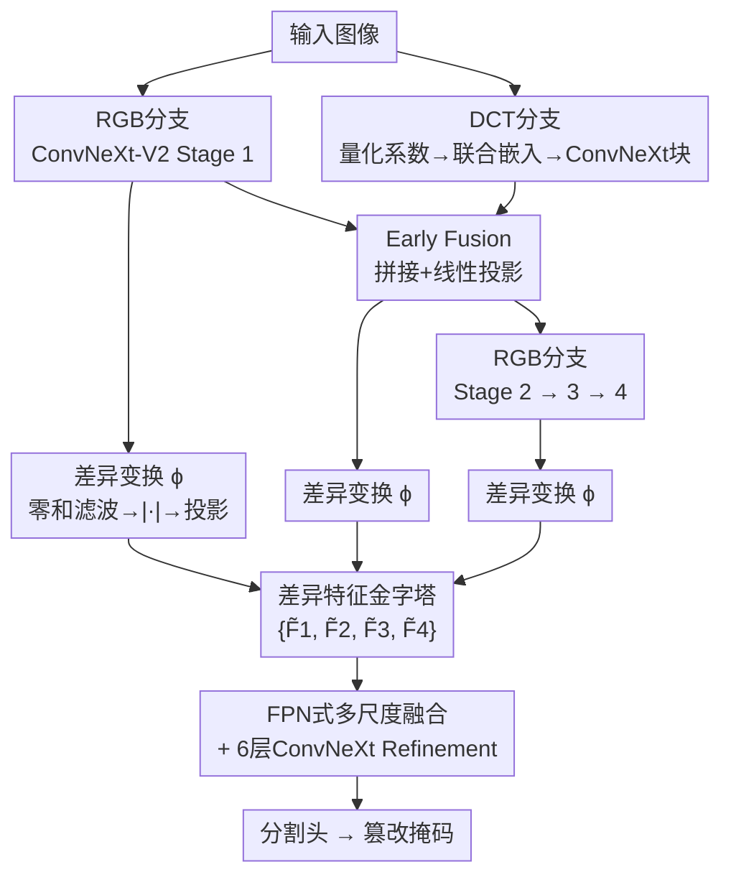

# Efficient Document Tampering Localization with Multi-Level Discrepancy Features and Unified DCT-Quantization Embedding

**会议**: ECCV 2026  
**arXiv**: [2606.22285](https://arxiv.org/abs/2606.22285)  
**代码**: 有 ([https://github.com/Mohamed-Dhouib/DiffNet](https://github.com/Mohamed-Dhouib/DiffNet))  
**领域**: AIGC检测  
**关键词**: 文档篡改定位, RGB-DCT融合, 差异特征, 零和滤波, 跨域泛化

## 一句话总结
DiffNet 通过两项互补设计——多层差异变换将特征金字塔从内容信号转为符号不变的差异强度信号，以及统一 DCT-量化联合嵌入用离散 embedding 替代传统高开销频率感知头（FPH）——在跨域和人工篡改文档定位上以更低计算成本取得了约 30% 的 F1 提升，吞吐量最高提升 7 倍。

## 研究背景与动机

文档图像是金融、行政和身份认证流程的核心，这也使其成为篡改攻击的主要目标。一旦篡改未被检测到，可能引发欺诈、身份盗用并在自动化决策系统中造成连锁错误。然而当前最先进的模型在跨域和人工伪造场景下的泛化能力仍然很差——一个根本原因在于评估主要在合成基准上进行，而合成数据生成管线会引入系统性偏差：插入文本通常来自有限字体集，覆盖操作复用少量算法留下特征性边界伪影，复制-移动和拼接等操作也有类似的可重复特征。这使得模型学会了依赖管线特定的「指纹」而非篡改本身产生的不一致性来定位篡改区域。

这种问题的核心矛盾在于：人工篡改注释数据极其稀缺且采集成本高昂，迫使大家依赖大规模合成预训练，但合成管线又鼓励捷径学习。更棘手的是，合成数据集的源文档来源往往很窄（如 IIT-CDIP 烟草诉讼材料占了很大比例），模型可以通过记忆源领域特定线索来降低训练损失，而不是真正抓住篡改引入的底层不一致性。即便在人工篡改数据集中，此类问题也存在——这些数据集通常规模小且由少数专家制作，仍然可能存在标记偏差。

本文采取了不同于以往的设计方向：与其继续增加架构复杂度，不如约束特征金字塔的表示，迫使解码器主要由不一致性线索而非内容信号驱动。具体而言，作者在每一个 backbone stage 输出处引入一个轻量多层差异变换，用学习型零和滤波器组将特征转为幅值响应，得到跨特征金字塔的符号不变差异表示。同时，针对频率分支，设计了一个高效的 DCT 域 backbone，利用量化 DCT 系数和量化表条目都是离散整数的特点，用 embedding 层实现紧凑的联合嵌入，替代了传统高开销的频率感知头。**核心 idea：通过可学习的零和卷积核将特征从内容信号转为差异信号，同时用离散 embedding 实现高效的 DCT-量化联合编码，使模型在跨域和人工篡改场景下取得显著提升。**

## 方法详解

### 整体框架

DiffNet 是一个双分支早期融合架构。输入图像同时送入 RGB 分支和 DCT 分支：RGB 分支使用四阶段 ConvNeXt-V2 backbone 提取多尺度特征；DCT 分支将量化 DCT 系数和量化表通过联合嵌入层转为紧凑特征图，再经过若干 ConvNeXt-V2 块处理后，在 RGB stage 1 的输出处通过拼接加线性投影的方式融合到 RGB 流中。融合后的表示继续经 stage 2-4 编码。在每个 backbone stage 的输出处（包括 stage 1 的纯 RGB 特征和 stage 2-4 的融合特征），施加多层差异变换，得到跨四个尺度的差异特征金字塔。最后，FPN 风格的自上而下解码器对差异特征进行多尺度融合，经过 6 层 ConvNeXt-V2 refinement 后由轻量分割头输出篡改掩码。

### 关键设计

**1. 多层差异变换：用零和滤波器将特征从内容信号转为差异信号**

合成预训练数据让模型倾向于利用管线特定的可重复伪影（如固定字体集渲染痕迹、特定融合算法的边界特征）而非篡改引入的真实不一致性。要打破这种捷径学习，核心思路是设计一种强制让特征聚焦于局部差异而非绝对强度的变换。作者在每个 backbone stage 的输出处施加一组深度可分离零和滤波器，其核心约束是滤波器所有权重之和为零——这自动抑制了通道级的常数偏置分量，因为零和滤波器对均匀区域的响应为零。在此基础上取滤波响应的绝对值，使表示只关心差异的「强度」而不关心差异的「方向」（正差或负差都表示此处存在不一致）。两者的结合让滤波器输出天然聚焦于局部不一致区域，而非文档内容本身。

具体而言，对每个输入通道 $c$，设其第 $i$ 个 stage 的特征图为 $F_c$，学习 $M$ 个 $K \times K$ 的深度可分离零和滤波器 $k_{c,m}$（$m=1,\dots,M$），其响应为 $u_{c,m}(p) = \sum_{\Delta} k_{c,m}(\Delta) F_c(p+\Delta)$，约束 $\sum_{\Delta} k_{c,m}(\Delta)=0$。取绝对值后得到差异强度信号 $v_{c,m}(p) = |u_{c,m}(p)|$。作者进一步设计了两类互补的零和滤波器：free 族在零和约束下自由学习全部参数；center-anchored 族则将中心权重绑定为邻域权重的负和（且邻域权重限制为非负），使其表现为一个「邻域预测中心」的偏差测量——邻域加权平均值与中心值的差异越大，响应越强。每个通道 $c$ 的两个滤波器各取一个（$M=2$），free 和 center-anchored 各一。

可视化证明，施加零和滤波后，特征激活的峰值区域从跟随文档内容（文字笔画、表格线、背景纹理）显著转向集中在篡改边界附近，干净背景区域的响应被大幅抑制。这表明差异变换确实起到了将表示从「这是什么内容」转为「这里是否有不一致」的关键作用。

**2. 统一 DCT-量化联合嵌入：用离散 embedding 替代膨胀卷积**

DCT 域频率证据在文档篡改检测中已被验证极为有效，但此前主流方案——频率感知头（FPH）——的开销巨大：先将每张图像的二维 DCT 系数通过膨胀卷积展开到 64 通道的全分辨率特征图，再经投影、MBConv 等多个模块膨胀到 256 通道，整个过程中材料化了大量中间激活。本文的核心洞察是：JPEG 量化后的 DCT 系数取值是 0-20 的离散整数，量化表条目是 1-255 的离散整数——两者本质上都是离散令牌，天然适合用 embedding 层来直接映射。

具体实现上，对每个 $8 \times 8$ 块 $p$ 和频率位置 $k$，先通过 learned embedding 将 DCT 系数值映射为 $d_{\text{dct}}=4$ 维向量 $v_{p,k}$，同时将对应的量化表条目 $Q_k$ 通过另一个 embedding 转化为 FiLM 风格的调制参数 $(\gamma_k, \beta_k)$，对 $v_{p,k}$ 做逐元素调制：

$$e_{p,k} = (1 + \gamma_k) \odot v_{p,k} + \beta_k + f_k + t$$

其中 $f_k$ 是频率索引嵌入（告诉网络这个向量来自哪个 DCT 频率位置），$t$ 是由整个量化表通过一个轻量 MLP 产生的全局表偏置（捕捉超出单个 $Q_k$ 的全局量化强度模式）。将每个块 64 个频率位置的全部嵌入沿通道拼接，即得到 $64 \times 4 = 256$ 维的块级表示，再经若干 ConvNeXt-V2 块处理后送入融合层。

相比 FPH，这个设计有两个核心优势：一是避免了早期高维特征膨胀——embedding 仅 4 维就能达到甚至超越 FPH 在 256 通道上的表现；二是 FiLM 调制、频率索引和全局表偏置的组合提供了比 FPH 更丰富的频率感知表达能力（消融实验表明去掉任意一个组件都会导致性能下降，且去掉 FiLM 的 $\beta$ 项影响最大）。这使得 DCT 分支可以用更少的参数和计算量提供更强的频率线索。

### 损失函数 / 训练策略

训练使用 Focal Loss（$\gamma=2$），同时优化分割头和文档级分类头。Syn2Real-TDoc 协议下学习率为 $1\times10^{-4}$，cosine annealing 调度，batch size 64，训练 2 个 epoch。数据增强管线沿用 [leveragingcontrastive] 的设置。推理时使用滑动窗口策略（窗口 1024×1024）拼合全局预测。跨域测试的零和滤波器使用自定义 CUDA 算子实现前向/反向，避免显式构造稠密零和核，端到端训练吞吐相比 torch.compile 基线提升约 12%。

## 实验关键数据

### 主实验

**Doc 协议跨域结果**（训练于 DocTamper，测试于四个跨域数据集）：

| 数据集 | 指标 | ADCD-Net (之前SOTA) | DiffNet (本文) | 提升 |
|--------|------|---------------------|----------------|------|
| T-SROIE | F1 | 0.623 | 0.745 | +0.122 |
| OSTF | F1 | 0.441 | 0.495 | +0.054 |
| Tampered-IC13 | F1 | 0.579 | 0.647 | +0.068 |
| RTM | F1 | 0.159 | 0.173 | +0.014 |
| Cross-domain Avg | F1 | 0.450 | 0.515 | +0.065 |

**Syn2Real-TDoc 协议结果**（训练于 TDoc-2.8M，测试于三个人工篡改数据集）：

| 数据集 | 指标 | FFDN (之前SOTA) | DiffNet (本文) | 提升 |
|--------|------|-----------------|----------------|------|
| RTM | Pix F1 | 0.238 | 0.255 | +0.017 |
| FindItAgain | Pix F1 | 0.255 | 0.307 | +0.052 |
| FindIt | Pix F1 | 0.318 | 0.350 | +0.032 |
| Avg Pix F1 | F1 | 0.270 | 0.304 | +0.034 |

**效率对比**（分辨率 768×768 测吞吐）：

| 模型 | 参数量 | 推理吞吐 (it/s) | 训练吞吐 (it/s) | Avg F1 |
|------|--------|-----------------|-----------------|--------|
| ADCD-Net | 45.7M | 5.7 | 4.4 | 0.312 |
| FFDN | 140.0M | 33.1 | 20.8 | 0.286 |
| **DiffNet** | 113.0M | **40.1** | **41.9** | **0.410** |

### 消融实验

| 配置 | Doc Pix F1 | TDoc Pix F1 | Avg | 说明 |
|------|-----------|-------------|-----|------|
| Full model | 0.515 | 0.303 | 0.409 | 完整DiffNet |
| w/o 零和约束 (A0) | 0.496 | 0.291 | 0.393 | 去掉零和约束，验证滤波器约束有效性 |
| 替换FPH (A1) | 0.493 | 0.290 | 0.391 | 用传统FPH替换DCT嵌入，同计算量下更低 |
| w/o 全局表偏置 (A3) | 0.513 | — | — | 去掉t，轻微下降 |
| w/o 频率索引 (A4) | 0.512 | — | — | 去掉f_k，轻微下降 |
| w/o FiLM γ (A5) | 0.509 | — | — | 去掉调制γ，下降明显 |
| w/o FiLM β (A6) | 0.504 | — | — | 去掉调制β，下降最大 |
| 线性映射替embedding (A7) | 0.494 | — | — | 用线性层替代embedding，下降显著 |
| 固定SRM核(A14) | 0.511 | — | — | 用SRM固定高通滤波替代，不如learned |
| Bayar卷积替代(A18) | 0.506 | — | — | 用Bayar约束卷积替代，性能下降 |
| 差异变换作为额外模态(A19) | 0.499 | — | — | 不作为特征变换，作为额外输入模态 |
| 单滤波器族(A17) | 0.513 | — | — | 只用free或center-anchored一族 |

### 关键发现

- 差异变换的两个核心设计点——零和约束和取绝对值——缺一不可：去掉零和约束 (A0) 掉点最多，去掉绝对值或用 tanh 替代也会降低性能，说明 sign-invariant 的差异强度表示是关键。
- DCT 嵌入中对性能影响最大的是 FiLM 调制，尤其是 $\beta$ 项——说明对系数嵌入进行基于量化表的条件调制是获取频率线索的关键机制。去掉 $\beta$ 后性能掉到 0.504，接近用线性映射替换 embedding (0.494)。
- 差异变换作为「特征变换」而非「额外模态」更有效（A19 掉到 0.499 vs baseline 0.515），说明在特征空间内施加约束比增加一个输入分支更直接。
- Free 和 center-anchored 两个滤波器族互补：去掉其中一个只能达到 0.513，低于双族并用的 0.515。

## 亮点与洞察

- **用零和滤波器把特征变成差异信号**是本文最巧妙的设计。它不像传统方法那样在输入端加高通滤波作为额外模态，而是在特征空间的每个层级上都做差异提取。这个思路可以迁移到其他需要检测「局部不一致性」的任务中，如深度伪造检测、拼接检测、图像完整性验证等。
- **用离散 embedding 层替代膨胀卷积处理 DCT 系数**，是一个简洁却高效的 insight——量化 DCT 系数的离散整数性质决定了 embedding 比连续变换更自然。这提示在处理 JPEG 域信息时，embedding-based 的表征方式可能普遍优于卷积展开。
- 零和滤波器的中心绑定参数化不仅保证了约束自动满足，还顺便实现了计算高效——自定义 CUDA 算子把零和滤波、取绝对值和通道投影融合成一个算子，避免中间激活物化。这种将数学约束与底层实现联合优化的思路值得借鉴。
- 训练吞吐（41.9 it/s）高于推理吞吐（40.1 it/s）的反直觉现象来自 custom CUDA kernel 的 fused 设计——训练时一次前向+反向共享了紧凑表示，而推理时需要 materialize 固定核做标准深度卷积。

## 局限与展望

- **在人工篡改数据集上绝对性能仍然偏低**（Pixel F1 约 0.3）。作者指出两大原因：一是人工篡改常发生在均匀背景区域并配合高级隐藏技术（如局部后处理淡化痕迹），留下的线索极少；二是基准中包含大量无正像素区域（真实中篡改稀疏），导致召回率受限。改进合成数据中隐藏策略的真实性和多样性是未来的关键方向。
- **DiffNet 的参数量为 113M**，在效率上虽远优于 ADCD-Net（45.7M）和 FFDN（140M），但仍有进一步轻量化的空间。差异变换中的每通道 2 个 7×7 filter 在高分辨率输入下对共享内存的压力较大，可考虑分组或降维方案。
- 自定义 CUDA kernel 虽然带来了吞吐提升，但增加了工程复杂度和跨平台部署的难度（目前只支持 CUDA），在移动端或边缘设备上的移植需要额外工作。
- 当前方法主要针对文档图像（结构化文本背景），在自然场景图像上的泛化能力尚未评估——尽管零和滤波器本身不依赖领域先验，但 ConvNeXt-V2 backbone 是通用的，值得在更广泛的篡改检测基准上验证。

## 相关工作与启发

- **vs DTD / FFDN / ADCD-Net**: 这几个方法都沿用频率感知头（FPH）处理 DCT 域特征，架构演进的焦点放在融合策略和辅助增强模块上。DiffNet 则直接改进了 DCT backbone 本身——用 embedding 替代 FPH，并在特征金字塔上施加差异变换，而不是像之前那样不断堆叠后处理模块。
- **vs SRM / Bayar 卷积**: 传统图像取证方法用固定高通滤波器（SRM）或约束卷积（Bayar）从输入图像提取残差信号作为额外模态。DiffNet 的差异变换在原理上不同于这些方法：它不是在输入层加模态，而是在特征空间的每个层级做差异提取，且取绝对值做符号不变表示，结果也更优（A14/A18 消融验证）。
- **vs 合成→真实迁移**: [leveragingcontrastive] 从数据生成角度改进合成数据的质量，DiffNet 从架构约束角度减少对合成数据伪影的依赖。两者正交，未来可结合。

## 评分

- **新颖性**: ⭐⭐⭐⭐☆ 零和滤波驱动的差异变换思路新颖，用 embedding 替代 FPH 洞察巧妙，但整体架构是主流双分支早期融合的改良。
- **实验充分度**: ⭐⭐⭐⭐⭐ 在两个协议、七个数据集上做评估，消融实验覆盖了 20+ 个设计选择，论证充分且有量化证据。
- **写作质量**: ⭐⭐⭐⭐⭐ 动机阐述清晰，设计逻辑链完整（痛点→设计→验证），公式和可视化配合得当，附录 CUDA 实现细节充分。
- **价值**: ⭐⭐⭐⭐⭐ 在跨域和人工篡改定位上实现约 30% 的 F1 提升 + 最高 7 倍吞吐加速，具有实际应用价值。

<!-- RELATED:START -->

## 相关论文

- [\[ICLR 2026\] Omni-IML: Towards Unified Interpretable Image Manipulation Localization](../../ICLR2026/aigc_detection/omni-iml_towards_unified_interpretable_image_manipulation_localization.md)
- [\[ECCV 2026\] Multi-Task Bayesian In-Context Learning](multi_task_bayesian_in_context_learning.md)
- [\[ICLR 2026\] RelayFormer: A Unified Local-Global Attention Framework for Scalable Image and Video Manipulation Localization](../../ICLR2026/aigc_detection/relayformer_a_unified_local-global_attention_framework_for_scalable_image_and_vi.md)
- [\[CVPR 2026\] Inconsistency-aware Multimodal Schrodinger Bridge for Deepfake Localization](../../CVPR2026/aigc_detection/inconsistency-aware_multimodal_schrodinger_bridge_for_deepfake_localization.md)
- [\[NeurIPS 2025\] Reasoning Compiler: LLM-Guided Optimizations for Efficient Model Serving](../../NeurIPS2025/aigc_detection/reasoning_compiler_llm-guided_optimizations_for_efficient_model_serving.md)

<!-- RELATED:END -->
