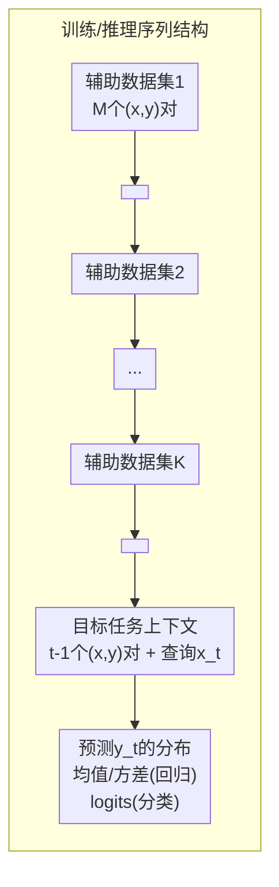

# Multi-Task Bayesian In-Context Learning

**会议**: ICML 2026  
**arXiv**: [2606.20538](https://arxiv.org/abs/2606.20538)  
**代码**: [https://github.com/martianmartina/multi-task-bayesian-icl](https://github.com/martianmartina/multi-task-bayesian-icl)  
**领域**: 贝叶斯深度学习 / 上下文学习 / 泛化  
**关键词**: 贝叶斯推断、上下文学习、层次贝叶斯模型、先验自适应、分布外泛化

## 一句话总结
本文提出多任务贝叶斯上下文学习（Multi-Task Bayesian ICL），将先验信息通过辅助数据集前缀的形式嵌入到上下文学习序列中，使Transformer能在推理时根据前缀可控地调整后验预测分布，无需重新训练即可在不同先验族间自适应迁移。

## 研究背景与动机

贝叶斯预测推断在理论上提供了不确定性量化、数据效率和鲁棒泛化的统一框架，但其核心难题是后验预测分布（Posterior Predictive Distribution, PPD）的积分通常不可处理。MCMC方法虽渐进精确但推理速度慢，变分推断（SVI）可扩展但引入近似误差。近年来，Prior-Data Fitted Networks（PFNs）和上下文学习（In-Context Learning, ICL）提供了一条折中路径：让Transformer在大量人工合成任务上训练，学会将输入数据集直接映射为预测分布——推理时不再需要显式计算后验。这类方法在速度上远胜传统贝叶斯方法，却带来了一个新问题：模型在训练阶段将某一个**固定的先验**隐式编码进了网络权重中，测试时无法改变这个先验。如果测试时的真实先验与训练时的先验不一致（例如先验的尾部行为或协方差结构不同），模型的预测会系统性偏离正确的贝叶斯后验。

这种"先验固化"的核心矛盾在于：现实中的贝叶斯推断任务很少使用同一个先验。同一研究者可能在不同实验中使用不同先验，数据量少时先验的选择尤为敏感。现有方法缺乏一个简单机制在推理时控制/切换先验，只能重新训练模型。本文的切入角度是：既然层级贝叶斯模型（Hierarchical Bayesian Model）中先验是通过一组来自该先验的"辅助数据集"来隐式表征的，那么用一组辅助数据集作为上下文前缀，就等价于在推理时向模型"展示"了新先验的样本——这相当于在数据空间里指定先验，而非在隐空间。

**核心 idea：将先验信息表示为若干个辅助数据集的序列前缀（prior prefix），用特殊token `<prior>` 和 `<target>` 分隔，训练Transformer编码器在给定前缀和目标上下文后直接输出PPD参数，使模型在推理时只需更换前缀即可适配不同先验，无需重训或更新参数。**

## 方法详解

### 整体框架

本文方法的输入是一条拼接序列，由三个部分按顺序组成：K个来自同一先验的辅助数据集（每个数据集用 `<prior>` token分隔），一个 `<target>` 分隔token，以及目标任务本身的已观测上下文对。Transformer在每个目标位置输出该位置上标签的预测分布参数（高斯分布则为均值和log方差，伯努利则为logits）。整个框架不维护显式的隐变量Z，而是让前缀集隐式携带了关于先验的信息——改变前缀集等价于改变模型"认为"的先验。

序列格式如下所示：

更具体地说，每个token表示一个输入对 (xₜ, yₜ₋₁)，方法是将原始数值拼接后投影到嵌入空间。特殊token（`<prior>`, `<target>`）使用特殊的x值以便模型识别。整个序列由decoder-only Transformer（GPT-2架构）编码，在每个目标位置产生隐状态hₜ，再通过线性映射输出预测分布的参数。

训练过程按层级贝叶斯方式生成每个episode：先从元分布 p(λ) 中采样episode级超参数λ，然后在λ条件下采样K+1个任务参数{wₖ}并生成数据集——前K个作为先验前缀，第K+1个作为目标任务。损失函数为所有目标位置上负对数似然的期望。

### 关键设计

**1. 数据空间中的先验指定：用辅助数据集前缀替代隐空间先验参数**

传统贝叶斯推断要求显式指定先验分布 p(Z) 的数学形式（如均值、协方差矩阵）。层级贝叶斯模型更进一步，认为每个任务的参数来自一个共享的元先验 p(λ)——但这依然需要在隐空间操作，对于非参数化或复杂先验（如通过flow pushforward得到的扭曲分布）难以直接接口化。本文的核心洞察是：先验 p(Z) 的统计信息完全可以通过来自该先验的一组观测数据来表征——给定K个辅助数据集 Dprior = {D⁽¹⁾, ..., D⁽K⁾}，每个D⁽ᵏ⁾ 是在同一先验 p(Z) 下独立生成的，模型的PPD应当满足：p(y|xₜ, Cₜ₋₁, Dprior) ∝ ∫ p(y|xₜ, Z) p(Z | Dprior) dZ，其中 p(Z | Dprior) 近似于以Dprior"修正"过的后验先验。因此，改变Dprior等效于改变条件先验，而不需要碰任何数学参数。这个设计的巧妙之处在于它将先验调整从隐空间工程问题变成了数据工程问题——给定一组体现新先验特征的示例数据，模型自然学到如何"隐式积分"出新先验下的PPD。从实现角度看，这意味着测试时切换先验只需更换前缀数据集，与训练过程完全解耦。

**2. 多任务上下文编码与层级结构的隐式学习**

仅把K个辅助数据集堆在序列前面并不足以保证模型正确理解层级结构——它可能简单地把所有前缀数据当成额外证据（evidence pooling），而不是当先验信息来用。本文通过两个机制来鼓励模型正确地区分"先验证据"和"任务证据"。第一，序列格式中的 `<prior>` 和 `<target>` 特殊token提供了显式的边界信号；第二（也是更重要的），训练数据的生成方式本身就模拟了层级贝叶斯的采样过程：每个训练episode从 p(λ) 采样λ，再从同一个λ下的 p(w|λ) 独立采样K+1组参数——这意味着前缀数据集的参数和目标任务参数的分布源头相同，但实现值不同。模型必须在训练中学会：前缀数据集的作用是"暗示λ是什么"，而不是"贡献给当前任务的似然"。实验中的定量验证（图4b）支持了这一机制的有效性：将多任务ICL与两个贝叶斯参考对比——一个假设所有数据共享同一隐变量（pooling），另一个使用真实先验（oracle）——多任务ICL的PPD显著更接近oracle而非pooling，说明模型没有把前缀错误地当作额外证据。

**3. 先验外推能力：在数据稀少时的先验补偿效应**

当目标任务只有极少观测对（例如logistic回归中只有5个上下文样本）时，似然信息很弱，PPD主要受先验支配。这时，没有前缀的标准ICL性能严重退化，因为它"记住"的是训练时的平均先验，在测试先验偏移时无法调整。而有前缀的多任务ICL即使在OoMD（out-of-meta-distribution）情况下也表现出对MCMC层级参考的近似：在低数据区间的KL甚至低于MCMC-hier（后者因先验错误设定而受限于错误先验）。这背后的直觉是：神经模型通过学习大量先验-数据对的映射关系，形成了对"先验空间的泛化"——它在先验参数空间插值或外推，而MCMC-hier受限于显式假设的错误先验形式，无法从不匹配的先验中逃脱。

### 损失函数/训练策略

训练目标是episode级期望负对数似然：

$$\mathcal{L}(\theta) = \mathbb{E}\left[\frac{1}{|\mathcal{T}|}\sum_{t \in \mathcal{T}} -\log p_\theta(y_t | C_{t-1}, x_t, D_{\text{prior}})\right]$$

其中 $\mathcal{T}$ 是目标任务中所有被预测的位置（排除作为上下文的起始位置）。模型采用GPT-2架构（隐藏维度128，FFN维度512，8层，8头，RoPE位置编码），共训练1000万条序列，batch size 4096，学习率在 $10^{-4}$ 到 $5\times10^{-3}$ 间搜索。

## 实验关键数据

### 主实验

**设置**：输入维度d=8，x~N(0,I)，观测噪声σ=0.5（线性回归）。K=20个先验任务，每任务M=50个上下文点。指标为KL散度（相对Oracle PPD，MCMC采样10000个后验样本）。

| 场景 | 模型 | KL (线性回归, 10个上下文) | KL (逻辑回归, 5个上下文) | KL (逻辑回归, 20个上下文) |
|------|------|-------------------------|------------------------|-------------------------|
| In-meta-distribution (IMD) | MCMC-hier (oracle参考) | ~0.005 | ~0.01 | ~0.005 |
| IMD | 多任务ICL (有前缀) | ~0.005 | ~0.01 | ~0.005 |
| IMD | ICL (无前缀) | ~0.10 | ~0.25 | ~0.01 |
| Out-of-meta-distribution (OoMD) | MCMC-hier | ~0.03 | ~0.06 | ~0.02 |
| OoMD | 多任务ICL (有前缀) | ~0.01 | ~0.03 | ~0.01 |
| OoMD | ICL (无前缀) | ~0.25 | ~0.40 | ~0.06 |

（注：以上数值为作者的Fig.2/Fig.3的目测近似值, ⚠️ 以原文为准）

### 消融实验

| 配置 | 关键发现 | 说明 |
|------|---------|------|
| K值变化 (K∈{1,5,20,30}) | 所有K下KL均保持低位 | 模型对不同数量先验任务均有效 |
| 先验任务间变异 vs K | K越大，不同前缀间的预测变异单调减小 | 符合层级贝叶斯：更多先验任务 → 更精确的先验估计 |
| 训练K与测试K不同 | OoMD K(测试)>K(训练)时退化主因序列长度外推，非推断失败 | 本质是Transformer的位置编码瓶颈 |
| 先验数据集顺序扰动 | 平均对称KL仅0.0002 | 模型几乎排列不变 |
| 池化假设检验 | 多任务ICL vs MCMC-pool: 更接近MCMC-oracle | 模型确实在做层级推断，非简单证据池化 |

### 关键发现

- **先验补偿效应**是本文最重要的定量发现：在OoMD且低数据区间，多任务ICL的KL甚至低于正确生成模型但先验错配的MCMC-hier——神经模型在"先验空间"中展现了外推能力，这在经典贝叶斯方法中不可能实现。
- **heavy-tailed泛化的阈值特征**：在Student t先验实验中，多任务ICL和MCMC-hier展现出几乎完全相同的热力图模式——当测试先验的矩性质发生质变（如自由度ν≤2时方差无定义），模型性能出现阈值性退化，且训练时需覆盖到更重的尾部才能泛化到更重的测试尾部。SVI-hier的行为模式则完全不同——训练先验的扩展对heavy-tailed推断基本无帮助。
- **流式先验扩展**：在通过spiral flow构造的高维非高斯先验上，多任务ICL在达到与MCMC-hier可比质量的同时，推理速度快了数个数量级（几毫秒 vs 数秒的MCMC warmup+采样）。
- **真实数据验证（ERA5气温预测）**：多任务ICL在IID场景下NLL从-2.02（无前缀）提升到-2.33（K=2前缀）；在OOD场景下，置换不变聚合版（Set-MT）从7.13提升到-0.20，表明合理聚合前缀可以极大提升分布外鲁棒性。

## 亮点与洞察

- **接口设计的简洁优雅**：用"数据前缀"代替"参数指定"作为先验控制接口，规避了传统方法需要定义先验函数形式的限制——任何能从采样数据表征的先验族都能被模型消费。这一设计选择让先验调整脱离了数学表达式层面的操作，变成了数据集层面的操作。
- **先验空间的泛化**：模型学到的不仅仅是"给定某个先验做推断"，而是学会了"先验间映射关系"，从而能在从未见过的先验上外推——这与预训练大语言模型的zero-shot能力本质上共享了同一种学习范式。
- **NLL指标在OOD下的陷阱**：ERA5实验中，按IID validation选出的超参数在OOD test上几乎完全反转（NLL相差极大），说明标准的网格搜索在分布偏移下不可靠，而数据集置换不变聚合能缓解这一问题——这是一个很有实操价值的发现。

## 局限与展望

- **二次复杂度**：Transformer的自注意力计算量随序列长度平方增长，多任务设定进一步放大该问题（K个辅助数据集×M个样本）。序列长度外推（附录G.2.2）也限制了测试时K的选择范围。
- **缺乏显式置换不变性**：序列内和序列间的顺序被编码进了位置嵌入，虽然实证上排列敏感性很小（KL~0.0001-0.0002），但在严格意义上的贝叶斯推断中应当是置换不变的。
- **先验类型依赖训练覆盖**：heavy-tailed实验中模型泛化到更重尾先验的能力要求训练分布有足够覆盖——这在实际应用中可能难以保证，因为测试先验的空间可能非常宽。
- **未来方向包括**：引入线性注意力或状态空间模型缓解二次复杂度；设计显式的置换不变编码；扩展到更复杂的生成模型（如图神经网络上的推断）。

## 相关工作与启发

- **vs Prior-Data Fitted Networks (PFNs)**：PFNs同样用Transformer做amortized贝叶斯推断，但将先验隐式绑定在网络权重中。本文增加的前缀接口使先普可在推理时更换。
- **vs 神经过程 (Neural Processes)**：神经过程将整个数据集编码为潜在表征再做解码预测，本质上是一阶meta-learning。本文处理的是层次贝叶斯结构中的先验-任务的二层关系。
- **vs Chang et al. (2025) 和 Whittle et al. (2026)**：这两篇工作也提供test-time先验调整接口，但要求在隐空间显式指定先验参数。本文在数据空间操作，免去了隐空间接口设计。
- **vs 标准ICL（如GPT的in-context learning）**：标准ICL不区分"先验展示"和"任务学习"——上下文中的任何例子都被同等对待。本文通过`<prior>`/`<target>`分隔和层级训练，强制模型区分两种角色的不同作用。

## 评分

- 新颖性: ⭐⭐⭐⭐ 将先验控制从隐空间迁移到数据前缀空间这一接口设计简洁且实用，但整体"amortized Bayesian inference with ICL"的方向已有先例（PFNs、Neural Processes）
- 实验充分度: ⭐⭐⭐⭐⭐ 覆盖了合成回归/分类、heavy-tailed先验、high-d流先验和真实气候数据四个场景，附录提供了排列敏感性、K值外推等深度分析
- 写作质量: ⭐⭐⭐⭐ 层次结构清晰（先形式化→再机制→再实证），附录中对"验证模型确实在做贝叶斯推断而非证据池化"的设计（图4b）是亮点
- 价值: ⭐⭐⭐⭐ 为amortized贝叶斯推断提供了实用的先验可调接口，在few-shot和分布偏移场景下有潜在应用；对先验空间中模型外推能力的分析有理论价值

<!-- RELATED:START -->

## 相关论文

- [\[CVPR 2026\] Common Inpainted Objects In-N-Out of Context](../../CVPR2026/aigc_detection/common_inpainted_objects_in-n-out_of_context.md)
- [\[ECCV 2026\] Efficient Document Tampering Localization with Multi-Level Discrepancy Features and Unified DCT-Quantization Embedding](diffnet_document_tampering_localization.md)
- [\[ACL 2026\] mdok-style at SemEval-2026 Task 10: Finetuning LLMs for Conspiracy Detection](../../ACL2026/aigc_detection/mdok-style_at_semeval-2026_task_10_finetuning_llms_for_conspiracy_detection.md)
- [\[CVPR 2026\] Learning Forgery-Aware Lip Representations Without Forgery Priors](../../CVPR2026/aigc_detection/learning_forgery-aware_lip_representations_without_forgery_priors.md)
- [\[ICLR 2026\] Learn-to-Distance: Distance Learning for Detecting LLM-Generated Text](../../ICLR2026/aigc_detection/learn-to-distance_distance_learning_for_detecting_llm-generated_text.md)

<!-- RELATED:END -->
