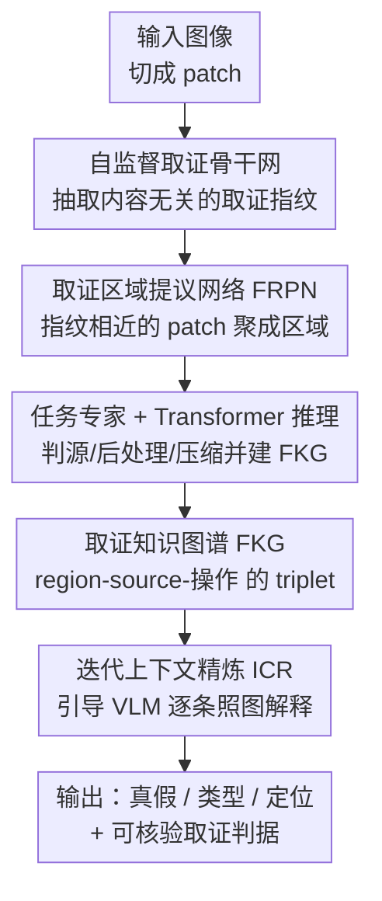

# Trustworthy Image Authentication using Forensic Knowledge Graphs

**会议**: ECCV 2026  
**arXiv**: [2606.23917](https://arxiv.org/abs/2606.23917)  
**代码**: 无  
**领域**: AIGC检测 / 图像取证  
**关键词**: 图像取证, 伪造检测, 取证知识图谱, 自监督指纹, VLM 可解释

## 一句话总结
把图像取证的「找证据」和 VLM 的「说人话」拼成一套系统：先用自监督学到的取证指纹把图像切成来源一致的区域、判定每块区域的源/后处理/压缩历史，组织成一张结构化的「取证知识图谱」，再让 VLM 依图逐条给出可核验的自然语言判据，在检测、伪造类型/定位、取证解释三个维度全面超过纯取证器和纯 VLM。

## 研究背景与动机
生成式 AI 和现代图像编辑器让造假变得极其逼真——从整图 AI 生成，到局部 splicing 拼接、局部 AI 重绘，连专业分析师都越来越难分辨。一个能被真正信任的鉴定系统需要同时满足三件事：不管哪种伪造类型都能准确检测、能用人话说清「什么被改了、怎么改的」、并且每条结论都落在可核验的证据上。可现有系统只能满足其中一部分。传统取证器（CAT-Net、TruFor、HiFi-IFDL 这类）依赖成像流水线留下的「取证微结构」——传感器噪声、去马赛克残差、压缩痕迹这些内容无关的统计指纹，检测很可靠，但每个方法只盯着一类伪造：splicing 检测器在拼接图上很准却完全漏掉 AI 生成，AI 生成检测器能揪出整图伪造却看不见传统篡改；而且它们的输出通常只是二元「真/假」标签或一张热力图，说不出任何理由。

另一端的 VLM（GPT-5、Gemini、Qwen3-VL 等）能生成自然语言解释，但它们靠的是光照不自然、纹理规律这类「看得见的语义线索」，随着生成器越来越逼真这些线索迅速消失。更要命的是 VLM 根本用不上那些不可见的统计痕迹——最新 benchmark 反复证实即使最强的 VLM 在伪造检测上也刚过随机水平，现实中甚至出现过聊天机器人信誓旦旦地把 AI 生成图判成真图，进一步侵蚀公众对数字媒体和 AI 核验的信任。于是形成一个核心矛盾：可靠检测需要的取证证据（源身份、压缩历史、修改谱系）是结构化、有因果依赖的，而能把证据讲成人话的 VLM 既拿不到这些证据、也容易凭空捏造或漏报。

本文的切入角度是：不让 VLM 去「从像素推断取证结论」，而是先由一套确定性的取证系统把证据抽出来、组织成一张显式的结构化图，再让 VLM 只负责「照图复述」。**核心 idea：用「取证知识图谱（FKG）」把每块区域的来源、后处理、压缩、修改谱系及其因果依赖显式编码成 triplet，取证判定全部来自本文的取证网络（而非 VLM 推断），VLM 仅在图的约束下生成逐条可核验的解释，从而把可靠检测、结构化推理、可解释输出统一进一套系统。**

## 方法详解

### 整体框架
系统要解决的是：给一张待鉴定图，既要判定它真假、伪造类型和位置，又要给出每条结论背后的取证依据。整体分两大块。前一块是 **FKG 生成系统**：输入图像先切成 patch，用取证骨干网抽取每个 patch 的取证指纹；接着「取证区域提议网络」（FRPN）把指纹相近的 patch 聚成「取证区域」；再由一组「任务专家网络」+「Transformer 推理模块」判定每块区域的源身份、后处理、压缩属性，并按本体（ontology）确定性地实例化成 FKG——每块区域是一个 Region 节点，通过 `produced_by` / `modified_by` / `compress_by` 等有类型的边连到源、后处理、压缩节点。关键在于这些边是从系统的逐区域预测**确定性地填进去的、不是 VLM 猜的**，所以每条关系都锚定在一个明确的取证预测上。后一块是**解释**：把 FKG 序列化成主-谓-宾 triplet，配合 Set-of-Mark 视觉标注喂给 VLM，由「迭代上下文精炼」（ICR）策略引导 VLM 生成忠实、完整、逐条落在图证据上的取证解释。

FKG 的本体定义了六类核心实体：Image（根节点）、Region（共享同一取证痕迹的像素子集，是一切关系的中心）、Source（像素来源，含 Camera Model 与 AI Generator 两个子类）、Post-Processing（生成后的重采样/模糊/加噪等操作）、Compression（压缩痕迹，记录是否未压缩、末次压缩参数、是否重压缩）、Content（语义场景元素）。当不同区域连到不同的源，图本身就直接暴露了篡改——例如一块连到 Nikon 相机、另一块连到 FLUX 生成器，且相机区域有多次重压缩而 FLUX 区域只压缩一次，就指向「事后插入内容」。

### 关键设计

**1. 自监督取证指纹骨干：用「同图 patch 共享指纹」把每张无标注图变成免费训练样本**

取证系统的地基是一个能捕捉成像流水线统计指纹的骨干网，FRPN 靠它分区、任务专家靠它判属性。以往方法用任务标签（如相机型号分类）来学这些指纹，结果把骨干绑死在特定来源上、泛化差，也天然无法覆盖 AI 生成器这种「新来源」。本文抓住成像流水线一个朴素却关键的性质：**同一张图的局部 patch 共享同一取证指纹，不同图的 patch 则不共享**。仅凭这一条，每张无标注图就成了免费监督信号，骨干可以在海量数据上学到通用取证指纹、完全不需要伪造标签或来源标注。为防止网络学到「内容捷径」（把语义相似的 patch 映到同一图），先用一个可学习的高通滤波器压掉图像内容，再用两个互补目标做自监督：一个成对相似度项强制同图对齐、异图分离，一个对比项锐化逐 patch 的判别性：

$$\mathcal{L}_{B}=\frac{1}{|\mathcal{X}|^{2}}\sum_{i,j}w_{ij}(Y_{ij}-z_{i}^{\top}z_{j})^{2}-\lambda\sum_{i}\log\frac{e^{\cos(z_{i},z_{i^{+}})/\tau}}{\sum_{j}e^{\cos(z_{i},z_{j})/\tau}}$$

其中 $z_i$ 是 L2 归一化的 patch 嵌入，$Y_{ij}\in\{0,1\}$ 标记两 patch 是否同图，$w_{ij}$ 平衡正负对，$\tau$ 是温度。正因为学的是「成像流水线的固有指纹」而非内容或某类伪造特征，它才能对 AI 生成器一视同仁——AI 生成图的指纹只是「与任何相机来源都不同」的一种，从而天然被识别。消融里去掉自监督（只靠任务标签）三项指标全线崩塌（检测 AUC 0.94→0.72、定位 F1 0.94→0.44），说明这是全系统泛化的根。

**2. 混合图注意力 Transformer（FRPN）：全局自注意力找相似、局部图注意力压误报**

拿到 patch 指纹后要把图切成「取证同质」的区域，但普通视觉分割/区域提议做不到——它们看视觉特征，而取证区域是由不可见的统计属性定义的（一块拼接区域可能视觉上天衣无缝却带着完全不同的指纹）。作者的观察是：要把图切成取证同质区域，本质是「每个 patch 和其它所有 patch 两两比较」，而这正是 Transformer 自注意力天然在算的全对操作。但纯全局自注意力有「注意力稀释」问题：远处不相关 patch 的累积贡献会让本该分开的取证区域被连到一起，造成误报和错分。于是 FRPN 交替堆叠**全局自注意力**（捕捉长程取证相似性）和**局部图注意力**（只在每个 token 的 k 近邻内聚合、用加性打分抑制误报）：

$$\alpha_{ij}^{\text{global}}=\frac{\exp(\mathbf{w}_{qi}^{\top}\mathbf{w}_{kj}/\sqrt{d})}{\sum_{m}\exp(\mathbf{w}_{qi}^{\top}\mathbf{w}_{km}/\sqrt{d})},\quad \alpha_{ij}^{\text{local}}=\frac{\exp(\sigma(\mathbf{a}_{s}^{\top}\mathbf{w}_{gi}+\mathbf{a}_{d}^{\top}\mathbf{w}_{gj}))}{\sum_{m\in\mathcal{N}(i)}\exp(\sigma(\mathbf{a}_{s}^{\top}\mathbf{w}_{gi}+\mathbf{a}_{d}^{\top}\mathbf{w}_{gm}))}$$

其中 $\mathcal{N}(i)$ 是按余弦相似度动态选出的 k 近邻。输出精炼嵌入后接一个分类头给每个 patch 预测簇分配。消融印证了两种注意力缺一不可：只留局部注意力类型准确率 0.87→0.57（长程依赖没了），只留全局注意力类型准确率 0.87→0.55（局部连通性没了、区域同质性被破坏）——恰好对应「全局找相似、局部压误报」的分工。

**3. Hungarian 匹配训练区域分配：让预测簇 ID 对齐真值区域**

FRPN 预测的簇 ID 是任意编号，和真值区域标签（如来自已知篡改掩码）对不上，不能直接算交叉熵。本文用 Hungarian 匹配找到「预测→真值」的最优对应 $\hat{\sigma}$，再把它和一个成对相似度项组合成损失——后者保留嵌入结构、让同区域 patch 在嵌入空间也靠拢：

$$\mathcal{L}_{F}=\frac{1}{|\mathcal{P}|^{2}}\sum_{i,j}w_{ij}(Y_{ij}-\tilde{z}_{i}^{\top}\tilde{z}_{j})^{2}+\alpha\sum_{i}\ell_{\text{CE}}(y_{i},\hat{\sigma}(\hat{c}_{i}))$$

两项缺一都不行：只留对比项（去掉 Hungarian）会得到不稳定、不一致的区域分配（对比学习成不了离散且语义对齐的区域）；只留 Hungarian（去掉连续相似度约束）则检测和分类都掉（连续相似度对连贯分组很关键）。同簇 patch 最终构成一块取证区域、即 FKG 里的 Region 节点。

**4. 任务专家 + Transformer 推理模块：跨任务依赖判属性，确定性映射成 FKG**

有了区域，这一步要判「每块区域到底发生了什么」并组装出 FKG。每块区域的精炼 patch 嵌入先平均池化成区域级向量 $\psi_k$，交给一组**任务专家网络**（各是专精于源识别、后处理分类、压缩分析的 MLP）产出任务特定嵌入。关键在于这些取证任务不是相互独立的——压缩痕迹能反过来帮助源识别——所以再用一个 **Transformer 推理模块**建模跨任务依赖、精炼各任务特征，最后由任务头预测二元/类别/连续输出，训练目标是各任务损失的加权和 $\mathcal{L}_{T}=\sum_{t}\lambda_{t}\mathcal{L}_{t}$（交叉熵或均方误差）。预测结果按本体确定性地实例化：每块区域变成 Region 节点、预测属性变成实体节点和 `produced_by`/`modified_by`/`compress_by` 边。正是这个跨区域关系结构让「区分伪造类型」成为可能——不同相机源揭示 splicing、源缺失揭示整图合成、真实/合成痕迹混杂揭示 AI 重绘。消融中把推理模块换成线性分类器，类型准确率掉 0.18，说明整合跨区域证据来推断篡改语义确实靠它。

**5. 迭代上下文精炼 ICR：不微调 VLM，只靠精选 in-context 例子逼 VLM 忠实照图说话**

即便把 FKG 序列化成 triplet 喂给 VLM，还有两个坎：FKG 混了符号属性和空间视觉内容、是多模态的，标准 VLM 消化不了纯图结构；而且 VLM 缺取证领域知识，容易捏造或漏报证据。第一个坎用 **Set-of-Mark 提示**解决——在图上给每块 Region 叠一个带编号的标记、triplet 里用编号符号引用，VLM 就能把场景内容和取证证据对应起来。第二个坎是 ICR 的主战场。朴素做法是 in-context learning，但人工挑好的「FKG-报告」样例不现实，现成的提示优化方法又是为「答对问题」优化、不是为「忠于结构化证据」优化。ICR 把每条 triplet 当成一个原子事实，定义两个指标——完整度（报告覆盖了多少真值 triplet）和正确度（提到的 triplet 里说对的比例）：

$$M_{\text{comp}}=\frac{1}{|F|}\sum_{j}\tau(m_j,R),\quad M_{\text{corr}}=\frac{\sum_{j}Q(m_j,R)\tau(m_j,R)}{\sum_{j}\tau(m_j,R)}$$

其中 $\tau(m_j,R)\in\{0,1\}$ 表示事实 $m_j$ 是否被报告 $R$ 提及、$Q(m_j,R)\in\{0,1\}$ 表示是否说对。ICR 的做法是「盯着 VLM 的失败模式改」：从空上下文出发，用一个裁判 LM 在训练集上评每张 FKG 的完整度与正确度，把 VLM 捏造/漏报最严重的那些 FKG 连同其错误配成「纠错示范」追加进上下文，下一轮前置到 prompt 里，如此迭代直到两指标的逐轮变化小于阈值 $\epsilon$ 收敛。整个过程纯在 prompt 层面进行、不动 VLM 参数，却能把完整度从 0.55 逼到 0.85。

### 损失函数 / 训练策略
骨干、FRPN、任务网络三部分**顺序训练**（详见原文附录 D）。骨干用 $\mathcal{L}_B$（成对相似度 + 对比）自监督；FRPN 用 $\mathcal{L}_F$（成对相似度 + Hungarian 匹配交叉熵）；任务专家/推理模块用加权多任务损失 $\mathcal{L}_T$。VLM 侧不做任何微调，仅用 ICR 在 prompt 层面优化上下文示例。

## 实验关键数据

在自建 FKG-50K（4 万训练 + 1 万评测，涵盖 splicing / 传统编辑 / AI 重绘 / 整图合成）与四个 OOD 公开集（DSO-1、CASIAv2、GenImage、Synthbuster）上，从检测、类型/定位、取证解释三个维度评估，对手同时包含取证器和 SOTA VLM。

### 主实验

伪造检测（ACC / AUC，取 Overall 与代表性 OOD）：

| 数据集 | 指标 | 本文 FKG | 最佳取证器 | 最佳 VLM |
|--------|------|----------|-----------|----------|
| FKG-50K Overall | ACC/AUC | **0.92 / 0.94** | TruFor 0.70/0.81 | GPT-5 0.66/0.72 |
| AI-Edit（最难） | AUC | **0.88** | TruFor 0.76 | GPT-5 0.60 |
| DSO-1 (OOD) | ACC/AUC | 0.92/0.96 | CAT-Net 0.99/1.00 | GPT-5 0.59/0.61 |
| GenImage (OOD) | ACC/AUC | 0.92/0.96 | NPR 0.92/0.97 | GPT-5 0.93/0.88 |

取证器只在自己训练的伪造类型上强（CAT-Net 在 DSO-1 splicing 上 AUC 1.00，却在整图 AI 上仅 0.37；NPR 在 Synthbuster 上 0.98，却在 splicing 上 0.50），没有单一取证器覆盖所有类型；VLM 能认出整图生成却抓不住保持整体视觉连贯的局部篡改。本文因为学的是通用取证指纹，成为唯一在所有类型上都强的系统。

伪造类型识别 / 定位（本文全程无 oracle，VLM 括号内为 oracle 辅助）：

| 任务 | 数据集 | 本文 FKG | 最佳 VLM(无oracle) | 最佳取证器 |
|------|--------|----------|--------------------|-----------|
| 类型 ACC | FKG-50K Overall | **0.87** | 0.31 (Qwen3 [T]) | — |
| 定位 F1 | FKG-50K Overall | **0.94** | 0.39 (Qwen3 [T]) | CAT-Net 0.47 |
| 定位 F1 | DSO-1 (OOD) | 0.95 | — | TruFor 0.93 |

取证解释（correctness / completeness，FKG-50K；VLM 均给 oracle）：

| 方法 | Overall COR | Overall COM |
|------|-------------|-------------|
| 本文 FKG（无 oracle） | **0.75** | **0.85** |
| 最佳 VLM（有 oracle） | 0.24 (Gemini) | 0.10 (Sonnet 4) |

即使把伪造类型和精确位置都喂给 VLM，它们的解释仍只覆盖约 10% 的取证事实、且多是「光照看着不一致」这类视觉臆测，而本文覆盖 85% 且落在相机型号/压缩/修改谱系等可核验痕迹上。

### 消融实验

| 配置 | Detect AUC | Type ACC | Loc F1 | 说明 |
|------|-----------|----------|--------|------|
| Ours（完整） | 0.94 | 0.87 | 0.94 | — |
| 骨干去自监督 | 0.72 (-0.22) | 0.66 (-0.21) | 0.44 (-0.50) | 只靠任务标签，指纹无法泛化，全线崩 |
| 骨干去成对相似度 | 0.90 (-0.04) | 0.63 (-0.24) | 0.86 (-0.08) | 结构对齐变弱 |
| FRPN 只留局部图注意力 | 0.85 (-0.09) | 0.57 (-0.30) | 0.93 (-0.01) | 缺长程依赖，类型掉最多 |
| FRPN 只留全局自注意力 | 0.92 (-0.02) | 0.55 (-0.32) | 0.93 (-0.01) | 注意力稀释，区域同质性破坏 |
| 只留对比损失（去 Hungarian） | 0.89 (-0.05) | 0.52 (-0.35) | 0.72 (-0.22) | 区域分配不稳定 |
| 只留 Hungarian（去对比） | 0.81 (-0.13) | 0.45 (-0.42) | 0.59 (-0.35) | 缺连续相似度，分组不连贯 |
| 去 Transformer 推理器 | 0.94 (±0.00) | 0.69 (-0.18) | 0.94 (±0.00) | 跨区域证据整合缺失，类型掉 0.18 |

ICR 消融（同一批 FKG 输入）：无上下文完整度仅 0.32；随机示例把完整度提到 0.51（教会输出格式）；加 CoT 正确度到 0.70；ICR 把完整度从 0.55 近乎翻倍到 0.85，且全程不微调 VLM。

### 关键发现
- **自监督骨干是泛化之根**：去掉后定位 F1 直接腰斩（-0.50），也是 OOD 泛化的来源——它学的是成像流水线属性而非图像内容。
- **两种注意力分工明确**：全局管「找相似」、局部管「压误报」，各去其一类型准确率都掉 0.30 左右。
- **结构对拓扑鲁棒**：整体 perfect-match 仅 0.65，但检测/定位/解释仍强——因为正确的图拓扑就足够支撑鉴定，误差多在细粒度参数（生成器型号、压缩质量）而非结构关系。AI 重绘最难（perfect match 0.58），因为 AI 编辑器基于真实像素生成、部分继承了原图取证属性。
- **人类信任实测**：30 名参与者对 5 张图打分，只给结论时平均信任 3.39，附上取证图解释后升到 4.53——可审计的证据链确实显著提升信任。

## 亮点与洞察
- **「证据抽取」与「语言解释」彻底解耦**：让确定性取证网络负责判定、VLM 只负责照图复述，从根上避免了 VLM「从像素臆测取证结论」的不可靠——这是纯 VLM 取证刚过随机水平的病灶。这个「先建结构化证据图、再让 LLM 逐条 grounding」的范式可迁移到任何「需要可核验解释」的高风险决策任务。
- **「同图 patch 共享指纹」把无标注图变免费监督**：一句朴素观察就解开了「任务标签把骨干绑死在特定来源」的死结，让骨干对 AI 生成器这种新来源天然一视同仁，是全系统泛化的支点。
- **把分区问题看成「全对比较」从而复用自注意力**：FRPN 的动机不是套 Transformer，而是「取证同质分区 = 两两比较」正好是自注意力的算子，再用局部图注意力补上注意力稀释的短板——动机具体且自洽。
- **ICR 不微调、纯 prompt 层把 completeness 翻倍**：靠裁判 LM 定位 VLM 的捏造/漏报盲区、把最差案例做成纠错示范迭代前置，为「无法微调的黑盒 VLM 如何忠于结构化证据」给了一条可复用路径。

## 局限与展望
- 作者承认细粒度参数预测（生成器型号、压缩质量）和不完美区域提议的误差传播是 perfect-FKG 重建的主要瓶颈；但强调二者都可在模块化框架内替换更强的任务专家/区域提议而不动本体、推理管线和 ICR。
- 取证解释的评测用了 LLM-as-judge（裁判 LM 判 triplet 是否被正确提及），指标本身受裁判可靠性影响，属于自动化近似。
- VLM 对手在类型/定位/解释上大多以 oracle 辅助评测，本文全程无 oracle，横向比较应带此 caveat（本文其实更吃亏却仍领先）。
- 系统依赖 EXIF 富元数据的原始相机照片构建 FKG-50K 训练数据，对元数据被抹除或经多次社交平台再压缩的真实野外图像，指纹是否仍可靠有待检验。

## 相关工作与启发
- **vs 传统取证器（TruFor / CAT-Net / HiFi-IFDL / MVSS-Net）**：它们同样用取证微结构，但作为二元检测器无法推理多条取证线索间的因果关系、每个只覆盖一类伪造、且不输出解释；本文用自监督通用指纹 + FKG 本体统一了多类型检测与结构化推理。
- **vs AI 生成检测器（NPR / UFD / DE-FAKE）**：它们只做二元判定、不定位不解释，且 UFD/DE-FAKE 用 CLIP/BLIP 嵌入而非取证特征；本文覆盖全部四类伪造并给可核验解释。
- **vs 取证 VLM（FakeShield / ForgeryGPT / SIDA）**：它们微调 VLM 但仍靠可见视觉线索、不用取证微结构，且覆盖窄（ForgeryGPT 只处理人脸）；本文把取证证据结构化后再交给 VLM，判据落在信号级痕迹上。
- **vs 通用 VLM（GPT-5 / Gemini / Qwen3-VL）**：它们能生成语言但在取证任务上刚过随机、局部篡改基本抓不住；本文让 VLM 只负责照 FKG 复述，把「检测」交给取证网络。

## 评分
- 新颖性: ⭐⭐⭐⭐⭐ 首次把结构化取证证据图作为 VLM 与取证器之间的桥梁，自监督指纹 + 混合图注意力 + ICR 三处设计都有具体动机。
- 实验充分度: ⭐⭐⭐⭐⭐ 三维度、5 数据集、十余个取证器/VLM 对手、逐组件消融 + ICR 消融 + 人类信任实验，且本文无 oracle 仍全面领先。
- 写作质量: ⭐⭐⭐⭐ 逻辑清晰、动机层层递进；本体和多阶段管线细节偏多，读者需对照附录。
- 价值: ⭐⭐⭐⭐⭐ 直指「可信媒体鉴定」这一现实痛点，可审计证据链显著提升人类信任，范式对高风险可解释决策有迁移价值。

<!-- RELATED:START -->

## 相关论文

- [\[ICLR 2026\] A Rich Knowledge Space for Scalable Deepfake Detection](../../ICLR2026/aigc_detection/a_rich_knowledge_space_for_scalable_deepfake_detection.md)
- [\[ICML 2026\] ForensicConcept: Transferable Forensic Concepts for AIGI Detection](../../ICML2026/aigc_detection/forensicconcept_transferable_forensic_concepts_for_aigi_detection.md)
- [\[ICLR 2026\] Enabling Your Forensic Detector Know How Well It Performs on Distorted Samples](../../ICLR2026/aigc_detection/enabling_your_forensic_detector_know_how_well_it_performs_on_distorted_samples.md)
- [\[ACL 2026\] AEGIS: A Holistic Benchmark for Evaluating Forensic Analysis of AI-Generated Academic Images](../../ACL2026/aigc_detection/aegis_a_holistic_benchmark_for_evaluating_forensic_analysis_of_ai-generated_acad.md)
- [\[ICML 2026\] Deep Residual Injection for Full-Spectrum Forensic Signal Perception in Multimodal Large Language Models](../../ICML2026/aigc_detection/deep_residual_injection_for_full-spectrum_forensic_signal_perception_in_multimod.md)

<!-- RELATED:END -->
