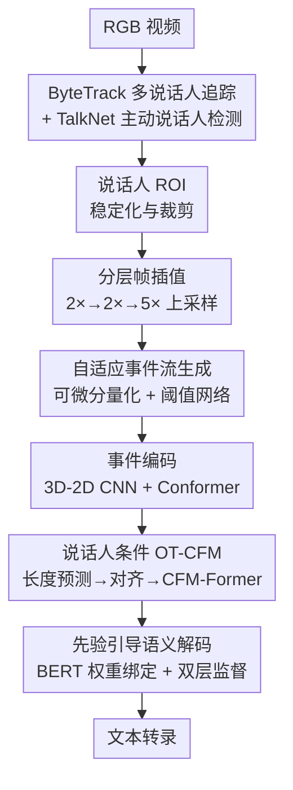

# LipsFlow：神经形态 OT-CFM 在多说话人视觉语音识别中的首次探索

**会议**: ECCV 2026  
**arXiv**: [2606.31225](https://arxiv.org/abs/2606.31225)  
**代码**: 无  
**领域**: audio_speech  
**关键词**: 视觉语音识别, 神经形态事件流, 最优传输流匹配, 多说话人, 唇读  

## 一句话总结
LipsFlow 首次将神经形态事件相机感知与最优传输条件流匹配（OT-CFM）引入多说话人视觉语音识别，通过可学习事件表示捕捉毫秒级唇部动态、OT-CFM 实现 2 步 ODE 确定性解码、以及双层语义监督解决同形异义词歧义，在 DVS-Lip 上以 22.3% WER 和 240ms 延迟取得 SOTA。

## 研究背景与动机

视觉语音识别（Visual Speech Recognition, VSR）在声学信号受损的场景中扮演着日益重要的角色——从嘈杂环境的辅助通信到无声交互界面，唇读技术正推动多模态交互的发展。然而，当前主流 VSR 系统普遍依赖标准 RGB 相机以 25-30 FPS 采集视频帧，这在处理复杂多说话人场景时面临根本性的物理瓶颈：快速唇部闭合运动（如 /p/、/b/ 等爆破音）发生在毫秒级，远超帧率的时间分辨率；头部快速转动和遮挡进一步导致运动模糊和信息丢失。已有研究尝试引入神经形态事件流来捕捉微秒级唇部动力学，但现有事件驱动的 VSR 方法要么将异步事件聚合为密集帧（丢失了事件的核心优势），要么在文本生成阶段依赖自回归（延迟累积）或标准扩散模型（需 50-1000 步采样）——前者逐 token 解码导致实时部署困难，后者虽提高了生成质量却牺牲了推理效率。

更棘手的是多说话人场景的额外挑战。真实对话场景中多个说话人交替或同时发言、被跟踪的身份因遮挡而丢失、以及非语言口部运动（咀嚼、打哈欠）与真实语音在事件流中几乎无法区分——这些因素共同导致现有系统在复杂环境中的性能急剧恶化。可以说，VSR 的核心矛盾在于：口语的精细时间动力学要求微秒级感知分辨率，但帧率受限的 RGB 传感器在物理上无法捕捉这些瞬态信息，而现有的事件驱动生成框架又在效率与保真度之间难以平衡。

本文提出的 LipsFlow 从感知和生成两个层面同时突破这一困局。感知层面，它通过可学习事件表示从 RGB 视频重建高时间分辨率事件流，用分层插值策略避免直接上采样的伪影；生成层面，它首次将最优传输条件流匹配（OT-CFM）引入 VSR 领域，以确定性的直线概率路径取代扩散模型的弯曲随机轨迹，将推理降为仅 2 步 ODE 求解。**核心 idea：以神经形态事件流替代 RGB 帧作为感知基元、以 OT-CFM 替代自回归/扩散作为解码范式，并配合双层语义监督解决唇读特有的同形异义词歧义，首次实现多说话人 VSR 的高精度实时解码。**

## 方法详解

### 整体框架

LipsFlow 的完整管线可分为三大阶段：事件表示提取、说话人条件生成、先验引导解码。输入为一段多说话人 RGB 视频，首先经过 ByteTrack 前端追踪每个说话人的时空轨迹，结合 TalkNet 主动说话人检测将场景时域分割为单说话人片段。对每个片段执行分层帧插值（2×→2×→5×），将低帧率视频上采样至 125 FPS，再通过可微量化器生成自适应事件流。事件流经混合 3D-2D 编码器和 Conformer 建模为全局上下文感知的视觉特征。视觉特征通过说话人嵌入的条件化输入给 OT-CFM 解码器——该解码器学习从高斯先验到 BERT 语义空间的确定性直线概率路径，仅需 2 步 ODE 即可恢复目标语义表示。最后，先验引导解码器通过 BERT 权重绑定将连续语义投影到离散词表，配合 token 级和句子级的双层监督来消解同形异义词歧义。

### 关键设计

**1. 可学习事件表示：以可微分方式从 RGB 重建毫秒级唇部动态**

直接从低帧率 RGB 视频生成高质量事件流并非易事。20 倍直接上采样会导致大位移超出多说话人光流场的有效感受野，产生严重鬼影伪影。LipsFlow 采用三层级联的分层插值策略（2×→2×→5×），每层用轻量 RIFE 变体估计双向光流——通过逐步细分时间间隔来缩小相邻帧间的运动幅度，使轻量骨干也能稳健估计快速唇部运动的光流。上采样后的高帧率帧通过一个可微分量化器转化为高动态范围事件流。关键创新在于引入自适应阈值网络：它用一个轻量 CNN 回归稠密阈值图 Θ，事件触发的条件为对数亮度残差超过局部阈值 $|\Delta L(\mathbf{x})| = |\log I_{t+\Delta t}(\mathbf{x}) - \log I_t(\mathbf{x})| > \theta(\mathbf{x})$。这使得网络能够选择性地放大语言相关的唇部微运动而抑制咀嚼等非语言口部噪声，训练中采用 Gumbel-Softmax 松弛保证端到端可微。事件流经混合 3D-2D 编码器（3D Stem + 2D ResNet）聚合局部运动产生 125 FPS 的特征序列，再由 12 层 Conformer 建模全局时间依赖——卷积捕获局部发音模式，多头自注意力建立长程上下文。

**2. 说话人条件 OT-CFM：以确定性的直线概率路径实现高效语义解码**

这是 LipsFlow 生成层面的核心。不同于 CTC 逐帧对齐或扩散模型的多步噪声迭代，LipsFlow 将 VSR 的文本生成重构为学习从高斯先验 $x_0 \sim \mathcal{N}(0,1)$ 到 BERT 语义空间 $x_1$ 的连续概率流 ODE。它采用最优传输（OT）路径来训练一个向量场 $v_\theta$，使其回归真实分布与先验之间的直线位移——这一几何拉直效应使 ODE 求解器仅需 2 步 Euler 积分（$\Delta t = 0.5$）就能以极低离散化误差遍历生成流形。说话人条件通过双路注入实现：视觉对齐特征 $C$ 以 Cross-Attention（$x_t$ 作 query、$C$ 作 key/value）注入，确保生成内容与唇部运动语义对齐；说话人嵌入 $s$ 和时间嵌入 $e_t$ 通过自适应层归一化调制每层计算 $\mathrm{AdaLN}(h, e_t, s) = \gamma(e_t, s) \cdot \mathrm{LN}(h) + \beta(e_t, s)$——这有效解耦了内容生成与身份调制。此外，混合长度预测器（回归+分类双头）先推断目标序列长度 $N$，再通过单调对齐模块将 125 FPS 的高频视觉流投影到 $N$ 个 token 槽上，配合 CTC 辅助损失保证对齐约束。

**3. 先验引导语义解码与双层监督：在同形异义词歧义中保持语义一致性**

唇读面临一个根本性难题：视觉相似的音素（同形异义词，如 "elephant juice" 与 "I love you"）在唇部运动上几乎不可区分，仅靠视觉信号无法消解歧义。LipsFlow 的做法是将 OT-CFM 恢复的语义表示 $x_1$ 投影到预训练 BERT 的嵌入空间 $W$ 中，利用 BERT 的语言先验作为语义锚点——通过可学习投影 $\phi(\cdot)$ 将 $x_1$ 映射到 $W$ 的语义流形，再用温度缩放余弦相似度计算词表分布 $\hat{\mathbf{y}} = \mathrm{Softmax}\left(\phi(x_1)\bar{W}^\top / (\tau \cdot \|\phi(x_1)\|_2)\right)$。仅有 token 级交叉熵损失 $\mathcal{L}_{\text{CE}}$ 还不够——它天然短视，无法感知全局语义一致性。LipsFlow 引入句子级约束 $\mathcal{L}_{\text{sem}}$：以 soft-weighted token 嵌入（预测概率为权重的词向量期望和）经均值池化后送入冻结的 Sentence-BERT 编码器 $\mathcal{E}_{\text{sent}}$，最小化预测与真值句子嵌入的 L2 距离：

$$
\mathcal{L}_{\text{sem}} = \left\| \mathcal{E}_{\text{sent}}(\mathrm{Pool}(\tilde{\mathbf{E}})) - \mathcal{E}_{\text{sent}}(\mathbf{y}) \right\|_2^2.
$$

这一句级信号通过可微路径反向传播到视觉编码器，迫使它学习具有同形异义词判别能力的特征。同时为支持变长序列输出，自终止解码器在训练时随机在目标末尾追加 `[PAD]` token，模型学会在语义流形内部化序列边界，推理时在首个终止 token 处截断。

### 损失函数 / 训练策略

总损失由 $\mathcal{L}_{\text{FM}}$（流匹配回归，驱动向量场学习直线概率路径）、$\mathcal{L}_{\text{CE}}$（BERT 权重绑定上的 token 级交叉熵）、$\mathcal{L}_{\text{sem}}$（句子级语义一致性）和辅助 $\mathcal{L}_{\text{CTC}}$（对齐约束）构成。训练采用两阶段课程：前 10 epoch 冻结视觉前端只训练生成流形（lr=5×10⁻⁴），后 20 epoch 全模型端到端微调（lr=1×10⁻⁴）。AdamW 优化器（$\beta_1=0.9, \beta_2=0.995$）、梯度裁剪 1.0、余弦退火学习率调度（2000 warmup step），4×A100(80GB) 全局 batch size=64，共约 45k 迭代（~30 小时）。

## 实验关键数据

### 主实验

| 方法 | 模态 | WER(%)↓ | VER(%)↓ | 延迟(ms)↓ | 参数量(M) |
|------|------|---------|---------|-----------|----------|
| Auto-AVSR | RGB | 28.4 | 26.1 | 580 | 256.4 |
| VATLM | RGB | 26.9 | 25.3 | 650 | 310.8 |
| RAVEn | RGB | 31.2 | 29.8 | 200 | 55.2 |
| SynthVSR | RGB | 25.1 | 23.5 | 6000 | 185.6 |
| Llama-AVSR | RGB | 23.9 | 21.5 | 2500 | >1000 |
| MSTP | Event | 30.5 | 28.2 | 280 | 22.5 |
| SNN-Lip | Event | 34.1 | 32.4 | 230 | 12.1 |
| **LipsFlow** | **Event** | **22.3** | **19.8** | **240** | **45.8** |

LipsFlow 在 DVS-Lip 上以 22.3% WER 和 19.8% VER 刷新 SOTA，超越使用 LLM 增强的 Llama-AVSR（23.9%→22.3%），表明捕捉瞬态发音动力学比简单地扩大模型参数更有效。相比同属生成式方法的 SynthVSR（扩散模型），LipsFlow 在精度相当（22.3% vs. 25.1%）的前提下推理速度快 26×（RTF 0.18 vs. 4.80）。

### 环境鲁棒性对比

| 方法 | Clean | Rapid Motion | Low Light | Severe Occlusion |
|------|-------|-------------|-----------|-----------------|
| Auto-AVSR | 28.4 | 45.2 (+16.8) | 52.1 (+23.7) | 48.9 (+20.5) |
| SynthVSR | 25.1 | 39.4 (+14.3) | 47.1 (+22.0) | 38.6 (+13.5) |
| Llama-AVSR | 23.9 | 36.5 (+12.6) | 44.3 (+20.4) | 35.1 (+11.2) |
| MSTP | 30.5 | 33.1 (+2.6) | 31.5 (+1.0) | 42.8 (+12.3) |
| **LipsFlow** | **22.3** | **24.1 (+1.8)** | **22.9 (+0.6)** | **26.5 (+4.2)** |

在 AVA 三组挑战性子集上，LipsFlow 的退化幅度远小于所有 RGB 基线——低光照下仅退化 0.6%（RGB 方法退化 20–24%），证明神经形态事件流对光照和运动模糊的天然鲁棒性。严重遮挡下 26.5% WER 仍大幅领先 Llama-AVSR 的 35.1%。

### 关键发现

- **OT-CFM 的效率优势极为显著**：NFE=1（28.5% WER）到 NFE=2（22.3%）仅增加 1 步积分就获得 6.2% 的 WER 提升，验证了 OT 路径几何拉直的有效性；NFE=2 已达到与扩散 50 步相当甚至更优的精度，但速度快 25×。
- **可学习事件流起关键作用**：消融显示引入事件分支使 WER 从 27.8%（纯 RGB AR）降至 24.5%，Cross-Attention 融合显著优于通道拼接（24.5% vs. 25.9%）。
- **说话人对比学习提升身份分离**：加入说话人对比损失后，说话人验证准确率从 78.5% 跃升至 91.7%，同时 WER 从 28.2% 降至 26.6%，说明解耦身份信息有效过滤了与语音无关的视觉噪声。
- **两阶段课程训练带来 1.4% 稳定增益**：冻结预训练流形→端到端微调比单阶段联合训练在 WER 和说话人验证准确率上均有提升。

## 亮点与洞察

- **感知-生成联合创新**：本文最让人「啊哈」的地方在于它不仅改了 VSR 的输入端（事件流取代 RGB），还改了输出端（OT-CFM 取代 AR/扩散）——两端的物理匹配（事件流提供高时间密度感知、OT-CFM 需要连续高时间密度状态）使得整体管线比零散替换任意一端更协同。
- **可学习事件阈值的巧妙设计**：自适应阈值网络让模型自主决定「什么亮度变化值得编码为事件」，从数据中学到区分语言口部运动与非语言噪声的灵敏度，比固定阈值灵活得多，且 Gumbel-Softmax 松弛保证了端到端可训练。
- **句子级语义监督的反向传播技巧**：通过 soft-weighted token 嵌入绕过 argmax 不可微问题，让句子级语义信号可以反向传播到视觉编码器，使同形异义词判别特征的学习成为可能——这一技巧可迁移到任何需要结构输出且存在语义歧义的生成任务。

## 局限与展望

- **数据规模的制约**：事件驱动 VSR 的标注数据远小于 RGB VSR（DVS-Lip 是首个大规模真实事件语料），虽采用 V2E 仿真但差距仍存，更大规模的真是事件数据可能进一步释放模型潜力。
- **多说话人场景的前提假设**：管线依赖 ByteTrack + TalkNet 前处理后分解为单说话人片段，隐含了「场景中说话人可追踪分离」的假设。在极端拥挤或快速切换的场景中，追踪失败会导致级联错误。
- **同形异义词消解的上限**：双层监督显著改善了语义一致性，但 BERT 先验本身对罕见姓名、专业术语的覆盖不足会在复杂词汇上引入偏差——如何让视觉特征在 BERT 先验不足时仍能主导决策是一个开放问题。
- **代码未开源**：论文未提及代码开源计划，复现有一定门槛。

## 相关工作与启发

- **vs MSTP [Tan22-MSTP]**: 同为事件驱动 VSR，但 MSTP 将事件聚合成体素网格后用 ResNet 处理，丢失了事件的时间颗粒度。LipsFlow 的可学习事件表示和 OT-CFM 解码在精度和效率上均大幅超越（22.3% vs. 30.5% WER）。
- **vs SynthVSR [Liu2023SynthVSR]**: 两者都采用生成式解码，但 SynthVSR 使用标准扩散模型（50+ 步），LipsFlow 使用 OT-CFM（2 步），在相当精度下实现 26× 加速，证明了「拉直路径」比「弯曲随机路径」对 VSR 更友好。
- **vs Llama-AVSR [Pan24-LLMVSR]**: 使用 LLM 增强 VSR，凭借语言先验取得较好精度但延迟极大（2500ms）。LipsFlow 在事件流感知+轻量语义编码（BERT 嵌入而非完整 LLM）上的设计选择表明，感知质量的提升比模型规模的提升对 VSR 更关键。
- **vs VoiceFlow [Guo24-VoiceFlow]**: OT-CFM 此前仅在语音合成领域应用，LipsFlow 将其迁移到 VSR（生成文本而非波形）。这一跨域迁移验证了 OT-CFM 作为通用序列生成骨干的潜力，可启发手语识别、动作识别等「连续感知→离散语义」任务。

## 评分

- 新颖性: ⭐⭐⭐⭐☆ 首次将 OT-CFM 引入 VSR，感知-生成双端创新结合紧密；但各组件（事件流、OT-CFM、BERT 绑定）并非原始发明，组合创新度高，填补了多说话人事件驱动 VSR 的空白。
- 实验充分度: ⭐⭐⭐⭐⭐ 在 DVS-Lip 和 AVA 两个基准上系统对比 RGB 和事件基线，包含 NFE 消融、损失消融、训练策略消融和环境退化分析，实验设计扎实完整。
- 写作质量: ⭐⭐⭐⭐☆ 动机明确、方法逻辑链条清晰，但 Multi-Stage Data Processing Pipeline 作为独立第 4 节与第 3 节方法并列，结构上有一定割裂感。
- 价值: ⭐⭐⭐⭐⭐ 为 VSR 领域打开了「事件流感知 + 流匹配解码」的新范式方向，精度与效率的折中在实际部署中极具吸引力，对多说话人场景的探索填补了行业空白。

<!-- RELATED:START -->

## 相关论文

- [\[ECCV 2026\] OLIVE: View-Augmented Latent Prediction with Waveform Reconstruction for Speech SSL](olive_view-augmented_latent_prediction_with_waveform_reconstruction_for_speech_ssl.md)
- [\[ECCV 2026\] MG-RWKV: Multi-Grained Context-Aware RWKV for Temporal Forgery Localization](mg-rwkv_multi-grained_context-aware_rwkv_for_temporal_forgery_localization.md)
- [\[ECCV 2026\] SwiftAudio: Data-Efficient Caption-Only Distillation for One-Step Text-to-Audio Diffusion-based Generation](swiftaudio_data_efficient_caption_only_distillation.md)
- [\[ECCV 2026\] Step-by-Step Video-to-Audio Synthesis via Negative Audio Guidance](step-by-step_video-to-audio_synthesis_via_negative_audio_guidance.md)
- [\[ECCV 2026\] See & Sniff: Learning Visuo-Olfactory Representations](see_sniff_learning_visuo-olfactory_representations.md)

<!-- RELATED:END -->
