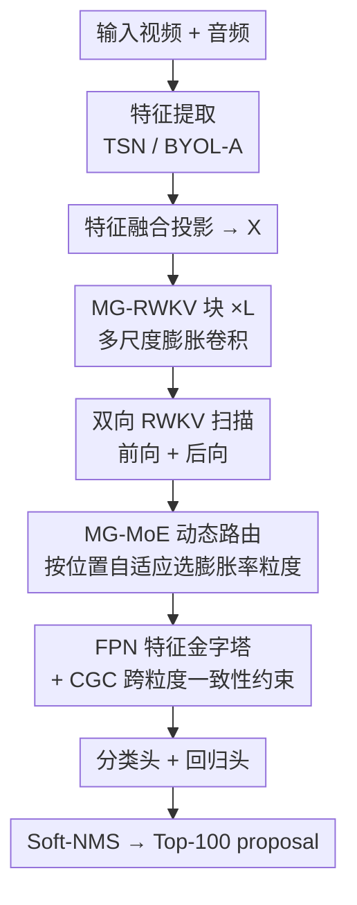

# MG-RWKV: Multi-Grained Context-Aware RWKV for Temporal Forgery Localization

**会议**: ECCV 2026  
**arXiv**: [2607.00902](https://arxiv.org/abs/2607.00902)  
**领域**: 多媒体安全 / 视频理解  
**关键词**: 时序伪造定位、RWKV、多粒度混合专家、双向递归建模、跨粒度一致性

## 一句话总结
MG-RWKV 提出基于 RWKV 线性复杂度递归架构的时序伪造定位（TFL）框架，通过双向 RWKV 捕获全局时序上下文、多粒度混合专家（MG-MoE）自适应选择显式时间感受野、以及跨粒度一致性约束（CGC）消除多尺度特征间的矛盾预测，在 Lav-DF、TVIL、Psynd、AV-Deepfake1M 四个基准上全面超越此前 SOTA，同时保持 O(T) 线性复杂度，推理仅需 73.4ms。

## 研究背景与动机
AIGC 驱动的音视频深度伪造日益逼真，攻击者往往只篡改视频中的某几个片段（如换脸、声音克隆），传统二分类真假检测已不足以应对。任务由此升级为时序伪造定位（TFL）：在一段未裁剪的长视频中，精确找出哪些时间区间被篡改过，要求模型在数百到数千帧中识别出语义替换、情绪不一致、物体修复痕迹等细微操纵线索。

现有方法面临根本性的架构瓶颈。CNN 方法受限于局部感受野，难以捕获跨时间的全局不一致性——但伪造检测恰恰需要对比"远处"的正常帧与可疑帧的差异。Transformer 方法虽有全局视野，自注意力的 O(T^2) 复杂度在处理数千帧长视频时计算和内存开销过大，迫使方法采用局部窗口注意力，绕了一圈又牺牲了全局建模能力。最近兴起的线性复杂度模型（如 Mamba 等状态空间模型）虽然效率高，却在 TFL 任务上面临一个独特的矛盾：模型既要高效压缩全局真实上下文（平滑累积），又要对伪造边界处毫秒级的突变信号保持高度敏感（快速响应）——传统线性模型的状态转移机制往往是固定或数据无关的，难以在这两者之间取得最优平衡。

本文的核心洞察在于：RWKV 架构中的"数据依赖衰减"（data-dependent decay）和动态状态演化机制，天然契合这一矛盾。RWKV 的每一步衰减率 d_t 由当前输入内容通过二次函数计算得到——当输入帧包含伪造突变时 d_t 增大、旧状态被快速冲刷、模型立即感知异常并重置上下文；在真实背景区 d_t 减小、状态平稳累积全局信息。这种"遇变则敏、无变则稳"的动态特性，使 RWKV 成为 TFL 的理想底座。基于此，本文提出 MG-RWKV，系统性地将 RWKV 改造为适用于 TFL 的线性复杂度框架。核心 idea 是：用数据依赖的线性递归状态演化替代 Transformer 的二次自注意力，通过显式多粒度感受野路由实现可解释的尺度自适应，再以跨尺度一致性约束消除多分支引入的矛盾预测，三者形成闭环——BiDir 建立全局上下文，MG-MoE 在其上做自适应多尺度路由，CGC 消除路由天然引入的跨尺度不一致。

## 方法详解

### 整体框架
MG-RWKV 的目标是输入一段未裁剪视频的特征序列 X ∈ R^{T×D}（T 为时间步数，D 为特征维度），输出每个时刻的伪造分类分数和边界偏移量，最终经 Soft-NMS 后处理得到 Top-100 伪造片段 proposal。整体流程分为四个阶段。

第一阶段是特征提取：用预训练的 TSN（视觉）和 BYOL-A（音频）分别提取特征，融合投影得到输入序列 X。第二阶段是核心的 L 层 MG-RWKV 块堆叠：每层内先做门控多尺度膨胀卷积注入局部上下文，再经双向 RWKV 扫描并通过 MG-MoE 动态路由融合不同膨胀率分支的专家输出，产生分层多尺度特征 {H^(l)}。第三阶段是自顶向下的 FPN 融合，将多尺度特征进一步精炼为 {F^(l)}，训练时施加 CGC 约束对齐相邻尺度在真实区域的特征。第四阶段是密集预测头：分类头输出每个时刻属于各类别的分数 P ∈ R^{T×N_c}，回归头输出边界偏移量 O ∈ R^{T×2}，两者结合后经 Soft-NMS 筛选出 Top-100 proposal。

### 关键设计

**1. 双向 RWKV（BiDir）：用线性复杂度实现全局双向时序上下文**

TFL 的边界定位天然需要"前后文"信息——预测伪造段起始时刻需要知道"之后"的正常帧长什么样，仅靠单向扫描会系统性地导致边界模糊。标准双向 Transformer 通过完整自注意力解决此问题，但代价是 O(T^2·d) 复杂度。以 Lav-DF 的 T≈1500 帧为例，每层约 2.25×10^6 次成对计算，不可规模化。

本文基于 RWKV-7 构建双向扩展。RWKV-7 的核心是数据依赖的状态演化：对每个时刻的输入 x_t，先做 token shift 混合相邻时刻信息得到 x_t' 和 x_t''，然后通过输入依赖的二次函数生成自适应参数——衰减率 d_t = w_0 + w_1⊙x_t' + w_2⊙(x_t')^2 和上下文调制 a_t = a_0 + a_1⊙x_t'' + a_2⊙(x_t'')^2。状态按递归式 s_t = e^{-e^{d_t}} ⊙ s_{t-1} + k_t ⊙ v_t + a_t ⊙ s_{t-1} 演化，最终输出 o_t = r_t ⊙ s_t · σ(g_t)。其中的关键是 d_t 由当前输入 x_t' 决定：当遇到伪造突变时 d_t 增大、e^{-e^{d_t}} → 0、旧状态被快速冲刷、模型立即"忘掉"过去并感知异常；在真实背景区 d_t 减小、状态平稳累积全局上下文。而 a_t 项实现上下文内状态调制（in-context state modulation），相当于让模型根据当前输入自主决定"历史状态保留多少"。整个计算仅依赖当前输入和上一时刻状态，复杂度 O(T·d^2)，线性于序列长度。

双向扩展的方法简洁高效：分别用独立参数集 θ_fwd 和 θ_bwd 各跑一次前向和后向扫描。后向扫描等价于将输入序列翻转后跑前向 RWKV 再翻转回来，得到 {F_k^fwd} 和 {F_k^bwd} 两组方向特异性特征。两个方向的参数完全独立，因此前向扫描学到"历史→当前"的因果依赖（适合检测伪造段结束后的上下文突变），后向扫描学到"未来→当前"的反因果依赖（适合检测伪造段开始前的预兆），两者互补覆盖完整时序上下文。后续由 MG-MoE 负责融合两组特征。

**2. 多粒度混合专家（MG-MoE）：显式感受野路由实现可解释的自适应尺度选择**

视频伪造的时间尺度跨度极大：帧级闪烁（如单帧换脸）需要细粒度逐帧分析，长时段场景合成（如整段语音克隆）需要粗粒度全局视野。本文的核心观察是伪造尺度并非完全随机的连续谱，而是像目标检测中物体尺度一样呈结构化分布，因此将感受野设计为显式的离散层级——每个"专家"对应一个具体膨胀率，其时间感受野是一个可计算的物理量（(w−1)×d_k+1 帧），而非靠无约束的可学习权重隐式涌现的黑盒表示。

具体设计分为专家库构建和位置自适应路由两部分。专家库构建：将尺度谱离散化为 K 个代表性膨胀率 D = {d_1, d_2, ..., d_K}（本文用 {1, 2, 4}）。输入特征 X 先经门控深度可分离膨胀卷积 X_ms = X + γ · MSConv_D(X) 注入多尺度局部上下文（γ 为可学习门控系数，控制多尺度信息的注入强度），然后分 K 路各以不同膨胀率 d_k 跑双向 RWKV。以膨胀率 d_k=2、卷积核 w=3 为例，有效时间感受野为 (3−1)×2+1=5 帧，相比 d_k=1 的 3 帧扩大了近一倍视野。由此得到 2K 个专家表示——K 个前向 + K 个后向，每个专家编码了特定时间分辨率下沿特定方向的伪造证据。

位置自适应路由：路由器的输入来自对各专家特征的两个互补池化——通道均值池化（Mean_C），捕获整体的响应能量和统计分布；通道最大池化（Max_C），保留最显著的异常尖峰信号。两者拼接后经轻量 1D 卷积和温度 τ 缩放的 softmax 产生逐位置的 K 维路由权重 W^b。为防止专家坍缩（soft mixture 会使所有专家退化为相似的平均表示），引入稀疏 Top-K 门控——每位置只保留权重最大的 K_top 个专家并重新归一化，其余置零，强制专家各司其职。本文设 K_top=2，允许相邻粒度在边界处同时激活，实现平滑的尺度过渡。最终两方向融合表示 H_fwd 和 H_bwd 经线性投影 H = W_fusion[H_fwd ⊕ H_bwd] 合并为一块的输出。

路由器的两个池化各提供不可或缺的信息：mean pooling 给出"这个区域整体上是粗粒度还是细粒度特征占优"，max pooling 确保"即使大部分帧正常，只要有一帧异常尖峰也能被路由捕捉"——两者互补，实验中同时使用（85.91 mAP）显著优于单独 mean（84.71）或单独 max（84.29）。

**3. 跨粒度一致性（CGC）：消除多尺度特征在真实区域的矛盾预测**

MG-MoE 虽然有效捕获了多尺度伪造模式，但并行异构感受野分支在真实（非伪造）区域会天然产生不一致的特征表示——粗粒度分支可能因视野过大混入远处伪造信息、细粒度分支可能因视野过小对正常纹理波动过度敏感，两者在同一个真实位置给出矛盾的特征激活，直接导致误报（false positive）。CGC 只在真实区域强制相邻 FPN 尺度间特征对齐，在伪造区域保留尺度特异性的判别能力。

CGC 通过三个联动设计维度实现精准对齐。结构上，采用分层逐对配对——只对 FPN 相邻层级 (l, l+1) 施加余弦相似度约束 L_CGC，而非一次性对齐所有尺度。这比"所有层拉到一起"更精细：相邻层之间的特征天然更相似，强对齐的阻力更小，且逐层传播即可间接实现全尺度一致，无需暴力压缩。空间上，引入边界感知权重 W_b：先对真值伪造掩码 M_gt 做半径 r 的最大池化膨胀得到 M_dilate（把边界附近的过渡帧也标记为"疑似"），取反得到负样本掩码 M_neg = M_valid ∧ ¬M_dilate；然后在负样本掩码内的边界两侧 r_b 帧范围（即 M_dilate 的边缘区）将约束强度从 1.0 降至 0.5，承认这些过渡帧确实存在尺度依赖的真实语义差异（如伪造段刚结束、模型在不同尺度下对"是否已回到正常"的判断天然不同），不应被强制对齐。时间上，采用渐进式 warmup 调度 λ_CGC(e) = λ_0 · e/E_w（前 E_w=5 个 epoch 线性增长，之后保持 λ_0=0.01），让各尺度先各自形成独立的判别表示，再逐步施加一致性约束——这三点中 warmup 贡献最大（消融中单独 +0.87 mAP），验证了"先发散、后收敛"策略是避免多尺度多样性被过早压缩的关键。

最终损失 L_CGC = (1/|P|) Σ_{(i,j)∈P} [Σ_t M_neg(t)·W_b(t)·(1 − F_t^(i)·F_t^(j)/(‖F_t^(i)‖‖F_t^(j)‖)) / Σ_t M_neg(t)]，只在训练时计算，推理零开销。

### 损失函数 / 训练策略

总损失 L_total = L_cls + λ_reg L_reg + L_reco + λ_CGC(e) L_CGC，四项分工明确：L_cls 为 Focal Loss，处理正负样本严重不平衡（伪造帧通常远少于真实帧）；L_reg 为 DIoU Loss，优化边界偏移量的回归精度；L_reco 为辅助重建损失，提供额外的表示学习信号；L_CGC 为跨粒度一致性损失，带 warmup 渐进调度。训练用 AdamW 优化器，初始学习率 10^{-4}，余弦退火调度，Lav-DF 和 TVIL 上训 45 epoch，Psynd 上训 30 epoch。损失权重 λ_reg=2.0，CGC 目标权重 λ_0=0.01，warmup 持续 E_w=5 epoch。数据增强包括随机裁剪、标签平滑和 drop path。推理时用 Soft-NMS 保留 Top-100 proposal，阈值 θ=0.01。所有实验在单卡 RTX 3090 上完成。

## 实验关键数据

### 主实验

MG-RWKV 在 Lav-DF、TVIL、Psynd 三个基准上全面达到 SOTA。下表为 Lav-DF 上的核心对比：

| 方法 | 模态 | AP@0.5 | AP@0.75 | AP@0.95 | AR@100 |
|------|------|--------|---------|---------|--------|
| BA-TFD | V+A | 76.90 | 38.50 | 0.25 | 58.42 |
| ActionFormer | V | 95.34 | 90.20 | 23.73 | 90.41 |
| UMMAFormer | V+A | 98.83 | 95.54 | 37.61 | 92.48 |
| TriDet | V+A | 96.29 | 86.84 | 23.64 | 91.00 |
| MFMS | V+A | 98.47 | 94.15 | 27.80 | 90.69 |
| **MG-RWKV** | V | 96.73 | 92.36 | 26.60 | 92.17 |
| **MG-RWKV** | V+A | **98.92** | **94.81** | **38.47** | **93.41** |

在 TVIL（仅视觉）上，MG-RWKV 以 91.22/87.44/71.31（AP@0.5/0.75/0.95）全面超越 UMMAFormer（88.68/84.70/62.43），其中严格阈值 AP@0.95 提升 8.88 个百分点，缓解了此前方法在精确边界定位上的系统性短板。在 Psynd（纯音频）上，AP@0.95 从 UMMAFormer 的 79.87 跃升至 90.09（+10.22%），AP@0.5 均为 100.00，AR 接近饱和（98.61），验证了多粒度时序建模对非视觉模态同样有效。三个数据集覆盖多模态伪造、视频修复、语音克隆三种迥异的伪造类型，一致的显著提升表明 MG-RWKV 解决的是 TFL 的基础性瓶颈而非针对特定伪造类型的调参。

在更大规模的 AV-Deepfake1M（超百万段 LLM 驱动的音视频伪造）上，MG-RWKV 以 87.60 AP@0.5 和 24.53 AP@0.95 领先 DiMoDif（86.93/5.43）。更重要的是精度衰减比——AP@0.5 到 AP@0.95 的退化倍数，UMMAFormer 为 32.7×，DiMoDif 为 16.0×，MG-RWKV 仅 3.57×，说明其边界估计不是"碰巧在宽松阈值下重合"，而是被双向递归和 CGC 结构性约束为精确时间范围。

### 消融实验

在 TVIL 上的渐进式组件消融（Baseline = 单向 RWKV-7 + FPN，不含 BiDir/MG-MoE/CGC）：

| 配置 | BiDir | MG-MoE | CGC | mAP | AP@0.95 | AR@100 |
|------|-------|--------|-----|-----|---------|--------|
| Baseline | × | × | × | 83.32 | 63.37 | 90.86 |
| +BiDir | ✓ | × | × | 83.08 | 66.58 | 91.01 |
| +MG-MoE | ✓ | ✓ | × | 84.35 | 65.87 | 91.57 |
| Full (MG-RWKV) | ✓ | ✓ | ✓ | **85.91** | **71.31** | **92.24** |

三个组件贡献各有侧重。BiDir 主要提升严格阈值 AP@0.95（+3.21），因其双向上下文直接改善边界定位精度，但 mAP 在 TVIL 上仅微降 0.24（注：在 Lav-DF 和 Psynd 上 BiDir 均带来 mAP 正收益，TVIL 的微降系该数据集伪造模式特点）。MG-MoE 通过自适应粒度选择贡献 mAP +1.27。CGC 贡献最大（mAP +1.56，AP@0.95 +5.44），因为跨尺度一致性直接压制了多尺度特征在真实区域的误报，效果在严格边界阈值下尤为显著。

MG-MoE 子组件消融（TVIL）：膨胀率组合 {1,2,4} 达最优 85.91 mAP，超过单尺度（83.65）和四尺度 {1,2,4,8}（85.10），说明 3 个适度间隔的尺度最优，过多尺度引入时序过度平滑反而模糊边界。Top-K=2 最优（85.91），K=1（84.43）过于刚性、边界处无法平滑过渡，K=3（85.66）引入冗余噪声。路由器输入 mean+max 拼接（85.91）优于单独 mean（84.71）或单独 max（84.29），验证了全局统计分布和局部异常尖峰对尺度选择同时不可或缺。

CGC 子组件消融（TVIL）：基础 L_CGC 带来 +0.42 mAP；加边界感知权重 W_b 再 +0.27；加 warmup 调度 λ(e) 贡献最大 +0.87 mAP，三项累计 +1.56 mAP。warmup 贡献最大验证了核心设计直觉：训练早期如果立刻施加跨尺度一致性约束，各尺度尚未形成独立的判别表示就被强行对齐，多尺度多样性被压垮；先让各尺度自由发育 5 个 epoch 再逐步收敛，是 CGC 发挥作用的必要条件。

### 关键发现

- **CGC 的 warmup 是消融中贡献最大的单一设计选择**（+0.87 mAP），说明"先发散后收敛"是多尺度一致性约束生效的关键前提，这一教训适用于任何需要对多分支施加对齐约束的任务。
- **RWKV-7 底座显著优于 Mamba**：相同设置下换用 Mamba 作为骨干，mAP 从 82.43 降至 80.15，验证了 RWKV 的数据依赖衰减和上下文状态调制机制对局部伪造突变感知的优势是实质性的，而非仅仅因为它是线性模型。
- **MG-MoE 路由可视化揭示清晰的语义模式**：粗粒度专家在伪造段核心区域权重占优（需要大范围上下文捕获篡改模式），细粒度专家在边界和真实区域激活（需要精确逐帧定位），且边界处有平滑的尺度过渡——证明路由器学到了位置自适应的时序属性，而非简单过拟合到离散标签。这一可解释性是赋予专家显式物理含义（膨胀率）的直接红利。
- **推理效率**：完整模型在 RTX 3090 上推理 73.4ms、占 274MB 显存、56.2M 参数，CGC 零推理开销。相比 Baseline 的 34.3ms/199MB/36.7M，以约 2× 推理时间和 1.5× 参数的代价换取了 4.86 mAP 的收益，效率-精度比合理。

## 亮点与洞察

- **RWKV 的数据依赖衰减天然适配 TFL 的"全局平滑 vs 局部突变"矛盾**：这是整篇论文最深层的洞察。RWKV 的每一步衰减率 d_t 由当前输入通过二次函数 w_0 + w_1⊙x_t' + w_2⊙(x_t')^2 计算得到——当输入帧包含伪造突变时 d_t 增大、状态被快速冲刷，模型立即"重置"上下文并感知异常；在真实背景区 d_t 减小、状态平稳累积。这种"遇变则敏、无变则稳"的动态特性，不是事后加的正则项或门控，而是 RWKV 递归结构自带的属性，恰好解决了 TFL 的核心矛盾。本文不是简单的"Swap Transformer → RWKV"，而是识别出 TFL 任务需求和 RWKV 架构特性之间的深层对齐。
- **MG-MoE 用膨胀率赋予专家显式物理含义**：传统 MoE 的专家是黑盒 FFN，选哪个专家缺乏语义解释。本文让每个专家对应一个显式膨胀率 d_k，其时间感受野是精确可计算的物理量（如 d_k=4, w=3 对应 9 帧视野），路由权重直接反映"这个位置需要多大时间视野"。可视化后呈现出粗粒度→伪造核心、细粒度→边界和真实的清晰模式，这在深度学习可解释性稀缺的安全领域尤为珍贵。这种"给专家赋予物理含义"的设计思路可迁移到任何需要多尺度感知的时序任务（如时序动作检测、视频异常检测等）。
- **CGC 的三维联动设计贯彻了"约束不是越严越好"的哲学**：分层逐对配对（避免全局压缩）、边界感知权重（承认过渡带的合理性）、warmup 调度（给多样性留出发育窗口）——三个维度单独看都不新奇，但形成合力后让 CGC 从"在所有地方对齐所有尺度"变成了"在合适的地方、合适的时机、以合适的强度对齐"。这种给约束留余地的思路在后续的多分支/多尺度架构设计中值得复用。
- **AV-Deepfake1M 上的精度衰减比分析极具洞察力**：通过 AP@0.5/AP@0.95 比值衡量边界稳定性，MG-RWKV 的 3.57× vs DiMoDif 的 16.0× vs UMMAFormer 的 32.7×——这组数字比绝对精度值更有说服力地证明了 CGC 约束确实在"结构性地改善边界质量"，而不仅是数字上的微调提升。这种分析方式值得在其他定位/检测任务中推广。

## 局限与展望

- **多模态融合较为初步**：当前仅将 TSN 和 BYOL-A 特征拼接投影后送入 RWKV，没有设计专门的跨模态交互机制（如交叉注意力、跨模态门控）。在 AV-Deepfake1M 这类音视频联合伪造场景下，两条模态的伪造往往同时发生，它们之间的不一致性本身就是强检测信号，但当前框架未能显式利用。可以考虑在 MG-RWKV 块内引入跨模态门控——让视觉 RWKV 和音频 RWKV 的状态互相调制——或设计模态间的交叉扫描路径。
- **膨胀率组合靠手动设定**：{1, 2, 4} 虽然在实验中最优，但这种离散化本质上是先验选择。对于全新类型的伪造（如极长时段场景替换或极短帧级注入），固定的离散尺度谱可能覆盖不足。可探索基于内容的动态膨胀率生成（如用小网络根据输入统计自动预测最优膨胀率），或连续尺度参数化（将膨胀率设为可微分参数端到端优化）。
- **CGC 的超参需要针对目标域微调**：虽然论文展示了 λ 和 r 在较大范围内稳定（λ∈[0.01,0.03], r∈[6,10]），但不同数据集的最优值仍有差异。实际部署时可能需要少量目标域标注数据来调这两个超参。可以通过元学习或自适应调度（根据训练过程中各尺度的特征分散度自动调整 λ）来减少人工干预。
- **未利用 RWKV 的递归推理特性**：RWKV 的递归形式天然支持逐帧增量推理（类似 RNN 的隐藏状态传递），但本文仍按整段视频批处理。对于实时视频流监测场景，可以每次仅处理新到达的若干帧、复用之前的状态缓存，实现真正的流式 TFL，这比 Transformer 需要重算整段历史有巨大速度优势。论文未涉及此方向，是明显的未开发潜力。
- **仅在中等规模数据集上验证，缺乏更广泛的跨域评估**：虽然覆盖了三个主流基准和附录中的 AV-Deepfake1M，但伪造类型的多样性仍有限（内容驱动的换脸、视频修复、语音克隆）。更复杂的场景如部分帧替换、渐进式篡改、多段交叉伪造等尚未涉及。在更宽泛的跨域设置下（如训练于 Lav-DF 测试于 TVIL）评估泛化能力会更有说服力。

## 相关工作与启发

- **vs UMMAFormer（此前 TFL SOTA）**：UMMAFormer 采用 Transformer 骨干 + 时间异常注意力 + 交叉注意力 FPN，在 Lav-DF 上 AP@0.95 为 37.61，复杂度 O(T^2)。MG-RWKV 将骨干替换为 RWKV 并将建模从注意力改为递归，AP@0.95 提升至 38.47，复杂度降至 O(T)。核心差异不在 FPN 或预测头（两者结构相似），而在骨干的建模方式——UMMAFormer 的自注意力对所有位置一视同仁地计算交互，MG-RWKV 的数据依赖衰减则让与当前帧相似度低的历史信息被更快遗忘、相似度高的被保留，这是一种更符合时序因果的上下文建模。
- **vs Mamba 等状态空间模型**：Mamba 的状态转移机制是数据选择性的（通过输入依赖的 Δ 控制离散化步长），但其状态更新公式本质上仍是线性的，缺乏 RWKV 中 a_t ⊙ s_{t-1} 这种显式的上下文内状态调制项。在 TFL 上 Mamba 的 mAP 为 80.15 vs RWKV-7 的 82.43，差距 2.28 点，证实了在需要"遇突变更敏感"的任务中，显式的状态调制机制比隐式的步长控制更有效。这个发现对一般异常检测任务的骨干选择有参考价值。
- **vs DiMoDif（AV-Deepfake1M 强基线）**：DiMoDif 在宽松阈值下 AR 更高（AR@5: 76.64 vs 69.03），但在严格阈值下精度急剧下降（AP@0.95: 5.43 vs 24.53）。这种精度-召回的不对称反映了两者不同的隐含偏好——DiMoDif 倾向于生成覆盖范围较宽的粗粒度 proposal（召回高但边界不准），MG-RWKV 的 CGC 约束使其偏好更精确的边界（精度高但可能漏掉一些边缘 proposal）。对于取证场景，精确边界的重要性通常高于召回率（错标边界比漏检更危险），因此 MG-RWKV 的取舍更合理，但若下游任务更看重召回（如初筛），DiMoDif 的方向仍有价值。

## 评分
- 新颖性: ⭐⭐⭐⭐ 用 RWKV 做 TFL 本身有新颖性，但更大亮点在于挖掘了 RWKV 数据依赖衰减与 TFL 任务需求之间的深层契合（而非简单架构替换），以及 MG-MoE 将膨胀率赋予专家以显式物理含义 + CGC 的三维联动设计，构成了系统性的新框架。
- 实验充分度: ⭐⭐⭐⭐⭐ 四个数据集（含大规模 AV-Deepfake1M）+ 渐进式组件消融 + MG-MoE 和 CGC 分别的细粒度子组件消融 + 超参敏感性分析 + 效率/内存对比 + 路由可视化 + 定性对比，覆盖全面且每个消融都辅以有洞察力的分析而非单纯罗列数字。
- 写作质量: ⭐⭐⭐⭐ 动机链完整（矛盾→洞察→设计→验证），核心公式与文字配合得当，图和表的信息密度高。附录中的精度衰减比分析和渐进可视化进一步增强了论述说服力。小瑕疵是辅助重建损失 L_reco 的具体形式未展开说明。
- 价值: ⭐⭐⭐⭐ TFL 是 AIGC 安全领域的核心子问题，随着深度伪造技术扩散其实用需求持续增长。本文提供了在消费级 GPU 上可运行的线性复杂度高精度方案，且 MG-MoE 的可解释路由和 CGC 的约束设计思路对一般时序检测/定位任务（时序动作检测、视频异常检测、音频事件定位等）有直接的迁移价值。

<!-- RELATED:START -->

## 相关论文

- [\[AAAI 2026\] DeformTrace: A Deformable State Space Model with Relay Tokens for Temporal Forgery Localization](../../AAAI2026/audio_speech/deformtrace_a_deformable_state_space_model_with_relay_tokens_for_temporal_forger.md)
- [\[CVPR 2026\] GEM-TFL: Bridging Weak and Full Supervision for Forgery Localization](../../CVPR2026/audio_speech/gem-tfl_bridging_weak_and_full_supervision_for_forgery_localization_through_em-g.md)
- [\[CVPR 2026\] FoleyDirector: Fine-Grained Temporal Steering for Video-to-Audio Generation via Structured Scripts](../../CVPR2026/audio_speech/foleydirector_fine-grained_temporal_steering_for_video-to-audio_generation_via_s.md)
- [\[ACL 2026\] Towards Fine-Grained and Multi-Granular Contrastive Language-Speech Pre-training](../../ACL2026/audio_speech/towards_fine-grained_and_multi-granular_contrastive_language-speech_pre-training.md)
- [\[ICML 2026\] MECAT: A Multi-Experts Constructed Benchmark for Fine-Grained Audio Understanding Tasks](../../ICML2026/audio_speech/mecat_a_multi-experts_constructed_benchmark_for_fine-grained_audio_understanding.md)

<!-- RELATED:END -->
