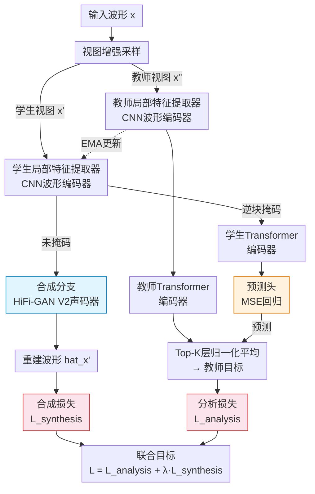

# OLIVE: View-Augmented Latent Prediction with Waveform Reconstruction for Speech SSL

**会议**: ECCV 2026  
**arXiv**: [2606.30356](https://arxiv.org/abs/2606.30356)  
**代码**: 有（训练后将公开）  
**领域**: 语音处理 / 自监督学习 / 语音生成  
**关键词**: 语音自监督学习、分析-合成联合建模、掩码蒸馏、波形重建、HiFi-GAN

## 一句话总结
OLIVE 提出一种同时优化「分析」（视图增强掩码蒸馏）与「合成」（波形重建）的语音自监督学习框架，通过在早期编码器特征上施加重建约束、后期上下文表征由不变性蒸馏主导，使单一预训练模型兼顾下游判别任务与高质量波形生成。

## 研究背景与动机

近年来语音自监督学习取得了长足进展：wav2vec 2.0 引入掩码潜在预测与对比学习，HuBERT 用离线聚类替换在线量化，WavLM 加入降噪预训练，data2vec 系列则使用连续上下文化教师目标的掩码自蒸馏。这些方法的共同特点是聚焦于**判别任务**——它们的目标是提取对下游预测任务（如语音识别、说话人识别）最有效的表征，在此过程中不可避免地丢弃了波形级生成所需的信息。然而语音通信本质上包含两个紧密耦合的过程：感知（hearing）与产生（speaking）。经典语音处理长期通过**分析-合成范式**（analysis-synthesis）拥抱这一双重性：信号被分解为结构化分量、随后被重建。近期的神经研究在冻结的 SSL 表征上训练解码器，实现了神经分析-合成流水线，但合成始终被当作下游应用而非预训练目标。

尽管有上述动机，合成在现代语音 SSL 系统中仍然处于边缘位置。data2vec-SG 在 data2vec 上增加了重建目标但预训练后丢弃了解码器，UniWav 联合训练编码器-解码器但操作在中间声学特征而非原始波形上。核心矛盾在于：纯判别模型丢弃生成关键信息，而纯生成模型在判别任务上表现不足——至今没有一个方法能在单一预训练阶段同时保留判别能力与波形级生成能力。OLIVE 的切入角度是：既然语音 SSL 的早期层保留更多声学细节而后期层面向语义抽象，就可以把两种目标按编码器深度分开——重建约束只施加在早期局部特征上，让后期 Transformer 层主要由不变性蒸馏塑造。**核心 idea：在单阶段预训练中联合优化视图增强掩码蒸馏（分析）与局部特征条件波形重建（合成），通过编码器深度上的功能分离使早期特征保留重建所需的声学细节、后期特征面向鲁棒的下游判别。**

## 方法详解

### 整体框架

OLIVE 采用双分支 teacher-student 架构。输入波形经两次独立增强采样生成学生视图（student view）与教师视图（teacher view），两者通过**共享的卷积波形编码器**得到局部特征序列。分析分支：学生局部特征经过逆块掩码后送入 Transformer 编码器，预测教师从顶层 Transformer 层生成的实例归一化平均目标（MSE 回归），教师参数通过 EMA 从学生更新。合成分支：学生局部特征（未掩码版本）直接条件一个 HiFi-GAN V2 声码器，重建原始波形。两个目标通过加权求和联合优化。

### 关键设计

**1. 视图增强掩码蒸馏：双视图不变性学习**

分析分支建立在 data2vec 2.0 的 teacher-student 框架之上，但关键区别在于学生和教师各自使用**独立采样**的波形增强（如 mixup、gain perturbation），而不是同一输入的两个掩码视图。这些增强定义表征应该对哪些声学变化保持不变——例如 mixup 鼓励对背景干扰鲁棒，gain 鼓励对录制增益不变。教师目标取自 Top-K 层 Transformer 输出的实例归一化平均，学生只在掩码帧上做 MSE 回归。教师参数不做梯度更新，而是从学生参数的 EMA 更新。这种双视图设计让表征在学习上下文语义的同时，强制对增强引入的声学变化具有不变性，而传统单视图掩码蒸馏不具备这种不变性归纳偏置。

**2. 局部特征条件波形重建：早期层保留声学细节**

合成分支的核心洞察是：**解码器不该接在高度抽象的 Transformer 输出上**。卷积波形编码器的输出（local encoder features）保留了细粒度声学细节（时序分辨率 20ms、感受野仅 25ms），而深层 Transformer 输出已经高度上下文化，丢失了波形重建所需的局部结构。因此 OLIVE 将 HiFi-GAN V2 声码器直接条件在早期 CNN 局部特征上。生成器从这些特征重建波形的每个样本点，配合 mel-频谱 L1 损失 + 对抗损失 + 特征匹配损失进行训练。实验验证了这一设计：从局部特征重建的 PESQ 明显优于从 Transformer 前几层重建的结果。联合训练后，这一重建约束迫使 CNN 局部特征**必须**保留波形级信息，从而间接提升了整个表征对细粒度声学内容的编码能力。

**3. 统一联合优化与功能分离**

最终损失为 $L_{OLIVE} = L_{analysis} + \lambda_{synthesis} L_{synthesis}^G$，其中 $\lambda_{synthesis}=25$ 由消融实验确定。分析损失的数值尺度（在 $d=768$ 维特征空间上累积误差）远大于合成损失的数值尺度，因此需要一个非单位权重来平衡。这一联合损失同时更新学生编码器、预测头和 HiFi-GAN 生成器；教师仅通过 EMA 更新；判别器参数单独优化。关键点是梯度在编码器中的传播路径：合成损失的梯度作用于 CNN 特征编码器，而分析损失同时作用于 CNN 编码器和 Transformer 编码器——这自然实现了「重建约束服务早期层、不变性约束服务后期层」的功能分离。预训练后仅保留编码器与生成器（5.3M 参数），判别器丢弃。

### 一个完整示例

以一段 0.44 秒（7040 采样点 @16kHz）的语音片段为例。原始波形经波形 CNN 编码器得到 $T=22$ 帧（20ms/帧）的局部特征序列（维度 768）。分析分支中，学生视图的局部特征按 50% 比例做逆块掩码（连续掩码块宽 5 帧），掩码后的特征序列过 12 层 Transformer，取第 12 层输出特征经过卷积预测头，在掩码位置与教师目标做 MSE 回归。合成分支中，同一段语音的学生视图 CNN 局部特征直接送入 HiFi-GAN 生成器，经过上采样率 [10,8,2,2] 的四级转置卷积，逐步恢复时间分辨率至原始波形长度，配合多周期（MPD）与多尺度（MSD）判别器提升感知质量。

### 损失函数 / 训练策略

- **分析损失**：掩码帧上的 MSE $L_{analysis} = \frac{1}{|M|} \sum_{t \in M} \|p_\theta(h'_t) - \text{sg}(z''_t)\|_2^2 \cdot d^{-1/2}$
- **合成损失**：HiFi-GAN 三部分——mel 频谱 L1 重建、LSGAN 对抗、特征匹配
- **预训练配置**：Adam 优化器，峰值学习率 $7.5 \times 10^{-4}$，余弦衰减 + 8k 预热，400k 更新，批量 72 utterance/GPU，2×H100 训练 206h
- **数据**：LibriSpeech 960h 无标注语音（16kHz），实时波形 mixup 增强

## 实验关键数据

### 主实验

OLIVE 在 SUPERB 基准上覆盖 5 大类 14 个子任务，与 wav2vec 2.0 / HuBERT / WavLM / data2vec / data2vec 2.0 公平对比（均 Base 规模、LibriSpeech 960h 预训练）。

| 任务类别 | 指标 | OLIVE-J | data2vec 2.0 | WavLM Base | 提升 |
|---------|------|---------|--------------|------------|------|
| 说话人识别(SID) | Acc.↑ | **83.1** | 45.5 | 62.3 | +37.6 vs d2v2.0 |
| 说话人验证(ASV) | EER↓ | 5.8 | 5.5 | 5.8 | 持平 SOTA |
| 说话人日志(SD) | DER↓ | **4.6** | 6.3 | 5.4 | -1.7 vs d2v2.0 |
| 语音增强(SE) | PESQ↑ | **3.10** | 2.96 | 2.99 | +0.14 vs WavLM |
| 源分离(SS) | SI-SDRi↑ | **12.3** | 10.4 | 10.8 | +1.9 vs d2v2.0 |
| 语音识别(ASR) | WER↓ | 6.4 | **4.8** | 6.2 | 略降但可比 |
| 综合 SUPERB s | ↑ | 909 | 837 | 876 | +72 vs d2v2.0 |
| 综合 WavLM s | ↑ | **67.6** | 65.3 | 66.6 | +1.0 vs WavLM |

波形重建对比（LibriSpeech test-clean，同配置 HiFi-GAN V2）：

| 模型 | PESQ↑ | STOI↑ | SI-SDR↑ | F0 MAE↓ | UTMOS↑ |
|------|-------|-------|---------|---------|--------|
| data2vec 2.0 | 2.21 | 0.917 | -9.67 | 13.0 | 3.63 |
| OLIVE-A (Mix+Gain) | 2.62 | 0.929 | -3.36 | **11.6** | 3.70 |
| OLIVE-J (integrated) | 2.88 | 0.921 | **2.50** | 10.0 | 3.78 |
| OLIVE-J (frozen feat-cond.) | **3.06** | **0.942** | **2.94** | **9.6** | **3.83** |

### 消融实验

| 配置 | SUPERB s↑ | PESQ↑ | 说明 |
|------|-----------|-------|------|
| OLIVE-J (完整) | 909 | 3.10 | 联合分析+合成 |
| OLIVE-A (Mix+Gain) | **911** | 3.06 | 仅分析，mixup+增益增强 |
| OLIVE-A (Mix) | 886 | 3.05 | 仅分析，仅 mixup |
| OLIVE-J w/ λ=1 | — | 2.27 | 合成权重过小 |
| OLIVE-J w/ λ=50 | — | 2.79 | 合成权重过大，判别指标下降 |
| OLIVE-J w/ local feat. cond. | — | **最佳** | 局部特征优于 Transformer 层 |
| data2vec 2.0 Base | 837 | 2.21 | 纯分析基线 |

### 关键发现

- 联合训练对说话人识别影响最大：SID 从 45.5→83.1（+83%），远超纯分析基线。这是因为说话人身份信息大量存在于细粒度声学细节中，重建目标强制保留了这些细节
- 训练的 vocoder（HiFi-GAN V2，1.1M 参）在冻结 OLIVE-J 编码器特征上重建的 PESQ=3.06，而从头训练在 data2vec 2.0 上仅 2.21，说明联合训练确实使表征保留了更多可重建信息
- ASR 有小幅下降（data2vec 2.0 的 4.8→OLIVE-J 的 6.4 WER），说明重建目标对纯语义任务带来了一定干扰，但仍在 Base 规模 SSL 系统的合理范围内
- 合成权重 λ=25 是消融选出的最佳平衡点：λ=1 重建效果差，λ=50 判别指标显著下降

## 亮点与洞察

- **编码器深度功能分离**是最巧妙的设计：不是简单地在总损失上加重建项，而是精确地决定「在哪层加、加在谁身上」——重建约束只作用于早期 CNN 特征，Transformer 层不受直接影响，这让两类目标几乎正交
- **视图增强与掩码蒸馏耦合**：双视图独立增强让不变性学习更系统化，而不仅仅是 data2vec 2.0 的重复掩码
- **联合训练的价值**：OLIVE-J 的 frozen feat-cond. 重建质量远超所有纯分析基线，证明联合训练「教会」了编码器保留哪些信息——这是一种隐式的信息瓶颈调控
- 重建目标可以自然迁移到**语音增强、说话人验证、语音转换**等需要细粒度声学信息的任务

## 局限与展望

- **仅限英语**、Base 规模、LibriSpeech——更大数据、更多语言、更大模型规模下的表现未知
- ASR 性能相比纯分析 SOTA 有下降（6.4 vs 4.8 WER），表明重建目标与纯语义编码之间存在固有张力，需要更精细的层分配或自适应权重
- 联合训练 206h（vs 纯分析 123h），计算开销增加 67%
- 集成 vocoder 的 Mel-L1 / LSD 不如 frozen feat-cond.，表明联合训练对 vocoder 端有妥协，未来可探索分阶段训练策略
- **此论文为 arXiv:2606.30356 语音自监督学习论文，原拟定 deepfake 检测 stub 不匹配，本文按实有内容写入 audio_speech 区域**

## 相关工作与启发

- **vs data2vec 2.0**: 是 OLIVE 的直接基线。OLIVE 增加了视图增强（双视图独立增强而非同一视图的不同掩码）和合成重建分支。data2vec 2.0 更高效（单视图、复用教师目标），OLIVE 以额外计算换取生成能力的提升
- **vs data2vec-SG**: 最早在 data2vec 上加重建目标的尝试，但预训练后丢弃解码器。OLIVE 保留解码器并直接重建原始波形（而非中间声学特征），更彻底地实现了分析-合成联合
- **vs UniWav**: 联合训练编码器-解码器但操作在 mel-频谱等中间特征上。OLIVE 的 HiFi-GAN 在原始波形域重建，且梯度仅作用于 CNN 编码器而非全部编码器——功能分离更精细
- **vs WavLM**: WavLM 通过降噪预训练提升副语言和说话人任务，OLIVE 通过重建目标实现类似但更系统的效果

## 评分

- 新颖性: ⭐⭐⭐⭐ 分析-合成联合预训练并非首创（data2vec-SG、UniWav 已有类似思路），但「编码器深度功能分离 + 双视图增强 + HiFi-GAN 原始波形重建」的组合是新颖且自洽的设计
- 实验充分度: ⭐⭐⭐⭐⭐ SUPERB 14 任务 + 波形重建 8 指标 + 消融（损失权重/增强选择/条件层/声码器增强），对比基线全面；不足是缺乏更多语言和模型规模的实验
- 写作质量: ⭐⭐⭐⭐⭐ 动机清晰、方法自洽、实验组织有序，消融设计（先 small 选变体 → 再 Base 完整训练）科学严谨
- 价值: ⭐⭐⭐⭐ 对需要「单模型同时做判别+生成」的应用场景（说话人验证+语音转换、语音增强等）有直接实用价值；功能分离的设计思路可迁移到其他模态的 SSL 预训练

<!-- RELATED:START -->

## 相关论文

- [\[ICLR 2026\] Toward Complex-Valued Neural Networks for Waveform Generation](../../ICLR2026/audio_speech/toward_complex-valued_neural_networks_for_waveform_generation.md)
- [\[ICLR 2026\] Latent Speech-Text Transformer](../../ICLR2026/audio_speech/latent_speech_text_transformer.md)
- [\[AAAI 2026\] SpikCommander: A High-Performance Spiking Transformer with Multi-View Learning for Efficient Speech Command Recognition](../../AAAI2026/audio_speech/spikcommander_a_high-performance_spiking_transformer_with_multi-view_learning_fo.md)
- [\[NeurIPS 2025\] Unifying Symbolic Music Arrangement: Track-Aware Reconstruction and Structured Tokenization](../../NeurIPS2025/audio_speech/unifying_symbolic_music_arrangement_track-aware_reconstruction_and_structured_to.md)
- [\[ICCV 2025\] Everything is a Video: Unifying Modalities through Next-Frame Prediction](../../ICCV2025/audio_speech/everything_is_a_video_unifying_modalities_through_next-frame_prediction.md)

<!-- RELATED:END -->
