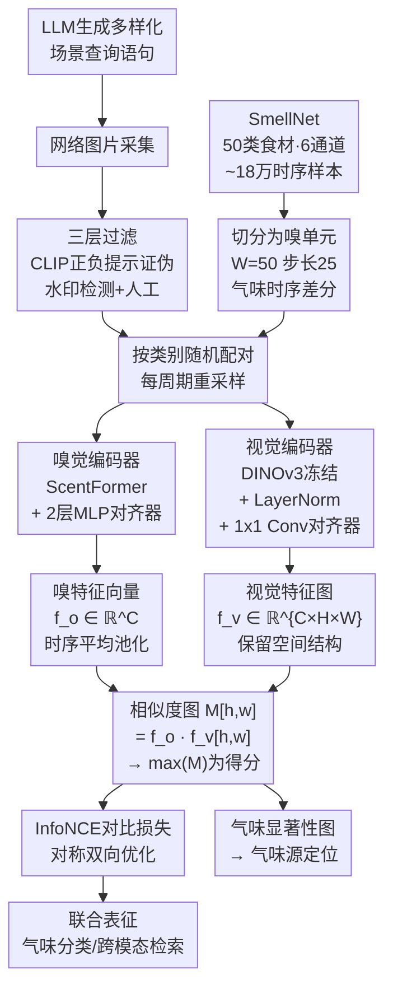

# See & Sniff: Learning Visuo-Olfactory Representations

**会议**: ECCV2026  
**arXiv**: [2606.27307](https://arxiv.org/abs/2606.27307)  
**项目页**: https://mm.kaist.ac.kr/projects/SeeandSniff  
**领域**: 多模态感知  
**关键词**: 视觉-嗅觉表征, 多模态学习, 自监督学习, 气味定位, 合成配对

## 一句话总结

本文利用"气味身份在语义类别内对视觉变换保持不变"这一关键洞见，将仅含气味传感数据的 SmellNet 数据集扩展为视觉-嗅觉配对数据集 SmellNet-V，并设计了基于密集局部对比对齐的自监督双流框架 See & Sniff，在气味分类、跨模态检索和新引入的像素级气味定位三个任务上均显著超越仅使用气味的基线方法。

## 研究背景与动机

多模态 AI 系统已经成功地将视觉与语言、音频甚至触觉进行了融合，然而嗅觉——这一在人类和其他动物的感知中扮演核心角色的感官通道——却几乎被 AI 研究所忽略。人类视觉和嗅觉之间存在天然的紧密耦合：看到咖啡豆会唤起烘焙香气的预期，闻到咖啡香也能在脑海中浮现深褐色咖啡豆的画面。这种跨模态对应关系表明，视觉外观与气味身份之间存在系统的、可学习的内在联系。但建立计算模型来对齐视觉与嗅觉表征面临根本性的数据瓶颈：大规模配对的视觉-嗅觉数据集此前根本不存在。

现有气味数据集主要依赖两类技术路线：一类基于分子结构预测气味感知（如 DeepNose 和基于图神经网络的方法），另一类通过便携式电子鼻采集真实气味信号。最近发布的 SmellNet 是首个大规模的真实世界气味数据集，使用多通道气体传感器采集了约 18 万条时序样本，覆盖 50 种食材和天然物。然而 SmellNet 只有气味数据，没有对应的视觉画面。如果想学习视觉-嗅觉联合表征，必须找到一种方法将两种模态关联起来。同期也有工作尝试用专门的手持传感设备在真实世界中采集自然配对的视觉-嗅觉数据，但这种办法成本高、设备依赖性强、难以大规模扩展。

本文的核心洞见在于：**气味身份在语义类别内对视觉变换保持高度不变性**。一颗小红苹果和一颗大红苹果的挥发性有机化合物几乎相同，人类将其感知为同一气味类别"苹果"。这意味着同一食材类别内的多种视觉形态（不同角度、光照、大小、摆放方式）可以与同一气味嵌入共享语义空间。利用这一不变性，就可以将仅含气味数据的 SmellNet 与开放世界中的网络图片进行合成配对，从而在大规模上绕过配对数据稀缺的瓶颈。**核心 idea：利用气味在语义类别内的视觉变换不变性，将仅含气味传感数据的 SmellNet 与语义对齐的网络图片合成配对，构造出首个大规模视觉-嗅觉训练数据集 SmellNet-V，再通过密集局部对比对齐学习联合表征，使模型不仅能做跨模态检索和气味分类，还能自发产生气味显著性图以实现空间级的气味源定位。**

## 方法详解

### 整体框架

整体的训练管线分为两大阶段。第一阶段利用"气味在语义类别内对视觉变换不变"的洞见，将 SmellNet 中 50 种食材的长时序气味传感器数据切分为短"嗅单元"，并用 LLM 为每类食材生成多样化场景查询语句采集网络图片，经过三层过滤后按类别随机配对，构成 SmellNet-V 数据集。第二阶段采用双流编码器架构——视觉分支使用冻结的 DINOv3-Small 骨干加轻量对齐器，嗅觉分支使用 4 层 Transformer（ScentFormer）加轻量对齐器——将两种模态投影到共享嵌入空间。训练时计算嗅特征与空间视觉特征图之间的密集相似度图，取最大值作为跨模态相似度驱动 InfoNCE 对比损失。训练完成后，相似度图天然就是一张气味显著性图，可以直接用于气味源定位。

### 关键设计

**1. SmellNet-V：语义不变性驱动的合成配对策略**

构造视觉-嗅觉配对数据集的根本难点在于现实世界中同时采集气味信号和对齐的视觉画面需要专用硬件设备，成本高且难以规模化。本文绕过这一瓶颈的关键在于利用气味在语义类别内对视觉变换的天然不变性：同一食材的不同视觉外观（不同大小、角度、光照下的苹果）散发几乎相同的挥发性有机物，因此只要气味样本和图片属于同一食材类别，就构成了有效的跨模态训练对。

具体实现分三步。第一步，将 SmellNet 中每类食材的 6 通道气体传感器长时序（原始记录为每类 10 分钟、6 个不同日期）切分为固定长度 W=50 的短窗口，称为"嗅单元"，模拟生物嗅觉中短暂嗅吸的感知模式，窗口步长设为 25，相邻嗅单元有 50% 重叠以增加数据量。同时做一阶时序差分以突出传感器信号的变化量。第二步，利用 LLM 为每类食材生成多样化的真实场景查询短语（如对"苹果"生成"木桌上整颗苹果""超市水果区的苹果""树上挂着的苹果"等），采集网络图片后经过三层过滤管线：CLIP 用正负提示对检查类别一致性、照片真实性和食材新鲜状态；现成水印检测器去除含过多水印的图片；最后人工快速核验。第三步，将每个嗅单元与同类别的一张随机图片配对形成训练样本，并且在每个训练周期重新随机配对图像，使每个嗅单元在不同周期接触不同的视觉样本，防止模型死记固定的配对关系。

**2. 密集局部对齐：从全局语义到空间精细对应**

标准的跨模态对比学习通常对两种模态各取一个全局向量（如 CLS token 或平均池化特征）后计算相似度。这对于检索任务足够，但本文需要模型具备更精细的空间理解能力——不仅要判断一张图片和一段气味是否属于同一类别，还要能定位图片中哪个区域散发了这种气味。为此，本文设计了基于密集相似度图的局部对齐方式。

视觉分支将图像通过冻结的 DINOv3-Small 骨干编码为空间特征图 $f_v \in \mathbb{R}^{C \times H \times W}$，保留空间维度。嗅觉分支将嗅单元的时序特征沿时间维度平均池化为 $\bar{f}_o \in \mathbb{R}^{C}$，与视觉通道对齐。然后计算两者之间的密集相似度图 $M \in \mathbb{R}^{H \times W}$，每个空间位置 $[h,w]$ 的值为池化后的嗅特征向量与该位置视觉特征向量的内积：$M[h,w] = \bar{f}_o \cdot f_v[h,w]$。最终的跨模态相似度得分为 $M$ 中各位置的最大值——它度量了"气味信号最好地匹配了图片中哪一块区域"。这个 max 操作有两个关键作用：在训练时，它作为对比损失中的相似度分数，使模型必须学会局部精准匹配才能获得高相似度；在推理时，$M$ 本身无需任何额外头即可作为气味显著性图使用。视觉分支只附加逐通道 LayerNorm 和 $1 \times 1$ 卷积作为轻量对齐器以尽量保持预训练表征质量，嗅觉分支则使用两层 MLP 加残差连接。

**3. 气味定位：从跨模态匹配到空间级气味源识别**

除了传统的气味分类和跨模态检索，本文进一步将视觉-嗅觉联合表征延伸到空间定位：给定一段气味信号，在图片中标识出散发该气味的区域。这个任务不需要额外训练定位头——相似度图 $M$ 放大到输入图像尺寸后，天然就是一张气味显著性图，高响应区域指示气味最可能的物理来源。作者为此构建了 SmellNet-V-Source 基准：在 SmellNet-V 测试集的基础上，利用 SAM 交互式标注工具为每张配图中的食材区域生成了像素级分割掩码。

实验表明，See & Sniff 在气味→气味检索任务上以 69.44% 的 R@1 大幅超越了 SmellNet 基线（52.54%），这说明视觉监督不仅教模型学会了跨模态匹配，还显著增强了气味嵌入空间本身的内蕴结构——即使推理时只有气味信号，嵌入空间也变得更加有区辨力。视觉偏置分析实验也验证了定位能力的来源：DINOv3 的注意力图只提供通用的物体性线索，不会响应气味信号对应的语义区域；而 See & Sniff 的显著性图能准确响应与输入气味匹配的食材区域，说明密集局部对齐确实学到了跨模态的空间对应关系。

### 损失函数 / 训练策略

训练目标为对称的 InfoNCE 对比损失。对批次中的嗅单元 $o_i$ 和图像 $v_i$，以 $\max(M)$ 作为相似度，同一批次中的其他图像作为负样本，损失在两个方向上对称计算（气味→图像和图像→气味）。视觉骨干 DINOv3-Small 保持冻结，仅轻量对齐器和嗅觉编码器参与训练。默认嗅单元窗口 $W=50$，一阶差分滞后 $p=25$，6 个传感器通道。模型在 RTX A5000 上以批量大小 64 训练。

## 实验关键数据

### 主实验

| 任务 | 指标 | SmellNet 基线 | See & Sniff | 提升 |
|------|------|---------------|-------------|------|
| 气味分类 (W=50) | Acc. | 50.6 | **57.71** | +7.1 |
| 气味分类 (W=50) | F1 | 49.5 | **56.68** | +7.2 |
| 气味分类 (W=100) | Acc. | 57.9 | **63.75** | +5.9 |
| 气味分类 (W=100) | F1 | 56.0 | **62.66** | +6.7 |
| 气味→视觉检索 | R@1 | - | **56.14** | - |
| 视觉→气味检索 | R@1 | - | **63.20** | - |
| 气味→气味检索 | R@1 | 52.54 | **69.44** | +16.9 |

### 消融实验

| 配置 | 气味分类 Acc. (W=50) | 说明 |
|------|---------------------|------|
| SmellNet (Transformer) | 50.6 | 纯气味基线，无视觉信号 |
| Global-CLIP (CLIP-Large 视觉 + 全局对比) | 53.19 | 全局对齐，强视觉骨干 |
| Ours-Global | 53.74 | 本架构 + 全局池化对齐 |
| Ours-Local | 54.94 | 密集局部对齐，无轻量对齐器 |
| **See & Sniff (Ours)** | **57.71** | 密集局部对齐 + 轻量对齐器 |

### 关键发现

- 视觉监督显著增强了嗅觉表征质量：即使推理时只有气味信号，See & Sniff 在气味分类上仍比纯气味基线高出超过 7 个百分点，说明跨模态训练学到了更具结构性的气味嵌入空间。
- 密集局部对齐全面优于全局对齐：在分类和检索的各类指标上均占优，其中气味→气味检索的 R@1 提升 16.9 个点，表明局部比对迫使模型建立更精细的跨模态对应，进而反哺了单一模态内部的表征质量。
- 各食材家族一致受益：水果、坚果、蔬菜的改进幅度最大（对象级几何结构明晰），香草改进最小（叶片纹理精细、视觉相似度高），说明视觉信号的帮助程度与食材的可视辨识度正相关。

## 亮点与洞察

- **合成配对策略从根本上绕开了多模态数据采集的硬件瓶颈**：不是去工业设计昂贵的采集设备，而是利用气味不变性将现有气味数据与海量网络图片配对，思路简洁、扩展性强——只要有类别标签的气味数据，就可以用同样的方法生成视觉-嗅觉配对。
- **密集相似度图一个设计做了两件事**：训练时它作为对比学习中的细粒度相似度分驱动模型优化，推理时它直接充当气味显著性图做空间定位，没有额外参数没有额外计算，非常优雅。
- **视觉监督逆向重构了嗅觉特征空间**：气味→气味检索中 16.9 个百分点的 R@1 提升说明，跨模态训练带来的不只是模态间匹配能力，更重要的是它重构了单模态（气味）特征空间本身的结构与区分性——这是一个有趣且反直觉的发现。

## 局限与展望

- 合成配对依赖"类别级对齐"假设，无法捕捉同类别内因品种、状态或新鲜程度不同而产生的真实世界跨模态差异——真机采集的自然配对数据理论上可以更强，两者互补。
- 当前只覆盖 50 类食材样本，场景高度受限；扩展到香水、环境气味、化学气体等更多样化场景需要额外数据工程。
- 气味定位基准的分割掩码通过食材类别标签派生，而非在一个真实气味场景中由传感器信号编码器独立标注气味源区域，与实际场景的气味定位仍有距离。

## 相关工作与启发

- **vs SmellNet (ScentFormer)**：SmellNet 只做纯气味表征学习，本文在其基础上引入视觉监督信号，证明视觉对嗅觉表征有正向促进作用。
- **vs 同期工作 Ozguroglu et al.**：该工作用专用传感设备采集自然配对的视觉-嗅觉数据，架构使用全局对比对齐；本文以合成配对 + 密集局部对位差异点，两者是互补的研究路线。

## 评分

- 新颖性: ⭐⭐⭐⭐ [开辟了视觉-嗅觉联合表征这一全新研究方向，合成配对策略巧妙且可扩展到其他有类别标签的传感器数据集]
- 实验充分度: ⭐⭐⭐⭐ [三个任务全面评估，消融实验和定性分析充分；但定位基准的标注方式带一定合成痕迹]
- 写作质量: ⭐⭐⭐⭐⭐ [从动机到方法到实验层层递进，数据构造的哲学讲得很清楚，让人信服]
- 价值: ⭐⭐⭐⭐ [填补了多模态感知领域嗅觉这一空白方向，框架设计简单高效，具有启发性]

<!-- RELATED:START -->

## 相关论文

- [\[ICCV 2025\] Learning to See Inside Opaque Liquid Containers using Speckle Vibrometry](../../ICCV2025/audio_speech/learning_to_see_inside_opaque_liquid_containers_using_speckle_vibrometry.md)
- [\[ACL 2026\] Privacy-preserving Prosody Representation Learning](../../ACL2026/audio_speech/privacy-preserving_prosody_representation_learning.md)
- [\[ICML 2026\] PhaLar: Phasors for Learned Musical Audio Representations](../../ICML2026/audio_speech/phalar_phasors_for_learned_musical_audio_representations.md)
- [\[ICCV 2025\] Zero-AVSR: Zero-Shot Audio-Visual Speech Recognition with LLMs by Learning Language-Agnostic Speech Representations](../../ICCV2025/audio_speech/zero-avsr_zero-shot_audio-visual_speech_recognition_with_llms_by_learning_langua.md)
- [\[CVPR 2026\] SAVE: Speech-Aware Video Representation Learning for Video-Text Retrieval](../../CVPR2026/audio_speech/save_speech-aware_video_representation_learning_for_video-text_retrieval.md)

<!-- RELATED:END -->
