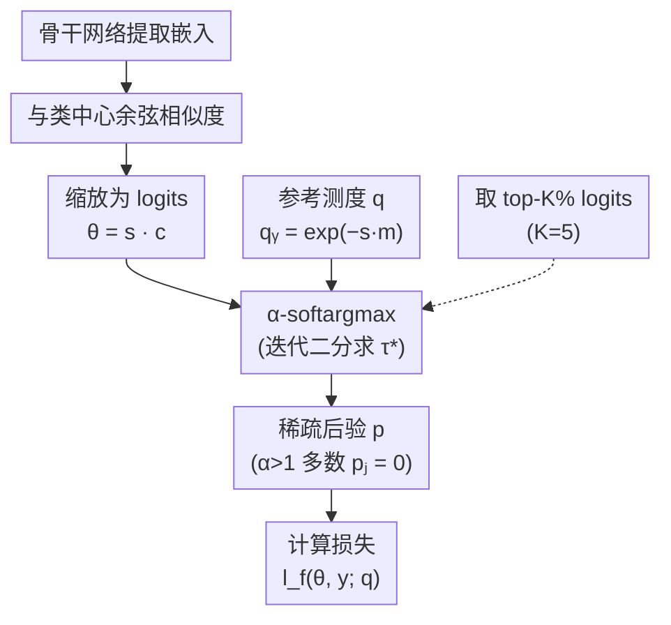

# Sparsity-Inducing Divergence Losses for Biometric Verification

**会议**: ECCV2026  
**arXiv**: [2606.31664](https://arxiv.org/abs/2606.31664)  
**代码**: 无  
**领域**: 音频与人声 / 人脸识别  
**关键词**: 人脸验证, 声纹验证, α-散度损失, margin-penalty, 稀疏后验

## 一句话总结

Q-Margin 将 margin 惩罚从几何化的 logit 修改迁移到 α-散度损失的概率化参考测度中，在保持后验稀疏性的同时在 IJB-B/C 和 VoxCeleb 低 FAR 场景下一致超越 ArcFace/CosFace 基线，并通过精确 top-K 截断将训练吞吐开销从 27% 降至 5%。

## 研究背景与动机

人脸验证和声纹验证已广泛应用于高安全认证场景。近年来，基于 margin-penalty 的 softmax 损失——如 CosFace（在余弦相似度上减去 m）和 ArcFace（在角度上加上 m）——成为这类任务的事实标准。它们通过在目标类的 logit 上施加几何惩罚来拉大类间距离、压缩类内散布，效果显著。然而，这些 margin 始终是启发式地施加在 logit 上的数值操作，与损失函数的概率本质脱节——本质上是在问「为什么偏要改 logit，而不是改损失函数本身」。

另一条独立进展是 Roulet 等人提出的 α-散度损失，它用 α-散度代替 KL 散度作为概率映射的规整项，统一推广了交叉熵。该框架允许非均匀参考测度 q 来编码任意先验，且当 α>1 时 α-softargmax 产生的后验具有**稀疏性**（多数类概率精确为零），这对人脸/声纹识别中动辄百万级别的分类头极具吸引力。然而此前的应用只将 q 用于处理类别频率不平衡，从未有人用它编码 margin 惩罚。

本文的核心矛盾正源于此：几何 margin（ArcFace/CosFace）依赖于 softmax 的指数归一化形式，无法自然推广到 α-散度框架；而 α-散度损失虽有更优的理论根基和稀疏后验，却缺乏 margin 机制。本文的切入点是：既然参考测度 q 可以编码任意先验信息，那 margin 惩罚完全可以**编码在 q 中而非 logit 中**。**核心 idea：提出 Q-Margin 损失，通过降低目标类参考测度 qᵧ = exp(−s·m) 的值来实现概率化 margin，在 α-散度框架下统一了几何 margin 与信息论损失设计，且当 α→1 时 Q-Margin 自然退化为 CosFace。**

## 方法详解

### 整体框架

Q-Margin 的计算流程围绕 α-softargmax 与参考测度的交互展开。骨干网络提取嵌入特征后，与所有类别的权重向量计算余弦相似度，乘以缩放因子 s 得到 logits θ = s·c。同时，参考测度 q 将目标类的值压低为 exp(−s·m)（其他类为 1）。接着，带 q 的 α-softargmax 通过迭代二分法求阈值 τ* 得到稀疏后验 p，最后代入 α-散度损失计算梯度。

### 关键设计

**1. Q-Margin：用参考测度编码概率化 margin**

传统方法直接在 logit 上做几何手术——CosFace 从目标类余弦相似度中减 m，ArcFace 在角度上加 m。Q-Margin 则走了一条完全不同的路：不碰 logit，而是修改 α-散度损失中的参考测度 q。对样本的真实标签 y，将 q_y 设为 exp(−s·m)，其他类的 q_j 保持为 1。这个被降权的 q_y 在 α-softargmax 中的效果相当于告诉模型「目标类的先验被压低了」，模型必须给出显著更高的目标类 logit 才能抵消惩罚，从而在概率空间中隐式地拉开决策边界。当 α→1 时 α-softargmax 退化为标准 softargmax，q_y 降权取对数后等价于 cos(θ) − m——Q-Margin 恰好恢复为 CosFace，为后者提供了概率化解释。论文还尝试将 Q-Margin 的参考测度 margin 与 ArcFace 的几何角度 margin 联合使用，但实验没有带来额外收益，最终保留纯概率化形式。

**2. α-散度的稀疏后验与 α-s 耦合调优**

α>1 时 α-softargmax 的每类后验为 p_j = q_j [1 + (α−1)(θ_j − τ*)]₊^{1/(α−1)}，其中 [·]₊ = max(0, ·) 意味着低于阈值的类被精确赋予零概率。在人脸验证（WebFace42M，2M+ 类）上，α=1.25 时平均仅 ~1,020 类活跃（~0.05%），这种稀疏性迫使模型只在最可能的少数类上分配概率质量，获得更尖锐的边界。α 和缩放因子 s 存在耦合：两者都控制 softargmax 的尖锐程度（α 增大使映射变尖，s 增大也有类似效果），因此不能独立调优，最优 s 随 α 增大而降低。人脸（2M 类）最优 α=1.25、s=32~35；声纹（5,994 类）因类别少需更高稀疏度，最优 α=1.5~1.75、s=5~10。

**3. 精确 top-K 截断：利用稀疏性反哺效率**

α-softargmax 的 τ* 需迭代二分法求解，在 2M+ 类上全量计算带来约 27% 的吞吐下降。但稀疏后验提供了一个优雅的解法：论文证明了当活跃支撑集 ⊆ top-K logits 时，仅在 top-K 上计算 τ* 是精确的而非近似。取 K=5%（保守值，远高于观测到的最大活跃度 0.4%），吞吐从 1,466 samples/s 恢复到 1,900 samples/s，仅比 ArcFace（2,005）慢 5%；进一步缩到 K=1% 则几乎完全恢复（1,978）。运行时还附带完整性检查，确保最小保留 logit 本身是不活跃的——实验结果从未触发过截断错误。

### 损失函数

Q-Margin 的损失函数：

$$L_{\text{Q-M}} = l_f(s \cdot \mathbf{c}, \mathbf{y}; \mathbf{q})$$

其中 $l_f$ 是 α-散度 Fenchel-Young 损失，$\mathbf{c}$ 为嵌入与类中心的余弦相似度向量，参考测度 $\mathbf{q}$ 定义为 $q_j = \exp(-s \cdot m \cdot \delta_{y,j})$。训练时人脸使用 SGD，初始 lr=0.1，20 个 epoch 分三阶段衰减；声纹使用 SGD 加线性 warmup 6 epoch 后指数衰减。

## 实验关键数据

### 主实验

均匀控制训练数据（WebFace42M）和骨干（ResNet-100）的条件下，Q-Margin 在 IJB-B 和 IJB-C 的严格低 FAR 指标上全面超越 ArcFace、CosFace、EntMax 和 SparseMax：

| 方法 | 数据 | Backbone | IJB-B@1e-5 | IJB-C@1e-4 | IJB-C@1e-5 |
|------|------|----------|-----------|-----------|-----------|
| ArcFace | WF42M | R-100 | 92.26 | 97.54 | 95.70 |
| CosFace | WF42M | R-100 | 93.15 | 97.49 | 95.82 |
| EntMax (α=1.25) | WF42M | R-100 | 93.06 | 97.55 | 96.11 |
| SparseMax (α=2) | WF42M | R-100 | 91.84 | 97.12 | 95.28 |
| **Q-Margin (α=1.25, s=35)** | WF42M | R-100 | **93.67** | **97.78** | **96.35** |

声纹验证同样出色：Q-Margin 在 VoxCeleb1-H 上 TAR@1e-4 达 74.60%（α=1.75），而 ArcFace 为 72.08%、CosFace 为 70.61%。

### 消融实验

稀疏后验带来的精确加速效果：

| 配置 | 吞吐 (samples/s) | 相对 ArcFace |
|------|-----------------|-------------|
| ArcFace | 2005.13 | 1x（基线）|
| Q-Margin (全量 100% logits) | 1466.45 | 0.73x (−27%) |
| Q-Margin (top 5%) | 1900.26 | 0.95x (−5%) |
| Q-Margin (top 1%) | 1978.07 | 0.99x (−1%) |

超参敏感性（IJB-C@1e-5）：

| α | s | m | 指标 | 说明 |
|---|----|----|------|------|
| 1.25 | 35 | 0.2 | **96.35** | 人脸最佳配置 |
| 1.25 | 32 | 0.5 | 96.00 | m 增大反而掉点 |
| 1.5 | 10 | 0.2 | 95.64 | α 增大需降 s |

### 关键发现

- Q-Margin 的最大优势集中在**低 FAR（1e-4/1e-5）** 场景——这恰好是高安全验证（金融、边境控制）最关心的操作点，也是 ArcFace/CosFace 容易崩的地方
- α 与 s 存在耦合，不能单独调优。经验法则：先用 α=1.25、m=0.2 起步，再逐步调高 s
- 后验稀疏度与类别数呈反比：百万类量级 α=1.25 足够，千类量级需 α=1.5~1.75
- 与 PartialFC 在 IJB-C 上持平（97.78 vs 97.82@1e-4），但 Q-Margin 不依赖额外的负采样策略，加速来自数学性质本身

## 亮点与洞察

- **最大的理论贡献**：证明了 margin 惩罚可以完全概率化——将几何手术变为参考测度的修改，使 CosFace 成为 Q-Margin 在 α→1 的极限特例，为 margin-penalty 损失提供了信息论根基
- **稀疏后验的双赢**：α>1 的稀疏性一方面提升了嵌入判别力，另一方面又被反作用于加速 τ* 计算──数学性质直接转化为工程效率，这种闭环设计很优雅
- **跨模态一致性**：在人脸和声纹两个模态上 Q-Margin 都优于各自基线，说明概率化 margin 并非人脸特化的 trick，具有通用性
- 与 AdaFace、弹性 margin 等自适应策略正交——日后可将 Q-Margin 的概率化 margin 与样本难度动态调整结合

## 局限与展望

- Q-Margin 引入了额外超参 α，且 α 与 s 耦合，调参成本高于 ArcFace/CosFace
- 大部分 WebFace42M 实验仅运行单次（百万类训练的计算成本极高），缺乏置信区间，尽管单重复实验的标准差仅 0.07
- 控制实验只与 ArcFace/CosFace 对比，更多 SOTA 方法（AdaFace、PartialFC）的重新实现结果未完全公开
- 未来方向：将参考测度动态化（根据样本难度调节 q_y）、与大类别的 PartialFC 采样策略结合

## 相关工作与启发

- **vs ArcFace/CosFace**：几何 margin vs 概率化 margin。Q-Margin 将 CosFace 视为 α→1 的特例，统一了公式、更具理论根基；但新增的超参 α 增加了使用门槛
- **vs AdaFace / ElasticFace**：自适应 margin 方法在 softmax 框架内加权 margin，Q-Margin 在底层的 divergence 层面革新，两者正交可组合
- **vs PartialFC**：稀疏后验与负采样殊途同归——都大幅降低计算开销，且 IJB-C 上性能持平。区别在于 PartialFC 通过采样启发式实现，Q-Margin 的加速来自数学证明的精确性
- **vs EntMax / SparseMax**：SparseMax 固定 α=2 且缺乏概率化 margin，Q-Margin 灵活度更高，在人脸和声纹两个领域均优于 SparseMax

## 评分

- 新颖性: ⭐⭐⭐⭐½ 将 reference measure 用于 margin 编码是优雅的理论创新，统一了两条独立的研究线
- 实验充分度: ⭐⭐⭐⭐½ IJB-B/C + VoxCeleb 双模态覆盖，超参扫描细致，吞吐分析完整；遗憾是 WebFace42M 实验多为单次运行
- 写作质量: ⭐⭐⭐⭐ 逻辑清晰，method 推导完整；但部分段落公式偏密集
- 价值: ⭐⭐⭐⭐½ 为 margin-penalty 损失提供了概率化理论基础，稀疏加速技巧直接可用，对 face/speaker 社区均有启发

<!-- RELATED:START -->

## 相关论文

- [\[ACL 2025\] Sparsify: Learning Sparsity for Effective and Efficient Music Performance Question Answering](../../ACL2025/audio_speech/sparsify_music_avqa.md)
- [\[ECCV 2026\] See & Sniff: Learning Visuo-Olfactory Representations](see_sniff_learning_visuo-olfactory_representations.md)
- [\[ECCV 2026\] Step-by-Step Video-to-Audio Synthesis via Negative Audio Guidance](step-by-step_video-to-audio_synthesis_via_negative_audio_guidance.md)
- [\[ECCV 2026\] MG-RWKV: Multi-Grained Context-Aware RWKV for Temporal Forgery Localization](mg-rwkv_multi-grained_context-aware_rwkv_for_temporal_forgery_localization.md)
- [\[ECCV 2026\] OLIVE: View-Augmented Latent Prediction with Waveform Reconstruction for Speech SSL](olive_view-augmented_latent_prediction_with_waveform_reconstruction_for_speech_ssl.md)

<!-- RELATED:END -->
