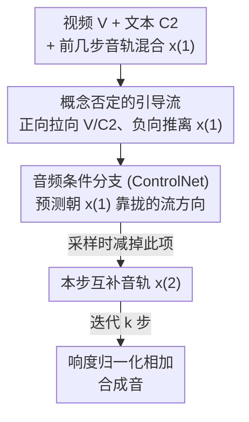

# Step-by-Step Video-to-Audio Synthesis via Negative Audio Guidance

**会议**: ECCV 2026  
**arXiv**: [2506.20995](https://arxiv.org/abs/2506.20995)  
**代码**: 项目页 [https://ahykw.github.io/sbsv2a/](https://ahykw.github.io/sbsv2a/)  
**领域**: 音频语音 / 视频生成 / 扩散模型  
**关键词**: 视频到音频生成、负向引导、Flow Matching、可控生成、Foley

## 一句话总结
针对现有视频到音频（V2A）模型只能一次性生成整段声音、无法像 Foley 艺术家那样逐层补声的痛点，本文提出 Negative Audio Guidance（NAG）：训练一个以「已生成音轨」为条件的分支，采样时把它反向使用，把当前生成推离已有声音，从而只用普通单参考音视频数据集就实现了分步生成互补音轨、混合成高质量合成音。

## 研究背景与动机
给画面配上贴合的声音在影视和游戏里叫 Foley，传统流程是拟音师先铺一层底噪，再逐层补进脚步声、衣物摩擦声等缺失的声音元素，一个几秒的镜头往往包含大量可听事件，因此这个过程既费时又费力。近年的视频到音频（V2A）模型（如 Diff-Foley、FoleyCrafter、MMAudio）已经能生成语义和时间上都对齐画面的高质量音频，让自动化配音成为可能，但它们几乎都是「一次前向、整段生成」的非交互设计：模型吐出一整条音轨，不提供任何增量补充的机制。这带来一个很现实的问题——如果输出漏掉了某个声音事件，创作者只能把整段重新生成，无法只补那一处，这在需要人机协作的工作流里效率极低。

一个看似自然的想法是训练一个条件生成模型，让它对同一段视频产出多条互补音轨。但这条路卡在数据上：它需要「多参考」的音视频配对（同一视频对应多条分离好的音轨），而这种数据几乎无法规模化获取——即便在单个场景里，多种声音也是混在一起的，把它们分离成单独的音轨本身就是视觉引导音源分离这一未解难题。另一条路是直接用文本条件的 V2A、给不同的 prompt 生成不同声音，但现有文本条件 V2A 很难压制住画面里已经生成过的显著声音：论文举了个例子，一段驼鹿走过水面的视频，无论文本 prompt 写什么，MMAudio 生成的每条音轨里都会混进驼鹿踩水的声音，因为这个视觉事件太突出了。

本文的切入角度是：既然真正难的是「不要生成什么」而非「要生成什么」，那就把「排除已有声音」这件事交给引导（guidance）而不是重新训练一个多参考模型。**核心 idea：把「已生成的音轨」当作一个负向的音频条件，训练一个以音频为条件的分支来预测「朝这段音频靠拢」的流方向，采样时把它减掉（负向使用），从而把当前生成推离已有声音；这个分支只需在普通单参考数据集上、用同一视频里两段不重叠的音频片段互为条件来训练，彻底绕开了多参考数据的门槛。**

## 方法详解

### 整体框架
方法建立在预训练的 flow-matching V2A 模型 MMAudio 之上，要解决的是「分步生成互补音轨」这个问题。给定一段视频 $V$、若干描述不同声音事件的文本 caption，模型按事件的语义显著度排序，一步生成一条音轨：第 $k$ 步时，把前 $k-1$ 步已生成音轨混合归一化成一段「条件音频」$x^{(1)}$，让本步在文本 $C_2$ 的正向引导下生成目标音轨 $x^{(2)}$，同时被条件音频负向排斥，保证 $x^{(2)}$ 只覆盖 $x^{(1)}$ 里没有的互补声音。所有音轨最后按响度归一化相加，得到合成音。

整个系统由三部分构成，自上而下对应下面三个关键设计：先是把分步生成形式化成「概念否定」的目标分布并推导出多条件引导流（这是理论骨架，决定了采样时几个流项怎么组合）；然后是承载「否定」的音频条件分支——用 ControlNet 给 MMAudio 加一个吃条件音频的旁路，采样时把它的输出减掉；最后是让这个分支能在单参考数据上训练的关键 trick——用同一视频里不重叠的两段音频互为「目标/条件」来做训练配对。

### 关键设计

**1. 用「概念否定」重写目标分布，导出多条件引导流：把「不要重复已有声音」变成可采样的公式**

分步生成的目标是从 $p(x^{(2)}\mid V, C_2, x^{(1)})$ 采样，直觉上要用 $(x^{(2)}, V, C_2, x^{(1)})$ 这样的四元组来训练，但前面说过这种数据拿不到。本文的关键观察是：以 $x^{(1)}$ 为条件、要求生成的 $x^{(2)}$ 不含 $x^{(1)}$ 里的概念，本质上就是一次「概念否定」。沿用 Du 等人的能量视角，把否定条件写成概率的倒数——即生成 $x$ 时正概念 $c_p$ 出现的似然乘上负概念 $c_n$ 似然的倒数：

$$p(x, c_p, \neg c_n) \propto p(x)\, p(c_p\mid x)\, p(c_n\mid x)^{-1}.$$

把这个关系代进目标分布，再用贝叶斯定理逐项展开，就把 $p(x^{(2)}\mid V,C_2,\neg\mathcal{E}(x^{(1)}))$ 分解成四个因子：无条件项、视频项、视频+文本项，以及一个「视频 vs 视频+条件音频」的比值项。对应到 flow-matching，就得到一条由「一个无条件流 + 三个引导流」组成的引导。四个系数调起来很麻烦，作者借鉴 VinTAGe 的经验——把某个中间项 $u_\theta(x_t,t,V,\varnothing)$ 消掉能简化且效果不差——令第一、三个引导项系数之和等于第二项系数，最终收敛成一条只含无条件项、文本引导项、以及负向音频项的干净公式：

$$\tilde{u}_{\theta,\psi}(x_t) = u_\theta(x_t,t,\varnothing,\varnothing) + \alpha\big(u_\theta(x_t,t,V,C_2) - u_\theta(x_t,t,\varnothing,\varnothing)\big) + \beta\big(u_\theta(x_t,t,V,C_2) - u_{\theta,\psi}(x_t,t,V,\varnothing,x^{(1)})\big).$$

第二项是标准的文本+视频引导，加强对 prompt 和画面的忠实度；第三项是本文新增的负向音频项——它把生成方向从「更像条件音频 $x^{(1)}$」那个方向推开，这正是防止已生成事件被重复生成的关键，让整个分步生成无需重叠数据也能进行。系数默认取 $\alpha=4.5$、$\beta=1.5$。

**2. 用 ControlNet 给 MMAudio 加一个音频条件分支：让模型学会「朝某段音频靠拢」的流方向，再反着用**

公式（7）里除最后一项外的流都能用现成的文本条件 V2A 模型算出来，唯一缺的是 $u_{\theta,\psi}(x_t,t,V,\varnothing,x^{(1)})$——一个额外吃「条件音频」输入的流估计器。作者把它实现为一个 ControlNet 旁路：MMAudio 用的是扩展版的多模态扩散 transformer（MM-DiT），于是仿照 Stable Diffusion 3.5 的做法，堆几层单模态 transformer block 从条件音频里抽特征，每个 block 抽到的特征经零卷积后加到 MMAudio 主干的中间特征上。训练时冻结 MMAudio 的全部预训练参数，只更新这个旁路的一套新参数 $\psi$（约 107M），因此训练很省——在 8 张 H100 上跑 200K 步约 10 小时。

这个设计的巧妙之处在于「训练目标」和「使用方式」是相反的：训练时让这个分支做正向引导，即学会在 $V$ 的约束下生成与条件音频声学特征一致的音频；而在采样时（公式里它前面带负号），它就变成一个排斥性的先验，把采样轨迹从「更贴合条件音频」的方向拉走。换句话说，它不需要真的会「复制」条件音频，只需要能准确指出「哪个方向会让结果更像条件音频」，然后把这个方向减掉就行——这跟 NAG 的负向用法天然契合。

**3. 用同一视频里不重叠的两段音频做训练配对：绕开多参考数据，同时逼分支学到「片段级共享声学上下文」**

这是让整套方法能在标准单参考数据集上训练的关键 trick。作者沿用 MMAudio 的训练配置，联合使用 VGGSound（文本-视频-音频）和 Clotho、AudioCaps、WavCaps（文本-音频）。对每个音频 clip，采一段 4 秒作为目标 $x_{\text{tgt}}$，再采另一段不重叠的 4 秒作为条件 $x_{\text{cond}}$（来自 VGGSound 的还会取 $x_{\text{tgt}}$ 对应的那段视频当条件 $V$，其余数据则用 MMAudio 的空 token 占位）。之所以要「不重叠」，是因为如果两段重叠，分支会学到一个退化解——直接把条件波形照抄过来；而取同一 clip 里相邻但不重叠的两段，它们更可能共享环境、音色、录制条件这类高层声学上下文，却不含完全相同的声音内容。

这样训练出来的分支，学到的是「这段视频整体的声学氛围往哪个方向」而非「逐样本复制」，这恰好是 NAG 在推理时需要的：它要排斥的是「前面音轨里已经出现的成分」，而这些成分正是那种片段级共享的上下文。用作者的话说，因为分支是被负向使用的，它只需要识别出「哪些方向会增加与 $x_{\text{cond}}$ 的一致性」，采样时把这些方向减掉即可，既排斥了已有声音，又避免了照抄波形的退化。

### 一个完整示例
以一段「驼鹿走过水面」的视频、按语义显著度降序排好的三条 caption 为例走一遍。第 1 步生成「驼鹿踩水」这条最核心的音轨——此时还没有任何已生成音轨，所以只用标准的文本+视频 CFG（$\beta=0$），得到 $x^{(1)}$。第 2 步要生成「远处鸟鸣」：把 $x^{(1)}$ 归一化成条件音频，喂进音频分支，采样时公式第三项把生成方向从「像踩水声」推开，于是这条音轨里几乎听不到踩水声，只剩鸟鸣。第 3 步生成「蹄子闷响」：把前两步音轨混合归一化成新的条件音频，继续负向排斥，得到干净的第三条。三条音轨响度归一化相加，得到最终合成音。对照实验里，普通 MMAudio 的三条音轨都混着规律出现的踩水声（频谱图上表现为等间隔竖条），而 NAG 的第二、三条成功压掉了踩水声、同时保持了对各自文本的对齐。

### 损失函数 / 训练策略
训练目标就是标准的 flow-matching 损失——用采到的 $(x_{\text{tgt}}, x_{\text{cond}}, V)$ 计算流 $u_{\theta,\psi}(x_t^{\text{tgt}}, t, V, \varnothing, x_{\text{cond}})$ 并最小化其与真值速度场的平方误差，只优化 ControlNet 参数 $\psi$。优化器用 AdamW（lr $10^{-4}$，$\beta_1=0.9$、$\beta_2=0.95$，weight decay $10^{-6}$），batch size 512，训练 200K 步（比 MMAudio 默认的 300K 少，因为收敛更早）；前 1K 步线性 warmup，在 80% 和 90% 处各降一次学习率（各降 10 倍）；bf16 混合精度，训完做 post-hoc EMA（$\sigma_{\text{rel}}=0.05$）。ControlNet 每两个主干 block 加一个 block（$N_1+N_2=12$，$M=6$）。

## 实验关键数据

作者构建了新的评测集 Multi-Caps VGGSound：用 Qwen2.5-VL 为 VGGSound 测试集每段视频生成 5 条描述不同声音事件的 caption（共 15,221 视频 × 5）。每段视频取前 8 秒、按不同 caption 分步生成 5 条音轨，响度归一化（目标 -20 LUFS）相加成合成音。基线是三个开源文本+视频条件 V2A 模型（Seeing-and-Hearing、FoleyCrafter、MMAudio），对比 NAG 与 MMAudio 的 CFG / 负向 prompt 两种多轨生成方式。

### 主实验

合成音客观评测（Table 1），NAG 在除 IS 外的所有指标上都取得分步生成方法中的最优：

| 生成方式 | 方法 | FD_PANNs↓ | FD_VGG↓ | KL_PANNs↓ | IS↑ | IB-score↑ | DeSync↓ |
|---------|------|-----------|---------|-----------|-----|-----------|---------|
| 独立生成 | MMAudio-S-16k | 7.76 | 1.35 | 2.02 | 10.42 | 28.13 | 0.42 |
| 负向 prompt 分步 | MMAudio-S-16k | 9.21 | 1.77 | 2.15 | 9.08 | 25.89 | 0.45 |
| **NAG 分步（本文）** | **Ours** | **6.47** | **0.98** | **2.01** | 10.58 | **28.65** | **0.42** |

单条音轨评测（Table 2）最能说明问题——核心指标是音轨间「可分离度」CLAP A-A（越低越分离）：

| 方法 | 可分离度 CLAP A-A↓ | 质量 IS↑ | 文本对齐 CLAP T-A↑ | 视频对齐 IB↑ |
|------|-------------------|---------|--------------------|--------------|
| MMAudio-S-16k | 79.75 | 12.47 | 28.36 | 27.76 |
| MMAudio + 负向 prompt | 75.57 | 11.19 | 27.14 | 24.53 |
| **MMAudio + NAG（本文）** | **71.38** | 12.01 | **28.91** | 26.67 |

对照鲜明：原始 MMAudio 各音轨高度雷同（可分离度差），负向 prompt 虽改善了分离度却把其余指标全拉垮（文本对齐、视频对齐都大跌）；NAG 则在把分离度做到最好的同时，几乎维持了质量和视频对齐，文本对齐甚至略有提升。

主观评测同样支持：合成音上 NAG 对 MMAudio 的胜率在音质 71.4%、语义对齐 76.0%、时间对齐 61.1%（Table 3）；单音轨评分上分离度 3.35 vs 2.24、音质 3.30 vs 2.89、文本忠实度 3.12 vs 2.42（Table 4，5 分制）。

### 消融实验
引导系数敏感性（附录 Table A1，节选）体现了 NAG 强度 $\beta$ 的作用：

| 配置 | CLAP A-A↓ | CLAP T-A↑ | FD_PANNs↓ | 说明 |
|------|-----------|-----------|-----------|------|
| $\alpha{=}4.5,\beta{=}0$ | 79.75 | 28.36 | 7.76 | 等价于 MMAudio 独立生成 |
| $\alpha{=}4.5,\beta{=}1.0$ | 76.21 | 28.69 | 7.30 | 中等 NAG，FD 最优 |
| $\alpha{=}4.5,\beta{=}1.5$ | 74.74 | 28.79 | 7.32 | 默认设置 |
| $\alpha{=}4.5,\beta{=}2.0$ | 73.44 | 28.88 | 7.52 | 分离度更好但 FD 略退 |

生成顺序消融（Table A4）：按文本-视频 ImageBind 相似度降序（先生成画面里最核心的显著事件）在所有指标上都最好，FD_PANNs 6.47 明显优于随机（7.32）和升序（7.36）。

### 关键发现
- 负向使用是关键：同一个音频分支正向训练、负向采样，既排斥已有声音又不照抄波形；直接用文本负向 prompt 反而会严重损害文本/视频对齐。
- $\beta$ 越大分离度越好、文本对齐越高（污染更少），但 FD/IB 在 $\beta=1.0$ 附近最优，需权衡取 1.5；$\alpha$ 太小会拖累底座 MMAudio 的表现。
- 先生成显著事件至关重要——降序生成让核心声音先「占位」，后续步骤才能有效排斥它。
- caption 数越多、NAG 优势越明显（VGGSounder 上 2–5 caption 的实验）；跨 AudioCaps、Movie Gen Audio Bench 均能稳定提升分离度；换到 ControlFoley 底座上 NAG 依旧有效（分离度 60.67→53.81），说明方法不绑定 MMAudio。

## 亮点与洞察
- 把「补声」重新框定为「概念否定」：不去教模型「该生成什么」（需要多参考数据），而是让它「别生成已有的」，用概率倒数的能量视角把这件事化成一条干净的引导公式——这是全文最漂亮的一步转译。
- 「正向训练、负向使用」的分支设计极具复用性：任何「想排斥某个已有内容」的生成任务（图像补物、音乐加轨、视频续写）都可以借鉴——训一个吃该内容为条件的旁路，采样时把它的引导方向减掉即可。
- 不重叠片段互为条件的训练配对是个便宜又聪明的 trick：用「同 clip 但不重叠」逼分支去学片段级声学上下文而非逐样本复制，既避免退化解、又只需单参考数据，直接绕开了视觉引导音源分离这个硬骨头。
- 交互性上的实际价值：Foley 风格的逐层补声让用户能一次只关注一个声音事件、想改哪条改哪条，比「一次性生成再用音源分离拆轨」（附录证明质量更差、交互更别扭）实用得多。

## 局限与展望
- 作者承认单条音轨的音质会轻微下降：NAG 虽压掉了污染，但有时输出与文本对齐差或出现静音/闷响，根源在底座 MMAudio 对罕见/微弱声音（如「地毯轻响」「雪花落下」）本就处理不好——NAG 只负责推离已有声音，整体质量高度依赖底座 TV2A 的能力。
- 混合策略过于简单：直接等权相加各音轨再做响度归一化，没考虑每条音轨的自然响度，可能次优；作者提出未来可引入生成式模型来学习混音。
- 评测 caption 由 VLM（Qwen2.5-VL）仅凭视觉生成，可能偏离原始音频（如画外音），虽然对「视觉合理的补声」这个目标不算问题，但也意味着评测不衡量对原始录音的还原。
- 自己的观察：方法本质是「串行」的，第 $k$ 步依赖前 $k-1$ 步的混合结果，生成顺序敏感（降序最优）说明早期步骤一旦出错会沿链传播，缺乏回退/纠错机制；且每步都要跑一次 ControlNet（H100 上 2.07 秒/步），音轨多时延迟线性增长。

## 相关工作与启发
- **vs 训练式加法操作（InstructME、AUDIT 等）**：它们显式训练「给定输入音频，加上一段新音频」，需要「输入音频+文本+待加音频」的三元组数据，在本文场景里拿不到；本文用负向引导 + 单参考数据绕开了这个数据需求。
- **vs 免训练加法操作（多轨联合生成 / 结构化噪声反演）**：这类方法不需专门训练，但要求预训练模型具备多轨联合生成、数据空间扩散或特定架构等属性，难以迁移到 V2A；本文选择了训练式路线但通过巧妙的数据配对消除了对特殊数据的依赖。
- **vs MultiFoley / Action2Sound / ReWaS 等音频条件 V2A**：它们用条件音频去「指定」生成什么（参考音、前景/背景分离、能量对齐），而本文反其道用条件音频去「指定不要什么」，这是把音频条件用于概念否定的第一次尝试。
- **vs 图像加物（Add-it、EraseDraw 等）**：视觉里的加法靠分割模型创建训练数据或引导生成，假设是「某片像素被完全替换」；但音频的加法是「混合」而非「替换」，这些方法无法直接照搬——本文正是针对音频「混合」特性设计的。

## 评分
- 新颖性: ⭐⭐⭐⭐⭐ 把分步补声转译成概念否定、用「正向训练负向使用」的音频分支实现，且只需单参考数据，思路干净且原创。
- 实验充分度: ⭐⭐⭐⭐ 客观+主观、系数/顺序消融、跨数据集与跨底座泛化都覆盖了；扣一星因合成音质的退化分析还偏定性。
- 写作质量: ⭐⭐⭐⭐ 动机—公式推导—实现—实验逻辑清晰，图 1/4 的对照直观；引导公式推导略密集。
- 价值: ⭐⭐⭐⭐ 直击 Foley 交互式配音的真实工作流，且负向引导范式可迁移到其他「排斥已有内容」的生成任务。

<!-- RELATED:START -->

## 相关论文

- [\[ECCV 2026\] SwiftAudio: Data-Efficient Caption-Only Distillation for One-Step Text-to-Audio Diffusion-based Generation](swiftaudio_data_efficient_caption_only_distillation.md)
- [\[ICLR 2026\] Flow2GAN: Hybrid Flow Matching and GAN with Multi-Resolution Network for Few-step High-Fidelity Audio Generation](../../ICLR2026/audio_speech/flow2gan_hybrid_flow_matching_and_gan_with_multi-resolution_network_for_few-step.md)
- [\[CVPR 2026\] PAVAS: Physics-Aware Video-to-Audio Synthesis](../../CVPR2026/audio_speech/pavas_physics-aware_video-to-audio_synthesis.md)
- [\[ICLR 2026\] AC-Foley: Reference-Audio-Guided Video-to-Audio Synthesis with Acoustic Transfer](../../ICLR2026/audio_speech/ac-foley_reference-audio-guided_video-to-audio_synthesis_with_acoustic_transfer.md)
- [\[CVPR 2026\] OmniSonic: Towards Universal and Holistic Audio Generation from Video and Text](../../CVPR2026/audio_speech/omnisonic_towards_universal_and_holistic_audio_generation_from_video_and_text.md)

<!-- RELATED:END -->
