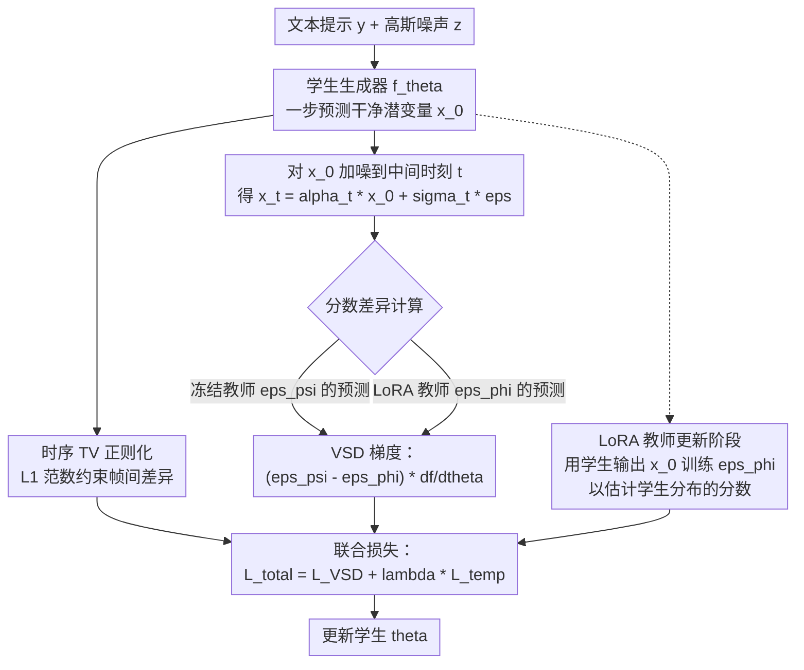

# SwiftAudio: Data-Efficient Caption-Only Distillation for One-Step Text-to-Audio Diffusion-based Generation

**会议**: ECCV 2026  
**arXiv**: [2606.31259](https://arxiv.org/abs/2606.31259)  
**代码**: 无（项目页 [https://swiftaudio.org/](https://swiftaudio.org/)）  
**领域**: 语音音频  
**关键词**: 文生音频、一步生成、分数蒸馏、时序正则化、无配对数据

## 一句话总结

SwiftAudio 将 Variational Score Distillation（VSD）适配到音频域，仅使用约 45K 文本描述（无需配对音频数据）就将多步扩散教师蒸馏为一步文生音频生成器，配合时序全变分正则化约束潜空间的时间连贯性，在 AudioCaps 和 Clotho 上达到一步方法中的 SOTA，并大幅缩小了与多步扩散系统的差距。

## 研究背景与动机

扩散模型在文生音频（Text-to-Audio, TTA）领域已成为主导范式，从 AudioLDM 到 Auffusion 等一系列工作证明了其在合成高质量音频方面的强大能力。然而，扩散模型的根本痛点是推理时需迭代去噪数十至上百步，这带来了显著的延迟和计算开销，使其难以部署在实时或资源受限的场景中。近年来，一致性模型（Consistency Models）被引入 TTA 领域，如 ConsistencyTTA 和 AudioLCM，它们通过将多步教师蒸馏为一步生成器来大幅加速推理。但这些方法有两个共同的局限：一是在严格的一步推理设置下生成质量明显下降（尤其 AudioLCM）；二是蒸馏过程仍然依赖成对的文本-音频数据作为监督信号。

与此同时，在大语言模型和多模态模型的推动下，获取高质量的文本描述变得越来越廉价和规模化——文本描述可以自动扩写、从视觉内容自动生成。相比之下，配对音频-文本数据集仍然稀缺且昂贵：AudioCaps 作为最大的人工标注音频描述数据集，也仅有约 45K 条训练样本。这自然引出一个核心问题：能否仅用文本描述（无需配对音频）训练出一个高质量的一步文生音频生成器？然而，实现这一目标并非易事——没有配对音频监督，学生模型必须完全从教师模型的已学习分布中同时获取语义对齐和音频生成能力，同时还要避免极端一步生成下的质量退化。**核心 idea：将 Variational Score Distillation 从视觉域适配到音频域，仅用纯文本描述就把预训练的多步扩散教师蒸馏为一步生成器，同时引入基于时序全变分（TV）的正则化项来约束潜空间中的时间连贯性，用 L1 范数鼓励平缓的帧间变化并在稀疏位置保留瞬态声学事件。**

## 方法详解

### 整体框架

SwiftAudio 的核心思路继承自视觉域中的 SwiftBrush，将原本用于文本到图像的 VSD 蒸馏框架迁移到音频域。系统包含三个模型组件：一个已冻结的多步扩散教师模型（用 Auffusion 初始化）、一个 LoRA 微调的教师分支（用于估计学生分布的分数）、以及一个一步学生生成器。训练过程交替进行三个阶段——学生生成零样本音频潜变量、用 VSD 指导 + 时序正则化联合更新学生、用学生生成样本更新 LoRA 教师——整个过程只需文本提示，完全不依赖配对音频数据。

### 关键设计

**1. 音频域 VSD 适配：无配对数据的分数蒸馏**

VSD 最初为文本到 3D 生成设计，后被 SwiftBrush 用于文本到图像的一步蒸馏。SwiftAudio 的核心贡献之一是将 VSD 引入音频域，使其在无需配对音频的条件下工作。具体机制是：学生生成器 $f_\theta$ 将高斯噪声 $z$ 和文本条件 $y$ 映射为干净音频潜变量 $\hat{x}_0 = (z - \sigma_T \epsilon_\theta(z, T, y)) / \alpha_T$（采用扩散式噪声预测参数化，而非直接回归）。然后对 $\hat{x}_0$ 按扩散噪声表加噪到随机中间时刻 $t$ 得到 $x_t$，同时用冻结教师 $\epsilon_\psi$ 和 LoRA 教师 $\epsilon_\phi$ 分别预测 $x_t$ 的噪声分量。两个教师的预测分数差 $(\epsilon_\psi - \epsilon_\phi)$ 就构成了 VSD 的指导梯度方向——当 $\epsilon_\phi$ 准确估计了学生分布分数时，这个差异指示了学生分布与教师先验之间的 KL 散度梯度。这样做的好处是学生不需要真实音频作为目标，仅通过"缩小两个分数预测之间的差距"就能被推向教师先验。

**2. 时序全变分正则化：给潜空间加上时间连贯性约束**

音频与图像的一个本质区别在于音频具有强时间结构——大多数声学内容（如持续的环境声、平稳的嗡嗡声）在时间上是平滑演化的，而瞬态事件（狗吠、关门、打击乐起音）则出现在稀疏位置。纯 VSD 目标只约束生成分布与教师先验的对齐，不显式约束潜变量沿时间轴的连贯性，导致一步生成在复杂声学场景下产生不稳定的帧间抖动。SwiftAudio 引入基于时序全变分的正则化项 $\mathcal{L}_\text{temp} = \text{mean}(|\hat{x}_0[:,:,1:] - \hat{x}_0[:,:,:\,-1]|)$，即计算潜变量在时间维度上相邻帧之间的 L1 差异的均值。L1 范数的稀疏性诱导特性在此发挥关键作用：它在平稳区域鼓励帧间差异趋于零，但同时允许在真正的声学事件边界处产生较大的帧间变化。换句话说，它不像 L2 范数那样对任何大幅变化都施加强惩罚（这会抹平瞬态事件），而是将时间变化集中到稀疏位置。文中实验显示，去掉时序正则化后 FAD 从 2.25 升到 3.47，改用 L2 时序正则化 FAD 也升到 2.81，验证了 L1 TV 正则化在音频域的独特优势。总损失函数为 $\mathcal{L}_\text{total} = \lambda \cdot \mathcal{L}_\text{temp} + \mathcal{L}_\text{VSD}$，其中 $\lambda=0.05$。

**3. 交替训练与 LoRA 教师估计学生分布**

VSD 需要一个能够估计学生分布分数的函数，但由于学生分布的显式密度不可得，SwiftAudio 采用了一个 LoRA 微调的教师分支 $\epsilon_\phi$ 来做近似。LoRA 教师从冻结教师 $\epsilon_\psi$ 的参数初始化，仅更新 LoRA 适配器参数（秩 $r=64$，缩放 $\alpha=128$）。训练每隔一步就交替一次：先用当前学生生成一批 $\hat{x}_0$，然后对 $\hat{x}_0$ 加噪，让 LoRA 教师用标准扩散去噪目标 $\mathcal{L}_\text{LoRA}$ 学习预测噪声。这个看似简单的设计是 VSD 能收敛的关键——$\epsilon_\phi$ 必须持续追踪不断演变的学生分布，才能提供准确分数梯度。消融实验证明 LoRA 教师容量至关重要：将秩降到 $r=4$ 时 FD 从 22.73 恶化到 56.14，将秩提升到 $r=32$ 时 FD 恢复至 27.85，说明不足容量的教师提供的是错误监督信号。

### 一个完整示例：从文本到 10 秒音频的一步生成

假设输入文本提示 "dogs barking loudly in a park with birds chirping"。推理时，SwiftAudio 先采样一个 $4 \times 32 \times 128$ 的随机高斯噪声 $z$（C×F×W=通道×频率×时间），连同文本一起输入学生网络 $f_\theta$，经单次前向传播即得干净音频潜变量 $\hat{x}_0$。这个潜变量随后通过 VAE 解码器 $D(\cdot)$ 恢复为 mel 谱图，再经声码器 $V(\cdot)$ 合成为约 10 秒的原始波形——整个过程只有一次网络评估（即一次 denoising query），而原始教师 Auffusion 需要 200 次查询（100 步 × 每次一个条件 + 一个无条件分支）。如果去掉时序正则化，生成的音频中狗狗的叫声可能带有不自然的"咔嗒"帧间抖动；加上时序 TV 约束后，平稳的背景鸟鸣声平滑过渡，只有在狗吠瞬态处才出现较大的频谱变化。

### 损失函数 / 训练策略

训练包含三个交替阶段：阶段一（学生前向生成 $\hat{x}_0$）、阶段二（联合优化 $\mathcal{L}_\text{total} = \lambda \mathcal{L}_\text{temp} + \mathcal{L}_\text{VSD}$ 更新学生 $\theta$）、阶段三（用 $\mathcal{L}_\text{LoRA}$ 更新 LoRA 教师 $\phi$）。学生学习率 $1\times10^{-5}$，LoRA 教师学习率 $1\times10^{-3}$，均用 AdamW 优化器。权重函数 $\omega(t) = \sigma_t^2$，训练 20,000 步，有效 batch size 64（per-device 16 × 梯度累积 4），单张 RTX 5880 Ada 48GB 上约需 40 小时。CFG 指导尺度 7.5。

## 实验关键数据

### 主实验

| 数据集 | 方法 | #Queries | FD ↓ | FAD ↓ | KL ↓ | IS ↑ |
|--------|------|----------|------|-------|------|------|
| AudioCaps | Auffusion-full（教师，多步） | 200 | **22.49** | **1.91** | **1.43** | **10.42** |
| | AudioLDM2（多步） | 200 | 23.42 | 1.87 | 1.68 | 9.52 |
| | AudioLCM（一步） | 1 | 23.15 | 2.92 | 1.75 | 5.81 |
| | ConsistencyTTA（一步） | 1 | 25.68 | 3.37 | 1.42 | 9.26 |
| | **SwiftAudio（一步，无配对音频）** | 1 | **22.73** | **2.25** | 1.62 | 9.13 |
| Clotho（零样本） | AudioLCM（一步） | 1 | 23.18 | 4.42 | 2.54 | 6.38 |
| | ConsistencyTTA（一步） | 1 | 30.01 | 5.13 | 2.48 | 7.02 |
| | **SwiftAudio（一步，无配对音频）** | 1 | **23.45** | **2.56** | **2.13** | **7.38** |

主观评测（MOS）中，SwiftAudio 的一步 OVL 评分 3.90（5 分制），接近教师 Auffusion 的 4.06，显著高于其他一步方法。值得注意的是，SwiftAudio 蒸馏时未使用任何配对音频数据，而已有的一步方法（AudioLCM、ConsistencyTTA）在蒸馏时需要 110 小时的配对音频。

### 消融实验

| 配置 | FD ↓ | FAD ↓ | IS ↑ | 说明 |
|------|------|-------|------|------|
| 完整 SwiftAudio | **22.73** | **2.25** | **9.13** | VSD + 时序TV正则化 |
| 无学生参数化（直接映射） | 47.13 | 8.73 | 4.58 | 不用扩散式噪声预测参数化 |
| LoRA 教师秩 r=4 | 56.14 | 9.71 | 3.63 | 教师容量严重不足 |
| LoRA 教师秩 r=32 | 27.85 | 4.37 | 5.73 | 中等容量 |
| 无时序正则化 | 23.19 | 3.47 | 8.04 | 去掉 L_temp |
| L2 时序正则化 | 23.61 | 2.81 | 8.83 | 用 L2 替代 L1 |

### 关键发现

- **学生参数化是基石**：不用扩散式噪声预测参数化（Eq.1）而用直接映射时，FD 从 22.73 恶化到 47.13——这说明噪声预测形式的逆变换对学生训练提供了一阶信息，使蒸馏过程稳定。
- **LoRA 教师容量决定蒸馏上限**：秩从 4 提升到 64 使 FD 从 56.14 改进到 22.73，跨越了数倍的性能差距。不足容量的教师提供的分数梯度实际上是误导信号。
- **时序 TV 明显优于 L2**：去掉时序正则化导致 FAD 从 2.25 跃升至 3.47（+54%），而用 L2 替代也仅降至 2.81。L1 TV 的稀疏性诱导特性对音频生成的瞬态保留至关重要。
- **数据效率令人惊讶**：SwiftAudio 仅用 ~45K 文本提示就达到强力效果，而 SwiftBrush 在视觉域需要 138 万提示。作者猜测音频描述中的声学事件概念频繁重复是数据高效的潜在原因。
- **跨域泛化性好**：ConsistencyTTA 在 Clotho 零样本测试中 FAD 从 3.37 恶化到 5.13（+52%），而 SwiftAudio 仅从 2.25 升到 2.56（+14%），说明无配对音频蒸馏学到了更通用的生成先验，而非记忆教师模型在 AudioCaps 上的行为。

## 亮点与洞察

- **无配对音频蒸馏是真正的突破**：在 TTA 领域首次实现蒸馏完全不依赖配对音频数据，只用文本描述就让学生继承了教师的生成先验。这意味着今后可以借助 LLM 扩写文本多样性来进一步提升生成质量，而不受限于稀缺的配对数据。
- **时序 TV 正则化的设计精巧**：将经典的图像去噪概念（全变分正则化）创造性地迁移到音频潜空间的时间维度上。L1 范数的稀疏性诱导在此恰到好处——平稳区域平滑，瞬态边界保留，完美匹配了音频信号的物理特性。
- **LoRA 教师 + VSD 的交替训练范式**：用轻量 LoRA 适配器估计学生分布分数，比训练一个完整教师模型便宜得多，却提供了足够的分数估计精度。消融实验直接证实了容量阈值的存在。
- **数据效率的意外发现**：~45K 文本提示就能训练出有竞争力的一步 TTA 模型，约为视觉域同类方法所需数据量的 1/30。这种模态间的效率差异值得深入挖掘。

## 局限与展望

- **固定时长生成**：当前模型只能生成最多 10 秒的固定长度音频，无法处理更长的声学叙事或多阶段声音场景。
- **非语言语音内容**：对 "a man speaking" 这类提示，模型输出听起来像人声但不对应具体的语言内容——因为没有加入音素或词汇监督。
- **未与其他一步蒸馏范式对比**：论文未与 Progressive Distillation 等经典范式在 TTA 域进行对比，仅与 ConsistencyTTA/AudioLCM 对比。
- **配对数据在蒸馏阶段被消除，但教师训练仍需要**：教师模型（Auffusion）本身是在配对数据上训练的。真正的"零配对数据"管线还需要解决教师的训练依赖问题。

## 相关工作与启发

- **vs SwiftBrush**：两者核心思想相同——用 VSD 将多步扩散教师蒸馏为一步生成器，仅用文本提示。SwiftAudio 的创新在于将这一范式扩展到音频域，并针对音频的时间结构设计了时序 TV 正则化。另一个差异是数据效率：SwiftBrush 需要 138 万提示，而 SwiftAudio 只用 4.5 万就达到强性能。
- **vs ConsistencyTTA/AudioLCM**：这两者也是一步 TTA 方法，但蒸馏时仍然需要成对的音频-文本数据。SwiftAudio 是首个在 TTA 域实现完全无配对音频蒸馏的工作，且在严格一步设置下 FAD 2.25 vs ConsistencyTTA 的 3.37 和 AudioLCM 的 2.92。
- **vs DreamFusion/SDS**：SDS（Score Distillation Sampling）最初为文本到 3D 设计，将 2D 扩散模型蒸馏到 3D NeRF。VSD 是其改进版本，通过将目标建模为分布而非单点来提升多样性和保真度。SwiftAudio 沿用了 VSD 的框架，但将其中的 2D 图像先验替换为了音频扩散先验。
- **vs NASA**：NASA 通过负提示实现了一步图像模型的二值特征控制。SwiftAudio 的实验展示了更丰富的语义操控能力（词替换、注意力重加权、短语精细化），说明 VSD 蒸馏保留了教师的解耦语义空间。

## 评分
- 新颖性: ⭐⭐⭐⭐ 将 VSD 从视觉域迁移到音频域并设计时序 TV 正则化是合理的创新组合，但整体思路并非首创
- 实验充分度: ⭐⭐⭐⭐⭐ 主实验、消融、零样本、主观评测、语义分析全面覆盖，消融细致到 LoRA 秩的逐级实验
- 写作质量: ⭐⭐⭐⭐ 结构清晰，动机和数据效率的分析有深度，但部分消融描述略显琐碎
- 价值: ⭐⭐⭐⭐⭐ 无配对音频蒸馏打破了 TTA 领域的数据瓶颈，结合数据效率发现，对实际部署和低资源场景意义重大

<!-- RELATED:START -->

## 相关论文

- [\[ECCV 2026\] Step-by-Step Video-to-Audio Synthesis via Negative Audio Guidance](step-by-step_video-to-audio_synthesis_via_negative_audio_guidance.md)
- [\[ACL 2026\] Data-efficient Targeted Token-level Preference Optimization for LLM-based Text-to-Speech](../../ACL2026/audio_speech/data-efficient_targeted_token-level_preference_optimization_for_llm-based_text-t.md)
- [\[ICLR 2026\] MambaVoiceCloning: Efficient and Expressive Text-to-Speech via State-Space Modeling and Diffusion Control](../../ICLR2026/audio_speech/mambavoicecloning_efficient_and_expressive_text-to-speech_via_state-space_modeli.md)
- [\[ACL 2026\] ControlAudio: Tackling Text-Guided, Timing-Indicated and Intelligible Audio Generation via Progressive Diffusion Modeling](../../ACL2026/audio_speech/controlaudio_tackling_text-guided_timing-indicated_and_intelligible_audio_genera.md)
- [\[ACL 2025\] SpeechWeave: Diverse Multilingual Synthetic Text & Audio Data Generation Pipeline for Training Text to Speech Models](../../ACL2025/audio_speech/speechweave_diverse_multilingual_synthetic_text_audio_data_generation_pipeline_f.md)

<!-- RELATED:END -->
