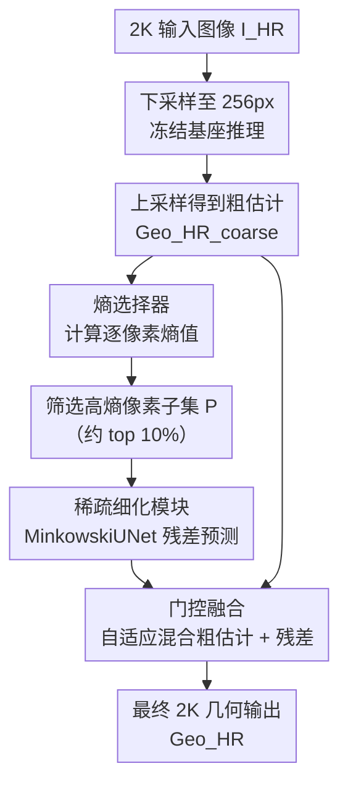

# 2K Retrofit: Entropy-Guided Efficient Sparse Refinement for High-Resolution 3D Geometry Prediction

**会议**: ECCV 2026  
**arXiv**: [2603.19964](https://arxiv.org/abs/2603.19964)  
**代码**: 无（论文承诺接收后开源）  
**领域**: 3D视觉  
**关键词**: 2K分辨率, 稀疏细化, 熵引导选择, 深度估计, 3D重建

## 一句话总结
本文提出 2K Retrofit，一种无需修改或重训练基座模型即可让现有 3D 基础模型（如 Depth Anything、VGGT）输出 2K 分辨率几何预测的通用框架——核心思路是用冻结的基座做快速粗预测，再通过熵引导的稀疏细化机制只对高不确定性像素区域做全分辨率修正，在大幅降低计算和显存开销的同时达到或超越全分辨率方法的精度。

## 研究背景与动机
**领域现状**：高分辨率几何预测（深度估计、3D 重建）是自动驾驶、具身智能、增强现实等应用的基础能力。近年来，Depth Anything V2、DUSt3R、VGGT 等 3D 基础模型在大规模数据上训练后展现出强大的泛化能力，但它们普遍受限于低分辨率训练数据（典型推理分辨率约 960x480），无法直接输出精细的 2K 级几何预测。

**现有痛点**：要让基础模型输出 2K 分辨率结果，现有方案分三类但各有缺陷：(1) 直接训练原生 2K 模型——显存和计算开销巨大（如 VGGT 在 2K 分辨率下推理需 76.5 GB 显存、495 GFLOPs）；(2) 低分辨率推理后上采样——速度快但无法恢复细粒度结构（如栏杆、把手、线缆等薄结构）；(3) 分块细化（patch-wise refinement）——需要多次低分辨率推理和复杂的块融合，引入边界伪影和空间不一致性。

**核心矛盾**：高分辨率几何精度与计算效率之间存在根本性 trade-off——全分辨率密集推理代价过高，而轻量近似方法又丢失关键高频细节。

**本文目标**：(1) 让冻结的 3D 基础模型无需任何架构修改或重训练即可输出 2K 分辨率几何预测；(2) 以远低于全分辨率密集推理的计算成本达到相当甚至更优的精度；(3) 方法需对单目和多目场景、深度估计和点图估计等多种骨干模型通用。

**切入角度**：作者对粗预测误差分布做了系统性分析，发现一个关键规律——低分辨率预测到高分辨率真值之间的误差并非均匀分布，而是高度集中在稀疏的、语义关键的区域（物体边界、薄结构、类别过渡区）。这意味着如果能把精调计算集中在这少部分像素上，就能以极低的额外开销换取大幅质量提升。此外，作者发现这些高误差区域与预测熵（从骨干网络 head 特征计算的信息熵）高度相关，因此熵可以作为一个廉价而有效的"该不该细化"的信号。

**核心 idea**：用预测熵作为像素级不确定性的代理指标，识别出最需要修正的稀疏像素子集（仅约 10%），然后用轻量稀疏卷积网络仅对这些像素做高分辨率残差修正，最后通过门控融合自适应地混合粗预测和细化结果。

## 方法详解

### 整体框架
2K Retrofit 是一个两阶段 pipeline，将高分辨率几何预测拆为"粗预测 + 稀疏精调"：第一阶段用冻结的 3D 基础模型在下采样后的低分辨率图像上做快速推理，再上采样得到密集粗估计；第二阶段通过熵选择器定位高不确定性像素，仅对这些稀疏像素用轻量网络做全分辨率残差修正，最后门控融合输出最终高精度几何图。整个过程不修改基座模型、也不需要重训练基座。

### 关键设计

**1. 熵选择器：用预测熵定位最需要细化的像素**

粗预测在不同区域的误差差异极大——物体边界、薄结构和遮挡边缘处的误差远高于平坦区域。直接对所有像素做全分辨率精调等于浪费算力。作者发现一个关键相关性：骨干网络 head 特征的信息熵与预测误差高度一致（见图 4），因此可以用熵作为"哪些像素需要细化"的廉价信号。

具体来说，对于粗预测结果，从骨干网络的 head 特征（回归投影层之前）提取 logits 向量 $\mathbf{q}_p \in \mathbb{R}^C$，对其做 softmax 归一化后计算逐像素信息熵：

$$\mathcal{H}(p) = -\sum_{c=1}^{C} \mathbf{q}_p^{(c)} \log \mathbf{q}_p^{(c)}$$

设定阈值 $\alpha$，选择 $\mathcal{H}(p) > \alpha$ 的像素构成稀疏待细化集合 $\mathcal{P}$。这一步之所以有效，是因为：熵天然反映模型在某个像素上的"犹豫程度"——边界、薄结构、纹理突变处的特征通常跨越多个模式，熵值偏高，而这些恰好也是粗预测误差最大的区域。实验表明，熵选择器能以仅约 2.3ms 的代价（RTX 4090），在只细化约 10% 像素的情况下覆盖约 80% 的高误差像素，明显优于随机选择（无效）、边缘启发式（不够准）和可学习选择器（准但慢近一倍）。

**2. 稀疏细化模块：用 MinkowskiUNet 在非规则像素集上做高效精调**

被选中的像素 $\mathcal{P}$ 在图像空间上呈非规则分布——它们不是密集网格，更类似稀疏 3D 点云（密度不均、有遮挡、结构复杂）。对于这种输入，标准 CNN 需要在整张高分辨率特征图上做密集卷积，绝大部分计算都浪费在不需要细化的区域。为此，作者采用 MinkowskiUNet（一种稀疏卷积网络）作为细化模块 $\mathcal{R}$，它只在有激活值的位置执行稀疏卷积，贯穿整个网络始终保持稀疏性。

对于每个选中像素 $p \in \mathcal{P}$，细化模块从对应的高分辨率图像块提取特征，预测一个局部残差修正量：

$$\Delta \mathbf{Y}_p = \mathcal{R}(\mathbf{I}_{\mathrm{HR}}|_p), \quad \forall p \in \mathcal{P}$$

模块本身参数量很小（轻量设计），且只在稀疏位置运算，因此 2K 分辨率下的推理延迟仅为毫秒级。与 Point Transformer 相比，MinkowskiUNet 在精度略低但速度提升 3 倍以上（5.5 vs 1.7 FPS），是实现实时 2K 推理的关键。

**3. 门控融合：自适应混合粗预测的全局一致性与稀疏细化的局部精度**

获得稀疏残差修正 $\Delta \mathbf{Y}$ 之后，最简单的做法是直接覆盖粗预测中对应像素的值。但这会带来新问题：稀疏细化缺少全局上下文，直接替换容易引入局部不一致和噪声。作者设计了一个逐像素门控融合机制，根据粗预测和细化结果各自的置信度自适应分配权重。

对每个被细化的像素 $p$，最终预测为：

$$\mathbf{Y}_p = f\left(w_p \cdot \hat{\mathbf{Y}}_p + (1 - w_p) \cdot \Delta \mathbf{Y}_p\right)$$

其中融合权重 $w_p$ 由一个两层 MLP 加 sigmoid 激活计算，输入是粗预测值、细化值、以及两者的熵：

$$w_p = \sigma\left(\mathrm{MLP}\left([\hat{\mathbf{Y}}_p; \Delta \mathbf{Y}_p; \mathcal{H}(\hat{\mathbf{Y}}_p); \mathcal{H}(\Delta \mathbf{Y}_p)]\right)\right)$$

直观上，当粗预测的熵较低时（模型对该像素有信心），门控会倾向于保留粗预测的全局一致性；当细化结果的熵较低时（细化网络对该像素有信心），门控则更多地采纳精细修正。消融实验确认，直接替换（Direct）因丢失全局上下文而性能较差，纯熵加权融合（Entropy）有改善但仍不够灵活，门控融合（Gated）在三者中取得了最优的精度-速度平衡。

### 一个完整示例：从 2K 图像到高精度深度图

以 ARKitScenes 数据集中一张 1440x1920 的室内 RGB 图像为例：图像首先被下采样到长边 256 像素，送入冻结的 Depth Anything V2 骨干网络，得到一张低分辨率深度图；通过最近邻插值上采样回 1440x1920，获得粗深度估计。然后从骨干 head 特征计算每像素熵值（约 2.3ms），以阈值 $\alpha=0.3$ 筛选出约 10%（约 27.6 万）的高熵像素——这些像素集中在桌椅边缘、柜子把手、窗帘褶皱等区域。MinkowskiUNet 仅对这些像素对应的 2K 图像块提取特征并预测深度残差，最后门控融合将粗深度和残差逐像素加权合成。最终输出在物体边界清晰度、薄结构完整度上均明显优于粗估计，且整流程延迟约 8.1 FPS（RTX 4090），远超全分辨率密集推理方案。

### 损失函数 / 训练策略
训练目标直接继承自所用基座模型的损失函数（如 Depth Anything V2 的尺度不变损失），不做额外设计。训练数据方面，由于此前没有针对 2K 级几何预测的公开训练集，作者用 NVIDIA Omniverse 合成了 50K 张高质量渲染图像，覆盖多样化几何和纹理场景（详见附录）。训练配置：13 个 epoch，batch size 8，两块 NVIDIA RTX A6000，约一天完成。推理延迟在单张 RTX 4090 上以 FP16 精度评测。基座模型（如 Depth Anything V2、VGGT）全程冻结，仅训练熵选择器、稀疏细化模块和门控融合三个组件。

## 实验关键数据

### 主实验

单目 2K 深度估计，零样本设定（仅用合成数据训练，不做域内微调）：

| 方法 | ARKitScenes AbsRel↓ | ARKitScenes δ0.5↑ | ScanNet++ AbsRel↓ | ScanNet++ δ0.5↑ |
|------|---------------------|--------------------|--------------------|--------------------|
| MSPF | 0.0149 | 0.9721 | 0.0226 | 0.9674 |
| Depth Anything V2* | 0.0326 | 0.9615 | 0.0371 | 0.9437 |
| PromptDA | 0.0131 | 0.9825 | 0.0175 | 0.9781 |
| **2K Retrofit (Ours)** | **0.0118** | **0.9866** | **0.0146** | **0.9825** |

多视图 2K 点图估计（ETH3D 零样本测试）：

| 方法 | Acc.↓ | Comp.↓ | Overall↓ | FPS↑ |
|------|-------|--------|----------|------|
| DUSt3R | 1.462 | 0.927 | 1.195 | 1.1 |
| VGGT | 1.167 | 0.639 | 0.903 | 2.6 |
| StreamVGGT | 1.140 | 0.613 | 0.870 | 3.5 |
| **2K Retrofit (Ours)** | **0.935** | **0.602** | **0.839** | **5.5** |

2K Retrofit 在点图估计上比 VGGT 的 Overall 误差降低约 7%，同时速度提升超过 2 倍（5.5 vs 2.6 FPS）。若将 VGGT 重训练至 2K 分辨率，需 76.5 GB 显存和 495 GFLOPs，而 2K Retrofit 仅需 32.8 GB 和 172 GFLOPs（均降低 50% 以上），推理速度更是 17 倍于重训练版（5.5 vs 0.5 FPS，后者因显存溢出需频繁换页而极慢）。

### 消融实验

像素选择器对比（点图估计，ETH3D）：

| 像素选择器 | Acc.↓ | Comp.↓ | FPS↑ | 分析 |
|-----------|-------|--------|------|------|
| 随机选择 | 1.126 | 0.835 | 4.1 | 无效，不如不细化 |
| 边缘启发式 | 0.942 | 0.625 | 4.1 | 有改善但不够准 |
| 双边上采样 | 0.940 | 0.617 | 4.0 | 类似边缘启发 |
| 可学习选择器 | 0.921 | 0.635 | 3.8 | 精度略优但慢近一倍 |
| **熵选择器 (Ours)** | **0.935** | **0.602** | **5.5** | 最佳精度-速度平衡 |

融合策略对比：

| 融合策略 | Acc.↓ | Comp.↓ | FPS↑ | 分析 |
|---------|-------|--------|------|------|
| 直接替换 | 1.113 | 0.735 | 5.9 | 丢失全局上下文严重 |
| 熵加权融合 | 0.940 | 0.607 | 5.0 | 改善但不灵活 |
| **门控融合 (Ours)** | **0.935** | **0.602** | **5.5** | 自适应最优 |

关键发现：
- 熵选择器是方法有效性的核心前提——随机选择彻底失败（Acc. 1.126，甚至比纯低分辨率基线的 VGGT 的 1.167 还差，说明无指导的稀疏细化在 2K 分辨率下是负优化），证明"选对像素"比"怎么细化"更关键。
- 门控融合的收益来自其对不确定性的显式建模：在粗预测置信度高的区域信任粗估计，在细化网络有把握的区域采纳残差，避免粗暴替换带来的不一致。
- 熵阈值 $\alpha=0.3$ 是推荐的平衡点：更低的阈值（$\alpha=0.1$）精度略高（Acc. 0.917）但速度下降到 3.4 FPS；更高的阈值（$\alpha=0.8$）速度快（8.0 FPS）但精度显著退化（Acc. 1.135）。
- 在纹理缺失和强反射表面等极端场景下，误差会变得密集（不再稀疏），稀疏细化机制的收益下降——这是方法的已知盲区。

## 亮点与洞察
- **熵作为免费午餐**：大多数工作中熵被用作不确定性量化指标后就被丢弃了，本文把它变成像素选择的廉价信号——不需额外网络、不需可学习参数，2.3ms 就能以 80% 召回率锁定高误差区域。这个思路可以迁移到任何有"全局粗预测 + 局部精调"需求的密集预测任务（语义分割、光流、图像超分），只要粗预测网络能提供逐位置的 logits/特征向量即可计算熵。
- **稀疏卷积处理非规则选择**：把非规则分布的被选像素类比为 3D 点云，然后用 MinkowskiUNet 做稀疏卷积——这是一个巧妙的方法迁移，避免了对稀疏像素集做 costly 的密集 CNN 填充，也绕过了 PointNet 类方法的速度瓶颈。任何"在图像空间中选择性地处理稀疏子区域"的场景都可以借鉴这种"把 2D 稀疏选择 re-cast 为 3D 稀疏卷积问题"的思路。
- **"改造"而非"重建"的哲学**：2K Retrofit 不改动基座模型一行代码、不重训练基座参数，完全以插件形式工作，这意味着它天然兼容未来任何新的 3D 基础模型——模型升级时只需换冻结骨干即可。这种"retrofit"设计哲学在快速迭代的基础模型时代非常实用，类似的思路可以推广到其他需要让低分辨率模型适配高分辨率场景的任务。
- **合成数据训练的零样本泛化**：仅用 NVIDIA Omniverse 合成的 50K 图像训练，就能在 ARKitScenes、ScanNet++、ETH3D 三个真实数据集上达到 SOTA，说明稀疏细化机制学到的"在哪里细化、怎么融合"是跨域的通用技能，不依赖真实数据的特定外观分布。

## 局限与展望
- **极端场景退化**：在强反射表面、透明物体、极低纹理区域，预测误差会变得密集而非稀疏，稀疏细化机制的收益大幅下降。作者承认这是当前方法的局限性，未来可考虑引入更强的几何先验（如多模态信息、物理约束）来处理这些场景。
- **依赖基座模型 head 特征的熵质量**：熵选择器的有效性取决于基座模型 head 特征是否真的编码了逐像素不确定性——如果基座模型的 head 设计不产生有意义的 logits（例如直接回归而无可用的 softmax 化特征），熵选择器将失效。这限制了方法的即插即用范围，虽然目前主流的 Depth Anything、VGGT 等均可适用。
- **合成数据与真实域的 gap**：虽然零样本泛化效果好，但合成数据在光照、材质、传感器噪声方面与真实数据仍有差异。更系统地研究合成数据的域随机化策略对泛化性能的影响是值得做的后续工作。
- **未探索动态场景和多帧时序**：当前方法处理静态单帧/多帧图像，未利用视频中的时序一致性。如果能在时序上追踪稀疏像素选择，可以进一步降低逐帧计算量并提升时域稳定性。

## 相关工作与启发
- **vs SparseRefine (ECCV 2024)**：SparseRefine 首次在语义分割中引入稀疏细化概念，选择不确定区域用高分辨率特征精调。2K Retrofit 将其思想从 2D 语义任务扩展到 3D 几何预测，关键差异在于：(1) 用熵而非可学习门控做像素选择（更快）；(2) 用 MinkowskiUNet 稀疏卷积代替密集 CNN 做细化（更适合非规则分布）；(3) 增加了门控融合而非简单覆盖。
- **vs PatchRefiner / PatchFusion (CVPR/ECCV 2024)**：两者都是分块细化方案，需要多次低分辨率推理并对重叠块做融合，引入边界伪影和大量冗余计算。2K Retrofit 只需一次低分辨率推理，后续只处理稀疏像素集，在速度和内存上都有数量级优势。
- **vs PromptDA (CVPR 2025)**：PromptDA 通过 prompt 机制让 Depth Anything 输出 4K 深度，但仍需要修改推理流程。2K Retrofit 采用更彻底的"外壳式"设计，基座模型完全不动，通用性更强。
- **vs 直接重训练基座模型到 2K**：实验清楚表明，重训练 VGGT 到 2K 虽在精度上略优（Acc. 0.911 vs 0.935），但显存和计算量均超过 2 倍，推理速度仅为 1/17。对于实际部署，"够准 + 够快"比"最准 + 极慢"更有价值。

## 评分
- 新颖性: ⭐⭐⭐⭐ 将稀疏细化引入 3D 几何预测方向本身有新颖性，熵做像素选择信号 + MinkowskiUNet 做非规则稀疏细化的组合方式设计巧妙且实用，但核心的"粗+细"两阶段和熵选择思路在语义分割中已有先例（SparseRefine），本质上是跨任务迁移而非全新范式。
- 实验充分度: ⭐⭐⭐⭐⭐ 覆盖单目深度估计和多视图点图估计两大任务，三个真实数据集（ARKitScenes、ScanNet++、ETH3D）加合成数据训练，对比了零样本和非零样本设定下 10+ 种 SOTA 方法，消融实验涵盖选择器、融合策略、阈值、特征提取器四个维度，并有显存/FLOPs/FPS 系统效率分析——实验设计全面扎实。
- 写作质量: ⭐⭐⭐⭐ 方法动机清晰、图 3 框架图和图 4 误差-熵相关性分析图质量高，公式定义明确，实验部分呈现清晰。略有不足是部分对比方法（如 MSPF、BoostingDepth）在第 1 节未详细介绍，需读者自行查原始论文。
- 价值: ⭐⭐⭐⭐ 实用性强——不改动基座模型即插即用的"retrofit"设计对工业部署非常友好，合成数据训练的零样本泛化也降低了使用门槛。方法本身足够通用，未来新出的 3D 基础模型大概率也能直接用。但作为第一篇 2K 几何预测的 retrofit 方法，尚未经历足够的社区验证和后续改进，长期影响力有待观察。

<!-- RELATED:START -->

## 相关论文

- [\[CVPR 2026\] Generalizing Visual Geometry Priors to Sparse Gaussian Occupancy Prediction](../../CVPR2026/autonomous_driving/generalizing_visual_geometry_priors_to_sparse_gaussian_occupancy_prediction.md)
- [\[ECCV 2026\] Geometry-Preserving in 3D Gaussian Splatting for LiDAR-Camera Extrinsic Calibration](geometry-preserving_in_3d_gaussian_splatting_for_lidar-camera_extrinsic_calibrat.md)
- [\[ECCV 2026\] FLM-Occ: Feed-forward Likelihood Maximization for Efficient Indoor Occupancy Prediction](flm-occ_feed-forward_likelihood_maximization_for_efficient_indoor_occupancy_pred.md)
- [\[ECCV 2026\] Horizon3D: Sparse Radar-Camera Fusion for Long-Range 3D Perception in Autonomous Driving](horizon3d_sparse_radar-camera_fusion_for_long-range_3d_perception_in_autonomous_.md)
- [\[CVPR 2025\] Open-Canopy: Towards Very High Resolution Forest Monitoring](../../CVPR2025/autonomous_driving/open-canopy_towards_very_high_resolution_forest_monitoring.md)

<!-- RELATED:END -->
