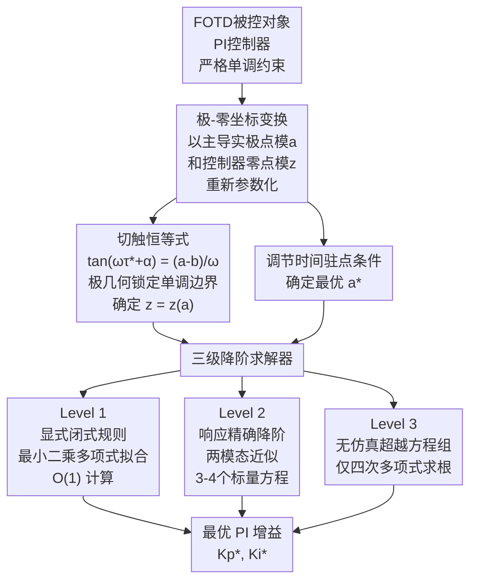

# 单调最小调节时间PI整定：基于切触恒等式的FOTD系统无超调控制

**会议**: ECCV 2026  
**arXiv**: [2606.22217](https://arxiv.org/abs/2606.22217)  
**代码**: 无  
**领域**: 自动驾驶  
**关键词**: PI控制, FOTD模型, 单调响应, 切触恒等式, 车辆纵向控制

## 一句话总结
本文针对一阶加纯滞后（FOTD）被控对象，推导了严格单调（零超调）阶跃响应下最小化2%调节时间的PI整定问题的精确解析解——核心是一个描述输出斜率在单调边界处切触零点条件的切触恒等式，由此将二维搜索降为一维嵌套标量条件，给出了显式闭式规则、基于响应的精确降阶和无仿真超越方程组三种不同精度的求解方案，并将2%调节时间相比Lambert-W临界阻尼消去设计降低14%–52%。

## 研究背景与动机

车辆纵向控制在自动驾驶系统中扮演着基础性角色：自适应巡航控制（ACC）、自动紧急制动（AEB）、队列协同行驶等模块都依赖一个核心环节——对被控车辆速度或加速度的精确调节，且要求响应过程中不出现超调（overshoot），否则可能导致乘员不适甚至碰撞风险。从控制理论的视角看，车辆纵向动力学可以近似为一阶加纯滞后（FOTD）模型，其中的滞后来源多样：传感器采样延迟、制动/油门执行器响应延迟、通信延迟（V2V/V2I），以及从控制指令产生到实际速度变化之间的惯性与滞后。因此，针对FOTD模型的PI控制器整定方法直接关系到自动驾驶系统的安全性和响应品质。

现有的FOTD PI整定规则存在一个根本性的张力：传统方法要么以临界阻尼（critical damping）为目标，如基于Lambert W函数的零极点消去设计，它保证了输出单调但调节时间偏保守；要么通过多实极点配置（如Huba等人的三重实极点法MRDP）获取更快的响应，但这种方法在滞后续存较大时会导致控制信号从单脉冲变为双脉冲、甚至输出超调，本质上是通过放松单调约束来换取速度。Chien-Hrones-Reswick等经验规则虽然在工程中广泛使用，但缺乏精确的最优性保证。换言之，当前缺少一个精确刻画「在严格单调约束下调节时间最小化」这一优化问题解析解的理论框架。

本文的核心切入点是：不将该问题当作数值优化来处理，而是通过分析闭环脉冲响应在单调边界处的几何性质，推导出一个闭合形式的切触条件。**核心idea：将严格单调输出下最小化调节时间的PI整定问题转化为切触恒等式，证明最优解既不等于零极点消去解也不等于多重实极点解，而是一个非消去点——控制器零点靠近主导实极点使其实极点的残量极小化，同时保留一对欠阻尼复极点，用「慢实极点的微小正斜率抬升」恰好抵消「快复极点的负向震荡」在切触点处的斜率。**

## 方法详解

### 整体框架

本文的方法本质上是将一个二维参数搜索（$K_p, K_i$）下的约束优化问题，通过解析分析逐步降为一维嵌套标量条件，并提供三个不同精度的求解方案。整体流程如下图所示。

**极-零坐标定义**：关键的一步是放弃直接在增益空间 $(K_p, K_i)$ 中搜索，而是以主导实极点的模 $a$ 和控制器零点的模 $z$ 作为自由参数（要求 $0 < a < 1/T$ 且 $z > a$）。通过闭环特征拟多项式 $\Delta(s) = T s^2 + s + (K_p s + K_i) e^{-s} = 0$ 在 $s=-a$ 处为零的条件，可以精确求出 $K_p, K_i$ 与 $a, z$ 的映射关系。这样，二维搜索被转化为沿单调边界的一维搜索。

**两步分析逻辑**：给定 $T/L$，先通过切触恒等式确定在单调边界上 $z = z(a)$ 的关系（对每个 $a$ 存在唯一使输出斜率刚好切触零点的 $z$），再通过调节时间 $T_s$ 对 $a$ 的驻点条件（内部最优）确定最优 $a^*$。两步嵌套实现了从二维到一维的降阶。

### 关键设计

**1. 切触恒等式：用极几何锁定单调边界**

这是全文最核心的分析工具。在最优解处，输出斜率 $y'(t)$ 在某个时刻 $\tau^*$ 处恰好与零轴相切（而非穿越）：即 $y'(\tau^*) = 0$ 且 $y''(\tau^*) = 0$。关键在于，保留主导实极点和一对主导复极点后，输出斜率可以写为实极点贡献的正衰减项 $A e^{-a\tau}$ 与复极点贡献的衰减振荡项 $D e^{-b\tau} \cos(\omega\tau + \alpha)$ 之和，其中 $a$ 是实极点模，$b, \omega$ 是复极点的实部和虚部。将两个条件依次代入，振幅 $A, D$ 和对消留下一个仅涉及极几何的纯相位关系：

$$
\tan(\omega\tau^* + \alpha) = \frac{a - b}{\omega}
$$

这个恒等式的威力在于：它完全独立于模态的振幅 $A$ 和 $D$，只由闭环极点结构 $(a, b, \omega)$ 决定。因为 $a < b$（实极点慢于复极点的衰减率），右手侧为负，且切触时刻处于复振荡的第二个象限（$\cos\theta < 0, \sin\theta > 0$），因此切触时刻有闭式解 $\tau^* = (\pi + \arctan((a-b)/\omega) - \alpha)/\omega$。这本质上是在说：单调性的约束边界是复极点负向摆动刚好被实极点正平台抵消的临界相位——这个相位的精确取值由极点的相对几何唯一决定。

**2. 残量重塑机制：靠近但不消去**

最优解之所以既不是零极点消去（$z = 1/T$，消去 plant 极点）、也不是多重实极点（三个复极点重合到实轴上），是因为本文发现的最优结构是一种精妙的平衡：控制器零点被放置在接近但略大于主导实极点模的位置（$z \approx a$，$z > a$）。从留数公式 $c_k = K_p(p_k+z)/(p_k\Delta'(p_k))$ 可以看出，零点到某个极点 $p_k$ 的距离 $(p_k+z)$ 出现在每个留数的分子中。当 $z \to a$ 时，主导实极点 $p_1 = -a$ 对应的分子因子 $z - a \to 0$，使该极点的残量极小化。

这意味着：慢实极点仍然存在（没有被消去），但它的贡献从一个「主导的大幅缓慢上升」退化为一个「低幅的正平台」，其唯一作用是抬升复极点负向摆动的底部，使之刚好不跌破零轴。由于这个慢极点持续时间很长（衰减慢），这个平台的幅度虽然小但足够持久，在复极点的第一个也是最大的负向半波处提供临界补偿。相比之下，零极点消去会彻底消灭这个平台，导致必须借助更强的阻尼（更大的 $b$，即更慢的复极点）来避免超调——这正是消去设计保守的根源。

**3. 三级降阶求解器：从闭式规则到无仿真精确解**

从切触恒等式出发，二维搜索被降为一维嵌套条件，本文进一步提供了三种不同精度和计算代价的求解器，供不同部署场景选用。Level 1（闭式规则）通过对 $T/L \in [0.1, 10]$ 范围内精确最优解的增益进行最小二乘拟合，得到 $K_p$ 和 $K_i$ 对 $\ln(T/L)$ 的四次多项式拟合：调节时间误差在 $0.10L$ 以内、残余超调低于 0.05%，且不需要任何方程求解，适合在车载实时嵌入式系统中直接查表计算。Level 2（基于响应的精确降阶）不是仿真完整闭环响应，而是用两模态近似（主导实极点 + 主导复极点对）来评估单调性和调节时间，只需解 3–4 个标量方程，比全仿真快 2–3 个数量级，适合在参数变化场景下快速重新优化。Level 3（无仿真超越方程组）最精确：将切触恒等式与调节时间的超越方程联立，唯一非初等的步骤是求解一个四次多项式的根——这在任何微控制器上都是瞬时的，且给出精确的全局最优解。三级求解器体现了从「适合快速部署的近似」到「适合离线精确分析的无仿真解」的完整设计空间覆盖。

### 损失函数 / 训练策略（本文不含）

作为控制理论论文，本文不涉及损失函数或训练策略。优化目标为：$\min_{K_p, K_i} T_s \; \text{s.t.} \; y'(t) \geq 0 \; \forall t \geq 0$，其中 $T_s$ 为 2% 调节时间，$y'(t) \geq 0$ 为输出严格单调约束。求解依赖解析推导而非数值迭代优化。

## 实验关键数据

### 主实验

主实验对比了本文设计（标记为 Proposed）与四种参考方法在 $T/L$ 取值范围 0.1 到 10 上的性能：

| $T/L$ | 方法 | 2% 调节时间 $T_s/L$ | 负荷IAE | 最大灵敏度 $M_s$ | 控制信号脉冲数 |
|-------|------|-------------------|---------|----------------|--------------|
| 0.3 | Lambert-W消去 | 13.2 | 0.89 | 1.39 | 1-pulse |
| 0.3 | 本文Proposed | 9.8 (−26%) | 0.81 | 1.44 | 1-pulse |
| 0.3 | MRDP | 10.5 | — | — | 1-pulse |
| 1.0 | Lambert-W消去 | 9.1 | 1.27 | 1.39 | 1-pulse |
| 1.0 | 本文Proposed | 4.4 (−52%) | 0.79 | 1.52 | 1-pulse |
| 1.0 | MRDP | 7.2 | — | — | 1-pulse |
| 3.0 | Lambert-W消去 | 25.3 | 2.84 | 1.39 | 1-pulse |
| 3.0 | 本文Proposed | 17.0 (−33%) | 2.62 | 1.59 | 2-pulse |
| 3.0 | MRDP | 20.5 | — | — | 2-pulse |
| 5.0 | Lambert-W消去 | 46.2 | 4.76 | 1.39 | 1-pulse |
| 5.0 | 本文Proposed | 27.4 (−41%) | 4.54 | 1.62 | 2-pulse |
| 5.0 | MRDP | 34.1 | — | — | 2-pulse（超调） |

### 消融分析

不同降阶求解器精度对比（$T/L$ 覆盖 0.1–10）：

| 求解器级别 | $T_s$ 误差（相对于精确最优） | 残余超调 | 计算成本 |
|-----------|---------------------------|---------|---------|
| Level 1: 闭式规则 | $\leq 0.10L$ | $\leq 0.05\%$ | O(1) |
| Level 2: 响应降阶 | $\leq 0.02L$ | $\leq 0.01\%$ | 标量方程求解 |
| Level 3: 超越方程组 | 精确 | 精确 | 四次多项式求根 |
| 全仿真数值优化（参考） | — | — | 全时域仿真 |

### 关键发现

- **核心机制验证**：通过将闭环响应精确分解为两模态（慢实极点 + 快复极点对），两模态重建与全仿真在切触时刻处的误差极小（$T/L=1$ 时两侧值分别为 −0.987 和 −0.978），验证了「单调边界由主导两模态决定」这一近似足够精确。
- **滞后主导 vs 惯量主导**：当 $T/L \leq 0.55$（滞后主导）时，调节时间减少幅度最大且控制信号保持单脉冲——这意味着该设计在自动驾驶中执行器延迟/通信延迟占主导的场景（如延迟明显的远程操控或线控制动）下收益最高。当 $T/L$ 较大（惯量主导）时，控制信号变为双脉冲，这时 Huba 提出的一类可接受性准则（单脉冲）被违反，但本文报告了这一代价，不将其模糊化。
- **灵敏度代价**：最大灵敏度 $M_s$ 从基准的 1.39 上升到 1.44–1.62，意味着系统对模型失配和参数变化的鲁棒性有一定下降，这是更快的响应速度所付出的必然代价。在自动驾驶应用中，$M_s$ 的升高意味着需要更精确的模型参数估计，或在极端工况下保留一定的安全裕度。

## 亮点与洞察

- **切触恒等式是最优雅的分析工具**：将二维约束优化问题降为一维标量条件的关键几何洞察——单调边界不是通过仿真或数值近似检测的，而是由极点相位关系的闭合形式给出。这意味着可以通过分析（而非仿真）精确知道输出斜率何时、何地、以怎样的相位接触零轴。
- **残量重塑而非消去**：这是与传统零极点消去设计最本质的差异。不是消除慢极点，而是利用零点靠近该极点来压制其残量，将其从一个「主导的动力学」变为一个「精确调配的抬升器」。这种「不消除、只微调贡献」的思路在自动驾驶中也有启示意义——不是简单滤除不确定性或延迟，而是给它们指定一个经过精确计算的「角色」。
- **诚实的多指标权衡报告**：论文明确报告了速度提升的代价（灵敏度上升、重滞后工况下控制信号变为双脉冲），不自称"universally better tuning"，这在控制理论文献中难能可贵，值得自动驾驶系统设计者借鉴。

## 局限与展望

- **模型假设局限**：被控对象被限制为 FOTD 模型。实际自动驾驶中的纵向动力学更为复杂（包含非线性的轮胎力、气动阻力、道路坡度等），纯时滞 + 一阶惯性近似在高频段可能不够准确。PID/MRAC/MPC 等更复杂控制器在该框架下的扩展尚未研究。
- **控制信号无约束假设**：本文明确设定控制信号无约束。在真实车辆执行器中，控制指令（油门开度、制动压力）受幅值和变化率的物理限制，引入这些约束后最优解的结构可能发生变化。作者也指出未约束控制信号导致响应更快但控制峰值更高。
- **鲁棒性分析有待深化**：虽然报告了 $M_s$ 的上升，但缺乏对 $T/L$ 参数不确定时的鲁棒性量化分析。在实际部署中，车辆的质量、路面附着系数等变化会导致 $T/L$ 参数漂移，需要更系统的鲁棒性验证。
- **扩展到自动驾驶的衔接点**：可直接应用的场景包括 ACC 中根据前车距离做期望加速度的 PI 跟踪控制、线控制动系统的压力闭环控制等。对于更高阶的规划与控制层（如轨迹跟踪 MPC），本文的和核心思想（精确确定约束边界的解析条件）可启发更高效的不等式约束处理方法。

## 相关工作与启发

- **vs 零极点消去设计（Lambert W）**：传统方法令控制器零点 $z = 1/T$ 消去 plant 极点，将闭环降为一阶纯滞后系统，响应单调但保守。本文不消去极点，而是控制其残量，在 $T/L=1$ 时调节时间减少 52%。
- **vs MRDP（多重实极点）**：Huba 等人的三重实极点配置是 CR 框架下的闭式锚点，但作者指出比数值最优更保守。本文的设计本质上是 MRDP 的 $\omega \to 0$ 极限向内域的欠阻尼延续，切触恒等式替代了重根条件成为约束边界。
- **vs IMC-PID（内模控制）**：Skogestad 的 IMC 整定规则在 FOTD 上实现了良好的折中性能，但最优性未被解析刻画。本文提供了该问题的精确解，可作为 IMC 调优的参考基准。

## 评分

- 新颖性: ⭐⭐⭐⭐ 切触恒等式作为单调边界刻画工具是控制理论中一种精巧的几何洞察，避免了数值搜索的盲目性。
- 实验充分度: ⭐⭐⭐⭐⭐ 在 $T/L \in [0.1,10]$ 的全范围对比了三种参考方法，报告了多指标（调节时间、IAE、灵敏度、控制脉冲数），且给出了保守性分析。
- 写作质量: ⭐⭐⭐⭐⭐ 逻辑链条清晰（问题→坐标变换→切触恒等式→降阶求解器→性能对比→局限性），数学推导详尽，且对每项改进都诚实报告了代价，体现了一种难得的研究正直。
- 价值: ⭐⭐⭐⭐ 对于需要严格单调响应的自动驾驶纵向控制、精密机电定位等工程场景具有直接指导意义，三级求解器设计也为不同算力约束下的部署提供了灵活选择。

<!-- RELATED:START -->

## 相关论文

- [\[ECCV 2026\] HilDA: Hierarchical Distillation with Diffusion for Advancing Self-Supervised LiDAR Pre-training](hilda_hierarchical_distillation_with_diffusion_for_advancing_self-supervised_lid.md)
- [\[ECCV 2026\] LaGen: Towards Autoregressive LiDAR Scene Generation](lagen_towards_autoregressive_lidar_scene_generation.md)
- [\[ECCV 2026\] StreamOcc: Streaming Dense Voxel Representations for 3D Occupancy Prediction](streaming_dense_voxel_representations_for_3d_occupancy_prediction.md)
- [\[ECCV 2026\] Long-term Traffic Simulation via Structured Autoregressive Modeling](long-term_traffic_simulation_via_structured_autoregressive_modeling.md)
- [\[ECCV 2026\] 混合事件-帧传感器：统一噪声建模、标定与仿真](hesim_hybrid_event_frame_sensor.md)

<!-- RELATED:END -->
