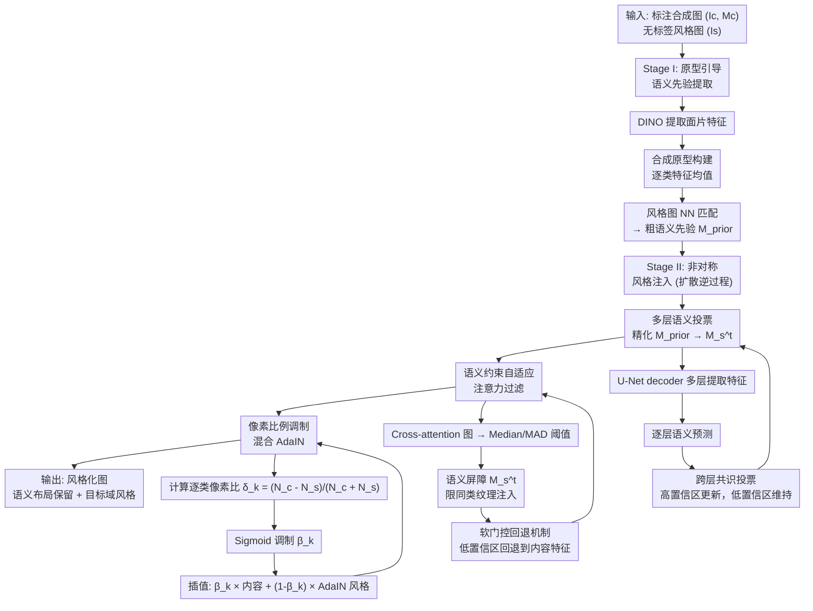

# ASTAD: 非对称风格迁移实现自动驾驶合成到真实域的适应

**会议**: ECCV 2026  
**arXiv**: [2606.29286](https://arxiv.org/abs/2606.29286)  
**代码**: [https://github.com/Dingyi-Yao/ASTAD](https://github.com/Dingyi-Yao/ASTAD)  
**领域**: 自动驾驶 / 领域自适应 / 风格迁移  
**关键词**: 非对称风格迁移, 合成到真实适应, 扩散模型, 语义一致性, 原型引导

## 一句话总结

ASTModel 针对自动驾驶场景中「合成图有完美标注、现实风格参考图无标注」的非对称约束，提出两阶段无训练框架——先用 DINO 原型匹配从无标签风格图提取粗语义先验，再在扩散逆过程中通过多层语义投票精化先验、鲁棒中位数阈值过滤和像素比例调制混合 AdaIN 实现类一致风格注入，在保持语义结构前提下 3.2x 提速生成逼真的目标域风格数据。

## 研究背景与动机

自动驾驶感知模型依赖大规模高密度语义标注数据，而真实场景的人工标注成本极高（单张 Cityscapes 图像约需 1.5 小时）。合成数据（如 GTA 数据集）通过模拟器自动生成，能快速获得带有精确像素级标注的大规模数据集，是解决数据稀缺问题的有效途径。然而，合成数据与真实世界之间存在显著的分布偏移——模拟引擎的近似物理渲染、理想化材质纹理等原因，导致仅用合成数据训练的模型在真实场景中的性能严重退化。弥合这一 gap 的关键思路之一是对合成数据做风格迁移：保留其精确的布局和标注，但将视觉风格迁移至目标域的真实场景风格。

扩散模型因其零样本泛化能力和高保真图像生成质量，近年来成为风格迁移的主流工具。现有工作（如 CACTIF）采用「对称信息假设」——要求内容图和风格图都具备稠密语义分割图，据此逐类引导风格迁移，防止语义混乱（例如道路区域不应染上植被纹理）。然而，这个假设在实际部署中面临一个根本矛盾：合成内容图天然拥有完美的像素级标注，但真实世界的风格参考图通常**没有任何稠密标注**。强行给风格图做标注成本极高，不做标注则会导致严重的跨类别语义污染（如将绿色植被纹理错误迁移到道路上）。这一信息不对称是此前方法忽略的关键盲区。

本文的核心洞察是：既然风格图没有标注，能否利用合成图上已有的标注和 foundation model 的强语义表征能力，**从无标签风格图中自动推理出语义先验**，再以此引导风格注入？**核心 idea：将合成到真实的风格迁移置于非对称约束下（标注的合成内容 + 无标签的真实风格），提出两阶段无训练框架 ASTModel——阶段一用 DINO 原型匹配从风格图提取粗语义图，阶段二在扩散采样中通过多层 U-Net 语义投票精化该先验，并用鲁棒中位数阈值过滤和像素比例调制混合 AdaIN 分别解决跨类泄漏和统计不可靠问题，确保语义一致的风格迁移。**

## 方法详解

### 整体框架

ASTModel 是一个无训练的两阶段风格迁移框架，构建在预训练潜空间扩散模型（LDM）之上。阶段一负责从无标签风格图中提取语义结构：用冻结的 DINOv2 编码器分别提取合成内容图和真实风格图的面片级特征，借助内容图的已知标注构建逐类语义原型，在 DINO 共享特征空间里通过最近邻匹配为风格图的每个位置赋予最相似的语义类别，得到一个粗糙的风格语义先验图。阶段二在扩散逆采样过程中运作：每一时间步从 U-Net decoder 的高分辨率层提取特征，复用原型匹配逻辑产生逐层的瞬时分割预测，然后通过**跨层共识投票**精化先验——只有所有层一致同意的区域才用精细的扩散层预测更新先验，其余区域维持阶段一的粗估计。精化后的语义图同时约束两个核心注入模块：一是语义约束自适应注意力过滤，利用中位数和中位数绝对偏差（Median/MAD）对跨注意力图中的稀疏高值对应做自适应筛选，并用语义屏障强制只允许同类纹理注入；二是像素比例调制混合 AdaIN（Pixel-Proportion Modulated Hybrid AdaIN），根据内容图和风格图中每个类别的像素数量比值动态调节该类的风格迁移强度，像素占比悬殊大的类少迁移风格、多保留内容结构。最终输出保留了合成图语义布局、兼具目标域视觉特征的风格化图像。

### 关键设计

**1. 原型引导风格语义先验提取：从无标签风格图中推理语义结构**

这是解决非对称约束的第一步核心设计。给定一张完全无标注的真实风格图，如何知道其中每个像素对应什么语义类别？核心思路是将合成数据上的标注知识借过来用。首先用冻结的 DINOv2 分别提取内容图和风格图的 L2 归一化面片级特征。对于内容图，借助其已知的语义标注，对每个类别（如道路、建筑、植被）在该类所有像素位置的特征取平均，得到类别原型向量。然后在 DINO 共享的特征空间中，对风格图的每个面片位置，计算它与所有类别原型的余弦相似度，取最高分对应的类别作为该位置的粗语义标签，得到语义先验图。

这种方法的优点是零训练、零标注成本，且 DINO 的面片特征天然具备语义对齐能力——同类物体在不同图像中的特征高度相似。但局限也很明显：DINO 特征的分辨率较低（通常是 16x16 或 14x14 面片），导致先验图边界粗糙、细节不足。因此这个粗先验只作为阶段二的「语义蓝图」使用，需要在扩散过程中进一步精化。

**2. 多层语义投票：跨层共识精化语义边界**

扩散模型的 U-Net decoder 包含多个层级的特征图：高分辨率层保留了丰富的细粒度结构信息，但其预测单层结果在扩散逆过程中因随机性而不稳定；而阶段一 DINO 先验稳定但缺乏精细边界。如何取两者之长、补各自之短？本文提出的机制是：在每一时间步，从 decoder 的一组高分辨率层中分别提取风格分支的特征，对每一层复用原型匹配逻辑（用该层的内容特征和合成标注计算逐层原型，再对风格特征做 NN 匹配），得到该层的瞬时语义预测。然后定义一个共识掩码——只有所有选定层对该位置的分类结果完全一致时，该位置才被标记为高置信区。精化后的语义图用公式表达为：高置信区取扩散层的细粒度预测，低置信区维持 DINO 粗先验。

这一设计的精妙之处在于它利用了扩散模型的一个内在特性：真正属于图像的固有语义结构会在不同尺度的特征层中一致地表现出来，而非随机的噪声模式。因此跨层共识天然是一个高精度的语义信号，既可以精化边界（利用高分辨率层的细节），又不会引入扩散过程的随机噪声。实验表明，该机制将伪标注的像素精度从 0.688 提升到 0.790，mIoU 从 0.281 提升到 0.339。

**3. 语义约束自适应注意力过滤：鲁棒阈值 + 语义屏障双重约束跨类泄漏**

在非对称设定下，标准交叉注意力机制极易产生跨类别纹理污染——模型可能把风格图中植被区域的绿色纹理通过注意力错误地注入到内容图中的道路区域。现有方法（如 CACTIF）用固定百分位阈值过滤注意力对应关系，但假设所有图像/层/时间步的信噪比恒定是不合理的。更根本的问题是，交叉注意力图的数值分布呈现严重的重尾特性：有效的结构对应关系表现为极为稀疏的高值离群点，被大量低值背景噪声包围。

本文提出一种双重约束过滤机制。第一重是**鲁棒统计阈值**：不用传统的均值±标准差（被离群点严重偏置），改用中位数和中位数绝对偏差（MAD）作为阈值基准。MAD 对极值不敏感，因此在稀疏高值离群点存在时仍能稳定捕获背景噪声的水平，不会过度过滤。由此计算出的动态阈值比以前定百分位的方法更鲁棒——实验表明，用 Mean/Std 阈值只保留了 1.8% 的注意力条目（过度过滤导致迁移不足），而 Median/MAD 保留了 33.2% 的条目，迁移更完整。第二重是**语义屏障**：利用上一模块精化后的语义图，只有内容位置的类别与风格位置的类别相同时才允许注意力连接，这从语义层面彻底禁止跨类纹理注入。双重过滤后的注意力输出还带有一个软门控回退机制：统计出每个位置的有效对应比例作为保留分数 α，α 高时大力注入风格纹理，α 低时（风格中找不到可靠对应）回退到内容特征，避免强行对应的伪影。

**4. 像素比例调制混合 AdaIN：按类别像素丰度动态调节迁移强度**

标准的按类 AdaIN（Class-wise AdaIN）需要两边的语义标注都精确，但在非对称设定下风格图的语义标注是推理出来的、必然有噪声。一个更微妙的问题是：合成内容图中某类可能占很大面积（如道路占画面 60%），但风格图中这类只出现零星几块甚至完全不存在——用不可靠的统计量去归一化大面积的内容区域，必然导致严重的特征畸变。

本文的解决思路非常直观：对每个类别，计算内容图像素数 N_c 与风格图像素数 N_s 的相对差异比 δ_k = (N_c - N_s) / (N_c + N_s)，然后用 Sigmoid（γ=8）将 δ_k 映射到 [0,1] 的调制因子 β_k。在最终的混合 AdaIN 中，风格注入强度按 β_k 插值：β_k 接近 1（风格图中该类像素很少）时主要保留内容特征；β_k 接近 0（风格图中该类像素充足）时大力注入风格纹理。这个设计的核心洞察是：**像素丰度间接反映了语义统计量的可靠性**——某个类在风格图中出现像素越多，其均值/方差估计越可信，可以大胆进行风格迁移；反之则应该保守、多保留原结构。

### 一个完整示例：植被主导场景的风格迁移

取一张 GTA 合成道路场景（内容图 Ic 带有完整语义标注 Mc），以及一张真实世界拍摄的植被密集街景照片（风格图 Is，无标注）。阶段一中，DINOv2 提取两张图的面片特征，GTA 标注告诉模型哪些面片属于道路、建筑、植被、天空、车辆等类别，据此构建语义原型。对风格图的每个面片，匹配到最相似的类别，得到粗语义图——大致能区分出天空在上方、植被在两侧、道路在下方，但边界粗糙。阶段二在扩散采样 50 步中逐时间步运行：第 t 步从 U-Net decoder 的高分辨率层（如 layer 8、9、10）提取风格特征，各自做 NN 匹配，三层都同意某位置是「道路」时才用该精细预测更新先验，否则维持粗先验。精化后的语义驱动注意力过滤：只有「道路→道路」「植被→植被」的跨注意力连接被允许，再用 Median/MAD 阈值剔除相似度低的连接（大量低值噪声被过滤）。最后混合 AdaIN 为该场景计算各类的像素比——内容图中植被占约 30%，风格图中植被占约 50%，差异不大（β_植被 ≈ 0.3），可以充分迁移植被的绿色质感；而内容图中汽车、交通标志等在风格图中几乎不存在（β_小目标 ≈ 1），于是这些区域几乎不做风格迁移、保留原样。最终生成的结果既具有 GTA 的完整布局和清晰边界，又在道路、植被、建筑区域呈现出真实世界的材质质感。

## 实验关键数据

### 主实验

| 数据集 | 指标 | Source Only | Cross-Image Attn. | CACTIF | ASTModel (本文) |
|--------|------|-------------|-------------------|--------|-----------------|
| GTA→Cityscapes (SegFormer) | Pixel Acc ↑ | 0.844 | 0.653 | 0.782 | **0.847** |
| GTA→Cityscapes (SegFormer) | mIoU ↑ | 0.275 | 0.224 | 0.289 | **0.309** |
| 结构保真度 | LPIPS ↓ | — | 0.5205 | 0.4184 | **0.3588** |
| 推理速度 | 单张耗时 ↓ | — | 18s | 80s | **25s** |
| 推理速度 | 5000 张总耗时 ↓ | — | 28h | 114h | **37h** |

主实验评估了三个维度：下游感知效用（用 SegFormer 分割）、结构保真度（LPIPS）、计算效率。ASTModel 在下游分割指标上超越了 Source Only 基线（Pixel Acc +0.3, mIoU +3.4），说明风格化后的数据确实有助于域适应；相比 CACTIF 提升显著，且 LPIPS 大幅降低（0.3588 vs 0.4184），表明语义一致性更强、结构畸变更少。速度方面，CACTIF 因逐像素特征相似度计算成为性能瓶颈（80s/张），ASTModel 的鲁棒统计阈值避免了这种密集计算，实现 3.2x 加速。

### 消融实验

| 配置 | LPIPS ↓ | 说明 |
|------|---------|------|
| 完整模型 | **0.3588** | 所有模块同时工作 |
| w/o 注意力过滤 | 0.5114 | 无过滤→跨类污染，道路出现绿色伪影 |
| w/o 混合 AdaIN | 0.3737 | 全局 AdaIN→颜色偏移保真度下降 |
| w/o 语义投票 | 0.3641 | 粗先验无法精化，小物体/边界模糊 |

### 关键发现

- **注意力过滤贡献最大**：去掉注意力过滤后 LPIPS 从 0.3588 暴涨到 0.5114，说明跨类语义泄漏是最核心的问题，而语义约束注意力过滤是解决它的关键。
- **Median/MAD 的稳健性**：去掉 top-20 最高注意力分数后，均值从 41.8→41.8、标准差从 173.3→171.9（几乎不变，离群点仍支配统计量），而中位数和 MAD 完全不受影响。Mean/Std 阈值只保留 1.8% 条目导致迁移不足，Median/MAD 保留 33.2% 条目迁移更完整。
- **伪标注精化验证**：阶段二语义投票将伪标注像素精度从 0.688 提升到 0.790，mIoU 从 0.281 提升到 0.339，且提升幅度与内容-风格语义兼容度正相关——两张图场景越相似，跨层共识越强，精化效果越好。

## 亮点与洞察

- **非对称约束的形式化定义是核心贡献**：之前的方法都在「对称信息假设」下做风格迁移，本文首次明确提出合成→真实适应中「标注不对称」这一实际约束，为后续方法设定了更现实的问题框架。这个任务定义本身可能是比具体方法更大的贡献。
- **跨层共识投票精化先验很巧妙**：利用扩散 U-Net decoder 多尺度特征的自然性质（底层细节丰富、高层语义稳定），通过跨层一致性做精化——这利用了模型本身的结构，不需要额外训练或标注，属于「零成本」的精化思路。
- **MAD 替代均值-标准差做注意力阈值**：在重尾分布下，中位数和 MAD 是不受离群点影响的鲁棒统计量——这个洞察不仅可以迁移到其他需要自适应阈值的视觉任务（如图像匹配、特征选择、对应的过滤），也非常直观好理解。
- **像素比例调制 AdaIN 的设计极具操作性**：不看特征分布的差异大小，而看「像素数量够不够统计可靠」——这个判断标准虽然朴素但在逻辑上无懈可击，而且实现极简（一个 Sigmoid）。
- **无训练框架的实用价值**：不需要对每个目标域训练专门的风格迁移模型，换一张参考图就能直接推理，这对于自动驾驶场景中多样化目标域的实际部署有重要意义。

## 局限与展望

- **依赖单张风格参考图**：论文承认这是目前最大的局限。单张图中的某些类可能只有少量像素甚至完全缺失，导致该类区域的风格迁移不足或特征畸变。论文对修后的车回答较强而前侧较弱这一观察很有价值——未来扩展到多张参考图可以缓解此问题。
- **场景语义兼容度的敏感性**：文中提到伪标注精化效果与内容-风格的语义兼容度正相关——这意味着当风格图与内容图场景差异过大时（如 GTA 城市街景配一张沙漠），精化效果可能退化。没有讨论这种极端情况下框架的鲁棒边界。
- **DINO 先验的质量下限**：阶段一的先验完全依赖 DINO 的语义对齐能力。如果遇到 DINO 难以区分的类别（如卡车 vs 大巴），先验本身就会引入混淆，后续精化也难以完全纠正。这可能对自动驾驶中细粒度车辆分类（轿车/SUV/卡车）构成挑战。
- **下游任务评估可更全面**：当前只测试了语义分割任务（SegFormer），如果进一步验证目标检测（如 YOLO）、实例分割等任务上的效果，论文的结论会更有说服力。
- **无训练框架的优势也是局限**：无法利用目标域数据做 fine-tuning 来进一步弥合域 gap，在极端域迁移场景下可能存在质量天花板。未来可以考虑「无训练推理 + 部分适配时的微调」混合方案。

## 相关工作与启发

- **vs CACTIF**：CACTIF 假设内容图和风格图都有稠密标注（对称假设），用固定百分位过滤注意力 + 标准逐类 AdaIN；ASTModel 去掉了风格图标注需求，并分别用 Median/MAD 和像素比例调制 AdaIN 提升了过滤和归一化的鲁棒性。ASTModel 在下游分割和 LPIPS 上都显著优于 CACTIF，且快了 3.2x。
- **vs Cross-Image Attention**：简单交换自注意力 k/v 实现风格迁移，没有语义引导，在非对称设定下出现严重语义混乱（mIoU 仅 0.224），说明在自动驾驶这种语义密集场景中，无引导的注意力交换不足以保证语义一致性。
- **vs DGInStyle / SimGen / Weather-Diff**：这些方法通过微调扩散模型实现特定域风格迁移，质量高但灵活度差；ASTModel 的无训练范式在灵活性和效率上有独特优势，适合需要快速适配多样目标域的场景。

## 评分

- 新颖性: ⭐⭐⭐⭐½ 首次形式化「合成→真实适应非对称约束」这个被忽视的课题，任务定义和方法设计都有原创性。鲁棒统计量 + 语义屏障双重过滤的思路简洁有效。
- 实验充分度: ⭐⭐⭐⭐ 覆盖了下游分割、结构保真度、推理速度三个维度，消融实验完整，还对伪标注精化和阈值选择做了专项分析。但只用了 5000 张 GTA 图像和一个语义分割模型，评估面略窄。
- 写作质量: ⭐⭐⭐⭐½ 问题动机清晰、方法推导逻辑连贯、最关键的设计选择都有直观的可视化支撑（注意力分布、α 分数、伪标注精化对比图）。公式量适中，叙述流畅。
- 价值: ⭐⭐⭐⭐½ 任务定义具有普遍意义——几乎所有的合成→真实适应场景都面临标注不对称问题。无训练框架的实用价值高，3.2x 速度提升显著。即使方法本身有局限性，问题定义本身就值得后续方法关注。

<!-- RELATED:START -->

## 相关论文

- [\[ECCV 2026\] HilDA: Hierarchical Distillation with Diffusion for Advancing Self-Supervised LiDAR Pre-training](hilda_hierarchical_distillation_with_diffusion_for_advancing_self-supervised_lid.md)
- [\[ECCV 2026\] Driver-WM: A Driver-Centric Traffic-Conditioned Latent World Model for In-Cabin Dynamics Rollout](driver-wm_a_driver-centric_traffic-conditioned_latent_world_model_for_in-cabin_d.md)
- [\[ECCV 2026\] UniTeD: Unified Temporal Diffusion for Joint Perception and Planning in Autonomous Driving](united_unified_temporal_diffusion_for_joint_perception_and_planning_in_autonomou.md)
- [\[ECCV 2026\] Open-Vocabulary BEV Segmentation with 3D-Aware Geometric Constraints](open-vocabulary_bev_segmentation_with_3d-aware_geometric_constraints.md)
- [\[ECCV 2026\] FLM-Occ: Feed-forward Likelihood Maximization for Efficient Indoor Occupancy Prediction](flm-occ_feed-forward_likelihood_maximization_for_efficient_indoor_occupancy_pred.md)

<!-- RELATED:END -->
