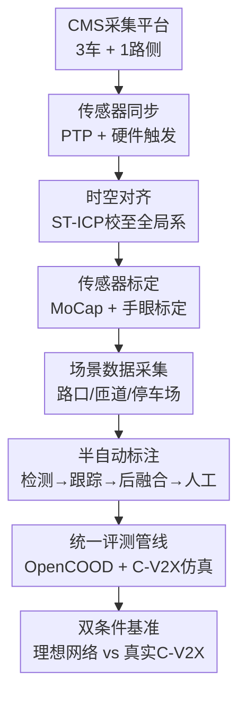

# CooperScene: Multi-Modal Cooperative Autonomy Benchmark with C-V2X Communication Characterization

**会议**: ECCV 2026  
**arXiv**: [2606.31219](https://arxiv.org/abs/2606.31219)  
**代码**: [https://cisl.ucr.edu/CooperScene](https://cisl.ucr.edu/CooperScene) (项目网站)  
**领域**: autonomous_driving  
**关键词**: 协同感知, C-V2X通信, 自动驾驶数据集, 多智能体协同, 基准测试

## 一句话总结
CooperScene 是首个在真实道路场景中同步采集 C-V2X 通信特征（吞吐量、延迟、丢包率、抖动）与多模态传感器数据（LiDAR、相机、GNSS/IMU）的协同自动驾驶数据集，覆盖 3 辆智能车和 1 个路侧单元在路口、高速匝道、停车场等多样场景的交互，基于该数据集的基准评测表明，现有协同感知方法在真实 C-V2X 带宽约束下的 mAP 相比理想网络假设最多下降 49%，揭示了理想化评测与可部署性能之间的巨大鸿沟。

## 研究背景与动机

以 Waymo 为代表的单车智能自动驾驶虽然在公开道路上积累了可观的运营里程，但单车视角固有的遮挡盲区、传感器有限探测范围和对长尾事件的应对能力不足，使得单纯提升单车传感器方案很难在安全性上取得质的突破。蜂窝车联网（C-V2X）技术提供了一个截然不同的思路：让车辆之间（V2V）、车辆与路侧设施（V2I）实时共享感知信息，从而突破单车视野的物理极限。近年来以 V2VNet、CoBEVT、V2X-ViT 为代表的协同感知方法在 OPV2V、V2V4Real 等公开数据集上取得了显著进展，通过共享中间特征图实现了大幅超越单车感知的检测精度。

然而，现有工作存在三个关键盲区。其一，真实 V2X 通信带宽极其有限（3GPP Release 14 商用车规 C-V2X 模组的实测吞吐量通常在 1 Mbps 以下），而 SOTA 协同感知模型单帧需交换的特征数据量从数十 KB 到数十 MB 不等——这意味着许多在理想网络假设下设计的方法，在真实 C-V2X 链路上根本无法按时完成数据交换，传完了决策时间窗也早过了。其二，现有数据集大多只包含两方协作（一车一路或两车），缺少对多车（三车及以上）协作的基准评测，而更多车辆参与带来的信道争用和特征累积效应很可能改变"协作到底有没有用"的判断。其三，数据质量（传感器同步精度、空间对齐精度、标定精度）在现有数据集中参差不齐，跨设备 30-50 ms 的时间同步误差会导致时序错位和感知性能退化，而这一点极少被系统性验证。商用车规 C-V2X 通信模组（Cohda MK6）和低成本高精度 LiDAR 近来已发展至可投入真实采集的地步，同时模块化传感器采集平台（CMS）使得多车复制门槛大幅降低——这使得做一个"带着真实通信数据、覆盖多车多场景、质量可靠"的数据集在技术上变得可行。

**核心 idea：构建一个包含 3 辆车 + 1 个路侧单元、全部搭载多模态传感器和商规 C-V2X 模组的真实世界协同自动驾驶数据集，通过精密同步、厘米级空间对齐和 MoCap 级传感器标定保证数据质量，并提供 C-V2X 通信特征作为评测层，让研究者同时评估感知精度和通信效率，揭示从理想到可部署的现有差距。**

## 方法详解

### 整体框架

CooperScene 的本质是一条从数据采集到基准评测的端到端管线。采集层由三个车载 CMS（Cooperative Multi-Modal Sensing）平台与一个路侧基础设施组成，每套平台集成 LiDAR、相机、GNSS-IMU 和商规 C-V2X 通信模组。同步层通过 PTP + 硬件触发实现车端传感器微秒级对齐，再通过 GNSS 全局时间实现跨车同步。空间对齐层用本文提出的时空 ICP（ST-ICP）将各车局部点云精校至全局 ENU 坐标系，校准层则借助 MoCap 动捕系统与手眼标定（eye-hand calibration）获取传感器间毫米级外参。采集到的原始数据经半自动标注管线（检测预标→跟踪关联→跨车后融合→人工精修）生成全局一致的 3D 标注。最后，评测层将所有基线方法统一集成到基于 OpenCOOD 的管线中，叠加可配置的 C-V2X 网络仿真器，同时报告理想网络和真实 C-V2X 两种条件下的性能。

### 关键设计

**1. CMS 协同采集平台：统一多车硬件配置与标定流程**

CooperScene 的数据质量依赖于自研的 CMS 采集平台——一个开源的便携式通用传感中枢，将 LiDAR（Ouster OS1-128）、相机（Lucid 5.4 MP）、GNSS/IMU（Xsens MTi-680 RTK）和 C-V2X 模组（Cohda MK6）通过 PoE 交换机统一接入车载 ROS 节点。它解决了一个实操层面的痛点：多车采集要求每辆车拥有一致可复制的传感器配置、一致的同步方案和一致的标定流程，而每台车的传感器安装位姿差异意味着外参校准不能简单复用。CMS 通过统一的硬件集成方案+共享同一套标定程序来保证跨车一致性。三辆 CMS 车辆加一个同样部署了 LiDAR 和 MK6 的路侧单元（安装在路口信号灯杆），覆盖了城市路口（16 段）、高速匝道（4 段）和停车场（4 段）三类场景共 24 个交互片段，安排车辆从不同起点同时汇入交互区域，模拟遮挡、远距和多方向交汇。最终产出 5.9 万帧同步 LiDAR 数据和 5.3 万帧图像，标注了 34.4 万个 3D 边界框。

**2. 高精度同步与时空对齐：消除多模态多车错位的关键系统设计**

高质量协同感知数据对时间同步和空间对齐提出了极高要求，而这两点恰恰是现有数据集最薄弱的环节。时间方面，CooperScene 在传感器间和跨车两个层次分别解决：车端以 Cohda MK6 作为 PTP 主时钟来同步所有传感器，并利用 LiDAR 产生的 10 Hz GPIO 脉冲硬件触发相机曝光——使快门与 LiDAR 扫描周期对齐，消除软件时间戳的网络抖动和调度延迟。跨车则利用 GNSS 全局时间锁定各平台的 MK6 主时钟，所有传感器共享同一时间基准。空间方面，论文提出时空 ICP（ST-ICP）：先用 GNSS/IMU 将各车点云投影至全局 ENU 坐标，再对每车与路侧点云重叠最大的单帧做 ICP 粗略校准，最后找到所有车体距离之和最小的一帧实施联合 ICP。全程只依赖每车一帧即可完成校准，最终对齐 RMSE 为 0.2 m，优于 V2V4Real 和 DAIR-V2X-C。

**3. C-V2X 通信特征表征：将真实带宽约束嵌入基准测试**

这是 CooperScene 区别于所有前人工作的核心。每台 CMS 上的 Cohda MK6 在采集过程中同时记录所有车—车、车—路之间的实时吞吐量、延迟、丢包率和抖动，采样间隔 100 ms。评测时将这些真实的通信轨迹输入统一评测管线，让基线方法在"数据必须经过真实 C-V2X 带宽约束传输"的条件下重新运行——将特征数据切分为 2100 字节的包，每包以 1 ms 间隔发送，严格遵循 3GPP Release 14 C-V2X 标准的物理资源分配。这带来了一个此前被忽视的洞见：即使只交换 59.5 KB 特征（CoSDH 的水平），在 C-V2X 下仍需约 298 ms 才能传完，而一辆时速 40 km/h 的车在 300 ms 内已开出 3.3 米。超过决策时间窗的数据不仅无益，过时信息还可能误导感知。

### 一个完整示例：V+2V+I 协作下 CoBEVT 的 C-V2X 困境

以四车全参与（V+2V+I）配置下的 CoBEVT 为例。单帧需交换的特征总量约 1.5 MB，在理想的无限带宽假设下，所有协作者几乎瞬时收到彼此特征，3 车 1 路数据融合后在 mAP@0.5 上达 0.75。但在真实 C-V2X 信道上，1.5 MB 数据的传输耗时约 12.4 秒——远超自动驾驶的决策时间窗。在此间隔内车辆各自依赖本地感知。更反直觉的是，增加的第 3 辆车不仅没有带来性能提升，反而因为信道争用加剧（更多车辆共享同一频谱、互相干扰），实际 mAP@0.5 从 V+V 的 0.55 略降到 V+2V+I 的 0.50。这个结果揭示了当前协同方法的根本矛盾：设计上假定无限带宽，部署上却被带宽瓶颈硬约束。

### 损失函数 / 训练策略

本文为数据集和基准工作，不涉及新模型训练策略。所有基线方法统一使用 OpenCOOD 默认配置：PointPillars 骨干网络、LiDAR voxel 分辨率 0.4 m、单帧最多 3.2 万非空体素、单 GPU 训练约 40 个 epoch，数据增强包括随机翻转、±45° 旋转和全局缩放。

## 实验关键数据

### 主实验

下表展示不同协作模型在 V+2V+I（全部 4 个智能体参与）配置下，C-V2X 带宽约束与无限网络条件下的感知精度对比。

| 模型 | 网络条件 | mAP@0.3 | mAP@0.5 | mAP@0.7 | 单帧共享数据量 | C-V2X 传输延迟 |
|------|----------|---------|---------|---------|--------------|--------------|
| V2VNet | 无限 | 0.81 | 0.75 | 0.50 | 30.0 MB | 107.4 s |
| V2VNet | C-V2X | 0.32 | 0.23 | 0.13 | — | — |
| V2X-ViT | 无限 | 0.80 | 0.74 | 0.50 | 1.01 MB | 10.0 s |
| V2X-ViT | C-V2X | 0.60 | 0.52 | 0.33 | — | — |
| V2VAM | 无限 | 0.84 | 0.78 | 0.53 | 1.27 MB | 11.3 s |
| V2VAM | C-V2X | 0.62 | 0.54 | 0.34 | — | — |
| CoBEVT | 无限 | 0.82 | 0.75 | 0.54 | 1.50 MB | 12.4 s |
| CoBEVT | C-V2X | 0.59 | 0.50 | 0.32 | — | — |
| ERMVP | 无限 | 0.87 | 0.81 | 0.57 | 1.04 MB | 5.2 s |
| ERMVP | C-V2X | 0.64 | 0.56 | 0.36 | — | — |
| CoSDH | 无限 | 0.81 | 0.73 | 0.52 | 0.18 MB | 0.9 s |
| CoSDH | C-V2X | 0.75 | 0.61 | 0.41 | — | — |

> 传播延迟为数据量与 C-V2X 实测吞吐量的估算值；C-V2X 条件下的 mAP 通过真实通信轨迹仿真得到。即使 CoSDH 仅需 0.9 秒传输，C-V2X 的高丢包率（约 38%）和抖动仍会进一步劣化效果。

### 消融实验：多车规模与通信条件

| 配置 | C-V2X mAP@0.3 | 无限网络 mAP@0.3 | 说明 |
|------|--------------|-----------------|------|
| V（单车） | 0.50 | 0.54 | V2X-ViT基线，无协作 |
| V+I | 0.50 | 0.54 | 单车加路侧 |
| V+V+I | 0.56 | 0.70 | 单车加路侧加一车 |
| V+2V+I | 0.60 | 0.80 | 全部参与者 |

C-V2X 条件下从 V+I 到 V+2V+I 仅从 0.50 提升至 0.60，而无限网络下从 0.54 跃升至 0.80，说明多车融合的理论优势在带宽约束下无法兑现。

### 关键发现

- **带宽瓶颈是第一拦截因素**：非通信高效方法（V2VNet、CoBEVT）在 C-V2X 下几乎无增益，甚至不如单车感知；通信高效方法（CoSDH、ERMVP）虽有优势，但传输时间仍远超安全关键决策要求。
- **丢包和延迟独立于带宽仍需解决**：消除带宽瓶颈的 oracular 实验中，C-V2X 本身的 38% 丢包率和 31 ms 延迟仍使检测精度低于无限网络，说明鲁棒的协同感知需同时应对带宽压缩和通信鲁棒性。
- **C-V2X 吞吐量大幅动态波动**：车辆移动和信道争用使得有效吞吐量在帧间起伏剧烈，没有单个智能体能持续占用信道，这要求未来的协同协议必须具备自适应能力。

## 亮点与洞察

- **将通信特征纳入数据集本身就是方法论贡献**：此前所有协同感知数据集都把通信视为透明管道，假定"数据发了就能到、到了就是准时的"。CooperScene 用真实 V2X 模组实测数据打破这一假设，量化了从实验室到部署的巨大落差，为网络感知协同方法提供了标尺。
- **多车协作的反直觉发现**：有限带宽下增加参与者不一定提升性能，反而可能因信道争用退化。这要求未来的协同架构在"融合收益"和"传输代价"之间显式建模。
- **ST-ICP 的校准效率**：每车仅依赖单帧即达 0.2 m RMSE 多车对齐，效率远高于 TUM-Traf 每 10 帧做一次 ICP 的做法。
- **可迁移的研究范式**：将"真实网络条件层"嵌入基准评测的思路，可直接适用于 V2I 通信、无人机编队、工业机器人协作等带宽约束的多智能体系统。

## 局限与展望

- 当前标注仅覆盖 Car 类，行人和骑行者将在未来版本补充——这对安全关键应用至关重要。
- C-V2X 通信特征仅记录了网络层指标（吞吐量、延迟、丢包），尚未采集物理层无线资源调度和接收信号强度等信息。整合这些数据将推动跨层协同感知设计。
- 路侧仅装备 LiDAR（无相机），且每车仅一个前向相机，缺少更多视角的传感器覆盖，限制了多模态融合评测的丰富度。
- 场景集中在单个路口附近区域，尚未覆盖高速长直道、城市峡谷等更具挑战的通信环境，加州 Riverside 的地域特性也可能带来地理偏差。
- 评测形式是"发送方压缩→C-V2X 传输→接收方融合"，未考虑特征压缩/编码本身带来的额外延迟，该延迟在安全关键系统中不可忽略。

## 相关工作与启发

- **vs OPV2V / V2V4Real**: 开创协同感知评测范式，但仅涉及两车且无真实通信特征；CooperScene 扩展至 3 车+1 路侧并首次纳入 C-V2X 实测数据。
- **vs DAIR-V2X-C / V2X-Seq**: 包含车—路协同但每场景仅一车，且论文指出其跨模态投影存在明显空间错位、缺乏系统同步验证。
- **vs TUM-Traf**: 定位精度高但仅支持单头车+路侧。TUM-Traf 每 10 帧一次 ICP，CooperScene 的 ST-ICP 仅需单帧即达相似精度。
- **vs UrbanIng-V2X**: 多车覆盖大但多模态感知能力有限；CooperScene 每车均配备完整多模态传感器和 C-V2X 模组。

## 评分

- 新颖性: ⭐⭐⭐⭐⭐ 首个在真实多车场景中同步采集 C-V2X 通信特征的数据集，填补理想评测与可部署性能的空白，切入点极具原创性。
- 实验充分度: ⭐⭐⭐⭐⭐ 覆盖 7 个基线、5 种协作配置、2 种网络条件、检测与预测双任务，附带详尽的同步/对齐/标定质量验证。
- 写作质量: ⭐⭐⭐⭐⭐ 问题动机明确且数据支撑充分（OPV2V 上带宽需求与 C-V2X 容量的对比尤为有说服力），方法描述系统，结论清晰。
- 价值: ⭐⭐⭐⭐⭐ 将 C-V2X 真实通信约束引入 CV 社区，有望推动协同感知从"精度导向"转向"通信效率+鲁棒性导向"的范式转变，对行业落地有直接指导意义。

<!-- RELATED:START -->

## 相关论文

- [\[ECCV 2026\] RESOLVE: A Multi-Resolution and Multi-Modal Dataset for Roadside Cooperative Perception](resolve_a_multi-resolution_and_multi-modal_dataset_for_roadside_cooperative_perc.md)
- [\[NeurIPS 2025\] V2X-Radar: A Multi-Modal Dataset with 4D Radar for Cooperative Perception](../../NeurIPS2025/autonomous_driving/v2x-radar_a_multi-modal_dataset_with_4d_radar_for_cooperative_perception.md)
- [\[NeurIPS 2025\] UrbanIng-V2X: A Large-Scale Multi-Vehicle Multi-Infrastructure Dataset Across Multiple Intersections for Cooperative Perception](../../NeurIPS2025/autonomous_driving/urbaning-v2x_a_large-scale_multi-vehicle_multi-infrastructure_dataset_across_mul.md)
- [\[ICML 2026\] TSRBench: A Comprehensive Multi-task Multi-modal Time Series Reasoning Benchmark for Generalist Models](../../ICML2026/autonomous_driving/tsrbench_a_comprehensive_multi-task_multi-modal_time_series_reasoning_benchmark_.md)
- [\[ECCV 2026\] Understanding Cross-Rig Generalization in Automotive Perception: a Multi-Rig Benchmark and Rig Variation Metrics](understanding_cross-rig_generalization_in_automotive_perception_a_multi-rig_benc.md)

<!-- RELATED:END -->
