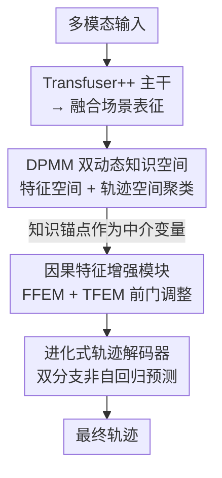

# Deconfounded Lifelong Learning for Autonomous Driving via Dynamic Knowledge Spaces

**会议**: ECCV2026  
**arXiv**: [2603.14354](https://arxiv.org/abs/2603.14354)  
**代码**: 待确认  
**领域**: 自动驾驶  
**关键词**: 终身学习, 因果推断, 前门调整, DPMM, 端到端自动驾驶

## 一句话总结

DeLL 首次将终身学习引入闭环端到端自动驾驶，利用 Dirichlet 过程混合模型构造显式和隐式双动态知识空间，并将动态生长的知识锚点作为中介变量实现前门调整去混杂，在 Bench2Drive 上以零额外存储开销取得优于 PackNet 和 ER 的终身学习性能。

## 研究背景与动机

端到端自动驾驶在 CARLA 闭环仿真中取得了长足进步，Transfuser++、UniAD、VAD 等方法通过跨模态注意力、辅助任务和 Transformer 架构不断刷新驾驶得分。然而，当模型需要在开放世界的非平稳环境中持续部署时，两个根本性问题暴露出来。第一个是灾难性遗忘：行为克隆架构本质上是一个关联引擎，每学习新驾驶能力，权重被新数据覆盖后旧能力迅速衰退。现有的终身学习方法要么需要额外存储旧数据（经验回放 ER），要么需要网络剪枝重训练（PackNet 需 2 倍训练时间），更关键的是它们都停留在"被动防止参数被覆盖"的层面——知识是静态堆叠而非动态生长的。第二个是因果混淆：驾驶是一个部分可观测马尔可夫决策过程，传感器噪声、环境变化等不可观测混杂变量会同时影响感知和决策，产生虚假关联（如"看到静止车辆就减速到 0"而非动态跟车）。现有方法尚未同时解决这两个交织的问题。

本文的核心洞察是：知识组织和因果去混杂可以通过同一个机制实现——将新场景在线聚类的结果既作为知识保持的手段，又作为因果推断的中介变量。**核心 idea：提出 DeLL 框架，利用非参数贝叶斯模型 DPMM 同时构建隐式特征知识空间和显式轨迹知识空间，让知识簇随新场景自主生长而非人为预设数量；将 DPMM 产出的知识锚点作为中介变量，通过前门调整（front-door adjustment）切断不可观测混杂变量的后门路径，并用进化式轨迹解码器实现与动态知识空间适配的非自回归并行规划。**

## 方法详解

### 整体框架

DeLL 的架构从多模态输入到最终轨迹输出经历四个核心阶段：多模态感知主干提取场景特征 → DPMM 构建双动态知识空间并产出知识锚点 → 因果特征增强模块通过前门调整去混杂 → 进化式轨迹解码器生成最终路径。关键特点在于，每次新场景到来时 DPMM 自主决定是否创建新簇，知识锚点持续累积并回注到前向传播中，实现高效的终身知识迁移。

### 关键设计

**1. DPMM 双动态知识空间：让知识簇随数据自主生长**

传统终身学习方法需要预设任务边界或知识簇容量，但在自动驾驶的开放场景中，新驾驶模式何时出现、有多少种类都是未知的。DeLL 的关键创新是用 Dirichlet 过程混合模型（DPMM）替代固定容量聚类。DPMM 是一个非参数贝叶斯模型，核心在于 Dirichlet 过程先验允许数据来自无限个潜在簇——新数据点如果与所有现有簇都不匹配，就自动创建一个新簇，完美适配终身学习中簇数量未知且持续增长的需求。DPMM 的 inference 采用 memoVB（记忆化变分贝叶斯）进行在线坐标上升更新，通过 birth 和 merge 启发式策略动态调整簇数并逃脱局部最优。

DeLL 在两个层面实例化 DPMM 知识空间。**特征知识空间（FKS）** 是一个隐式空间，对骨干网络提取的融合场景表征 $F_{fused} \in \mathbb{R}^{11 \times 256}$ 进行在线聚类，每个簇的中心作为特征知识锚点 $A_{feat} \in \mathbb{R}^{K_f \times 2816}$。这些锚点隐式编码了环境中潜在的因果拓扑结构——路口类型、交通密度模式、天气特征等。**轨迹知识空间（TKS）** 则是一个显式运动学空间，直接对历史训练数据中的专家轨迹进行 DPMM 聚类，构建物理先验动作库，聚类中心作为轨迹知识锚点 $A_{traj} \in \mathbb{R}^{K_t \times 20}$，涵盖车道保持、变道超车、急转等具体驾驶机动模式。两个空间的簇数 $K_f$、$K_t$ 均随学习进程自动增长。训练时 DPMM 与神经网络交替更新，当前批数据先更新 DPMM 簇结构，再用更新后的簇心辅助网络训练。

**2. 因果特征增强模块：前门调整切断虚假关联**

驾驶决策中存在不可观测的混杂变量 $U$（传感器噪声、光照变化），它们同时影响感知输入 $X$ 和决策 $Y$，开后门路径 $X \leftarrow U \rightarrow Y$。标准后门调整需要观测 $U$ 的所有取值，在自动驾驶中不可能。DeLL 巧妙地将 DPMM 产出的知识锚点作为中介变量 $M$，通过前门调整切断混杂路径。前门调整的核心公式为：
$$P(Y=y|do(X=x)) = \sum_m P(m|x) \sum_{x'} P(y|x',m) P(x')$$
其成立条件是存在一条 $X \rightarrow M \rightarrow Y$ 的前门路径，且 $M$ 到 $Y$ 不存在不可阻断的后门路径。

该因果干预被分解为两个级联子模块，采用统一的双注意力+门控融合架构。**融合特征增强模块（FFEM）** 接收原始融合特征 $F_{fused}$ 和特征知识锚点 $A_{feat}$，先将 $A_{feat}$ 投影到潜在空间，再以输入特征为查询（Q）、锚点为键值（K/V）做交叉注意力——这实现了公式中的 $\sum_m P(m|x)$，即找到与当前场景最匹配的历史因果模板。最后通过 sigmoid 门控网络自适应计算融合权重，将原始与因果增强特征平滑组合。**轨迹特征增强模块（TFEM）** 接收到 FFEM 输出中负责轨迹预测的子集和轨迹锚点 $A_{traj}$，经过位置编码和时序扩展后重复同样的交叉注意力+门控机制，输出包含因果运动学约束的轨迹特征。

**3. 进化式轨迹解码器：非自回归并行规划与知识适配**

传统规划解码器输出维度在训练前固定，无法应对终身学习中轨迹模式持续增长的矛盾。进化式解码器通过两个设计解决此问题。首先，它利用 Transformer 的序列灵活性，将动态增长的轨迹锚点 $A_{traj}$ 通过时序嵌入网络映射为可动态扩展的规划 Token 池。随着 DPMM 将 $K_t$ 从少到多自然增长，Token 池也随之扩张，实现无上限的知识获取。这些 Token 作为查询，与场景上下文做交叉注意力，并行评估各历史驾驶模式与当前场景的匹配程度。其次，解码器采用双分支解耦预测头：粗粒度分支计算每个锚点的选择分数 $Y_{logits} \in \mathbb{R}^{K_t}$，经温度 Softmax 转为概率分布；细粒度分支预测几何偏移 $Y_{offsets} \in \mathbb{R}^{K_t \times 20}$ 修正锚点坐标。最终通过 Top-K 路由选出执行轨迹：
$$Y^{traj} = Y^{trajs}_{TopK(Y^{probs}, k)}$$
其中 $Y^{trajs}$ 为锚点加偏移后的候选轨迹集。基于锚点选择的思路天然适配终身学习——新场景产生新轨迹锚点时，只需在池中新增一个候选向量，不改变任何已有参数。

### 损失函数 / 训练策略

总损失 $L = L_{sem} + L_{det} + L_{traj} + L_{speed}$，其中 BEV 语义分割和速度分支用交叉熵，BEV 检测遵循 CenterNet 模式。轨迹损失包含三项：$L_{prob}$ 用 KL 散度让预测的锚点选择概率与 GT 距离定义的软标签对齐；$L_{best}$ 用 Smooth L1 衡量最近预测轨迹与 GT 的偏差；$L_{weighted}$ 按 GT 概率加权各候选轨迹的 Smooth L1 之和。训练分两阶段：先仅训练骨干，再全模型联合（各 30 epoch）。终身学习时首任务走两阶段，后续任务冻结骨干、重置优化器、单阶段 30 epoch。

## 实验关键数据

### 主实验（终身学习）

| 指标 | 基线 (TF++) | DeLL (Ours) | 提升 |
|------|------------|-------------|------|
| Avg Driving Score ↑ | 70.55 | **74.69** | +4.14 |
| Avg Success Rate ↑ | 44.54 | **50.73** | +6.19 |
| Avg Multi-Ab SR ↑ | 45.23 | **52.08** | +6.85 |
| Forgetting Ratio ↓ | 44.50 | **33.97** | -10.53 |
| Process FR ↓ | 40.25 | **29.80** | -10.45 |
| Backward Transfer ↑ | 52.83 | **79.63** | +26.80 |
| Forward Transfer ↑ | 41.11 | **42.88** | +1.77 |

在 Bench2Drive 上，DeLL 在所有序列任务上大幅超越基线。最终任务后在数据稀疏的 GiveWay 上仍保持 68.97% 驾驶得分和 42.73% 成功率，而基线衰退至 60.89%/30%。与同类方法比较：ER 需 1.35 倍数据缓存、PackNet 需 2 倍训练时间，DeLL 在零额外存储和等训练成本下达到更好的综合性能。全量学习设置中 DeLL 以 86.86% DS 和 68.9% 多能力平均成功率超越所有对比方法，证实终身学习架构创新在静态训练中也有增益。

### 消融实验

| 配置 | Avg DS | Avg SR | FR ↓ | BT ↑ |
|------|--------|--------|------|------|
| Baseline (TF++) | 70.55 | 44.54 | 44.50 | 52.83 |
| w/o 进化式解码器 | 72.94 | 49.82 | 33.12 | 72.21 |
| w/o TFEM | 73.00 | 48.36 | 36.43 | 77.14 |
| w/o FFEM | 73.10 | 49.33 | 38.33 | 77.32 |
| **Full Model** | **74.69** | **50.73** | **33.97** | **79.63** |

### 关键发现

- **特征去混杂（FFEM）对前向迁移最关键**：去掉 FFEM 后 FT 从 42.88% 骤降至 36.59%，去混杂对泛化至新任务不可或缺
- **轨迹知识空间驱动反向迁移**：去掉进化式解码器后 BT 从 79.63% 跌至 72.21%，动态增长的轨迹锚点池是知识保持的主引擎
- **因果运动学约束缓解过程遗忘**：去掉 TFEM 后 PFR 从 29.8% 升至 32.86%，前门调整在轨迹层面的约束确能抑制干扰性振荡
- **定性可视化**：基线在连续学习后错误学到"0 速度=前方静止"的关联，DeLL 保留正确速度控制，说明因果干预确实避免了虚假因果链

## 亮点与洞察

- **DPMM 同时服务终身学习和因果推断**：聚类输出既是知识组织手段（动态扩展簇），又自然充当了前门调整的中介变量——两个目标共享同一机制，设计极为精巧
- **知识锚点离散化为前门调整扫清工程障碍**：将 $M$ 具象化为离散的锚点空间，使 $\sum_m P(m|x)$ 可通过交叉注意力高效计算
- **进化式解码器的拓扑扩展性**：新增轨迹模式时只需在锚点池增加一个候选向量，不改动参数，与 DPMM 天然契合
- **首个闭环 E2E-AD 终身学习基准**：定义了垂直（FR/PFR）、水平（FT/BT）、综合三维评价体系，有填补空白价值
- **与全量学习的正反馈**：消融和全量实验均表明，为终身学习设计的架构在静态训练中也取得最优，说明好的终身学习方法也是好的表示学习方法

## 局限与展望

- **DPMM 交替更新增加训练成本**：未来可探索端到端联合优化或更高效的变分推理
- **仿真到真实域的鸿沟**：CARLA 的场景分布和传感器噪声与真实世界仍有差距
- **特征锚点维度偏高**：$A_{feat} \in \mathbb{R}^{K_f \times 2816}$ 可能随 $K_f$ 增长带来存储瓶颈
- **单车为中心**：未涉及多车协同或车路协同场景下的终身学习

## 相关工作与启发

- **vs PackNet / ER**: PackNet 需 2 倍训练时间，ER 需 1.35 倍数据存储，DeLL 在零额外开销下取得更优遗忘抑制和正向迁移
- **vs Causal AD (GOAT 等)**: 因果驾驶工作主要关注单场景去混杂，DeLL 首次将因果干预与终身学习耦合，实现了随时间演化的因果表征
- **vs 传统终身学习**: 非参数贝叶斯 DPMM 替代固定簇数的聚类方法，本质更适合开放世界

## 评分

- 新颖性: ⭐⭐⭐⭐⭐ 首次将 DPMM + 前门调整耦合用于自动驾驶终身学习，双知识空间架构优雅
- 实验充分度: ⭐⭐⭐⭐⭐ 终身/全量双设置、完整消融、新评估协议，覆盖定性定量的全维度分析
- 写作质量: ⭐⭐⭐⭐ 方法描述清晰，可视化（聚类投影、定性对比图）丰富，DPMM 背景略长但友好
- 价值: ⭐⭐⭐⭐⭐ 填补 E2E-AD 终身学习空白，因果+终身学习交叉有重要启发

<!-- RELATED:START -->

## 相关论文

- [\[ICCV 2025\] DriveX: Omni Scene Modeling for Learning Generalizable World Knowledge in Autonomous Driving](../../ICCV2025/autonomous_driving/drivex_omni_scene_modeling_for_learning_generalizable_world_knowledge_in_autonom.md)
- [\[CVPR 2026\] KnowVal: A Knowledge-Augmented and Value-Guided Autonomous Driving System](../../CVPR2026/autonomous_driving/knowval_a_knowledge-augmented_and_value-guided_autonomous_driving_system.md)
- [\[CVPR 2026\] ActiveAD: Planning-Oriented Active Learning for End-to-End Autonomous Driving](../../CVPR2026/autonomous_driving/activead_planning-oriented_active_learning_for_end-to-end_autonomous_driving.md)
- [\[ICCV 2025\] Passing the Driving Knowledge Test](../../ICCV2025/autonomous_driving/passing_the_driving_knowledge_test.md)
- [\[AAAI 2026\] Task Prototype-Based Knowledge Retrieval for Multi-Task Learning from Partially Annotated Data](../../AAAI2026/autonomous_driving/task_prototype-based_knowledge_retrieval_for_multi-task_lear.md)

<!-- RELATED:END -->
