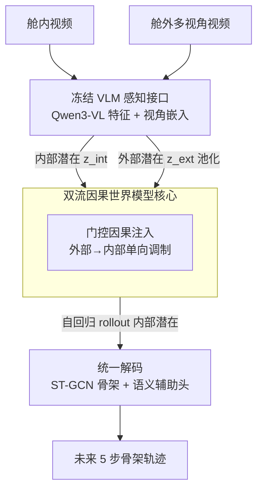

# Driver-WM: A Driver-Centric Traffic-Conditioned Latent World Model for In-Cabin Dynamics Rollout

**会议**: ECCV 2026  
**arXiv**: [2605.05092](https://arxiv.org/abs/2605.05092)  
**代码**: 有项目页（原文 Project page: Driver-WM，未给出完整 URL）  
**领域**: 自动驾驶 / 世界模型 / 驾驶员建模  
**关键词**: 驾驶员世界模型, 潜在动力学, 交通条件注入, 骨架轨迹预测, 因果 rollout

## 一句话总结
把「舱内驾驶员未来会怎么动」当成一个在潜在空间里、由舱外交通事件因果驱动的 rollout 问题来做：用冻结的 Qwen3-VL 特征当感知接口，双流分别编码交通和驾驶员，再用一个「门控因果注入」让外部环境单向调制驾驶员内部状态的自回归演化，最终解码成未来 5 步的人体骨架轨迹（外加行为/情绪语义作辅助正则），在 AIDE 上于安全攸关的高动态片段上取得稳健的长时预测。

## 研究背景与动机
当前量产的驾驶自动化大多停留在 SAE L2/L3，控制权在自动策略和人类监督之间反复切换，处于一种「共享控制」的混合自主状态。很多安全事故并不是因为系统看错了场景，而是因为人接管不及时——车做了一个动作（急刹、变道），驾驶员的反应跟不上或过度纠正。可现在的两套智能是割裂的：车外的「驾驶世界模型」（GAIA-1、DriveDreamer、Vista 这些）擅长预测道路和周车怎么演化，却把驾驶员当成一个事后才评估的风险来源，遵循的是「环境→动作」范式，压根不建模外部事件如何驱动驾驶员姿态、视线、运动准备度的内部演变；而车内的驾驶员监测系统（DMS）和 LLM 座舱助手又只做识别和对话——判断此刻是否分神/疲劳、或者理解意图，本质上把驾驶员当成一个被观测的实体，而不是一个随时间演化的动力系统。

这就留下一个空白：没有一个模型能预测「给定接下来的交通情境，驾驶员几秒内的身体和认知状态会怎么变、在假设性干预下又会怎么变」。这对 L2/L3 恰恰是要命的——安全设计不仅要预判环境演化，还要预判驾驶员的响应。矛盾在于，像素级的世界模型虽然视觉逼真，但把语义、几何、物理和低层渲染纠缠在一起，扩散迭代还慢、长时外推不稳；而潜在状态世界模型（LAW、World4Drive）虽然在压缩空间里预测很高效，却依然只建模外部场景，人始终不在预测状态里。

于是本文把驾驶员响应重新表述成一个「以交通为条件的 rollout」问题。**核心 idea：在由冻结 VLM 特征构成的紧凑潜在空间里，用双流分别表征交通与驾驶员，并通过一个单向的门控因果注入让外部驾驶事件驱动驾驶员内部潜在状态的自回归演化，最终解码为未来的人体骨架轨迹（而非像素），从而把「识别式的舱内监测」升级为「可 rollout、可干预分析的驾驶员动力学预测」。**

## 方法详解

### 整体框架
Driver-WM 要解决的是：给定舱内、舱外同步的一段观测（各 5 帧），预测驾驶员未来 5 帧的骨架姿态如何在交通情境驱动下演化。整条 pipeline 可以这样鸟瞰：同步的舱内视频和舱外多视角视频先各自过一个**冻结的 Qwen3-VL-2B**，抽成 2048 维的帧级特征并离线缓存（VLM 不进训练图，只当感知接口）；这些特征加上可学习的视角嵌入后，直接当作双流潜在状态——舱内一路是「内部潜在」$\mathbf{z}^{\text{int}}$，舱外多视角一路做均值池化成「外部潜在」$\bar{\mathbf{z}}^{\text{ext}}$。观测窗（前 5 步）用真值潜在初始化；预测窗（后 5 步）里，外部一路自回归往前推、只负责持续供给「环境条件」而不去重建未来街景，内部一路则在每一步被外部历史通过**门控因果注入**调制着往前滚。滚出来的内部潜在序列送进一个 **ST-GCN 骨架解码器**得到未来关键点轨迹（主任务），同时挂几个轻量语义头预测驾驶员行为/情绪、交通/车辆状态（仅作辅助正则）。全程严格因果：第 $t{+}1$ 步的更新只能看到 $\le t$ 的历史。

### 关键设计

**1. 驾驶员为中心的潜在动力学 rollout：把「人怎么反应」当成可预测的状态演化，而不是可识别的标签**

这一节直接针对「舱内智能只会识别、不会预测」的痛点。作者先把术语拧清楚：**dynamics（动力学）**指驾驶员内部状态在潜在空间里的时间演化，**kinematics（运动学）**才是解码出来的几何骨架轨迹；语义预测只是片段级正则，绝不作为时序条件输入。为什么选骨架而不是像素？因为骨架是「物理有依据、长时稳定、天然对齐舱内监督」的目标——生成像素既慢又会把语义几何物理和渲染纠缠在一起。具体地，模型采用「过去/未来」协议：总时长 $T=T_{\text{obs}}+T_{\text{pred}}$，前 $T_{\text{obs}}$ 步用真值潜在初始化，之后闭环滚动，且 rollout 损失只在未来窗上计算。内部状态的更新是一个「以外部为条件」的转移，用中文说就是「下一时刻的内部潜在，由到当前为止的内部历史和外部历史共同决定」。关键点在于外部一路的作用被限定得很干净——它只为驾驶员持续提供环境条件，而**不去显式重建未来交通场景**，这既省算力又避免了「预测街景」这个更难的副任务拖累主任务。

**2. 门控因果注入：让外部交通事件「单向、按需、守时序」地驱动内部状态**

这是全文最核心的设计，针对「外部事件如何驱动内部演化」这个建模难点。作者刻意不用对称融合（那样内外互相污染），而是强制两个归纳偏置：**时序因果**（$t{+}1$ 步只依赖 $\le t$ 的上下文）+ **单向耦合**（外部→内部，经一个显式门而非双向注意力）。机制上分三步：先用一个 Perceiver 式的轻量交叉注意力，从内部历史里生成一小组 query 去 attend 外部前缀，得到「外部到内部的上下文摘要」$\mathbf{m}_t$（因果性靠在每一步只喂 $\le t$ 的截断前缀天然保证，不需要显式 mask）；再用一个轻量转移预测器从当前内部潜在算出「若无外部影响的候选下一状态」$\tilde{\mathbf{z}}^{\text{int}}_{t+1}$；最后用一个**逐维向量门** $\mathbf{g}_t$ 在两者之间做加权融合。之所以要「向量门」而不是标量——因为外部驾驶事件对驾驶员的影响是不均匀的（有的维度该被环境强烈调制，有的该保持自身惯性），逐维门让模型自己学「哪些维度、什么时候该被外部注入多少」：

$$\mathbf{g}_t = \sigma\!\left(\mathrm{MLP}_g(\bar{\mathbf{z}}^{\text{ext}}_t)\right),\qquad \hat{\mathbf{z}}^{\text{int}}_{t+1} = (\mathbf{1}-\mathbf{g}_t)\odot\tilde{\mathbf{z}}^{\text{int}}_{t+1} + \mathbf{g}_t\odot\mathbf{m}_t.$$

这个门还带来一个漂亮的副产品：做**受控干预分析**时，可以用一个标量 $\lambda_{\text{CA}}$ 直接旁路学到的门（把融合权重强制设成常数），$\lambda_{\text{CA}}{=}0$ 就是完全切断注入、$\lambda_{\text{CA}}{=}1$ 是无调制强注入、$\lambda_{\text{CA}}{>}1$ 是过注入压力测试——从而能定量探测「外部通路到底有多必要、注入强度该怎么控」。消融证实：正是这个因果注入结构、而非概率正则，才是性能的主导因素。

**3. 冻结 VLM 状态接口 + 提示引导特征：用「视觉 grounded 的连续状态」而不是语言符号来 rollout**

这一点解决「感知从哪来、且不能作弊」。作者把 Qwen3-VL 当冻结骨干，只学轻量接口（类 BLIP-2 的固定编码器范式），默认用「恒等潜在接口」——即 VLM 特征加上视角嵌入后直接就是潜在状态，不再额外投影。两个讲究：其一，特征离线预抽并缓存、VLM 完全不进训练图，既降算力又稳优化，让学习聚焦在世界模型核心；其二，抽特征时给每帧配一个**固定文本提示**，明确要求编码器捕捉「外部交通线索 → 它们如何触发驾驶员运动响应 → 驾驶员行为在 1–2 秒内的短时演化」，把 VLM 从通用物体识别掰向「交互感知」的语义。为防标签泄漏，提示是静态的、且抽取过程不接触任何真值标注。与「让 VLM 吐离散符号」的路线不同，这里把 VLM 特征当**连续状态接口**，保证 rollout 依赖的是 grounded 的视觉感知而非语言先验。消融里「去掉提示的 no-prompt feat.」几何和语义指标同时明显变差，印证了这个提示接口的价值。

### 损失函数 / 训练策略
主任务是骨架回归 $\mathcal{L}_{\text{skel}}$（在归一化图像坐标上算，带逐关节置信度掩码处理遮挡）。为让长时 rollout 保持解剖/几何合理，加一组**物理先验** $\mathcal{L}_{\text{phys}}=\lambda_{\text{bone}}\mathcal{L}_{\text{bone}}+\lambda_{\text{smooth}}\mathcal{L}_{\text{smooth}}+\lambda_{\text{seat}}\mathcal{L}_{\text{seat}}$：骨长一致约束保持肢体边长、平滑项同时匹配一阶运动并压二阶抖动、可选的座舱 ROI 项防关节漂出合理边界。此外还有**潜在一致性** $\mathcal{L}_{\text{lat}}$（对未来内部 rollout 做直接匹配或速度匹配）和四个辅助语义头的交叉熵。总目标是这几项的加权和。默认是确定性转移（推理用高斯均值、方差置零），KL 瓶颈只在概率消融里开。训练细节：AIDE 官方划分（1884/405/609），HALPE-136 骨架（26 身体 + 68 面部 + 42 手部关节，手部对分析反应至关重要），Qwen3-VL-2B 冻结，AdamW（lr $5{\times}10^{-5}$、batch 32）约 80 epoch，模型选择以多步 MPJPE 为准。

## 实验关键数据

### 主实验
在 AIDE 上按 $5{\to}5$ 因果协议（观测 5 步、预测 5 步、约 3.3 Hz）评测，报告 horizon 平均的 MPJPE（px）、对角归一化 d-nMPJPE（%）、PCK@0.05，以及四个语义头的 Macro-F1。**HM（High-Motion）子集**是按未来窗真值运动分数排名取前 10%（60/609 片段、阈值 ≥72.05 px）的安全攸关高动态尾部。

| 模型 | All MPJPE↓ | All d-nMPJPE↓ | HM MPJPE↓ | DBR F1↑ | DER F1↑ | TCR F1↑ | VCR F1↑ |
|------|-----------|---------------|-----------|---------|---------|---------|---------|
| Zero-Velocity（拷贝上一帧） | **52.89** | **2.40** | 139.19 | 8.27 | 14.94 | – | – |
| MotionBERT（仅运动） | 73.51 | 3.34 | 141.53 | 56.70 | 52.71 | – | – |
| Static pooling（无 rollout） | 68.50 | 3.11 | 134.56 | 54.04 | 60.07 | 26.39 | 14.00 |
| Late fusion | 82.59 | 3.75 | 143.31 | 45.87 | 49.10 | 87.85 | 65.97 |
| Cross-Attn only | 80.14 | 3.64 | 142.41 | 62.52 | 68.75 | 87.94 | 69.09 |
| **Driver-WM (main)** | 71.47 | 3.24 | 138.03 | **68.07** | **72.61** | **90.15** | 68.34 |
| Non-causal (bidir，非因果上界) | 72.15 | 3.27 | 136.50 | 73.35 | 74.46 | 88.65 | 68.82 |

最关键的发现不是「谁的平均 MPJPE 最低」，而是作者揭示的**「惯性陷阱」**：Zero-Velocity 靠拷贝上一帧、利用自然驾驶片段以温和运动为主的惯性连续性，在全局 $\ell_2$ 型指标上刷出最低 d-nMPJPE，但这是欺骗性的——在安全攸关的高动态尾部，它的误差随预测步长急剧累积（如 $h{=}5$ 时 Driver-WM 155.82 px vs. 某基线 178.62 px）。Static pooling 同理，用「时不变的均值假设」在平均 $\ell_2$ 上占便宜，却根本产不出自回归轨迹、无法做长时退化分析或干预探测，且其外部 grounded 的 TCR F1 只有 26.39（几乎不会识别交通情境）。Driver-WM 则在保持有竞争力的平均误差的同时，于高动态尾部给出稳健的长时 rollout，并在同一冻结接口下语义对齐显著更好（DBR/DER/TCR F1 全面领先受控基线）。此外一个「风险排序」实验显示：仅用 Driver-WM 输出组合成的复合信号，排序 GT-HM 事件的 AUPRC 0.1785 vs. 仅运动的 0.1364（随机约 0.10，$p{=}0.0009$），说明结构化的驾驶员 rollout 能提供安全相关的风险线索。

### 消融实验

| 配置 | All MPJPE | HM MPJPE | DBR F1 | TCR F1 | 说明 |
|------|-----------|----------|--------|--------|------|
| Driver-WM (main) | 71.47 | 138.03 | 68.07 | 90.15 | 完整模型 |
| w/o ext context | 71.74 | 136.94 | 71.33 | **26.39** | 切断舱外流：外部 grounded 语义（TCR）崩塌 |
| RSSM/GRU dyn. | 78.42 | 136.46 | 67.15 | 88.26 | 换 GRU 式递归核：几何保真度明显下降 |
| +Skeleton-Pre | 70.92 | 136.04 | 69.55 | 88.33 | 预训练骨架解码器：增益有限 |
| KL bottleneck | 70.56 | 136.50 | 69.89 | 88.84 | 加概率正则：各指标仅微变 |
| no-prompt feat. | 76.54 | 142.08 | 68.88 | 76.87 | 去掉提示引导特征：几何+语义齐降 |

配合一张**受控干预表**更能看清机制（报告干预后 rollout 相对事实 rollout 的像素偏移，越大越敏感）：切断注入通路 $do(\lambda_{\text{CA}}{=}0)$ 造成最大偏移（All 89.6、$h{=}5$ 达 116.8、手部 95.7），强注入 $\lambda_{\text{CA}}{=}1$（偏移 26.7）和过注入 $\lambda_{\text{CA}}{=}2$（43.0）也都大幅扰动；完全移除外部特征 $do(\text{Ext}{=}\emptyset)$ 偏移 13.0（$h{=}5$ 时 +15.2 px），而大时间偏移和丢单个视角的偏移很小（0.79、0.42）。

### 关键发现
- **贡献最大的是门控因果注入结构**：干预表里禁用注入通路造成的偏移最大（尤其在末步 $h{=}5$ 和手部关节上），而加 KL 概率正则几乎不动指标——说明性能主导来自因果注入这个结构性设计，不是概率建模。
- **外部交通上下文对「外部 grounded 语义」是刚需**：切断舱外流后 TCR F1 从 90.15 崩到 26.39、VCR 从 68.34 到 14.00；虽然平均 MPJPE 因低动态片段占主导而看起来还行，但失去了环境触发信号，联合训练模型上做去外部干预会让 rollout 误差大增。
- **自注意力比递归核更适合长时条件 rollout**：换成 RSSM/GRU 后 All MPJPE 从 71.47 升到 78.42、几何保真度和语义一致性双降。
- **主增益不来自热启动骨架解码器**：+Skeleton-Pre 相对主模型只有边际改善，作者据此论证长时高动态误差主要源于「上下文条件化的内部转移」，而非空间解码能力——这也是为什么故意用轻量 ST-GCN 当解码头（时序动力学已在潜在核里解决，解码头只管空间投影）。
- **注入需要「学出来的、时变的」强度**：无调制的固定强注入（$\lambda_{\text{CA}}{\in}\{1,2\}$）也会破坏稳定性，印证向量门的必要性。非因果双向变体只是离线上界，不带来一致增益，反证因果建模是「部署一致」的合理偏置。

## 亮点与洞察
- **揭示并规避「惯性/均值回归陷阱」**：这篇最「啊哈」的地方是指出标准 $\ell_2$ 指标在自然驾驶数据上会奖励「拷贝上一帧」和「输出时间均值」这类退化解——因为数据被温和运动主导。它据此专门定义 HM 高动态尾部来做公平评测，这个 caveat 对任何做「以低动态为主的时序预测」的任务都有警示价值。
- **把「世界模型」的镜头从环境转向人**：绝大多数驾驶世界模型预测街景，本文反过来预测驾驶员——且把「外部如何塑造人的反应」显式参数化成单向门控注入，这个「外部→内部」的定向耦合思路可迁移到任何「环境驱动 agent 内部状态」的场景（如人机协作、外骨骼）。
- **门即是分析工具**：向量门 $\mathbf{g}_t$ 平时是性能组件，测试时用标量 $\lambda_{\text{CA}}$ 旁路后又变成「因果探针」，能做 $do(\cdot)$ 式干预并定量读出敏感度——一套结构兼顾性能与可解释性，很巧妙。
- **冻结 VLM + 提示当连续状态接口**：不让 VLM 吐符号、而是把其特征当 grounded 的连续状态，再用固定提示把编码器掰向「交互感知」——既避免语言先验污染 rollout，又用离线缓存换来训练稳定和低算力，是可复用的「基础模型当感知接口」工程范式。

## 局限与展望
- **只在 AIDE 单一 benchmark、5→5 短时窗上验证**：预测窗仅 1.5 秒（5 帧、3.3 Hz），更长时程、更多数据集/车型上的泛化未知；HM 子集也只有 60 个片段，尾部评测样本偏少。
- **产出的是「线索」而非「决策」**：作者明确 Driver-WM 不输出规划动作，只给短时驾驶员响应 rollout 供下游风险模块用；要真正落地做接管时机分析/HMI 适配，还需配合标定的车辆状态和下游验证——这条链路本文没打通。
- **图像平面 2D 骨架的度量局限**：预测量是图像平面坐标，转成车体/ROI 坐标或度量 3D 需要相机标定或单目提升/深度传感器，作者把 3D 版本和 $\mathcal{L}_{\text{seat}}$ 细节都放进了补充材料，正文未充分展开。
- **干预只作机制探针、不做因果效应估计**：作者审慎声明 $do(\cdot)$ 干预不构成因果效应主张，所以「外部到底多大程度因果驱动驾驶员」仍是定性结论。
- **依赖教师检测的骨架真值**：HALPE-136 关键点来自 teacher，遮挡/低置信靠掩码处理，标注噪声对高动态尾部的影响未系统分析。

## 相关工作与启发
- **vs 驾驶世界模型（GAIA-1 / DriveDreamer / Vista / LAW / World4Drive）**: 它们预测外部环境（像素或潜在场景演化），把人当事后风险源；本文预测驾驶员内部动力学、并以交通为因果条件。像素派视觉逼真但语义几何物理纠缠、扩散慢且外推不稳；潜在派（LAW/World4Drive）高效但仍不建模人。Driver-WM 的差异是「driver-centric + 骨架 rollout（解耦人体运动与视觉外观）+ 外部→内部显式耦合」。
- **vs 驾驶员监测/座舱（DMS、Drive&Act、AIDE、MMTL-UniAD、DriveLM）**: 它们做离散状态识别或对话/意图理解，把驾驶员当被观测实体、只给瞬时告警；本文把驾驶员当动力系统做多步 rollout，且强调「预测结构化响应（姿态/手部/时序）比预测一个标量接管时间更有用」——因为同样接管时间的两个人行为可能天差地别。
- **vs 人体运动预测（SiMLPe、MotionBERT、Waymo-3DSkelMo）**: 它们从历史运动预测未来骨架，SiMLPe/MotionBERT 证明紧凑架构/可迁移表示能抓运动学先验；但舱内驾驶员运动此前多被当作孤立估计、不显式条件化于舱外交通。本文显式参数化「舱外事件→驾驶员运动」的定向耦合，把交通条件下的响应表述成潜在动力学再解码成连续骨架，正好补上「分类式监测」和「无条件运动预测」之间的空白。

## 评分
- 新颖性: ⭐⭐⭐⭐⭐ 首次把「驾驶员内部动力学」做成以交通为因果条件的潜在世界模型 rollout，视角转换和门控因果注入都很新
- 实验充分度: ⭐⭐⭐⭐ 主表/消融/干预/多 seed 齐全且揭示了惯性陷阱，但仅 AIDE 单数据集、短时窗、HM 样本少
- 写作质量: ⭐⭐⭐⭐⭐ 术语（dynamics/kinematics、internal/external）拧得很清，惯性陷阱和干预分析讲得透彻，附录补全严谨
- 价值: ⭐⭐⭐⭐ 为 L2/L3 共享控制提供了「驾驶员响应预测」这一缺失接口，但离下游规划/HMI 落地还有验证距离

<!-- RELATED:START -->

## 相关论文

- [\[ECCV 2026\] UniDrive-WM: Unified Understanding, Planning and Generation World Model for Autonomous Driving](unidrive-wm_unified_understanding_planning_and_generation_world_model_for_autono.md)
- [\[ICLR 2026\] Bird's-eye-view Informed Reasoning Driver (BIRDriver)](../../ICLR2026/autonomous_driving/birds-eye-view_informed_reasoning_driver.md)
- [\[CVPR 2026\] DriverGaze360: OmniDirectional Driver Attention with Object-Level Guidance](../../CVPR2026/autonomous_driving/drivergaze360_omnidirectional_driver_attention_with_object-level_guidance.md)
- [\[CVPR 2026\] SparseWorld-TC: Trajectory-Conditioned Sparse Occupancy World Model](../../CVPR2026/autonomous_driving/sparseworld_tc_trajectory_conditioned_sparse_occupancy_world_model.md)
- [\[ICCV 2025\] Where, What, Why: Towards Explainable Driver Attention Prediction](../../ICCV2025/autonomous_driving/where_what_why_towards_explainable_driver_attention_prediction.md)

<!-- RELATED:END -->
