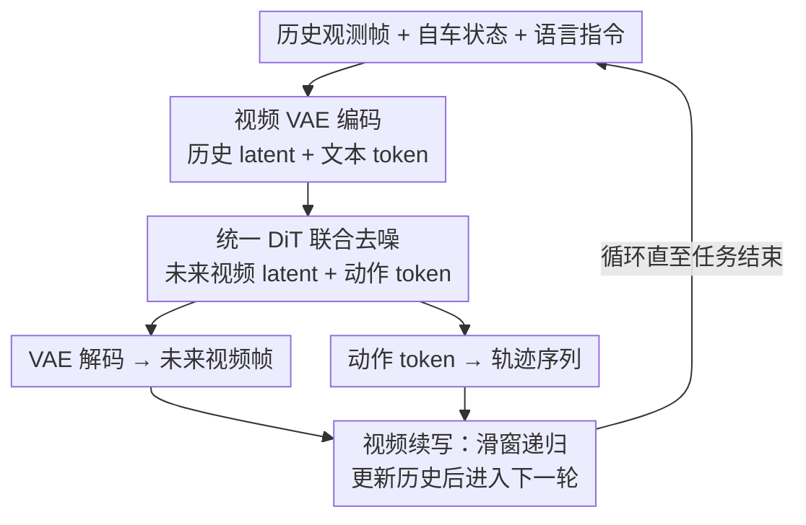

# DriveVA: Video Action Models are Zero-Shot Drivers

**会议**: ECCV 2026  
**arXiv**: [2604.04198](https://arxiv.org/abs/2604.04198)  
**代码**: 无  
**领域**: 自动驾驶 / 世界模型  
**关键词**: 视频动作模型, 端到端自动驾驶, 世界模型, 零样本泛化, 流匹配

## 一句话总结
DriveVA 提出一种统一的视频-动作世界模型，将未来视频预测与轨迹规划放在同一个 DiT 扩散生成过程中联合解码，利用大规模视频生成模型（Wan2.2-TI2V-5B）的时空先验实现强零样本跨域泛化，在 NAVSIM 上达到 90.9 PDMS，并在 nuScenes 和 Bench2Drive 上分别降低 78.9% 和 52.5% 的平均 L2 误差与 83.3% 和 52.4% 的碰撞率。

## 研究背景与动机
自动驾驶的核心挑战之一是泛化——模型不仅要在训练场景中表现良好，还必须在未见过的交通模式、道路布局和传感器配置下保持鲁棒。近年来 Vision-Language-Action (VLA) 模型通过在大规模视觉-语言模型上微调驾驶轨迹数据，在一定程度上减少了对任务特定数据的需求。然而，VLA 的预训练基于静态图像-文本对，主要传递语义知识（"什么是什么"），却缺乏规划所需的时空因果先验（"世界如何运动"），导致真正的零样本跨数据集泛化仍然受限。

另一方面，大规模视频生成模型（如 Wan、CogVideoX、HunyuanVideo）在海量视频语料上学习到了逼真的运动模式和物理合理的场景动态，展现出对未见文本和视觉上下文的强泛化能力。这一能力与构建可泛化驾驶世界模型的目标高度契合。然而，现有基于世界模型的规划方法存在两个核心瓶颈：其一，在单一数据集上学到的世界知识难以有效迁移到其他数据集，泛化能力有限；其二，视频想象和轨迹生成通常被分开建模或仅松散耦合——视觉预测用一个模型、轨迹规划用另一个（或作为一个辅助分支），导致视觉预测与规划行为之间的不一致随时间累积，执行的轨迹可能偏离世界模型所预测的未来演化。

本文的核心矛盾在于：视频生成模型有丰富的时空先验但不会规划，驾驶世界模型需要规划但缺乏泛化能力。DriveVA 的核心 idea 是：将未来视频 latent 和动作 token 放在同一个共享的 DiT 生成过程中联合去噪，使轨迹成为对未来场景演化的"动作锚定"（action grounding），从而在统一的生成框架中同时获得视频生成的泛化能力和规划的决策能力。

## 方法详解

### 整体框架
DriveVA 的目标是：给定历史观测帧、语言指令和当前自车状态，同时预测未来动作序列（轨迹）和未来视频帧。整个流程分三个阶段：(1) 历史 $m$ 帧观测通过 Wan2.2-TI2V-5B 的 3D 因果 VAE 编码为历史 latent 序列 $\mathcal{V}_l^{\text{his}}$；(2) 语言指令经冻结的文本编码器编码后，通过交叉注意力注入 DiT；(3) 一个统一的 DiT 解码器以历史 latent 和自车状态 token 为固定条件块 $\mathbf{X}_{\text{cond}}^{(l)}$，从纯噪声出发联合去噪生成未来视频 latent 和动作 token（目标块 $\mathbf{Y}_0^{(l)} = [\mathbf{V}'_{l+1}, \ldots, \mathbf{V}'_{l+n_{\text{pred}}}, \mathbf{A}_{l+1:l+K}]$）。训练和推理接口完全一致：训练时将完整视频的 latent 分为条件块（噪声自由）和目标块（加噪重建），推理时仅编码历史、从噪声生成未来。推理仅需 2 步流匹配采样，执行动作后滑窗移动历史缓冲，递归进行视频续写。

### 关键设计

**1. 统一视频-动作联合生成：让轨迹成为未来视觉的动作锚定**

现有方法（PWM、Epona、DriveVLA-W0）通常将视频预测和轨迹生成作为两个独立或松耦合的阶段处理：先用一个模型预测未来视频，再用另一个模型（如逆动力学模型）从预测视频中提取轨迹，或将视频预测作为辅助分支加在规划模型旁边。这种级联设计的根本问题是视觉想象和规划行为之间缺乏深层交互——DiT 的自注意力层在去噪时看不到"另一边"的信息，导致轨迹可能与生成的视频场景不一致，误差在递归 rollout 中逐步累积。

DriveVA 的核心设计是将未来视频 latent token 和动作 token 拼接为同一个目标块，在 DiT 的自注意力层中让两者在去噪的每一步都双向交互。形式化地，给定条件 $\mathbf{C}_l = (\mathcal{O}_l, \mathcal{T}, \mathbf{q}_l)$，联合分布可分解为视频续写与动作锚定的乘积：

$$\pi_\theta(\mathcal{F}, \mathcal{A} \mid \mathbf{C}_l) = \pi_\theta(\mathcal{F} \mid \mathbf{C}_l) \cdot \pi_\theta(\mathcal{A} \mid \mathbf{C}_l, \mathcal{F})$$

但 DriveVA 不做级联——它在同一个 DiT 中同时对 $\mathcal{F}$ 和 $\mathcal{A}$ 的 latent token 去噪，self-attention 使视觉模态和动作模态在生成过程中持续交换信息。这意味着轨迹不是"看完视频后再推断的"，而是在视频生成过程中就作为场景演化的内在约束一同产生的。

消融实验证明这一设计是性能的核心支柱：将联合生成改为仅预测动作（action-only），PDMS 从 90.9 暴跌至 47.0，说明未来视频预测不只是辅助可视化输出，而是为动作 token 提供了稠密的时序锚定。同时，将目标块内部的注意力从双向改为因果掩码（causal mask，禁止动作 token 关注未来视频 token），PDMS 也从 90.9 降至 90.1，说明即便条件块保持噪声自由，目标块内部的跨模态双向交互仍有额外收益。

**2. 视频续写策略：滑窗递归保持长时一致性**

自动驾驶需要在长时间范围内持续规划，但一次性生成过长视频既不现实（计算开销大、质量随长度下降）也会引入累积漂移。DriveVA 采用视频续写策略：每次预测 $K=8$ 步动作（覆盖 4 秒）和 $N=8$ 帧未来视频后，执行动作、获取新观测，将历史缓冲窗口向前滑动，用最新观测帧作为下一轮的条件继续生成。

训练时，对每个完整视频片段，VAE 编码后同时获得历史 latent $\mathcal{V}_l^{\text{his}}$（条件块，不加噪）和未来 latent $\mathcal{V}_l^{\text{fut}}$（目标块，加噪重建）。推理时仅编码历史观测 $\mathcal{O}_l$ 得到 $\mathcal{V}_l^{\text{his}}$，DiT 从纯噪声生成未来，实现了训练和推理接口的完美对齐。滑窗递归将长时预测的难度分解为一系列短视频续写问题，使模型始终看到足够的历史上下文（$m=44$ 帧，约 2 秒）来保持场景一致性。

消融实验中，去掉视频续写（不在递归 rollout 中保持视频-动作耦合）导致 PDMS 从 90.9 降至 84.6，验证了续写策略对长期一致性的关键作用。

**3. 大规模视频预训练先验迁移：Wan2.2-TI2V-5B 全量微调**

DriveVA 的成功在很大程度上依赖于 Wan2.2-TI2V-5B 大规模视频生成模型的预训练先验。Wan 在海量视频数据上学习了丰富的运动动态和物理合理性先验，这些先验正是 VLA 模型（预训练于静态图像-文本）所缺乏的。DriveVA 在 Wan 基础上做全量微调，将这些通用视频先验适配到驾驶域的视频续写和联合动作锚定任务。

训练策略消融清晰展示了预训练先验和微调深度的价值：从头训练仅得 62.9 PDMS，LoRA 微调得 74.9 PDMS，而全量微调达到 90.9 PDMS。即便将模型扩大到 14B，仅用 LoRA 也只达到 80.6 PDMS，表明在这个任务上全量微调中型模型比增加参数规模更重要——视频先验需要深度调整全部参数才能有效迁移到驾驶规划任务。

### 一个完整示例

以 NAVSIM 中的一个左转场景为例走通 DriveVA 的推理流程：

1. 当前时刻 $l$，历史缓冲包含 44 帧历史观测（前 2 秒 @ 22FPS），语言指令为"左转"，自车速度为 $(v_x, v_y)$。
2. Wan2.2 VAE 编码历史帧为条件 latent $\mathcal{V}_l^{\text{his}}$，与自车状态 token $\mathbf{S}_l$ 拼接为条件块 $\mathbf{X}_{\text{cond}}^{(l)}$。
3. 目标块初始化为纯噪声，包含 8 帧未来视频 latent（对应 4 秒）和 8 个动作 token（每步 $(x, y, \text{yaw})$）。文本 token $\mathbf{T}$ 通过交叉注意力注入 DiT 各层。
4. DiT 在 2 步流匹配采样中联合去噪：噪声 $\to$ 第一步积分至 $s=0.5$ 的中间态 $\to$ 第二步积分至 $s=1$ 的干净目标。单次推理约 0.1 秒。
5. VAE 解码器将未来视频 latent 还原为 $832 \times 480$ 的 8 帧未来图像；动作 token 经 MLP 还原为轨迹。
6. 执行轨迹，获取新观测，历史缓冲窗口前移，重复步骤 1-5。整个 15 秒场景中约生成 4 段视频续写，每段预测的转弯轨迹与生成的左转场景演化保持一致。

### 损失函数 / 训练策略

DriveVA 采用条件流匹配作为训练目标。对每个训练样本 $l$，从目标块 $\mathbf{Y}_0^{(l)}$（包含未来视频 latent 和动作 token）出发，采样流时间 $s \sim \mathcal{U}(0,1)$ 和噪声 $\boldsymbol{\epsilon} \sim \mathcal{N}(\mathbf{0}, \mathbf{I})$，构造线性插值 $\mathbf{Y}^{(l,s)} = (1-s)\boldsymbol{\epsilon} + s\mathbf{Y}_0^{(l)}$，目标速度为 $\dot{\mathbf{Y}}^{(l,s)} = \mathbf{Y}_0^{(l)} - \boldsymbol{\epsilon}$。损失函数为：

$$\mathcal{L}_{\text{FM}} = \mathbb{E}_{l, s, \mathbf{Y}_0^{(l)}, \boldsymbol{\epsilon}} \left[ \left\| \hat{\mathbf{v}}_\theta^{(l,s)} - \dot{\mathbf{Y}}^{(l,s)} \right\|_2^2 \right]$$

其中 $\hat{\mathbf{v}}_\theta^{(l,s)} = f_\theta([\mathbf{X}_{\text{cond}}^{(l)}, \mathbf{Y}^{(l,s)}], s \mid \mathbf{T})$ 是 DiT 预测的速度场，同时作用于视频 latent 和动作 token 两部分，迫使模型在去噪中学习两者的联合分布。训练采用 AdamW（$lr=10^{-4}$，weight decay=0.01，bf16 混合精度），分两阶段：先 batch size 80 训练 20k 步快速收敛，再梯度累积至等效 batch size 640 精调 10k 步，前 1k 步线性 warmup 后恒定学习率。推理仅需 2 步流匹配采样。

## 实验关键数据

### 主实验（NAVSIM v1）

| 方法 | 输入 | NC↑ | DAC↑ | TTC↑ | Comf.↑ | EP↑ | PDMS↑ |
|------|------|-----|------|------|--------|-----|-------|
| Constant Velocity | - | 68.0 | 57.8 | 50.0 | 100 | 19.4 | 20.6 |
| Ego Status MLP | - | 93.0 | 77.3 | 83.6 | 100 | 62.8 | 65.6 |
| UniAD (CVPR'23) | Camera | 97.8 | 91.9 | 92.9 | 100 | 78.8 | 83.4 |
| DiffusionDrive (CVPR'25) | Camera+Lidar | 98.2 | 96.2 | 94.7 | 100 | 82.2 | 88.1 |
| LAW (ICLR'25) | Camera | 96.4 | 95.4 | 88.7 | 99.9 | 81.7 | 84.6 |
| Epona (ICCV'25) | Camera | 97.9 | 95.1 | 93.8 | 99.9 | 80.4 | 86.2 |
| PWM (NeurIPS'25) | Camera | 98.6 | 95.9 | 95.4 | 100 | 81.8 | 88.1 |
| WoTE (ICCV'25) | Camera+Lidar | 98.5 | 96.8 | 94.9 | 99.9 | 81.9 | 88.3 |
| DriveVLA-W0 (ICLR'26) | Camera | 98.4 | 95.3 | 95.2 | 100 | 80.9 | 87.2 |
| **DriveVA** | Camera | **99.2** | **97.5** | **98.7** | **100** | **83.5** | **90.9** |

### 零样本跨域泛化（NAVSIM 训练，直接评测）

| 方法 | nuScenes Avg L2↓ | nuScenes Avg CR↓ | Bench2Drive Avg L2↓ | Bench2Drive Avg CR↓ |
|------|-------------------|-------------------|----------------------|----------------------|
| DriveVLA-W0 | 1.43 | 0.77 | 3.00 | 2.52 |
| PWM | 3.99 | 0.36 | 2.80 | 3.76 |
| **DriveVA** | **0.84** | **0.06** | **1.33** | **1.79** |

### 消融实验

| 配置 | Video Loss | Carla Mix | Video Cont. | NC↑ | DAC↑ | TTC↑ | EP↑ | PDMS↑ |
|------|-----------|-----------|-------------|-----|------|------|-----|-------|
| 无视频监督 | ✗ | ✓ | ✓ | 95.0 | 89.0 | 93.9 | 59.7 | 71.4 |
| 无 Carla 混合 | ✓ | ✗ | ✓ | 99.0 | 97.3 | 98.4 | 83.2 | 90.5 |
| 无视频续写 | ✓ | ✓ | ✗ | 94.9 | 95.6 | 94.2 | 76.9 | 84.6 |
| **完整模型** | ✓ | ✓ | ✓ | **99.2** | **97.5** | **98.7** | **83.5** | **90.9** |

### 关键发现
- **视频监督是增益的主要驱动力**：去掉 Video Loss 后 PDMS 从 90.9 骤降至 71.4（-19.5），远超其他任何消融项。视频级稠密时序监督为动作 token 提供了关键的世界动态锚定，而非仅仅是一个辅助损失。
- **仅需 2 步采样即达最优**：1 步仅 13.2 PDMS，2 步达 90.9，3 步无额外增益。视频预训练先验使去噪起点已接近数据分布，极大降低了推理开销，使生成式规划在自动驾驶中具备实用可行性。
- **视频预测帧数存在最优值**：8 帧未来视频（覆盖 4 秒）PDMS 最高（90.9），4 帧降至 82.1（覆盖不足），12 帧降至 86.7（漂移增加）。
- **全量微调远优于 LoRA**：从头训练 62.9、LoRA 74.9、全量微调 90.9 PDMS。14B 模型用 LoRA 也仅 80.6，说明在这个任务上全量微调中型模型比增加参数规模更重要。
- **零样本能力来自视频-轨迹一致性的保持**：定性分析（图 3）显示，PWM 在零样本场景中常出现视频想象（左转）与轨迹（直行）的不一致，而 DriveVA 始终维持两者对齐，这是跨域泛化能力的直接来源。

## 亮点与洞察
- **"视频预测不是辅助输出，而是规划的锚定"这一实验发现非常有价值**：很多工作把视频预测当成锦上添花的可视化辅助，DriveVA 通过消融实验（去掉视频损失 PDMS 骤降 19.5）有力地证明了视频预测本身就是规划能力的关键来源——它为动作提供了稠密的时序锚定，而非一个可有可无的附加项。
- **流匹配的极低采样步数（2 步）使生成式规划真正实用**：扩散/流匹配方法常因推理开销大而被诟病不适合实时系统，但 DriveVA 发现视频预训练先验使去噪起点已接近数据分布，2 步即可收敛，为生成式世界模型在自动驾驶中的实时部署铺平了道路。
- **统一的联合去噪设计可迁移到其他多模态对齐任务**：将视觉预测和行为生成放在同一个 DiT 中双向交互的思路，可推广到机器人操作（视频+动作联合预测）、具身导航（视觉+控制联合生成）等场景，解决视觉想象与行为规划之间的不一致问题。
- **DPVO 作为外部验证工具评价视频-轨迹一致性很有启发性**：独立运行视觉里程计从生成视频中重建轨迹并与模型预测轨迹比较，这一无需 ground truth 的一致性评估方法可以推广到其他世界模型的评测中，为"生成视频是否可信"提供了可量化的答案。

## 局限与展望
- **因果/意图层面的错误无法通过视频-轨迹一致性解决**：论文展示的失败案例（该绕行时保守停车、该通过路口时预测停止）表明，当模型对未来场景的意图判断本身出错时，视频和轨迹会一致地错——方向对但决策错。这要求未来工作不仅关注视觉-动作的对齐，还要提升模型的因果场景理解和多模态未来推理能力。
- **仅使用前视单目摄像头**：当前版本只用前视输入，未利用多视角、激光雷达或高清地图等额外信息。结合多模态输入可能进一步提升安全性关键指标（如 NC、TTC），尤其是在遮挡或极端光照条件下。
- **闭环评估有限**：Bench2Drive Dev10 的闭环测试仅含少量路线，完整 Bench2Drive 闭环评测缺失，且 NAVSIM 本身是开环 PDM 评测，真实闭环性能有待更充分的验证。
- **从真实到模拟的 reality gap 依然显著**：Bench2Drive 上碰撞率 1.79% 远高于 nuScenes 上的 0.06%，说明从真实日志到 CARLA 模拟器之间在表观、动态和 agent 交互行为层面仍存在显著差异，零样本跨域仍有提升空间。

## 相关工作与启发
- **vs PWM / Epona / DriveVLA-W0（基于世界模型的规划方法）**：这些方法将视频预测和轨迹生成作为独立或松耦合模块处理，视频-动作不一致是共性问题。DriveVA 的核心创新在于将两者统一到一个共享生成过程中联合去噪，从根本上消除了不一致，实验显示这一设计带来了显著的零样本泛化增益。
- **vs VLA 方法（DriveMoE / OpenDriveVLA）**：VLA 依赖视觉-语言模型的静态语义先验，通过构造 corner case 数据或专家分工提升鲁棒性。DriveVA 选择了根本不同的路径——从视频生成模型继承时空动态先验，在零样本泛化上展现了质的飞跃（nuScenes 上无需微调即超越全量微调的 SOTA 方法）。
- **vs LAW / AdaWM / World4Drive（隐式世界模型）**：这些方法在紧凑的 latent 空间学习动态用于规划，不生成显式视频。DriveVA 选择显式生成未来视频，获得的优势是可以用 DPVO 等外部工具独立验证视觉-轨迹一致性，且视频级稠密监督为规划提供了更丰富的学习信号。
- **vs VaViM/VaVAM（视频动作模型）**：VaViM 同样探索了用视频扩散模型做驾驶，但 DriveVA 更进一步将视频和动作放在同一个 DiT 中联合生成（而非分开或在后处理中对齐），并深入研究了数据规模和多样性如何影响泛化，给出了明确的消融证据。

## 评分
- 新颖性: ⭐⭐⭐⭐ 将视频-动作联合生成引入自动驾驶世界模型的核心思路新颖且有洞察；但流匹配和 DiT 架构本身是已有技术，核心贡献在"组合与适配"层面而非基础方法创新。
- 实验充分度: ⭐⭐⭐⭐⭐ NAVSIM + nuScenes + Bench2Drive 三基准跨域零样本评测、多维度消融（视频监督/续写/Carla 混合/采样步数/预测帧数/训练策略/模型规模/掩码策略）、DPVO 外部一致性验证，实验设计全面且有说服力。
- 写作质量: ⭐⭐⭐⭐⭐ 问题动机清晰、方法描述翔实、实验逻辑严密、图表丰富，矛盾驱动型叙事让读者对"为什么这样做"有清晰的理解。
- 价值: ⭐⭐⭐⭐⭐ 视频预测不是辅助输出而是规划锚定这一核心发现、极低采样步数使生成式规划实用化、强零样本泛化能力，对自动驾驶世界模型方向有重要推动价值。

<!-- RELATED:START -->

## 相关论文

- [\[ECCV 2026\] FrozenDrive: Zero-Shot Text-Guided Driving Scene Generation and Data Augmentation](frozendrive_zero-shot_text-guided_driving_scene_generation_and_data_augmentation.md)
- [\[CVPR 2025\] Zero-Shot 4D Lidar Panoptic Segmentation](../../CVPR2025/autonomous_driving/zero-shot_4d_lidar_panoptic_segmentation.md)
- [\[ECCV 2026\] OmniNWM: Omniscient Driving Navigation World Models](omninwm_omniscient_driving_navigation_world_models.md)
- [\[ICLR 2026\] Discrete Diffusion for Reflective Vision-Language-Action Models in Autonomous Driving](../../ICLR2026/autonomous_driving/discrete_diffusion_for_reflective_vision-language-action_models_in_autonomous_dr.md)
- [\[ECCV 2026\] DriveWeaver: Point-Conditioned Video Inpainting for Controllable Vehicle Insertion in Autonomous Driving Simulation](driveweaver_point-conditioned_video_inpainting_for_controllable_vehicle_insertio.md)

<!-- RELATED:END -->
