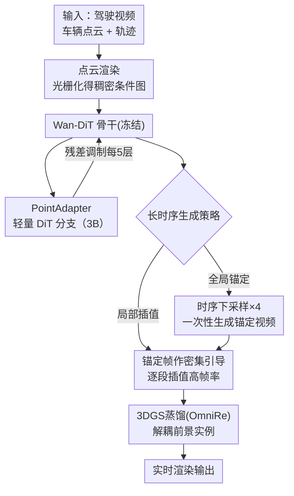

# DriveWeaver: Point-Conditioned Video Inpainting for Controllable Vehicle Insertion in Autonomous Driving Simulation

**会议**: ECCV2026  
**arXiv**: [2606.31918](https://arxiv.org/abs/2606.31918)  
**代码**: [https://github.com/LogosRoboticsGroup/DriveWeaver](https://github.com/LogosRoboticsGroup/DriveWeaver)  
**领域**: 自动驾驶  
**关键词**: 自动驾驶仿真, 视频修补, 点云条件, 车辆插入, 扩散模型

## 一句话总结

DriveWeaver 提出以车辆点云渲染图为像素级条件的视频扩散修补框架，通过轻量 PointAdapter 将几何条件注入冻结的 Wan2.1 差分变换器骨干，生成光照融合一致且几何精确的前景车辆，并设计全局-局部分层修补策略消除长时序漂移，生成结果可进一步蒸馏为 3D 高斯泼溅实现实时渲染。

## 研究背景与动机

自动驾驶仿真需要在录制的真实场景中插入可控的前景车辆，以构造罕见的长尾 corner case 来测试和提升驾驶模型。当前主流方法大致分两条路线：一是从 3DRealCar 等大规模数据集中预重建 3D 车辆资产库（如 HUGSIM），再将资产按轨迹组合渲染到场景中——这类渲染方式虽能保持车辆的刚性几何结构，但插入车辆与环境始终存在光照风格差异，且每一辆插入的车辆都需要人工从资产库中筛选光照匹配的型号，再额外合成阴影来弥合差距，流程极度依赖人工干预，难以跨场景大规模推广。二是利用扩散模型作为感知评估器，通过可微分渲染和反向优化端到端调整光照参数（如 UrbanCAD、RealEngine）——这类方法针对每个场景都需要单独优化，同时依赖昂贵的 CAD 网格资产，计算开销巨大，同样不适合大规模部署。两条路线的共同瓶颈在于：要么依赖稀缺的高质量预重建资产，要么计算成本过高，都缺少一种低成本、即插即用、跨数据集泛化的车辆插入手段。

本文的核心洞察是：与其依赖昂贵的 3D 网格或预重建资产，通过激光雷达获取的车辆点云本身就是天然低成本、易获取的几何条件——但点云是稀疏的，直接投影到图像平面会产生大量空洞，无法直接作为视频修补模型的精确引导。**核心 idea：提出点云渲染技术将稀疏车辆点云光栅化为稠密像素级条件图，以低成本点云驱动视频扩散修补模型，实现高保真、几何一致的车辆插入，并通过全局-局部分层策略消除自回归长时序漂移，生成结果可进一步蒸馏为 3DGS 表示，在仿真中实现实时渲染。**

## 方法详解

### 整体框架

DriveWeaver 基于 Wan2.1 VACE-14B 视频扩散模型构建，其骨干差分变换器（DiT）和 3D VAE 均被完全冻结，仅引入一个轻量级的 PointAdapter DiT 分支来注入几何条件。输入一段多帧驾驶视频、实例车辆点云和目标轨迹后，系统首先执行点云渲染：将 LiDAR 点的稀疏投影通过光栅化为每个点赋予固定半径，生成稠密的像素级点云条件图和对应掩码，同时根据 3D 包围盒投影生成需修补的区域掩码。然后 PointAdapter 将点云条件图、背景 RGB、修补掩码和点云掩码四者的通道拼接作为输入，编码后注入每第 5 个 Wan-DiT block 的特征空间（残差方式），驱动骨干网络在指定区域修补生成前景车辆。推理采用两级策略：全局锚定阶段对 4 倍下采样的稀疏序列一次性生成低帧率锚定视频，确立全局一致的车辆身份和环境光照；局部插值阶段以锚定帧为密集引导，逐段填充高帧率细节。最终，生成结果通过城市重建管线 OmniRe 蒸馏为解耦的 3DGS 表示，可在仿真管线中绕过扩散模型实现实时渲染。

### 关键设计

**1. 点云渲染：以低成本稀疏点云构造稠密像素级条件**

现有方法依赖资产库或 CAD 网格，获取成本高、泛化差。DriveWeaver 改用车辆实例点云作为几何条件——每帧先将 LiDAR 点投影到校准的图像平面并着色（通过查询对应像素值），再用 3D 包围盒提取每个车辆实例的点云后，聚合到规范坐标系；根据目标位姿和相机位姿变换所有实例点云，在时序窗口内累积后投影到图像平面。关键技巧在于：直接投影会留下大量空洞和遮挡区域，因此对每个点赋予固定半径后执行点光栅化，生成稠密的像素级条件图。与此同时，用 3D 包围盒投影生成修补目标区域掩码（reactive area），标记哪些像素需要重新生成、哪些保持原样。这种设计的巧妙之处在于：模型只需在点云指示的几何「骨架」上自由发挥纹理和光照，天然实现了几何精确性约束与外观生成自由度的解耦，且任何来源的点云（跨数据集、甚至非 LiDAR 点云）都可直接作为条件输入，使模型在推理时具备跨数据集泛化能力。

**2. PointAdapter：冻结大模型、轻量残差注入几何条件**

直接将 Wan 骨干的全部 14B 参数在有限的自动驾驶数据上全面微调会导致灾难性遗忘——消融实验显示 FVD 从 22.46 翻倍至 62.59，预训练学到的海量纹理和运动知识被少量仿真数据冲刷殆尽。为此，DriveWeaver 设计了轻量 PointAdapter 分支：一个约 3B 参数的独立 DiT 网络，保持与 Wan-DiT 相同的 token 维度但层数大幅减少。输入处理分为两路，点云条件图和背景 RGB 图通过 3D VAE 编码为潜在特征，两路掩码经 reshape 和插值对齐到相同的潜在分辨率，然后沿通道维度拼接。每个 PointAdapter block 与每第 5 个 Wan-DiT block 配对，其输出通过线性投影以残差方式注入骨干特征空间。这种残差调制机制让几何引导逐层作用于主干网络，同时冻结预训练权重，仅用约 1/5 的可训练参数就实现了高质量的条件生成，训练仅需 20k 步（5 天，8×H200）。

**3. 全局-局部分层修补：非自回归消除长时序漂移**

视频扩散模型单次能生成的帧数受显存限制（Wan2.1 最多 49 帧），而自动驾驶轨迹常横跨数百帧（本文基准设为 193 帧）。传统滑动窗口/自回归方法以前一段末帧作下一段的条件，这种马尔可夫依赖会随时间累积误差，导致车辆外观逐渐漂移、形状变形。DriveWeaver 的策略是解耦全局一致性与局部细节：首先对原时序 4 倍下采样（193→49 帧），使完整时间范围恰能被模型单次前向覆盖，生成粗粒度的锚定视频——这一步建立全局一致的车辆身份、光照和姿态；然后将原高帧率时序均分为 4 段，每段以对应的锚定帧（而非稀疏点云）作为密集引导条件，执行局部高帧率修补。模型在双模式下训练：GT-Free 模式仅依赖稀疏点云条件生成（供全局锚定阶段使用），GT-Aware 模式以真值帧为监督学习局部插值（供局部插值阶段使用）。该策略将 FVD 从自回归的 29.41 降至 22.46，同时生成的视频因时序一致性极佳，能直接满足下游 3DGS 重建对几何一致性的苛刻要求。

## 实验关键数据

### 主实验结果（Waymo 数据集，短时序 + 长时序）

| 方法 | FID↓ | FVD↓ | LPIPS↓ | PSNR↑(几何) | SSIM↑(几何) |
|------|------|------|--------|-------------|-------------|
| HUGSIM (资产库组合) | 49.06 | 325.89 | 0.304 | 36.05 | 0.973 |
| StreetCrafter (点云生成) | 26.88 | 295.06 | 0.294 | 30.31 | 0.878 |
| Wan2.1 VACE (蒙版修补基线) | 54.67 | 264.74 | 0.171 | 34.47 | 0.956 |
| **DriveWeaver** | 15.50 | 80.17 | 0.157 | 34.69 | 0.960 |
| **DriveWeaver-D** (3DGS蒸馏) | 22.35 | 119.36 | 0.168 | — | — |

DriveWeaver 在所有视觉真实感指标上显著优于基线。HUGSIM 因使用真实 3D 几何资产，几何一致性指标 PSNR/SSIM 略有优势，但其渲染车辆与环境存在严重风格差异（FID 高达 49.06）。StreetCrafter 的自回归生成时序不一致造成几何重建失败（PSNR 仅 30.31）。在 PandaSet 上趋势一致，证明方法跨数据集鲁棒。

### 消融实验

| 配置 | FID↓ | FVD↓ | LPIPS↓ | 关键结论 |
|------|------|------|--------|----------|
| **完整模型** | 17.50 | 22.46 | 0.159 | — |
| 去掉 PointAdapter（全参微调） | 28.82 | 62.59 | 0.166 | FVD 翻倍，预训练知识灾难性遗忘 |
| 去掉点云渲染（用原始稀疏投影） | 21.08 | 28.53 | 0.160 | 稀疏条件导致模糊、缺少高频纹理 |
| 去掉全局-局部分层（改用自回归） | 18.31 | 29.41 | 0.160 | 长时序下外观漂移、形状变形 |

### 关键发现

- PointAdapter 的残差调制显著优于全参数微调：用仅 3B 可训练参数和冻结的预训练骨干，保住了大模型学到的纹理和运动先验，FVD 比全微调低 40 点。
- 点云渲染的稠密光栅化比原始稀疏投影至关重要：没有光栅化，模型只能得到空洞残缺的点云图，丢失高频纹理细节，FVD 涨 6 点。
- 全局-局部分层策略在长时序（193 帧）上效果显著：自回归的 FVD 为 29.41，分层策略降至 22.46，验证了非自回归全局锚定对消除时序漂移的核心作用。
- 经 3DGS 蒸馏的 DriveWeaver-D 在视觉真实感上仅比原始生成结果有微小退化（FID 22.35 vs 15.50），但换来了实时渲染能力，对闭环仿真场景有重要实用价值。

## 亮点与洞察

- **用低成本点云代替高成本 3D 资产**：点云渲染光栅化这一简洁操作，将稀疏 LiDAR 点变成了视频扩散模型能理解的像素级条件，使任意来源的点云都能即插即用，免去了资产库构建和光照匹配的繁琐流程。
- **冻结大模型 + 轻量适配的范式验证**：PointAdapter 证明在有限自动驾驶数据上，轻量注入几何条件远比全面微调大模型更有效——这为大模型在垂直场景的适配提供了参考范式。
- **全局-局部分层的非自回归方案**：巧妙的双阶段解耦避免了一般视频生成中「长时序必用自回归」的思维定势，用下采样→单次生成→分段插值的路径解决了时序一致性问题，思路简洁、效果显著。

## 局限与展望

- 训练数据依赖 LiDAR 点云，对仅有相机配置的仿真场景无法直接适用（但推理阶段可以使用其他来源的点云作为条件，有一定灵活性）。
- 3DGS 蒸馏环节需要 10 分钟/实例的离线优化，虽然比逐帧推理快得多，但对要求毫秒级响应的交互式仿真仍有延迟。
- 当前仅支持车辆插入，未来可扩展到行人、自行车等其他交通参与者的插入，以及场景中多个物体同时编辑的场景。
- 全局锚定+局部插值的两阶段流程中，锚定质量直接影响后续插值效果——如果锚定帧生成了错误的车辆外观，后续局部修补很难纠正。

## 相关工作与启发

- **vs HUGSIM**：HUGSIM 依赖预重建的 3D 车辆资产库组合渲染，几何精确但光照融合差。DriveWeaver 用扩散模型的生成先验从图像层面补全车辆外观，光照和风格天然与环境一致，且不受资产库种类限制。
- **vs StreetCrafter**：StreetCrafter 同样使用 LiDAR 点云条件生成场景，但采用自回归生成策略，长时序下几何变形严重。DriveWeaver 的全局-局部分层策略从根本上规避了误差累积。
- **vs Wan2.1 VACE**：VACE 支持蒙版驱动的视频到视频生成，但仅靠蒙版无法约束刚体几何，导致生成的车辆形态不稳。DriveWeaver 通过点云条件引入了显式几何约束，解决了这一问题。

## 评分

- 新颖性: ⭐⭐⭐⭐ 用点云渲染驱动视频修补做车辆插入的框架设计新颖，将低成本几何条件与扩散模型生成先验的结合思路巧妙。
- 实验充分度: ⭐⭐⭐⭐⭐ 在 Waymo 和 PandaSet 两个数据集上做了全面的定量和定性对比，短时序和长时序双轨评估，消融实验覆盖了三个核心设计，实验设计严谨。
- 写作质量: ⭐⭐⭐⭐⭐ 结构清晰、方法论描述完整、消融实验和主实验的结论支撑有力，Fig.2 和 Fig.3 的 Pipeline 图示准确直观。
- 价值: ⭐⭐⭐⭐⭐ 自动驾驶仿真场景编辑是实际工业需求的痛点，低成本的车辆插入方案有很好的实用前景；框架设计思路（点云条件+冻结大模型适配层+分层生成）可迁移到其他场景编辑任务。

<!-- RELATED:START -->

## 相关论文

- [\[ICCV 2025\] LangTraj: Diffusion Model and Dataset for Language-Conditioned Trajectory Simulation](../../ICCV2025/autonomous_driving/langtraj_diffusion_model_and_dataset_for_language-conditioned_trajectory_simulat.md)
- [\[ICCV 2025\] MCAM: Multimodal Causal Analysis Model for Ego-Vehicle-Level Driving Video Understanding](../../ICCV2025/autonomous_driving/mcam_multimodal_causal_analysis_model_for_ego-vehicle-level_driving_video_unders.md)
- [\[CVPR 2026\] RLFTSim: Realistic and Controllable Multi-Agent Traffic Simulation via Reinforcement Learning Fine-Tuning](../../CVPR2026/autonomous_driving/rlftsim_realistic_and_controllable_multi-agent_traffic_simulation_via_reinforcem.md)
- [\[ECCV 2024\] Safe-Sim: Safety-Critical Closed-Loop Traffic Simulation with Diffusion-Controllable Adversaries](../../ECCV2024/autonomous_driving/safe-sim_safety-critical_closed-loop_traffic_simulation_with_diffusion-cont.md)
- [\[CVPR 2025\] SceneCrafter: Controllable Multi-View Driving Scene Editing](../../CVPR2025/autonomous_driving/scenecrafter_controllable_multi-view_driving_scene_editing.md)

<!-- RELATED:END -->
