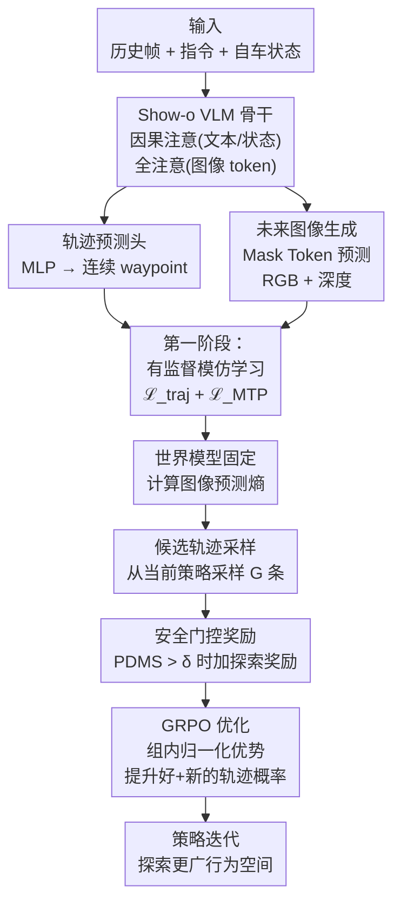

# ExploreVLA: Dense World Modeling and Exploration for End-to-End Autonomous Driving

**会议**: ECCV 2026  
**arXiv**: [2604.02714](https://arxiv.org/abs/2604.02714)  
**代码**: [https://zihaosheng.github.io/ExploreVLA/](https://zihaosheng.github.io/ExploreVLA/)  
**领域**: 自动驾驶  
**关键词**: VLA, 世界模型, GRPO, 密集监督, 探索奖励, 端到端驾驶

## 一句话总结

提出统一理解-生成框架 ExploreVLA，在 VLA 驾驶模型中引入未来 RGB + 深度图像生成作为密集世界建模目标，并利用世界模型的图像预测不确定性作为内在探索奖励，通过安全门控 GRPO 让策略超越模仿学习分布、发现多样且安全的驾驶行为，在 NAVSIM 上取得 93.7 PDMS 和 88.8 EPDMS 的 SOTA。

## 研究背景与动机

端到端自动驾驶的 VLA（Vision-Language-Action）模型近年来进步迅速，将感知、推理和规划统一在单个大模型中。然而，这类模型的主流训练范式是行为克隆——在专家演示上做监督微调。这带来了一个根本瓶颈：学到的策略只能复制它见过的行为，面对超出训练分布的场景时缺乏泛化所需的探索经验。模仿学习本质上让模型在已知空间内做插值，却无法在未知区域做外推。

强化学习按理说能弥补这个缺口——通过试错让策略探索专家分布之外的驾驶策略。但把 RL 应用到自动驾驶有三个独特挑战：第一，VLA 模型在离线数据集上训练，没有直接可观测的状态转移，需要学一个世界模型来预测动作后果；第二，标准的任务级奖励（如 PDMS）只评估轨迹质量，无法区分「仅仅是复制了专家行为」和「真正发现了新策略」——RL 的探索需要一种与任务性能正交的信号；第三，与语言任务不同，本次 token 的生成结果立即可见，而一个轨迹选择后它的安全后果需要在复杂的场景动态中评估。

本文的核心思路是：既然世界模型能预测未来画面，那它的预测不确定性天然就是轨迹新颖性的度量——熟悉的行为预测熵低、不熟悉的行为预测熵高。把这个信号安全门控后作为内在探索奖励，就能在 GRPO 下让策略自主发现高价值的新策略。**核心 idea：通过统一框架同时预测未来轨迹和未来 RGB+深度图像，让图像生成同时扮演两个角色——作为密集监督信号丰富规划骨干的表示，以及作为新颖性探针提供可安全门控的探索奖励，最终用 GRPO 在组内相对比较中优化策略。**

## 方法详解

### 整体框架

ExploreVLA 构建在 Show-o 统一 VLM 架构之上，输入当前及历史多帧前视图像、自然语言指令和自车状态，同时预测未来轨迹（连续值 waypoint）和未来 RGB + 深度图像（离散 token）。训练分两阶段：第一阶段是模仿学习（先预训练图像生成，再联合有监督微调轨迹+图像），第二阶段是 RL 后训练——用第一阶段学好的世界模型为每条候选轨迹计算图像预测熵作为新颖性分数，经 PDMS 安全门控后组成复合奖励，在 GRPO 下做组内比较优化。

### 关键设计

**1. 密集世界建模：用未来图像生成提供像素级监督**

现有 VLA 模型的核心问题是监督信号稀疏——文本指令只有高层语义，轨迹 waypoint 只编码了低维动作。相比之下，驾驶场景中的丰富空间结构（道路拓扑、物体范围、深度次序）完全没有被监督到。本文的解决方式是把未来场景生成作为辅助目标：模型需要预测 F 帧后的 RGB 图像和深度图。RGB 生成迫使模型学习场景外观的演变规律（纹理、颜色、物体身份），深度生成则编码 3D 几何结构（物体距离、空间布局、表面朝向）。二者通过共享的 MAGVIT-v2 tokenizer 统一到离散 token 空间，用 mask token 预测损失训练。RGB 和深度提供互补信息，联合使用时相比纯轨迹监督带来约 2.3 PDMS 的提升。

**2. 不确定性驱动的探索奖励：用世界模型的预测熵度量新颖性**

模仿学习后的策略倾向于窄化在专家轨迹附近。为了让 RL 的探索有的放矢，作者提出了一个巧妙的度量：对候选轨迹 τ_i，让第一阶段学好的世界模型基于该轨迹做未来图像生成，计算每个离散图像 token 预测分布的平均熵。高熵意味着世界模型对这条轨迹的视觉后果不确定，说明它偏离了训练分布——这正是值得探索的信号。熵在 batch 内归一化到 [0,1] 得到探索奖励 b_i。分析实验有力验证了这个设计的合理性：方向变化（真正的新行为）的 L2 误差只有 2.15m 但熵奖励高达 0.29，而速度变化（路径相似）的 L2 误差达 5.82m 但熵奖励仅 0.04——L2 误判了新颖性，而熵正确地捕捉了行为层面的差异。

**3. 安全门控 GRPO：让探索锚定在安全边界内**

高不确定性并不保证探索有益——如果一条轨迹导致碰撞，它虽然新颖但没有价值。本文因此设计了安全门控：只有当候选轨迹的 PDMS 分数超过安全阈值 δ 时才加上探索奖励 b_i，否则只按 PDMS 本身评分。这样只有「既新颖又安全」的轨迹才获得探索加成。优化采用 GRPO——从当前策略采样 G 条候选，计算各自的复合奖励 R_i = PDMS_i + λ·b_i（当 PDMS_i > δ），在组内归一化得到相对优势，然后更新策略以提高高优势轨迹的似然。消融表明，单独用 PDMS 奖励可从 88.50 提升到 90.19，加上图像探索奖励后进一步提升到 90.36，验证了二者的互补性。

### 损失函数 / 训练策略

训练分两阶段。第一阶段是模仿学习：先以真实未来动作为条件、仅训练图像生成 10 个 epoch（适应驾驶场景的视觉分布），再联合预测轨迹和未来图像做 15 epoch 有监督微调。总损失分为轨迹部分和 mask token 预测部分：ℒ = ℒ_traj + ℒ_MTP，其中 ℒ_MTP = ℒ_rgb + ℒ_depth。第二阶段是 RL 后训练：用 LoRA 高效微调，GRPO 每次采样 G 条候选轨迹，用 PDMS + 安全门控探索奖励做组内相对优化，训练 5 epoch。全部实验在 4×H200 GPU 上完成，深度图由预训练的单目深度模型 Metric3D 提供。

## 实验关键数据

### 主实验

| 基准 | 指标 | ExploreVLA | 之前 SOTA | 提升点 |
|------|------|------------|-----------|--------|
| NAVSIM v1 | PDMS | 93.7† | 93.5 (DriveSuprim, MC+L) | +0.2, 且仅用单目 |
| NAVSIM v2 | EPDMS | 88.8 | 86.1 (DriveVLA-W0, SC) | +2.7 |
| NAVSIM v1 | TTC | 98.3† | - | 子指标最佳 |
| NAVSIM v2 | NC / DAC / DDC / TLC / LK / HC | 六项最佳 | - | 全面领先 |

† 表示 best-of-N (N=6) 策略结果。不带 † 的 ExploreVLA 单次推理 PDMS 为 90.4，持平多数多视角方法。

### 消融实验

| 配置 | PDMS | 说明 |
|------|------|------|
| 纯轨迹基线（无图像生成） | 86.2 | 仅有监督微调，无世界建模 |
| + RGB 生成 | 87.9 | RGB 增加视觉表示丰富度 |
| + 深度生成 | 87.8 | 深度增加几何表示 |
| + RGB + 深度 | 88.5 | 二者互补，联合最好 |
| Stage1 基线 → +GRPO(PDMS) | 90.19 | RL 后训练效果显著 |
| + PDMS+探索奖励 | 90.36 | 探索奖励提供额外增益 |

### 关键发现

- 图像生成带来的密集监督在模仿学习阶段提升约 2.3 PDMS，且 RGB 和深度互补——二者联合优于各自单独使用。
- 探索奖励的贡献独立于 PDMS 奖励：消融中 PDMS 奖励将 88.50→90.19，加上探索奖励后再到 90.36，说明它鼓励了 PDMS 奖励无法激励的行为多样性。
- L2 距离不是新颖性的可靠度量：速度变化（L2=5.82m）的熵奖励仅 0.04，而方向变化（L2=2.15m）的熵奖励达 0.29——熵正确捕捉了行为层面的差异。
- best-of-N 策略带来显著提升（90.4→93.7），但即使在单次推理下也达到了多视角方法的竞争力。

## 亮点与洞察

- **世界模型的双重用**：同一套未来图像生成同时作为密集监督和探索奖励的来源，既解决了表示学习问题又解决了探索信号问题，无需额外组件，优雅干净。
- **用预测熵做新颖性度量**：这是一个可以迁移到其他端到端决策任务的通用设计——任何有生成式世界模型的规划系统都可以用它来识别值得探索的 OOD 行为。
- **安全门控的设计智慧**：不加分辨地鼓励所有新颖行为是危险的，用 PDMS 做门控确保了探索在安全边界内发生，既有实际部署价值又符合直觉。

## 局限与展望

- 深度图来自预训练的单目深度模型，其精度直接影响世界建模质量——误差传导可能限制在复杂场景（如恶劣天气）下的效果。更鲁棒的深度估计或直接自监督深度可能是改进方向。
- 当前只用了单目前视相机，扩展到多视角输入可能进一步提升感知广度和规划质量（论文中已经有单目超多模态方法的优异结果，但多目仍是自然扩展方向）。
- 探索奖励依赖于第一阶段模型固定后的预测熵，当第二阶段策略显著偏离初始分布时，世界模型可能需要更新——但冻结的模型能否持续提供有效信号、何时需要联合更新，是一个开放问题。
- 实验在 NAVSIM（非反应式仿真）上进行，闭环真实世界验证是落地前的重要一步。

## 相关工作与启发

- **vs AutoVLA / DriveVLA-W0**：这些 VLA 模型依赖稀疏的文本+轨迹监督，ExploreVLA 首次引入了像素级密集世界建模目标，并进一步将其用于 RL 探索信号，是从表示学习到策略优化的一体化改进。
- **vs FutureSightDrive / PWM**：它们也做未来图像生成作为推理步骤，但仅用于辅助规划决策（CoT 或预训练），没有利用生成不确定性来做探索奖励——ExploreVLA 的核心差异在于把生成的不确定性本身变成了优化信号。
- **vs UniDrive-WM**：也统一了理解-规划-生成，但 ExploreVLA 多了一个 RL 后训练阶段和探索奖励设计，在 NAVSIM 上取得了更高的 PDMS/EPDMS。

## 评分

- 新颖性: ⭐⭐⭐⭐ 世界模型的预测不确定性作为探索奖励的设计思路巧妙，密集监督+探索奖励的双重用简洁优雅，但在世界模型+RL的框架上属于增量创新。
- 实验充分度: ⭐⭐⭐⭐⭐ 两个基准（NAVSIM v1/v2）的主实验+消融+分析实验完整，L2 vs 熵奖励的对比分析很有说服力，消融逐组件拆解了每项设计的贡献。
- 写作质量: ⭐⭐⭐⭐⭐ 问题动机清晰，方法叙述流畅，图表配合得当，读起来几乎没有冗余。
- 价值: ⭐⭐⭐⭐ 为端到端驾驶 VLA 模型的 RL 后训练提供了一个可落地的探索奖励设计范式，双重用世界模型既缓解了监督稀疏问题又解决了探索信号来源问题，对自动驾驶和更广泛的具身决策任务都有参考价值。

<!-- RELATED:START -->

## 相关论文

- [\[ICML 2026\] DeepSight: Long-Horizon World Modeling via Latent States Prediction for End-to-End Autonomous Driving](../../ICML2026/autonomous_driving/deepsight_long-horizon_world_modeling_via_latent_states_prediction_for_end-to-en.md)
- [\[ECCV 2026\] PriorEye: Geospatial Visual Priors for End-to-End Autonomous Driving](prioreye_geospatial_visual_priors_for_end-to-end_autonomous_driving.md)
- [\[ICLR 2026\] ResWorld: Temporal Residual World Model for End-to-End Autonomous Driving](../../ICLR2026/autonomous_driving/resworld_temporal_residual_world_model_for_end-to-end_autonomous_driving.md)
- [\[CVPR 2026\] ResAD: Normalized Residual Trajectory Modeling for End-to-End Autonomous Driving](../../CVPR2026/autonomous_driving/resad_normalized_residual_trajectory_modeling_for_end-to-end_autonomous_driving.md)
- [\[CVPR 2026\] Percept-WAM: Perception-Enhanced World-Awareness-Action Model for Robust End-to-End Autonomous Driving](../../CVPR2026/autonomous_driving/percept-wam_perception-enhanced_world-awareness-action_model_for_robust_end-to-e.md)

<!-- RELATED:END -->
