# FLM-Occ: Feed-forward Likelihood Maximization for Efficient Indoor Occupancy Prediction

**会议**: ECCV 2026  
**arXiv**: [2606.21373](https://arxiv.org/abs/2606.21373)  
**代码**: [https://github.com/GCChen97/flm-occ](https://github.com/GCChen97/flm-occ)  
**领域**: 自动驾驶 / 3D 语义场景补全  
**关键词**: 室内占用预测, 混合模型, 最大似然估计, 高斯/超二次曲面, 前馈推理

## 一句话总结

FLM-Occ 将室内单目占用预测从体素分类重新定义为体素分布估计，通过最大似然估计（MLE）训练网络以前馈方式预测场景的混合模型参数，仅用 32 个超二次曲面原语即可超越此前需 1200 个高斯原语的最优方法，同时推理速度提升 3.7 倍。

## 研究背景与动机

单目占用预测旨在从一张 RGB 图像重建 3D 场景的几何与语义体素网格。它广泛应用于自动驾驶与具身智能，但稠密体素表示的计算复杂度随分辨率立方增长，严重限制了实时应用。近年来的方法探索了多种高效的 3D 表示，其中混合模型（mixture model，如高斯或超二次曲面）因每个原语可表示多个体素、同时提供连续空间表示而备受关注。这些方法在推理时初始化固定数量的几何原语，通过神经网络逐步精炼它们以匹配输入图像的场景分布——相比稀疏体素法，原语数量大幅减少。

然而，这些混合模型方法面临一个关键的共性问题：大量"伪原语"滞留在空旷区域，既浪费了表示容量又增加了无效计算。研究者们尝试了多种策略来缓解这个问题——比如用深度估计引导高斯初始化（SplatSSC 用预测深度放置初始高斯）或用目标中心表示（GaussianFormer-2 沿光线预测物体分布）——但这些绕开问题的手段并未触及本质，原语仍然只能做局部微调，无法被真正"搬运"到被占用的区域。

本文通过梯度分析揭示了这一问题的根本原因：现有方法统一使用体素分类损失（voxel-wise cross-entropy）训练，但该损失对远离 GT 占用体素的原始本梯度趋于零。如果一个占用体素已被邻近原语解释，它对远处原语的梯度信号就被"遮蔽"了，于是这些原语永远得不到正确的迁移信号。这种局部分类式的监督与混合模型需要全局优化的矛盾是问题的核心。本文的核心 idea 是**将占用预测从体素分类重新定义为体素分布估计，用最大似然估计（MLE）直接最大化所有被占用体素的联合概率，使每个占用体素都能对全体原语产生梯度信号，从而实现原语的大范围全局迁移。**

## 方法详解

### 整体框架

FLM-Occ 的输入是一张 RGB 图像、相机内参和一组固定数量的随机初始化的几何原语（高斯或超二次曲面），输出是对应的占用体素网格。框架包含四个阶段：图像编码、原语特征初始化、多级精炼、体素化。整体流程如下图所示。

```mermaid
%%{init: {'flowchart': {'rankSpacing': 24, 'nodeSpacing': 28, 'padding': 6, 'wrappingWidth': 400}}}%%
flowchart TD
    A["RGB 图像"] --> B["DAv2 编码器"]
    B --> C["图像特征"]
    D["随机初始化原语<br/>位置/尺度/旋转/形状/语义"] --> E["线性投影"]
    E --> F["原语嵌入特征"]
    C --> G["可变形聚合<br/>采样图像特征"]
    F --> G
    G --> H["多头自注意力 + RoPE"]
    H --> I["MLP 更新头部<br/>预测原始参数残差"]
    I -->|"无约束更新"| G
    I --> J["体素化模块<br/>密度求和 + 语义加权"]
    J --> K["占用体素网格"]
```

具体而言，DAv2 编码器提取图像的几何与语义特征；随机初始化的原语参数经线性投影得到原语嵌入特征；在 4 个精炼模块中，每个模块通过可变形聚合采样图像特征，经多头自注意力（含旋转位置编码 RoPE）后由 MLP 预测原语参数的更新残差，直接加在原始参数上（无步长约束），再将激活后的参数共形映射回合法空间；最终体素化模块将精炼后的原语集合转换为体素网格。

### 关键设计

**1. FLM 损失函数：以全局似然最大化替代体素分类**

现有方法使用体素分类损失 $\mathcal{L}_{vc}$ 训练，该损失对远距原语的梯度在某个占用体素已被邻近原语解释时趋于零（式 6 中的乘积项在任一 $\mathcal{K}_r \approx 1$ 时归零）。这意味着一个原语一旦"占据"了一个体素，就屏蔽了该体素对其他原语的信号——于是空区域中的原语永远得不到正确的迁移梯度。

FLM 损失从根本上改变了这种局部分类范式。它源自最大似然估计的负对数形式，由两项构成：体积和对数项 $\log \sum v_j$ 和密度项 $- \frac{1}{P} \sum \log \sum \mathcal{K}(\mathbf{x}_i | \mathbf{g}_j)$。最小化体积项会压缩原语总体积，驱散空区域的密度；最大化密度项（即最小化负号）将原语拉向占用体素位置。更重要的是，FLM 损失对原语位置的梯度（式 13）不依赖于其他原语的覆盖状态——即使某个原语已经很好地解释了占用体素 $\mathbf{x}_i$，该体素仍能为所有原语提供梯度信号。这使得网络能够学会将原语从空旷区域迁移到物体表面，真正发挥每个原语的表示能力。此外，FLM 损失的计算只遍历被占用体素（Occ-ScanNet 中仅 ~3%），计算量远小于遍历全体体素的分类损失。

**2. 隐式单纯形约束与统一原语体积公式**

标准混合模型的权重 $\{w_j\}$ 需要满足 $\sum w_j = 1$ 的单纯形约束，但端到端训练中直接约束权重是困难的。以往方法绕过这个约束的方式是引入非受限的 opacity 参数替代权重，但这破坏了 MLE 的理论框架。

本文的解决方案优雅而简洁：将第 $j$ 个原语的混合权重定义为其归一化体积 $w_j = v_j / \sum v_j$。这一重参数化自动满足单纯形约束，无需额外优化步骤。同时，它将权重与原语的空间尺度对齐——大权重对应大尺度原语，用于覆盖墙壁、地板等大面积结构；小权重对应小尺度原语，负责局部细节。更重要的是，总体积 $\sum v_j$ 直接反映了场景中被预测为占用的体素数，体素分类范式中的"空类"概念在这里被自然地消解了。为了实现这一点，论文推导了高斯和超二次曲面的统一体积闭式公式（式 14），使用 Gamma 函数将两者统一表达。

**3. 基于密度的体素化与密度正则化**

FLM 框架下，从混合模型到体素网格的转换需要全新的公式。由于 FLM 损失直接作用于原语在占用体素位置的概率密度值，体素化自然地采用密度求和形式：体素 $\mathbf{x}$ 的占用概率 $p = \sum_j \mathcal{K}(\mathbf{x} | \mathbf{g}_j)$，语义类别 $\mathbf{c} = \sum_j \mathcal{K}(\mathbf{x} | \mathbf{g}_j) \mathbf{f}_j / \sum_j \mathcal{K}(\mathbf{x} | \mathbf{g}_j)$。这与先前的体素分类方法完全不同——后者使用乘法聚合（$1 - \prod (1 - \mathcal{K})$）或带 opacity 的加权求和。

实际计算中，密度值大多落在 $[0, 1]$ 区间。为便于使用全局阈值 0.5 判定占用，论文加入了密度正则化损失 $\mathcal{L}_{reg}$，迫使占用体素处的密度和趋近 1。该正则项还减少了原语之间的重叠，加速了训练收敛。值得注意的是，FLM 损失的计算不依赖体素化过程，只在推理时做体素化，这进一步降低了训练开销。

### 损失函数 / 训练策略

总损失由三部分组成：$\mathcal{L} = \mathcal{L}_{flm} + \lambda_1 \mathcal{L}_{reg} + \lambda_2 \mathcal{L}_{ce}$，其中 $\lambda_1 = 0.1$，$\lambda_2 = 1.0$。$\mathcal{L}_{flm}$（式 12）是 FLM 损失，$\mathcal{L}_{reg}$（式 16）是密度正则化，$\mathcal{L}_{ce}$ 是对语义类别的交叉熵损失。优化器使用 AdamW（$\beta_1=0.85, \beta_2=0.95$，权重衰减 0.01），学习率初始 $5\times 10^{-4}$ 经 1000 步线性预热后余弦退火，DAv2 的 ViT 骨干以 $5\times 10^{-5}$ 全参数微调。在 4 张 RTX A6000 上分别训练 30000 轮（Occ-ScanNet）和 15000 轮（Occ-ScanNet-mini2），批大小 128，BF16 混合精度。数据增强使用随机水平翻转和颜色抖动。

## 实验关键数据

### 主实验

在 Occ-ScanNet 数据集上的结果，FLM-Occ 以极少的原语数量达到最佳精度（数据来自表 2）。

| 方法 | 原语数 | 表示类型 | IoU (%) | mIoU (%) |
|------|--------|----------|---------|----------|
| MonoScene | 129.6k | 体素 | 41.6 | 24.6 |
| ISO | 129.6k | 体素 | 42.2 | 28.7 |
| DiScene | 960 | 查询 | 47.2 | 47.2 |
| EmbodiedOcc | 16200 | 高斯 | 53.6 | 45.2 |
| EmbodiedOcc++ | 16200 | 高斯 | 54.9 | 46.2 |
| SplatSSC | 1200 | 高斯 | 62.8 | 51.8 |
| **FLM-Occ (32)** | **32** | **超二次曲面** | **65.3** | **55.9** |
| **FLM-Occ (1024)** | **1024** | **高斯** | **71.2** | **63.6** |
| **FLM-Occ (1024)** | **1024** | **超二次曲面** | **71.7** | **64.0** |

仅 32 个超二次曲面原语（仅为 SplatSSC 的 2.7%）就以 65.3% IoU / 55.9% mIoU 全面超越 SplatSSC（1200 高斯，62.8/51.8）。1024 超二次曲面版本达到 71.7/64.0，分别比 SplatSSC 高出 8.9% 和 12.2%，推理速度达 25.4 FPS。

### 消融实验

表 4 给出了不同原语类型和数量的系统消融（Occ-ScanNet）：

| 原语数量 | 高斯 IoU | 超二次曲面 IoU | 高斯 mIoU | 超二次曲面 mIoU | 平移距离 (m) |
|---------|----------|---------------|----------|-----------------|-------------|
| 32 | 57.1 | 65.3 | 48.8 | 55.9 | 1.32-1.55 |
| 64 | 64.7 | 68.7 | 56.3 | 60.0 | 1.40-1.42 |
| 128 | 68.7 | 70.2 | 60.8 | 62.0 | 1.22-1.24 |
| 256 | 70.1 | 70.9 | 62.2 | 62.8 | 1.21-1.22 |
| 512 | 70.7 | 71.4 | 62.9 | 63.6 | 1.21 |
| 1024 | 71.2 | 71.7 | 63.6 | 64.0 | 1.20-1.25 |

表 3 的网络配置消融（128 超二次曲面）：

| 配置变体 | IoU | mIoU |
|---------|-----|------|
| DAv2-Relative + 不微调 | 52.4 | 43.9 |
| DAv2-Metric + 不微调 | 57.3 | 48.9 |
| DAv2-Relative + 微调 ViT | 67.2 | 59.2 |
| 2 个精炼模块 | 69.2 | 60.7 |
| 4 个精炼模块（最佳） | 70.2 | 62.0 |
| 5 个精炼模块 | 70.0 | 61.8 |
| 无密度正则化 | 67.5 | 59.6 |
| 加密度正则化 | 70.2 | 62.0 |
| DAv2-ViT-Large | 72.7 | 65.0 |

### 关键发现

- **FLM 带来的全局迁移能力是决定性因素**：FLM-Occ 原语的平均平移距离约 1.2m，而 SplatSSC 仅 0.15m、EmbodiedOcc 仅 0.08m。这说明 FLM 损失确实让网络学会了将原语从随机初始位置大幅迁移到物体表面。
- **超二次曲面 vs 高斯**：超二次曲面在所有原语数量下一致优于高斯，尤其在小原语数（32 个）时差距最大（IoU: 65.3 vs 57.1），说明超二次曲面的形状表达能力对欠参数化场景更重要。原语数增大后差距缩小。
- **性能饱和点**：256 个原语后性能增益明显放缓，说明室内场景用几百个原语即可充分表示。这与 SplatSSC 需 1200 个形成鲜明对比。
- **DAv2 微调至关重要**：微调 ViT 后 mIoU 提升 10-15%，相对深度特征配合微调可达到与度量深度特征相近的水平。精炼模块 4 个达到饱和。
- **密度正则化一致有效**：无 $\mathcal{L}_{reg}$ 的配置 mIoU 下降约 2.4%。

## 亮点与洞察

- **用 MLE 替代分类的思路极为简洁有力**：不是通过多阶段、辅助损失或精心设计的初始化来缓解原语浪费，而是从根本上改变训练目标，让梯度性质自己引导原语迁移——"改了损失函数，其他一切自动变好"，这种第一性原理式的重构是本文最大的亮点。
- **归一化体积的权重重参数化很巧妙**：同时解决了三个问题——变量自身的单纯形约束、权重与原语尺度的语义对齐、以及总体积作为占用容量的天然度量。这种"一个设计解决多个问题"的 elegance 值得借鉴。
- **仅需单一编码器**：之前的 SplatSSC 和 EmbodiedOcc 使用 EfficientNet 做语义 + DAv2 做深度双编码器，FLM-Occ 仅用 DAv2 就实现更好结果，简化了管线。
- **FLM 损失天然稀疏**：只计算占用体素（~3%），计算量远低于遍历全体体素的分类损失，这是"目标对了，效率自然来"的又一例证。
- **超二次曲面的统一体积公式**（式 14）给后续工作提供了直接的数学工具——想评估哪种原语更优不再需要各自推导体积。

## 局限与展望

- **FLM 损失计算复杂度与原语数 × 占用体素数成正比**，限制了在大规模室外场景（如 nuScenes 的稠密占用）的直接扩展。作者提出分层原语结构可能是解决方向。
- **固定原语数量**：类似 EmbodiedOcc 和 SplatSSC，FLM-Occ 在训练时固定原语数，改变数量需重新训练。引入可学习的剪枝/分割机制可缓解此局限。
- **数据集依赖 Occ-ScanNet**，其标注质量继承自 NYUv2，精度有限。更高质量的数据集或能进一步释放 FLM 的潜力。室外场景的扩展是自然下一步。
- **当前的体素化阶段仍然用到邻域搜索（式 2）**，虽然比暴力遍历高效，但训练时 FLM 损失本身不依赖体素化——这一点理论上可以设计更高效的稀疏计算方案。

## 相关工作与启发

- **vs SplatSSC**: 两者都用混合模型做占用预测。SplatSSC 依赖深度图初始化高斯以缓解伪原语问题，FLM-Occ 从根源上通过 MLE 让原语自动迁移。FLM-Occ 用 32 个原语就超过 SplatSSC 的 1200 个，验证了"治本胜过治标"。
- **vs GaussianFormer-2 / EmbodiedOcc**: 这些方法的目标中心表示和深度引导初始化都是"让原始尽量落在正确位置附近"的策略，而 FLM-Occ 证明了只要梯度能传回去，随机初始化也能学到正确分布——这大大简化了预处理管线。
- **vs Feed-forward 3DGS**: F3DGS 方法（如 pixelSplat、MVSplat）也无法大幅迁移高斯，它们依赖像素对齐的表示（每个像素一束高斯）。FLM 提供的 MLE 框架可能对前馈 3D 重建也有启发，可直接用点云作为监督信号训练原语预测网络。

## 评分

- 新颖性: ⭐⭐⭐⭐⭐ 将 MLE 引入 occupancy prediction 的训练目标，开创性地重新定义了问题范式而非增量改进。
- 实验充分度: ⭐⭐⭐⭐⭐ 系统消融了原语类型、数量、网络配置、编码器选择、正则项贡献，分析深入，梯度推导与实验验证相互印证。
- 写作质量: ⭐⭐⭐⭐⭐ 问题动机层层递进（现象→梯度分析→本质矛盾→方案），图与正文紧密配合，梯度分析直接解释实验现象。
- 价值: ⭐⭐⭐⭐⭐ 用 2.7% 的原语数量实现显著更好的精度和 3.7 倍加速，在实际系统中可大幅降低计算成本和延迟，且 FLM 框架可推广到前馈 3D 重建等任务。

<!-- RELATED:START -->

## 相关论文

- [\[CVPR 2026\] TT-Occ: Test-Time 3D Occupancy Prediction](../../CVPR2026/autonomous_driving/test-time_3d_occupancy_prediction.md)
- [\[CVPR 2026\] Monocular Open Vocabulary Occupancy Prediction for Indoor Scenes (LegoOcc)](../../CVPR2026/autonomous_driving/monocular_open_vocabulary_occupancy_prediction_for_indoor_scenes.md)
- [\[ECCV 2024\] Monocular Occupancy Prediction for Scalable Indoor Scenes](../../ECCV2024/autonomous_driving/monocular_occupancy_prediction_for_scalable_indoor_scenes.md)
- [\[ICLR 2026\] WorldSplat: Gaussian-Centric Feed-Forward 4D Scene Generation for Autonomous Driving](../../ICLR2026/autonomous_driving/worldsplat_gaussian-centric_feed-forward_4d_scene_generation_for_autonomous_driv.md)
- [\[CVPR 2026\] UFO: Unifying Feed-Forward and Optimization-based Methods for Large Driving Scene Modeling](../../CVPR2026/autonomous_driving/ufo_unifying_feed-forward_and_optimization-based_methods_for_large_driving_scene.md)

<!-- RELATED:END -->
