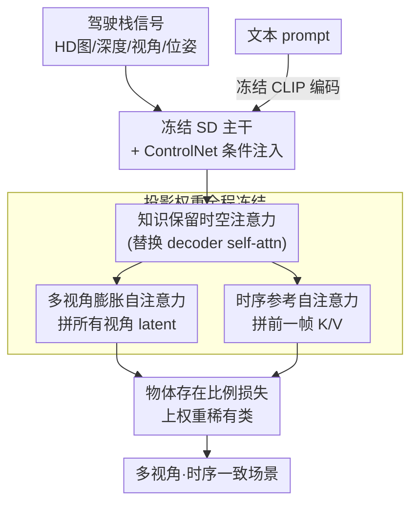

# FrozenDrive: Zero-Shot Text-Guided Driving Scene Generation and Data Augmentation

**会议**: ECCV 2026  
**arXiv**: [2606.20110](https://arxiv.org/abs/2606.20110)    
**代码**: 无（论文提及补充材料，未给出仓库链接）  
**领域**: 扩散模型 / 自动驾驶 / 可控生成 / 数据增强  
**关键词**: 冻结扩散模型、零样本文本引导、多视角一致性、驾驶场景生成、长尾数据增强

## 一句话总结
FrozenDrive 把预训练 Stable Diffusion 主干**完全冻结、零新增参数**，仅通过重排 self-attention 的输入（拼接多视角特征、注入前一帧参考）就同时拿到多视角与时序一致性，从而保住原始扩散先验、实现零样本文本引导的驾驶场景生成，并用文本 prompt 定向合成夜/雨/雪等稀有恶劣天气数据显著提升下游感知与规划鲁棒性。

## 研究背景与动机

**领域现状与痛点**：自动驾驶数据采集昂贵，恶劣天气与长尾稀有事件几乎无法批量采到，导致真实语料严重偏向白天晴好场景、模型在长尾上很脆。近两年主流做法是用扩散模型合成驾驶场景：以 BEV 布局、3D 框、占用图等驾驶栈信号作 2D 空间条件（多经 ControlNet 注入），在 SD / SVD / DiT 这类预训练模型上适配到驾驶数据集。但为了支持多相机 rig 和时序动态，这些方法要么让各视角近乎独立生成、视角间共享很弱，要么在预训练主干上**新增可学习的跨视角/时序 attention 层并微调**。问题在于：不管哪种，最终都要对主干做大量 fine-tune，而训练集本身覆盖有偏（几乎没有雪、夜、雨的充分样本），于是预训练模型里关于恶劣/未见场景的丰富先验被**覆盖或灾难性遗忘**——文本-图像对齐被削弱，模型只会在"训练时见过的天气"里做局部、表层的编辑，一旦要求它凭文本合成训练时没见过的暴雪就崩。此外全主干更新还牺牲了 per-object 保真度，尤其对稀有类。

**核心矛盾与目标**：这里有一个直接矛盾——**要多视角/时序一致性就得往主干里加东西并训练它，而一旦训练主干就会侵蚀预训练先验、丢掉零样本文本能力**。作者的目标是既拿到强一致性、又完整保住预训练扩散模型的知识（尤其是文本-图像对齐），使得"用一句训练时从没见过的文本描述去合成场景"这件事仍然成立。作者把主流三条适配策略（全/部分微调、加可训练 adapter、ControlNet 条件）统一放到"知识保留"这把尺子下审视，并做了一个关键实证观察：哪怕只在冻结主干上**加极少量可训练参数**（多视角或时序 cross-attention），也会诱发同样的先验漂移，收窄视觉多样性、削弱 prompt 保真度。

本文的核心 idea 是：**别往主干里加任何参数、也别更新任何权重，一致性完全靠"改自注意力看到的输入"来实现**。具体地，把 self-attention 层喂进去的东西重排——多视角时把所有相机的 latent 拼在一起做一次注意力（circular 跨视角对齐），时序上把前一帧的 key/value 拼进当前帧的 bank（视频式时序连贯），注意力权重本身一动不动、仍是冻结的 LDM 参数。主干保持冻结且参数无关（parameter-free），预训练的文本-图像对齐就被完整保下来，零样本文本引导得以成立；再配一个面向稀有物体的 ratio loss 补上长尾保真度。

## 方法详解

### 整体框架

FrozenDrive 的骨架是一条**纯 ControlNet 条件化 + 冻结 SD 主干**的多视角生成管线。输入是五路条件信号：(i) 场景布局（HD 地图各图层 + 3D 框投到各视角像面的多通道 mask）、(ii) 深度图（由 LiDAR 聚合成 3D 占用后逐视角 ray-cast 得到）、(iii) per-view 相机指示（视角索引经 Fourier 特征编码）、(iv) 到前一帧的相对位姿（构造成逐像素的 2D 空间对应图）、(v) 文本描述。前四路是多视角、像素/空间对齐的，各自过一个轻量 embedding 网络后**加到 latent 上一起喂进 ControlNet**；文本单独由**冻结的 CLIP text encoder** 编码走 cross-attention。ControlNet 产生的控制特征去调制冻结的扩散主干，全程不改也不加主干参数。

关键在于：主干冻结的同时，作者**把 LDM decoder 里原来的 self-attention 换成"知识保留时空注意力"**——注意不是换成新模块，而是保留原 attention 的投影权重（$\mathbf{W}^Q,\mathbf{W}^K,\mathbf{W}^V$ 全冻结），只改"哪些特征被送进去互相 attend"。这一块由两个互补机制组成：多视角膨胀自注意力（MISA）负责跨视角一致，时序参考自注意力（TRSA）负责帧间一致，二者在同一个冻结 block 内联合作用。最后再叠一个物体存在比例损失（object-presence ratio loss）把学习重心往稀有类拉。整条管线从"文本 + 驾驶栈信号"一次前向就产出视角一致、时序稳定的多视角场景。

### 关键设计

**1. 知识保留原则：冻结主干、零新增参数，靠"重排输入"而非"加层"拿一致性**

这一条针对的正是前面的核心矛盾——加层微调会侵蚀先验。作者的实证发现很关键：不只是全/部分微调会诱发漂移，**哪怕只在冻结主干上加一点点可训练的多视角/时序 cross-attention 层，也会同样漂移**（narrowing 多样性、削弱 prompt 保真，见消融的 "SD + CA" 基线）。由此得到的原则简单直接：主干彻底冻结、一个新参数都不引入，一致性全部通过改 self-attention 的输入上下文来实现。可训练的只有从头初始化的 ControlNet 和条件 embedder（全模型 1.40B 参数，仅 0.37B 可训练）。因为主干和它的文本-图像对齐分毫未动，模型对训练时从没见过的天气/场景组合仍保有零样本文本引导能力——这是它能凭 "Snowy weather. Heavy snow." 合成暴雪、而 fine-tune 类方法做不到的根因。

**2. 多视角膨胀自注意力 MISA：把所有相机 latent 拼成一条序列做一次冻结注意力**

要跨视角一致（重叠视角在几何/外观/语义上必须一致），标准做法是加跨视角 attention 层，但那要训练。MISA 的做法是把 $n_{\text{view}}$ 个相机的 latent token 直接拼接成联合序列再过**同一个冻结的 self-attention**：设视角 $v$ 的特征 token 为 $\mathbf{X}^{(v)}\in\mathbb{R}^{N_v\times d_{\text{model}}}$，拼成 $\tilde{\mathbf{X}}:=[\mathbf{X}^{(1)};\mathbf{X}^{(2)};\cdots;\mathbf{X}^{(n_{\text{view}})}]$，然后

$$\mathrm{Attn}(\tilde{\mathbf{X}})=\mathrm{softmax}\!\left(\frac{(\tilde{\mathbf{X}}\mathbf{W}^Q)(\tilde{\mathbf{X}}\mathbf{W}^K)^\top}{\sqrt{d_h}}\right)(\tilde{\mathbf{X}}\mathbf{W}^V)$$

其中 $\mathbf{W}^Q,\mathbf{W}^K,\mathbf{W}^V$ 是冻结的 LDM 参数、$d_h$ 是每头维度。原本只在视角内做的注意力，被"膨胀"到跨视角互相交换，而权重一个没动。为了让注意力知道每个 token 来自哪个视角，作者用一个轻量 view embedding $\mathbf{e}_{\text{view}}$——把视角索引（前左/前中/前右/后右/后中/后左，对应 0–5）用 Fourier 特征编码后作为额外条件喂 ControlNet，给出视角身份和邻接结构，几乎零成本地改善跨视角对应。

**3. 时序参考自注意力 TRSA：把前一帧的 key/value 拼进当前帧的注意力 bank**

要时序一致（连续帧在 ego/物体运动下不能出现幻觉式突变），TRSA 与 MISA 同理——所有 LDM 注意力权重仍冻结，只扩展输入上下文，把前一帧当显式参考复用。对当前帧 $i$ 和参考帧 $i-j$，取同噪声等级的 latent，用冻结权重算出当前帧的 $\mathbf{Q}_i,\mathbf{K}_i,\mathbf{V}_i$ 以及参考帧的 $\mathbf{K}_{i-j},\mathbf{V}_{i-j}$，然后把参考帧的 K/V 拼到当前帧的 bank 上：

$$\tilde{\mathbf{K}}_i=[\mathbf{K}_i;\mathbf{K}_{i-j}],\quad \tilde{\mathbf{V}}_i=[\mathbf{V}_i;\mathbf{V}_{i-j}],\quad \mathrm{Attn}(\mathbf{X}_i)=\mathrm{softmax}\!\left(\frac{\mathbf{Q}_i\tilde{\mathbf{K}}_i^\top}{\sqrt{d_h}}\right)\tilde{\mathbf{V}}_i$$

当前帧因此能检索到前一帧里时序对齐的外观与几何线索（物体、天气），rollout 更稳且不引入新参数（推理时取 $j{=}1$，即用最近生成的那一帧当参考）。帧间运动则由轻量相对位姿 embedding $\mathbf{e}_{\text{pose}}$ 提供：不是直接塞 6-DoF 变换，而是对每个像素 $(x,y)$ 先抬升到 $(x,y,0)$、用已知 3D 相对位姿变换、取平面内坐标 $(x',y')$ 再 Fourier 编码，得到一张稠密对应图经 ControlNet 注入。MISA 与 TRSA 最终被统一进同一个冻结 block、且**只在 LDM decoder 里应用**（decoder 才好与 ControlNet 的场景级条件融合），联合产出视角一致、时序稳定的结果。

**4. 物体存在比例损失：按类别稀有度给像素加权，把学习重心拉向长尾**

监督驾驶数据严重长尾（nuScenes 训练集里 bicycle 只有 car 频次的约 2.3%），而保真度天然跟着观测频率走，稀有类渲染就差。作者在标准 DDPM 噪声预测损失 $\mathcal{L}=\mathbb{E}[\|\epsilon-\epsilon_\theta(\cdot)\|^2]$ 之上，构造逐像素权重图，把稀有类所在像素的 loss 放大：

$$\mathcal{L}_{\text{total}}=\frac{1}{|\Omega|}\sum_{p\in\Omega}\bigl(1+\lambda\,w(p)\bigr)\,\mathcal{L}(p),\qquad w(p)=\max_{k\in\mathcal{K}_p}w_k,\ \ \mathcal{K}_p=\{k\mid p\in\mathcal{M}_k\}$$

其中 $\Omega$ 是图像格点、$\mathcal{M}_k$ 是把第 $k$ 类 3D 框投影得到的前景 mask、$w_k$ 是类相关权重（越稀有越大，具体取 $w_k=(o_t/o_k)$，$o_t/o_k$ 为总物体数与该类物体数之比）；无物体的像素权重置 0。**max-overlap 规则**让重叠区里最稀有的那个实例主导权重（例如某像素同属 car 与 bus，$w_{\text{car}}{=}2.29$、$w_{\text{bus}}{=}71.78$，则取 71.78），$\lambda$ 取 0.02。这样学习被明确往欠表示类别倾斜，而不是一味偏袒高频类。⚠️ $w_k$ 的精确形式（是否带 $p$ 下标）以原文 Eq.(H) 为准。

### 损失函数 / 训练策略

训练只更新 ControlNet 和条件 embedder，主干（Stable Diffusion v1.5）全程冻结、不加任何层。优化器 AdamW，学习率 $1\times10^{-4}$，训练 200K 迭代、batch size 4，两阶段分辨率：先 150K 迭代跑 $224\times400$，再 50K 跑 $448\times800$。训练时开启 MISA 学跨视角一致，推理时**额外**激活 TRSA（$j{=}1$）产出时序一致序列。最终帧在 $448\times800$ 生成、再双线性插值上采到 nuScenes 原分辨率 $900\times1600$ 供 UniAD / SparseDrive 等下游用。全部训练在 2 张 A100 上完成；推理仅需单张 A100、12.43GB 显存、每帧每步 0.97s（对比 MagicDrive-V2 要 4 张 A100、每 GPU 59.95GB）。

## 实验关键数据

### 主实验

在 nuScenes 验证集条件下生成多视角图，用 UniAD 评感知/规划、FVD 评生成质量。FrozenDrive 在 SD-based 方法里取得最好的下游性能，BEV 分割尤其突出（说明多视角空间一致性强），FVD 在 SD 类图像扩散基线中最低（STDiT 视频扩散模型因显式时序建模 FVD 更低属预期）。

| 方法 | Backbone | 3DOD mAP↑ | NDS↑ | BEV mIoU (Drivable)↑ | L2 Avg↓ | FVD↓ |
|------|----------|-----------|------|----------------------|---------|------|
| nuScenes(真实) | - | 37.98 | 49.85 | 69.14 | 1.05 | - |
| MagicDrive (ICLR'24) | SD | 12.92 | 28.36 | 51.46 | 1.22 | 218.1 |
| Panacea (CVPR'24) | SD | 13.72 | 27.73 | 52.37 | 1.23 | 139.0 |
| DriveArena (ICCV'25) | SD | 16.06 | 30.03 | 59.37 | 1.18 | 185.3 |
| MagicDrive-V2 (ICCV'25) | STDiT | 15.24 | 31.25 | 58.63 | 1.09 | 81.6 |
| X-Scene (NeurIPS'25) | SD | 20.40 | 31.76 | 61.96 | 1.15 | 179.7 |
| DiST-4D (ICCV'25) | STDiT | 15.63 | 32.44 | 60.32 | 1.19 | **22.6** |
| **FrozenDrive** | SD | **21.87** | **35.32** | **64.27** | **1.05** | 136.8 |

下游数据增强（用 FrozenDrive 纯文本 prompt 定向合成夜/雨样本、训练 SparseDrive）是更有说服力的证据：

| 条件 | 方法 | 3DOD mAP↑ | NDS↑ | 在线建图 mAP↑ | L2 Avg↓ |
|------|------|-----------|------|---------------|---------|
| 夜间 | Baseline(仅正常天气) | 6.62 | 15.19 | 5.99 | 1.40 |
| 夜间 | DriveArena | 8.89 | 17.52 | 7.00 | 1.09 |
| 夜间 | MagicDrive-V2 | 12.68 | 17.32 | 11.69 | 1.11 |
| 夜间 | **FrozenDrive** | **18.15** | **24.95** | **21.03** | **0.93** |
| 雨天 | Baseline | 31.60 | 41.20 | 24.75 | 0.75 |
| 雨天 | MagicDrive-V2 | 33.93 | 42.20 | 30.02 | 0.73 |
| 雨天 | **FrozenDrive** | **35.15** | 44.26 | **31.39** | **0.58** |

夜间增益尤为夸张（在线建图 mAP 从 baseline 的 5.99 拉到 21.03，规划 L2 从 1.40 降到 0.93），作者归因于 FrozenDrive 保住原场景几何、又能真实渲染低光外观，合成夜景比规则滤镜/DriveArena/MagicDrive-V2 更接近真实夜拍。

### 消融实验

时空注意力（MISA + TRSA 互补性）：

| 配置 | BEV Drivable mIoU↑ | BEV Crossing↑ | FVD↓ | 说明 |
|------|--------------------|---------------|------|------|
| MISA + TRSA (Full) | 56.5 | 8.9 | 144.1 | 完整模型，两指标俱佳 |
| 仅 MISA (去 TRSA) | 55.1 (-1.4) | 7.8 (-1.1) | 174.2 (+30.1) | 时序质量掉、FVD 恶化，BEV 尚可 |
| 仅 TRSA (去 MISA) | 51.9 (-4.6) | 5.6 (-3.3) | 145.1 (+1.0) | FVD 稍好但 BEV 明显崩（跨视角一致丢） |

物体存在比例损失（按类别频次从高到低排）：

| 配置 | mAP↑ | Car AP↑ | Motorcycle AP↑ | Bicycle AP↑ |
|------|------|---------|----------------|-------------|
| w/ loss | 21.9 | 38.6 | 10.0 | 9.2 |
| w/o loss | 16.1 (-5.8) | 33.5 (-5.1) | 0.4 (-9.6) | 1.9 (-7.3) |

### 关键发现
- **MISA 管空间、TRSA 管时序，二者互补缺一不可**：去 TRSA 主要伤 FVD（+30.1）与时序，去 MISA 则 BEV 分割全面崩（Drivable -4.6、Crossing -3.3），只有两者齐上才同时拿到最高 BEV mIoU 和最低 FVD。
- **物体存在比例损失对稀有类是"从无到有"级别的救命**：Motorcycle AP 从 0.4→10.0、Bicycle 从 1.9→9.2（这两类各占训练集约 1.07%/1.00%），mAP 整体 +5.8；对高频 car 也有 +5.1，说明重加权没有牺牲常见类。
- **知识遗忘是可测的**：把 MISA/TRSA 换成可学习 cross-attention（"SD + CA"）后，虽然也能保证多视角/时序一致，但在 "Snowy weather. Heavy snow." 这类未见 prompt 下明显 under-reflect 文本、雪的线索很弱；CLIP score 在雪这个训练集完全没有的条件上，FrozenDrive(0.2507) 大幅领先 DriveArena(0.2277)/MagicDrive-V2(0.2181)，印证冻结设计对 OOD 泛化的独占优势。
- **一致性直接测也站得住**：车道对齐 mIoU 33.58，与需要额外可学习 cross-attention + 部分微调的 "SD + CA"(33.55) 持平，说明零新增参数也能拿到同等几何精度；VBench 时序一致性略逊 MagicDrive-V2（它是视频扩散模型），但强于 SD+CA 与 DriveArena 这些微调基线。

## 亮点与洞察
- **"不训练比训练更好"的反直觉打法**：核心贡献不是加了什么模块，而是**什么都没加**——多视角/时序一致性完全靠重排 self-attention 的输入（拼视角、拼前帧 K/V）实现，注意力权重分毫未动。这让预训练的文本-图像对齐被完整保留，零样本文本引导才成立。这个"用输入重塑替代参数新增"的思路可直接迁移到任何"想加能力又怕毁先验"的冻结基础模型场景。
- **把"加少量参数也会遗忘"作为独立发现点**：论文没有停在"全微调会遗忘"这个共识上，而是实证了哪怕只挂几层可训练 cross-attention 同样诱发先验漂移（SD+CA 的雪景失败 + CLIP score 崩），为"parameter-free"的必要性提供了硬证据，说服力比单纯讲故事强。
- **max-overlap 加权是个巧的小设计**：重叠区让最稀有实例主导权重，避免了 car 这种大面积高频类在像素级 loss 里淹没 bicycle/motorcycle，是"长尾生成"里可复用的加权 trick。
- **数据增强指标是比生成 FVD 更硬的证据**：作者刻意用"下游 AD 模型在夜/雨上的感知规划提升"来论证价值，而非只比 CLIP/FVD 这类风格 plausibility——夜间在线建图 mAP 5.99→21.03 这种量级的提升，比生成质量数字更能说明合成数据真的有用。

## 局限与展望
- **长程时序仍逊于视频扩散**：作者承认 parameter-free 冻结方案在 long-range 时序连贯上落后于近期视频扩散模型（FVD 22.6 的 DiST-4D、VBench 时序分更高的 MagicDrive-V2 都是明证）——它本质是靠"拼前一帧"做局部时序，不是真正的视频建模。
- **数据增强质量缺乏直评协议**：现有 protocol 无法直接评估"合成增强数据"本身的质量，只能间接靠下游任务反推，作者把"设计更忠实的增强质量指标"列为未来方向。
- **绑定 SD v1.5**：整套只在 Stable Diffusion 上验证，扩展到更强的视频扩散或 DiT 主干是明确的 open direction；能否在 DiT 的注意力结构上同样只靠"重排输入"实现一致性，尚待验证。
- **自评补充**：数据增强实验只覆盖 nuScenes 的夜/雨两类（雪只做了定性/CLIP 评估，无下游数字），每域仅采 12 个评估场景，规模偏小；CLIP score 作者自己也点明只反映风格 plausibility、不能等同于真实感，结论主要靠下游指标撑。

## 相关工作与启发
- **vs MagicDrive / Panacea / DriveArena（SD-based，微调主干或加层）**: 它们通过在预训练主干上加可学习跨视角/时序 attention 并微调来拿一致性，本文完全冻结主干、只重排注意力输入。区别在于本文保住了零样本文本能力（能合成训练时没见过的暴雪），而这些方法在未见天气上做局部/表层编辑甚至失败；代价是本文长程时序稍弱。
- **vs MagicDrive-V2 / DrivingSphere / DiST-4D（DiT/STDiT 视频扩散）**: 它们用视频扩散显式建模时序，FVD 更低、长时序更强，但需要多卡大显存（MagicDrive-V2 要 4×A100、60GB/卡）且同样面临训练集覆盖偏置下的先验损失；本文单卡 12GB 即可推理，在下游数据增强（尤其夜间）上反而全面反超它们，说明"保住先验"比"更强时序建模"对数据增强这个目标更值。
- **vs ControlNet + 全微调范式**: 本文延续 ControlNet 注入结构化条件的思路，但坚持只训练 ControlNet 和 embedder、绝不碰主干；这与"ControlNet + 主干一起微调"的常见组合形成对照，核心 insight 是 ControlNet 已足够提供空间控制、主干该做的只是保留生成先验。

## 评分
- 新颖性: ⭐⭐⭐⭐⭐ "parameter-free 冻结主干 + 纯输入重排拿多视角/时序一致性 + 保住零样本文本引导"是一个干净且反直觉的组合创新，动机与实证都扎实。
- 实验充分度: ⭐⭐⭐⭐ 生成质量、下游增强、双消融、知识遗忘专项、一致性直评都齐，但增强下游只测夜/雨两类、每域仅 12 场景，雪缺下游数字。
- 写作质量: ⭐⭐⭐⭐ 动机链条（矛盾→原则→机制）清晰，MISA/TRSA/损失讲得明白；个别符号（$w_k$ 精确形式、部分表格标注）需对照补充材料。
- 价值: ⭐⭐⭐⭐⭐ 单卡即可跑、纯文本定向合成长尾恶劣天气、夜间下游提升量级很大，对缺数据的自动驾驶感知/规划落地价值直接。

<!-- RELATED:START -->

## 相关论文

- [\[ECCV 2026\] DriveVA: Video Action Models are Zero-Shot Drivers](driveva_video_action_models_are_zero-shot_drivers.md)
- [\[CVPR 2025\] Zero-Shot 4D Lidar Panoptic Segmentation](../../CVPR2025/autonomous_driving/zero-shot_4d_lidar_panoptic_segmentation.md)
- [\[ECCV 2026\] LaGen: Towards Autoregressive LiDAR Scene Generation](lagen_towards_autoregressive_lidar_scene_generation.md)
- [\[CVPR 2026\] DrivePTS: A Progressive Learning Framework with Textual and Structural Enhancement for Driving Scene Generation](../../CVPR2026/autonomous_driving/drivepts_a_progressive_learning_framework_with_textual_and_structural_enhancemen.md)
- [\[ECCV 2024\] Rethinking Data Augmentation for Robust LiDAR Semantic Segmentation in Adverse Weather](../../ECCV2024/autonomous_driving/rethinking_data_augmentation_for_robust_lidar_semantic_segmentation_in_adverse_w.md)

<!-- RELATED:END -->
