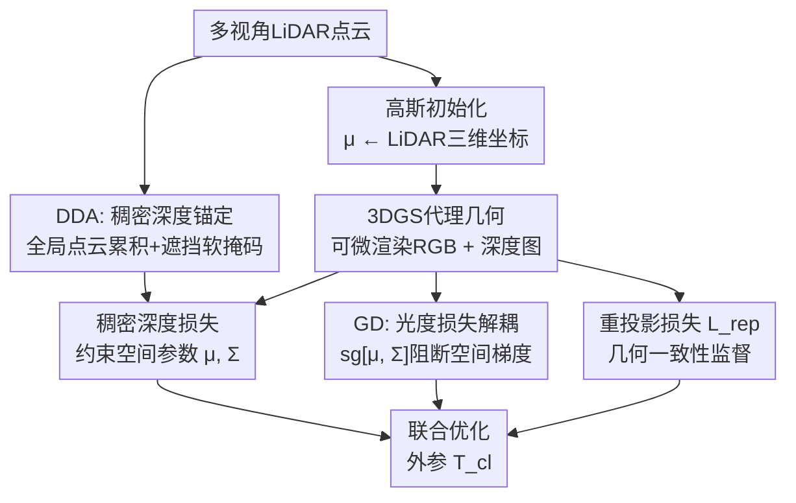

# Geometry-Preserving in 3D Gaussian Splatting for LiDAR-Camera Extrinsic Calibration

**会议**: ECCV 2026  
**arXiv**: [2606.20103](https://arxiv.org/abs/2606.20103)  
**代码**: 无  
**领域**: 自动驾驶  
**关键词**: 3D高斯泼溅, 激光雷达-相机外参标定, 无目标标定, 几何保持, 梯度解耦  

## 一句话总结
提出 GeoP-Calib，通过稠密深度锚定（DDA，多视角 LiDAR 点云累积构建稠密深度先验）和梯度解耦（GD，阻断光度损失对高斯空间参数的反传）两条设计，缓解 3DGS 标定中的"几何衰退"问题，在 KITTI-360 和 KITTI 上平移误差显著优于现有无目标标定方法。

## 研究背景与动机
激光雷达-相机外参标定是多模态感知融合的基础——相机提供稠密语义，LiDAR 提供精确三维几何，但两者必须精确空间对齐才有意义。传统基于标定板的方法精度高但依赖人工布设，无法在系统运行中自动重标定。无目标方法利用场景中的边缘、结构线等跨模态几何特征自动标定，避免了人工干预，但受限于自然场景中可判别特征的稀疏性，在纹理贫乏或结构重复的环境中表现不稳定。

近两年的趋势是将整个场景重建进一个可微模型（如 3DGS），以稠密像素级监督替代稀疏特征匹配来优化外参。3DGS 的每个高斯原语可从 LiDAR 点初始化、继承其精确度量位置，再通过可微光栅化投影到相机成像平面，天然充当 LiDAR 坐标系与相机图像域之间的"几何代理"。然而 3DGS 原本为视角合成设计，优化天然倾向于提升渲染质量——优化器会自由调整高斯的位置和形状来降低光度残差，即使以扭曲底层几何结构为代价。已有方法虽用单帧 LiDAR 稀疏深度监督约束代理几何，但单帧投影仅覆盖图像极小部分像素，大部分区域在度量空间中不受约束，高斯在这些区域可以漂移而仍产出视觉合理的渲染图。本文将此现象命名为**几何衰退（Geometric Decay）**：高斯代理的度量结构逐渐丧失对 LiDAR 真实结构的忠实度，导致依赖度量准确性的外参标定退化。

**核心 idea**：同时从"正向加固"和"反向阻断"两条路径保护代理几何——用多视角 LiDAR 累积构建覆盖更广的稠密深度锚点（正向），并阻断光度损失对高斯空间参数（位置、协方差）的梯度反传（反向），让纹理驱动的渲染优化不能以牺牲几何保真度为代价。

## 方法详解

### 整体框架
GeoP-Calib 的核心思路是把 3DGS 代理几何的"形状维护"和"外观渲染"解耦：几何形状只由 LiDAR 深度监督驱动，外观颜色只由光度损失驱动，二者互不干扰。输入为多视角相机图像、LiDAR 点云序列及 LiDAR 的世界位姿，输出为优化后的 LiDAR-相机外参矩阵 $\mathbf{T}_{cl} \in SE(3)$。

具体流程：先以 LiDAR 点云初始化 3D 高斯（均值 $\mu$ 直接继承 LiDAR 点的三维坐标），然后进入两阶段优化。**几何预热阶段**仅用稀疏深度损失 $\mathcal{L}_{depth}^{sparse}$ 建立粗略的代理几何；**精化阶段**激活稠密深度锚定损失 $\mathcal{L}_{depth}^{dense}$（DDA 模块），同时全程对光度损失 $\mathcal{L}_{pho}^{decoupled}$ 施加梯度解耦（GD 模块），阻断其对 $\mu, \Sigma$ 的梯度，仅允许更新颜色参数 $\alpha, c$ 和外参 $\mathbf{T}_{cl}$。重投影损失 $\mathcal{L}_{rep}$ 不受 GD 限制，因为其梯度由深度诱导的几何重投影关系介导，主要促进视角一致的几何结构而非逐视角纹理拟合。

### 关键设计

**1. 稠密深度锚定（DDA）：以多视角累积构建刚性几何地基**

单帧 LiDAR 深度监督（公式 9）仅在 LiDAR 点投影覆盖的像素 $\Omega^t$ 上生效，这些像素占全图比例极小，其余区域的代理几何完全不受度量约束。DDA 的核心思路是将多帧 LiDAR 点云通过已知的 LiDAR 世界位姿 $\mathbf{T}_{lw}^t$ 全部变换到全局坐标系下累积：$\mathcal{P}_{global} = \bigcup_t (\mathbf{T}_{lw}^t)^{-1} \mathcal{P}^t$。再从当前 LiDAR 视角将 $\mathcal{P}_{global}$ 投影到成像平面，生成的稠密深度先验 $D_l^{dense}$ 覆盖的像素区域远超单帧，为高斯空间参数 $(\mu, \Sigma)$ 提供了大幅增强的度量约束。

多视角累积不可避免地引入遮挡歧义：远处视角的 LiDAR 点可能被错误投影到前景物体上。本文注意到 3DGS 本身具备隐式的可见性感知——渲染深度 $D_{rend}$ 代表期望光线终止位置，可作为连续的遮挡判别信号。据此提出**体积软掩码（VSM）**，用 sigmoid 函数将渲染深度与累积深度的差异映射为软权重：

$$W_{vis}(\mathbf{p}) = \sigma\left(\beta \cdot \big(D_{rend}(\mathbf{p})(1+\tau) - D_l^{dense}(\mathbf{p})\big)\right)$$

其中 $\tau$ 是深度比例容差，$\beta$ 控制过渡锐度。若累积点远在渲染表面之后（$D_l^{dense} \gg D_{rend}$），权重趋近 0，平滑抑制被遮挡投影。最终稠密深度锚定损失以 VSM 加权、在逆深度域计算 L1 残差，并用有效性掩码 $M(\mathbf{p})$ 排除无渲染深度的像素：

$$\mathcal{L}_{depth}^{dense} = \frac{\sum_{\mathbf{p}\in\Omega^{dense}} M(\mathbf{p}) W_{vis}(\mathbf{p}) \Delta d^{inv}(\mathbf{p})}{\sum_{\mathbf{p}\in\Omega^{dense}} M(\mathbf{p}) W_{vis}(\mathbf{p}) + \epsilon}, \quad \Delta d^{inv}(\mathbf{p}) = \left|\frac{1}{D_{rend}(\mathbf{p})+\epsilon} - \frac{1}{D_l^{dense}(\mathbf{p})+\epsilon}\right|$$

在逆深度域计算残差的设计是实用 trick：对近处深度误差更敏感，且在深度范围跨度大时参数化更稳定。

**2. 梯度解耦（GD）：阻断光度纹理对代理几何的变形力**

3DGS 标定中，高斯数量通常受限于 LiDAR 体素化或点采样的预算，以维持与 LiDAR 初始化的度量对应关系。在这种受限代理分辨率下，细纹理的光度观测无法完全靠外观参数（颜色 $c$、不透明度 $\alpha$）解释，优化器会自然地通过修改几何参数（均值 $\mu$、协方差 $\Sigma$）来降低光度误差，以度量保真度为代价换取视觉合理渲染——这就是几何衰退的驱动机制。

GD 的做法极简：在光度损失的反传路径上对空间参数施加 stop-gradient 操作：

$$\mathcal{L}_{pho}^{decoupled} = \mathcal{D}_{photo}\big(I^t, \Phi_{color}(\text{sg}[\mu, \Sigma], \alpha, c, \mathbf{T}_{cl} \cdot \mathbf{T}_{lw}^t)\big)$$

这在实现上等价于把 $\mu, \Sigma$ 当作常数参与颜色渲染，光度损失的梯度只能流向 $\alpha, c$（外观）和 $\mathbf{T}_{cl}$（外参），无法触及代理几何的形状。一张图解释就是：颜色匹配做不好，优化器只能调颜色或调外参，不能挪高斯位置来"凑"。

**3. 选择性梯度阻断策略**

GD 并非一刀切阻断所有图像域损失对空间参数的梯度。重投影损失 $\mathcal{L}_{rep}$ 虽然也使用光度距离度量，但它比较的是真实图像强度在深度诱导的对应像素上的差异，不涉及学习得到的高斯颜色属性 $c$。其梯度通过重投影几何关系 $\mathbf{p}^{t} \rightarrow \tilde{\mathbf{p}}^{t+s}$（公式 5）间接影响 $\mu, \Sigma$，主要促进视角间几何一致性，而非逐视角的纹理过拟合。Fig. 1(c) 的实验证据支撑了这一点：光度损失激活后深度损失急剧上升，而后续激活重投影损失并未引发类似的退化。因此 GD 仅阻断 $\mathcal{L}_{pho}$ 对 $(\mu, \Sigma)$ 的梯度，保留 $\mathcal{L}_{rep}$ 的完整梯度通路，在利用图像域监督的同时控制了几何衰退。

### 损失函数 / 训练策略

GeoP-Calib 的最终优化目标为四部分加权和：

$$\mathcal{L}_{total}^{GP} = \mathcal{L}_{pho}^{decoupled} + \lambda_{rep}\mathcal{L}_{rep} + \lambda_{depth}^{sparse}\mathcal{L}_{depth}^{sparse} + \lambda_{depth}^{dense}\mathcal{L}_{depth}^{dense}$$

其中 $\mathcal{L}_{pho}^{decoupled}$ 为经 GD 处理的光度对齐损失（像素级 L1），$\mathcal{L}_{rep}$ 为跨视角重投影一致性损失，$\mathcal{L}_{depth}^{sparse}$ 为旋转外参下的单帧稀疏深度锚定损失（公式 9），$\mathcal{L}_{depth}^{dense}$ 为 DDA 稠密深度锚定损失（公式 13）。

采用**两阶段优化调度**：（1）几何预热阶段仅用 $\mathcal{L}_{depth}^{sparse}$ 配合 $\mathcal{L}_{pho}^{decoupled}$ 和 $\mathcal{L}_{rep}$ 建立稳定粗几何；（2）精化阶段激活 $\mathcal{L}_{depth}^{dense}$，利用稠密深度锚点锁定高斯空间参数。GD 在两阶段全程生效。实现基于 HiGS-Calib 代码库，在 RTX 4070 Ti 上平均每序列约 15.4 分钟。

## 实验关键数据

### 主实验

在 KITTI-360（5 条序列，2 个前向相机取平均）和 KITTI odometry（5 条序列，仅 cam2）上评估，对比 GST（传统优化）、CLAIM（基础模型方法）、RobustCalib 和 HiGS-Calib（同为 3DGS 方法）。指标为旋转误差 $E_r$（度）和平移误差 $E_t$（米），括号内为标准差。

| 方法 | KITTI-360 Er(°) | KITTI-360 Et(m) | KITTI Er(°) | KITTI Et(m) |
|------|-----------------|-----------------|-------------|-------------|
| GST | 1.547 (1.570) | 0.315 (0.099) | 1.671 (0.892) | 0.278 (0.085) |
| CLAIM | 0.520 (0.303) | 0.129 (0.126) | 0.352 (0.074) | 0.082 (0.022) |
| RobustCalib | 0.255 (0.055) | 0.097 (0.028) | 0.352 (0.071) | 0.082 (0.022) |
| HiGS-Calib | 0.140 (0.059) | 0.103 (0.055) | 0.206 (0.053) | 0.055 (0.008) |
| **GeoP-Calib** | **0.121 (0.041)** | **0.063 (0.021)** | **0.188 (0.051)** | **0.044 (0.013)** |

GeoP-Calib 在 20 个序列-指标组合中 14 个取得最优。在 KITTI-360 上相对次优结果旋转提升 0.019 度、平移提升 0.034 米；在 KITTI 上旋转提升 0.018 度、平移提升 0.011 米。平移提升尤为显著——GeoP-Calib 在 KITTI-360 全部 5 条序列的平移误差均低于 HiGS-Calib，说明几何保真度对平移分量（依赖深度尺度的度量准确性）的贡献更大。

### 消融实验

在 KITTI-360 上的组件消融（下表，均值为 5 条序列聚合）。VSM 是 DDA 的子组件，不独立存在。

| 配置 | GD | DDA | VSM | Er(°) | Et(m) | 时间(s) |
|------|----|-----|-----|-------|-------|---------|
| Base | | | | 0.122 (0.031) | 0.077 (0.022) | 875 (16) |
| +DDA | | ✓ | | 0.117 (0.044) | 0.068 (0.021) | 923 (16) |
| +GD | ✓ | | | 0.127 (0.042) | 0.067 (0.022) | 866 (21) |
| +GD+DDA (w/o VSM) | ✓ | ✓ | | 0.124 (0.045) | 0.066 (0.024) | — |
| **+GD+DDA+VSM（完整）** | ✓ | ✓ | ✓ | **0.121 (0.041)** | **0.063 (0.021)** | 922 (21) |

Base → +DDA：平移从 0.077 降至 0.068（降 0.009 m），旋转微降至 0.117（降 0.005 度）；Base → +GD：平移降至 0.067（降 0.010 m），旋转反而微增至 0.127（增 0.005 度，但在标准差范围内可忽略）；完整模型平移 0.063（相对 Base 降 0.014 m）、旋转 0.121（相对 Base 降 0.001 度）。DDA 额外增加约 50 秒运行时间。VSM 在 GD+DDA 基础上额外贡献 0.003 度旋转改善和 0.003 米平移改善，证实遮挡处理对稠密深度监督的一致性收益。

### 关键发现
- **平移收益大于旋转**：GD 和 DDA 的消融均显示平移改善幅度远超旋转，说明几何衰退主要伤害依赖深度一致性的平移分量，旋转分量受纹理信息辅助更大。
- **渲染质量不等于标定质量**：GeoP-Calib 的渲染 PSNR 低于 Base 管线，但标定精度更高。这直接证明光度保真度不是标定精度的充分条件——渲染得好不等于对齐得准。
- **几何精度量化验证**：收敛后深度 MAE（渲染深度 vs LiDAR 深度）GeoP-Calib 为 0.244，Base 为 0.294，绝对降低 0.05（约 17%），且误差分布更均匀，避免了 Base 中局部误差急剧升高的几何衰退现象。
- **噪声鲁棒性**：在旋转扰动 1-9 度、平移扰动 0.1-0.9 米的初始化噪声范围内，GeoP-Calib 均能稳健收敛，未出现发散或精度崩溃。

## 亮点与洞察
- **问题诊断精准**："几何衰退"概念的提出和分析（Fig. 1 的三联图 + 定量深度损失曲线）直接且有力，清楚展示了光度优化如何伤害几何保真度，为后续设计提供了干净的对齐目标。
- **解法极简而完备**：DDA（正向加固）+ GD（反向阻断）构成一个完整的保护闭环，两个设计相互正交且互补——DDA 提供刚性度量约束，GD 防止约束被破坏，缺一不可。消融实验完美验证了这一互补性（Base 0.077/0.122，+DDA 0.068/0.117，+GD 0.067/0.127，二者合体 0.063/0.121）。
- **stop-gradient 是高度可复用的 trick**：任何涉及"场景表示作为优化中介"的任务（如位姿估计、SLAM、NeRF/3DGS-based 注册），只要几何精度和外观质量存在冲突，GD 思路都可以低成本植入——在渲染路径上对相关参数加一行 `detach()` 即可。
- **VSM 的"以己之盾防己之矛"设计哲学巧妙**：用 3DGS 自身的渲染深度作为遮挡判别信号来指导 LiDAR 点云累积的过滤，不需要额外的可见性推理模块，是"场景表示既是代理也是滤波器"的自洽设计。

## 局限与展望
- **旋转增益有限**：作者承认，GD 虽然有效阻断了几何衰退，但也可能限制了优化对纹理线索的利用程度，导致旋转维度的提升相对有限。这是方法设计的内在折中。
- **稠密累积对位姿精度敏感**：DDA 依赖 LiDAR 世界位姿 $\mathbf{T}_{lw}^t$ 将多帧点云变换到全局坐标，若 SLAM/里程计位姿本身有误差，累积点云会出现错位，进而污染深度锚点的准确性。论文未讨论位姿噪声对 DDA 的影响。
- **单序列标定假设**：GeoP-Calib 在当前序列内联合优化场景和外参，不跨序列共享。这意味着每个新场景需要独立运行一次优化（约 15 分钟），无法像回归方法那样即时推理。
- **可能的改进方向**：（1）引入自适应 GD——在纹理丰富区域适度放通部分空间梯度，在纹理贫乏区域严格阻断，以兼顾几何保真度和旋转精度；（2）用鲁棒位姿图优化替代直接累积，降低 SLAM 漂移对 DDA 的影响；（3）探索将训练好的代理几何复用于多序列标定，摊销优化开销。

## 相关工作与启发
- **vs HiGS-Calib [zhang2025higs]**：同为 3DGS 标定方法，HiGS 采用层级式粗到细架构并将场景建模与外参精化解耦，但未显式解决几何衰退问题。GeoP-Calib 的 DDA+GD 可以视为对 HiGS 的"几何保真度补丁"，与 HiGS 的解耦架构正交可叠加。事实上 GeoP-Calib 就是基于 HiGS 代码库搭建的。
- **vs RobustCalib [zhou2025robust]**：RobustCalib 使用 2D Gaussian Splatting 并通过重投影和三角化损失精化外参。GeoP-Calib 的发现——重投影损失不加剧几何衰退（Fig. 1c）——间接支持了 RobustCalib 的设计选择。
- **vs NeRF-based 标定 [zhou2023inf, yang2024unical]**：NeRF 同样面临光度-几何冲突，但体渲染的计算开销使其难以进行大规模实验验证。GeoP-Calib 在 3DGS 框架下以更低成本量化了这一冲突，对 NeRF 标定也有启示意义。
- **vs 3DGS-based SLAM**：3DGS-SLAM 同样需要维护几何一致性，GD 的思路（阻断纹理梯度对地图几何的干扰）可以自然迁移到在线 SLAM 场景。

## 评分
- 新颖性: ⭐⭐⭐⭐ — "几何衰退"概念诊断准确且有实验支撑，GD+DDA 解法简洁，概念价值大于技术复杂度
- 实验充分度: ⭐⭐⭐⭐ — 双数据集 10 条序列 + 完整消融 + 噪声鲁棒性 + 渲染质量 vs 标定质量 + 深度 MAE，覆盖全面
- 写作质量: ⭐⭐⭐⭐ — 问题定义（Sec 3）递进清晰，Fig. 1 对几何衰退的演示直观有效，方法描述公式与直觉互相支撑
- 价值: ⭐⭐⭐⭐ — 解决 3DGS 标定中真实存在的痛点，GD 和 DDA 均可独立复用到其他以 3DGS/NeRF 为几何代理的位姿优化任务上

<!-- RELATED:START -->

## 相关论文

- [\[CVPR 2026\] ParkGaussian: Surround-view 3D Gaussian Splatting for Autonomous Parking](../../CVPR2026/autonomous_driving/parkgaussian_surround-view_3d_gaussian_splatting_for_autonomous_parking.md)
- [\[ECCV 2026\] 2K Retrofit: Entropy-Guided Efficient Sparse Refinement for High-Resolution 3D Geometry Prediction](2k_retrofit_entropy-guided_efficient_sparse_refinement_for_high-resolution_3d_ge.md)
- [\[ICCV 2025\] Splat-LOAM: Gaussian Splatting LiDAR Odometry and Mapping](../../ICCV2025/autonomous_driving/splat-loam_gaussian_splatting_lidar_odometry_and_mapping.md)
- [\[CVPR 2026\] Generalizing Visual Geometry Priors to Sparse Gaussian Occupancy Prediction](../../CVPR2026/autonomous_driving/generalizing_visual_geometry_priors_to_sparse_gaussian_occupancy_prediction.md)
- [\[CVPR 2025\] RC-AutoCalib: An End-to-End Radar-Camera Automatic Calibration Network](../../CVPR2025/autonomous_driving/rc-autocalib_an_end-to-end_radar-camera_automatic_calibration_network.md)

<!-- RELATED:END -->
