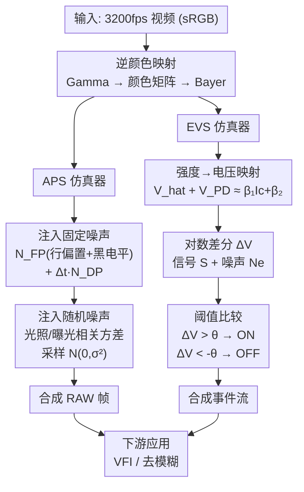

# 混合事件-帧传感器：统一噪声建模、标定与仿真

**会议**: ECCV 2026  
**arXiv**: [2511.18037](https://arxiv.org/abs/2511.18037)  
**代码**: [https://yunfanlu.github.io/HESIM](https://yunfanlu.github.io/HESIM)  
**领域**: 自动驾驶  
**关键词**: 混合传感器, 事件相机, 噪声建模, 传感器标定, H-ESIM

## 一句话总结

提出首个混合事件-帧传感器的统一统计噪声模型与标定管线，并构建了能生成与真实传感器噪声分布一致的 RAW 帧和事件流的仿真器 H-ESIM，在视频插帧和去模糊任务上验证了仿真到真实的迁移能力。

## 研究背景与动机

事件相机因其异步触发机制，天然具备高动态范围（HDR）和微秒级低延迟特性，在高速运动、低光照等极端场景下比传统帧相机更具鲁棒性。然而纯事件相机只能输出亮度变化信号，无法提供场景的绝对强度信息。帧相机则恰好相反——它能捕获稠密的空间强度信息，但在快速运动时会出现运动模糊。将两者互补的优势结合起来一直是计算机视觉的追求。传统做法是用分束器（beam splitter）将同一光束分给事件相机和帧相机，但这种方法需要精密的光学对准，导致系统笨重、不适用于移动平台。近年来半导体工艺的进步催生了**混合传感器**（hybrid event–frame sensor）：将事件像素（EVS）和有源像素（APS）集成在单芯片上，实现紧凑、天然时空对齐的双模态输出。然而，APS 和 EVS 共享电路层引入了复杂的噪声模式——固定的行噪声、暗电流漂移、光子散粒噪声、量化噪声等相互耦合，而现有的相机噪声模型和事件仿真器（如 ESIM、v2e）都只针对纯帧相机或纯事件相机设计，无法描述混合架构中的耦合噪声。

核心矛盾在于：混合传感器的噪声不是 APS 噪声与 EVS 噪声的简单叠加。共享的光电二极管和读出电路导致两种模态的噪声在光照、曝光时间和温度等多个维度上相互依赖——APS 的固定模式噪声会通过共享的偏置电路影响 EVS 的触发概率，而 EVS 的暗电流噪声又会在 APS 的 RAW 帧中表现为额外的暗区不均匀性。要精确模拟这种耦合，需要一个能统一描述 APS 和 EVS 噪声行为的统计模型，以及一套能从真实传感器采集数据中估计模型参数的标定方法。本文的切入角度是：既然 APS 和 EVS 共享同一光学信号（场景辐照度），那就从物理源头出发，把共享信号作为纽带，为两路传感器分别建立噪声模型，再通过控制变量的标定实验把每个噪声分量的参数一一估计出来。**核心 idea：提出第一个混合事件-帧传感器的统一统计成像噪声模型，涵盖光子散粒噪声、暗电流噪声、固定模式噪声和量化噪声，并据此构建标定管线与仿真器 H-ESIM，使仿真数据与真实混合传感器输出的噪声统计特性高度一致。**

## 方法详解

### 整体框架

H-ESIM 的整体架构是一个从高帧率视频输入到同步输出 APS RAW 帧和 EVS 事件流的端到端仿真管线，核心依赖两个前置模块：统一噪声模型和标定管线。噪声模型定义了 APS 和 EVS 各自受哪些噪声分量影响、这些分量如何表示为可参数化的统计分布；标定管线则通过控制变量的数据采集（暗场+多曝光+多亮度）从真实传感器中估计出模型参数。有了这两个前置基础，H-ESIM 的仿真分两条并行路径进行——APS 路径将输入的 sRGB 高帧率视频经逆 Gamma 矫正、逆颜色矩阵、白平衡逆变换和 Bayer 重排后，逐像素注入标定得到的固定噪声和光照/曝光相关的随机噪声，输出合成 RAW 帧；EVS 路径将同一像素强度映射到电压域，计算对数亮度差值，注入带噪声参数的随机采样，最终通过阈值比较输出 ON/OFF 事件。两条路径的噪声参数来源于同一套标定流程，保证了跨模态噪声的一致性。

### 关键设计

**1. 统一统计噪声模型：用共享信号将 APS 和 EVS 的噪声纳入同一框架**

混合传感器的 APS 和 EVS 共用同一光学系统（镜头、光圈），因而理想电信号 $I_c(t;\Delta t)$ 是两路传感器的共享输入。APS 对该信号做积分采样输出 RAW 帧，EVS 则做对数域的差分-阈值比较输出事件。两者的根本差异在于采样方式，而非信号源。本文据此将 APS 输出建模为理想信号叠加三个噪声项：光照依赖的光子散粒噪声 $N_{\text{shot}}$（泊松→高斯近似）、曝光时间依赖的暗电流噪声 $N_{\text{time}}$（含线性漂移和散粒噪声）、以及固定噪声 $N_{\text{fixed}}$（含行偏置、黑电平校正、读噪声、量化噪声），得到 $I_o = I_c + N_{\text{shot}}(I_c) + N_{\text{time}}(\Delta t) + N_{\text{fixed}}$。对于 EVS，其触发条件 $\Delta V_{t_1} > \theta$ 中的电圧差被分解为信号项 $S$（由理想电压决定）和噪声项 $N_e$（由散粒、暗电流、固定偏移构成），并引入 QQ 函数 $Q(x)=\frac{1}{\sqrt{2\pi}}\int_x^\infty e^{-t^2/2}dt$ 将事件触发概率 $P_+ = P(\Delta V > \theta) = Q((\theta-(S+\mu_n))/\sigma_n)$ 与光照和暗电流参数显式地联系起来。这一模型的关键贡献在于：它首次给出了 EVS 噪声与场景亮度和暗电流之间的解析关系，而不仅仅是经验性的手调参数。

**2. 控制变量标定管线：从真实传感器数据中逐层分离噪声参数**

标定基于两类数据：暗场数据（镜头全遮）和光照数据（静止多亮度图案，如棋盘格、色卡、分辨率卡）。流程分为两步：先标定 APS 噪声参数，再以此为基础标定 EVS 噪声参数。APS 标定时，利用多曝光暗场帧的均值对曝光时间做线性回归，分离出暗电流漂移 $N_{\text{DP}}$ 和固定模式噪声 $N_{\text{FP}}$（进一步分解为行偏置 $N_{\text{row}}$ 和逐像素黑电平 $N_{\text{BLC}}$）。对于光照数据，先用标定的暗成分做偏置校正，再对校正后帧的逐像素方差用二阶多项式 $\text{Var}(N_a) = \beta_0 + \beta_1 I_c + \beta_2 \Delta t + \beta_3 I_c^2 + \beta_4 I_c \Delta t + \beta_5 \Delta t^2$ 做最小二乘拟合，得到 16 组 Quad-Bayer 内的位置相关系数。EVS 标定的核心挑战是跨域映射：APS 的强度域 $I_c$ 需要映射到 EVS 的电压域 $\hat{V}_t$。本文采用仿射映射 $\hat{V}_t + V_{\text{PD}} \approx \beta_1 I_c + \beta_2$，同时将 EVS 噪声参数建模为 $\sigma_{\text{shot}} = \beta_3 I_c$、$\sigma_{\text{DCSN}} = \beta_4$、$\rho = -\beta_5$，代入 QQ 函数反函数形式 $Q^{-1}(P)$ 做梯度下降优化，一次性估计参数集 $\boldsymbol{\beta}_e$。这套标定管线输出的不仅有噪声参数，还有一个坏像素掩码（处理 $\mu_n \neq 0$ 的缺陷像素），是后续仿真准确性的基础。

**3. H-ESIM 仿真器：用标定参数驱动 APS 和 EVS 的协同噪声注入**

得到标定参数后，H-ESIM 的仿真流程是一个"先共享、后分支"的结构。共享阶段：将输入 sRGB 帧经逆 Gamma、逆颜色矩阵、逆白平衡映射到线性强度域，再按 Quad-Bayer 模式重排为单通道 RAW 格式。APS 分支：先注入固定噪声 $N_{\text{FP}} = N_{\text{row}} + N_{\text{BLC}}$ 和暗电流漂移 $\Delta t \cdot N_{\text{DP}}$，再按照式 (9)(10) 从光照/曝光依赖的高斯分布中采样随机噪声，最后量化到位深输出 RAW 帧。EVS 分支：复用共享阶段的每像素强度 $I_c$，通过仿射映射得到电压 $\hat{V}_t + V_{\text{PD}}$，计算相邻时刻的对数差分 $\Delta V_{t_1}$ 并将噪声 $N_e \sim \mathcal{N}(\mu_n, \sigma_n^2)$ 叠加到信号项 $S$ 上，然后与阈值 $\theta$ 比较决定是否触发事件（$+\!1$ 或 $-\!1$）。APS 和 EVS 使用同一组 $I_c$ 输入，意味着两路输出的噪声在光照依赖性上保持一致——这是与先分别仿真再融合的方法的本质区别。此外，H-ESIM 使用 3200 fps 的高帧率视频作为输入，避免了 ESIM/v2e 中因帧插值导致的时间伪影。

### 损失函数 / 训练策略

H-ESIM 本身是仿真器，不涉及训练损失函数。下游任务的网络（如 TimeLens-XL、HR-INR、eSL、EFNet）在 H-ESIM 生成的仿真数据上微调时使用各自原始的损失函数（如 VFI 的 L1+感知损失、去模糊的对抗损失等）。标定阶段的参数估计使用最小二乘回归（APS）和梯度下降优化（EVS），其目标函数是使模型预测的噪声方差或事件触发概率与实测值之间的误差最小化。

## 实验关键数据

### 主实验

作者在两个混合传感器（AlpsenTek GEN2 和 Eiger）上评估了 H-ESIM，分别从时间精度（视频插帧 VFI）和空间保真度（视频去模糊）两个维度衡量仿真数据的真实度。VFI 任务采用跳帧设定（移除中间帧，用两相邻帧+事件预测），去模糊任务因缺少真值清晰帧，使用无参考图像质量指标（CLIP-IQA、MUSIQ、NRQM）。

**表1：视频插帧结果（Eiger 传感器）**

| 指标 | TimeLens (ESIM) | TL-XL w/o | TL-XL w (H-ESIM) | HR-INR w/o | HR-INR w (H-ESIM) |
|------|-----------------|-----------|-------------------|------------|-------------------|
| PSNR↑ | 29.99 | 31.93 | 33.87 | 32.41 | **35.24** |
| SSIM↑ | 0.579 | 0.841 | 0.863 | 0.782 | **0.886** |
| LPIPS↓ | 0.404 | 0.302 | 0.168 | 0.198 | **0.079** |

在 Eiger 上，经 H-ESIM 微调的 HR-INR 相比未微调版本 PSNR 提升 2.83 dB，LPIPS 从 0.198 降至 0.079，说明仿真数据有效缩小了域差距。GEN2 上的结果趋势一致，HR-INR PSNR 从 34.26 提升至 35.52。TimeLens-XL 的 PSNR 也从 32.30 提升至 33.87。

**表2：去模糊结果（Eiger 传感器，无参考指标）**

| 方法 | Simulator | CLIP-IQA↑ | MUSIQ↑ | NRQM↑ |
|------|-----------|-----------|--------|-------|
| eSL w/o | [wu2025mipi] | 0.307 | 18.74 | 4.091 |
| eSL w | +H-ESIM | **0.435** | **22.97** | **5.899** |
| EFNet w/o | [wu2025mipi] | 0.221 | 16.83 | 3.797 |
| EFNet w | +H-ESIM | **0.425** | **21.52** | **5.108** |

eSL 经 H-ESIM 微调后 CLIP-IQA 从 0.307 跃升至 0.435（+42%），EFNet 从 0.221 提升至 0.425（+92%），表明空间域上仿真数据带来的改善同样显著。

### 消融实验

**噪声分量消融（定性分析）**

| 配置 | 关键发现 |
|------|---------|
| 完整 H-ESIM 模型 | 两种传感器上 VFI PSNR 最高，视觉伪影最少 |
| 仅 APS 噪声（无 EVS 噪声建模） | VFI 重建边缘出现孤立噪声点，类似未微调的 TL-XL |
| 仅 EVS 噪声（无 APS 固定噪声） | 重建图像整体亮度偏移（固定模式噪声未被补偿） |
| 使用 ESIM/v2e（无视混合传感器噪声） | 去模糊 CLIP-IQA 最低（~0.221~0.330），域差距最大 |

### 关键发现

- **EVS-APS 堆叠显著放大了固定模式噪声**：标定结果显示 Eiger 的有行噪声远强于 GEN2，因为其每 Quad-Bayer 内嵌 4 个带颜色滤波器的事件像素，对读出路径的干扰更大。
- **光照对 EVS 噪声的影响可用 QQ 函数解析刻画**：实验表明事件触发概率随亮度单调上升（与模型预测一致），且 ON/OFF 事件的比例在低亮度下略偏 ON，高亮度下随亮度变化——反映了阈值-亮度的非线性耦合，模型能复现这一趋势。
- **基于物理的仿真比纯数据驱动仿真更有效**：即使只是用 H-ESIM 微调，在域迁移上带来的提升也远大于用更多真实数据直接训练，说明模型抓住了混合传感器的核心噪声机制。

## 亮点与洞察

- **共享信号作为纽带的设计选择非常巧妙**：不分别建模 APS 和 EVS 的噪声然后硬融合，而是从源头（共享光学信号 $I_c$）出发分路建模，天然保证了噪声参数的内在一致性。这种"同一个根、两个分支"的建模哲学值得在处理任何多模态传感器融合问题时参考。
- **QQ 函数引入 EVS 噪声分析**：事件触发本质上是一个概率过程（电压噪声总是存在），用 QQ 函数将阈值、噪声方差和事件概率显式关联，比 ESIM/v2e 的手调阈值方案在物理上和统计上都更严谨。这个工具未来可以推广到任何依赖阈值比较的神经形态传感器建模中。
- **3200 fps 高帧率视频作为输入消除插值伪影**：ESIM/v2e 的低帧率输入需要帧间插值，插值本身引入的伪影会通过事件触发机制被放大。H-ESIM 直接用高速视频数据规避了这个问题，是一个简单但实用的工程贡献。
- **开源 ISP 库**：H-ESIM 配套的 NumPy ISP 实现（含黑电平校正、去马赛克、颜色矫正、Gamma/Tone Mapping）让 RAW↔sRGB 变换完全透明可复现，有助于社区在此基础上做更深入的传感器建模工作。

## 局限与展望

- **极端条件未覆盖**：模型在高动态范围极端端（极低光、极高温、带宽受限）下的准确性尚未验证。这些条件下高斯近似可能失效，泊松分布与倍增噪声的联合建模有待后续工作。
- **标定管线需专用数据集**：每款传感器需要采集暗场+多亮度+多曝光的专用数据集，流程较为复杂。能否设计一种"零拍摄"标定方案（如仅凭传感器出厂参数或少量随手拍数据）是实用化的重要方向。
- **PRNU 未单独建模**：Photo Response Non-Uniformity（像素间灵敏度差异）被吸收进了逐位置系数 $\boldsymbol{\beta}_a$ 中，没有显式分离。对于需要精确空间一致性的应用（如科学成像、高精度 3D），PRNU 的单独建模可能是必要的。
- **下游任务验证集中在 VFI 和去模糊**：更多混合传感器任务（如 HDR 重建、光流估计、SLAM）上的仿真到真实迁移尚未验证，H-ESIM 的泛用性有待进一步测试。

## 相关工作与启发

- **vs ESIM / v2e**: ESIM 和 v2e 是纯事件相机仿真器，使用手调阈值和帧插值生成事件，不提供 APS 帧噪声建模，也不支持跨噪声参数的一致性。H-ESIM 是第一个将 APS 和 EVS 统一在统计模型下的仿真框架。
- **vs DVS-Voltmeter / ADV2E / PECS**: 这些物理仿真器关注事件触发机制的不同物理细节（如 Brownian motion、二阶电路模型），但不涉及混合传感器架构和 APS- EVS 噪声耦合。H-ESIM 将物理建模的精度扩展到了多模态场景。
- **vs [wu2025mipi]**: MIPI 混合传感器数据集的采集工作，为本文提供了部分测试数据。本文在此基础上增加了噪声建模和仿真能力，从"数据提供"走向了"模型驱动"。
- **vs 传统相机噪声模型（如 [wei2020physics]）**: 标准相机的噪声建模通常只针对 RAW 帧。本文将其扩展到混合传感器场景，新增了 EVS 噪声的解析建模和 QQ 函数相关的标定方法。

## 评分

- 新颖性: ⭐⭐⭐⭐⭐ [首次提出混合事件-帧传感器的统一统计噪声模型、完整标定管线和端到端仿真器，填补了领域空白]
- 实验充分度: ⭐⭐⭐⭐⭐ [在两个传感器上进行 VFI 和去模糊评估，含定量对比、消融分析、参数稳定性分析，验证充分]
- 写作质量: ⭐⭐⭐⭐ [框架清晰，公式推导完整，但部分符号注解可更直观]
- 价值: ⭐⭐⭐⭐⭐ [为混合传感器研究提供了理论模型和可复现工具链，对自动驾驶、机器人、移动视觉等大量使用事件相机的领域有直接推动]

<!-- RELATED:START -->

## 相关论文

- [\[ECCV 2026\] HilDA: Hierarchical Distillation with Diffusion for Advancing Self-Supervised LiDAR Pre-training](hilda_hierarchical_distillation_with_diffusion_for_advancing_self-supervised_lid.md)
- [\[ECCV 2026\] FLM-Occ: Feed-forward Likelihood Maximization for Efficient Indoor Occupancy Prediction](flm-occ_feed-forward_likelihood_maximization_for_efficient_indoor_occupancy_pred.md)
- [\[ECCV 2026\] LaGen: Towards Autoregressive LiDAR Scene Generation](lagen_towards_autoregressive_lidar_scene_generation.md)
- [\[ECCV 2026\] DriveVA: Video Action Models are Zero-Shot Drivers](driveva_video_action_models_are_zero-shot_drivers.md)
- [\[ECCV 2026\] ASTAD: 非对称风格迁移实现自动驾驶合成到真实域的适应](astad_asymmetric_style_transfer_for_synthetic-to-real_adaptation_in_autonomous_d.md)

<!-- RELATED:END -->
