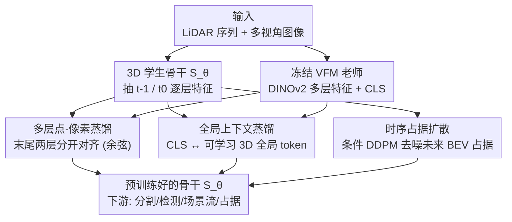

# HilDA: Hierarchical Distillation with Diffusion for Advancing Self-Supervised LiDAR Pre-training

**会议**: ECCV 2026  
**arXiv**: [2606.20189](https://arxiv.org/abs/2606.20189)  
**代码**: [https://maxiuw.github.io/hilda](https://maxiuw.github.io/hilda)  
**领域**: 自动驾驶 / 自监督 / 跨模态知识蒸馏  
**关键词**: 自动驾驶, LiDAR 预训练, 跨模态蒸馏, 视觉基础模型, 占据扩散

## 一句话总结
HilDA 用视觉基础模型（VFM）的「分层语义结构 + CLS 全局上下文」而非只用最后一层特征来蒸馏 LiDAR 骨干网络，并额外挂一个「预测未来 BEV 占据」的条件扩散任务补齐时空几何信息，在跨模态蒸馏的分割、检测、场景流、语义占据多个下游任务上刷新 SOTA。

## 研究背景与动机
自动驾驶的 3D 感知长期受困于标注瓶颈：LiDAR 点云几何精确但语义稀疏、没有纹理，而人工逐帧标注既贵又无法覆盖真实世界里几何与运动的组合爆炸。近两年的主流思路是把图像上训练好的视觉基础模型（DINOv2 这类 VFM）当老师，用相机-LiDAR 的标定对应关系，把稠密语义特征从 2D「蒸馏」进 3D 骨干，作为一种自监督预训练。这类方法（SLidR、Seal、ScaLR、CleverDistiller、LiMA 等）已经证明能让 3D 网络继承对域偏移和恶劣天气都鲁棒的语义表征。

但作者观察到一个共性缺陷：现有方法几乎都只蒸馏 VFM **最后一层**的输出特征，把老师当成一个黑箱。这带来两个损失。其一，ViT 的语义是逐层递进构建的——中间层往往对下游任务更有用，只盯最后一层等于丢掉了「特征是怎么一层层长出来的」这条信息链。其二，ViT 的 CLS token 编码了整幅场景的全局语境（比如这是高速还是住宅区、哪些物体更显著），而现有蒸馏一律把 CLS 丢掉，只做逐点-逐像素的局部对齐。除此之外，图像 VFM 天生缺 3D 几何和时间线索：有些工作试图加一个「占据预测」辅助任务来补，但它们用的是逐体素二值交叉熵这种判别式监督，只建模局部边缘分布，对「全局一致的 3D 结构」和「物体时序恒存性」没有显式激励。

于是本文把两条思路拧到一起。语义侧，与其只学老师的最终答案，不如学它「怎么想」——同时蒸馏多层中间特征和全局 CLS token，作者称之为**分层蒸馏（hierarchical distillation）**。几何时序侧，与其用判别式的逐体素占据，不如用生成式的扩散去建模占据的联合分布：把「预测未来占据」写成条件去噪，让模型在由粗到细的去噪过程中内化空间流形和运动。**核心 idea：把 VFM 的语义（semantic *what*）通过多层 + CLS 分层蒸馏灌进 LiDAR 骨干，再用一个预测未来 BEV 占据的条件扩散任务补上生成式的几何时序（geometric *where*），二者协同得到既懂语义又懂结构的 3D 表征。**

## 方法详解

### 整体框架
HilDA 是一个纯自监督的 LiDAR 骨干预训练框架，输入是同步的多视角相机图像 + LiDAR 序列（三帧 $\{t_{-1}, t_0, t_1\}$，只从过去/当前两帧 $\{t_{-1}, t_0\}$ 抽特征，未来帧 $t_1$ 只当占据预测的目标），输出是一个训练好的 3D 骨干 $S_\theta$（默认 MinkUnet34）；推理时把所有预训练用的额外组件全部丢弃，只留骨干做下游感知。整个预训练由三个同时优化的自监督目标驱动：一个冻结的 VFM（DINOv2）当老师，先做**多层点-像素蒸馏**传递逐层递进的局部语义，再做**全局上下文蒸馏**把老师的 CLS token 对齐到一个可学习的 3D 全局 token，最后挂一个**时序占据扩散**任务，以过去两帧的骨干特征为条件去噪出未来的 BEV 占据。前两者构成「分层蒸馏」，负责 semantic *what*；后者负责 geometric *where*。

### 关键设计

**1. 多层蒸馏：不只学老师的最终答案，还学它怎么一层层构建语义**

现有跨模态蒸馏只对齐 VFM 最后一层，等于放弃了中间层里「特征逐步抽象」的信息链，而这些中间表征对很多下游任务反而更好用。HilDA 的做法是把老师若干层的特征分别蒸馏进学生对应的层（默认用末尾两层），让 3D 学生模仿老师「怎么形成特征」而不只是「形成了什么特征」。具体靠几何标定建立点-像素对应：用相机内参和 LiDAR→相机的变换把 3D 点投到像素平面，得到有效点-像素对集合 $\mathcal{M}_c$，再对每一层、每台相机、每个点-像素对最小化余弦距离——学生点特征先过一个轻量的、层专属的 MLP $\mathcal{H}_\ell$ 对齐维度，再和老师像素特征比方向：

$$\mathcal{L}_{\text{distill}} = \frac{1}{V(K{+}1)} \sum_{\ell=L-K}^{L} \sum_{c=1}^{V} \frac{1}{|\mathcal{M}_c|} \sum_{(i,j)\in\mathcal{M}_c} \left( 1 - \frac{\mathcal{H}_\ell(\mathbf{f}_{i,\ell}) \cdot \mathbf{q}_{j,\ell,c}}{\|\mathcal{H}_\ell(\mathbf{f}_{i,\ell})\|_2 \, \|\mathbf{q}_{j,\ell,c}\|_2} \right)$$

一个关键的设计选择是作者称的 **Separate late-layer matching**：只把**相邻的末尾层**分开配对（$Q_L{\to}F_L$、$Q_{L-1}{\to}F_{L-1}$），而不是往更早的层延伸、也不是把多层特征拼成一个目标。原因是 MinkUnet34 早期层聚合的是更粗、更不规则的 3D 邻域，稀疏体素可能投到语义上不同的区域；而过早的 VFM 层抽象程度又和 LiDAR 的晚期特征对不上。消融显示（Tab. 8）末两层分开配对（53.8 LP）明显优于只用最后一层（46.4）或只用倒数第二层（49.9），也优于 KR-style 滑窗聚合、拼接聚合和跳层匹配——收益来自「保留抽象程度相容的晚层对应」，而不是单纯堆更多老师特征。用余弦而非 $\ell_2$/KL 也很关键：ViT 老师和 Minkowski 学生架构、特征范数分布都不同，余弦只监督语义方向、不强求跨架构的尺度匹配。

**2. 全局上下文蒸馏：把老师的 CLS token 灌成 LiDAR 的一个可学习全局 token**

逐点-逐像素的局部蒸馏能对齐细粒度语义，却抓不住整幅场景的全局语境（例如区分高速环境和住宅区），而 ViT 恰恰把这种全局信息压在 CLS token 里，现有方法却一律丢弃。HilDA 补上这一块：老师侧，取所有相机图像最后一层的 CLS token 做 max-pooling，构成一个统一的视觉场景描述子 $\text{CLS}_{Q_L}$；学生侧，专门设计一个 3D 全局「token」——把骨干最后一层的点特征过一个专用 MLP 投影头 $\mathcal{H}_{\text{CLS}}$，再对全场所有点做全局 max-pooling 得到 $\text{CLS}_{F_L}$，然后用 MSE 把二者对齐：

$$\mathcal{L}_{\text{cls}} = \| \text{CLS}_{F_L} - \text{CLS}_{Q_L} \|_2^2$$

这一项相当于一个场景级正则，逼着 3D 骨干去聚合全局上下文，而 max-pooling 会突出最活跃的响应、放大显著的视图级和点级激活。消融（Tab. 9）显示 max-pooling 优于可学习池化和逐视图/逐视锥的学生 CLS——全局对齐受益于「浮现最显著的响应」。此外这一项是**免标定对齐**的（不依赖点-像素投影），因此对 LiDAR-相机的错位不敏感，恰好弥补了局部蒸馏对错位敏感的短板。

**3. 时序占据扩散：把「预测未来占据」写成条件去噪，注入生成式的几何与运动先验**

蒸馏给了语义，但没有显式建模时空动态。作者加了一个免标签的辅助任务：用条件扩散预测未来 BEV 占据，逼骨干学到有预测性的空间表征。给定过去两帧 $P_{t-1}, P_{t_0}$，$S_\theta$ 把它们编码成特征再塌缩成共享的稠密 BEV 历史特征图 $C_{\text{history}}$；未来帧 $P_{t_1}$ 变换到 $t_0$ 坐标系、去地面后投成二值 BEV 占据目标 $x_{\text{occ}}$。整个未来占据预测被表述成条件 DDPM 去噪：在扩散步 $\tau$ 把目标加噪成 $x_\tau = \sqrt{\bar\alpha_\tau}\,x_{\text{occ}} + \sqrt{1-\bar\alpha_\tau}\,\epsilon$，一个 2D UNet 去噪网络以历史特征为条件（通道拼接）预测噪声 $\epsilon_\theta(x_\tau, \tau, C_{\text{history}})$，用混合目标训练：

$$\mathcal{L}_{\text{diffusion}} = \underbrace{\mathbb{E}_{\tau,\epsilon,C_{\text{history}}}\left[ \| \epsilon - \epsilon_\theta(x_\tau, \tau, C_{\text{history}}) \|_2^2 \right]}_{\text{噪声预测}} + \lambda \underbrace{\| x_{\text{occ}} - \hat{x}_{\text{occ}} \|_2^2}_{\text{占据重建}}$$

第一项监督噪声预测，第二项（$\lambda$ 加权）提供互补的重建信号、在低噪声步改善条件效果。为什么用扩散而不用普通占据解码器？因为判别式的逐体素占据只建模局部边缘、对「全局一致的 3D 配置」没有激励；而占据在时空上本就是相关的连续结构、还要维持物体恒存性，扩散能联合建模占据分布，并通过跨噪声级的迭代去噪强加由粗到细（先全局结构、后局部细节）的场景级时空约束。消融（Tab. 9）直接对比：把扩散换成简单解码器（49.1）或 ALSO（54.7），都不如扩散（56.3）。而且这一项对动态/物体类的占据增益最大，因为未来占据直接监督了物体恒存性和短期运动。

### 损失函数 / 训练策略
HilDA 端到端联合优化三个目标，加权求和：

$$\mathcal{L}_{\text{total}} = \omega_{ds}\mathcal{L}_{\text{distill}} + \omega_{gl}\mathcal{L}_{\text{cls}} + \omega_{df}\mathcal{L}_{\text{diffusion}}$$

老师用 DINOv2（ViT-S/B/L），学生用 MinkUnet34（也支持 PTv3），只在 nuScenes 训练集上用同步 RGB-LiDAR + 标定预训练一次，**不用任何任务标注**；得到的骨干直接迁移到所有下游 benchmark，不在目标数据集上重新预训练。论文中 HilDA† 表示去掉扩散辅助损失的版本，用于凸显扩散的贡献（排名时排除，只让 HilDA 与前 SOTA 比）。

## 实验关键数据

### 主实验
跨模态蒸馏的 3D 语义分割主表（在 nuScenes 预训练，迁移到 nuScenes / SemanticKITTI / Waymo；MinkUnet34 骨干，LP = 线性探针）。数据稀缺场景（1%–10%）增益最明显：

| 场景（ViT-B 老师） | 指标 | HilDA | 之前 SOTA | 提升 |
|--------|------|------|----------|------|
| nuScenes LP | mIoU | 58.95 | 56.65 (LiMA) | +2.30 |
| nuScenes 1% | mIoU | 62.71 | 59.80 (CleverDistiller) | +2.91 |
| nuScenes 5% | mIoU | 70.19 | 66.44 (CleverDistiller) | +3.75 |
| SemanticKITTI 1% | mIoU | 53.44 | 51.48 (CleverDistiller) | +1.96 |
| Waymo 1% | mIoU | 53.89 | 53.56 (CleverDistiller) | +0.33 |

多任务迁移（同一 ViT-B/MinkUnet34 骨干，冻结或换初始化）也全面领先：

| 任务 | 数据集 | 指标 | HilDA | 之前最好 |
|------|--------|------|------|----------|
| 3D 检测 | KITTI 20% | mAP | 71.0 | 67.1 (CD) |
| 3D 检测 | nuScenes 20% | mAP | 57.9 | 55.1 (ScaLR) |
| 语义占据 3D | nuScenes | mIoU | 20.0 | 16.5 (CD) |
| 场景流 | Argoverse 2 | 3-way EPE Mean↓ | 0.021 | 0.024 (CD) |
| 鲁棒性 | nuScenes-C (LP) | mCE↓ / mRR↑ | 124.27 / 88.20 | 137.23 / 79.76 |

鲁棒性上 HilDA 在 Cross-Sensor 和 Snowy 这类重干扰、高稀疏的腐蚀下优势尤其大。

### 消融实验
组件分析（Tab. 7，base = ScaLR + MLP 投影头，指标为 nuScenes LP / 1% 等）：

| 配置 | Diff | Distill | CLS | nuSc LP | nuSc 1% |
|------|------|---------|-----|---------|---------|
| base | ✗ | ✗ | ✗ | 46.36 | 55.01 |
| (a) 只加扩散 | ✓ | ✗ | ✗ | 50.43 | 56.97 |
| (b) 只加多层蒸馏 | ✗ | ✓ | ✗ | 53.77 | 57.03 |
| (c) 多层+CLS | ✗ | ✓ | ✓ | 55.13 | 57.81 |
| (d) 扩散+多层 | ✓ | ✓ | ✗ | 55.53 | 59.04 |
| (e) 完整 HilDA | ✓ | ✓ | ✓ | **56.29** | **59.46** |

### 关键发现
- 扩散（a）和分层蒸馏（c）单独加都能显著提升 base，二者同开（e）达到最高，说明「判别式语义蒸馏」与「生成式时空扩散」是互补协同、而非冗余。
- 多层蒸馏的设计选择很敏感：末两层「分开配对」最好，往更早层延伸反而掉点——收益源于「保留抽象程度相容的晚层对应」，不是简单堆更多老师层。
- 蒸馏损失里余弦距离（56.3）远好于 $\ell_2$（53.8）和 KL（52.1），因为跨架构应监督语义方向而非尺度。
- 扩散带来的下游增益集中在动态/物体类（未来占据直接监督物体恒存性与短期运动）；地表类增益较小，因为去地面的 BEV 目标去掉了区分「地形 vs 人行道」的垂直线索。

## 亮点与洞察
- 「学老师怎么想，而不只是学它的答案」——把知识蒸馏从「对齐最后一层」升级成「对齐分层结构 + 全局 CLS」，这个视角可迁移到任何以大模型为老师的跨模态蒸馏（不限于 LiDAR）。
- 判别式（蒸馏）× 生成式（扩散）的配对很巧妙：扩散单独用会过度强调局部细节、削弱语义判别力，但配上强判别老师（DINOv2）就能既保语义又补几何，二者是「谁也替代不了谁」的互补。
- 全局 CLS 蒸馏是**免标定对齐**的，天然对 LiDAR-相机错位鲁棒，正好补上逐点蒸馏对错位敏感的短板——一个组件同时解决「全局语境缺失」和「错位敏感」两个问题。
- 「把预测未来占据写成条件去噪」把一个感知辅助任务变成了生成式的时空自监督信号，且全程无标签，思路可复用到其他需要时序一致性的 3D 预训练。

## 局限与展望
- 逐点-逐像素蒸馏对 LiDAR-相机标定错位敏感（作者承认），虽然全局上下文蒸馏和时序扩散部分缓解，但局部项本身的脆弱性没根除。
- 扩散目标建在去地面的 BEV 上，去掉了垂直信息，导致地表类语义（地形/人行道）区分增益有限；作者提出未来可把扩散扩展到 BEV 之外（如潜在扩散）以更好保留 3D 几何与时序。
- 多层配对目前是固定的启发式（末两层），层到层的匹配策略和损失权重都靠手工；作者展望用「学习式匹配 + 动态损失加权」来优化。
- 部分对比基线（LiMoE / LiMA）作者反映检查点/代码不可得，跨方法比较存在可复现性上的 caveat。

## 相关工作与启发
- **vs ScaLR / CleverDistiller**: 它们做直接特征对齐但只盯 VFM 最后一层、丢弃 CLS；HilDA 蒸馏多层 + CLS，捕捉语义的逐层演化和全局语境，数据稀缺场景增益尤其大。
- **vs LiMA**: LiMA 之前在线性探针上有明显优势（靠跨视角/长时序蒸馏），但 HilDA 在保持 LP 领先的同时给出更强的微调结果，说明分层蒸馏 + 时序扩散产出的表征更「多任务可迁移」。
- **vs 判别式占据预训练（ALSO / GASP 等）**: 它们用逐体素二值交叉熵，只建模局部边缘分布、缺全局一致性激励；HilDA 用条件扩散联合建模占据、通过迭代去噪强加场景级时空结构，消融里扩散 > 简单解码器 > ALSO。
- **vs SuperFlow / LiMoE（用语义先验/分组）**: 它们靠 SAM/OpenSeed 伪掩码等重先验来稳定蒸馏；HilDA 只用几何标定的点-像素对应、不需要额外的分组先验或数据规模扩张就取得更好效果。

## 评分
- 新颖性: ⭐⭐⭐⭐☆ 「分层蒸馏 + 生成式时序占据」是对成熟蒸馏范式的两处扎实且有洞察的升级，各组件非全新但组合与动机清晰。
- 实验充分度: ⭐⭐⭐⭐⭐ 覆盖分割/检测/占据/场景流/鲁棒性/域泛化 6 类任务、三种老师规模、大量消融，验证详实。
- 写作质量: ⭐⭐⭐⭐☆ 动机链条清楚、消融支撑到位，图 1/2 直观；公式密度略高但均承载核心机制。
- 价值: ⭐⭐⭐⭐☆ 免标注的通用 LiDAR 预训练，对自动驾驶感知的迁移价值明确，且分层蒸馏思路可外推到其他跨模态蒸馏。

<!-- RELATED:START -->

## 相关论文

- [\[CVPR 2026\] TerraSeg: Self-Supervised Ground Segmentation for Any LiDAR](../../CVPR2026/autonomous_driving/terraseg_self-supervised_ground_segmentation_for_any_lidar.md)
- [\[ICLR 2026\] To View Transform or Not to View Transform: NeRF-based Pre-training Perspective](../../ICLR2026/autonomous_driving/to_view_transform_or_not_to_view_transform_nerf-based_pre-training_perspective.md)
- [\[CVPR 2025\] VisionPAD: A Vision-Centric Pre-training Paradigm for Autonomous Driving](../../CVPR2025/autonomous_driving/visionpad_a_vision-centric_pre-training_paradigm_for_autonomous_driving.md)
- [\[CVPR 2026\] DLWM: Dual Latent World Models enable Holistic Gaussian-centric Pre-training in Autonomous Driving](../../CVPR2026/autonomous_driving/dlwm_dual_latent_world_models_enable_holistic_gaussian-centric_pre-training_in_a.md)
- [\[ECCV 2026\] LeAD-M3D: Leveraging Asymmetric Distillation for Real-Time Monocular 3D Detection](lead-m3d_leveraging_asymmetric_distillation_for_real-time_monocular_3d_detection.md)

<!-- RELATED:END -->
