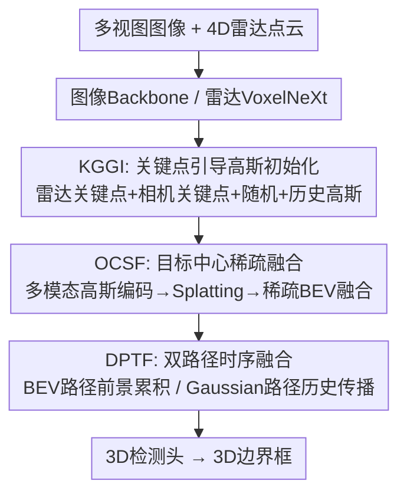

# Horizon3D: Sparse Radar-Camera Fusion for Long-Range 3D Perception in Autonomous Driving

**会议**: ECCV 2026  
**arXiv**: [2606.31096](https://arxiv.org/abs/2606.31096)  
**论文**: [项目页](https://geonhobang.github.io/horizon3d-project-page/)  
**代码**: 无  
**领域**: 自动驾驶  
**关键词**: 雷达-相机融合, 3D目标检测, 长距离感知, 高斯原语, 稀疏BEV

## 一句话总结
Horizon3D 提出一种面向长距离自动驾驶感知的稀疏雷达-相机融合框架，用高斯原语（Gaussian primitives）捕捉目标级细节、稀疏 BEV 特征编码场景级上下文，并通过双路径时序融合（BEV 路径做多帧累积 + Gaussian 路径做逐目标运动传播）同时解决远距离稀疏性和高速大位移两难问题，在 TruckScenes 上以 +3.0 NDS / +1.6 mAP 超过此前最优雷达-相机融合方法，且推理速度快于现有 BEV 融合方法。

## 研究背景与动机
长距离 3D 目标检测是高速公路自动驾驶安全的核心需求——150 m 以上的感知能力直接决定制动距离是否充足。LiDAR 虽然精度高，但部署和维护成本昂贵且易受恶劣天气影响；4D 雷达（含仰角测量 + 速度信息 + 天气鲁棒）与相机融合作为低成本替代方案近年备受关注。然而现有雷达-相机融合方法在长距离场景下均暴露明显短板。

现有范式分为两派，各自在长距离下失效的方式不同。**BEV 类方法**（CRN、RCBEVDet、BEVFusion、CRT-Fusion 等）将多模态特征投影到统一稠密 BEV 网格，能有效捕捉场景级上下文，但代价随检测距离平方增长——长距离意味着更大的 BEV 覆盖范围，稠密网格的计算量和显存成为瓶颈；而且固定分辨率的稠密网格天然丢失细粒度目标级信息。**Query 类方法**（RCTrans、RaCFormer、SpaRC 等）用少量可学习查询做目标中心编码，计算量不随距离膨胀，但查询天生为前景目标优化，缺失场景级上下文，在需要理解道路结构、自由空间等全局信息的远距离场景中不够用。

长距离场景还给时序融合带来双重挑战：远距离目标在单帧中只有极少雷达回波和几个像素，必须多帧累积才能形成可靠观测（场景级需求）；但高速场景下同一目标在相邻帧之间位移巨大，必须做目标级的运动建模才能对齐（目标级需求）。BEV 时序聚合用整张稠密 BEV 做多帧累积，能缓解稀疏性但对逐目标运动不敏感；query 传播能追踪单目标运动但缺乏场景级时序上下文。

核心矛盾由此清晰：长距离感知同时需要**目标级细节 + 场景级上下文**，且时序融合需要同时处理**远距离稀疏性（需多帧累积）+ 高速大位移（需目标运动建模）**——现有方法只能各满足一半。Horizon3D 的核心 idea 是用一种混合表征打破这个 trade-off：高斯原语负责目标级编码（位置、尺度、旋转、速度都可学习），稀疏 BEV 负责场景级上下文，两者在空间和时序维度上协同工作，既不构建稠密 BEV、也不丢场景信息。

## 方法详解

### 整体框架
Horizon3D 的输入为多视图相机图像和 4D 雷达点云，输出为 3D 检测框。整体 pipeline 分三个阶段：首先 KGGI 模块从雷达和相机特征中估计目标关键点位置，在这些位置初始化一组稀疏的高斯原语；然后 OCSF 模块以高斯原语为中心迭代聚合跨模态特征并精修高斯参数，经高斯 Splatting 投影到 BEV 平面形成目标中心 BEV 表征，与稀疏雷达 BEV 特征融合得到融合 BEV 特征图；最后 DPTF 模块通过 BEV 路径和 Gaussian 路径两条互补通路聚合历史帧信息，送入 3D 检测头输出结果。

### 关键设计

**1. KGGI（关键点引导高斯初始化）：用传感器关键点替代随机撒高斯，让原语一开始就在目标附近**

已有高斯类方法（GaussianFormer、GaussianFormerV2）在场景中随机放置大量高斯原语再迭代精修，为覆盖足够空间需要大量原语，计算量与检测范围成正比增长。KGGI 的核心思路是：与其随机撒再慢慢挪，不如直接用传感器信号猜出目标大致在哪，就地初始化高斯。

具体做法分两路。**雷达分支**：用 VoxelNeXt 对 4D 雷达点云做稀疏编码得到稀疏雷达 BEV 特征 $F_R$，对每个非空 cell 用轻量 MLP 预测 objectness 分数，取 top-$K_r$（$K_r=1024$）高分 cell 作为雷达关键点，就地初始化 $K_r$ 个高斯原语。**相机分支**：对多视图图像特征 $F_I$，每视图用 2D keypoint head 预测逐像素 objectness 分数图，同时用 depth head 预测深度分布；对每像素取 objectness 分数与深度置信度的乘积作为候选分，取 top-$K_c$（$K_c=256$）高分候选，用估计深度和相机标定 lift 到 3D 再投影到 BEV 平面，作为相机关键点并初始化 $K_c$ 个高斯原语。每个高斯参数化为 $\mathbf{g}_i = (\mathbf{m}_i, \mathbf{s}_i, \theta_i, o_i, \mathbf{v}_i)$，分别表示均值（2D 位置）、尺度、旋转角、不透明度和速度，并附带特征向量 $\mathbf{f}_i$。除传感器关键点高斯外，额外加入 $K_{\text{rand}}=256$ 个随机初始化的高斯以覆盖两路盲区，以及 $K_{\text{hist}}$ 个从前帧传播来的历史高斯（见 DPTF）。初始化时 $\mathbf{m}_i$ 设为关键点坐标，其余参数和特征均为可学习初始值，由后续 OCSF 模块精修。

为什么有效：关键点引导让少量高斯（~2560 个）就能有效覆盖远距离目标区域，避免了随机方法为覆盖 150 m 范围所需的大量原语；且高斯一开始就在目标附近，后续精修只需局部微调，收敛更快也更准。消融实验显示关键点初始化比纯随机初始化提升 +1.5 mAP / +1.8 NDS。

**2. OCSF（目标中心稀疏融合）：以高斯原语为锚点聚合跨模态特征，再通过 Splatting 把目标级信息注入 BEV，同时保留场景级上下文**

OCSF 解决的核心问题是：如何在不构建稠密 BEV 的前提下，同时获得目标级细节和场景级上下文？它把 KGGI 给出的初始高斯集 $\mathcal{G}_0$ 作为"注意力锚点"，分两步走——先围绕高斯精修特征，再把精修后的高斯 Splat 到 BEV 上形成稀疏的目标中心 BEV，最后与雷达 BEV 特征融合。

**第一步：多模态高斯编码器**。用 $L=2$ 层叠代更新高斯特征和参数。每层对每个高斯做两件事：(1) 以高斯均值 $\mathbf{m}_i$ 为参考点，根据其尺度 $\mathbf{s}_i$ 和旋转 $\theta_i$ 生成 $K=11$ 个采样点（5 个固定 + 6 个可学习偏移），对雷达 BEV 特征和多视图图像特征分别做可变形交叉注意力（DCA），聚合多模态上下文到高斯特征 $\hat{\mathbf{f}}_i^{(l)}$；(2) 将高斯均值量化到 BEV 网格上，对占据的 cell 做 2D 稀疏卷积，让邻近高斯之间交互信息。均值通过预测残差更新 $\mathbf{m}_i^{(l+1)} = \mathbf{m}_i^{(l)} + \text{MLP}_m(\hat{\mathbf{f}}_i^{(l)})$，其余参数（尺度、旋转、不透明度、速度）也从精修后特征回归。经过 $L$ 层得精修高斯集 $\mathcal{G}_L$。

**第二步：目标中心高斯 Splatting**。对每个高斯的 2D 协方差 $\Sigma_i = R(\theta_i) \text{diag}(s_{ix}^2, s_{iy}^2) R(\theta_i)^\top$，在 BEV 平面逐 cell 计算高斯核权重 $k_i(\mathbf{p})$ 和不透明度贡献 $a_i(\mathbf{p}) = \sigma(o_i) k_i(\mathbf{p})$，得到逐 cell 的类别无关占据概率 $\alpha(\mathbf{p}) = 1 - \prod_{i} (1 - a_i(\mathbf{p}))$。占据图用真值 3D 框光栅化后外扩 $\epsilon=4.8$ m 的 mask 做监督——扩框鼓励高斯不仅覆盖目标内部、也编码周围空间上下文。取 $\alpha(\mathbf{p}) > \tau$ 的 cell 形成稀疏目标中心 BEV 表征，每个选中 cell 用高斯加权池化聚合特征：$F_G(\mathbf{p}) = \sum_{i \in \mathcal{N}(\mathbf{p})} k_i(\mathbf{p}) \mathbf{f}_i$。最后将 $F_G$ 与雷达稀疏 BEV 特征 $F_R$ 在非空 cell 的并集上通过门控网络自适应加权融合，经子流形稀疏卷积编码器输出融合 BEV 特征 $F_{\text{fuse}}$。

为什么有效：高斯原语自带位置、尺度、旋转参数，天然适合描述目标的几何结构；可变形交叉注意力以高斯为锚点精准采样多模态特征，而 Splatting 把"目标级几何 + 外观"浓缩到少数 BEV cell 上，与同样稀疏的雷达 BEV 融合后，计算量远小于稠密 BEV（表 9 显示 Horizon3D 推理 8.5 FPS vs BEVFusion 4.2 FPS，显存 3.2 GB vs 6.5 GB）。

**3. DPTF（双路径时序融合）：BEV 路径做多帧前景累积解决单帧稀疏，Gaussian 路径做逐目标运动传播解决高速位移，两条路都带显式速度补偿**

DPTF 解决的核心矛盾在引言已点明：远距离目标单帧太稀疏需要多帧累积（场景级），但高速运动又需要目标级对齐（对象级）——单一路径无法同时做好两件事。DPTF 用两条互补通路各管一摊。

**BEV 路径**：在融合 BEV 特征 $F_{\text{fuse}}^t$ 的每个非空 cell 上，用子流形稀疏卷积预测占据分数 $\hat{o}^t(\mathbf{p})$ 和平面速度 $\hat{\mathbf{u}}^t(\mathbf{p})$。占据分数用紧致真值 mask 监督（与 OCSF 中的扩框 mask 不同，这里是紧致的，目的是选出纯粹的前景 cell 做高效存储），速度用框内 cell 速度真值监督。取 $\hat{o}^t(\mathbf{p}) > \tau_{\text{mem}}$ 的前景 cell，只存其特征和速度进 BEV 记忆库（而非整张稠密 BEV）。融合时，对每帧历史 $(t-k)$，用自车运动 + 预测速度补偿计算 warp 后 BEV cell 索引：$\mathbf{p}' = \pi(T_{t-k \to t}(\mathbf{x}(\mathbf{p}) + \hat{\mathbf{u}}^{t-k}(\mathbf{p}) \Delta t_k))$，将历史特征按时间轴堆叠，加上时间嵌入后用 3D 稀疏卷积融合。

**Gaussian 路径**：Splatting 后，收集对占据 cell 有贡献的高斯（Active Gaussian Set），用最远点采样（FPS）选出一组空间上均匀散布的高斯作为 History Gaussian Set 存入记忆。每个高斯在 OCSF 中预测的速度 $\mathbf{v}_i$ 用其贡献最大的占据 cell 的速度真值监督：$\mathbf{p}_i^* = \arg\max_{\mathbf{p}} a_i(\mathbf{p}), \mathbf{v}_i^{\text{gt}} = \mathbf{v}^{\text{gt}}(\mathbf{p}_i^*)$。融合时用预测速度 + 自车运动将历史高斯 warp 到当前帧，注入 KGGI 的初始高斯集，与当前帧高斯一起经 OCSF 精修。此外，在合并后的高斯集上施加时序自注意力，弥补速度补偿后的残留对齐误差，让跨帧高斯能直接交互。

为什么两个路径互补：BEV 路径存的是 cell 级特征，适合做"这个区域最近几帧有没有东西"的场景级累积；Gaussian 路径存的是实例级原语，适合做"某个具体目标从上一帧移动到了哪里"的对象级追踪。消融显示单独 BEV 路径 22.5 mAP、单独 Gaussian 路径 21.3 mAP，两者联合 23.6 mAP，证实互补性。两个路径中都加了显式速度补偿——去掉速度补偿后 BEV 路径掉 1.4 mAP、Gaussian 路径掉 0.7 mAP，说明高速场景下纯自车运动补偿是不够的。FPS 采样也比按不透明度取 top-K 更好（21.3 vs 21.1 mAP），因为 top-K 倾向集中到少数高响应区域，FPS 空间上更均匀。

### 一个完整示例：单帧数据处理全流程

以 TruckScenes 中一帧典型高速场景为例，走一遍 Horizon3D 的完整推理流程，看高斯原语如何从"传感器猜测"逐步变成"精确目标表征"。

**输入**：当前帧 $t$ 有 4 张环视图像（640x960）和 6 个 4D 雷达累积的 10 次扫描点云（~数万个雷达点，含 x/y/z/RCS/径向速度）。BEV 覆盖范围设为 $[-75\text{m}, 75\text{m}] \times [-75\text{m}, 75\text{m}]$，网格 384x384。

**Step 1 — KGGI 初始化高斯**：VoxelNeXt 对雷达点云编码，在 384x384 的稀疏 BEV 特征图上逐 cell 预测 objectness，选出 1024 个高分 cell 作为雷达关键点；同时对 4 张图的逐像素 objectness 和深度估计，综合排序取 256 个相机关键点并投影到 BEV 平面。加上 256 个随机高斯和上帧传来的 1024 个历史高斯，共 $\sim$2560 个高斯原语。每个高斯均值设在关键点坐标，（尺度、旋转、不透明度、速度、特征）均为可学习初始值。此时高斯还很粗糙——位置大致对但尺度和形状不准确。

**Step 2 — OCSF 精修高斯 + Splatting**：2560 个高斯经过 $L=2$ 层多模态高斯编码器。每层对每个高斯在雷达 BEV 和图像特征上做可变形交叉注意力（11 个采样点围绕高斯均值分布），聚合多模态信息后更新特征并预测均值残差和参数修正。两轮后高斯均值向目标中心微调、尺度/旋转更贴合实际目标形状。精修后的高斯 Splat 到 BEV 平面：每个高斯在 BEV cell 上产生一个 2D 高斯核权重和不透明度贡献，所有高斯叠加得到占据概率图 $\alpha$。取 $\alpha > 0.1$ 的 cell（约数千个而非 384x384=147k 稠密）形成稀疏目标中心 BEV，每个选中 cell 用贡献最大的几个高斯的加权特征作为 $F_G$，与雷达稀疏 BEV $F_R$ 在非空 cell 并集上经门控融合、稀疏卷积编码，得到 $F_{\text{fuse}}$。此时 $F_{\text{fuse}}$ 中既有高斯带来的目标级几何细节，又有雷达 BEV 提供的场景结构。

**Step 3 — DPTF 时序融合**：BEV 路径对 $F_{\text{fuse}}$ 预测逐 cell 占据分数和速度，选出前景 cell（占据 > 0.1）存入记忆库——通常每帧存几百到几千个 cell，而非稠密 BEV。从记忆库取过去 8 帧的前景 cell，用各自预测速度 + 自车运动 warp 到当前帧坐标系，与当前 $F_{\text{fuse}}$ 堆叠成 4D 张量（时间维度 = 9），经 3D 稀疏卷积融合，输出时序增强的 BEV 特征。Gaussian 路径在 Splatting 后用 FPS 从此帧的 Active Gaussian Set 中选 256 个空间均匀的高斯，与过去 4 帧的历史高斯（共 1024 个）一起用预测速度 warp 到当前帧，注入下一帧的 KGGI。在当前帧还施加时序自注意力让跨帧高斯直接交互，消除 warp 残留误差。最终融合 BEV 特征送入 CenterPoint 检测头输出 3D 框（类别、位置、尺寸、朝向、速度）。

这个流程中高斯的状态经历了"粗初始化 → 两轮精修 → Splatting 转化为 BEV 特征 → FPS 筛选存入记忆 → 速度 warp 回下一帧"，体现了"高斯原语作为可流通的目标表征"的设计理念——在 KGGI 诞生、在 OCSF 精修、在 Splatting 释放、在 DPTF 流传。

### 损失函数 / 训练策略

总损失为 $\mathcal{L}_{\text{total}} = \mathcal{L}_{\text{det}} + \lambda_{\text{kggi}} \mathcal{L}_{\text{kggi}} + \lambda_{\text{ocsf}} \mathcal{L}_{\text{ocsf}} + \lambda_{\text{dptf}} \mathcal{L}_{\text{dptf}}$，权重分别为 1.0、5.0、1.0。$\mathcal{L}_{\text{det}}$ 为 CenterPoint 风格的 focal loss（分类）+ L1 loss（框回归）。$\mathcal{L}_{\text{kggi}}$ 包含 2D 关键点 objectness 的 focal loss 和深度分布估计的 BCE loss。$\mathcal{L}_{\text{ocsf}}$ 对 Splatting 产生的占据图 $\alpha(\mathbf{p})$ 施加 focal loss + Dice loss，用外扩 $\epsilon=4.8$ m 的真值 BEV mask 监督。$\mathcal{L}_{\text{dptf}}$ 中 BEV 路径对紧致占据 mask 施加 focal + Dice + Lovasz-Softmax loss，对逐 cell 速度施加 L1 loss；Gaussian 路径对逐高斯速度施加 Smooth L1 loss。

训练分两阶段：第一阶段只训练单帧模型（KGGI + OCSF）24 epochs；第二阶段加入 DPTF 再训练 24 epochs。图像 backbone 可选 ResNet-50（256x864）或 VoVNet-99（640x960，backbone lr multiplier 0.1）。BEV 网格 384x384，优化器 AdamW（lr=1e-4, weight decay=1e-2, cyclic schedule, gradient clip=35, batch size=8）。BEV 路径聚合过去 8 帧，Gaussian 路径维护过去 4 帧。硬件为 4x RTX 3090 或 4x RTX 5000。

## 实验关键数据

### 主实验

TruckScenes 验证集上的主结果（V2-99 backbone，640x960）：

| 方法 | 输入 | NDS | mAP | mATE | mAVE | mAAE |
|------|------|-----|-----|------|------|------|
| CenterPoint-V (LiDAR) | L | 35.3 | 22.6 | 0.461 | 3.028 | 0.261 |
| Far3D | C | 21.4 | 10.7 | 0.883 | 1.352 | 0.338 |
| CRT-Fusion | C+R | 28.8 | 16.9 | 0.833 | 0.852 | 0.322 |
| BEVFusion | C+R | 30.4 | 18.2 | 0.941 | 0.892 | 0.208 |
| SpaRC (此前 SOTA) | C+R | 35.4 | 22.5 | 0.798 | 0.613 | 0.248 |
| **Horizon3D** | C+R | **38.4** | **24.1** | 0.833 | 0.561 | 0.208 |

Horizon3D 以 V2-99 超过此前最优 SpaRC +3.0 NDS / +1.6 mAP，且 mAVE（速度误差）大幅领先（0.561 vs 0.613），说明速度补偿有效。在 Test 集上以更低分辨率（640x960 vs SpaRC 的 928x1952）仍超过 SpaRC +4.4 NDS / +0.5 mAP，且超过 LiDAR 方法 CenterPoint-V +0.8 NDS / +1.0 mAP。

### 消融实验

组件消融（R50 backbone，逐项叠加）：

| 配置 | mAP | NDS | 说明 |
|------|-----|-----|------|
| Radar only | 12.8 | 27.1 | 纯雷达基线 |
| + OCSF (随机初始化高斯) | 17.7 | 32.5 | 高斯融合带来 +4.9 mAP |
| + KGGI (关键点初始化) | 20.3 | 35.4 | 关键点引导再 +2.6 mAP |
| + DPTF (无 KGGI) | 23.0 | 36.4 | 时序融合贡献 +5.3 mAP |
| Full (KGGI + OCSF + DPTF) | 23.6 | 37.4 | 三模块协同达到最优 |

双路径消融（DPTF 内部）：

| 配置 | mAP | NDS | 说明 |
|------|-----|-----|------|
| 仅 BEV 路径 | 22.5 | 36.3 | 场景级多帧累积 |
| 仅 Gaussian 路径 | 21.3 | 36.0 | 目标级运动传播 |
| BEV + Gaussian 联合 | 23.6 | 37.4 | 互补收益 +1.1 mAP / +1.1 NDS |

距离分段性能（R50 backbone，mAP）：

| 方法 | 0-25m | 25-50m | 50-100m | 100-150m |
|------|-------|--------|---------|----------|
| RCTrans | 19.9 | 12.5 | 7.9 | 6.2 |
| BEVFusion | 28.8 | 16.8 | 11.7 | 7.4 |
| **Horizon3D** | **36.5** | **23.3** | **17.0** | **8.9** |

在所有距离段均最优，中远距离优势尤为明显（25-50m 领先 BEVFusion +6.5 mAP）。效率方面，Horizon3D 推理 8.5 FPS / 3.2 GB 显存，快于 BEVFusion（4.2 FPS / 6.5 GB）和 CRT-Fusion（2.9 FPS / 7.6 GB），全稀疏处理使雷达编码器从 75 ms 降至 14.3 ms、检测头从 79 ms 降至 9.3 ms。

### 关键发现
- **KGGI + OCSF 的组合是精度最大贡献者**：从纯雷达基线 12.8 mAP 提升到 20.3 mAP（+7.5），关键点引导比随机初始化额外贡献 +2.6 mAP，说明"在哪里初始化高斯"比"高斯多不多"更重要。
- **DPTF 单独贡献也很大但需要 KGGI 配合**：DPTF 无 KGGI 时提升 +5.3 mAP（相比 OCSF-only），但加上 KGGI 后总提升达 +10.8 mAP（相对纯雷达），说明好的空间初始化让时序传播更有效。
- **速度补偿对 BEV 和 Gaussian 路径都必不可少**：去掉速度补偿后 BEV 路径掉 1.4 mAP、Gaussian 路径掉 0.7 mAP，高速场景下纯自车运动补偿不足以对齐。
- **外扩框监督对 Splatting 质量很重要**：$\epsilon=4.8$ m 相比不扩框提升 +3.1 mAP，因为鼓励高斯编码周围上下文而非仅目标内部；但扩太大（6.4m）会引入背景噪声导致性能回落。
- **FPS 采样优于按不透明度 top-K**：因为 top-K 倾向集中到少数高响应物体，而 FPS 空间上更均匀，能在多个目标间合理分配历史高斯。
- **动态类别提升显著，静态类别略逊**：相比 SpaRC，Horizon3D 在 Pedestrian (+10.2)、Bicycle (+16.5)、Motorcycle (+9.2) 等动态类别上大幅领先，但在 Traffic Cone (32.6 vs 40.8)、Traffic Sign (33.7 vs 41.9) 等静态类别上反而更低，说明方法收益集中在运动建模场景。

## 亮点与洞察
- **"关键点引导"比"随机撒+精修"更高效的设计哲学**：KGGI 用 sensor 信号给高斯原语提供好的初始位置，使得 $L=2$ 层编码器就够用（$L=4$ 只多 0.7 mAP 但延迟翻倍）。这个思路可以迁移到任何需要在空间放置锚点/查询的方法——先用廉价先验给个好起点，比事后花大力气优化更高效。
- **"高斯原语做目标表征，BEV 做场景表征"的分工非常干净**：高斯天然有位置、尺度、旋转、速度参数，天然适合表示"一个物体"；BEV 是空间网格，天然适合表示"场景布局"。把这个分工显式化并让两者在 Splatting 阶段融合，比强行让一种表征干两件事更优雅。类似的分工思路可迁移到其他需要同时处理实例级和场景级信息的任务（如端到端规划中的障碍物 + 车道线）。
- **双路径时序融合是解决"稀疏性 vs 运动"矛盾的实用方案**：不试图用一个机制同时解决两个问题，而是 BEV 路径存 cell（场景累积）、Gaussian 路径存实例（目标追踪），各管各的。这个思路可迁移到任何同时涉及静态背景和动态前景的时序任务（如 Occupancy 预测、轨迹预测）。
- **FPS 采样用于时序记忆是一个小但有效的 trick**：很多 query-based 方法按置信度取 top-K 存历史查询，但本文发现 FPS 空间更均匀、覆盖更多目标。这提示在维护时序记忆时，"多样性"可能比"置信度"更重要——这个 insight 可迁移到任何需要存储和回放历史 token/query 的场景。

## 局限与展望
- **静态小目标（Traffic Cone、Traffic Sign）性能不如 SpaRC**：作者在失败案例分析中指出，悬挂在道路上方的交通标志几乎不产生雷达回波，高斯无法可靠形成。这暴露出方法对雷达信号质量的依赖——完全无雷达回波的目标（如悬挂标志、护栏）单纯靠相机关键点可能不够。改进方向：为纯相机可见目标引入更强的视觉 prior 或 2D-3D 对齐机制。
- **细长连续目标（如 other vehicle）覆盖不足**：少量高斯难以完整覆盖细长几何结构，导致漏检。改进方向：引入适配细长形状的高斯参数化或对细长类别增加高斯配额。
- **方法高度依赖关键点质量**：KGGI 的关键点预测如果偏差较大，后续高斯精修和 Splatting 都会受影响。论文未分析关键点召回率/精度对最终检测的影响敏感度。
- **TruckScenes 是唯一评测数据集**：虽然该数据集确实是最适合长距离雷达-相机融合评测的 benchmark，但方法在其他平台（如不同雷达型号、不同安装高度）上的泛化性未经验证。
- **速度真值依赖框级标注**：Gaussian 路径的逐高斯速度监督来自"贡献最大的占据 cell 所属框的速度"，这是一种近似——同一个框内不同部位（如卡车头和尾）可能有不同速度。这种近似在卡车等长物体上可能引入误差。

## 相关工作与启发
- **vs BEVFusion / CRT-Fusion（稠密 BEV 融合）**: 都是雷达-相机 BEV 融合，但 Horizon3D 从根子上不走稠密 BEV，而是用高斯 Splatting 产生稀疏 BEV。结果是 Horizon3D 精度更高且推理更快（8.5 vs 4.2 FPS），说明稠密 BEV 在长距离场景下不是最优选择——稀疏化是更正确的方向。
- **vs SpaRC / RCTrans（query-based 融合）**: 都是稀疏/高效路线，但 Horizon3D 用高斯原语替代可学习查询，且额外保留了稀疏 BEV 的场景上下文。SpaRC 的性能（35.4 NDS）已经很接近 LiDAR baseline，Horizon3D 在此基础上再提 3.0 NDS，说明"目标级 + 场景级"的混合表征比纯 query 更有潜力。
- **vs GaussianFormer 系列（高斯场景表征）**: 都使用高斯原语做 3D 感知表征，但 GaussianFormer 在场景中均匀/随机放置大量高斯、依赖迭代精修让高斯向目标区域集中——Horizon3D 的 KGGI 用传感器信号替代了这个缓慢的"收敛"过程，使少量高斯即可高效覆盖远距离目标。这个设计差异是 Horizon3D 能在长距离场景取得效率优势的关键。
- **vs Far3D（长距离纯视觉检测）**: Far3D 证明了用 2D prior 引导长距离查询的有效性，Horizon3D 的 KGGI 相机分支借鉴了其 2D keypoint + depth 的 lift 思路，但将其推广到多模态场景并扩展为高斯初始化而非查询初始化，且加入了雷达关键点互补。

## 评分
- 新颖性: 4/5 将高斯原语引入雷达-相机融合并设计完整的 KGGI+OCSF+DPTF 三模块管线，思路清晰且各模块之间的分工和互补关系讲得透彻。高斯 Splatting 做目标级 BEV 表征 + 双路径时序融合的"各管一摊"设计有巧思。
- 实验充分度: 4/5 主实验覆盖 6 个 baseline + 2 种 backbone + val/test 双集，消融覆盖组件分析、初始化策略、扩框 margin、双路径分解、速度补偿、采样策略、时序自注意力、编码器层数、延迟分解、距离分段、逐类 AP，相当详尽。唯一欠缺是对 TruckScenes 以外的数据集和不同雷达型号的泛化性验证。
- 写作质量: 4/5 动机链条从"BEV vs query 各缺一半"的矛盾出发逐步引出三个模块，逻辑流畅。图表清晰（Fig. 2 整体架构、Fig. 3 Splatting 与时序对齐细节）。supplementary 对 loss 和网络细节交代充分。
- 价值: 4/5 长距离雷达-相机融合是自动驾驶落地的真需求，Horizon3D 在精度和效率两个维度同时超过此前最优方法，且稀疏表征的设计哲学（不构建稠密 BEV、用高斯替代查询、双路径分工）对后续工作有启发性。静态类别和雷达缺失场景的短板也指明了后续改进方向。

<!-- RELATED:START -->

## 相关论文

- [\[ICCV 2025\] Self-Supervised Sparse Sensor Fusion for Long Range Perception](../../ICCV2025/autonomous_driving/self-supervised_sparse_sensor_fusion_for_long_range_perception.md)
- [\[CVPR 2026\] R4Det: 4D Radar-Camera Fusion for High-Performance 3D Object Detection](../../CVPR2026/autonomous_driving/r4det_4d_radar-camera_fusion_for_high-performance_3d_object_detection.md)
- [\[CVPR 2025\] RaCFormer: Towards High-Quality 3D Object Detection via Query-based Radar-Camera Fusion](../../CVPR2025/autonomous_driving/racformer_towards_high-quality_3d_object_detection_via_query-based_radar-camera_.md)
- [\[CVPR 2026\] TruckDrive: Long-Range Autonomous Highway Driving Dataset](../../CVPR2026/autonomous_driving/truckdrive_long-range_autonomous_highway_driving_dataset.md)
- [\[CVPR 2026\] RPGFusion: 4D Radar Prior-Guided Multi-Modal Fusion for 3D Detection](../../CVPR2026/autonomous_driving/rpgfusion_4d_radar_prior-guided_multi-modal_fusion_for_3d_detection.md)

<!-- RELATED:END -->
