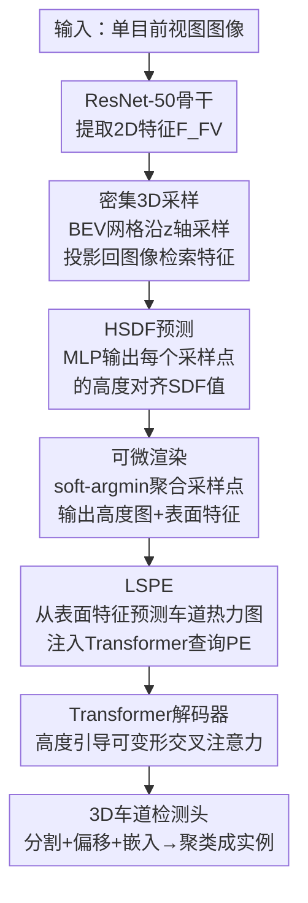

# HSDF-Lane: Height-Aligned Signed Distance Field with Semantic Lane Prior for 3D Lane Detection

**会议**: ECCV 2026  
**arXiv**: [2606.31172](https://arxiv.org/abs/2606.31172)  
**代码**: [https://github.com/JiyongBoo/HSDF-Lane](https://github.com/JiyongBoo/HSDF-Lane)  
**领域**: 自动驾驶  
**关键词**: 3D车道检测, 有符号距离场, 高度估计, 单目视觉, 语义位置编码

## 一句话总结
HSDF-Lane 用垂直方向对齐的有符号距离场（HSDF）替代传统稀疏斜率锚点来隐式建模道路表面，通过可微渲染同时输出精确高度图和表面对齐特征，并引入车道感知语义位置编码（LSPE）将车道存在先验注入 Transformer 查询，在 OpenLane 基准上取得 3D 车道检测和高度估计双项 SOTA。

## 研究背景与动机
单目 3D 车道检测是自动驾驶的核心感知任务——从单张前视图图像恢复车道线在三维空间中的精确位置，为定位、轨迹规划提供关键几何信息。早期方法依赖逆透视映射（IPM）将图像特征变换到鸟瞰图（BEV）空间，但 IPM 的平坦地面假设在真实道路的坡道、起伏路面会产生严重的几何失真，远距离处尤甚。

为缓解这一问题，后续方法引入深度估计分支或 Lift-Splat-Shoot 机制将 2D 特征提升到 3D，但单目深度估计的尺度模糊性在远距离区域被显著放大——投影误差在 3D 重建过程中逐层累积。最近，HeightLane 和 SC-Lane 提出了基于高度图的架构：直接预测 BEV 网格上每个位置的道路绝对高度，从本质上绕开了深度-高度转换中的几何不一致。然而，这两个方法仍依赖一组稀疏的预定义平面斜率锚点（slope anchors）来回归高度：锚点数量有限、在空间中离散分布，远距离处相邻锚点间距急剧增大，面对陡坡或连续起伏路面时，无法精确恢复非平面的道路几何。此外，已有方法从高度图中恢复的几何特征仅用于空间变换——做 BEV 特征对齐——而对"哪里有车道"这一语义信息缺乏显式利用。

核心矛盾在于：道路表面是连续的、非平面的几何结构，但现有方法用离散锚点去回归单值高度，锚点密度与道路复杂度不匹配。本文的核心 idea 是：将道路表面隐式建模为垂直方向对齐的有符号距离场（HSDF），通过对密集 3D 采样体积做可微渲染获得连续且精确的高度图和表面对齐特征，再将车道存在概率作为语义先验注入几何位置编码，实现几何与语义的联合建模。

## 方法详解

### 整体框架
HSDF-Lane 的输入是一张单目前视图图像，输出是 BEV 空间中的 3D 车道实例和密集高度图。整体流程分为五个阶段：ResNet-50 骨干网络提取 2D 图像特征 → 在 BEV 网格上沿垂直轴密集采样 3D 点并投影回图像获取像素对齐特征，构建密集 3D 特征体积 → MLP 预测每个采样点的 HSDF 值并通过可微渲染同时输出高度图与表面对齐特征 → LSPE 从表面特征预测车道热力图并作为语义位置编码注入 Transformer 查询 → 高度引导的 Transformer 解码器经车道检测头输出最终 3D 预测（分割图、横向偏移、实例嵌入）。整个框架端到端训练，高度估计和车道检测共享底层特征。

### 关键设计

**1. 密集 3D 采样与 HSDF 建模：用隐式距离场替代稀疏锚点回归**

传统 HeightLane 和 SC-Lane 用少量预定义斜率锚点描述路面可能的高度范围，锚点数量和角度固定，远距离处锚点间距可达数米，对连续起伏路面的高度回归误差大。HSDF-Lane 改为沿垂直轴密集采样：对 BEV 网格上每个位置 $(x_i, y_j)$，定义垂直搜索范围 $[z_{\min}, z_{\max}]$，其中 $z_{\min,\max} = x_i \cdot \tan(\pm\theta)$，$\theta=5^\circ$ 是预设最大坡度角。

为避免近处采样过密、远处采样过疏，采用自适应采样策略：设目标垂直采样分辨率 $\delta_z = 1.5\text{m}$，则该位置所需采样数 $N(x_i, y_j) = \max\left(2, \lceil (z_{\max} - z_{\min}) / \delta_z \rceil + 1\right)$。强制至少 2 个采样点以保证后续 softmax 操作不退化为零熵分布。全局最大采样数 $N_{\max}=13$，不足 $N_{\max}$ 的位置用 padding mask 掩盖无效点。所有采样点通过相机内外参投影回图像平面，用双线性插值从骨干特征图 $\mathcal{F}_{FV}$ 中检索像素对齐特征，沿 z 轴堆叠构成密集 3D 特征体积 $\mathcal{V} \in \mathbb{R}^{H \times W \times N_{\max} \times C}$。

HSDF 的核心定义：在点 $(x, y, z)$ 处，HSDF 值 $s(x, y, z) = z - \mathcal{H}_{GT}(x, y)$，即该点到真实路面的垂直有向距离——路面上的点 $s=0$，路面上方为正、下方为负。这与传统 SDF 的三维各向同性距离根本不同：HSDF 严格沿 z 轴对齐，直接可解释为"离路面还差/高出多少"。用一个带跳跃连接的两层 MLP 对每个采样点预测 HSDF 值 $\hat{s}$，输入是压缩至 256 维的体积特征和 NeRF 风格 Fourier 位置编码的拼接：

$$\hat{s}(x_i, y_j, z_k) = \text{MLP}\left(\text{cat}[\mathcal{V}(x_i, y_j, z_k),\ \gamma(x_i, y_j, z_k)]\right)$$

**2. HSDF 可微渲染：用 soft-argmin 加残差修正提取显式高度图与表面特征**

有了 HSDF 预测值后，需要从离散采样点中恢复连续的道路表面。关键操作是可微的 soft-argmin 渲染：对每个 BEV 位置 $(x_i, y_j)$，沿 z 轴对 HSDF 的绝对值取负后做温度加权 softmax，得到各采样点的概率权重：

$$w_k(x_i, y_j) = \text{softmax}_k\left(-\frac{|\hat{s}(x_i, y_j, z_k)|}{\tau(x_i)}\right)$$

温度 $\tau(x_i) = \tau_0 \cdot \text{clip}\left(\frac{z_{\max} - z_{\min}}{\delta_z}, 0.3, 3.0\right)$ 自适应缩放——搜索范围大时温度升高让分布更平滑、防止梯度集中在单个采样点，搜索范围小时温度降低让峰值更尖锐。$\tau_0=0.3$ 是可学习基温度，clip 边界 [0.3, 3.0] 防止数值不稳定。

渲染高度图时，论文不做简单的加权平均坐标 $z_k$，而是将预测的 HSDF 值作为局部残差，先把每个采样点沿 z 轴"拉"向预测表面、再加权聚合：

$$\tilde{\mathcal{H}}(x_i, y_j) = \sum_{k=0}^{N-1} w_k(x_i, y_j) \cdot \left(z_k - \hat{s}(x_i, y_j, z_k)\right)$$

这相当于在每个采样点先做"局部牛顿步"修正再融合，比直接加权坐标更快收敛到精确零交叉面。最后用一个**零初始化**的 $3\times3$ 残差卷积做空间平滑得到最终高度图 $\mathcal{H}$——零初始化保证训练早期的平滑模块不干预高度学习，后期逐步引入空间一致性。同时，用同一组权重 $w_k$ 聚合特征体积 $\mathcal{V}$，得到表面对齐的特征图 $\mathcal{F}_{hsdf}$，经深度可分离残差块精炼。整套可微渲染让梯度从高度监督和车道监督无障碍地反向传播到每个采样点的 HSDF 预测。

**3. 车道感知语义位置编码（LSPE）：单向量门控注入语义先验**

已有方法（如 HeightLane）用高度图生成几何位置编码 $\mathbf{p}_{geo}$ 来引导 Transformer 交叉注意力的空间采样位置，但纯粹基于高度的编码缺乏对"哪里有车道"的语义感知——在复杂场景下注意力可能被路边建筑投影或远距离噪声分散。HSDF-Lane 从渲染得到的表面特征 $\mathcal{F}_{hsdf}$ 出发，用轻量 CNN 预测一个 BEV 车道热力图 $\mathcal{M} \in \mathbb{R}^{H \times W \times 1}$，表示每个网格位置存在车道的概率。

LSPE 的设计在消融实验中展示了极致的克制：全可学习 MLP 编码会引入噪声干扰几何编码（F1 反降至 65.7，不如不加 LSPE 的 65.9），直接拼接热力图则因单通道语义信号被高维几何编码淹没而无效（F1=66.0）。最有效的方案是用一个可学习向量 $\mathbf{v} \in \mathbb{R}^{C}$ 与热力图概率逐元素相乘：

$$\mathbf{p}_{sem}(x_i, y_j) = \mathcal{M}(x_i, y_j) \cdot \mathbf{v}$$

$$\mathbf{p}_{bev}(x_i, y_j) = \mathbf{p}_{geo}(x_i, y_j) + \mathbf{p}_{sem}(x_i, y_j)$$

这个设计的洞察在于：单向量 $\mathbf{v}$ 充当"注意力门控"——热力图概率高（如 0.9）时该位置的语义编码被充分激活，概率低（如 0.05）时语义编码接近零向量、位置编码退化为纯几何模式。这在不引入新噪声的前提下，将车道存在先验无缝嵌入 Transformer 查询，让交叉注意力在偏移采样时自然偏向车道区域。

**4. 高度方向 Eikonal 正则化：仅约束垂直梯度、保证距离场的物理一致性**

标准 SDF 的 Eikonal 约束要求全 3D 梯度模长为 1（$\|\nabla f\| = 1$），但 HSDF 是严格垂直对齐的——只需沿 z 轴的偏导数有意义，水平方向的梯度约束不必要。为此提出高度方向 Eikonal 损失，仅约束 $\partial s / \partial z = 1$，用有限差分在相邻有效采样点间近似：

$$\mathcal{L}_{eik} = \sum_{(x_i, y_j, z_k)} \left|\frac{\hat{s}(x_i, y_j, z_{k+1}) - \hat{s}(x_i, y_j, z_k)}{z_{k+1} - z_k} - 1\right|$$

这个损失强制 HSDF 沿垂直轴以单位速率线性变化，让网络学到物理上有意义的距离（而非任意放缩的标量场），从而稳定零交叉面的定位。消融实验表明 $\mathcal{L}_{eik}$ 的核心作用是抑制 RMSE（从 0.333 降至 0.286），即减少高度预测的离群偏差，对整体道路几何的全局一致性贡献显著。

### 一个完整示例：从图像像素到 3D 车道点

以一张典型前视图（600x800）为例走通全流程。ResNet-50 骨干输出 1/16 分辨率、1024 通道的特征图 $\mathcal{F}_{FV}$。在 BEV 网格（$200 \times 48$，覆盖纵向 3-103m、横向 $\pm$12m）上，取纵向距离 $x=50\text{m}$ 处的一列：垂直搜索范围 $z \in [50\cdot\tan(-5^\circ), 50\cdot\tan(5^\circ)] \approx [-4.37, 4.37]\text{m}$，范围长度 8.74m，按 $\delta_z=1.5\text{m}$ 计算需 $N=\lceil 8.74/1.5 \rceil + 1 = 7$ 个采样点。7 个点均匀分布在该区间，投影回原图并缩放 16 倍后检索 7 个 1024 维特征向量，经 Linear 层压缩为 256 维。

MLP 对这一列 7 个点各输出一个 HSDF 预测值 $\hat{s}$。假设路面真实高度在 $z \approx 0.3\text{m}$，7 个点中 $z=0.5\text{m}$ 处的 $\hat{s} \approx -0.17$（预测 HSDF 值），绝对值 0.17 最小，经 softmax 后该点获得权重约 0.6，其上下相邻点各约 0.15，其余衰减至接近零。渲染高度 $ = 0.6 \times (0.5 - (-0.17)) + 0.15 \times (z_{-1} - \hat{s}_{-1}) + 0.15 \times (z_{+1} - \hat{s}_{+1}) \approx 0.3\text{m}$，与真值高度吻合。这 7 个点的特征也以相同权重求和得到该位置的表面特征向量（256 维）。同时，车道热力图预测该位置概率 0.92，$\mathbf{p}_{sem}$ 分量充分激活，Transformer 交叉注意力在后续解码中对该区域的偏移采样权重显著增大。最终检测头输出车道分割概率、亚网格横向偏移（如 0.35，表示车道线在该网格单元内偏左 35%）和实例嵌入，结合渲染高度 0.3m 将 BEV 检测提升为精确的 3D 车道点。

### 损失函数 / 训练策略

总损失为多个子项的加权和：

$$\mathcal{L}_{total} = \lambda_{seg}\mathcal{L}_{seg} + \lambda_{off}\mathcal{L}_{off} + \lambda_{emb}\mathcal{L}_{emb} + \lambda_{2d}\mathcal{L}_{2d} + \lambda_{geo}(\mathcal{L}_{\mathcal{H}} + \lambda_{eik}\mathcal{L}_{eik}) + \lambda_{hm}\mathcal{L}_{hm}$$

其中 $\mathcal{L}_{seg}$ 是 BEV 车道分割的 BCE+IoU 损失，$\mathcal{L}_{off}$ 用 BCE 预测归一化到 [0,1] 的亚网格横向偏移，$\mathcal{L}_{emb}$ 是标准 push-pull 实例嵌入损失，$\mathcal{L}_{2d}$ 是前视图上的辅助 2D 分割+嵌入监督（提供直接的图像级梯度）。几何损失是双层监督：$\mathcal{L}_{\mathcal{H}} = \mathcal{L}_{render} + \mathcal{L}_{hsdf}$，前者对渲染高度图和真值做 Smooth L1，后者对每个采样点的 HSDF 预测值和 $z_k - \mathcal{H}_{GT}$ 做 Smooth L1——点级 + 渲染级双层约束确保整个距离场而非仅零交叉面被正确学习。$\mathcal{L}_{eik}$ 是高度方向 Eikonal 正则化。$\mathcal{L}_{hm}$ 是对车道热力图的高斯焦点损失（Gaussian Focal Loss），$\alpha$ 和 $\beta$ 控制易/难样本权重。

权重设置：$\lambda_{seg}=5$，$\lambda_{off}=60$，$\lambda_{emb}=1$，$\lambda_{2d}=1$（其中 2D 分割权重 3、嵌入权重 0.5），$\lambda_{geo}=10$，$\lambda_{eik}=0.1$，$\lambda_{hm}=5$。使用 AdamW 优化器（weight decay $10^{-2}$），初始学习率 $5\times10^{-4}$，余弦退火调度，前 1000 步线性预热，OpenLane 训练 24 个 epoch，batch size 32 分两张 H200 GPU。HSDF-Lane 的参数量仅 28.35M，显著低于 HeightLane 的 73.40M 和 SC-Lane 的 70.10M，FLOPs 为 269.55G（FPN 版降至 145.08G）。

## 实验关键数据

### 主实验

OpenLane 基准上的 3D 车道检测对比（ResNet-50 骨干，F1-score 越高越好，X/Z-error 越低越好）：

| 方法 | F1(%) | X near(m) | X far(m) | Z near(m) | Z far(m) |
|------|-------|-----------|----------|-----------|----------|
| PersFormer (ECCV22) | 50.5 | 0.485 | 0.553 | 0.364 | 0.431 |
| BEV-LaneDet | 58.4 | 0.309 | 0.659 | 0.244 | 0.631 |
| LATR (ICCV23) | 61.9 | 0.219 | 0.259 | 0.075 | 0.104 |
| HeightLane (CVPR25) | 62.7 | 0.240 | 0.266 | 0.116 | 0.165 |
| SC-Lane (CVPR25) | 64.3 | 0.227 | 0.251 | 0.088 | 0.128 |
| SparseLaneSTP | 66.1 | 0.203 | 0.240 | 0.066 | 0.092 |
| **HSDF-Lane** | **66.3** | 0.201 | **0.223** | 0.088 | 0.114 |
| **HSDF-Lane (FPN)** | **66.9** | **0.186** | 0.226 | 0.084 | 0.114 |

HSDF-Lane 以 F1=66.3 超越此前 SOTA（SparseLaneSTP 的 66.1），配备 FPN 后进一步提升至 66.9。在远距离 X 误差上表现最优（0.223m），近距 X 误差 FPN 版达到 0.186m。需要指出：Z-error 不宜跨范式直接比较——基于高度图的方法在整个 BEV 网格上监督高度（N 个点）、而 LATR/SparseLaneSTP 等 query-based 方法仅在车道点位置监督 Z 值，后者的监督更集中在评估区域，天然 Z-error 更低。HSDF-Lane 的 Z-error 在高度图方法中已有竞争力。

按场景细分的 F1-score（HSDF-Lane FPN 版，值越高越好）：

| 方法 | All | Up&Down | Curve | 极端天气 | 夜间 | 路口 | 合流/分流 |
|------|-----|---------|-------|---------|------|------|----------|
| SparseLaneSTP | 66.1 | 57.3 | 73.0 | 60.1 | 58.3 | 58.2 | 66.5 |
| HSDF-Lane | 66.3 | 58.9 | 73.7 | 60.7 | 57.4 | 58.3 | 65.7 |
| **HSDF-Lane (FPN)** | **66.9** | 58.2 | **74.2** | 60.5 | **59.6** | **59.2** | **66.8** |

HSDF-Lane 在 Curve、Intersection、Merge&Split 等复杂几何场景中优势最明显，验证了 HSDF 密集建模对非平面路面的增益。Up&Down 场景中 FPN 版略弱于基础版但仍有竞争力。

高度估计对比（BEV 网格 200x48，误差越低越好，阈值精度越高越好）：

| 方法 | MAE | RMSE | Acc@0.05 | Acc@0.1 | Acc@0.2 |
|------|-----|------|----------|---------|---------|
| HeightLane | 0.235 | 0.343 | 0.253 | 0.442 | 0.673 |
| SC-Lane | 0.176 | 0.259 | 0.293 | 0.507 | 0.756 |
| HSDF-Lane | 0.158 | 0.313 | 0.294 | 0.512 | 0.763 |
| HSDF-Lane (FPN) | **0.149** | 0.272 | **0.307** | **0.527** | **0.776** |

HSDF-Lane 在所有指标上均优于 HeightLane 和 SC-Lane，唯一例外是 RMSE——SC-Lane 的锚点回归加时序一致性损失能更好地抑制离群值，但 HSDF 方案覆盖更宽的高度范围，带来更好的整体精度（MAE 和所有 Acc@threshold 全面领先）。

### 消融实验

在 OpenLane-300 子集上逐组件消融：

| 配置 | $\mathcal{L}_{eik}$ | $\mathcal{L}_{\mathcal{H}}$ | LSPE | F1(%) | MAE | RMSE | Acc@0.2 |
|------|:---:|:---:|:---:|-------|------|------|---------|
| A: 仅 Eikonal | ✓ | | | 71.8 | 0.512 | 0.648 | 0.197 |
| B: +显式高度监督 | | ✓ | | 74.2 | 0.161 | 0.333 | 0.755 |
| C: +Eikonal正则化 | ✓ | ✓ | | 74.7 | 0.157 | 0.286 | 0.750 |
| D: 完整模型 | ✓ | ✓ | ✓ | **75.6** | 0.158 | 0.326 | **0.767** |

A→B：仅靠 Eikonal 正则化而缺乏显式高度监督时，高度估计几乎完全失效（MAE=0.512），车道 F1 仅 71.8。引入 $\mathcal{L}_{\mathcal{H}}$ 后 MAE 骤降至 0.161，F1 跃升 2.4 点——显式高度监督是学习正确道路拓扑的刚性需求。B→C：加入 $\mathcal{L}_{eik}$ 将 RMSE 从 0.333 降至 0.286，这是最大的单组件 RMSE 降幅，说明 Eikonal 的核心作用是消除离群偏差、提升全局几何一致性。C→D：LSPE 将 F1 推至最高 75.6 且 Acc@0.2 达 0.767，尽管 RMSE 略有回升（0.326 vs 0.286），阈值精度和检测 F1 的提升表明语义引导与几何监督互补、从不同维度改善模型。

### 关键发现
- **显式高度图监督不可替代**：Eikonal 正则化本身不足以在没有直接高度标签的情况下收敛到正确路面（MAE > 0.5），双层监督（渲染级 + 采样点级）是必要设计。
- **Eikonal 主要作用在抑制离群偏差**：对 MAE 改善有限，但对 RMSE 降幅明显——它让高度图更"干净"，减少偶发的巨大偏差。
- **LSPE 的单向量门控是最优设计**：全可学习 MLP 编码甚至不如不加 LSPE（65.7 vs 65.9），验证了当语义先验维度远低于几何编码时，加法门控比 MLP/拼接更干净地注入信息。
- **高度图方法的 Z-error 天然偏高**：因在整个 BEV 网格上监督而非仅在车道点，与 query-based 方法的 Z-error 不可直接比较大小——评估协议差异是领域内的一个已知 caveat。

## 亮点与洞察
- **HSDF 的"2.5D 退化隐式场"思路**：传统 SDF 是各向同性的全 3D 场，HSDF 刻意退化为仅沿 z 轴对齐的 1D 有向距离。这牺牲了表示一般 3D 几何的能力，但大幅降低计算开销并天然适配高度估计任务。这种"为任务定制场的各向异性"思路可迁移到其他只需沿特定方向建模的场景（如路面法向量估计、桥梁净空预测）。
- **可微渲染中的残差修正设计**：渲染高度时用 $z_k - \hat{s}$ 而非 $z_k$ 做聚合——相当于在每个采样点先做一次"局部牛顿步"修正再加权求和。这是一个轻量但有效的数值技巧，保证用较少采样点（Nmax=13）就能精确恢复零交叉面位置。
- **零初始化残差块的"先学对、再学顺"策略**：高度图渲染后的 $3\times3$ 残差卷积初始化为零，让早期训练等于跳过平滑模块、网络先专心学正确的高度值，后期逐步引入空间平滑。这是一个通用的训练技巧：任何"后处理平滑"模块都可以用零残差初始化来解耦"学正确"和"学平滑"。
- **LSPE 的消融设计空间探索值得学习**：论文不仅展示了 LSPE 有效，还系统对比了 MLP 编码、直接拼接和单向量调制三种注入方式，发现反而是最简单的方案最好——这种对设计空间的诚实探索比只报最佳结果更有信息量。

## 局限与展望
- **固定 BEV 网格缺乏可行驶区域感知**：高度图在整张 $200\times48$ 网格上预测并监督，但大部分网格是建筑物投影或天空区域，对非路面区域的高度预测无实际意义却被同等监督——引入可行驶区域掩码或路面分割作为加权掩码可以减少无效监督。
- **训练依赖密集 LiDAR 高度图监督**：尽管补充实验（Table S7）表明仅用车道标注或单帧 LiDAR 也能训练到接近 F1，但高度估计精度在无密集 LiDAR 时会显著退化（MAE 从 0.158 升至 0.279-0.322）。在 Apollo 等无 LiDAR 数据集上需借助 SAM 生成伪标签，推广成本高。
- **未探索多帧时序和多传感器融合**：实验限于单帧单目设置，未尝试时序信息（连续帧的高度变化平滑性）或多视角/多模态（LiDAR+相机）融合，而这些在实际自动驾驶系统中是标配。HSDF 的隐式场表示天然适合与 LiDAR 点云做几何一致性约束，是一个有前景的扩展方向。
- **Z-error 评估公平性问题**：本文自己也指出高度图方法与 query-based 方法在 Z-error 上不可直接比较——前者在整网监督、后者仅车道点监督。领域缺乏统一的评估协议，后续可考虑设计"仅评估车道所在 BEV 网格"的公平 Z-error 指标。

## 相关工作与启发
- **vs HeightLane / SC-Lane（高度图范式）**：同为基于高度图的 3D 车道检测，但 HSDF-Lane 用隐式距离场+可微渲染替代了稀疏斜率锚点的单值回归。这使得对复杂路面建模能力更强（Curve 场景 F1 74.2 vs 70.7），同时参数量不到一半（28M vs 70M+）。核心分歧在"显式回归单值" vs "隐式建模一个场再渲染"两种范式。
- **vs LATR / SparseLaneSTP（query-based 范式）**：这些方法直接从 2D 特征预测 3D 车道，不显式建模路面。HSDF-Lane 的 LSPE 机制可以视为在 query-based 范式中融入显式几何建模的一种中间道路——将高度图转化为语义位置编码注入查询，让 Transformer 的交叉注意力在地理上"知道该往哪看"。这是一种优雅的融合方式而非粗暴替代。
- **vs NeRF / NeuS / SurroundSDF（隐式场路线）**：HSDF 借鉴了 SDF 和 Eikonal 约束，但刻意选择 2.5D 而非全 3D 隐式表示。这提供了一个重要的实践启示：在自动驾驶等实时性要求高的场景中，"任务定制的退化隐式场"比"通用全 3D 隐式场"更有部署价值。高度方向 Eikonal 替代全方向 Eikonal 也是一个轻量化正则化的好示范。

## 评分
- 新颖性: ⭐⭐⭐⭐ 将 SDF 隐式建模与高度估计结合本身是一个自然想法，但 HSDF 的 2.5D 退化设计、rendering 中的残差修正、LSPE 的单向量门控各自有非平凡的巧思，组合后形成了一套自洽且有效的方案，不是简单的 A+B。
- 实验充分度: ⭐⭐⭐⭐⭐ 主实验覆盖 OpenLane + Apollo 两个数据集、按场景细分、高度估计独立评估；消融逐组件拆解且额外补充了 LSPE 设计空间对比、监督源泛化性测试、效率分析（FPS/FLOPs/参数量）、超参数 $\theta$ 敏感性分析，非常全面。
- 写作质量: ⭐⭐⭐⭐ 方法动机清晰（Fig.1 锚点 vs HSDF 对比直击痛点），公式完备，Fig.3 可微渲染示意图和 Fig.4 LSPE 可视化让关键机制一目了然；补充材料提供了充分的实现细节和额外实验。
- 价值: ⭐⭐⭐⭐ 3D 车道检测是自动驾驶核心感知任务，HSDF-Lane 实现 SOTA 精度（F1=66.9）同时参数量大幅降低（28M vs 70M+），部署价值高。HSDF 的 2.5D 隐式建模和 LSPE 的门控注入思路对其他几何感知任务（如路面重建、路沿检测）也有直接启发。

<!-- RELATED:START -->

## 相关论文

- [\[CVPR 2026\] ReManNet: A Riemannian Manifold Network for Monocular 3D Lane Detection](../../CVPR2026/autonomous_driving/remannet_a_riemannian_manifold_network_for_monocular_3d_lane_detection.md)
- [\[CVPR 2025\] Rethinking Lanes and Points in Complex Scenarios for Monocular 3D Lane Detection](../../CVPR2025/autonomous_driving/rethinking_lanes_and_points_in_complex_scenarios_for_monocular_3d_lane_detection.md)
- [\[AAAI 2026\] Fine-Grained Representation for Lane Topology Reasoning](../../AAAI2026/autonomous_driving/fine-grained_representation_for_lane_topology_reasoning.md)
- [\[CVPR 2026\] HG-Lane: High-Fidelity Generation of Lane Scenes under Adverse Weather and Lighting Conditions without Re-annotation](../../CVPR2026/autonomous_driving/hg-lane_high-fidelity_generation_of_lane_scenes_under_adverse_weather_and_lighti.md)
- [\[ICCV 2025\] SeqGrowGraph: Learning Lane Topology as a Chain of Graph Expansions](../../ICCV2025/autonomous_driving/seqgrowgraph_learning_lane_topology_as_a_chain_of_graph_expansions.md)

<!-- RELATED:END -->
