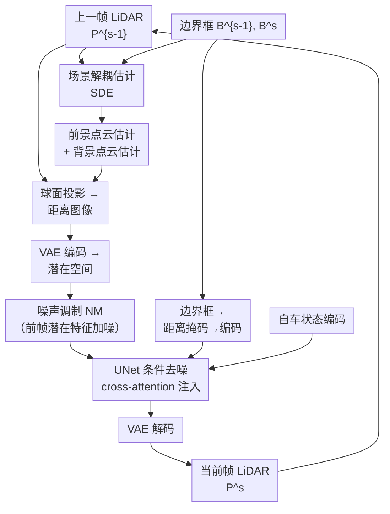

# LaGen: Towards Autoregressive LiDAR Scene Generation

**会议**: ECCV 2026  
**arXiv**: [2511.21256](https://arxiv.org/abs/2511.21256)  
**代码**: [https://github.com/szzhou88/LaGen](https://github.com/szzhou88/LaGen)  
**领域**: 自动驾驶  
**关键词**: 激光雷达场景生成, 自回归生成, 潜在扩散模型, 场景解耦估计, 噪声调制

## 一句话总结

LaGen 首次将自回归框架引入 LiDAR 场景生成，以单帧点云为起点、结合 3D 边界框与自车状态条件，逐帧生成高保真的长时间序列 LiDAR 场景，并支持交互式闭环仿真。

## 研究背景与动机

LiDAR 是自动驾驶系统中提供精确几何信息的关键传感器，在数据增强、闭环仿真、安全关键场景评估等应用中，能够生成 LiDAR 内容的世界模型具有极高的价值。然而现有的 LiDAR 生成工作（如 LiDARGen、RangeLDM）主要集中在学习数据集的分布，只能合成非序列的单帧点云；近期的 4D 场景生成方法（如 UniScene、LiDARCrafter）虽然能生成连续帧，但大多是一次性生成整个序列，缺乏交互性——在闭环仿真中，自车每一步的决策会实时影响下一帧的场景内容，而一次性生成范式无法将这种即时决策反馈融入生成过程。与此相对，LiDAR 预测方法（如 4D-Occ、ViDAR）虽然能对未来帧进行预测，但它们需要多帧历史输入，而闭环仿真启动时只有初始帧可用；更关键的是，这些方法沿预定轨迹预测、随着时间推移误差迅速累积，在长时预测任务中性能急剧退化。

这两条路径的核心矛盾在于：生成范式缺乏时间维度和交互反馈，预测范式依赖多帧输入且无法处理决策驱动的场景变化，两者都无法支持自动驾驶仿真真正需要的「长时程 + 可交互」的 LiDAR 场景生成。自回归生成——即将上一帧的输出作为下一帧的输入、逐帧迭代——天然适配这种需求，但面临的挑战也显而易见：自回归过程中生成误差会逐帧累积，且物体级的细节生成难以保证空间一致性。

本文的切入角度是：以潜在扩散模型为基座，通过精心设计的多模态条件编码将上一帧 LiDAR、3D 边界框和自车状态融合进每一步的生成；同时引入场景解耦估计模块在生成前给出当前帧的前景/背景密集估计以提升物体细节，引入噪声调制模块在训练时对前帧特征加噪以强制模型学习平滑映射、从原理上保证误差收敛。**核心 idea：将 LiDAR 场景生成构建为以单帧为起点的自回归扩散过程，通过场景解耦估计提供物体级空间先验、通过噪声调制理论保证长程误差收敛，首次实现高保真、可交互、支持闭环仿真的长序列 LiDAR 生成。**

## 方法详解

LaGen 的整体架构基于 Latent Diffusion Model（LDM），将 LiDAR 点云通过球面投影转换为紧凑的 2 通道距离图像（depth + intensity），在 VAE 潜在空间中进行扩散生成。生成过程以自回归方式逐帧推进：给定上一帧 LiDAR 点云 P^{s-1}、当前帧 3D 边界框 B^s 和自车状态 E^s，模型先通过场景解耦估计（SDE）模块预测当前帧的前景/背景点云，然后将所有这些 3D 信息投影为距离图像、经 VAE 编码到潜在空间，再经噪声调制（NM）模块处理，最终由 UNet 在多重条件引导下去噪还原当前帧 LiDAR，输出结果成为下一帧的输入。

### 整体框架

LaGen 的生成循环由以下几个阶段组成。首先，上一帧的 LiDAR 点云 P^{s-1} 和该帧对应的 3D 边界框 B^{s-1} 一起送入场景解耦估计（SDE）模块。SDE 根据边界框将点云拆分为前景（框内物体点云）和背景（框外环境点云），再结合当前帧的边界框 B^s 估计出当前帧中每个物体的位置和背景的旋转后坐标，最终输出当前帧的前景点云估计和背景点云估计。与此同时，上一帧的 LiDAR 点云也独立地通过球面投影转换为 2 通道距离图像（depth + intensity），SDE 输出的前景/背景估计也进行同样的球面投影。三者统一到距离图像空间后，由一个共享权重的 VAE 编码器将它们映射到潜在空间。

在潜在空间中，噪声调制（NM）模块对上一帧 LiDAR 对应的潜在特征施加可控强度的随机噪声——这一操作仅在训练和推理时对条件特征做，不改变生成噪声的采样方式。加噪后的特征与 SDE 输出的前景/背景潜在特征一起拼接，作为 UNet 的输入。与此同时，当前帧的 3D 边界框被投影为距离图像上的二值类别掩码（不同语义类别用不同通道表示），经一个小型 VAE 编码为掩码潜在特征；自车状态（速度、加速度、转向角、坐标变换矩阵）也编码为紧凑的 token 嵌入。这两者通过 cross-attention 注入 UNet 的不同层级，为去噪提供多模态条件引导。UNet 输出去噪后的潜在表示，经 VAE 解码为距离图像，再通过逆球面投影还原为 3D 点云，即当前帧的 LiDAR 场景 P^s。在推理过程中，P^s 直接成为下一帧的「上一帧 LiDAR」，SDE 也基于 P^s 和下一帧边界框重新估计，形成完整的自回归闭环。

### 关键设计

**1. 多模态条件编码与注入：将异构控制信号统一融合到扩散过程**

自回归 LiDAR 生成需要同时利用多种控制条件：上一帧的 LiDAR 点云提供了场景几何延续性，3D 边界框刻画了每个物体的精确空间位置和语义类别，自车状态则决定了传感器视角的变化。如何将这些异构、高维的信息有效编码并注入到扩散 UNet 中是首个关键挑战。对于上一帧 LiDAR，LaGen 将其投影为距离图像后经 VAE 编码为潜在特征 z^{s-1}，然后利用 FiLM（Feature-wise Linear Modulation）层根据两帧之间的传感器坐标变换矩阵对 z^{s-1} 进行仿射变换调整，使其视角对齐到当前帧坐标系。对于 3D 边界框，LaGen 不是简单地将框的 8 个顶点坐标作为条件——这会让模型丢失框内部的空间结构信息——而是提取每个框的 4 个底面顶点并做插值得到稠密包围点云，然后将不同语义类别的点云分别投影为距离图像上的二值掩码（每类一个通道），再用一个小型 VAE 编码为掩码潜在特征 H_B，通过 cross-attention 注入 UNet 的多个层级。值得注意的是，cross-attention 的 key 来自上一帧的边界框编码、value 来自当前帧的编码，这迫使 UNet 在去噪时同时「参考」物体过去的位置和「预测」当前的目标位置。自车状态则经 MLP + 时间步嵌入后转为单 token，同样以 cross-attention 注入。这种分层编码方案使得每种条件以最自然的形态（几何延续→FiLM 对齐、空间类别→掩码编码、运动状态→token 嵌入）进入扩散过程，避免了粗暴拼接带来的信息干扰。

**2. 场景解耦估计（SDE）：通过前景/背景分离提供物体级空间先验**

仅靠边界框的掩码信息，UNet 只能获得每个物体在场景中的「大致位置」——框内点云的稠密分布结构和物体表面的几何细节信息完全丢失了。SDE 模块的核心思路是：既然上一帧已经给出了每个物体内部的精确点云分布，而相邻帧之间物体运动不大，那么完全可以从上一帧的框内点云出发、根据物体中心偏移量推算当前帧中该物体的预期点云位置，把这个密集的「物体级估计」作为附加条件注入扩散过程。具体地，SDE 先基于上一帧 LiDAR 点云 P^{s-1} 和边界框 B^{s-1}，将 P^{s-1} 拆分为前景点云 P_obj 和背景点云 P_bg。对于前景中的每个物体点云 p_ij，先用两帧间的传感器变换矩阵 E_rel 做视角对齐得到 p̂_ij，然后在当前帧的同类物体中搜索与上一帧物体中心最接近的边界框，用两个边界框中心的偏移量 (C^s - C^{s-1}) 作为位移估计，得到 p̃_ij^s = p̂_ij^{s-1} + (C_ij^s - C_ij'^{s-1})，将所有前景估计聚合为 P̃_obj^s。背景估计则更为简单：因为背景在自车坐标系中只随自车运动而旋转（不产生平移），所以只需要用旋转矩阵对 P_bg^{s-1} 做旋转变换即可。最终，前景估计和背景估计各自投影为距离图像、经 VAE 编码后作为 UNet 的附加输入。与直接使用边界框掩码相比，SDE 提供的密集点云估计为 UNet 提供了每个物体更精细的几何先验，使得扩散生成时不用从零「想象」物体内部的结构，而是只需要在已有的高精度估计上做变形和细节修饰，显著降低了生成难度。

**3. 噪声调制（NM）：理论保证误差收敛的自回归正则化**

自回归生成中最大的难题是 train-inference mismatch：训练时模型看到的上一帧数据总是真实值，但推理时上一帧是模型自己生成的——必然含有误差。随着递归进行，这些误差逐帧放大，导致长时生成偏离真实场景。噪声调制模块从一个简洁的数学视角切入：对上一帧的条件潜在特征 z^{s-1} 加入随机强度的高斯噪声 ẑ_ε^{s-1} = √ᾱ_n · ẑ^{s-1} + √(1-ᾱ_n) · ε，其中噪声水平 n 在 [0, N] 中均匀采样，经过多项式的泰勒展开可以证明，这个看似简单的操作等价于在训练目标中隐式引入了一项对 UNet Jacobian 矩阵 Frobenius 范数的正则化项。换言之，加噪训练强迫 UNet 学习到一个更平滑的映射——当输入条件有微小扰动（即自身前一帧生成结果的误差）时，输出不会剧烈变化。从误差传播的角度看，这意味着 Jacobian 矩阵的谱半径被约束到小于 1，从而保证递归生成中的误差不会指数爆炸而是逐渐收敛。在推理阶段，NM 模块同样对条件特征（包括上一帧 LiDAR 的潜在特征和 SDE 输出的前景/背景特征）加噪，模拟训练时的分布，使模型在真实推理条件下依然保持稳定。该模块对短时生成影响极小（因为前几帧误差本身很小），但对长时生成（超过 20 帧）的效果提升随着时间推移越来越显著。

### 损失函数 / 训练策略

模型的核心损失函数为标准 LDM 的噪声预测损失，即 L_LDM = E[||ε_t - ε_θ(z_t; t, c)||^2]。训练时每帧的上一帧数据从真实数据中采样。模型在 nuScenes 数据集上训练 200 个 epoch（共 176,000 步），batch size 32，学习率 1e-4 并采用余弦退火调度，在 4 张 NVIDIA H200 GPU 上耗时约 23 小时。UNet 包含 6 个降采样/升采样块（其中部分含 Transformer 层），VAE 采用 RangeLDM 的预训练权重，距离图像分辨率 1024×32，VAE 下采样因子 4。由于距离图像具有环形结构（方位角 0 和 360 度在空间上相邻），VAE 和 UNet 中的所有标准卷积均替换为 circular 卷积以处理边界周期性。推理时采用 DDIM 采样器进行 50 步去噪，单帧生成约 0.43 秒。

## 实验关键数据

### 主实验

| 指标 | 对比方法 | SOTA 结果 | LaGen | 提升 |
|------|---------|-----------|-------|------|
| nuScenes MMD (10^-4) | LiDARCrafter (AAAI'26) | 1.52 | **0.11** | 92.8% |
| nuScenes JSD (10^-2) | LiDARCrafter | 5.43 | **2.77** | 49.0% |
| KITTI-360 MMD (10^-4) | LiDARGen (ECCV'22) | 13.36 | **1.41** | 89.4% |
| KITTI-360 JSD (10^-2) | OpenDWM (CVPR'25) | 12.93 | **5.75** | 55.5% |
| 下游检测 mAP | UniScene (CVPR'25) | 0.51 | **0.52** | +0.01 |
| 下游检测 NDS | UniScene | 0.47 | **0.49** | +0.02 |
| 物体 CD（所有类别） | UniScene | 0.939 | **0.855** | 8.9% |
| 物体 EMD（所有类别） | UniScene | 1.245 | **0.822** | 34.0% |
| CTC（4帧） | LiDARCrafter | 4.81 | **2.22** | 53.8% |

LaGen 在单帧生成质量上以极大优势超越所有现有方法——nuScenes 上 MMD 降至 0.11（此前 SOTA 为 1.52），JSD 降至 2.77（此前 SOTA 为 5.43），这两个指标的绝对数值说明 LaGen 生成的点云在 BEV 视角下的分布与真实数据几乎不可区分。在跨数据集（KITTI-360，64 线 LiDAR）测试中同样保持显著优势，展示出良好的泛化能力。时序一致性方面，CTC 指标在 4 帧上达到 2.22，远优于 LiDARCrafter 的 4.81，验证了自回归逐帧生成相比一次性生成在时间连贯性上的优势。

### 消融实验

| 配置 | CTC (2帧) | CTC (4帧) | CD@4.0s (m²) | CD@8.0s (m²) | 说明 |
|------|-----------|-----------|---------------|---------------|------|
| Full LaGen | 0.60 | 2.22 | 1.36 | 2.16 | 完整模型 |
| w/o SDE | 0.71 | 2.49 | 1.42 | 2.23 | 去掉场景解耦后 CTC 和 CD 全面劣化 |
| w/o NM | 0.73 | 2.77 | 1.38 | 2.82 | 去掉噪声调制的长时误差明显放大 |

| 推理步数 | CD@0.5s | CD@9.5s | 耗时/帧 |
|---------|---------|---------|---------|
| 10步 | 0.64 | 2.60 | 0.21s |
| 50步 | 0.50 | 2.34 | 0.43s |
| 200步 | 0.50 | 2.20 | 1.44s |

### 关键发现

- **NM 模块贡献最大，尤其体现在长时生成**：在 4 帧上 w/o NM 的 CTC 为 2.77 vs. 含 NM 的 2.22，但到了 8 秒和 9 秒时差距翻倍（CD 从 2.82 降至 2.16），证明 NM 对长时误差累积的抑制效果随时间推移越发显著。
- **SDE 对间距更短的帧对影响更大**：CTC 第 1-2 帧的改善幅度（0.71→0.60）大于后续帧，因为 SDE 提供的物体级先验对相邻帧的细节对齐最为有效。
- **推理时去噪步数存在收益递减**：10 步到 50 步提升显著（CD@9.5s: 2.60→2.34），但 50 步到 200 步几乎无提升，说明 50 步已在质量-速度间取得良好平衡。
- **交互编辑能力**：LaGen 支持在任意中间帧编辑物体的边界框（移动或删除），框后的场景中该物体被正确重定位、被遮挡区域被自动补全——这是 LiDARCrafter 等一次性生成方法无法做到的。

## 亮点与洞察

- **首次在 LiDAR 场景生成中采用逐帧自回归范式**：相比一次性生成全序列，自回归路线能以自然的方式接入闭环仿真中每步的决策反馈，这是通往交互式世界模型的关键能力。
- **SDE 的创新在于「用过去帧的密集点云说当前帧的话」**：传统做法只给模型边界框坐标或掩码这种稀疏条件，SDE 直接把上一帧框内数千点云经中心偏移后送入生成——相当于给了 UNet 一个「线稿」而非「描述」，大幅降低了扩散模型从零想象物体细节的负担。
- **NM 将误差累积问题转化为 Jacobian 正则化**：加噪训练的表象下是严格的数学保证——通过隐式约束映射函数的平滑性来确保递归过程中误差不爆炸。这个思路类似对抗训练中的正则化解释，简洁而具有理论深度。
- **交互编辑的自然支持**：由于每帧独立生成且基于边界框条件，在任意中间帧插入、删除、移动边界框即可改变场景内容，这一能力对安全关键场景的遍历测试（corner case 构造）有直接实用价值。

## 局限与展望

- **传感器局限性**：LaGen 主要针对单回波旋转式机械 LiDAR（如 nuScenes 的 32 线），未显式建模多回波 LiDAR 和非旋转式 LiDAR（如固态激光雷达），后者需要探索新的 LiDAR 表示形式。
- **拥挤场景下的 SDE 匹配问题**：SDE 基于最近邻的物体匹配策略在同类物体密集的场景中可能匹配错误，作者提出未来可利用仿真中的 tracklet 信息进行帧间关联来改进。
- **计算开销**：单帧推理约 0.43 秒（50 步 DDIM），虽已接近准实时但距离自动驾驶仿真中 10Hz 甚至 20Hz 的真实时仍有差距，加速推理（如蒸馏或更少的步数）是落地的关键。
- **评价指标的完整性**：当前时序一致性主要依赖于 CD 和 CTC 这类几何指标，对于动态场景中物体运动的语义合理性（如车辆是否遵循交通规则、行人是否自然走停）缺乏评估，未来可能需要引入基于检测或轨迹的语义级评价。不过这项工作作为一个生成框架，其实际应用中的合理性很大程度上取决于下游仿真器的整体设计，这一点作者已在定量实验中通过下游检测任务做了初步验证。

## 相关工作与启发

- **vs LiDARCrafter (AAAI'26)**: LiDARCrafter 也探索了自回归 LiDAR 生成，但它是基于初始场景语义一次性生成长序列的控制条件（轨迹+边界框），模型再根据这些预生成条件一次性渲染全序列，缺乏逐帧交互能力。LaGen 的边界框条件来自每一步的仿真器反馈（即由前一帧动作决定），因而天然支持闭环交互。在生成质量上，LaGen 的 MMD=0.11 vs LiDARCrafter 的 1.52（高约 14 倍），差距悬殊。
- **vs UniScene (CVPR'25)**: UniScene 以 occupancy 作为中间表示生成 LiDAR 序列，同样不具备逐帧交互能力。LaGen 在时序一致性（CTC）上全面优于 UniScene。
- **vs 4D-Occ (CVPR'23)**: 作为 LiDAR 预测代表方法，4D-Occ 需要 2-6 帧历史输入且只能沿预定轨迹预测，在 9.5s 时 CD 高达 55.47（2 帧输入）和 21.08（6 帧输入），而 LaGen 仅用 1 帧输入即达到 2.34，说明预测范式在长时程任务上有先天缺陷（固定的动力学假设在实际驾驶中不成立）。

## 评分

- 新颖性: ⭐⭐⭐⭐⭐ 首次将逐帧自回归范式引入 LiDAR 场景生成，SDE 和 NM 两个模块的设计均有数学/工程深度
- 实验充分度: ⭐⭐⭐⭐⭐ 在生成质量、时序一致性、长时预测、下游检测、跨数据集泛化、交互编辑等多个维度做全面验证，消融实验完整，还包含推理效率分析和边界框鲁棒性测试
- 写作质量: ⭐⭐⭐⭐ 方法叙述清晰，理论分析在附录中有扎实的数学推导，主图流程图直观；但公式较多且主文和附录间有部分重复
- 价值: ⭐⭐⭐⭐⭐ 该方法直接服务于自动驾驶闭环仿真这一刚需，自回归+交互生成的设计范式有助于推动 LiDAR 世界模型的发展，代码已开源

<!-- RELATED:START -->

## 相关论文

- [\[ECCV 2026\] FrozenDrive: Zero-Shot Text-Guided Driving Scene Generation and Data Augmentation](frozendrive_zero-shot_text-guided_driving_scene_generation_and_data_augmentation.md)
- [\[ICCV 2025\] Long-term Traffic Simulation with Interleaved Autoregressive Motion and Scenario Generation](../../ICCV2025/autonomous_driving/long-term_traffic_simulation_with_interleaved_autoregressive_motion_and_scenario.md)
- [\[ECCV 2026\] Long-term Traffic Simulation via Structured Autoregressive Modeling](long-term_traffic_simulation_via_structured_autoregressive_modeling.md)
- [\[NeurIPS 2025\] SPIRAL: Semantic-Aware Progressive LiDAR Scene Generation and Understanding](../../NeurIPS2025/autonomous_driving/spiral_semantic-aware_progressive_lidar_scene_generation_and_understanding.md)
- [\[ICCV 2025\] Controllable 3D Outdoor Scene Generation via Scene Graphs](../../ICCV2025/autonomous_driving/controllable_3d_outdoor_scene_generation_via_scene_graphs.md)

<!-- RELATED:END -->
