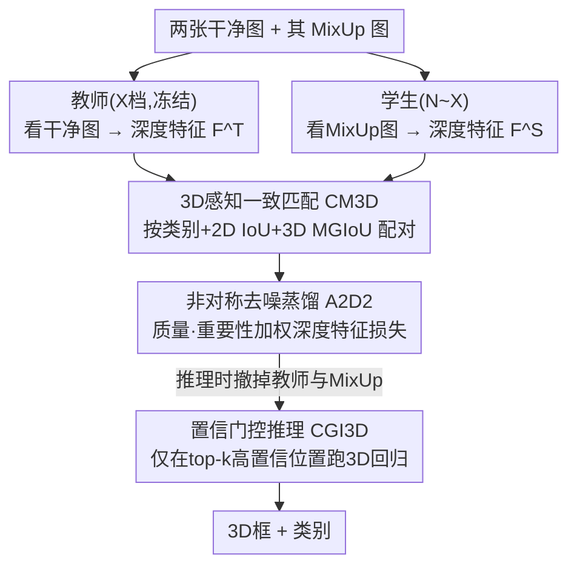

# LeAD-M3D: Leveraging Asymmetric Distillation for Real-Time Monocular 3D Detection

**会议**: ECCV 2026  
**arXiv**: [2512.05663](https://arxiv.org/abs/2512.05663)  
**代码**: [https://deepscenario.github.io/LeAD-M3D/](https://deepscenario.github.io/LeAD-M3D/)  
**领域**: 自动驾驶 / 3D视觉  
**关键词**: 单目3D检测, 知识蒸馏, 实时推理, MixUp去噪, YOLOv10

## 一句话总结
LeAD-M3D 在纯图像 YOLOv10-M3D 基线上叠加三个组件——非对称 MixUp 去噪蒸馏（A2D2）、把 3D 重叠塞进匹配打分的 CM3D、只对高置信区域跑 3D 回归头的 CGI3D——不用 LiDAR / 双目 / 几何先验，就在 KITTI、Waymo、Rope3D 上做到 SOTA 精度，同时比同精度模型快最多 3.6 倍、TensorRT 下最大模型也能跑到 60 FPS 以上。

## 研究背景与动机
单目 3D 检测（M3D）要从一张 RGB 图恢复物体的 3D 位置、朝向和尺寸，深度歧义是它绕不开的核心误差来源，而当相机存在非零 roll/pitch（比如路侧摄像头俯视视角）时这个问题会进一步放大。为了补上缺失的深度信息，主流做法分成两条路：一条是训练时借助额外模态或数据（LiDAR、双目、物体形状、时序、地平面）来监督深度，另一条是往模型里注入几何先验（最典型的是「2D 高度与深度成反比」这类透视假设）来正则化深度。前者的问题是 LiDAR 在无人机、某些路况下根本拿不到，且多模态 pipeline 又重又复杂；后者的假设只在近似平视、roll/pitch 接近零的车载前视相机下成立，一换视角就崩，把部署死死限制在前向车载摄像头上。真正只靠 3D 框监督、不吃额外模态也不吃硬编码先验的方法这一类，才有跨视角、跨数据集的通用性——本文就锚定这一类。

在这一类里，还有一个被长期牺牲的维度：运行时效率。近年 M3D 论文普遍把精度堆到极致却忽视推理速度，导致落地困难。知识蒸馏（KD）本是「既要精度又要效率」的成熟范式：让一个大而慢的教师把知识传给小而快的学生。但现有 M3D 蒸馏为了制造「教师比学生强」的非对称性，几乎清一色地给教师喂 LiDAR——这又把模态依赖请回来了；而且标准 KD 损失对所有特征一视同仁地对齐，既不看教师这次预测得准不准，也不管某个特征通道对最终深度到底有多大影响。

本文的切入角度是：非对称性不一定要靠「给教师更多信息」来造，反过来「给学生更难的输入」同样能造。让教师看两张干净图、学生看这两张图 MixUp 混合后的噪声图，逼学生在被污染的输入下复现教师的干净深度特征——蒸馏于是变成一个去噪任务，全程只用图像。**核心 idea 是把 M3D 蒸馏重构成「非对称 MixUp 去噪」：教师看干净图、学生看 MixUp 图，用一个按教师预测质量和特征通道重要性加权的深度特征损失做对齐，配合 3D 感知的一致匹配（CM3D）保证师生配对可靠、置信门控推理（CGI3D）把 3D 回归只算在高置信位置，从而在无 LiDAR、无几何先验下同时拿下精度与实时。**

## 方法详解

### 整体框架
LeAD-M3D 的骨架是 YOLOv10-M3D——即在 YOLOv10 上加装标准 3D 检测头（3D 偏移、3D 尺寸、朝向、深度、深度不确定性五个头）、后处理与 3D 损失，得到一个天然高效、且无需 NMS 的实时 M3D 基线。整个模型族按 YOLO 的惯例分成 N/S/M/B/X 五档，其中最大的 X 档在**不用 A2D2**的情况下先训成教师，冻结后给任意档位的学生做蒸馏。

训练时，一对干净图送进冻结的教师、它们 MixUp 混合后的图送进学生，两边共享同一套元架构（只是学生更小），各自跑出预测。CM3D 负责把每个真值物体分别匹配到教师侧和学生侧的最佳预测，从而在「同一个物体」上建立起师生特征对；A2D2 只在深度头输出的**实例深度特征**（而非通用 backbone 激活）上做加权对齐蒸馏。推理时教师和 MixUp 全部撤掉，学生用 CGI3D 只在分类头挑出的 top-k 高置信位置周围跑 2D/3D 回归。三个组件各管一段：A2D2 管「怎么把教师的深度推理能力搬进学生」，CM3D 管「师生/监督的配对是否可靠」，CGI3D 管「推理时别在背景上浪费算力」。

### 关键设计

**1. A2D2：用 MixUp 去噪造非对称，把深度推理蒸进学生**

现有 M3D 蒸馏靠给教师喂 LiDAR 来简化教师任务、制造师生落差，代价是重新引入模态依赖。A2D2 反其道而行：不给教师加信息，而是给学生「加难度」。它在像素级把两张图 MixUp 混合成一张送给学生，并要求学生同时检出两张图里的所有物体。MixUp 相比其他增广的关键好处是——它保留了两张图里所有物体的完整空间范围，投影中心、深度、尺寸、朝向这些几何量都不变，因此没有任何真值标注因增广而丢失，天然构成一个「在特征空间去掉 MixUp 伪影」的去噪任务。教师看的是对应的干净图，于是学生必须在被污染的输入下复现教师的干净深度特征，非对称性和去噪目标就这样被同时造出来，全程无需 LiDAR，且师生能共用同一套架构、大幅降低复杂度。作者还专门验证过 MixUp 造出的落差最大：在增广后的 KITTI 验证集上，教师深度误差中位数从干净图的 59 cm 涨到 MixUp 的 75 cm（RandAugment/CutMix 只到 62/66 cm），落差越大蒸馏收益越高。另一个细节是蒸馏对象选深度头的实例深度特征而非通用 backbone 特征——消融显示换成 backbone 特征 Moderate AP 掉 0.35%，说明对 3D 任务而言深度特征是更对味的迁移目标。

**2. 质量与重要性加权的深度特征损失：别对所有特征一视同仁**

标准 KD 损失对所有特征均匀对齐，既不管教师这次预测得准不准，也不管某个通道对最终深度贡献多大——A2D2 用两个权重把这两件事补上。第一个是**教师质量权重**：如果教师对某个物体的深度都估不准，硬去对齐它的特征只会引入噪声，所以按相对深度误差给它打折。设真值深度为 $z_i$、教师预测深度为 $\hat z_i^{\rm T}$，质量指标定义为

$$\eta_i = \frac{z_i}{\max\!\bigl(\lvert z_i - \hat z_i^{\rm T}\rvert,\ \epsilon\bigr)},\qquad \epsilon=0.1$$

用「相对」误差（分子带 $z_i$）而非绝对误差，是为了避免天然误差就小的近处物体被过度加权、远处物体被压没——归一化后近远物体的权重才可比。第二个是**通道重要性权重**：深度是用教师深度头权重 $W^{\rm T}$ 对深度特征做回归得到的，某通道的权重绝对值越大，它对最终深度影响越大，于是把该通道的归一化权重 $\omega_q=\lvert W_q^{\rm T}\rvert / \sum_{q'}\lvert W_{q'}^{\rm T}\rvert$ 作为重要性。最终损失是两权重相乘、在 CM3D 匹配好的物体上对师生实例深度特征做加权 L1：$\mathcal{L}^{\text{distill}}=\frac{1}{|B(\mathbf I)|}\sum_i\sum_q \omega_q\,\eta_i\,\lvert\mathcal F^{\rm T}_{i,q}-\mathcal F^{\rm S}_{i,q}\rvert$。消融里去掉质量指标 Moderate AP 掉 0.37%、去掉重要性指标掉 0.61%，两个都在起作用。训练用离线 KD（冻结教师），作者发现改成在线自蒸馏会掉 0.85% AP——因为最强的蒸馏目标要到训练后期、学习率衰减、深度收敛时才浮现，在线蒸馏赶不上这个时机。

**3. CM3D：把 3D 重叠塞进匹配打分，让监督反映真正的 3D 定位质量**

无论是常规监督训练还是 A2D2，都需要把预测和真值可靠地配对起来；匹配一旦有噪声，师生对就会错位、训练不稳，尤其在 MixUp 场景下多个物体的 2D 投影高度重叠时更糟。YOLOv10-M3D 基线的匹配只看 2D：用 $s_{i,j}^{\text{2D}}=\hat p_{i,c_j}^{\alpha}\,\operatorname{IoU}(\hat{\mathbf b}_i^{\text{2D}},\mathbf b_j^{\text{2D}})^{\beta}$（类别概率 × 2D IoU 的加权积）排序取 top-k。CM3D 把它抬进 3D，乘上一项预测框与真值框的 3D 重叠：

$$s_{i,j}^{\text{2D/3D}} = s_{i,j}^{\text{2D}}\cdot \operatorname{MGIoU}(\hat{\mathbf b}_i^{\text{3D}},\mathbf b_j^{\text{3D}})^{\gamma}$$

这里刻意不用普通 3D IoU 而用 MGIoU（Marginalized Generalized IoU）：普通 IoU 在两框不相交时恒为 0、梯度消失，而训练早期或小物体上恰恰经常不相交；MGIoU 把两个 3D 形状投影到一组唯一的方向法向量上、对每个 1D 方向算 generalized IoU 再边缘化聚合，即使完全不相交也能给出有意义的重叠代理，同时聚合了位置、尺寸、朝向且对物体尺度不变（不像基于角点的损失）。这样设计的巧处在于两项各司其职：3D 估计还很粗糙时靠 2D 项稳住学习，随着精度上升 3D 项再来把重叠预测区分开；相比很多 M3D 用的静态 anchor 匹配，这套动态 2D/3D 打分在拥挤场景和 MixUp 混合内容下的消歧能力明显更强。代价极小——用 MGIoU 只让训练时间增加不到 2%。

**4. CGI3D：只对高置信区域跑 3D 回归，把算力从背景上省下来**

M3D 检测器通常在整张特征图上密集地跑回归头，但大部分位置都是背景，这部分算力纯属浪费。CGI3D 的做法很直接：拿到 neck 特征后，先只把**分类头**在全图上密集跑一遍，据类别置信度选出 top-k 位置，然后只在这些位置周围抠出 3×3 的局部 patch，把 2D/3D 回归头只作用在这些稀疏 patch 上。它能做到「输出与密集评估逐位相同、零精度损失」的关键，是回归头的有效感受野恰好就是 3×3（一层 3×3 卷积接两层 1×1 卷积），所以 3×3 patch 已经涵盖了每个位置回归所需的全部上下文——这比 RoI-Align 常用的 7×7 网格更简单，还省掉了双线性插值。训练时为简单起见仍保留密集计算，只在推理时把 top-k 选择提前、回归头搬到 patch 上。实测在 N 档上单加 CGI3D 就把运行时砍掉约三分之二、FLOPs 降约 75% 而 AP 几乎不变；再把回归头通道从 128 减到 64，运行时再省 0.7 ms、FLOPs 再降约 40%，精度依旧持平。

### 损失函数 / 训练策略
教师（LeAD-M3D X w/o A2D2）先用标准监督损失训成——分类损失 $\mathcal L^{\text{cls}}$、2D 框损失 $\mathcal L^{\text{2D}}$、3D 框损失 $\mathcal L^{\text{3D}}$——然后冻结。蒸馏阶段训练任意档位的学生，总损失在这三项监督损失上加蒸馏损失：$\mathcal L=\mathcal L^{\text{cls}}+\mathcal L^{\text{2D}}+\mathcal L^{\text{3D}}+\mathcal L^{\text{distill}}$。优化用 Adam，初始学习率 0.001、权重衰减 0.0005、3 epoch warmup 的余弦调度；CM3D 超参 $\alpha=0.5,\beta=1.0,\gamma=1.0$。全程单卡 NVIDIA RTX 8000：教师训练约 34 小时，学生随档位增大到 X 时峰值约 60 小时（KITTI）。

## 实验关键数据

### 主实验
KITTI test 上与轻量级（<30M 参数）M3D 方法对比，Car 类 AP0.7（3D|R40）：

| 方法 | 额外数据 | 参数(M) | 时间(ms) | Easy | Mod. | Hard |
|--------|------|------|------|------|------|------|
| MonoNeRD | LiDAR | 6.6 | 1380.3 | 22.75 | 17.13 | 15.63 |
| MonoLSS | — | 21.5 | 20.2 | 26.11 | 19.15 | 16.94 |
| LeAD-M3D S (本文) | — | 10.1 | 10.2 | 27.28 | 18.87 | 16.37 |
| LeAD-M3D B (本文) | — | 24.9 | 13.9 | **29.10** | **20.17** | **18.34** |

其中 LeAD-M3D S 精度超过 MonoNeRD 却推理快 100 倍以上（后者被重量级 3D 体处理拖慢）；B 档在几乎所有精度指标上超过无额外数据的最强基线 MonoLSS，且运行时还快 34%。KITTI test 与 SOTA 对比（最大 X 档）：

| 方法 | 额外数据 | Easy | Mod. | Hard |
|--------|------|------|------|------|
| MonoTAKD | LiDAR | 27.91 | 19.43 | 16.51 |
| MonoDGP | Geometry | 26.35 | 18.72 | 15.97 |
| MonoDiff | — | 30.18 | 21.02 | 18.16 |
| LeAD-M3D X (本文) | — | **30.76** | **21.20** | **18.76** |

LeAD-M3D X 在 AP3D|R40 上超过所有方法（含吃 LiDAR / 几何先验的），且比前 SOTA MonoDiff 快 3.6 倍。Rope3D（路侧视角）Car 类 AP 16.45 为最佳；Waymo 验证集 X 档 AP0.5（3D，L1）16.46，比前最佳 MonoLSS 高 2.97；跨域（nuScenes→KITTI）B 档 Easy AP0.5 达 45.50，超过专门做域泛化的 MonoGDG（33.48），甚至逼近用到目标域数据的 UDA 方法。

### 消融实验
CM3D 与 A2D2 逐项拆解（KITTI val，B 档，Car AP0.7 Mod. + 深度误差中位数 MDE）：

| 配置 | A2D2 | CM3D-2D | CM3D-3D | Mod. AP↑ | MDE↓(cm) |
|------|------|------|------|------|------|
| 1 (基线 YOLOv10-M3D B) | | ✓ | | 19.60 | 61 |
| 2 (+CM3D-3D) | | ✓ | ✓ | 20.43 | 60 |
| 5 (完整 LeAD-M3D B) | ✓ | ✓ | ✓ | **22.65** | **56** |

A2D2 细项消融（B 档，Mod. AP）：

| 配置 | Mod. AP↑ | 说明 |
|------|------|------|
| 完整 A2D2 | 22.65 | — |
| 换 backbone 特征 | 22.30 | 深度特征才是对味的蒸馏目标 |
| 去质量指标 | 22.28 | 掉 0.37% |
| 去重要性指标 | 22.04 | 掉 0.61% |
| 换在线自蒸馏 | 21.80 | 掉 0.85%，强目标只在后期出现 |
| 教师也看 MixUp（去非对称）| 21.57 | 掉 1.08%，非对称/去噪确实有用 |
| w/o A2D2 | 20.43 | — |

### 关键发现
- A2D2 是核心引擎：在已加 CM3D 的配置 2 基础上再加 A2D2，Moderate AP 涨 2.22%、深度误差再降 4 cm，是精度和深度的主要驱动力；CM3D 单独也能贡献（配置 2 相对基线 +0.83% AP、-1 cm）。
- 增广越难蒸馏越强：MixUp 造出的教师深度误差落差最大（75 cm vs CutMix 66/RandAugment 62/干净 59），蒸馏时 MixUp 也取得最高 AP，三种增广都优于不蒸馏。
- CGI3D 是「几乎白送」的加速：N 档上砍掉约 2/3 运行时、约 75% FLOPs，AP 逐位相同、零损失；因为回归头有效感受野正好 3×3，抠 3×3 patch 不丢任何上下文。
- 机制上，去噪和蒸馏分工互补：MixUp 去噪逼学生依赖物体结构等 MixUp 不变线索、而非噪声背景（显著图分析可见），深度特征蒸馏则为去噪提供有效引导信号。

## 亮点与洞察
- 非对称性可以「反向」制造：以往都想着给教师加 LiDAR，本文改成给学生喂 MixUp 噪声图并要求它复现教师干净特征，把蒸馏变成去噪任务，纯图像就拿到了原本要靠特权模态才有的深度落差——思路可迁移到任何「教师有干净输入、想让学生更鲁棒」的蒸馏场景。
- 加权 L1 里那两个权重设计得很实在：用相对深度误差当质量权重避免了近处物体霸占梯度，用深度头权重绝对值当通道重要性直接锚定了「谁真正决定深度」，比笼统对齐所有特征更有的放矢。
- CGI3D 把「稀疏化推理」做到了严格无损，靠的是对感受野的精确认知（3×3 卷积 + 两个 1×1 恰好等于 3×3 感受野），这种「用架构性质换免费加速」的 trick 很值得借鉴。
- 用 MGIoU 而非普通 3D IoU 做匹配打分，绕开了「两框不相交时梯度消失」在训练早期/小物体上的老问题，且训练开销 <2%。

## 局限与展望
- 作者只做监督设定，明确指出蒸馏可扩展到半监督以进一步 scale M3D，但本文未验证。
- 教师固定用最大 X 档、离线冻结蒸馏，训练需分两阶段（教师 34h + 学生最多 60h），整体训练开销不小；在线蒸馏被证实更弱，暂无更省的一阶段方案。
- 依赖 MixUp 保持几何量不变这一性质来构造无损去噪任务，若换成会破坏几何一致性的增广，这套框架的前提就不成立。
- 主实验集中在车载/路侧驾驶数据集（KITTI/Waymo/Rope3D/nuScenes），论文声称通用性强，但更极端视角（如无人机大俯仰）只在相关工作中提及、未在本文正式评测。

## 相关工作与启发
- **vs MonoDistill / MonoTAKD 等 LiDAR 蒸馏**：它们靠给教师喂 LiDAR 制造师生落差，本文用 MixUp 去噪在纯图像下制造落差，pipeline 更简单、师生共享架构，且在 KITTI test 上精度反超这些吃 LiDAR 的方法。
- **vs ADD / FD3D**：这两者也去掉 LiDAR，但改成给教师喂真值物体位置或物体级深度图（仍是「给教师更多信息」），本文是「给学生更难输入」，角度相反。
- **vs MonoUNI / MonoDGP 等几何先验方法**：它们靠「2D 高度∝1/深度」这类透视先验正则深度，只在近平视车载视角成立、换视角就崩；本文不用任何几何先验、显式支持任意 SO(3) 朝向，因此在 Rope3D 路侧视角和跨域上都更稳。
- **vs MonoLSS（无额外数据最强基线）**：同为纯 3D 框监督，本文 B 档在精度上几乎全面超过它、运行时还快 34%，靠的是 A2D2 蒸馏 + 任务对齐匹配把精度提上去、CGI3D 把速度压下来。

## 评分
- 新颖性: ⭐⭐⭐⭐ 「给学生喂噪声造非对称蒸馏」这一反向视角新颖且实用，加权损失与 MGIoU 匹配组合扎实。
- 实验充分度: ⭐⭐⭐⭐⭐ 四数据集 + 跨视角 + 域泛化 + 逐组件消融 + 增广/感受野分析，覆盖全面且有 Pareto 前沿图。
- 写作质量: ⭐⭐⭐⭐ 结构清晰、消融把每个设计的贡献量化得很清楚，公式与图配合到位。
- 价值: ⭐⭐⭐⭐⭐ 无 LiDAR/几何先验下同时拿精度与实时（60+ FPS），对单目 3D 检测落地有直接价值。

<!-- RELATED:START -->

## 相关论文

- [\[ECCV 2026\] Real-Time Source-Free Object Detection](real-time_source-free_object_detection.md)
- [\[ECCV 2026\] PLOT: Pseudo-Labeling via Object Tracking for Monocular 3D Object Detection](plot_pseudo-labeling_via_object_tracking_for_monocular_3d_object_detection.md)
- [\[ICCV 2025\] Adaptive Dual Uncertainty Optimization: Boosting Monocular 3D Object Detection under Test-Time Shifts](../../ICCV2025/autonomous_driving/adaptive_dual_uncertainty_optimization_boosting_monocular_3d_object_detection_un.md)
- [\[ICCV 2025\] RTMap: Real-Time Recursive Mapping with Change Detection and Localization](../../ICCV2025/autonomous_driving/rtmap_real-time_recursive_mapping_with_change_detection_and_localization.md)
- [\[CVPR 2026\] ReManNet: A Riemannian Manifold Network for Monocular 3D Lane Detection](../../CVPR2026/autonomous_driving/remannet_a_riemannian_manifold_network_for_monocular_3d_lane_detection.md)

<!-- RELATED:END -->
