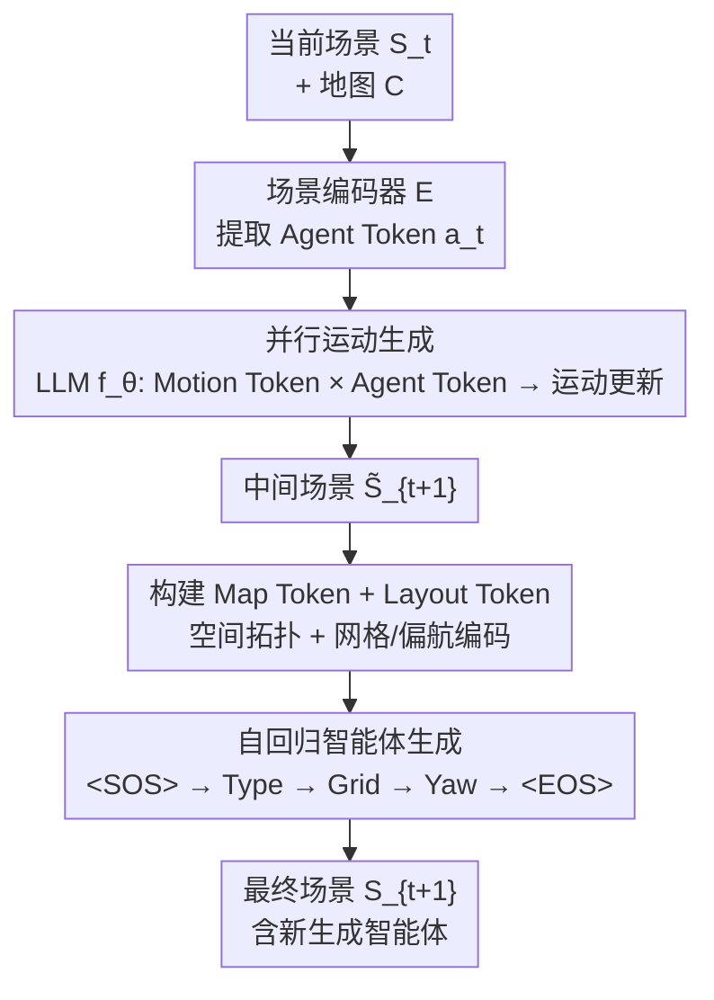

# Long-term Traffic Simulation via Structured Autoregressive Modeling

**会议**: ECCV 2026  
**arXiv**: [2606.31209](https://arxiv.org/abs/2606.31209)  
**代码**: [https://sephirex-x.github.io/rosettasim/](https://sephirex-x.github.io/rosettasim/) (有)  
**领域**: 自动驾驶  
**关键词**: 交通仿真, 自回归建模, 大语言模型, 长时仿真, 检索式评估

## 一句话总结
RosettaSim 将长时多智能体交通仿真建模为结构化自回归序列生成问题，利用冻结/部分冻结的 LLM（Qwen2.5-0.5B）作为结构先验，将场景拓扑、智能体状态和生成意图投影到变长 token 序列中统一处理运动预测与智能体种群动态；同时提出检索式交通评估框架 RTE，用语义相似的真实场景作为参考锚点替代全局分布匹配，在 WOSAC 短时和长时仿真上均达到 SOTA。

## 研究背景与动机
交通仿真是自动驾驶系统可扩展安全开发的关键世界模型。现有方法在短时仿真（<8s）上表现出色，但长时、行程级仿真面临两个根本挑战：**智能体持续进出场景**导致 token 基数动态变化，以及**缺乏可靠的长时评估协议**。

现有长时工作将场景生成（智能体注入）和运动生成统一建模在一个 rollout 过程中。然而，**场景生成关注空间分布**（预测新智能体何时何地出现），**运动生成强调时序一致性**（预测智能体如何移动），两类目标本质不同。最新工作 SceneStreamer 在短时指标上大幅落后于专用短时模型（如 UniMM），说明当前建模范式无法同时充分表达智能体种群动态和长时运动依赖。与此并行的是，大规模序列模型（LLM）在长程依赖建模上展示了强大能力，但在交通仿真中的应用仍停留在「用语言做条件化控制」或「借鉴架构设计灵感」的层面，没有工作论证过 LLM 的结构化序列建模能力是否可以直接迁移到交通仿真。

本文的核心发现是：**离散化交通运动 token 的频率分布严格遵循 Zipf 定律**（与自然语言 token 的统计特性高度一致），且 LLM 在处理语言和运动数据时表现出高度相似的注意力局部性（attention locality）。这暗示预训练 LLM 的内部表征已经包含高度可迁移的结构感知能力——交通动态可以视为一门「外语」，LLM 就是最优的初始化流形。基于此洞察，本文提出 **RosettaSim**：将几何拓扑、已有智能体状态、生成意图统一投影到结构化自回归 token 序列，同时处理并行运动更新和自回归智能体生成，显著缓解场景生成与运动生成的性能折中。同时，针对长时评估中一对一智能体匹配随时间失效的问题，提出 **RTE（Retrieval-based Traffic Evaluation）**，用预训练场景 VAE 的潜在空间检索语义最相似的真实场景作为上下文感知的参考锚点。

**核心 idea**：利用 LLM 的结构先验（而非语言语义），将多智能体交通场景演化建模为结构化自回归 token 序列，统一处理运动生成和智能体种群动态。

## 方法详解

### 整体框架
RosettaSim 将长时交通仿真形式化为条件序列生成问题：给定当前场景 $\mathcal{S}_t$（$N_t$ 个活跃智能体的状态 token）和地图上下文 $\mathcal{C}$，预测下一时刻场景 $\mathcal{S}_{t+1}$。核心创新在于将标准转移概率分解为两个可处理的过程——**并行运动更新**（所有已有智能体同时预测下一状态）和**自回归智能体生成**（条件化于运动更新后的中间场景，逐 token 生成新智能体）。两个过程共享同一个冻结/部分冻结的 LLM 骨干 $f_\theta$，所有 token 被组织成统一的结构化序列送入 LLM，端到端单阶段训练。

场景编码器 $\mathcal{E}$（基于 SMART 的预训练 Transformer 层）将智能体中心化的场景上下文编码为 Agent Token $\mathbf{a}_t^{1:N_t}$，维度通过 MLP 对齐到 LLM。随后，一组可学习的 Motion Token $\mathbf{mo}^{1:N_t}$ 与 Agent Token 一同送入 LLM，通过自注意力交互提取运动上下文，输出更新后的 Motion Token，经 MLP 投影为运动 logits 实现所有智能体的并行状态更新。在此基础上，从中间场景构建 Map Token（道路网络几何拓扑）和 Layout Token（网格位置 + 偏航角的离散化编码），与已有 token 拼接成上下文前缀，条件化地指导自回归智能体生成：LLM 依次采样智能体类型 token $\mathbf{c}^j$、网格 token $\mathbf{g}^j$、偏航 token $\mathbf{y}^j$，直至采样出 `<EOS>` 停止。为区分不同智能体，所有 token 均叠加 agent-wise 正弦位置嵌入 $\text{SinPE}(i)$。

### 关键设计

**1. LLM 结构先验的适配性：运动 Token 与自然语言的分布同构**

本文通过两组探测实验系统性地揭示了 LLM 能适配交通仿真的根本原因。第一，**数据分布层面**：在 WOMD 数据集上统计离散化运动 token 的频率分布，发现其严格遵循 Zipf 定律，与自然语言 token 的分布特性几乎一致——少数常见动作（巡航、静止）高频出现，复杂机动（急转弯）低频出现。当人为破坏运动 token 的 Zipf 分布（如强制均匀分布，Zipf 系数降为 0）时，模型性能大幅下降，直接验证了「分布同构是适配前提」的假设。第二，**注意力机制层面**：将 attention locality（定义为注意力权重在主对角线及其相邻对角线上的占比，衡量 token 对自身和近邻的关注程度）作为探针，对比 Qwen2.5-0.5B 在不同数据源（文本 vs 运动）下各层的 locality 曲线，两者高度一致；而 Llama 和 TinyLlama 则差异较大，这解释了为什么 Qwen 系列在冻结设定下表现最优——其多语言预训练（29 种语言，18T token）培养了更泛化的序列建模能力，使运动 token 被有效视为一门「外语」。这两个发现共同说明：预训练 LLM 提供的是**结构化的序列先验**（统计分布 + 注意力模式），而非语言语义知识。

**2. 结构化自回归序列：并行运动更新 + 条件化智能体生成**

这是 RosettaSim 的核心架构贡献。与 InfGen 等「一次性生成整个场景拓扑」的做法不同，RosettaSim 将场景转移分解为两个有序步骤。并行运动更新阶段：所有 $N_t$ 个已有智能体在给定丰富历史场景上下文 $\mathcal{S}_t$ 和地图 $\mathcal{C}$ 的条件下**条件独立地**同时预测下一状态，近似为 $\prod_{i=1}^{N_t} p(\tilde{s}_{t+1}^i \mid \mathcal{S}_t, \mathcal{C})$，保证仿真效率。这一步输出的中间场景 $\tilde{\mathcal{S}}_{t+1}$ 是纯运动更新后的状态，尚未发生拓扑变化。

自回归智能体生成阶段：将中间场景编码为 Map Token $\mathbf{m}^{1:M_t}$（从预训练地图编码器提取的道路网络几何关系）和 Layout Token $\mathbf{l}^{1:N_t}$（由网格 token $\mathbf{g}^i$ 和偏航 token $\mathbf{y}^i$ 组成，分别通过 $3\text{m}$ 网格量化和 $3^\circ$ 偏航量化后嵌入得到）。已有场景的 token 作为上下文前缀，LLM 以标准因果注意力依次生成新智能体的三个结构化 token——类型（车辆/行人/自行车）、网格位置、偏航方向——形成序列 $[\texttt{<SOS>}, \mathbf{c}^1, \mathbf{g}^1, \mathbf{y}^1, \ldots, \mathbf{c}^J, \mathbf{g}^J, \mathbf{y}^J, \texttt{<EOS>}]$，其中 $J$ 为新生成智能体数量,最终 $N_{t+1} = N_t + J$。这种**智能体级**（agent-level）的自回归插入方式相比 InfGen 的**场景级**一次性生成，能捕捉智能体之间复杂异步的交互，且因果注意力天然保证新智能体不干扰已有智能体的运动轨迹。

**3. 检索式交通评估框架 RTE**

长时仿真中智能体动态进出使严格的一对一匹配失效。此前工作将 rollout 切为短窗口后与整个验证集的全局分布计算散度，但全局匹配存在严重统计偏差：强制高速场景匹配低速为主的全局分布会惩罚真实行为（论文实证发现 log-based Kinematic 指标与标准 WOSAC 指标呈**负相关**，$r \approx -0.3$）。RTE 的解决方案受图像生成中 LPIPS 度量的启发：给定一段仿真 rollout $\mathcal{S}_{0:T}$，先切成时长 $\tau$ 的短片段 $\{\mathcal{S}_{t:t+\tau}\}$，每个片段经预训练场景 VAE $\mathcal{E}_\phi$（复用官方 checkpoint，无微调）编码为潜在表示 $\mathbf{z} = [\mathbf{z}_{\text{object}}, \mathbf{z}_{\text{map}}]$（物体级和地图级高斯参数），然后在验证集所有 log 片段构建的检索库中，按 Wasserstein 距离 $\text{similarity}(\mathbf{z}, \hat{\mathbf{z}}) = W_2(\mathbf{z}_{\text{object}}, \hat{\mathbf{z}}_{\text{object}}) + \lambda \cdot W_2(\mathbf{z}_{\text{map}}, \hat{\mathbf{z}}_{\text{map}})$ 检索 top-K 最相似的真实场景作为参考锚点，最后在仿真片段与检索参考之间计算评估指标。RTE 提出 RMM-F1（Realism Meta Metric F1）作为综合指标：对行为真实度（Behavior Realism，聚合 WOSAC 类指标）和交通流真实度（Traffic Flow Realism，智能体进出计数的宏观分布）取调和平均（$\beta=1$），严格惩罚只在单一维度上表现好的模型。

### 损失函数 / 训练策略
训练采用极简的单阶段交叉熵损失。将所有 token 拼接为统一序列 $\texttt{seq} = [\mathbf{a}^{1:N_t}, \mathbf{mo}^{1:N_t}, \mathbf{m}^{1:M_t}, \mathbf{l}^{1:N_t}, \mathbf{s}]$（其中 $\mathbf{s}$ 为 spawn token 序列），仅对 Motion Token 的对应位置和 spawn token 的位置计算因果交叉熵损失，其余位置（Agent Token、Map Token、Layout Token）用 padding label 忽略。这种极简设计对比 SceneStreamer 需要的多阶段训练（预训练 + 微调，共 35 个 epoch），RosettaSim 仅训练 7 个 epoch（8 张 RTX 5090，每 epoch 约 10 小时，若关闭智能体生成则降至 3 小时/epoch）即超越其性能。学习率 3e-4，余弦衰减，0.01 warmup ratio。

## 实验关键数据

### 主实验
**短时仿真（WOSAC 2025 test split，8s，关闭智能体生成模块）**：RosettaSim 以 Qwen2.5-0.5B 为骨干，在 Composite Score 上达到 0.7833，超过所有未使用闭环 RL 微调的方法，且在所有支持动态智能体插入的模型中大幅领先（SceneStreamer 仅 0.7731，GUMP 0.7431）。

| 方法 | LLM 使用方式 | 智能体插入 | Composite ↑ | Kinematic ↑ | Interactive ↑ | Map-based ↑ | minADE ↓ |
|------|-------------|-----------|-------------|-------------|---------------|-------------|----------|
| SMART | - | ✗ | 0.7814 | 0.4854 | 0.8089 | 0.9153 | 1.3931 |
| UniMM | - | ✗ | 0.7829 | 0.4914 | 0.8089 | 0.9161 | 1.2949 |
| GUMP | GPT-2 Medium | ✓ | 0.7431 | 0.4780 | 0.7887 | 0.7404 | 1.6041 |
| SceneStreamer | Arch. Inspired | ✓ | 0.7731 | 0.4492 | 0.8084 | 0.9127 | 1.4252 |
| **RosettaSim** | Qwen2.5-0.5B | ✓ | **0.7833** | 0.4905 | **0.8105** | 0.9167 | 1.3417 |

**长时仿真（31.1s rollout）**：RosettaSim 在 RMM-F1 综合指标上达到 0.7624，显著超过 InfGen（0.7290）和其他基线。交通流真实度（0.7846 vs InfGen 0.7637）的提升验证了结构化自回归生成有效维持全局流量一致性。行为真实度中 Kinematic 指标（0.9176）远超所有基线（SMART 0.8619, CAT-K 0.8582），体现了物理真实运动轨迹的生成优势。

| 方法 | RMM-F1 ↑ | 交通流真实度 ↑ | 行为真实度 ↑ | Kinematic ↑ | Interactive ↑ | Map-based ↑ |
|------|----------|---------------|-------------|-------------|---------------|-------------|
| InfGen | 0.7290 | 0.7637 | 0.6973 | 0.7312 | 0.7445 | 0.6172 |
| CAT-K | 0.7381 | 0.7191 | 0.7581 | 0.8582 | 0.8256 | 0.6140 |
| SMART | 0.7383 | 0.7175 | 0.7602 | 0.8619 | 0.8280 | 0.6150 |
| **RosettaSim** | **0.7624** | **0.7846** | 0.7414 | **0.9176** | 0.7663 | 0.6089 |

### 消融实验
**可调层数消融**（LLM 骨干不同冻结程度，2% WOSAC val split）：即使 LLM 完全冻结（'None'），Composite Score（0.7638）仍超过 SMART 基线（0.7631），证明预训练内部表征已包含可迁移的结构感知。仅微调最后一层（'Last 1', 0.7648）与全微调（'All', 0.7658）性能高度接近，微调最后五层（0.7647）反而无额外收益，说明预训练知识鲁棒且仅需最小对齐。

| 可调层数 | Composite ↑ | Kinematic ↑ | Interactive ↑ | Map-based ↑ |
|---------|-------------|-------------|---------------|-------------|
| All | 0.7658 | 0.4854 | 0.8095 | 0.8697 |
| Last 5 | 0.7647 | 0.4854 | 0.8083 | 0.8682 |
| Last 1 | 0.7648 | 0.4876 | 0.8084 | 0.8671 |
| None | 0.7638 | 0.4843 | 0.8074 | 0.8674 |
| SMART 基线 | 0.7631 | 0.4829 | 0.8065 | 0.8675 |

**预训练 vs 随机初始化**：随机初始化 Qwen-0.5B 仅靠架构归纳偏置贡献了相对基线提升的 63%，预训练统计先验贡献剩余 37%，两者缺一不可。

**不同 LLM 适配能力**（单 epoch，全部冻结）：Qwen2.5-0.5B (Composite 0.7620) > Llama-3.2-1B (0.7594) > TinyLlama-1.1B (0.7397) > GPT-2-Small (0.5425)。现代 LLM 远优于旧架构，且 Qwen 的多语言预训练（29 语言 vs Llama 8 语言）带来了更强的泛化序列建模能力。

**模型缩放**：在冻结设定下，Qwen2.5 从 0.5B 到 1.5B 无提升（均为 0.7620），3B 反而下降（0.7589）；微调最后一层后各尺寸性能收敛（0.5B: 0.7637, 1.5B: 0.7644, 3B: 0.7641）。说明交通仿真依赖的是语言的「语法」（序列依赖和统计分布），而非大模型的深层语义知识或推理能力。

**RTE 有效性**：生成 63 个多样化 rollout 变体（对 SMART 和 CAT-K 做 top-48 随机采样），计算 RTE 指标和 log-based 指标与标准 WOSAC 的 Pearson 相关性。RTE 在所有维度上均显著高于 log-based 方法（整体 $r=0.83$ vs $r=0.74$），特别是 log-based Kinematic 指标与标准 WOSAC 呈负相关，直接验证了「全局分布匹配惩罚真实行为」的核心动机。

### 关键发现
- **LLM 预训练的结构先验是核心收益来源**，而非语言语义：冻结 LLM 即超越基线，微调最后一层即可收敛，大模型反而冗余，证明交通动态的「语法」是浅层的、小模型即可捕获。
- **注意力局部性相似度是判别 LLM 适配性的有效探针**：Qwen 在文本和运动数据上的 locality 曲线高度重合，TinyLlama 和 Llama 则不重合，与性能排名高度一致。
- **RTE 的检索忠实度经严格验证**：在等量场景检索中准确率约 0.90，不等量场景（高干扰）下约 0.85，证明预训练场景 VAE 的潜在空间确实编码了驾驶场景的语义相似性。
- **短时专用方法（SMART, CAT-K）在长时设定下靠「不生成新智能体 → 低密度 → 少碰撞」虚高行为真实度分数**，调和平均 RMM-F1 的设计有效惩罚了这种投机行为。

## 亮点与洞察
- **用 probing experiment 系统论证 LLM 适配性而非直接套用**：从 Zipf 定律和注意力局部性两个角度给出可证伪的实证证据，这种「先理解为什么行，再设计怎么做」的研究范式值得借鉴。相比之下，之前工作（GUMP、SceneStreamer）直接用 LLM 但未论证适配原理。
- **结构化 token 序列设计兼顾灵活性与稳定性**：$[\text{Agent}, \text{Motion}, \text{Map}, \text{Layout}, \text{Spawn}]$ 的固定结构配合 padding label 机制，使标准因果交叉熵损失即可端到端训练，无需复杂的多任务加权或分阶段训练——这对实际工程落地极有参考价值。
- **RTE 的调和平均设计思想可迁移**：对需要同时评估多个可能冲突维度的生成任务（如文本到图像生成中的保真度与多样性），用语义检索替代全局分布匹配 + 调和平均聚合的思路是通用的质量评估框架。
- **单阶段单 loss 训练 7 epoch 超越多阶段 35 epoch**：以 SceneStreamer 为参照，RosettaSim 的极高训练效率来源于 token 结构的规则性使 LLM 预训练先验被充分复用，这种「规则化输入 → 复用预训练 → 减少训练负担」的思路适用于任何将 LLM 适配到非语言领域的任务。

## 局限与展望
- 智能体删除依赖启发式边界规则（驶出地图边界即删除），而非可学习的删除机制。作者建议可添加专用 head 或特殊 token 实现可学习删除。
- 新生成智能体的初始速度使用可学习嵌入而非显式预测，限制了长期仿真中新生智能体的行为多样性；未来可为新生智能体引入初始速度属性。
- 碰撞指标仅为二值指示器，未考虑碰撞频率、严重度和模式；精细化碰撞建模可进一步提升安全评估的可靠性。
- 由于省略了专用的 offset 预测 head（仅用启发式中心线吸附），在 map-based 指标上略有劣势，新生智能体偶尔与道路边界重叠。
- Layout Token 依赖网格离散化（3m 分辨率），对需要精确定位的场景（如狭窄街道、停车场）可能存在量化误差，但论文未对此做消融分析。
- 论文仅在 Waymo Open Dataset 上验证，泛化到其他地域/传感器配置的交通数据仍需验证。

## 相关工作与启发
- **vs InfGen / SceneStreamer**: 两者都将场景生成和运动生成联合建模，但 InfGen 一次性生成整个场景拓扑（场景级），RosettaSim 则以智能体级自回归逐 token 生成新智能体，天然捕捉异步交互且因果注意力保证新智能体不干扰已有轨迹。SceneStreamer 先生成初始场景再并行解码运动，需要混合注意力机制和多阶段训练，RosettaSim 的固定 token 结构则仅需标准因果注意力和单阶段训练。
- **vs SMART / Trajeglish**: 这些工作是短时专用的 next-token-prediction 范式，假设智能体集合固定，无法处理智能体进出。RosettaSim 在其基础上增加了自回归智能体生成模块，将范式从「固定集合的运动预测」扩展为「可变集合的场景演化」。
- **vs GUMP**: GUMP 使用多模态自回归模型做场景生成和仿真，但依赖语言先验和指令，且混合多种模态 token。RosettaSim 不依赖任何语言监督，将所有输入统一为同构的结构化 token 序列。
- **vs LPIPS / 感知度量**: RTE 的灵感直接来源于图像生成的 LPIPS，但在检索相似度度量上改用 Wasserstein 距离（处理高斯分布参数）而非余弦相似度，更适合 VAE 潜在空间的高斯表征；这种「检索 + 分布散度」的评估框架可推广到视频生成、轨迹预测等其他时序生成任务。

## 评分
- 新颖性: ⭐⭐⭐⭐⭐ 首次系统论证 LLM 结构先验（而非语言语义）对交通仿真的适配性，结构化变长 token 序列统一运动与种群动态的设计简洁而有效，RTE 解决了长时评估的根本痛点
- 实验充分度: ⭐⭐⭐⭐⭐ 涵盖短时/长时双场景、5 种 LLM 对比、冻结层数消融、Zipf 分布破坏实验、注意力 locality 探针、模型缩放、RTE 参数消融和检索忠实度验证，实验设计全面且有因果推断深度
- 写作质量: ⭐⭐⭐⭐⭐ 动机链条清晰（矛盾 → 探测实验 → 方法 → 评估），附录包含数学证明（NLL 悖论、$D_{enter}/D_{exit}$ 缺陷）和详细伪代码，整体论证自洽
- 价值: ⭐⭐⭐⭐⭐ 为 LLM 在非语言结构化序列建模中的应用提供了方法论范式（探测实验 + 结构先验适配），RTE 可独立作为长时生成任务的通用评估框架，单阶段训练的高效率对工业部署也有实际意义

<!-- RELATED:START -->

## 相关论文

- [\[ICCV 2025\] Long-term Traffic Simulation with Interleaved Autoregressive Motion and Scenario Generation](../../ICCV2025/autonomous_driving/long-term_traffic_simulation_with_interleaved_autoregressive_motion_and_scenario.md)
- [\[ECCV 2026\] LaGen: Towards Autoregressive LiDAR Scene Generation](lagen_towards_autoregressive_lidar_scene_generation.md)
- [\[ECCV 2026\] Horizon3D: Sparse Radar-Camera Fusion for Long-Range 3D Perception in Autonomous Driving](horizon3d_sparse_radar-camera_fusion_for_long-range_3d_perception_in_autonomous_.md)
- [\[ECCV 2026\] Driver-WM: A Driver-Centric Traffic-Conditioned Latent World Model for In-Cabin Dynamics Rollout](driver-wm_a_driver-centric_traffic-conditioned_latent_world_model_for_in-cabin_d.md)
- [\[ECCV 2026\] ExploreVLA: Dense World Modeling and Exploration for End-to-End Autonomous Driving](explorevla_dense_world_modeling_and_exploration_for_end-to-end_autonomous_drivin.md)

<!-- RELATED:END -->
