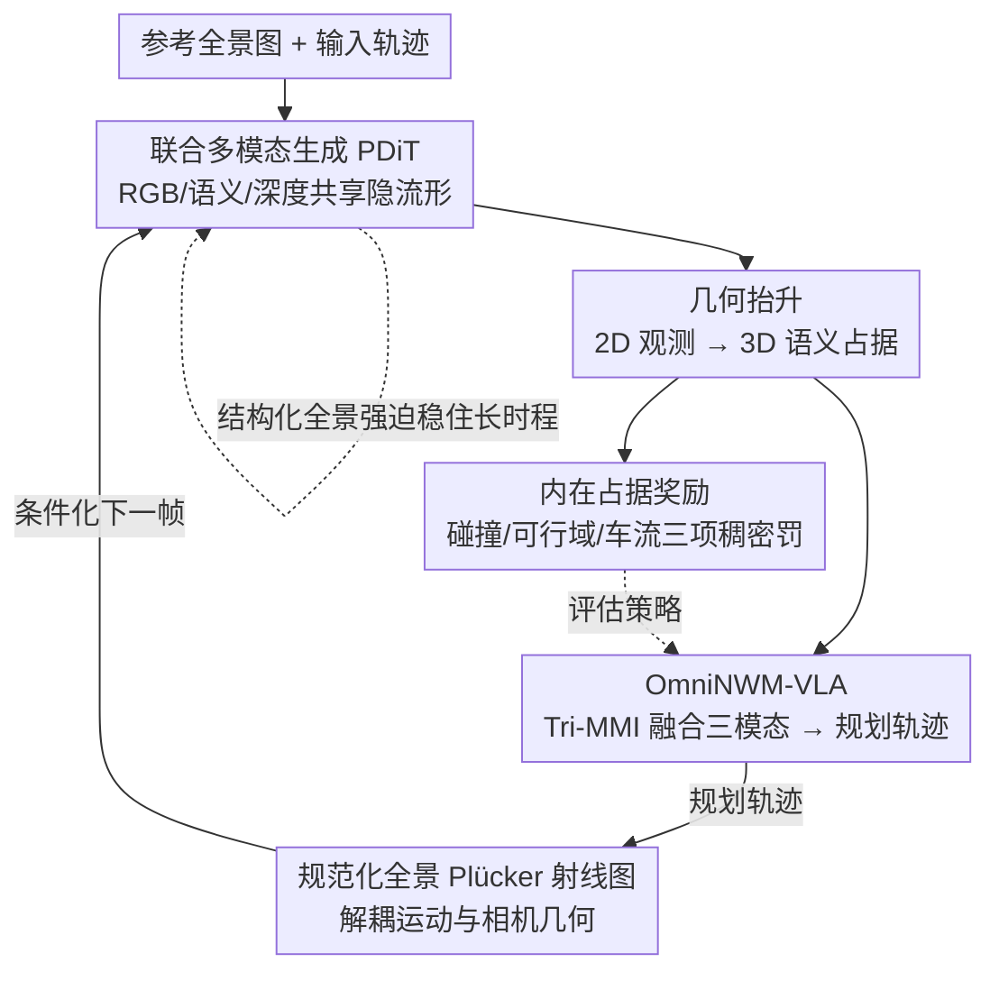

# OmniNWM: Omniscient Driving Navigation World Models

**会议**: ECCV 2026  
**arXiv**: [2510.18313](https://arxiv.org/abs/2510.18313)  
**代码**: [https://github.com/Arlo0o/OmniNWM](https://github.com/Arlo0o/OmniNWM)  
**领域**: 自动驾驶  
**关键词**: 驾驶世界模型, 全景多模态生成, 规范化 Plücker 射线图, 内在占据奖励, 闭环仿真

## 一句话总结
OmniNWM 用一个统一的概率框架把驾驶世界模型的「状态-动作-奖励」三要素打通：联合生成像素对齐的全景 RGB / 语义 / 深度 / 3D 占据，用规范化全景 Plücker 射线图把运动控制从相机装配几何里解耦出来实现零样本跨相机迁移，再从生成的占据体直接导出稠密奖励，从而在生成的世界里对规划智能体做闭环评估。

## 研究背景与动机
一个理想的驾驶世界模型应当逼近真实环境的联合多模态后验：既能预测未来状态、又能评估动作、还能给出奖励，把这三件事装进同一个概率框架里。但现实中的驾驶世界模型往往只做到其中一角。绝大多数方法只生成单模态的 RGB 视频，把多模态传感器仿真当成一堆彼此独立的条件生成任务来拼（先各自训一个模型再拼在一起），这会掉进「条件独立谬误」——各模态之间在像素级上并不对齐，生成的深度和语义跟 RGB 对不上，更别提再往上抬成一致的 3D 占据。更棘手的是长时程退化：训练时喂的是真值历史帧，推理时喂的却是自己上一步生成的、带误差的帧，这种曝光偏差（exposure bias）会让误差随自回归滚动指数级累积，几十帧之后整段视频就崩了。

第二个瓶颈出在动作控制上。现有方法用航路点、原始相机位姿这类稀疏表征来控制运动，但这些表征把「车怎么动」和「相机怎么装」纠缠在一起，隐空间会过拟合到某一套外参标定上。换一个数据集、换一套相机 rig（比如从 6 目变成 3 目），控制信号就失灵了——作者把这叫做几何协变量偏移（geometric covariate shift）：源域和目标域的轨迹分布支撑集直接不相交，KL 散度被推到任意大，零样本迁移根本无从谈起。第三个缺口是奖励：一个真正能用的世界模型必须能给出物理上站得住脚的奖励信号来闭环评估策略，但少数做了奖励的工作依赖外部的、黑盒的学习式奖励模型，这些模型自身就受分布漂移之苦，没法在生成与规划之间把环闭上。

于是本文的切入点是：与其把三件事拆开各做各的，不如在一个共享隐流形上把它们统一优化。**核心 idea：把驾驶世界模型的「状态-动作-奖励」三要素统一进一个联合概率框架——用共享隐流形联合生成像素对齐的全景 RGB / 语义 / 深度并抬成 3D 占据（状态），用规范化全景 Plücker 射线图把运动与相机几何解耦（动作），再从生成的占据体内在地导出稠密奖励闭合规划环（奖励），三者互相支撑而非各自为战。**

## 方法详解

### 整体框架
OmniNWM 把自己设计成一个可微分的仿真环境 $\mathcal{E}$，整体是一个统一的概率仿真循环。**状态**这一路，全景扩散 Transformer（PDiT）在一个共享隐流形上联合去噪，同步吐出全景 RGB、语义和度量深度视频，再用一个轻量几何映射把这三者抬成 3D 语义占据 $V_{occ}$；因为三模态共享同一条去噪轨迹、梯度互相回传，它们天然像素级对齐。**奖励与规划**这一路，生成出来的占据体一方面直接导出稠密奖励，另一方面作为多模态上下文喂给内置的 OmniNWM-VLA 智能体，让它推理并规划出未来轨迹。**动作**这一路，规划出的轨迹被编码成规范化全景 Plücker 射线图，作为几何约束反过来引导下一段生成，从而把环闭上：智能体观测到状态 $S_t$、输出动作 $a_t$，动作投影进规范 Plücker 流形后条件化下一状态的生成 $S_{t+1}\sim\mathcal{E}(S_t,a_t)$。整套流程再由结构化全景强迫（structured panoramic forcing）稳住，保证长时程滚动不崩。

### 关键设计

**1. PDiT 联合多模态生成：在共享隐流形上一次性长出对齐的 RGB / 语义 / 深度**

针对的痛点是模块化拼装带来的「条件独立谬误」——各模态各训各的，深度和语义跟 RGB 在像素上对不齐，后续抬占据时误差被放大。OmniNWM 的做法是不再最小化各自分离的重建损失，而是让全景扩散 Transformer 把多模态投影进一个共享隐流形上联合优化。具体地，先用预训练的 3D VAE 把高维输入压成紧凑的时空隐变量（语义图为了在连续投影里保住语义拓扑，编码前用固定调色板着色、解码后用最近邻离散化回类别），再把 RGB、着色语义、度量深度的隐变量沿通道拼成统一隐变量 $z_{joint}$，让 PDiT 在这个联合隐上近似条件反向扩散 $p_\theta(z^{joint}_{t-1}\mid z^{joint}_t, C)$。关键在于这条共享的去噪轨迹会促成像素级对齐：深度和语义的梯度会像 RGB 的梯度一样回传到联合隐变量上，输出天然同步。这样一来，把 2D 观测抬成 3D 占据就不再是各模态硬凑，而是有一个内在一致的地基——消融也证实，联合语义和深度监督分别带来 3.0 / 2.7 mIoU 的提升。

**2. 规范化全景 Plücker 射线图：把运动从相机 rig 几何里彻底剥出来**

这一设计正面回击几何协变量偏移。以往用航路点或原始外参做控制，隐空间会过拟合到具体标定上，换 rig 就崩。OmniNWM 用一个无参数编码器把输入轨迹映射成高维射线图，下采样并 patch 化成 Plücker 嵌入 token，与扩散隐 token 拼接后做 3D 全注意力——无参数设计让控制信号以精确、像素对齐的几何约束注入，而不是靠学出来的语义先验。真正的巧思在「规范化」：原始 Plücker 嵌入对采集 rig 的绝对尺度和位姿仍然敏感，所以作者把所有相机射线刚性变换到一个统一参考系（如初始前视）里重新计算 Plücker 坐标。先用源内参把像素反投影成单位归一化的世界方向向量 $\hat{d}^{(k)}_{u,v}=R_k K_k^{-1}[u,v,1]^T/\|R_k K_k^{-1}[u,v,1]^T\|_2$，再把相机中心和方向向量都旋转对齐到参考系，最后锚定这个规范系重算射线：

$$\hat{p}^{(k)}_{u,v}=\left(o^{(k\to 0)}\times\hat{d}^{(k\to 0)}_{u,v},\ \hat{d}^{(k\to 0)}_{u,v}\right)$$

这个表征对采集 rig 天然不变，等于把一个投影算子 $\Phi:\mathbb{R}^6\to\mathcal{M}_{motion}$ 作用上去、滤掉 rig 特有的几何，把不同传感器配置都拍到同一个规范运动流形上，从而把源域-目标域的 KL 散度从「任意大」压到只剩不可约的偶然不确定性 $\epsilon$。效果立竿见影：加了规范化后旋转/平移误差分别降了 90.6% / 87.9%，nuPlan 上零样本平移误差从各基线的 >7m 直接掉到 1.65m。此外这个不变表征还把多视角轨迹统一进共享 3D Plücker 空间，顺带把训练轨迹分布的多样性撑开了（Fig. 4c）。作者还从博弈论角度补了一层解释：自然驾驶数据不是一堆独立轨迹，而是处于瞬时纳什均衡的多智能体系统，所以只对本车显式控制、把周车当作反应式潜变量，模型就能从学到的均衡分布里采样——本车 cut-in 时卡车会「让行」，不是脚本写死的，而是均衡流形上条件于本车激进动作的最高似然响应。

**3. 结构化全景强迫：用结构化噪声把训练流形「加厚」，压住长时程曝光偏差**

长时程崩溃的根源是曝光偏差：训练条件在真值历史上、推理却在自己的带误差预测上，分布一漂移误差就滚雪球。标准的 scheduled sampling 加的是独立同分布高斯噪声，但全景视频的误差其实是结构化耦合的——要么沿时间相关（累积运动漂移），要么沿视角相关（跨视不一致）。所以本文对隐表征 $z^{(t,v)}$ 注入解耦的分层噪声：

$$\tilde{z}^{(t,v)}=z^{(t,v)}+\underbrace{\alpha^{(t)}\cdot\epsilon_{temp}}_{\text{时间漂移}}+\underbrace{\beta^{(v)}\cdot\epsilon_{spat}}_{\text{空间不一致}}$$

其中 $\epsilon_{temp}$ 专门模仿随时间的轨迹漂移、$\epsilon_{spat}$ 模仿跨相机视角的几何错位。这套「随机流形加厚」（stochastic manifold thickening）的直觉是：以往模型只在薄薄的真值流形 $\mathcal{M}_{GT}$ 上学到一个转移算子，推理一旦漂出流形就进入未定义区、误差指数爆炸；而在扰动状态上训练相当于把有效支撑扩成一个管状邻域 $\mathcal{M}_\epsilon=\{x:d(x,\mathcal{M}_{GT})<\epsilon\}$，逼模型学一个「把漂移状态拉回流形」的修复映射，让转移算子近似局部收缩（经验 Lipschitz 常数从无强迫时的 ≈1.08 压到 ≈0.94，小于 1 意味着真值流形成了吸引子，扰动被阻尼而非放大）。它还顺带解锁了灵活推理：帧级自回归（many-to-one，高精度轨迹规划用）和 clip 级自回归（one/many-to-many，长时程用，牺牲时间粒度换效率）都能稳定跑。这个设计是全篇长时程能力的结构性前提——201 帧上 FVD 从纯自回归的 386.72 稳到 25.22。

**4. 内在占据奖励 + OmniNWM-VLA 闭环：奖励直接从生成的 3D 占据里长出来**

外部黑盒奖励模型自身受分布漂移之苦、闭不上环，本文干脆把奖励做成「内在」的——直接查询生成的 3D 占据体，导出一个稠密势场来评估本车轨迹的安全性与合规性：

$$\hat{R}=1+(R_{col}+R_{bd}+R_{vel})/N_{reward}$$

三项都是从体素栅格上算出的稠密罚：碰撞罚 $R_{col}=-\alpha_{col}\cdot I_{col}\cdot|v|$（评估本车体积与障碍物体素的交叠，随速度缩放以反映动能风险，$\alpha_{col}=0.5$）；可行域约束 $R_{bd}=-\alpha_{bd}\cdot I_{non\text{-}drivable}$（惩罚偏离可行驶面，$\alpha_{bd}=0.3$）；车流效率 $R_{vel}=-\alpha_{vel}\cdot\tanh(|v-v_{target}|)\cdot I_v$（鼓励维持目标车速，$\alpha_{vel}=0.2$）。因为这个奖励物理上一致，就能在生成的世界里闭环评估任意规划智能体。为了充分吃下 PDiT 的高维全景上下文，作者配了个基于 Qwen-2.5-VL 的 OmniNWM-VLA：不像以往规划器只看稀疏物体或布局，它用一个即插即用的三模态 Mamba 解释器（Tri-MMI）作为状态投影器 $\phi:\{RGB,Depth,Sem\}\to\mathbb{R}^d$，用线性复杂度的选择性状态空间建模把光度、几何、语义上下文融进去（让 RGB 上下文去「门控」几何与语义特征），再 token 化喂给 VLM——从而能做「给左边卡车让行」这类语义-几何联合推理。它的动作头回归带朝向角 $\theta$ 的稠密轨迹元组 $(x,y,\theta)$，并以 12Hz 闭环运行（而非以往的 2Hz 稀疏航路点），大幅缩小 sim-to-real gap，能仿真 cut-in 这类反应式机动。

### 损失函数 / 训练策略
三大支柱各有目标。PDiT 主干用 Rectified Flow Matching：回归把概率密度从高斯先验搬到数据分布的速度场，$\mathcal{L}_{PDiT}=\mathbb{E}_{t,X_0,X_1}[\|f_\theta(X_t,t,C)-(X_1-X_0)\|^2]$，学隐空间里的直线轨迹以保证长时程采样确定稳定。OmniNWM-VLA 当作条件序列模型用因果语言建模优化，最大化轨迹序列下一个 token 的对数似然（token 里显式含朝向角，确保动作与 Plücker 表征兼容）。占据生成器用复合损失：深度 BCE + 语义体素级交叉熵 + Scene-Class Affinity Loss（优化场景结构完整度）+ 类平衡交叉熵（缓解小目标稀疏）。训练走三阶段渐进：①单视控制（17 帧、224×400、10k iter）→②多视多模态联合（6 目全景、3k iter）→③变长变分辨率微调（17/33 帧、最高 448×800、3k iter），48 张 A800、AdamW（lr 1e-4、wd 0.01）。闭环侧采「先解耦后耦合」：先预训练 PDiT 和几何抬升到收敛，再对齐冻结世界模型微调 VLA，最后全体联合微调闭环优化。

## 实验关键数据

### 主实验
在 nuScenes 上，OmniNWM 在生成质量、相机控制精度、占据预测、深度、闭环规划多条线上都拿了 SOTA。尤其是它不依赖重量级体素/点云输入条件，仅凭规范化全景射线图就把生成质量做到最好。

| 任务 | 数据集 | 指标 | OmniNWM | 之前 SOTA | 说明 |
|------|--------|------|---------|-----------|------|
| RGB 视频生成 | nuScenes | FID ↓ / FVD ↓ | **5.45 / 23.63** | 6.45 / 25.55 (UniScene / DiST-4D) | 无重体素条件即达最优 |
| 相机控制 | nuScenes | TransErr ↓ | **1.18 m** | 7.56 m (UniScene) | 规范化后平移误差降 87.9% |
| 语义占据 | nuScenes-Occupancy | mIoU ↑ | **19.8** | 16.4 (Hi-SOP) | 纯相机反超 LiDAR 方法 (L-CONet 15.8) |
| 全景深度 | nuScenes | Abs.Rel ↓ / δ<1.25 ↑ | **0.23 / 0.81** | 0.26 / 0.73 (M2Depth) | 生成式碾压 DiST-4D (0.39) |
| 零样本迁移 | nuPlan | FVD ↓ / TransErr ↓ | **79.24 / 1.65** | 118.60 / 7.12 (DiST-4D) | 跨 rig 无微调 |
| 闭环规划 | nuScenes (150 场景) | SPR ↑ | **87.3%** | Impromptu-VLA / Qwen-2.5-VL 更低 | 同文本提示、12Hz 公平对比 |

### 消融实验

| 配置 | 关键指标 | 说明 |
|------|---------|------|
| 完整模型 | FVD201 = 25.22 | 结构化全景强迫 + 联合生成 |
| 纯自回归（无结构化强迫） | FVD201 = 386.72 | 长时程彻底崩溃 |
| 标准 scheduled sampling（无结构噪声） | FVD201 = 178.65 | 有改善但仍严重退化，因未建模结构化耦合误差 |
| 去掉射线图规范化 | RotErr 1.71 rad / TransErr 9.75 m | 过拟合到特定 rig，几何过拟合 |
| 加规范化 | RotErr 0.16 rad / TransErr 1.18 m | 旋转/平移误差降 90.6% / 87.9% |
| 占据输入仅 RGB | IoU/mIoU 28.9 / 17.1 | 基线 |
| + 语义 | 31.5 / 16.8 | |
| + 语义 + 深度 | **33.3 / 19.8** | 联合语义与深度各 +3.0 / +2.7 mIoU |

### 关键发现
- 结构化全景强迫是长时程稳定的「结构性前提」：它对误差的建模方式（时间漂移 + 空间不一致解耦）比噪声量本身更关键——同样加噪，非结构化高斯噪声在 201 帧还是掉到 178.65 FVD，结构化的能稳在 25.22。
- 规范化射线图是零样本跨 rig 的命门：去掉它模型立刻过拟合到 nuScenes 内参，换 nuPlan 就是 >7m 的平移误差；加上它平移误差压到 1.65m，证明「解耦运动与相机几何」这条路走通了。
- 生成式占据反超 LiDAR：把占据当成像素对齐联合流形的确定性导出量（而非独立随机变量），几何一致性比直接从 RGB 回归或稀疏 LiDAR 都高；且生成占据导出的奖励与真值占据 / LiDAR+Box 的皮尔逊相关分别达 0.96 / 0.94，缓解了闭环评估的循环论证疑虑。
- 奖励超参对策略高度敏感：碰撞罚过高（0.8）会让智能体在密集车流里频繁「冻结」、SPR 掉到 74.6%；过度偏速度（0.6）则碰撞率飙到 14.5%；$(\alpha_{col},\alpha_{bd},\alpha_{vel})=(0.5,0.3,0.2)$ 是最优平衡，SPR 87.3%、碰撞率 3.4%。

## 亮点与洞察
- 把「奖励」内生化是最漂亮的一手：奖励不再来自外挂黑盒模型，而是从自己生成的 3D 占据体里直接查询导出，天生与生成状态一致，自然闭合了「生成↔规划」的环——而且用相关系数 0.96/0.94 定量证明了生成占据可信，堵住了「拿自己生成的东西评估自己」的循环论证质疑。
- 规范化 Plücker 射线图是可迁移的核心 trick：把控制信号从「学出来的语义先验」换成「无参数、像素对齐的几何约束」，再统一到规范参考系，等于用一个投影算子把几何协变量偏移直接抹平。这个「先规范化再控制」的思路能迁移到任何需要跨传感器配置泛化的相机可控生成任务。
- 「随机流形加厚」给曝光偏差一个几何解释：把训练流形从一条薄线加厚成管状邻域、逼模型学局部收缩映射，用经验 Lipschitz 常数 <1 佐证真值流形成了吸引子——这套语言比笼统说「加噪增强鲁棒性」深刻得多，也解释了为什么结构化噪声比高斯噪声管用。
- 用纳什均衡解释「涌现的反应式交互」很有意思：只控本车、把周车当反应式潜变量，让行行为是均衡流形上的最高似然响应而非脚本——这为「世界模型该不该支持任意 God-mode 编辑」提供了一个原则性回答（任意编辑会把状态推离物理一致的均衡流形）。

## 局限与展望
- 训练与主评估集中在 nuScenes / nuScenes-Occupancy，尽管零样本迁到 nuPlan 和自采数据表现好，但深度/语义真值依赖 LiDAR 投影 + MVS + 多数据集训练的分割网络合成，标注质量与覆盖度对最终占据和奖励质量有直接影响。
- 内在奖励的三项罚（碰撞/可行域/车流）和权重是经验设定，对策略行为高度敏感（消融已显示极端配置会让智能体冻结或激进），换城市/换驾驶文化时这套权重能否直接沿用存疑，需要重新校准。
- 均衡流形假设把周车全当反应式潜变量，意味着模型难以主动仿真「对抗性/非理性周车」这类偏离均衡的场景，而这些恰恰是安全评估最想压测的长尾；「只控本车」的设计换来一致性，代价是牺牲了可控编辑的灵活度。
- 算力门槛高（48 张 A800），且闭环采「先解耦后耦合」多阶段训练，复现和调参成本不低；12Hz 闭环虽缩小 sim-to-real gap，但真实部署时的实时性未在文中量化。

## 相关工作与启发
- **vs UniScene / DiST-4D（占据/几何条件的驾驶世界模型）**: 他们靠体素栅格或点云等重量级体积条件来保 3D 结构，OmniNWM 反其道而行——不喂重条件，靠共享隐流形联合生成 + 轻量几何抬升拿到更一致的占据（mIoU 19.8 vs 16 区间），生成质量还更好（FVD 23.63 vs 25.55），说明「联合优化换对齐」比「堆输入条件」更有效。
- **vs CameraCtrl / MotionCtrl（相机可控视频生成）**: 他们为单目序列设计、用原始外参或学习式模块控制，过拟合特定 rig、无法跨数据集迁移；OmniNWM 用规范化全景 Plücker 射线图显式保多视一致、把运动与标定解耦，平移误差 1.18m vs 9.48m（CameraCtrl*），且零样本跨 3/6 目 rig。
- **vs Drive-WM（带外部奖励的世界模型）**: 它用外部黑盒奖励模型，受分布漂移之苦、难闭环；OmniNWM 从生成占据内生导出稠密奖励，物理一致且可闭环评估任意规划器。
- **vs Impromptu-VLA / DriveVLM 等 VLA 规划器**: 多数 VLA 在 2Hz 输出离散航路点，与高保真世界模型仿真不兼容、缺几何精度；OmniNWM-VLA 用 Tri-MMI 线性复杂度融合三模态、12Hz 闭环、首个显式回归朝向角以对接 Plücker 控制，闭环 SPR 87.3% 超过两者。

## 评分
- 新颖性: ⭐⭐⭐⭐⭐ 首个在统一概率框架里同时打通状态-动作-奖励三要素的驾驶世界模型，规范化 Plücker 射线图与内在占据奖励都是有原创性的贡献。
- 实验充分度: ⭐⭐⭐⭐⭐ 覆盖生成/控制/占据/深度/闭环/零样本六条线，消融把三大设计逐一拆开验证，还用相关系数堵住循环论证质疑。
- 写作质量: ⭐⭐⭐⭐ 结构清晰、理论（KL 界、Lipschitz、纳什均衡）与工程并重；但公式与符号偏密，部分理论推导偏形式化、对工程读者门槛略高。
- 价值: ⭐⭐⭐⭐⭐ 把高保真视频合成与安全关键规划桥接起来，作为下一代驾驶仿真的可闭环地基，实用价值和后续可扩展性都很高。

<!-- RELATED:START -->

## 相关论文

- [\[CVPR 2026\] WorldLens: Full-Spectrum Evaluations of Driving World Models in Real World](../../CVPR2026/autonomous_driving/worldlens_full-spectrum_evaluations_of_driving_world_models_in_real_world.md)
- [\[CVPR 2026\] MAD: Motion Appearance Decoupling for Efficient Driving World Models](../../CVPR2026/autonomous_driving/mad_motion_appearance_decoupling_for_efficient_driving_world_models.md)
- [\[CVPR 2026\] DriveVLN: Towards Mapless Vision-and-Language Navigation in Autonomous Driving](../../CVPR2026/autonomous_driving/drivevln_towards_mapless_vision-and-language_navigation_in_autonomous_driving.md)
- [\[ECCV 2024\] Neural Volumetric World Models for Autonomous Driving](../../ECCV2024/autonomous_driving/neural_volumetric_world_models_for_autonomous_driving.md)
- [\[ICCV 2025\] LookOut: Real-World Humanoid Egocentric Navigation](../../ICCV2025/autonomous_driving/lookout_real-world_humanoid_egocentric_navigation.md)

<!-- RELATED:END -->
