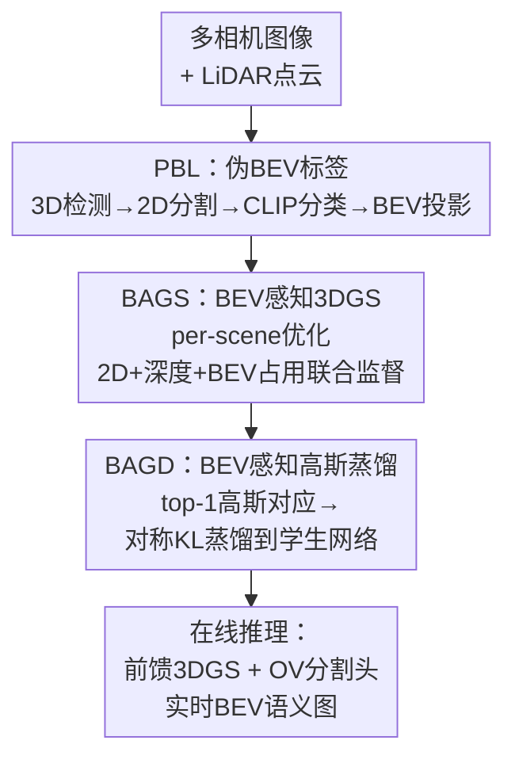

# Open-Vocabulary BEV Segmentation with 3D-Aware Geometric Constraints

**会议**: ECCV 2026  
**arXiv**: [2606.24353](https://arxiv.org/abs/2606.24353)  
**代码**: 待确认  
**领域**: 自动驾驶  
**关键词**: 鸟瞰图分割、开放词汇、3D高斯泼溅、几何一致、知识蒸馏

## 一句话总结

提出首个开放词汇BEV分割框架OVBEVSeg，通过反向几何推理路线（用无监督3D检测建立2D-BEV对应→BEV感知的3DGS优化几何→蒸馏到前馈网络）将VLMs的语义从2D提升到BEV空间，在nuScenes新类上超越闭集方法15.3 mIoU且推理速度更快。

## 研究背景与动机

鸟瞰图感知已经成为自动驾驶的核心范式，它将多相机图像融合为统一的自车顶部视角表示，支撑着3D目标检测、语义分割和轨迹规划等一系列下游任务。然而，一个被长期忽视的根本假设是：现有BEV感知管线都是闭集系统——训练和推理假定相同的有限语义类别集合。在实际驾驶场景中，车辆持续遇到训练中从未见过的物体（如卡车、婴儿车、轮椅），这些新类虽然存在于传感器数据中，却被模型默默忽略，在BEV语义图上形成盲区。这不仅是技术上的缺陷，更直接威胁路径规划和碰撞避免等下游任务的安全。

直观的做法是将2D开放词汇检测嫁接到BEV管线：对每路相机运行OV检测器，通过深度估计将2D区域提升到3D空间，再投影到BEV。但这种"2D-OV-then-BEV"方案受困于一个结构性问题——2D到3D的lifting过程本身就病态（ill-posed），小尺度的2D定位误差或语义分类错误会在提升过程中被急剧放大，尤其在大场景、稀疏视角的自动驾驶设定下。即使是目前最高效的Gaussian Splatting类方法也未能幸免，它直接将2D特征提升为3D高斯基元，同样被lifting误差所困扰。

本文的核心洞察是：几何推理的方向必须反过来——与其将噪声2D预测"提升"到3D，不如将可靠的3D结构"投影"回2D和BEV空间。基于这一**投影优先（projection-first）原则**，作者提出OVBEVSeg框架，通过三个递进阶段（语义上的伪标签生成→几何上的场景级优化→效率上的知识蒸馏）将3D几何约束逐步注入BEV感知管线。**核心 idea：利用无监督3D检测建立稳定的2D-BEV对应关系，将2D VLM语义通过可靠的3D投影传递给BEV空间，代替病态的2D unprojection，再通过BEV感知的3DGS优化和知识蒸馏实现高效率开放词汇分割。**

## 方法详解

### 整体框架

OVBEVSeg 以"投影优先"作为统一原则，构建了一个三阶段串联的混合3DGS框架。第一阶段**PBL**扮演语义桥梁的角色：它利用无监督3D检测器UNION从激光雷达点云中提取类别无关的3D候选框，将每个框投影到2D图像上，用SAM获取精确实例遮罩，再用CLIP提取图像嵌入并与文本模板比相似度得到伪标签，最后把打了标签的3D框投影到BEV平面生成BEV级伪标签——这样就从源头上绕过了2D unprojection的深度歧义。第二阶段**BAGS**负责几何精细化：利用第一阶段得到的BEV结构布局（occupancy map）作为强几何先验，在per-scene 3DGS优化中同时约束2D图像渲染和BEV占用一致性，从稀疏视角中恢复出高保真3D几何。第三阶段**BAGD**将优化后的几何知识蒸馏回一个前馈3DGS学生网络，学生端一次前向即可预测高斯基元并栅格化BEV特征，满足实时推理需求。

### 关键设计

**1. PBL：用3D投影代替2D提升建立2D-BEV语义对应**

对BEV开放语义分割来说，最核心的瓶颈是如何将2D VLM的语义聚类结果稳定地映射到BEV空间而不引入病态lifting的几何误差。现有方案（先做2D OV检测再按深度提升）的致命弱点是深度估计不可靠——自动驾驶场景的稀疏大基线视角使每像素深度分布带有多峰歧义，微小误差经unprojection放大后导致BEV上物体轮廓崩塌。PBL的设计反其道而行：先跑一个不需要任何语义标注的无监督3D检测器UNION（利用时空聚类从点云中获得类别无关的3D候选框），把每个3D框投影到多路相机图像上得到2D投影区域，再让SAM在这些区域内提取精确的像素级实例遮罩。由于3D框已经在度量空间中是稳定的几何实体，投影得到的2D区域天然具有跨视角一致性。随后用CLIP提取每个实例遮罩的背景屏蔽裁剪图像嵌入，与包含基类和新类的文本模板集合算余弦相似度取最大值作为伪标签，最后将带标签的3D框投影到BEV网格生成BEV伪标签。为抑制3D检测器的假阳性，作者设计了一个过滤策略：若2D遮罩面积与投影2D框面积显著偏离，说明3D框尺度不准，予以丢弃。这套流程的核心优势在于，语义传播路径始终以3D几何实体为中继，不再依赖易出错的逐像素深度分布，从而在源头上解决了2D-BEV语义对应不一致的问题。

**2. BAGS：以BEV占用监督约束3D高斯几何结构**

标准3DGS在自动驾驶场景中存在一个致命但不常被讨论的问题：照片一致性（photometric loss）驱动的优化能忠实重建近场相机视角的画面，但在BEV平面上，高斯基元会散落到非物体区域，产生几何塌缩——这是因为稀疏相机的重叠区域有限，仅靠2D图像信号无法约束高斯基元在xy平面的准确位置。BAGS的核心思路是将BEV结构布局（occupancy map）作为新的监督信号引入3DGS优化。具体地，对每个3D高斯基元，通过可微分栅格化管线同时渲染2D占用图（像素级密度）和BEV占用图（顶视图密度），再与PBL阶段得到的实例遮罩和BEV伪标签计算smooth L1损失：

$$\mathcal{L}_{\text{occ}} = \left\|O^{\text{img}}(v) - i(v)\right\|_{\text{SL1}} + \left\|O^{\text{bev}}(v) - b(v)\right\|_{\text{SL1}}$$

此外还引入了密集深度监督：用LiDAR数据校准深度估计器ZoeDepth的输出，作为稠密深度先验与3DGS渲染的深度算L1损失。最终的总损失为颜色损失（原3DGS）、SSIM损失、深度损失和占用损失的加权和。联合优化后，高斯基元被约束在物体轮廓附近，有效抑制了BEV平面上的飘散伪影。值得注意的是，occupancy监督是颜色无关的——它只关心几何"有没有物体"，不关心外观颜色，因此特别适合BEV这种不关心纹理的表示。

**3. BAGD：基于dominant高斯的对称知识蒸馏**

离线优化好的BAGS教师含有极高保真的几何信息，但per-scene优化的计算代价太大，不能直接用于在线感知。BAGD需要解决的关键矛盾是：教师的高斯基元是无结构、无顺序的稠密集合，而学生的前馈网络输出一个规整的网格化特征张量——两者之间没有一一对应关系。作者的解法很巧妙：对每个像素，沿着该射线找到渲染贡献权重最大的那个高斯（top-1 dominant Gaussian），将这个"最影响该像素渲染结果"的高斯的属性作为该像素的监督目标。在自动驾驶BEV场景中这个假设是合理的，因为物体在垂直方向上很少堆叠。这样，一张H×W的图像就对应了H×W个teacher高斯属性，刚好与学生网格对齐。蒸馏采用对称KL散度损失：

$$\mathcal{L}_{\text{BAGD}} = \frac{1}{2|\mathcal{V}|}\sum_{v \in \mathcal{V}}\left[ \text{KL}(\hat{G}(v)\|G^*(v)) + \text{KL}(G^*(v)\|\hat{G}(v)) \right]$$

对称形式使两个方向的分布对齐都被约束，比单方向KL更稳定。实验表明top-1配置已足够好，增加K的收益递减——因为主导高斯已经捕获了目标场景的核心几何与语义。

### 损失函数 / 训练策略

整体训练分为离线（per-scene优化）和在线（前馈网络训练）两阶段。离线BAGS的损失为四部分加权和：$\mathcal{L}_{\text{BAGS}} = (1-\lambda_{\text{ssim}})\mathcal{L}_{\text{color}} + \lambda_{\text{ssim}}\mathcal{L}_{\text{D-SSIM}} + \lambda_{\text{depth}}\mathcal{L}_{\text{depth}} + \lambda_{\text{occ}}\mathcal{L}_{\text{occ}}$，所有权重均设为1.0。在线阶段学生网络的优化目标为OV分割损失（对CLIP余弦相似度logits的交叉熵）和BAGD蒸馏损失的加权和，权重分别为1.0和0.01。使用AdamW优化器，学习率3e-4，权重衰减1e-7，批大小8，50个epoch，2张A100 GPU训练约6小时。

## 实验关键数据

### 主实验
在nuScenes验证集上对比OVBS多类分割性能。训练中严格排除新类（truck、bus、motorcycle）的真实标注。

| 方法 | 新类mIoU | 基类mIoU | 推理FPS | 显存 (MiB) |
|------|-----------|----------|---------|-------------|
| GaussianLSS (闭集会标) | 0.0 | 40.0 | 80.2 | 33.0 |
| TaDe (闭集会标) | 0.0 | 42.8 | 51.4 | 41.5 |
| OVBEVSeg (Ours) | **19.3** | 41.8 | 79.6 | 32.4 |
| Δ vs GaussianLSS | +19.0 | +1.8 | -0.6 | -0.6 |

新类上OVBEVSeg取得了19.3 mIoU的突破性结果（闭集方法均为0），同时保持了与纯闭集方法相当的推理速度（79.6 FPS）和更低的显存占用。基类性能没有显著退化。

### 消融实验

| 配置 | 新类mIoU | 说明 |
|------|---------|------|
| 完整模型 (PBL+BAGS+BAGD) | 19.3 | 全部模块 |
| w/o BAGS (仅PBL + 直接学生训练) | 9.2 | 去掉几何优化，新类性能减半 |
| w/o BAGD (PBL + BAGS推理，不蒸馏) | 16.5 | 不蒸馏，但per-scene优化无法在线使用 |
| w/o PBL (仅BAGS + BAGD) | 5.1 | 没有伪标签框架退化为闭集 |
| LangSplat替换Lang-BAGS | 8.7 | 基线语言嵌入方法的解耦率仅43.7% |

### 关键发现
- BAGS是性能增长的核心来源：没有BEV占用约束的几何优化后，新类mIoU从19.3下降到9.2，说明仅靠PBL的伪标签不足以训练出高质量的OVBEV分割器，精确的3D几何信号不可或缺。
- PBL的伪标签质量直接影响最终性能：在没有新类GT标注的情况下，PBL在训练集上达到了13.0 mIoU的伪标签质量（对比GT），覆盖了88.5%的场景。
- Lang-BAGS的解耦蒸馏在车辆子类（car vs truck vs bus）之间达到99.4%的命中率，远高于LangSplat的43.7%，说明直接迁移2D语言嵌入方法到AD场景会遭遇语义纠缠。
- OVBEVSeg还扩展到OV 3D目标检测（30.8 NDS / 24.1 mAP），超过BEVFormer和GaussianLSS。

## 亮点与洞察
- **"投影优先"原则的普适性**：将几何推理方向从unprojection反向为projection，这个思路不仅适用于BEV语义传播，理论上可以推广到任何有3D先验可用的2D-to-3D场景理解任务。
- **极简的跨模态传播链路**：用无监督3D检测（不需要标注）作为中继，一次投影就建立了2D-BEV对应，避免了深度估计的复杂度和累积误差。
- **occupancy作为颜色无关几何监督**：在BEV上施加occupancy约束既简单又有效——只关心"有没有物体"，不关心颜色，恰好避开了3DGS颜色优化在BEV上失效的问题。
- **top-1 dominant高斯蒸馏**：用渲染贡献最大的一个高斯来建立连续3D高斯到离散网格的对应，简洁且有效，避免了复杂的高斯匹配或聚类。

## 局限与展望
- **per-scene优化仍然耗时**：BAGS需要对每个场景的子集做数十万次迭代优化（全训练集约4天/8 GPU），虽然蒸馏后在线推理很快，但部署到新场景的泛化和快速适应的能力受限。与Scaffold-GS、Mini-GS等轻量化3DGS结合是自然的改进方向。
- **缺少时序一致性**：当前框架仅处理单帧（或独立帧）的BEV分割，没有利用4D时空一致性建模。对动态障碍物和长距离追踪而言，时序建模是关键能力。
- **UNION作为无监督检测器的依赖**：PBL建立在UNION的3D候选框质量之上，在UNION不可用或效果差的场景（如极端天气、LiDAR退化）下性能可能下降。
- **类别覆盖比例有限**：PBL的伪标签覆盖了GT实例的39.4%（新类中truck仅32.2%、motorcycle 41.2%），还有大量小物体未被召回。

## 相关工作与启发
- **vs GaussianLSS**: GaussianLSS是本文的基础前馈3DGS框架，但限于闭集。本文在其上增加了PBL伪标签管线、BAGS几何优化和BAGD蒸馏，赋予了开放词汇能力且推理速度持平。
- **vs TaDe**: TaDe是当前闭集BEV分割的SOTA之一。本文以TaDe为对比基线，新类mIoU提升5.7，基类损失极小（-1.0→+1.7取决于类别）。
- **vs LangSplat**: LangSplat将语言嵌入压缩到低维隐空间再解码，但在AD场景下车辆子类间出现语义纠缠。本文提出的解耦蒸馏损失（基于类别相似度分布的KL对齐）有效解决了这一问题。
- **vs OpenScene**: OpenScene通过3D点与文本/像素的共同嵌入实现开放词汇3D语义分割。本文则聚焦于BEV表示这一自动驾驶特有的中间表达，在效率上更有优势。

## 评分
- 新颖性: ⭐⭐⭐⭐ 首次将开放词汇分割引入BEV区域，提出的"投影优先"原则和"BEV occupancy作为3DGS几何约束"的设计巧妙且有效。
- 实验充分度: ⭐⭐⭐⭐⭐ 在nuScenes上做了详尽的主实验、消融、伪标签质量分析、3D检测扩展和Lang-BAGS解耦验证，表格和可视化丰富，消融覆盖了每个模块的贡献。
- 写作质量: ⭐⭐⭐⭐ 方法逻辑链条清晰（三个问题→三个模块→逐层递进），Motivation说服力强，图表对应良好。补充材料的表格和公式细节完整。
- 价值: ⭐⭐⭐⭐⭐ 开放词汇BEV分割是自动驾驶安全性的必要能力，本文提出了首个可行方案且效果显著，开源后有可能成为未来BEV感知的新基线。

<!-- RELATED:START -->

## 相关论文

- [\[CVPR 2026\] Open-Vocabulary Domain Generalization in Urban-Scene Segmentation](../../CVPR2026/autonomous_driving/open-vocabulary_domain_generalization_in_urban-scene_segmentation.md)
- [\[NeurIPS 2025\] Leveraging Depth and Language for Open-Vocabulary Domain-Generalized Semantic Segmentation](../../NeurIPS2025/autonomous_driving/leveraging_depth_and_language_for_open-vocabulary_domain-generalized_semantic_se.md)
- [\[CVPR 2025\] O3N: Omnidirectional Open-Vocabulary Occupancy Prediction](../../CVPR2025/autonomous_driving/o3n_omnidirectional_open-vocabulary_occupancy_prediction.md)
- [\[CVPR 2025\] 3D-AVS: LiDAR-based 3D Auto-Vocabulary Segmentation](../../CVPR2025/autonomous_driving/3d-avs_lidar-based_3d_auto-vocabulary_segmentation.md)
- [\[CVPR 2026\] BEV-CAR: Enhancing Monocular Bird's Eye View Segmentation with Context-Aware Rasterization](../../CVPR2026/autonomous_driving/bev-car_enhancing_monocular_birds_eye_view_segmentation_with_context-aware_raste.md)

<!-- RELATED:END -->
