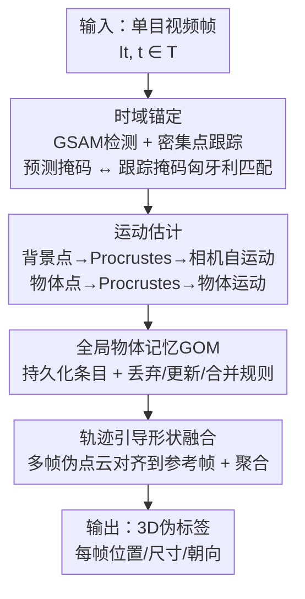

# PLOT: Pseudo-Labeling via Object Tracking for Monocular 3D Object Detection

**会议**: ECCV 2026  
**arXiv**: [2507.02393](https://arxiv.org/abs/2507.02393)  
**项目页**: https://plot-eccv.github.io  
**代码**: 待确认  
**领域**: 自动驾驶 / 3D视觉  
**关键词**: 单目3D目标检测, 伪标签, 目标跟踪, 密集点跟踪, 形状融合

## 一句话总结
PLOT 提出一个无需辅助传感器或模型重训练的 3D 伪标签生成框架，通过密集点跟踪建立跨帧点级对应、从背景/物体轨迹解耦估计相机自运动与物体运动、引入全局物体记忆维护长程身份一致性，最终将多视角部分观测对齐并融合为完整的物体伪点云，在 KITTI、KITTI-360、Waymo 等基准上达到与全监督方法可比的效果，并泛化到非驾驶场景。

## 研究背景与动机

单目 3D 目标检测（M3OD）旨在从单张 RGB 图像恢复物体的三维几何、姿态和尺寸，以低廉的传感器成本在自动驾驶、机器人、监控等领域具有重要价值。然而，这一问题本质上是病态的——单张图像存在深度-尺度歧义，缺乏直接的几何监督信号。因此现有方法几乎完全依赖在传感器富集环境下采集的精心标注数据集（如 KITTI、Waymo），这些数据集的 3D 真值依赖 LiDAR 点云或多视图校准。当模型被部署到无约束场景——手持相机、监控视角、非驾驶场景——其零样本性能急剧下降；相机运动未知、视角多样、遮挡频繁使得单帧假设全面失效。

为缓解 3D 标注的稀缺性，伪标签和弱监督方法被提出用于在没有 LiDAR 或多视图数据的情况下生成 3D 监督。然而现有管线几乎都在单帧图像上操作，单帧观测只能提供局部且含噪的几何信息（例如只能看到物体的一个侧面），遮挡和尺度歧义从根本上无法解决。更重要的是，许多方法依赖已知的传感器位姿或精心设计的几何先验（如车辆尺寸模板），这严重限制了跨域扩展性——换个场景相机位姿未知，方法就不可用了。

本文观察到，单目视频天然编码了丰富的时序几何线索：相邻帧之间物体的视角变化提供了多视图约束，相机与物体的相对运动则为 3D 属性估计提供了额外信号。但有效利用视频引入两个核心挑战——一是在未知位姿的设定下维持长程物体身份一致性（遮挡和检测失败导致轨迹碎片化和身份切换），二是如何将多帧的部分观测融合为完整的物体几何（单帧观测总是部分的和有噪声的）。PLOT 的思路是将目标跟踪与背景跟踪解耦，用密集点对应恢复相对运动，再以一个全局物体记忆维护身份一致性，最终将多帧稀疏观测通过简单的优化对齐融合为完整的物体形状。**核心 idea：利用密集点跟踪同时建立物体与背景的跨帧点级对应，将相机自运动与物体运动解耦估计，引入全局物体记忆在识别层面修复检测/跟踪失败，最终将多视角部分观测对齐融合为完整伪点云——无需任何辅助传感器或模型重训练即可从纯单目视频生成高质量 3D 标注。**

## 方法详解

### 整体框架

PLOT 是一个不依赖辅助传感器或模型训练的纯后处理管线，输入为单目视频帧，输出为每帧的 3D 伪标签（位置、尺寸、朝向）。整个流程分为四个阶段：首先通过密集点跟踪建立跨帧的点级对应关系（时域锚定）；然后利用背景点轨迹估计相机自运动、利用物体点轨迹估计物体运动；接着引入全局物体记忆（GOM）在长时间跨度上维护物体身份一致性，修复因检测失败或遮挡造成的轨迹断裂；最后将同一物体的多帧部分观测对齐到统一坐标系下融合为完整伪点云，再投影回每帧提取统一的三维属性。

### 关键设计

**1. 时域锚定：双轨掩码与密集点跟踪建立跨帧对应**

在未知位姿的视频中建立帧间一致的物体对应关系是后续所有几何推理的基础。PLOT 的关键洞察是维护两条互补的掩码线：**预测掩码**来自开源检测器 GSAM 在每帧独立预测的物体掩码，反映物体在每帧的实际形状变化；**跟踪掩码**则通过密集点跟踪器 AllTracker 将某一帧的掩码传播到其他帧，保留了点级对应信息——这是后续运动估计和形状对齐所必需的。具体来说，对于第 t 帧的第 k 个物体掩码 $M_k^t$，通过密集点跟踪得到它在其他帧的投影 $M_k^{\acute{t} \leftarrow t}$。由于检测器可能漏检、跟踪器可能漂移，预测掩码与跟踪掩码不一定重合，PLOT 使用匈牙利算法在两者之间做 IoU 最大化匹配来建立最终对应。与此同时，采样物体掩码之外的背景区域并同样点跟踪，得到背景点对应关系——这部分专门用于相机自运动估计。两条线并行跟踪、匹配时共享同一套点对应关系，是该框架高效运转的关键前提。

**2. 从点轨迹解耦恢复运动：相机自运动与物体运动联合估计**

有了跨帧对应后，需要解决的核心问题是将所有观测对齐到统一的坐标系。PLOT 的做法是将相机运动与物体运动分开估计。对于背景点，将其提升到 3D（借助单目深度估计器 UniDepth），然后通过 Procrustes 对齐求解从第 t 帧到参考帧 r 的相机旋转 $\mathbf{R}_c^t$ 和平移 $\mathbf{t}_c^t$：

$$\arg\min_{s_c^t,\mathbf{R}_c^t,\mathbf{t}_c^t} \sum_{i \in M_{bg}^t} \mathcal{M}\mathcal{V} \left\| \mathbf{p}_i^r - (s_c^t \mathbf{R}_c^t \mathbf{p}_i^{r\leftarrow t} + \mathbf{t}_c^t) \right\|^2$$

其中 $\mathcal{M}$ 是过滤不可靠深度（如 >50m）的二进制掩码，$\mathcal{V}$ 指示点在两帧中是否均可见，$s_c^t$ 是可选的尺度项（仅在深度估计有明显时序漂移时激活，否则固定为 1）。对于物体点，同样的 Procrustes 对齐得到一个物体层级的相对运动。将物体轨迹通过估计的相机运动变换到世界坐标系后，可以判断物体是否运动：若两帧之间位移超过阈值则视为动态物体，朝向由运动方向角给出；否则视为静态物体，朝向由后续融合后的完整伪点云上做 PCA 得到的主方向确定。这种"动态靠轨迹、静态靠几何"的互补策略，使得朝向估计在两类场景下都保持可靠。

**3. 全局物体记忆（GOM）：持久化身份一致性维护**

即使有了点跟踪和匈牙利匹配，现实视频中的遮挡、检测漏报和相机运动仍然导致频繁的身份切换和轨迹碎片化——一个物体被遮挡几帧后重新出现被赋予新 ID，或者多个邻近物体被合并为一条轨迹，都会严重污染后续的形状融合。PLOT 为此设计了一个轻量的全局物体记忆模块。GOM 维护一个持久化的物体条目列表，每个条目记录一个唯一物体在时间轴上的完整观测历史。每帧到来的新检测结果，通过与跟踪掩码的空间重叠度匹配到已有记忆条目。GOM 在每个时间步执行三类检查：①该物体的点跟踪是否持续（短于 5 帧的轨迹直接丢弃）；②该物体的类别和几何属性是否在时间上一致（不一致表示噪声检测，丢弃）；③是否有多个记忆条目实际上对应同一个物体（完成合并）。未匹配到任何已有条目的高置信度检测临时创建新条目。这套基于规则的机制没有引入任何可学习参数，仅通过检验点跟踪的连续性和属性的时空一致性，就有效地修复了检测器漏报（从记忆延续）和身份切换（通过合并断裂轨迹）。

**4. 轨迹引导的形状融合：多帧伪点云对齐与聚合**

单帧观测的致命缺陷是只能看到物体的部分表面——车辆侧面、背面被遮挡时，中心偏移和朝向估计都会偏差。PLOT 的核心补偿手段是将同一物体的多帧观测对齐后融合。具体而言，先为每个物体选出一个使帧间注册误差最小的参考帧，然后将该物体在所有其他帧的 3D 点通过之前估计的帧间相对位姿变换到参考帧坐标系下合并：

$$\hat{\mathbf{P}}_k = \bigcup_{t \in \mathcal{T}} s^{t \rightarrow r} \mathbf{R}^{t \rightarrow r} \mathbf{P}_k^t + \mathbf{t}^{t \rightarrow r}$$

其中 $s^{t \rightarrow r}$、$\mathbf{R}^{t \rightarrow r}$、$\mathbf{t}^{t \rightarrow r}$ 是从第 t 帧到参考帧 r 的尺度、旋转和平移。随着相机或物体的运动，不同帧看到物体的不同侧面，融合后的点云 $\hat{\mathbf{P}}_k$ 不断补全缺失的表面。然后对 $\hat{\mathbf{P}}_k$ 做 PCA 提取物体主轴（用于静态物体朝向）、计算最小包围盒得到尺寸和中心位置，最后将这些统一的三维属性通过逆变换投影回每一帧，确保帧间标注的一致性。这种"先融合再反投影"的策略保证了属性估计的时序平滑，避免了逐帧独立估计带来的抖动。

## 实验关键数据

### 主实验

以下为 KITTI 验证集 Car 类别的 3D 检测结果（AP3D@IoU=0.3）。所有伪标签方法均使用 MonoDETR 作为下游检测器、采用相同配置训练。

| 方法 | 标注源 | 额外输入 | Easy | Moderate | Hard |
|------|--------|----------|------|----------|------|
| MonoDETR（全监督） | GT-3D | - | 79.72 | 65.87 | 58.83 |
| OVMono3D（开集） | GT-3D | - | 74.01 | 51.25 | 42.40 |
| 3D-MOOD（开集） | GT-3D | 深度 | 81.97 | 64.16 | 54.36 |
| OVM3D-Det（伪标签） | GSAM | GPT-4尺寸先验 | 44.48 | 33.29 | 26.69 |
| MonoSOWA（伪标签） | MViT2 | 位姿+形状 | 72.70 | 56.30 | 47.70 |
| PLOT (Ours) | GSAM | 视频（20帧） | **80.48** | **60.83** | **51.49** |

在 KITTI-360 test 集上，PLOT 同样达到最好 AP3D@0.3（Easy 54.78 / Hard 48.75），显著优于 MonoSOWA（42.72 / 46.59）和需要已知位姿的 VSRD（50.86 / 43.45）。在 Waymo 远距离场景（>30m）中 PLOT 的 APBEV 甚至超越全监督的 MonoDETR，证明了其在长距离和恶劣光照条件下的可靠性。

### 消融实验

**全局物体记忆的重要性**（KITTI 验证集 Car，AP3D@0.3）：

| 训练集 | GOM | Easy | Moderate | Hard |
|--------|-----|------|----------|------|
| KITTI | ✗ | 59.82 | 51.00 | 45.40 |
| KITTI | ✓ | **80.48** | **60.83** | **51.49** |
| KITTI-360 | ✗ | 48.14 | - | 40.28 |
| KITTI-360 | ✓ | **54.78** | - | **48.75** |

**轨迹引导形状融合的帧数影响**（KITTI Car，AP3D@0.3）：

| 使用帧数 | Easy | Moderate | Hard | 每帧耗时 |
|----------|------|----------|------|----------|
| 1（单帧） | 51.75 | 37.48 | 30.63 | 0.46s |
| +2 帧（共3帧） | 62.41 | 48.06 | 40.31 | 0.66s |
| +8 帧（共9帧） | 77.23 | 56.16 | 48.43 | 1.56s |
| +20 帧（共21帧） | **80.48** | **60.83** | **51.49** | 2.45s |

### 关键发现

- **形状融合是最大贡献者**：从单帧到 20 帧融合，AP3D@0.3 的平均值提升约 1.7 倍，说明多视角几何信息对于补全单帧观测缺陷至关重要。
- **GOM 效果显著但受场景影响**：在 KITTI 上 GOM 带来约 10-20 AP 的提升（KITTI 场景相对简单但检测噪声大），在 KITTI-360 上约 6-8 AP（场景更广泛、长序列挑战更大）。GOM 的核心价值不是做复杂的视觉推理，而是用时序一致性规则消除检测噪声的短期波动。
- **PLOT 作为独立检测器**：未经训练的 raw 伪标签（直接对点云拟合包围盒）在 KITTI 上达到 AP3D@0.3 Moderate 约 51，已超过 OVM3D-Det（33.29）和弱监督方法 MonoGRNet（42.61），说明即使不训练下游模型，PLOT 也能产出可用的 3D 标注。
- **行人类验证泛化能力**：小尺寸、非刚体运动的行人检测中 PLOT 达到 AP3D@0.3 Moderate 14.39，远高于 OVM3D-Det 的 8.96，说明轨迹引导融合在不依赖刚体假设的前提下仍有效。
- **方向估计中运动引导胜于纯几何**：消融表明加入相机运动估计后 AP 平均提升约 3 点，尤其对动态物体，运动方向直接给出了可靠的朝向先验。

## 亮点与洞察

- **双轨掩码设计的巧妙之处**：预测掩码（GSAM）反映逐帧实际形状变化，跟踪掩码（AllTracker 传播）保留点级对应——两者互补，为后续运动估计和形状融合分别提供了"几何边界"和"对应关系"两条线。这种分离比单一掩码源更鲁棒。
- **GOM 是一个轻量但高效率的设计**：没有引入任何可学习参数，只靠三条规则（持续性检查、属性一致性检查、合并冗余条目）就显著修复了检测和跟踪的失败，是"规则的威力"的典型示范。
- **"融合 + 反投影"保证时序一致性**：不是每帧独立估计属性，而是先在参考帧融合完整点云、提取统一属性，再投影回各帧——这个简单的"先聚合再分发"策略天然保证了帧间标注的平滑。
- **运动估计中的可选尺度项很有工程智慧**：深度估计器的时序尺度漂移不是每帧都有，设一个可选激活标志位可以避免不必要的自由度，在灵活性和稳定性之间取得平衡。
- **PLOT 作为独立标签工具比作为训练数据提供者可能更有价值**：实验表明 raw 伪标签在无训练场景下已经可用，这对"只有一段视频没有标注"的实用场景有直接吸引力（如自动化标注管线）。

## 局限与展望

- **依赖预训练深度估计器**：尽管论文展示了在噪声下的鲁棒性分析，远距离深度噪声仍是最主要瓶颈——深度误差直接传导至点云融合和中心估计，论文承认在 >50m 时中心偏移明显。
- **近零相对运动时收益有限**：当相机与物体间相对运动趋近于零（如远处缓慢同向行驶的车辆），多帧观测提供的新视角有限，形状融合的优势难以发挥。
- **关联失败仍有边缘情况**：帧窗边界附近观测过少的物体，或持续被遮挡的物体，GOM 仍可能无法正确关联，导致伪点云融合错误。
- **计算开销随物体数线性增长**：20 帧窗口、20 个物体时每帧约 2.8 秒，实时应用需要并行化或轻量化版本。
- **未来可探索的方向**：集成更强的时序连续性先验（如长程光流）、引入多视角几何线索增强边缘情况关联、或用学习的关联替换规则化的 GOM。

## 相关工作与启发

- **vs OVM3D-Det [CVPR 2024]**：在单帧上操作，利用 LLM 估计物体尺寸先验（如"车一般长 4.5m"）。PLOT 利用视频时序信息融合多帧观测，不仅可以恢复更准确的形状，而且完全不需要 LLM 先验，避免了不可控的语义先验偏差。
- **vs MonoSOWA [CVPR 2025]**：需要已知相机内参和 IMU 位姿、依赖简化的掩码关联。PLOT 不需要任何位姿信息（通过点跟踪恢复相对运动），且通过 GOM 和轨迹引导融合提供更完整的物体几何，在 KITTI 上 AP 提升达 9.68 点。
- **vs VSRD [ECCV 2024]**：姿势估计依赖多视图和已知位姿，受限于静态场景假设。PLOT 可以处理动态物体场景，且位姿从跟踪得出而非已知，适用面更广。
- **vs 3D-MOOD [CVPR 2025]**：开集体检测器，需要大量 3D 训练数据。PLOT 在零样本设定下不依赖任何 3D 训练数据，在非驾驶场景的定性对比中发现 3D-MOOD 漏检物体而 PLOT 能正确产出标注。

## 评分

- 新颖性: ⭐⭐⭐⭐ 将密集点跟踪 + 全局记忆 + 轨迹引导融合组合用于伪标签生成的设计新颖，双轨掩码和 GOM 都是此前未见过的组合思路
- 实验充分度: ⭐⭐⭐⭐⭐ 在三个主流驾驶基准上做定量验证，覆盖 Car/Pedestrian/Vehicle；补充材料包含丰富的噪声鲁棒性分析、故障模式分析、跨域定性比较
- 写作质量: ⭐⭐⭐⭐ 结构清晰，图示充分，动机叙述有层次；部分技术细节压缩在补充材料中，主文需要前后翻看表格比较，存在一定阅读负担
- 价值: ⭐⭐⭐⭐⭐ 提供了一条真正无需辅助传感器的低成本 3D 标注路径，对自动驾驶数据扩增、通用场景标注、弱监督训练都有直接实用价值

<!-- RELATED:START -->

## 相关论文

- [\[AAAI 2026\] Difficulty-Aware Label-Guided Denoising for Monocular 3D Object Detection](../../AAAI2026/autonomous_driving/difficulty-aware_label-guided_denoising_for_monocular_3d_object_detection.md)
- [\[ECCV 2026\] Real-Time Source-Free Object Detection](real-time_source-free_object_detection.md)
- [\[ECCV 2024\] Detecting As Labeling: Rethinking LiDAR-camera Fusion in 3D Object Detection](../../ECCV2024/autonomous_driving/detecting_as_labeling_rethinking_lidar-camera_fusion_in_3d_object_detection.md)
- [\[ECCV 2026\] LeAD-M3D: Leveraging Asymmetric Distillation for Real-Time Monocular 3D Detection](lead-m3d_leveraging_asymmetric_distillation_for_real-time_monocular_3d_detection.md)
- [\[ECCV 2024\] MonoWAD: Weather-Adaptive Diffusion Model for Robust Monocular 3D Object Detection](../../ECCV2024/autonomous_driving/monowad_weather-adaptive_diffusion_model_for_robust_monocular_3d_object_detectio.md)

<!-- RELATED:END -->
