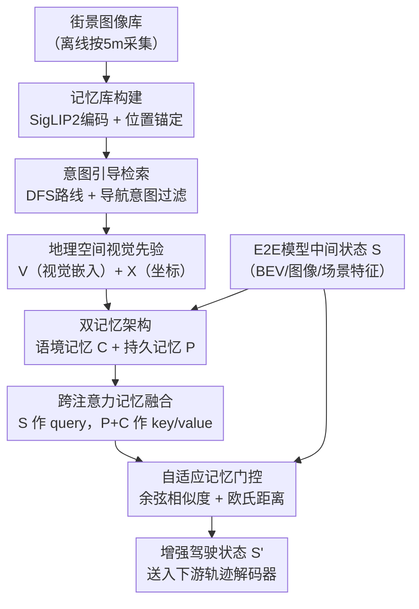

# PriorEye: Geospatial Visual Priors for End-to-End Autonomous Driving

**会议**: ECCV 2026  
**arXiv**: [2606.31830](https://arxiv.org/abs/2606.31830)  
**代码**: 暂无公开代码（项目页：[https://ori-mrg.github.io/PriorEye](https://ori-mrg.github.io/PriorEye)）  
**领域**: 自动驾驶  
**关键词**: 端到端自动驾驶、地理空间视觉先验、记忆增强、鲁棒性、NAVSIM

## 一句话总结

PriorEye 将离线采集的街景图像锚定到规划路线上，构造"地理空间视觉先验"并通过双记忆架构注入端到端驾驶策略，使其具备人类驾驶员般的前瞻性感知，同时在传感器失效和先验污染两种极端情况下均保持鲁棒。

## 研究背景与动机

端到端（E2E）自动驾驶以"传感器输入直接映射到轨迹输出"的简洁范式迅速成为主流，LTF、GTRS、DrivoR 等方法在 NAVSIM、nuPlan 等基准上持续刷新成绩。但这类系统有一个被忽视已久的结构性局限：它们只依赖当前时刻几秒钟的在线感知数据来决策，本质上是纯反应式的。现实中的复杂驾驶场景——转角背后藏着减速带、即将消失的车道、遮挡路口——都需要驾驶员在看到障碍物之前就已经开始减速或变道。人类之所以能做到这一点，是因为大脑储有行驶路段的视觉记忆，大量认知神经学研究（海马体、空间导航）表明这种"路段预知"是安全高效驾驶的核心。

对于 E2E 系统来说，解决方案并不是给模型喂更长的历史帧，因为遮挡和传感器噪声会污染任何实时输入。传统方法中，高精地图（HD Map）提供了路段结构信息，但 HD 地图价格昂贵、需要持续维护，且只编码道路拓扑，不携带视觉外观信息；而纯粹的检索增强方法（如 RAD-Driver）通常只用于高层推理，并未直接改变规划器内部状态。视觉先验（如街景）与空间先验（路线锚点）此前从未被系统性地融合后注入 E2E 规划主干。

本文的切入角度正是填补这一空白：离线从 Google Street View 收集沿行驶路线的街景图像，把视觉先验与路线坐标绑定，形成"地理空间视觉先验"（Geospatial Visual Priors），然后设计一个轻量的模型无关记忆增强模块，把这些先验注入任意 E2E 规划器的中间状态。**核心 idea：把离线路段街景作为可检索的长期记忆，用双记忆架构（语境记忆 + 持久记忆）和自适应门控将其融合进 E2E 规划状态，让模型在实时感知失效时仍能依赖先验完成前瞻性驾驶。**

## 方法详解

### 整体框架

PriorEye 由两个解耦部分组成：离线构建的记忆库（Memory Bank）和在线调用的记忆增强模块（Memory Augmentation Module）。在部署区域内，系统预先遍历每条车道中心线，按 5 米间隔采集街景图像并用冻结的 SigLIP2 视觉编码器嵌入，建立"位置→视觉嵌入"映射表，共形成约 939 MB 的记忆库覆盖 6.5 km²。在线推理时，根据当前车辆位置和高层导航意图（左转/右转/直行），沿预测路线检索前方 N=20 个节点（约 100 米前瞻），得到视觉先验 $\mathbf{V} \in \mathbb{R}^{N \times D_m}$ 和对应的相对坐标先验 $\mathbf{X} \in \mathbb{R}^{N \times 2}$，一起送入记忆增强模块。该模块拿到 E2E 模型的中间驾驶状态 $\mathbf{S}$，输出增强后的状态 $\mathbf{S}'$ 交给下游轨迹解码器，完整的 E2E 骨干网络参数无需改动。

### 关键设计

**1. 意图引导的路线检索：让先验与规划意图对齐**

最直觉的做法是检索空间上最近的 N 个街景节点，但这种邻近检索往往会把当前位置附近多个方向的图像都抓进来，而其中大部分与即将执行的驾驶动作毫无关系。消融实验表明，纯邻近检索（proximity-based）在 LTF 基线上仅提升 0.4 EPDMS，而意图引导检索（intention-guided）提升 2.7 EPDMS。本文的做法是：从当前车道出发，用深度优先搜索（DFS）在车道连通图上展开前方的候选路线集合，再根据高层导航意图（左转、右转、直行）从候选集中选出对应的路线分支，只沿这条分支检索街景嵌入。这样每次检索的 N 个先验都与实际执行的动作语义一致，噪声大幅减少。

**2. 双记忆架构：语境记忆 + 持久记忆互补**

语境记忆（Contextual Memory）$\mathbf{C}$ 由检索到的视觉先验和坐标先验联合构造：

$$\mathbf{C} = \phi(\mathbf{V}) + \psi(\mathbf{X})$$

其中 $\phi(\cdot)$ 是将视觉嵌入投影到 E2E 模型内部维度的线性层，$\psi(\cdot)$ 是把相对坐标编码成 2D 正弦位置嵌入的函数。两者相加使语境记忆同时包含语义外观和粗略几何布局。消融显示视觉编码贡献 +2.3 EPDMS、空间编码贡献 +1.0 EPDMS，二者结合最高 +2.7 EPDMS，互补性明显。

然而街景图像在四季变化、几何错位或采集缺失时会失效，语境记忆则会携带误导性内容。这与 Transformer 的"注意力汇聚"（Attention Sink）问题本质相同——注意力机制在缺乏有效 key 时会被迫分散到无用 token 上。受 Titans 和持久记忆机制启发，本文引入持久记忆 $\mathbf{P} \in \mathbb{R}^{K \times D}$，一组与输入无关的可学习 token，作为语境记忆失效时的稳定后备。两类记忆拼接后统一作为 cross-attention 的 key 和 value，让模型在正常情况下主要利用语境先验，在先验被污染时自然转向持久记忆。实验表明视觉先验被严重污染时，模型对 P 的注意力权重从正常的 0.29 飙升至 0.97，性能下降从 19.6% 压缩到 6.8%。

**3. 自适应记忆门控：度量状态相容性再决定融合比例**

在跨注意力得到记忆加权状态 $\tilde{\mathbf{S}}$ 之后，直接残差加到原始状态会带来不稳定风险——当检索先验与当前场景不匹配时，强行注入反而有害。本文设计了一个轻量自适应门控 $\mathbf{G}$，同时利用余弦相似度 $c$ 和归一化欧氏距离 $d$ 来度量 $\mathbf{S}$ 与 $\tilde{\mathbf{S}}$ 之间的语义相容性：

$$\mathbf{G} = \sigma\!\left(f_g\!\left([\mathbf{S};\, \tilde{\mathbf{S}};\, d;\, c]\right)\right), \quad \mathbf{S}' = \mathbf{S} + \mathbf{G} \odot \tilde{\mathbf{S}}$$

$f_g$ 是一个轻量 MLP，初始化时偏置设置为近零值，让门在训练初期几乎关闭，避免随机先验在早期破坏主干网络的梯度信号。余弦相似度和欧氏距离分别捕捉方向一致性与幅度差异，二者各自提升 0.4 EPDMS，组合后达到最佳的 +2.7 EPDMS，说明二者覆盖了兼容性的不同侧面。最终整个模块仅引入 713K 额外参数，相对 LTF/GTRS/DrivoR 的主干开销为 0.6%–1.7%。

### 损失函数 / 训练策略

记忆增强模块直接插入各基线的中间状态层，与各基线使用相同的原始训练目标联合端到端训练，无需任何额外损失项。不同基线的"中间状态"定义略有差异：LTF 和 GTRS-DP 使用 BEV 特征 + ego-status，GTRS-Dense 使用图像特征 + ego-status，DrivoR 使用场景 token + ego-status。训练在 8 块 NVIDIA RTX 5090 上进行，各基线 epoch 数分别为 100、80、40、20。

## 实验关键数据

### 主实验

**NAVSIM-v2 navhard-two-stage（EPDMS，两阶段乘积）**

| 方法 | Stage1 EPDMS | Stage2 EPDMS | 综合提升 |
|------|-------------|-------------|---------|
| LTF | 24.7 | 73.2 | — |
| LTF + PriorEye | 32.4 | 72.1 | **+31.2%** |
| GTRS-DP | 26.3 | 62.2 | — |
| GTRS-DP + PriorEye | 30.1 | 66.9 | **+14.4%** |
| GTRS-Dense | 44.9 | 49.6 | — |
| GTRS-Dense + PriorEye | 48.6 | 51.3 | **+8.2%** |
| DrivoR | 48.9 | 76.5 | — |
| DrivoR + PriorEye | 49.6 | 74.5 | **+1.4%** |

**NAVSIM-v2 navtest（EPDMS，Stage1 评估）**

| 方法 | 基线 | +PriorEye | 提升 |
|------|------|-----------|------|
| LTF | 84.3 | 86.8 | +2.5 |
| GTRS-DP | 82.2 | 82.5 | +0.3 |
| GTRS-Dense | 85.4 | 88.8 | +3.4 |
| DrivoR | 87.2 | 89.9 | +2.7 |

### 消融实验

| 配置 | EPDMS | 说明 |
|------|-------|------|
| LTF 基线 | 81.7 | 参考基线 |
| DINOv2 编码器 | 83.4 | 视觉骨干影响有限 |
| SegFormer 编码器 | 82.9 | |
| SigLIP2 编码器（选用） | 84.4 | 语义最丰富 |
| 邻近检索 | 82.1 | 几乎无效 |
| 意图引导检索（选用） | 84.4 | 关键设计 |
| 仅持久记忆 P | 82.2 | 参数增加但无语境 |
| 仅语境记忆 C | 83.9 | 有效但无后备 |
| P + C（选用） | 84.4 | 两者互补 |
| 门控仅用 S 和 S̃ | 83.0 | 缺相似度信号 |
| 加余弦相似度 c | 83.4 | |
| 加欧氏距离 d | 83.4 | |
| 加 c 和 d（选用） | 84.4 | 最佳 |

**传感器鲁棒性（GTRS-Dense，navhard-two-stage EPDMS）**

| 腐蚀类型 | 基线 | PriorEye | 基线下降 | PriorEye 下降 |
|----------|------|----------|----------|--------------|
| 正常 | 44.9 | 48.6 | — | — |
| 指纹 | 40.0 | 45.1 | -10.9% | -7.2% |
| 手印 | 40.3 | 45.4 | -10.2% | -6.6% |
| 霜冻 | 34.6 | 38.1 | -22.9% | -21.6% |
| 泥土（轻） | 42.3 | 47.9 | -5.8% | -1.4% |
| 泥土（重） | 21.0 | 32.8 | -53.2% | -32.5% |

### 关键发现

- 意图引导检索是最关键的单点设计，邻近检索无效说明"与当前动作语义对齐"比"空间距离近"更重要。
- 视觉编码（外观）比空间编码（坐标）贡献更大（+2.3 vs +1.0），但两者组合产生互补增益，说明几何结构和语义外观携带不同信息。
- 在先验被严重污染（视觉随机偏移 500 m）时，注意力权重自动转向持久记忆（0.71→0.97），性能下降从 19.6% 降至 6.8%，持久记忆提供了关键的安全后备。
- PriorEye 对 Ego Progress（前进效率）和 Extended Comfort（行驶平顺度）提升最显著（+3.3、+11.6），但碰撞相关指标（NC、TTC）略有下降，原因是先验编码的是静态道路而非动态智能体，更激进的前进偶尔会压缩与动态障碍物的安全距离。
- 推理端对 GTRS-Dense 增加 9.3 ms（CPU 3.7 ms + GPU 5.6 ms），总延迟 67.2 ms，远低于 100 ms 的 10 Hz 实时预算。
- PriorEye (+3.7 EPDMS) 超越矢量化 HD 地图 (+1.5) 和栅格化 HD 地图 (+2.2)，且只需车道中心线而非完整 HD 地图。

## 亮点与洞察

- **离线先验 + 在线融合的解耦设计**极具工程价值：街景图像编码完全在离线阶段完成，推理时只执行轻量检索和注意力操作，对实时性几乎无影响，且无需改动 E2E 主干架构，即插即用。
- **持久记忆类比注意力汇聚（Attention Sink）**的比喻精准且有启发性：当语境 key 质量极差时，注意力无处可去，持久 token 提供了"安全吸收坑"，避免注意力质量崩溃，这一机制可推广到任何检索增强 Transformer 场景。
- **意图引导检索**揭示了一个重要的设计原则：用于驾驶规划的检索单元应与规划意图对齐而非仅与位置对齐，这对其他检索增强驾驶方法有明确的迁移意义。
- 街景先验优于 HD 地图先验这一发现反直觉：HD 地图信息更结构化更精确，但语义外观（视觉纹理、交通标志、斑马线、路面状态）才是端到端规划真正需要的信号，而 HD 地图不携带。

## 局限与展望

- 当前检索完全依赖车辆位置（GPS 锚点），在 GPS 漂移或地图不精确区域可能失准；作者指出引入外观匹配可以提升检索鲁棒性。
- 记忆库基于静态街景图像，无法感知季节变化（积雪、施工）、临时标志或事故场景；未来可结合车队行驶日志构建动态更新的记忆库。
- N=20 在 NAVSIM 的城市低速场景中略超必要（N=10 / 50 m 已达最优），对高速公路等长前瞻场景的适配性尚未验证。
- 先验污染下 NC/TTC 略微下降说明与动态智能体交互仍是盲区，需要与轨迹预测模块配合解决。

## 相关工作与启发

- **vs 空间检索增强驾驶（SRAD）**：同样使用街景嵌入，但 SRAD 采用邻近检索并主要用于地图构建等上游任务，本文明确使用意图引导检索并直接注入 E2E 规划状态，且增加了双记忆鲁棒机制。
- **vs RAD-Driver / MTRDrive**：这类方法利用过去驾驶经验做高层语义推理（VLM），本文的先验是路段的视觉外观而非历史轨迹，且修改的是规划器内部状态表示而非 prompt。
- **vs Titans / 持久记忆 Transformer**：本文将 Titans 的双记忆思想从语言序列建模迁移到自动驾驶场景，证明持久 token 在视觉-空间检索增强场景同样有效。
- **vs HD Map 先验方法**：P-MapNet、SatMap 等用航拍图或卫星图做先验，本文用街道视角的街景；二者信息互补，街景在视觉外观上更丰富，HD 地图在几何精度上更准确。

## 评分

- 新颖性: ⭐⭐⭐⭐ 地理空间视觉先验直接注入 E2E 规划状态、意图引导检索 + 双记忆组合是有实质新意的设计
- 实验充分度: ⭐⭐⭐⭐⭐ 跨 4 个基线验证，两个评估 split，传感器鲁棒性 + 先验鲁棒性 + 消融 + 与 HD Map 对比，充分且扎实
- 写作质量: ⭐⭐⭐⭐ 条理清晰，附录实验丰富，符号定义略繁但可读
- 价值: ⭐⭐⭐⭐⭐ 轻量即插即用、优于 HD Map 且部署成本低，工程落地价值突出

<!-- RELATED:START -->

## 相关论文

- [\[CVPR 2026\] ResAD: Normalized Residual Trajectory Modeling for End-to-End Autonomous Driving](../../CVPR2026/autonomous_driving/resad_normalized_residual_trajectory_modeling_for_end-to-end_autonomous_driving.md)
- [\[ECCV 2026\] ExploreVLA: Dense World Modeling and Exploration for End-to-End Autonomous Driving](explorevla_dense_world_modeling_and_exploration_for_end-to-end_autonomous_drivin.md)
- [\[ICLR 2026\] ReCogDrive: A Reinforced Cognitive Framework for End-to-End Autonomous Driving](../../ICLR2026/autonomous_driving/recogdrive_a_reinforced_cognitive_framework_for_end-to-end_autonomous_driving.md)
- [\[ICML 2026\] RoCA: Robust Cross-Domain End-to-End Autonomous Driving](../../ICML2026/autonomous_driving/roca_robust_cross-domain_end-to-end_autonomous_driving.md)
- [\[NeurIPS 2025\] DriveDPO: Policy Learning via Safety DPO For End-to-End Autonomous Driving](../../NeurIPS2025/autonomous_driving/drivedpo_policy_learning_via_safety_dpo_for_end-to-end_autonomous_driving.md)

<!-- RELATED:END -->
