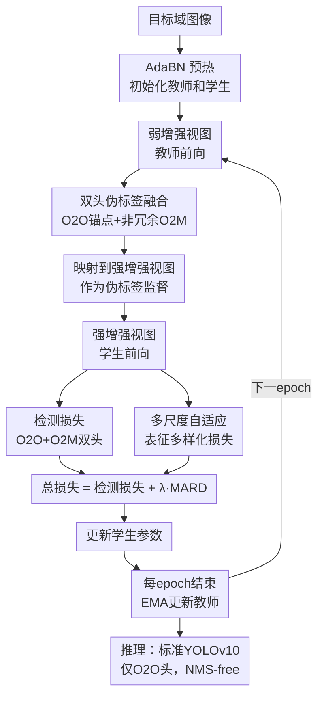

# Real-Time Source-Free Object Detection

**会议**: ECCV 2026  
**arXiv**: [2606.31834](https://arxiv.org/abs/2606.31834)  
**代码**: [https://github.com/Sairam13001/RT-SFOD/](https://github.com/Sairam13001/RT-SFOD/)  
**领域**: 自动驾驶 / 无源域适应目标检测  
**关键词**: 无源域适应, 实时目标检测, YOLO, 双头检测器, 伪标签融合  

## 一句话总结
本文在 YOLOv10（首个 NMS-free 双头检测器）上构建了实时无源域适应目标检测框架 RT-SFOD，提出双头伪标签融合（DHF）恢复 O2O 头漏检物体同时保持高精度，以及多尺度自适应表征多样化损失（MARD）对抗域偏移导致的特征秩退化，在四个域偏移基准上以 1.3 倍推理速度、~2 倍参数压缩实现 1.4-3.5% mAP 提升。

## 研究背景与动机

**领域现状**：无源目标检测（SFOD）在自动驾驶、监控等实际应用中，需要在不能访问源数据的隐私约束下，将训练好的检测器适配到目标域。现有多数 SFOD 方法建立在 Faster R-CNN 或 DETR 等重骨干之上，这些方法在适配精度上持续进步，但完全忽略了推理速度（FPS）和模型大小，无法满足实时应用对延迟和内存的严格限制。

**现有痛点**：一个自然的改进思路是将 SFOD 迁移到 YOLO 系等一阶段轻量检测器上。然而，最先进的 YOLOv10 引入了 NMS-free 双头设计——用 O2O（一对一匹配）头做无后处理的端到端推理，用 O2M（一对多匹配）头提供更强的训练监督。当直接套用标准 Mean-Teacher（MT）自训练框架时，会出现两个问题：(1) O2O 头伪标签精度极高（precision 0.923）但召回率低（recall 0.446），漏掉大量物体；O2M 头召回略高（0.469）但引入额外噪声（precision 0.847）；单独用任一头或简单合并两头的预测都达不到理想效果。(2) 域偏移会导致多尺度特征图的有效秩（effective rank）大幅下降——作者用信息熵形式定义有效秩并验证了这一点，说明特征的表征多样性在域偏移后被严重压缩，标准 MT 自训练只能恢复其中不到一半的秩损失，构成适配性能的上限。

**核心矛盾**：双头检测器的精度-召回互补性与域偏移下特征判别力退化，是现有 MT 框架无法同时处理的两个瓶颈。O2O 精度高但召回低、O2M 召回稍好但噪声大，而在特征层面，域偏移使得原本高判别力的特征空间坍缩到低维子空间，MT 的 EMA 平滑不足以恢复这种结构性退化。

**本文目标**：在保持 YOLOv10 的 NMS-free 推理效率（不增加任何推理开销）的前提下，解决上述两个训练阶段的瓶颈，实现精度、速度、模型大小三者的帕累托前沿提升。

**切入角度**：作者的观察是双头伪标签问题本质上是"如何用一个头的精确预测作为锚点，选择性吸收另一个头补充的新物体"，而非粗暴合并；而特征退化问题可以通过在检测结构内的多尺度 PAN 特征上施加结构化的方差-协方差约束来对抗——这与自监督学习中的坍塌预防（如 VICReg）思路相似，但需要适配到检测特有的前景/背景采样和尺度分配。

**核心 idea**：用"O2O 锚点 + 非冗余 O2M 补充"的融合策略提升伪标签质量，同时在 PAN 检测特征上施加检测感知的方差-协方差正则化恢复特征判别力。

## 方法详解

### 整体框架

RT-SFOD 在 Mean-Teacher 框架之上嵌入两个仅训练时使用的模块（DHF 和 MARD），推理时完全还原为标准 YOLOv10，无任何额外开销。整个适配流程：先用 AdaBN（自适应批归一化）在目标域图像上更新 BN 统计量作为教师和学生的初始化点；然后进入逐 epoch 的自训练循环——教师对弱增强视图生成 O2O 和 O2M 预测，经 DHF 融合得到伪标签，映射到强增强视图后监督学生；学生前向时在 PAN 三层特征图上额外计算 MARD 损失；总损失 = YOLOv10 标准检测损失 + 自适应加权的 MARD 损失；每 epoch 结束用 EMA 动量 0.999 更新教师一次（而非每步更新，作者发现每 epoch 更新一次效果最好）。

### 关键设计

**1. DHF（双头伪标签融合）：以 O2O 高精度锚点为先验，选择性吸收 O2M 的非冗余检测**

O2O 头产生无重复的高精度预测但漏检多，O2M 头覆盖更广但噪声大——简单合并会导致精度-召回均不理想（F1 仅 0.634，直接合并甚至比单独 O2O 的 mAP 还差）。DHF 的核心思路是把 O2O 预测视为不可动摇的"锚点"，只在它们没覆盖到的区域让 O2M 补位。

具体操作分三步：(1) 对 O2O 预测做置信度筛选（$s(p) \geq \tau_o$，默认 0.5），作为高质量锚点集 $\hat{Y}^o$；(2) 从 O2M 中筛选置信度达标（$s(p) \geq \tau_m$）的候选，但只保留与所有 O2O 锚点 IoU 均不超过 $\tau_{no}$（默认 0.2）的框，即"和任何锚点都不重叠的新物体"；(3) 由于 O2M 候选内部可能仍有重复，对这部分额外候选施加类内 NMS（阈值 $\tau_{dup}$=0.7）去重。最终伪标签 = O2O 锚点 $\cup$ 去重后的 O2M 补充框。

这个策略的巧妙之处在于：O2O 作为"先验"出牌，保证每一个 O2O 框都不会被 O2M 的噪声替换或污染；O2M 只扮演"补漏"角色，且通过 IoU 门控和 NMS 双重过滤大幅抑制了 O2M 自带的噪声。最终 DHF 伪标签在保持 precision 0.919（接近纯 O2O 的 0.923）的同时将 recall 从 0.446 推到 0.525，F1 达到 0.668（提升 10.7%）。

**2. MARD（多尺度自适应表征多样化）：在 PAN 检测特征上施加前景/背景感知的方差-协方差正则化**

域偏移使得 YOLOv10 的 PAN 三层特征图（P3/P4/P5）的有效秩显著下降，意味着特征向量的有效信息维度被压缩——通道间变得高度冗余、单通道的方差收缩，检测头可用的判别信息减少。标准 MT 自训练对此恢复有限（仅恢复 26-48% 秩损失）。

MARD 的解决方案是在学生前向时，从每层 PAN 特征图上采样前景和背景特征向量，然后施加两个互补的约束：(1) 方差项 $\mathcal{L}_{var} = \frac{1}{C}\sum_{c=1}^{C}\max(0, \gamma - \sqrt{\mathrm{Var}(Z_{:,c}) + \epsilon})$，强制每个通道保持至少为 $\gamma$ 的标准差，防止特征坍塌；(2) 协方差项 $\mathcal{L}_{cov} = \frac{1}{C(C-1)}\sum_{i\neq j}(\mathrm{Cov}(\tilde{Z})_{ij})^2$，惩罚通道间的相关性，减少冗余。

与 VICReg 等通用表征学习的坍塌预防不同，MARD 有三个关键适配：(1) 采样不是全局的，而是用伪标签框内的 $K$ 个空间点作为前景、框外 $M$ 个点作为背景，使正则化直接作用于检测任务使用的特征；(2) 前景采样只取置信度前 $K_b$（默认 15）的伪框，降低噪声伪标签对正则化的污染；(3) 每个伪框按其像素面积 $s(b)=\sqrt{w \cdot h}$ 和步长阈值分配到对应的 PAN 尺度（如小物体→P3，大物体→P5），避免跨尺度混合采样破坏尺度特异性。

MARD 损失 $\mathcal{L}_{mard} = \sum_{\ell \in \{3,4,5\}}(\alpha\mathcal{L}_{var}(Z_\ell) + \beta\mathcal{L}_{cov}(Z_\ell))$ 还有一个自适应权重 $\lambda(t) = \lambda_0 \cdot \mathrm{ramp}(t) \cdot \mathrm{gate}(\bar{s})$：$\mathrm{ramp}(t)$ 在训练初期线性升温（前 5 个 epoch），$\mathrm{gate}(\bar{s})$ 根据批次平均伪标签置信度调节强度——伪标签质量差时 MARD 自动减弱，防止在噪声上正则化。同时 MARD 每隔 $I$ 步计算一次以控制开销。

### 损失函数 / 训练策略

总损失 $\mathcal{L} = \mathcal{L}_{det} + \lambda(t) \cdot \mathcal{L}_{mard}$，其中 $\mathcal{L}_{det}$ 是 YOLOv10 标准的检测损失（框回归 + 分类 + 分布 focal loss），同时在 O2O 和 O2M 两个学生头上计算，保持双头训练动态。学生用 SGD 优化，初始学习率 1e-4，余弦退火，梯度裁剪 norm 10，batch size 16，训练 60 epoch。教师 EMA 动量 0.999，每 epoch 更新一次（而非每步）。所有超参数跨四个域偏移基准一致使用，无需按场景调参。

## 实验关键数据

### 主实验

Cityscapes → Foggy Cityscapes（C2F，天气域偏移）是 SFOD 最核心的基准。下表仅摘录代表性方法和本文三个尺度模型。

| 方法 | 基骨干 | 参数量(M) | FPS | mAP | 说明 |
|------|--------|-----------|-----|-----|------|
| Source-only (YOLOv10S) | YOLOv10S | 7.2 | 233 | 29.6 | 无适配下界 |
| Source-only (YOLOv10L) | YOLOv10L | 24.4 | 67 | 36.5 | 大模型仍低于所有SFOD |
| IRG (CVPR'23) | FRCNN | 34.0 | 51 | 37.1 | 早期SFOD基准 |
| Simple-SFOD (ECCV'24) | FRCNN | 43.8 | 42 | 45.0 | Faster R-CNN系最佳之一 |
| FALCON-SFOD (CVPR'26) | FRCNN | 43.8 | 42 | 46.9 | 引入基础模型先验 |
| SF-YOLO-L (ECCV'24 ws) | YOLOv5L | 46.5 | 52 | 51.6 | 此前SFOD最高精度 |
| DRU (ECCV'24) | Def-DETR | 40.0 | 29 | 43.6 | DETR系SFOD |
| FRANCK (TIP'25) | Def-DETR | 40.0 | 29 | 44.9 | DETR系SFOD |
| VFM-SFOD (AAAI'26) | Def-DETR | 41.0 | 27 | 47.1 | DETR系SFOD |
| **RT-SFOD-S (Ours)** | YOLOv10S | **7.2** | **233** | 44.3 | 最小模型，最快 |
| **RT-SFOD-M (Ours)** | YOLOv10M | 15.4 | 105 | 47.4 | 精度持平VFM-SFOD，快3.6倍 |
| **RT-SFOD-L (Ours)** | YOLOv10L | 24.4 | 67 | **53.8** | 新SOTA，超SF-YOLO-L 2.2点 |

其他三个域偏移基准的核心结果：Sim10k → Cityscapes（S2C，合成到真实）RT-SFOD-L 达 71.2 AP，超过 SF-YOLO-L（69.8）；KITTI → Cityscapes（K2C，相机偏移）RT-SFOD-L 达 60.9 AP，仅次于 SF-YOLO-L（63.7），但后者参数量大了 1.9 倍；Cityscapes → BDD100k（C2B，大规模多样性偏移）RT-SFOD-L 达 46.5 mAP，超出 VFM-SFOD（43.0）达 +3.5。

### 消融实验

下表为 RT-SFOD-M 在三个基准上的组件消融（依次叠加）。

| 配置 | C2F mAP | S2C AP | K2C AP | 说明 |
|------|---------|--------|--------|------|
| Source-trained | 30.5 | 52.5 | 40.3 | 无适配下界 |
| + AdaBN 预热 | 37.4 | 54.2 | 45.2 | BN统计量对齐，提供更好初始化 |
| + MT (O2O) 自训练 | 45.2 | 62.1 | 50.6 | 仅用O2O伪标签的MT基准 |
| + DHF | 46.7 (+1.5) | 65.1 (+3.0) | 53.0 (+2.4) | 双头融合提升伪标签质量 |
| + MARD | 46.3 (+1.1) | 65.3 (+3.2) | 52.5 (+1.9) | 单独MARD，无DHF辅助 |
| + DHF + MARD (完整) | **47.4 (+2.2)** | **66.4 (+4.3)** | **54.2 (+3.6)** | 两者互补，叠加收益超过单独之和 |

MARD 子组件消融（以 MT(O2O)+DHF 为基线）：方差项单独贡献最大（C2F +0.5, S2C +0.8, K2C +0.8），与通道方差坍塌是秩退化的主要模式一致；协方差项补充贡献（+0.3/+0.6/+0.5）；两者组合达到完整 MARD 效果（+0.7/+1.3/+1.2）。

### 关键发现
- DHF 和 MARD 解决的是互补瓶颈：DHF 改善监督信号质量，MARD 改善特征表征质量，两者组合的增益（+4.3 S2C）超过单独增益之和，确认了互补性。
- 伪标签策略对比中，直接合并 O2O 与 O2M+NMS 反而导致 mAP 下降（F1 0.634，mAP 45.5 vs O2O-only 45.2），说明噪声伪标签在迭代自训练中会累积放大——DHF 通过 IoU 门控有效避免了这一点。
- 超参数敏感性极低：四个关键超参数（$\tau_o$, $\tau_m$, $\lambda_0$, $\mu$）在测试范围内变动仅造成 <= 1.5 mAP 波动；整个超参数集跨四个基准和三个模型尺度直接复用，无需调整。
- 泛化性验证：RT-SFOD 在 YOLOv26S/M/L、MS-DETR、Mr. DETR 上均稳定提升 MT(O2O) 基线 2.0-2.8 mAP，证明 DHF 和 MARD 是双头检测器范式的通用方案，而非 YOLOv10 特化。

## 亮点与洞察
- **"O2O 锚点 + O2M 补漏"的融合策略**：不是粗暴置信度加权或简单并集，而是通过 IoU 门控将 O2O 视为不可侵犯的先验、让 O2M 只在空白区域发挥作用——这个设计干净、可解释、无额外可学习参数，且在多个双头检测器上跨架构泛化。思路可迁移到任何有互补预测分支的多头模型（如多尺度预测融合、多专家模型集成）。
- **用有效秩量化域偏移对特征的影响**：将信息论中的"有效秩"概念（基于奇异值谱的指数熵）引入检测任务的特征分析，定量展示了域偏移如何系统性地压缩特征空间——这个分析方法本身就可以作为一个通用诊断工具，用于理解域适应中"到底哪里坏了"。
- **检测感知的正则化而非全局正则化**：MARD 不同于 VICReg/Barlow Twins 等对全局嵌入做正则化——它用伪框引导前景/背景采样、按框尺寸分配到对应 PAN 层，让正则化精确作用于"检测头实际用到的那些特征"。这个"把表征学习的通用技巧适配到检测结构内部"的思路可以迁移到其他密集预测任务（分割、姿态估计）。
- **仅训练时开销、推理零代价**：DHF 融合伪标签和 MARD 特征正则化都是训练时的辅助监督手段，推理时模型完全还原为标准 YOLOv10，不需要改架构、加分支、改变推理流程——这对部署非常友好，且作者通过实验量化了训练开销（+17.1% 每 epoch 时间，+1470MB 显存），远小于精度收益。

## 局限与展望
- **仅适用于双头检测器**：DHF 依赖 O2O 和 O2M 两个互补头的存在，对于传统单头 YOLO（如 YOLOv5/v8/v11）或单头 DETR 系列，DHF 退化为简单的置信度阈值伪标签筛选，失去了融合增益。但 MARD 仍然适用。
- **极端场景下的残余失效**：在严重雾霾+阳光过曝叠加的极端天气、以及密集小物体高度遮挡场景下，RT-SFOD 仍会出现漏检或定位不准——但这些极端情况本身视觉线索极弱，属于任务固有难度而非方法缺陷。
- **相机域偏移依赖模型容量**：在 K2C 上，RT-SFOD-L 以 1.9 倍更少的参数量仍略低于 SF-YOLO-L（60.9 vs 63.7），作者归因于模型容量差距。一个可能的改进方向是结合知识蒸馏或更大的 YOLO 变体来解决容量受限场景。
- **MARD 的计算开销**：虽然 MARD 只在训练时使用，但每 epoch 增加 12.2% 时间开销（+17s），在极大规模数据集上可能成为瓶颈。可以探索更稀疏的采样策略或更低频率的 MARD 计算（目前是每 I 步一次）。

## 相关工作与启发
- **vs SF-YOLO (ECCV'24 ws)**：同样在 YOLO 系上做 SFOD，但 SF-YOLO 基于 NMS 依赖的单头 YOLOv5，不需要处理双头互补性问题，也没有研究域偏移下的特征秩退化。本文是对 NMS-free 双头这一更新架构的首次系统研究，且 DHF 是 SF-YOLO 无法使用的增益来源。
- **vs FALCON-SFOD (CVPR'26)**：FALCON 使用基础模型（CLIP/DINO）先验来增强特征中的目标聚焦性——这本质上是外挂知识增强表征。本文的 MARD 则是通过正则化从检测器内部恢复特征判别力，不需要外部模型，更轻量且与 FALCON 的方法正交（可以叠加）。
- **vs VICReg (ICLR'22)**：MARD 的方差-协方差正则化形式借鉴了 VICReg，但关键区别在于：(a) VICReg 在全局嵌入上操作，MARD 在检测 PAN 特征上操作；(b) VICReg 用均匀采样，MARD 用伪框引导的检测感知采样；(c) MARD 增加了尺度分配和自适应权重机制。这表明表征学习的通用正则化技巧适配到具体任务结构时可以产生显著增益。

## 评分
- 新颖性: ⭐⭐⭐⭐ 首次系统研究 NMS-free 双头检测器的 SFOD，DHF 的锚点-补漏融合策略和用有效秩分析域偏移对特征的影响都是新视角，但核心模块（MT、方差-协方差正则化）本身并非全新概念。
- 实验充分度: ⭐⭐⭐⭐⭐ 四个域偏移基准 + 四种模型尺度 + 五种额外双头检测器验证泛化性 + 详尽的消融/超参数敏感性/训练开销分析，实验设计全面，FPS/参数量/延迟的效率三指标评估在 SFOD 论文中少见且值得推广。
- 写作质量: ⭐⭐⭐⭐⭐ 动机清晰（Fig.2 直观展示了两个瓶颈的量化证据），方法描述严密（公式、阈值、采样策略均有定义），实验分析有洞察（不仅报告数字还解释为什么），补充材料详实（失效分析、冷启动鲁棒性、跨架构迁移均覆盖）。
- 价值: ⭐⭐⭐⭐ 为实时 SFOD 提供了一个在精度-速度-大小三个维度上同时推进帕累托前沿的方案，方法简洁可泛化，代码开源，对自动驾驶等实时部署场景有直接实用价值；两模块均训练时使用，部署零代价，工程落地友好。

<!-- RELATED:START -->

## 相关论文

- [\[ECCV 2026\] LeAD-M3D: Leveraging Asymmetric Distillation for Real-Time Monocular 3D Detection](lead-m3d_leveraging_asymmetric_distillation_for_real-time_monocular_3d_detection.md)
- [\[ECCV 2026\] PLOT: Pseudo-Labeling via Object Tracking for Monocular 3D Object Detection](plot_pseudo-labeling_via_object_tracking_for_monocular_3d_object_detection.md)
- [\[ICCV 2025\] RTMap: Real-Time Recursive Mapping with Change Detection and Localization](../../ICCV2025/autonomous_driving/rtmap_real-time_recursive_mapping_with_change_detection_and_localization.md)
- [\[ICLR 2026\] SimULi: Real-Time LiDAR and Camera Simulation with Unscented Transforms](../../ICLR2026/autonomous_driving/simuli_real-time_lidar_and_camera_simulation_with_unscented_transforms.md)
- [\[ICCV 2025\] DuET: Dual Incremental Object Detection via Exemplar-Free Task Arithmetic](../../ICCV2025/autonomous_driving/duet_dual_incremental_object_detection_via_exemplar-free_task_arithmetic.md)

<!-- RELATED:END -->
