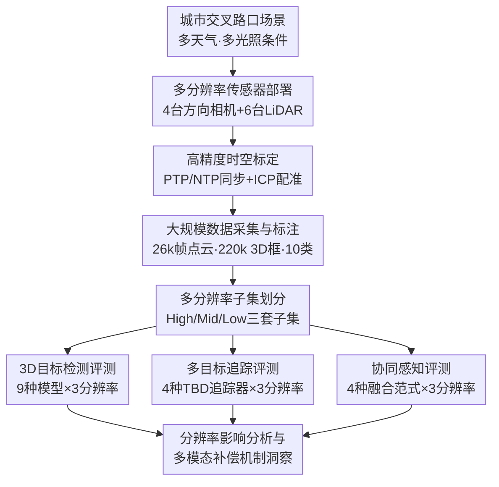

# RESOLVE: A Multi-Resolution and Multi-Modal Dataset for Roadside Cooperative Perception

**会议**: ECCV 2026  
**arXiv**: [2606.31895](https://arxiv.org/abs/2606.31895)  
**代码**: [https://github.com/ASU-Suo-Lab/RESOLVE](https://github.com/ASU-Suo-Lab/RESOLVE)  
**领域**: 自动驾驶  
**关键词**: 路侧协同感知, 多分辨率LiDAR, 多模态融合, 3D目标检测, 路侧数据集, 协同感知  

## 一句话总结
RESOLVE 是首个真实世界多分辨率、多模态路侧协同感知数据集，通过在真实城市交叉路口同时部署 16/64/128 线三种分辨率的 LiDAR 并严格保持传感和环境因素一致，系统评测了 LiDAR 分辨率变化对 3D 检测、多目标追踪和协同感知的影响，揭示了多模态融合如何在点云稀疏时补偿感知下降，以及跨分辨率训练-推理不匹配造成的领域漂移问题。

## 研究背景与动机

路侧协同感知通过融合基础设施上分布式摄像头和 LiDAR 的数据来扩大感知覆盖、缓解遮挡，在智能交通系统和自动驾驶中扮演着日益重要的角色。然而，路侧 LiDAR 的部署在现实中面临一个被长期忽视的问题：LiDAR 配置会因预算约束、硬件升级周期、采购批次差异而发生显著变化——同一个路口在不同运营阶段可能使用不同线束的 LiDAR。即使使用同一台 LiDAR，目标物距传感位置越远，因角分辨率采样特性，点云也会自然变得越来越稀疏。这种由传感器配置和场景依赖因素共同导致的点云分布变化，对感知模型的鲁棒性提出了严峻挑战。然而现有路侧数据集（如 UrbanV2X、RCooper 等）都是在固定 LiDAR 配置下采集的，无法系统研究分辨率变化对检测和融合性能的影响，更无法回答多模态融合在多大程度上能补偿稀疏点云下的感知退化。

这种数据层面的空白使得一系列关键问题无从回答。当前顶级的 LiDAR 检测模型（如 LION、DSVT）和相机-LiDAR 融合模型（如 BEVFusion、UniTR）都是在匹配的传感稀疏度下被评估的，但一旦部署到真实场景中面临不同线束 LiDAR 的分辨率变化，性能会如何退化？当训练时使用的 LiDAR 分辨率与推理时不匹配，会产生多大的领域漂移？更关键的是，多模态融合是否以及如何帮助模型摆脱对点云密度的依赖？回答这些问题需要一个能够**隔离分辨率因素**、在保持其他所有传感和环境变量一致的前提下进行跨架构对比的受控实验平台——而在此之前，没有任何公开数据集提供了这样的能力。

**核心 idea：本文提出 RESOLVE，第一个真实世界多分辨率、多模态路侧协同感知数据集，通过在真实城市交叉路口同时部署 16 线、64 线和 128 线三组 LiDAR 并严格保持安装位置、场景内容和其他传感变量一致，实现了 LiDAR 分辨率因素的系统隔离，从而首次为分析分辨率变化对单模态和多模态路侧感知的影响提供了受控评测平台。**

## 方法详解

RESOLVE 的设计逻辑是：构建一个能同时提供三种 LiDAR 分辨率数据、且保证其他变量「全同」的真实路侧感知实验平台，再基于此开展系统化的 3D 检测、多目标追踪和协同感知评测，从中提炼出分辨率对感知性能影响的规律性发现。

### 整体框架

数据集的构建和评测管线包括五个阶段：首先在真实城市路口部署多分辨率传感器阵列（4 台方向摄像头 + 6 台跨分辨率 LiDAR），然后完成高精度的时空标定与同步，接着进行大规模数据采集和 3D 人工标注，再将数据按 LiDAR 分辨率划分为 High/Mid/Low 三个子集但保持标注一致，最后在此基础上开展三大任务的系统化 Benchmark 评测。

### 关键设计

**1. 多分辨率传感器协同部署：隔离分辨率变量的受控实验设计**

RESOLVE 的核心设计在于让 LiDAR 分辨率的对比真正「干净」。论文在路口西北和东南两个对角的人行信号灯杆上分别部署了一组 LiDAR，每组包含 16 线（RoboSense Helios-16）、64 线（Ouster OS1-64）和 128 线（Ouster OS1-128）各一台，共 6 台 LiDAR。为了尽可能减少除分辨率外的其他混淆因素，两组 LiDAR 的水平位置坐标和零相位朝向保持严格一致，仅安装高度因传感器物理限制略有差异（高/中分辨率 LiDAR 高度差仅 0.17 m，地面覆盖重叠率达 99%；低分辨率 LiDAR 因垂直视场角较窄适当降低安装高度，但通过统一点云范围约束，有效覆盖重叠率仍达 95%）。这意味着在同一时刻、同一场景下，RESOLVE 可以提供三套除点云密度外几乎完全一致的观测数据——这是它区别于所有此前数据集的关键能力。此外，四台 AXIS P1455-LE 网络相机安装在路口四个方向的交通信号灯杆上，实现 360° 覆盖，提供同步的 RGB 图像。

**2. 高精度多传感器时空标定与同步：保证对比公平性的数据基础**

跨分辨率对比的前提是所有传感器输出的时间对齐和空间对准达到足够精度。RESOLVE 采用分层同步策略：LiDAR 之间使用 PTP（Precision Time Protocol）通过工业交换机实现微秒级同步，并利用锁相环机制对齐旋转周期；而 AXIS 网络相机不支持外部触发硬件同步，因此采用后处理策略，将每一帧 LiDAR 数据与时间戳最近的相机帧匹配，确保最大时间偏差不超过半帧间隔，超限的匹配对被丢弃。空间标定方面，先通过棋盘格标定相机内参，再用 2D-3D 对应点最小化重投影误差求解相机-LiDAR 外参，最后用 ICP 算法精配准 LiDAR 间的位姿。这些步骤共同构建了一个空间误差可控、时间偏差有界的数据底座，使得后续跨分辨率对比中观察到的性能差异可以归因于分辨率本身而非标定误差。

**3. 多分辨率一致性标注流水线：公平对比的标注方法论**

这是数据集建设中最为巧妙的设计权衡——如果对三种分辨率的点云分别标注，标注标准的不一致会引入额外变量；如果只在高分辨率点云上标注，低/中分辨率下的数据稀疏性又可能导致部分标注框几乎不含点。RESOLVE 的策略是：将两台同步的 128 线 LiDAR 点云融合到一个坐标系统，仅在融合后的高密度点云上进行 3D 标注；完成标注后，通过标定结果将 3D 框反向投影到 64 线和 16 线 LiDAR 坐标系下。对于投影后的每个框，统计框内点云数量，当点数 ≥5 时视为有效框计入统计，但不足 5 个点的「无效」框**仍然保留**在训练和评测的 ground truth 集合中——只是在统计分析时标记其有效状态。这意味着三种分辨率使用**完全相同**的 3D 标注框，只是框内点云密度不同，从根本上保证了跨分辨率对比的标注公平性。整个数据集涵盖 10 类交通参与者（轿车、卡车、公交车、厢式货车、工程车、拖车、摩托车、自行车、行人、高尔夫球车），包含 100k+ 图像和 26k 帧点云共计 220k 个 3D 框，覆盖晴天/阴天/雨天/夜间/强逆光等多种条件。

## 实验关键数据

### 主实验

RESOLVE 在三大任务上系统评测了 9 种检测模型、4 种追踪器和 4 种协同感知范式在三种 LiDAR 分辨率下的性能。下表为 3D 目标检测的主结果：

| 模型 | 模态 | 骨干 | Low mAP | Mid mAP | High mAP |
|------|------|------|:-------:|:-------:|:--------:|
| PointPillars | L | SparseConv | 75.1 | 79.7 | 80.6 |
| CenterPoint | L | SparseConv | 79.9 | 86.4 | 87.4 |
| TransFusion-L | L | SparseConv | 82.5 | 86.6 | 89.1 |
| VoxSeT | L | Transformer | 87.4 | 89.1 | 90.1 |
| DSVT | L | Transformer | 85.9 | 94.1 | 94.6 |
| Voxel Mamba | L | Mamba | 85.7 | 94.9 | 95.4 |
| LION | L | Mamba | 88.1 | 95.1 | 95.9 |
| BEVFusion | L+C | SparseConv | 86.3 | 92.6 | 93.1 |
| UniTR | L+C | Transformer | 89.7 | 94.4 | 94.9 |

所有模型均使用统一的训练协议（20 epoch, Adam, OneCycle LR=0.001），确保公平对比。

### 消融实验

论文的核心分析实验之一是比较相同 LiDAR 骨干下的单模态与多模态性能，揭示视觉信息对稀疏点云的补偿程度：

| 配置 | Low mAP | Mid mAP | High mAP | 说明 |
|------|:-------:|:-------:|:--------:|------|
| TransFusion-L（单模态 LiDAR） | 82.5 | 86.6 | 89.1 | 纯 LiDAR, SparseConv 骨干 |
| BEVFusion（相机+LiDAR 融合） | 86.3 | 92.6 | 93.1 | 多模态融合, 相同骨干 |
| 多模态增益 | +3.8 | +6.0 | +4.0 | 融合在中等分辨率下增益最大 |

此外，论文通过对比训练/推理分辨率不一致时的性能退化，量化了分辨率漂移的影响（如下表为 Voxel Mamba 的实验）：

| 训练分辨率 | 推理 Low | 推理 Mid | 推理 High |
|:---------:|:--------:|:--------:|:---------:|
| Low | 85.7 | ~40% drop | ~40% drop |
| Mid | ~40% drop | 94.9 | ~4.6% drop |
| High | ~40% drop | ~4.6% drop | 95.4 |

### 关键发现

- **分辨率收益呈显著边际递减**：从 Low→Mid 全模型平均 mAP 提升 7.4%，但从 Mid→High 仅提升 1.0%。中等分辨率（64 线）已能捕获大部分判别性几何信息，进一步增加点云密度带来的新信息有限，且体素化等编码阶段的信息瓶颈会阻止额外点数转化为等比例的性能提升。
- **Mamba 架构对分辨率最为敏感**：由于序列化建模的方式，Mamba 对 token 质量的要求更高，从中分辨率到高分辨率其性能提升（+9.3%）显著高于 Transformer（+5.7%）和 SparseConv（+8.0%）。Transformer 因全局注意力机制对稀疏性相对最鲁棒。
- **多模态融合可在低分辨率下匹敌纯 LiDAR 高分辨率性能**：BEVFusion 在低分辨率下的 mAP (86.3) 已超过 TransFusion-L 在中等分辨率下的表现 (86.6)，意味着用较低成本的 LiDAR（16 线）+ 相机可以达到接近 64 线纯 LiDAR 的水平。
- **分辨率不匹配造成严重的领域漂移**：低分辨率模型迁移到高分辨率推理时 mAP 下降约 40%，高分辨率模型迁移到低分辨率也损失约 40%。这种不匹配对多模态模型（如 UniTR）的破坏更为严重，甚至出现 mAP≈0 的灾难性退化，因为分辨率变化同时扰乱了单模态特征表达和跨模态对齐。
- **简单降采样不能代替真实低线束 LiDAR**：从 128 线点云降采样得到的 16 线数据比真实 16 线 LiDAR 的性能偏差极不规律——在行人检测上被大幅低估（AP 降 29-44%），而在某些距离范围内又过度乐观。这是因为降采样只能改变稀疏度，无法模拟真实低线束 LiDAR 的垂直角度分布差异、收发光学特性差异和结构缺失测量。

## 亮点与洞察

- **受控多分辨率实验设计的开创性**：在真实路侧场景中同步部署三种分辨率的 LiDAR 并严格保持其他因素一致，这个设计看似简单但实现难度极大——需要协调安装位置、视场角重叠、标定误差控制等多个环节。它为社区提供了一个可系统研究 LiDAR 分辨率影响的「黄金标准」平台。
- **多模态融合补偿机制的定量揭示**：论文通过梯度截断的受控实验（保留/切断从多模态 loss 到 LiDAR 骨干的反向传播），发现多模态训练会「重塑」LiDAR 骨干的特征学习——虽然早期层的类别可分性因梯度干扰反而下降，但融合层的可分性显著提升，表明相机特征帮助 LiDAR 骨干减少了对于点云密度线索的依赖，转而专注于与视觉信号更好的对齐。
- **对路侧感知系统成本-精度权衡的实用指导**：RESOLVE 的实验结果给出了一个清晰的信息——在路侧部署中，64 线 LiDAR + 相机可能是性价比最优的组合，进一步提升到 128 线的边际收益很小。这一洞察对于实际交通基础设施投资有直接的参考价值。

## 局限与展望

- RESOLVE 目前仅覆盖单一交叉路口场景，缺乏多路口连续路段的传感器数据和场景多样性。作者已计划扩展到多路口和走廊级场景。
- 数据分布存在类别不平衡——主流车辆类别（轿车）表现稳定且高，但部分小目标（摩托车、自行车、行人）和形态差异大的类别（拖车、厢式货车）在低分辨率下性能较差，这表明分析结论可能对大/小目标存在非对称性。
- 当前评测仅覆盖了 9 种检测模型和 4 种追踪器，更多最新的感知架构（如 Occupancy 网络、端到端模型）在 RESOLVE 上的行为尚未被系统评估。
- 论文对分辨率不匹配的分析主要聚焦在「下降多少」的量化上，尚未提出有效的领域自适应方法来解决该问题——这是后续工作最有价值的方向之一。

## 相关工作与启发

- **vs RCooper**：RCooper 也是基础设施间协同感知数据集，但只有 64 线 LiDAR 单分辨率，无法研究分辨率变化的影响。RESOLVE 首次引入了多分辨率对比能力。
- **vs UrbanV2X**：UrbanV2X 覆盖更广的场景范围（含路口和路段）和更多的传感器（3 台 LiDAR），但同样是单分辨率。RESOLVE 的独特价值在于分辨率隔离的实验设计。
- **vs nuScenes/KITTI**：这些经典自动驾驶数据集提供单分辨率 LiDAR 数据（32 线或 64 线），且主要面向单车视角。RESOLVE 面向路侧基础设施视角，数据特点和挑战完全不同（更高的安装高度、更远的检测距离、更大的视角覆盖）。
- **vs DAIR-V2X / V2X-Real**：这些 V2I 数据集覆盖车-路协同，但 LiDAR 主要用于车端或仅单分辨率路侧。RESOLVE 聚焦基础设施间的协同感知（I2I）而非车-路通信。
- **核心启发**：RESOLVE 揭示的多模态补偿机制提示了一个设计方向——在有限传感器预算下，可以通过更智能的相机-LiDAR 融合策略来弥补 LiDAR 分辨率不足，而非单纯增加 LiDAR 线束。此外，训练-推理分辨率不匹配问题的严重性呼吁社区关注感知模型的跨分辨率泛化能力。

## 评分

- 新颖性: ⭐⭐⭐⭐⭐ 首个同时提供三种 LiDAR 分辨率并进行受控对比的真实路侧协同感知数据集，填补了数据空白。
- 实验充分度: ⭐⭐⭐⭐⭐ 覆盖 3 大任务 × 3 种分辨率 × 多种模型架构的全面评测，包括 t-SNE 可视化、梯度截断分析等多角度机制分析，实验设计严谨。
- 写作质量: ⭐⭐⭐⭐ 结构清晰，数据详实，附录提供了充分的实现细节和补充实验，但部分表格数据量较大，核心信息需要读者自行提炼。
- 价值: ⭐⭐⭐⭐⭐ 不仅提供了高价值数据集，更通过系统化的基准实验产出了关于分辨率影响和多模态补偿机制的实用洞察，对路侧感知系统设计和成本优化有直接参考意义。

<!-- RELATED:START -->

## 相关论文

- [\[ECCV 2026\] CooperScene: Multi-Modal Cooperative Autonomy Benchmark with C-V2X Communication Characterization](cooperscene_multi-modal_cooperative_autonomy_benchmark_with_c-v2x_communication_.md)
- [\[NeurIPS 2025\] UrbanIng-V2X: A Large-Scale Multi-Vehicle Multi-Infrastructure Dataset Across Multiple Intersections for Cooperative Perception](../../NeurIPS2025/autonomous_driving/urbaning-v2x_a_large-scale_multi-vehicle_multi-infrastructure_dataset_across_mul.md)
- [\[NeurIPS 2025\] V2X-Radar: A Multi-Modal Dataset with 4D Radar for Cooperative Perception](../../NeurIPS2025/autonomous_driving/v2x-radar_a_multi-modal_dataset_with_4d_radar_for_cooperative_perception.md)
- [\[ICLR 2026\] GaussianFusion: Unified 3D Gaussian Representation for Multi-Modal Fusion Perception](../../ICLR2026/autonomous_driving/gaussianfusion_unified_3d_gaussian_representation_for_multi-modal_fusion_percept.md)
- [\[CVPR 2026\] DSERT-RoLL: Robust Multi-Modal Perception for Diverse Driving Conditions with Stereo Event-RGB-Thermal Cameras, 4D Radar, and Dual-LiDAR](../../CVPR2026/autonomous_driving/dsert-roll_robust_multi-modal_perception_for_diverse_driving_conditions_with_ste.md)

<!-- RELATED:END -->
