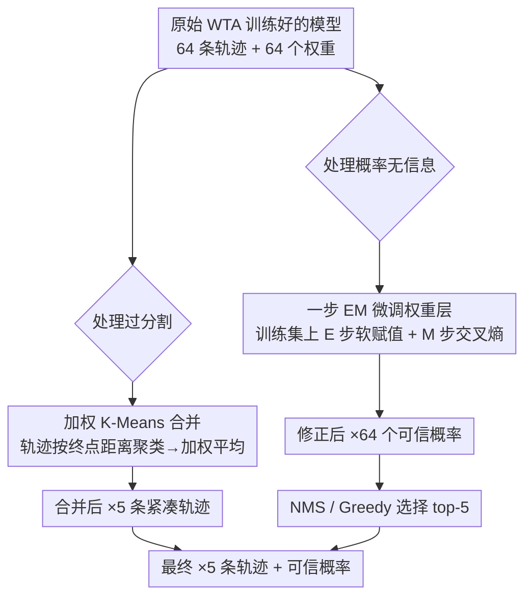

# Rethinking Training & Inference for Forecasting: Linking Winner-Take-All back to GMMs

**会议**: ECCV2026  
**arXiv**: [2606.26424](https://arxiv.org/abs/2606.26424)  
**代码**: 未开源  
**领域**: 自动驾驶  
**关键词**: 轨迹预测, Winner-Take-All, GMM, 模式合并, 期望最大化

## 一句话总结

本文揭示自动驾驶轨迹预测中广泛使用的 Winner-Take-All (WTA) 损失函数本质上是 K-Means 聚类目标而非高斯混合模型 (GMM) 似然，正是这一"GMM 建模 + WTA 训练"的不匹配导致模式概率无信息量且过分割；在此基础上提出两种无需重训的后处理手段——测试时加权合并与一步 EM 微调，显著改善模式排序质量和位移精度。

## 研究背景与动机

自动驾驶轨迹预测需要为周围车辆和行人输出多个可能的未来轨迹（多模态预测），每个轨迹附带一个概率权重，让下游规划模块区分高/低置信度行为。业界主流的建模方式是用条件高斯混合模型（GMM）：K 个高斯分量对应 K 条候选轨迹，每条轨迹有均值 $\hat{\mathbf{y}}_k$、协方差 $\Sigma_k$ 和混合权重 $\hat{p}_k$。但训练时并不直接优化 GMM 的对数似然——因为极大似然会引发严重的模式坍缩，所有分量收敛到同一个均值——而是使用 Winner-Take-All (WTA) 损失：对每条真实轨迹，只更新与其最接近的那个预测分量，其他分量原地不动。

这种做法虽然成功避免了模式坍缩、保持了覆盖度，却产生了一个被业界长期容忍的怪象：模型输出的模式概率几乎没什么信息量。一条"直行"的真实轨迹可能被 64 个候选中五六个分头覆盖，每个分量的概率都不高；按概率取 top-5 时，这些碎片化的分量谁也排不上去，反而可能选中一个高概率但轨迹奇怪的分量。实践中各模型只能靠后处理的 NMS 或聚类合并来补救，但从未有人系统回答过：为什么 WTA 训练出来的概率这么没用？它的根本症结在哪？

本文的核心洞察是：WTA 损失在数学上等价于 K-Means 聚类目标，而非 GMM 的极大似然。作者从梯度角度严格证明，WTA 下每个分量的最优解就是被它"抢"到的那些样本的均值——这和 K-Means 里每个簇心取所属样本均值是一回事。这意味着整个训练过程实际上在做轨迹空间上的硬划分（hard assignment）而不是概率建模。硬划分天然导致过分割：如果真实行为模式只有 3 个，但模型设了 64 个分量，K-Means 会把一个模式切成若干碎片，每片独享一部分样本，各片的概率自然都很小。**核心 idea：将 WTA 损失重新解释为 GMM-ELBO 中的硬 EM 近似（即 K-Means），指出硬赋值是模式概率无信息量的根源，并提出两步后处理——测试时加权 K-Means 合并碎片和一步 EM 软赋值更新——在无需重训的前提下对齐训练目标与推断假设。**

## 方法详解

### 整体框架

本文方法不修改原模型的训练过程，而是在训练完成后施加两类后处理，分别针对 WTA 的两个后果。第一类处理过分割问题：把 64 个碎片化分量通过加权 K-Means 聚类合并成 5 个紧凑簇，每个簇的轨迹由簇内分量按权重平均得到。第二类处理概率无信息量问题：利用一步 EM （在训练集上做软赋值 E 步 + 交叉熵 M 步）修正所有分量的混合权重 $\hat{p}_k$，让它们反映真实的后验概率而非 K-Means 的硬划分频率。两个处理互补，可以单独用也可以联合用（实验表明合并本身就能大幅提升 minADE/minFDE；一步 EM 则让 greedy 选择和 NMS 选择也变得可用）。整体流程如下：

**图注**：两类后处理可以独立使用。合并路线（左）适合追求精度且不介意推理稍慢的场景；EM 微调路线（右）适合追求推理速度的场景，因为它只改权重不改轨迹，之后仍可用 NMS 快速选 top-5。

### 关键设计

**1. GMM vs K-Means 统一视角：WTA 就是带 hard assignment 的 K-Means**

这是整篇论文的理论根基。作者发现，将 WTA 损失分解为分类项（$\log\hat{p}_k$，哪个分量更新）和回归项（高斯负对数似然），只看回归项的最优解：对每个分量 $k$，梯度为零时 $\hat{\mathbf{y}}_k^* = \frac{1}{N_k}\sum_{i\in\mathcal{C}_k}\mathbf{y}_i^*$，其中 $\mathcal{C}_k$ 是所有被分量 $k$ 硬分配过来的样本集合——这恰恰是 K-Means 中簇心的闭式解。换句话说，无论模型设计多复杂（Transformer / 图网络），WTA 训练在回归任务上等价于在轨迹空间做 K-Means 聚类。这个等价关系立刻解释了两个现象：第一，WTA 不坍缩是因为 K-Means 天然会分散簇心去覆盖不同区域；第二，WTA 产生无信息概率是因为硬划分把一个真实模式切成若干碎片，每片只占 $1/N_k$ 的计数，导致混合权重 $\hat{p}_k$ 不再是"这个模式有多可能发生"，而是"这个碎片占了多大样本份额"。

**2. 测试时加权 K-Means 合并：把碎片还原为真实模式**

既然 WTA 把真实模式切碎了，自然的思路就是把碎片重新合并回来。具体做法是：对模型输出的 64 条轨迹 $\hat{\mathbf{y}}_k$（含权重 $\hat{p}_k$），以终点位移为距离，迭代运行 K-Means 聚类（$64\to5$）。每次迭代中：（1）把每条轨迹分配到最近的簇心；（2）用簇内轨迹的加权平均更新簇心，权重就是各轨迹的 $\hat{p}_k$——$\bar{\mathbf{y}}_m = \frac{\sum_{k\in C_m} \hat{p}_k \hat{\mathbf{y}}_k}{\sum_{k\in C_m} \hat{p}_k}$；（3）重复直到收敛。这个加权平均的灵感来自 GMM 的 M 步：如果每个碎片的 $\hat{p}_k$ 反映了它在真实模式内的份额，那么按 $\hat{p}_k$ 加权平均自然恢复出真实模式的中心。实验显示，仅靠这一合并操作就能让 Wayformer 在 NuScenes 上 minFDE 从 8.287（greedy）降至 3.050，甚至接近直接训练 5 模式模型的效果（2.976）。

**3. 一步 EM 权重微调：用软赋值取代硬赋值校准概率**

合并处理了轨迹位置，但没有处理混合权重——合并后的簇仍然沿用了碎片权重的加和。更根本的做法是直接修正权重分布，使之反映真实后验。作者提出在训练集上额外运行一步 EM：（E 步）对每个训练样本 $\mathbf{y}^*$，用当前模型输出的 $\hat{\mathbf{y}}_k$ 和 $\Sigma_k$ 计算软责任 $w_k = p(k|\mathbf{y}^*) = \frac{p(\mathbf{y}^*|\hat{\mathbf{y}}_k,\Sigma_k)\hat{p}_k}{\sum_z p(\mathbf{y}^*|\hat{\mathbf{y}}_z,\Sigma_z)\hat{p}_z}$；（M 步）最小化软赋值下的交叉熵 $\mathcal{L} = -\sum_i \sum_k w_k \log \hat{p}_k$，只更新权重层的参数（通常是一个两层 MLP 头），不移动轨迹位置。这个微调非常轻量，但效果显著：以 Wayformer 为例，NuScenes 上 greedy 选择的 brier-FDE 从 8.935 降至 6.353（降 29%），NMS 从 7.679 降至 5.748（降 25%）。负对数似然（NLL）也大幅下降：top-5 NLL 从 4404.5 降至 1796.4（降 59%），说明修正后的概率确实更准确地反映了真实轨迹的似然。

## 实验关键数据

### 主实验

| 数据集 | 指标（brier-FDE5↓） | Wayformer Greedy | Wayformer NMS | Wayformer Merging | Wayformer Direct |
|--------|-----------------|----------------|--------------|-----------------|----------------|
| NuScenes | brier-FDE5 | 8.935 | 7.679 | 3.646 | 3.584 |
| NuScenes | minADE5 | 3.302 | 2.871 | 1.439 | 1.399 |
| NuScenes | minFDE5 | 8.287 | 7.024 | 3.050 | 2.976 |
| WOMD | brier-FDE5 | 11.645 | 11.423 | 5.529 | 4.288 |
| WOMD | minADE5 | 4.143 | 4.080 | 2.025 | 1.562 |
| WOMD | minFDE5 | 10.994 | 10.775 | 4.968 | 3.710 |

**关键发现**：基于概率的 greedy/NMS 选择远差于 clustering merging，说明 WTA 的概率确实无信息量；合并操作本身就让 minFDE 改善 2-3 倍，接近直接训练的效果——意味着模型其实已经学到了合理的轨迹位置，只是权重分配错了。

### 一步 EM 微调效果

| 模型 | 选择策略 | brier-FDE5（微调前） | brier-FDE5（微调后） | 降幅 |
|------|--------|-------------------|-------------------|------|
| Wayformer | Greedy | 8.935 | 6.353 | -29% |
| Wayformer | NMS | 7.679 | 5.748 | -25% |
| MTR-e2e | Greedy | 6.016 | 4.793 | -20% |
| MTR-e2e | NMS | 5.089 | 4.400 | -14% |

| 指标 | Wayformer（微调前） | Wayformer（微调后） | 降幅 |
|------|-----------------|-----------------|------|
| top-5 NLL | 4404.5 | 1796.4 | -59% |
| top-1 NLL | 7711.0 | 5089.5 | -34% |

**关键发现**：一步 EM 微调显著提升了 greedy 和 NMS 的效果，且对 NLL 的改善尤其突出——修正后的权重让 top-5 GMM 的对数似然下降了近 60%，说明软赋值确实让概率分布更集中到正确的真实轨迹上。

### 关键发现

- **合并 vs 直接训练对比**：合并操作（64→5 加权 K-Means）的效果几乎逼近直接训练 5 模式的模型（MTR-e2e 上甚至略优），说明 WTA 下 64 分量的轨迹覆盖已经足够好，问题只在"怎么选"而不在"怎么预测"。
- **概率集中效应**：一步 EM 后，高概率候选轨迹与真实轨迹的 minFDE 分布显著左移，说明概率质量从分散的碎片集中到了更准确的候选上。
- **方法普适性**：论文在 Wayformer、MTR-e2e、EMP 三个不同架构上均验证了效果，说明"WTA=K-Means"的分析不依赖于特定模型实现，具有广泛的适用性。

## 亮点与洞察

- **"错配"洞察精妙**：指出 GMM 建模 + WTA 训练的假设不匹配是业界长期被忽略的根本问题。这篇论文没有引入任何新训练目标，仅仅是重新解释现有目标并做轻量后处理，就获得了显著收益——这正是好的理论工作该有的"用分析撬动实践"的风格。
- **两步后处理分工清晰**：合并处理轨迹位置（过分割），EM 微调处理概率权重（无信息），两者解耦、可独立使用，也联合使用。这种模块化的思路便于实践者按需选择（精度优先→合并；速度优先→EM+NMS）。
- **对从业者的实用建议**：论文在讨论中给出了一条清晰决策链——如果最终模式数固定且能重训，直接训练最优；如果测试时模式数可调且更看重精度，用合并；如果更看重推理速度，用一步 EM + NMS。这种 actionable 的 guidance 在学术论文中很难得。

## 局限与展望

- **EM 微调需要访问训练数据**：虽然位置参数不动、微调很轻量，但仍然需要完整的训练集来做一步 EM 的 E 步计算，对隐私敏感或已经丢掉训练数据的场景不适用。一种可能的改进是直接用测试样本做 E 步（但需要有合理的协方差估计）。
- **合并增加推理延迟**：加权 K-Means 迭代需要多次计算 64 条轨迹间的终点距离，在小算力设备上可能不划算。也许可以用基于距离的贪心合并（类似 NMS 但保留合并而非抑制）来加速。
- **分析限于回归项**：作者只分析了 WTA 回归项与 K-Means 的等价性，对分类项（$\log\hat{p}_k$ 的梯度行为）讨论较少。如果分类项也在训练中引入了某种偏置，仅靠一步 EM 可能无法完全纠正。

## 相关工作与启发

- **vs MultiPath++ / Wayformer / MTR**：这些模型都使用 WTA 损失 + 64 候选 → NMS/合并做后处理，但此前从未有人系统解释为什么需要这步后处理。本文提供了理论框架：后处理不是锦上添花，而是弥补 GMM 建模与 WTA 训练的错配，是必不可少的修正。
- **vs EM 训练 GMM**：传统的 EM 通过软赋值避免过分割，但计算成本高且易坍缩。WTA 用硬赋值解决坍缩却带来了过分割。本文的一步 EM 可看作在两种极端之间找到一个实用的折中：用 WTA 训练（保证多样性），用一步 EM 纠正概率（保证概率信息量）。
- **vs 直接训练 5 模式**：直接训练的效果整体略优于合并，但失去了测试时调整模式数的灵活性。本文的统一视角为实践者给出了清晰的权衡分析，而非简单推荐某一种做法。

## 评分

- **新颖性**: ⭐⭐⭐⭐ 将 WTA 与 K-Means 建立等价关系本身不算全新（文献中早有类似 insight），但将其系统应用于轨迹预测领域、推导出可落地的后处理方案是首次，分析深度和实验覆盖度都很好。
- **实验充分度**: ⭐⭐⭐⭐⭐ 在两种数据集、三种模型、多种后处理变体上做了全面对比，包含精度指标和分布质量指标（NLL），结论可靠。
- **写作质量**: ⭐⭐⭐⭐⭐ 推理链非常清晰：问题现象 → 根因分析（WTA=K-Means）→ 两个后果（过分割、无信息概率）→ 针对性的后处理 → 实验验证。读者能轻松跟上思路。
- **价值**: ⭐⭐⭐⭐⭐ 这篇论文有潜力改变轨迹预测社区的训练和推理实践。如果大家都接受"WTA=K-Means"的分析，未来的工作可能会主动设计带软赋值的训练目标，或至少在后处理中系统性地使用本文的方法。

<!-- RELATED:START -->

## 相关论文

- [\[ECCV 2026\] Towards Metric-Agnostic Trajectory Forecasting](towards_metric-agnostic_trajectory_forecasting.md)
- [\[ICML 2026\] Threshold-Based Exclusive Batching for LLM Inference](../../ICML2026/autonomous_driving/threshold-based_exclusive_batching_for_llm_inference.md)
- [\[AAAI 2026\] TimeBill: Time-Budgeted Inference for Large Language Models](../../AAAI2026/autonomous_driving/timebill_time-budgeted_inference_for_large_language_models.md)
- [\[ECCV 2026\] HilDA: Hierarchical Distillation with Diffusion for Advancing Self-Supervised LiDAR Pre-training](hilda_hierarchical_distillation_with_diffusion_for_advancing_self-supervised_lid.md)
- [\[ICCV 2025\] Future-Aware Interaction Network For Motion Forecasting](../../ICCV2025/autonomous_driving/future-aware_interaction_network_for_motion_forecasting.md)

<!-- RELATED:END -->
