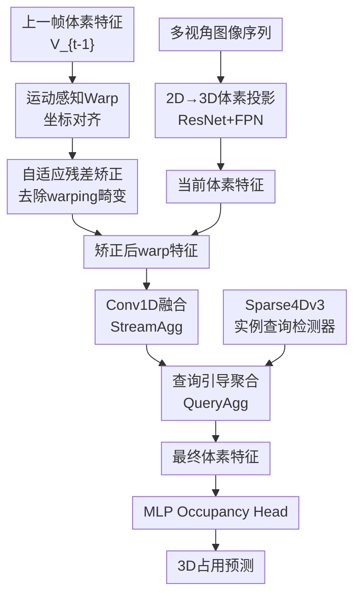

# StreamOcc: Streaming Dense Voxel Representations for 3D Occupancy Prediction

**会议**: ECCV 2026  
**arXiv**: [2503.22087](https://arxiv.org/abs/2503.22087)  
**代码**: 待确认  
**领域**: 自动驾驶  
**关键词**: 3D占用预测, 流式处理, 稠密体素, 动态目标建模, 时域融合  

## 一句话总结
StreamOcc首次将流式更新范式与稠密3D体素表示结合起来用于占用预测，通过矫正体素流式聚合（StreamAgg）和查询引导聚合（QueryAgg）分别解决warping畸变和动态目标特征退化两大难题，在83.3ms/帧的实时延迟和2.8GB显存占用下达到SurroundOcc和Occ3D-nuScenes上的SOTA性能。

## 研究背景与动机

基于视觉的3D占用预测是自动驾驶感知的核心任务之一，目标是将空间中的每个体素分类为静态物体（路面、人行道）、动态物体（车辆、行人）或自由空间，为下游规划提供稠密的三维场景理解。当前主流方法可分为两派：一派使用稠密体素表示来保留细粒度的3D空间细节，但每次推理需要一次性处理多帧历史体素特征，内存开销高达5-12GB、延迟166-1250ms，距离车载部署的要求相去甚远；另一派转向稀疏表示（稀疏体素流、高斯基元或压缩的BEV/tri-plane特征）来提升效率，但压缩本质上牺牲了空间保真度，在精细语义建模上存在天花板——尤其对远处的行人和被遮挡的车辆，稀疏表示往往只能给出模糊的轮廓。

流式范式近年已在3D目标检测和地图检测等稀疏预测任务中展现出强劲的时域处理效率：它不重复处理多帧输入，而是用上一帧递归传播的特征与当前帧特征做轻量级融合，在保持时域一致性的同时大幅节省计算。然而，将此范式扩展到稠密体素上的3D占用预测面临两个根本矛盾。其一，体素特征在帧间对齐时需要通过三线性插值进行warping来补偿自车运动，插值操作在物体边界处不可避免地引入畸变（数值弥散、边界模糊），这些畸变在递归累积中会被不断放大。其二，动态目标（车辆、行人）在图像到体素的投影过程中因运动错位、远距离时稀疏的像素投影、多目标重叠时的特征混合以及遮挡导致的投影截断，体素表征信息严重丢失——而恰恰是这些动态目标对自动驾驶的安全性最为关键。现有多帧融合的稠密方案因高开销难以实时部署，流式稀疏方案又丢失了稠密的空间精度，尚未有一条路径能同时获得稠密体素的精细度和流式范式的高效性。

本文的切入角度是：与其丢弃稠密体素的精度优势，不如直面上述两个挑战并分别设计针对性的聚合策略加以解决。**核心 idea：提出StreamOcc框架，将流式更新与稠密体素表示深度融合——用StreamAgg模块通过运动感知warping配合自适应残差矫正消除插值引入的畸变与语义漂移，用QueryAgg模块通过实例查询从图像空间提取动态目标语义并选择性地注入到对应的占据体素区域，在维持实时性能（83.3ms/帧、2.8GB显存）的同时大幅提升整体和动态目标的占用预测精度。**

## 方法详解

### 整体框架

StreamOcc是一个两阶段聚合的流式占用预测框架。第一阶段（StreamAgg）负责体素特征的递归时域融合与畸变矫正：当前帧多视角图像经ResNet-FPN提取2D特征后投影到3D体素空间得到当前体素特征；同时，上一帧传播而来的体素特征先通过运动感知warping对齐到当前自车坐标系，再经自适应残差矫正模块去除warping引入的畸变，最后与当前体素特征拼接并经Conv1D压缩融合，得到时域一致的聚合体素特征。第二阶段（QueryAgg）专攻动态目标增强：Sparse4Dv3检测器从图像空间生成实例查询，先通过体素→查询聚合将体素携带的空间几何信息注入查询以消除深度模糊，再通过动态查询聚合将查询中丰富的语义特征有选择地写回动态目标占据的体素区域，最终经MLP解码器输出稠密3D语义占用预测。

### 关键设计

**1. StreamAgg：带畸变矫正的流式体素时域聚合**

稠密体素特征的流式递归融合面临一个基础难题：特征传播时的ego-motion补偿依赖三线性插值来重采样上一帧体素特征，但插值必然引入边界模糊和数值弥散，且这些畸变会在递归累积中不断放大。StreamAgg的解决方案是在warping后插入一个"矫正网关"：首先通过自车运动变换矩阵将上一帧体素坐标映射到当前坐标系，用三线性插值得出粗对齐的warped特征；随后将warped特征送入自适应残差矫正模块执行精细修复；最后将修复后的warped特征与当前体素特征拼接，经Conv1D压缩为一通道数相同的体素特征作为当前帧的输出。这一设计的关键在于形成了"先对齐、再矫正、后融合"的三步流水——矫正被刻意放在warping和融合之间，确保进入下一帧递归循环的特征在送入之前已经完成规范化，从而切断畸变累积的传播链条。

**2. 自适应残差矫正：几何与语义双重监督引导的选择性畸变修复**

warping引入的畸变并非均匀分布在体素空间各处，而是集中于物体边界附近。针对这一特点，该模块采用了3D通道-空间注意力残差结构：warped特征先经过一个3D卷积瓶颈（压缩到C/4再扩张回C）生成矫正候选；然后在此候选上分别计算3D通道注意力权重 $M_c$ 和3D空间注意力权重 $M_s$，用 $M_s$ 作为软门控信号对矫正候选加权，再与原始warped特征做残差相加：

$$V_{refwarp} = \sigma(M_s) \odot (M_c \odot V_{out}) + V_{warp}$$

更精妙的是双重监督机制。训练时引入两个辅助分支：几何监督（Geometry Supervision）用二值占据掩码的BCE损失来监督 $M_s$，强迫空间注意力学会区分"占据区域 vs 自由空间"，从而将矫正资源聚焦到真正需要修复的占据区域；语义监督（Semantic Supervision）用当前帧的语义占用分布交叉熵损失来监督矫正后的特征 $V_{refwarp}$，确保其语义与当前场景对齐而非残留上一帧的信息。两个监督分支分别教会模型"注意哪里"和"产出什么"，推理时无需额外分支开销。

**3. QueryAgg：实例查询引导的动态目标定向增强**

体素特征的时域累积对静态场景（路面、建筑、植被）效果良好，但对动态目标（车、行人）严重不足——原因在于图像到体素的投影过程中，远距离小目标的像素投影极为稀疏、近距离多目标在粗体素网格中特征混合、遮挡导致投影不完整，这些信息损失是体素空间自身无法弥补的。QueryAgg引入了一个独立的"外部信息源"：用流式的Sparse4Dv3检测器从图像空间生成携带丰富语义的实例查询，然后分两步完成特征融合。第一步是体素→查询聚合（V2Q）：通过可变形注意力让查询在StreamAgg输出的体素特征上采样几何上下文信息，帮助消除因深度模糊产生的假阳性查询。第二步是动态查询聚合（DQA）：只筛选置信度高于0.3的实例查询，对每个体素检查其是否落在某个查询的预测包围盒内，若命中则通过交叉注意力将查询特征加权聚合到该体素，由可学习门控 $g_i$ 控制注入强度；若未命中则保持原特征不变，确保静态区域不受干扰：

$$\mathbf{V}_{DQA}^i = \begin{cases} \mathbf{V}_{S.A}^i, & \mathcal{N}^i = \emptyset \\ \mathbf{V}_{S.A}^i + \mathbf{g}^i \odot \mathbf{z}^i, & \text{otherwise} \end{cases}$$

训练时的查询选择策略还特别考虑了小目标IoU不可靠的问题，对大目标用IoU+置信度筛选，对小目标改用几何偏差（中心距离+尺寸偏差）加置信度筛选。

### 损失函数 / 训练策略

总损失函数包含六个加权项：BEVDepth的深度损失 $\mathcal{L}_{depth}$、占用预测交叉熵损失 $\mathcal{L}_{occ}$、Sparse4Dv3检测损失 $\mathcal{L}_{det}$、Auxiliary Mask Decoder的掩码损失 $\mathcal{L}_{mask}$、语义监督分支的交叉熵损失 $\mathcal{L}_{sem}$、几何监督分支的二值交叉熵损失 $\mathcal{L}_{geo}$。权重经验设置：$\lambda_{occ}=10.0$, $\lambda_{sem}=10.0$, $\lambda_{geo}=10.0$, $\lambda_{det}=0.2$, $\lambda_{mask}=1.0$, $\lambda_{depth}=0.05$。使用AdamW优化器，输入图像256×704，ResNet-50骨干，初始学习率 $2\times 10^{-4}$，批大小8，Occ3D-nuScenes上训练24个epoch，SurroundOcc上20个epoch。

## 实验关键数据

### 主实验

在Occ3D-nuScenes上与实时方法的对比（延迟~100ms以内，A100 GPU测量）：

| 方法 | Backbone | mIoU | mIoUD | 延迟(ms) | 显存(MB) |
|------|----------|------|-------|----------|----------|
| ViewFormer | ResNet-50 | 39.6 | 33.3 | 102.0 | 3,103 |
| FB-OCC | ResNet-50 | 39.1 | 34.3 | 97.1 | 9,632 |
| GSD-Occ | ResNet-50 | 39.4 | 35.1 | 50.0 | 4,759 |
| ALOcc-mini | ResNet-50 | 40.6 | 35.6 | 33.1 | 2,577 |
| **StreamOcc** | ResNet-50 | **41.9** | **38.1** | 83.3 | 2,788 |

在SurroundOcc-benchmark上（RTX 4090测量）：mIoU 23.4（vs 第二GaussianWorld 21.9），mIoUD 21.0（vs 19.0），IoU 33.8（vs 33.0），延迟84ms，显存2,788MB（GaussianWorld的2.5倍更省）。

### 消融实验

| 配置 | mIoU | mIoUD | 延迟(ms) | 显存(MB) |
|------|------|-------|----------|----------|
| 单帧基线 | 36.8 | 32.6 | - | - |
| + StreamAgg | 40.4 | 35.4 | 49.0 | 2,437 |
| + StreamAgg +检测头（间接监督） | 40.8 | 36.3 | - | - |
| + StreamAgg + QueryAgg（完整） | **41.9** | **38.1** | 83.3 | 2,788 |

自适应残差矫正内部消融：Naive streaming 38.72 → +残差矫正（无监督）39.84 → +语义监督40.25 → +几何监督40.37，各步增益互补，总延迟仅+5ms/+14MB。查询选择策略消融：仅IoU 39.9 → +置信度41.3 → +小目标几何约束41.9。

### 关键发现

- StreamAgg是最大的单点贡献者（+3.6 mIoU），证明了warping畸变矫正是流式稠密体素生效的必要前提
- 间接监督（加检测头）对动态目标提升有限（+0.9 mIoUD），QueryAgg的直接实例特征注入带来质的飞跃（+2.7 mIoUD）
- 与全局空间交叉注意力方案（将图像特征无差别扩散到全体素，显存暴增至3,554MB）相比，QueryAgg的定向注入策略在更少显存（2,788MB）下取得mIoUD更高+2.35个点的提升，同时消除了全局注意力中因体素-图像空间错位产生的幻觉映射
- 在RayIoU评估（沿射线的一致性度量）上StreamOcc达到41.1，在1m/2m/4m深度阈值下均全面领先其他实时方法

## 亮点与洞察

- **流式+稠密体素的首次成功结合**：此前流式范式只用于目标检测和地图检测等稀疏预测任务，本文用双重聚合策略证明稠密体素的高精度和流式的高效性可以兼得，为占用预测的效率优化开辟了新方向
- **双重监督的矫正模块设计精巧**：几何监督教模型"注意哪里"，语义监督教模型"产出什么"，分工明确、训练时配合、推理时零开销，是典型的"教模型学会关注什么"而非"给更多数据"的训练策略创新
- **"少即是多"的定向注入设计思路**：QueryAgg只对动态目标区域做特征注入而非全局扩散，既避免了图像-体素空间错位导致的幻觉映射又节省了计算量，这一思路可迁移到其他多模态特征融合任务（如BEV感知中的时序融合、多相机特征聚合）
- **查询选择策略兼顾大小目标**：大目标用IoU、小目标用几何约束的分辨率感知筛选，避免了单一指标对远处小目标的失效，细节处理扎实

## 局限与展望

- 依赖独立的检测器（Sparse4Dv3）生成实例查询，增加了系统复杂度，且训练时需要3D检测标注（包围盒），无法在仅有语义占用标注的数据上独立训练
- 两阶段设计（先StreamAgg再QueryAgg）限制了端到端联合优化的潜力，两个聚合模块的交互仅通过单向特征传递
- 实验仅在nuScenes及其衍生数据集上进行，未在更丰富的场景（夜间、雨雪、不同传感器配置）上验证泛化性
- 体素网格分辨率固定0.4m/0.5m，对远处极小目标的建模能力仍受限于离散化粒度

## 相关工作与启发

- **vs COTR/PanoOcc等稠密多帧方法**：COTR使用多帧拼接加空间交叉注意力做稠密体素融合，精度最高但延迟超1s、显存超10GB，完全不具备部署可行性；StreamOcc用流式将计算开销降低一个数量级，在效率-精度帕累托前沿上跨出了实质性一步
- **vs GaussianWorld/ViewFormer等稀疏流式方法**：这些方法将场景压缩为高斯基元或BEV特征来适配流式范式，但压缩本身丢失了稠密3D细节；StreamOcc证明流式与稠密并非不可兼容，关键在解决好warping和动态目标两个痛点的设计
- **vs ALOcc-mini等实时方法**：ALOcc-mini以33ms超低延迟达到40.6 mIoU，但动态目标仅35.6；StreamOcc尽管延迟稍高（83ms），但在动态目标上拉开2.5个点的差距，这对自动驾驶安全来说意义重大
- **vs 全局交叉注意力的图像-体素融合**：传统方案（COTR、OccFormer、GEOcc）用空间交叉注意力将图像特征无差别扩散到全体素，计算量大且易产生幻觉；QueryAgg只聚焦动态目标的定向注入思路更高效精准

## 评分
- 新颖性: ⭐⭐⭐⭐⭐ 首次成功将流式范式与稠密体素结合用于3D占用预测，两个针对性的聚合策略设计均有启发性
- 实验充分度: ⭐⭐⭐⭐⭐ 在两个benchmark上与10+种方法对比，消融实验覆盖每个模块和设计选择，无缺失之处
- 写作质量: ⭐⭐⭐⭐⭐ 问题动机清晰，方法叙述有条理，消融设计层层递进，辅助材料中补充了大量实验细节
- 价值: ⭐⭐⭐⭐⭐ 在精度-效率权衡上取得了实质性突破，使稠密体素占用预测从不可部署变为接近实时可行，推动了占用预测向实际应用迈进

<!-- RELATED:START -->

## 相关论文

- [\[CVPR 2025\] GaussianWorld: Gaussian World Model for Streaming 3D Occupancy Prediction](../../CVPR2025/autonomous_driving/gaussianworld_gaussian_world_model_for_streaming_3d_occupancy_prediction.md)
- [\[ICLR 2026\] S2GO: Streaming Sparse Gaussian Occupancy](../../ICLR2026/autonomous_driving/s2go_streaming_sparse_gaussian_occupancy.md)
- [\[CVPR 2026\] ProOOD: Prototype-Guided Out-of-Distribution 3D Occupancy Prediction](../../CVPR2026/autonomous_driving/proood_prototype-guided_out-of-distribution_3d_occupancy_prediction.md)
- [\[ECCV 2026\] ExploreVLA: Dense World Modeling and Exploration for End-to-End Autonomous Driving](explorevla_dense_world_modeling_and_exploration_for_end-to-end_autonomous_drivin.md)
- [\[ECCV 2026\] FLM-Occ: Feed-forward Likelihood Maximization for Efficient Indoor Occupancy Prediction](flm-occ_feed-forward_likelihood_maximization_for_efficient_indoor_occupancy_pred.md)

<!-- RELATED:END -->
