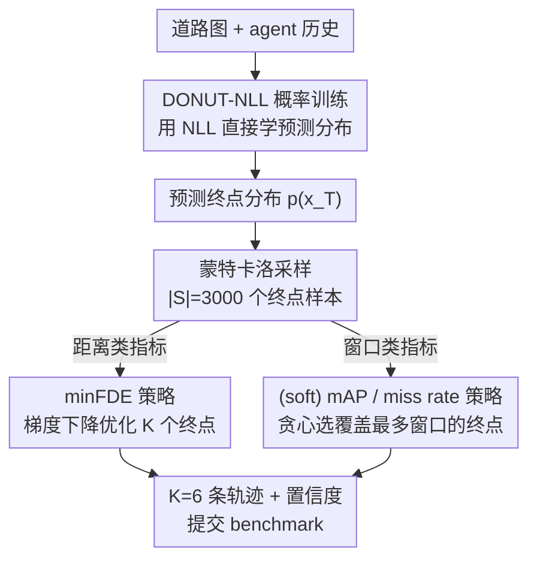

# Towards Metric-Agnostic Trajectory Forecasting

**会议**: ECCV 2026  
**arXiv**: [2607.01133](https://arxiv.org/abs/2607.01133)  
**代码**: [https://vision.rwth-aachen.de/TraDiE-policies](https://vision.rwth-aachen.de/TraDiE-policies)  
**领域**: 自动驾驶 / 轨迹预测  
**关键词**: 轨迹预测, 预测分布, 评测指标解耦, 采样策略, 概率训练

## 一句话总结
本文主张轨迹预测应该只学一个「校准良好的预测分布」，把 minFDE / soft mAP 这些互相打架的指标当成下游任务，用一组免重训的采样策略（TraDiE policies）在评测时从同一个分布里挑出每个指标各自最优的 K 条轨迹，从而让单个 DONUT-NLL 模型在 Waymo 上同时刷到距离类和窗口类指标的 SOTA。

## 研究背景与动机
轨迹预测是自动驾驶感知-决策链条里的核心一环：给定道路图和周围交通参与者的历史状态，模型要为每个 agent 预测 K 条（通常 K=6）未来轨迹并各配一个置信度，理想情况下这 K 条轨迹应该忠实反映未来的多模态不确定性。然而作者观察到一个尴尬的现实——当前 SOTA 模型几乎都在「为指标而训练」。跑 Argoverse 2 的方法，因为主指标 Brier-minFDE 只看终点距离，就用 winner-takes-all（WTA）把离真值最近的那条模式往 ground truth 上怼，训练损失几乎是 minFDE 的翻版；跑 Waymo 的方法，因为主指标是 soft mAP、看的是对未来空间的覆盖度，就输出 64 条候选再用非极大值抑制（NMS）把挤在一起的终点打散，甚至把 NMS 半径做成随速度变化以逼近 Waymo 那个「随速度改变大小的矩形窗口」。有的工作干脆训好几个模型分别刷不同指标。

问题在于，这两类指标奖励的是互相冲突的行为：距离类指标只要有一条轨迹压中真值就给高分，于是鼓励模型把预测往主模式上「抱团」，哪怕冗余；窗口类指标在乎覆盖，一个窗口里只有置信度最高的那条算命中、其余要么被忽略（soft mAP）要么被当假阳性惩罚（mAP），于是鼓励模型把预测「摊开」。抱团有利 minFDE 却损害覆盖，摊开有利 mAP / miss rate 却拉高距离误差——同一个模型不可能两头讨好。更深一层的麻烦是，这些 benchmark 指标压根不直接评价模型的预测分布本身，于是我们既分不清一个提升到底来自「预测得更好」还是「指标调得更狠」，模型也因为和特定评测协议死死绑定而难以迁移到新场景。

本文的切入角度是把「训练目标」和「评测指标」彻底解耦：训练时只让模型输出一个校准良好、忠实表达不确定性的预测分布——这是最通用的表示；到了评测环节，再把「针对某个指标挑 K 条轨迹」当成施加在这个分布上的后处理。**核心 idea 是：用「指标无关」的概率目标（负对数似然）训练模型去学好预测分布，然后为 minFDE、(soft) mAP、miss rate 各设计一个基于蒙特卡洛采样的评测策略（TraDiE policy），在不重训模型的前提下从同一个分布里导出每个指标各自最优的 K 条轨迹与置信度。** 如果分布本身校准得好，这套策略在任意指标下都能挖出好成绩；反过来，若分布没学好，策略反而会把这个「失准」暴露出来。

## 方法详解

### 整体框架
本文要解决的是「模型被评测指标绑架、无法用一个分布同时应付多种指标」的问题。整体思路分两半：训练侧把 DONUT 原来那个 WTA 距离损失换成直接优化混合分布的负对数似然（NLL），让模型专心学一个校准良好的预测分布，得到 DONUT-NLL；评测侧则针对每个 benchmark 指标各写一个 TraDiE policy，从模型输出的（终点）分布里蒙特卡洛采样一批点，再按该指标的定义把 K 条轨迹和置信度「解出来」。关键是——训练一次、分布一份，minFDE 用距离策略、soft mAP / mAP / miss rate 用窗口策略，全靠评测时切换策略实现，模型权重完全不动。作者进一步把分布族（Laplace / 广义高斯 / 高斯尺度混合）也当成一个可自由探索的设计维度，最终发现广义高斯最合拍。

### 关键设计

**1. 指标无关的概率训练目标：把 WTA 距离损失换成直接优化分布的 NLL**

DONUT 原版为了刷 Argoverse 2 的距离指标，用的是 WTA：先按平均欧氏距离选出离真值最近的那条模式 $k_n^*$，只对它做负对数似然优化，这等于把训练损失做成了 minFDE 的镜像——好处是终点压得准，坏处是模式挤成一团、窗口类指标惨不忍睹（原生 DONUT 搬到 Waymo，soft mAP 极差）。本文的做法是干脆不选「赢家」，而是让整个混合分布对着真值做完整的 NLL。作者给出两个变体：Traj-NLL 让混合权重 $\pi_{nk}$ 在所有时间步共享，即每个分量 $k$ 对应一条完整的轨迹假设：

$$-\log p(\bm{Y})=-\sum_{n}\log\sum_{k=1}^{K}\pi_{nk}\prod_{t=1}^{T}p_{nkt}(\bm{y}_{nt})$$

Step-NLL 则更激进，给每个时间步单独定义一套权重 $\pi_{nkt}$，让不同模式在不同时刻的重要性可以此消彼长，表达力更强（代价是削弱了时间步之间的隐式耦合）。这么改之所以有效，是因为 NLL 逼着模型如实建模「未来到底有多不确定」，而不是投机取巧地把点堆到真值附近；实验也证实一旦配上后面的策略，直接优化分布的 NLL 全面碾压优化替代指标的 WTA。

**2. minFDE 距离策略：从分布里采样、用梯度下降摆好 K 个终点**

距离类指标 minFDE 只看「K 个预测终点里离真值最近的那个有多近」。本文把它形式化成一个在预测分布下的期望——给定终点分布 $p_{nT}$，要找的 K 个终点应当最小化 $\mathbb{E}_{\bm{x}_{nT}\sim p_{nT}}[\min_k\|\hat{\bm{x}}_{nkT}-\bm{x}_{nT}\|_2]$，即「假设真值就是从模型分布里抽出来的，这组终点的期望 minFDE」。由于闭式解不好求，作者从分布里蒙特卡洛采样 $|S|=3000$ 个终点近似这个期望，然后把 K=6 个待求终点当成自由变量，直接用 Adam 做 300 步梯度下降去最小化经验目标，还换 10 个随机初始化取最优。这套做法的妙处在于它「直接扣着指标定义优化」，不掺任何模型特定的启发式；也正因如此，它成了一面照妖镜——若分布失准（如后文 QCNet），策略挑出来的终点在真实数据上反而糟糕，失准就藏不住了。

**3. (soft) mAP / miss rate 窗口策略：贪心挑「覆盖最多窗口」的终点**

窗口类指标要的是覆盖：在真值终点周围放一个（Waymo 用随朝向和速度变化的矩形）窗口，只有落进窗口且置信度最高的那条算真阳性。计算全局最优 AP 很难（依赖跨所有 agent、所有场景的全局排序），作者退而设计一个逐 agent 的启发式：先从预测分布采一批候选终点、给每个候选关联一个评测窗口，然后贪心地一个个挑「被最多窗口覆盖」的终点，且每挑一个就把已命中的窗口划掉、后续不再重复计入。由于推理时真值终点不可得，就用分布采样样本 $\tilde{\bm{x}}_{nT}$ 代替真值来估计「某个终点成为真阳性的概率」$\overline{\text{TP}}_{nk}$，选终点时取

$$\hat{\bm{x}}_{nkT}^{\text{pos}}=\operatorname*{arg\,max}_{\bm{x}_{nT}\in S}\overline{\text{TP}}_{nk}(\bm{x}_{nT}^{\text{pos}})$$

并把这个概率直接当作该终点的置信度。这套贪心恰好和提升 AP 的三个诉求天然对齐：优先挑最可能当「最高置信真阳性」的点，能让真阳性在全局排序里更靠前、提升各阈值下的精度；它本身就是最大覆盖问题的标准贪心近似，多覆盖未命中的窗口就减少漏检、提升召回；而「已命中窗口不再重复计」自动避免了把多条预测塞进同一窗口的浪费。由于 miss rate 的最优策略同样是「让 K 个终点覆盖尽可能多的窗口」（最大化 $\sum_k\overline{\text{TP}}_{nk}$），这同一个窗口策略对 soft mAP、mAP、miss rate 三者通用。

**4. 位置分布族选型：广义高斯优于 Laplace 和高斯尺度混合**

既然评测已经和训练解耦，用什么分布来表达 agent 位置就变成了一个可以系统比较的设计选择。DONUT 原版用 1D Laplace，本文把它当可插拔组件，对比了广义高斯和 J=5 的高斯尺度混合。广义高斯多了一个形状参数 $\beta$（$\beta=1$ 退化为 Laplace、$\beta=2$ 退化为高斯），密度形状更灵活。有意思的是「裸评测」和「策略评测」偏好的分布不一样：裸评测下 Laplace 因为峰更尖、逼着模式贴近真值终点，minFDE 最好；高斯尺度混合更平滑更宽、覆盖更好，裸 soft mAP 最好。但一旦施加策略，广义高斯在所有指标上都稳定胜出——说明它那点额外的形状自由度真正帮模型学到了一个「更校准、更容易被下游策略榨取」的预测分布，而不是恰好迎合某个裸指标。

### 损失函数 / 训练策略
DONUT-NLL 沿用 DONUT 的架构与大部分训练超参，仅替换损失为 Traj-NLL 或 Step-NLL。一个有价值的改动是把位置的 1D 分布从「对齐全局 x/y 轴」改成「对齐 agent 局部的纵向(lg)/横向(lt)方向」（用预测的平均朝向来旋转），让位置不确定性更贴合运动学；朝向仍用 von Mises 分布建模。策略侧的关键超参：所有蒙特卡洛集用 $|S|=3000$ 个样本；minFDE 策略用 Adam 跑 300 步、学习率 0.2、重复 10 次取最优。Waymo 在 3s/5s/8s 三个时域分别评测再平均，作者对三个时域各自跑策略，再按每个时域内置信度的排名把同名次的终点配成一条轨迹，并用 8s（最长、最难、最有信息量的时域）的置信度作为整条轨迹的置信度。

## 实验关键数据

### 主实验
在 Waymo motion prediction benchmark（约 48.7 万训练场景，K=6，8s 时域）上评测。核心表格是训练目标对比（Waymo val，箭头 → 表示「施加策略前 → 后」）：

| 训练目标 | Soft mAP ↑ | mAP ↑ | Miss rate ↓ | minFDE ↓ |
|--------|------|------|----------|------|
| WTA | 0.3427 → 0.4764 | 0.2995 → 0.4736 | 0.1310 → 0.1044 | 1.0520 → 1.0824 |
| Traj-NLL | 0.3401 → 0.4921 | 0.2851 → 0.4892 | 0.1286 → 0.0946 | 1.0874 → 1.0374 |
| Step-NLL | 0.3595 → **0.5082** | 0.3163 → **0.5053** | 0.1444 → **0.0902** | 1.2236 → **1.0200** |

两个 NLL 变体施加策略后所有指标大幅改善，其中 Step-NLL 在四项上全面领先。注意 WTA 施加距离策略后 minFDE 反而从 1.0520 退到 1.0824——因为 WTA 直接优化 minFDE 而非校准分布，策略在这个失准分布上找不到真正好的终点，恰好印证「策略暴露失准」。

和 SOTA 对比（Waymo test），单个 DONUT-NLL（Step-NLL + 广义高斯）用两套策略：

| 模型 | Soft mAP ↑ | mAP ↑ | Miss rate ↓ | minFDE ↓ |
|------|------|------|----------|------|
| IMPACT (e2e) | 0.4434 | 0.4253 | 0.1274 | 1.0497 |
| ModeSeq | 0.4487 | 0.4450 | 0.1244 | 1.0836 |
| IMPACT (集成) | 0.4801 | 0.4598 | 0.1087 | 1.1295 |
| DONUT-NLL（窗口策略） | **0.5018** | **0.4987** | **0.0900** | 1.3280 |
| DONUT-NLL（距离策略） | 0.1649 | 0.1135 | 0.1199 | **1.0304** |

同一份权重，窗口策略下 soft mAP / mAP / miss rate 甚至超过集成方法，距离策略下 minFDE 优于 IMPACT(e2e) 且参数量约少 5 倍——现有方法通常只能在一类指标上强，本文是「一个模型两头都 SOTA」。

### 消融实验
位置分布对比（Step-NLL，Waymo val，→ 为策略前后）：

| 位置分布 | Soft mAP ↑ | mAP ↑ | Miss rate ↓ | minFDE ↓ | 说明 |
|------|------|------|----------|------|------|
| Laplace | 0.3595 → 0.5082 | 0.3163 → 0.5053 | 0.1444 → 0.0902 | 1.2236 → 1.0200 | DONUT 原生分布 |
| Scale Mixture | 0.3837 → 0.5053 | 0.3533 → 0.5024 | 0.1492 → 0.0909 | 1.2722 → 1.0218 | 裸 soft mAP 最好 |
| Gen. Gaussian | 0.3759 → **0.5101** | 0.3439 → **0.5070** | 0.1561 → **0.0876** | 1.3127 → **1.0103** | 策略后全指标最优 |

跨模型可迁移性（MTR / QCNet，Waymo val）：MTR 施加策略后所有指标稳定改善、甚至超过它原生的 NMS 后处理，换损失影响很小；QCNet 则在距离策略下 minFDE 从 1.2254 崩到 2.2805。

### 关键发现
- Step-NLL 是全场最优训练目标，但只有在施加策略后才显现——裸评测下 minFDE 反而是 WTA 最好。这说明「优化分布」和「优化指标」偏好的设计选择根本不同：分布视角下 WTA 是次优解。
- 策略是一把「分布校准诊断仪」。QCNet 的 Laplace 按最后历史朝向定向，在弯道上会和未来运动方向错位，模型只好把不确定性膨胀成近圆形来补偿，导致 minFDE-最优终点被摊得很散——距离策略把这个失准直接放大成崩溃的 minFDE，而窗口指标因主质量仍集中在各模式附近受影响较小。
- 广义高斯的形状自由度真正转化为更校准的分布：它在裸指标上都不是最好，却在策略后全指标夺冠，说明收益来自分布质量而非迎合某个裸指标。

## 亮点与洞察
- 「训练学分布、评测挑轨迹」的解耦范式很干净：把一直被当作训练目标的 benchmark 指标降级为评测时的后处理，一举解决了「距离 vs 覆盖」两类指标互相冲突、逼得研究者训多个模型的老大难。这个 mindset 可迁移到任何「评测指标和真实目标不完全一致」的任务。
- 策略即诊断器是最「啊哈」的一点：同一套策略既能榨出好成绩，又能在分布失准时放大缺陷（QCNet 的 minFDE 崩盘），把「benchmark 分数高」和「分布真的好」这两件长期被混为一谈的事分开了。
- minFDE 策略把「选 K 个终点」直接写成可微目标用梯度下降解，窗口策略借最大覆盖问题的贪心近似，两者都严格扣着指标定义、不掺模型特定 trick，因而 model-agnostic——换到 MTR 上开箱即用还超过其原生 NMS。

## 局限与展望
- 作者承认最大代价是评测时的额外算力：minFDE 策略每场景约 0.26s、(soft) mAP 约 0.03s。策略只为评测设计、非部署到车上的规划栈组件，本文也未针对效率优化；真要落地需在质量与效率间显式权衡。
- 结果只在 Waymo 上成立。Argoverse 2 的初步实验显示 Step-NLL 容易过拟合（可能因逐步混合权重带来额外自由度），泛化性存疑。
- minFDE / mAP 策略产出的终点在时间上不连续（作者按时域拼接、中间步靠插值补），需要 K 条连续最优轨迹的下游控制/规划不能直接用这些策略——但作者的立场是「给定校准分布，下游任务可各自定义策略」。
- 当前策略只处理终点边缘分布、聚焦单 agent；扩展到多 agent 联合预测、以及做连续性感知的目标，是作者列出的未来方向。

## 相关工作与启发
- **vs HOME**: HOME 也做了「先学终点分布（稠密热图）、再对每个指标后处理」的解耦，但它的后处理死死绑定自己那套离散终点表示、且掺了模型特定启发式（如 minFDE 用改造版 k-means、miss rate 用 1.8m 而非标准 2m 窗口以压低自家分数）。本文的策略是采样式、直接从指标定义推导，能套到任意概率预测器上，且严格用标准窗口参数——把「分数差异」归因到分布质量而非策略里藏的超参。
- **vs WTA 系（DONUT / QCNet / HiVT 等距离类方法）**: 它们用 winner-takes-all 只优化最近模式，等于训练损失就是 minFDE 的替代，导致模式抱团、窗口指标差。本文用 NLL 优化整个分布，配策略后 minFDE 也不输、其余指标全面反超。
- **vs NMS 系（MTR / MTR++ / RMP-YOLO 等窗口类方法）**: 它们输出 64 条候选靠 NMS 打散终点以迎合 soft mAP，甚至把 NMS 半径做成随轨迹长度变化去逼近 Waymo 窗口，但会牺牲 minFDE。本文不改训练做覆盖，而是让窗口策略在推理时从分布里挑覆盖最优的终点，同一分布也能切到距离策略刷 minFDE。
- **vs ModeSeq**: ModeSeq 把训练准则精确对齐窗口指标的命中定义（early-match-takes-all），进一步把模型往 benchmark 目标上偏。本文反其道而行，主张远离指标特定训练、回到建模完整预测分布。

## 评分
- 新颖性: ⭐⭐⭐⭐⭐ 把「指标当下游任务、训练只学分布」提成一个范式转变，并给出可操作的采样策略，视角新且能落地。
- 实验充分度: ⭐⭐⭐⭐ Waymo 上训练目标/分布族消融扎实、跨 MTR/QCNet 验证可迁移性，但仅限 Waymo，Argoverse 2 已暴露过拟合。
- 写作质量: ⭐⭐⭐⭐⭐ 动机层层递进、指标冲突分析透彻，策略推导和「策略即诊断器」的论证清晰有力。
- 价值: ⭐⭐⭐⭐⭐ 单模型两类指标同时 SOTA，且为社区提供了「用分布质量而非指标调参评价预测器」的新协议，实践与方法论价值兼具。

<!-- RELATED:START -->

## 相关论文

- [\[CVPR 2025\] Trajectory Mamba: Efficient Attention-Mamba Forecasting Model Based on Selective SSM](../../CVPR2025/autonomous_driving/trajectory_mamba_efficient_attention-mamba_forecasting_model_based_on_selective_.md)
- [\[ECCV 2026\] Rethinking Training & Inference for Forecasting: Linking Winner-Take-All back to GMMs](rethinking_training_inference_for_forecasting_linking_winner-take-all_back_to_gm.md)
- [\[ECCV 2026\] Unveiling Transferability in Trajectory Prediction via Latent Scene Embeddings](unveiling_transferability_in_trajectory_prediction_via_latent_scene_embeddings.md)
- [\[ICCV 2025\] Future-Aware Interaction Network For Motion Forecasting](../../ICCV2025/autonomous_driving/future-aware_interaction_network_for_motion_forecasting.md)
- [\[AAAI 2026\] Generalising Traffic Forecasting to Regions without Traffic Observations](../../AAAI2026/autonomous_driving/generalising_traffic_forecasting_to_regions_without_traffic_observations.md)

<!-- RELATED:END -->
