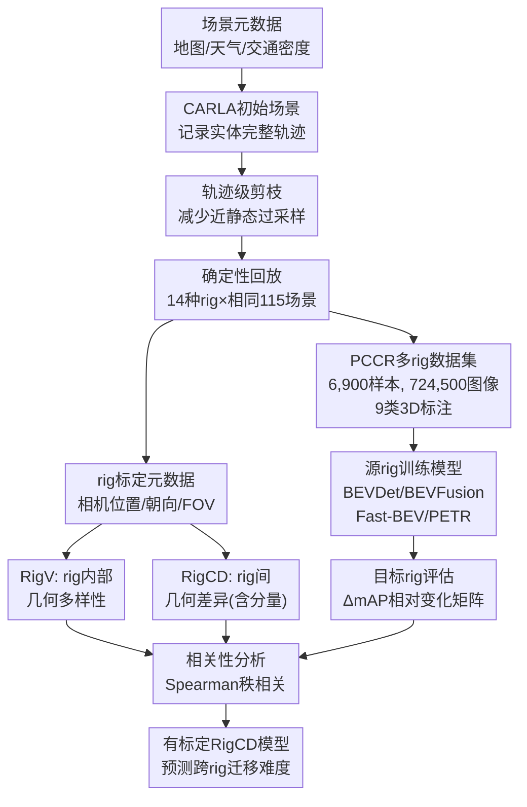

# Understanding Cross-Rig Generalization in Automotive Perception: a Multi-Rig Benchmark and Rig Variation Metrics

**会议**: ECCV2026  
**arXiv**: [2606.27554](https://arxiv.org/abs/2606.27554)  
**项目页**: https://badertim.github.io/plentiful-carla-camera-rigs/  
**代码**: 暂无  
**领域**: 自动驾驶  
**关键词**: 相机布置, 跨传感器泛化, 基准数据集, 自动驾驶感知, 三维目标检测

## 一句话总结

本文构建了包含14种系统变化的相机布局的仿真基准PCCR，提出Rig Variance和Rig Contrastive Distance两个基于标定参数的几何描述子，实验表明相机平移差异是跨rig泛化性能下降的主导因素，RigCD可预测不同布局间的迁移难度排序，Spearman秩相关最高达0.80。

## 研究背景与动机

基于视觉的自动驾驶感知系统通常在固定的传感器配置下开发和评测——训练和部署时要求特定数量的相机、固定的安装位置和朝向。然而真实世界的车辆编队是高度异构的：不同车型的包装约束、成本目标和代际更新导致相机安装位置、视野重叠角度、FOV甚至是相机数量都存在显著差异。这种从固定配置到异构编队的转变引入了一个特殊的domain gap——称之为cross-rig domain gap——其独特之处在于只有几何观测过程在变化，而场景内容本身保持不变。这意味着性能下降纯粹来自视角分布、覆盖范围和冗余程度的变化，不涉及光照、天气、场景类别等传统domain shift混杂因素。

为什么这个问题之前没有被系统研究？有两个根本原因。第一，现有自动驾驶数据集（nuScenes, Waymo）均采用固定相机布局，无法支持跨rig分析；跨数据集的评测则混淆了rig变化与场景统计差异，无法单独归因。第二，之前的研究要么只测试少量rig变体（如Embacher等人对两种车型的改装），要么局限于单rig的视角微扰，没有覆盖rig设计空间的完整谱系。仿真环境CARLA提供了一条可行的路径：它可以在保持场景内容完全一致的前提下任意改变相机标定参数，从而隔离出rig几何变化对感知性能的真实影响。同时，如果能够仅从标定元数据就预测跨rig迁移的难度，就可以在部署新rig前快速评估风险，无需耗费大量资源训练和评估模型。

基于这一思路，本文的核心贡献有两个层面。在数据层面，构建了Plentiful CARLA Camera Rigs（PCCR）基准，包含14种系统性设计的相机布局，对115个相同驾驶场景分别渲染，得到724,500张图像和完整的3D标注。在分析层面，提出了两个仅依赖标定元数据的几何描述子——Rig Variance（衡量单个rig内部的相机多样性）和Rig Contrastive Distance（量化两个rig之间的几何差异），标定其权重使之能预测跨rig性能下降的排序。**核心idea：通过场景一致的多rig仿真基准将rig几何效应从环境混淆中分离出来，并首次证明仅靠标定元数据就能以Spearman ρ=0.80的准确率预测不同相机布局间的感知迁移难度。**

## 方法详解

### 整体框架

本文的方法由两部分构成：PCCR多rig基准的构建管线，以及基于标定元数据的rig几何描述子框架。基准构建从全局元数据配置（地图、天气、交通密度、rig规格）出发，采样场景描述子后初始化CARLA仿真环境并记录所有实体的完整轨迹，进行轨迹级剪枝以减少近静态ego行为过采样，最后用确定性回放保证14种rig观测到完全相同的场景动态。标定描述子方面，对每个rig提取相机位置/朝向/FOV作为元数据，计算RigV描述rig内部多样性，计算RigCD量化rig间差异；然后在受控rig变体上用L-BFGS-B标定RigCD各分量的权重，使RigCD与实测跨rig性能下降的Spearman秩相关最大化。

### 关键设计

**1. PCCR基准：系统性控制变量的多rig仿真数据集**

现有基准要么固定rig（nuScenes, Waymo），要么跨数据集评估但场景不控制。本文的核心设计思路是在同一套115个场景上渲染14种不同的rig，从而消除场景内容对跨rig分析的干扰。14种rig分两个家族：受控变体系列（R1及其5个变体R1-r旋转、R1-t平移、R1-f FOV、R1-c6少相机、R1-c10多相机）每次只改变一个几何因子，用于受控消融分析；多样化rig系列（R2-R9）覆盖SUV、跑车、消防车、EU HGV等不同车型的典型布局，包括不同相机数量（4-10个）、FOV混合（65°-120°）和安装位置（保险杠、挡泥板、挡风玻璃、后视镜、车顶），用于评估泛化性。数据生成采用两阶段管线避免非确定性干扰：第一阶段在有动态交通的场景里记录所有实体的完整运动轨迹，第二阶段按轨迹确定性回放——这保证了不同rig对同一批场景的观测内容在时间和空间上是像素级对齐的。轨迹剪枝根据ego车辆平均速度分箱降采样，减少近静态行为的过表示。标注包含9类（轿车、卡车、公交、摩托车、自行车、成人、儿童、交通标志、交通灯），范围为ego周围80米，仅标注各rig实际可见的目标，避免ill-posed标签。

**2. RigV：单rig内部几何多样性描述子**

Rig Variance的目标是用一个标量刻画单个相机布局的"内部丰富程度"——相机之间空间分布越分散、朝向差异越大、FOV越多样化，RigV越高。每个相机$\mathbf{c}_i$用位置$\mathbf{t}_i\in\mathbb{R}^3$、朝向$\mathbf{r}_i\in SO(3)$和FOV $f_i$表示。RigV计算rig内每对相机的归一化差异后取平均：$\text{RigV} = \frac{1}{N(N-1)}\sum_{i\neq j}(\lambda_t\Delta t_{ij}+\lambda_r\Delta r_{ij}+\lambda_f\Delta f_{ij})$，其中平移、旋转、FOV三个分量使用该rig内的最大成对值归一化（如$\Delta t_{ij}=\|\mathbf{t}_i-\mathbf{t}_j\|_2 / D_{\max}$），确保各分量量纲一致于$[0,1]$。高RigV的rig（如R5的四摄120°宽视野、R6的消防车9摄布局）内部多样性高、覆盖范围广，但实验中观察到从高RigV rig训练出的模型跨rig泛化方差更小——提示训练rig的内部多样性一定程度上促进了跨rig鲁棒性。

**3. RigCD：双rig间几何差异描述子**

Rig Contrastive Distance量化两个rig间的几何差异，用于预测从源rig迁移到目标rig时的性能下降程度。核心挑战在于两个rig的相机数量可能不同（4到10不等），且不存在天然的相机对应关系。RigCD的解法分两步：首先对两个rig的相机集合构建代价矩阵（每个跨rig相机对的加权平移$\|\mathbf{t}_i^A-\mathbf{t}_j^B\|_2$、测地旋转距离$d_R(\mathbf{r}_i^A,\mathbf{r}_j^B)$和FOV绝对差$|f_i^A-f_j^B|$），然后用匈牙利算法计算最优二分图匹配，将匹配的$M$对相机间的平均差异作为匹配项$\text{RigCD}_{\text{match}}$；同时对相机数量的差异施加归一化惩罚$\text{RigCD}_{\text{count}} = |N_A-N_B|/\max(N_A,N_B)$。最终RigCD是两项的加权和：$\text{RigCD}(A,B) = \alpha\,\text{RigCD}_{\text{match}}(A,B) + (1-\alpha)\,\text{RigCD}_{\text{count}}(A,B)$。该描述子还可分解为分量版本$\text{RigCD}_t/\text{RigCD}_r/\text{RigCD}_f/\text{RigCD}_{\text{count}}$，独立考察各几何维度的影响。

**4. 跨rig评估协议与RigCD标定框架**

评估协议定义了一个完整的$9\times9$跨rig迁移矩阵：模型在源rig R_i的训练集上训练，在所有目标rig R_j的测试集上评估，计算相对性能下降$\Delta\text{mAP}_{\text{rel}}(R_i\!\to\!R_j) = (\text{mAP}(R_i\!\to\!R_i)-\text{mAP}(R_i\!\to\!R_j)) / \text{mAP}(R_i\!\to\!R_i)$。RigCD的权重参数$\lambda_t,\lambda_r,\lambda_f,\alpha$和全局缩放因子$K$在受控变体rig（R1及5个变体，共6种）上用L-BFGS-B优化标定，目标是使预测值$K\cdot\text{RigCD}(R_i,R_j)$与实测$\Delta\text{mAP}_{\text{rel}}$的Spearman秩相关系数最大。标定后的模型**完全不接触**多样化rig（R2-R8）的数据，直接在上面评估排序预测能力——这种严格的训练/测试分离确保了泛化性评估的公正性。最终报告Spearman ρ和bootstrap 5,000次95%置信区间。

### 损失函数 / 训练策略

四种基线模型（BEVDet, BEVFusion, Fast-BEV, PETR）使用官方MMDetection3D-based实现，仅改数据加载器以适配PCCR格式。训练用AdamW优化器，2块NVIDIA RTX 6000 GPU，每GPU batch size=4。各模型输入分辨率略有不同：BEVDet 384×704（24轮）、BEVFusion 256×704（20轮）、Fast-BEV 320×576（40轮）、PETR 320×800（120轮）。均只使用相机输入，预测PCCR的9类目标，禁用速度预测头。

## 实验关键数据

### 主实验

下表展示四种基线模型在同域mAP和跨rig迁移难度排序（RigCD vs 实测ΔmAP在多样化rig R2-R8上的Spearman ρ）：

| 模型 | 同域mAP（全rig平均） | RigCD ρ（多样化rig） | 95% CI |
|------|--------------------|-------------------|--------|
| BEVDet | 0.155 ± 0.053 | 0.718 | [0.620, 0.791] |
| BEVFusion | 0.163 ± 0.052 | 0.734 | [0.649, 0.800] |
| Fast-BEV | 0.090 ± 0.043 | 0.097 | [-0.054, 0.235] |
| PETR | 0.149 ± 0.049 | 0.804 | [0.735, 0.851] |

BEVFusion在同域表现最佳（mAP 0.163），但PETR在跨rig迁移排序预测方面最可靠（ρ=0.804）。Fast-BEV的整体性能明显劣于其他模型（同域mAP仅0.090），且对rig变化的行为几乎不可被几何描述子解释（ρ=0.097, CI跨越零）。标定的RigCD权重揭示了各几何因子的相对重要性：平移系数$\lambda_t=2.18\!-\!2.43$（最高）、旋转系数$\lambda_r$在BEVFusion（0.54）和PETR（0.61）上中等但在BEVDet上较低（0.35）、FOV系数$\lambda_f=0.11\!-\!0.29$（最低）。跨rig迁移矩阵（图3）显示FOV超出训练分布时（R1-f）BEVDet/BEVFusion/PETR近乎完全崩溃；而多样化rig中R6（消防车布局）和R9（卡车布局）对Fast-BEV和PETR挑战最大。

### 消融实验

RigCD各分量的消融结果揭示出模型架构级差异：

| 配置 | BEVDet ρ | BEVFusion ρ | PETR ρ |
|------|----------|-------------|--------|
| Full RigCD | 0.718 | 0.734 | 0.804 |
| 去掉平移 ($\lambda_t=0$) | 0.743 | 0.719 | 0.220 |
| 去掉旋转 ($\lambda_r=0$) | 0.719 | 0.738 | 0.808 |
| 去掉FOV/重叠 ($\lambda_f=0$) | 0.330 | 0.331 | 0.787 |
| 去掉相机数 ($\alpha=1$) | 0.716 | 0.733 | 0.800 |

对BEVDet和BEVFusion（均使用LSS式view transformation），FOV/重叠一致性是关键因素——去掉λ_f后ρ骤降约0.4。对PETR（DETR-style query-based），平移是最致命的——去掉λ_t后ρ从0.804暴跌至0.220。这一分化的原因在于LSS方法依赖精确的视锥投影至BEV的几何变换（FOV变化直接破坏投影矩阵的假设），而DETR式方法依赖3D位置编码到图像特征的映射（平移改变空间对应关系）。多模型联合标定实验中，一个共享的RigCD权重在全部四个模型上取得ρ>0.59的排序能力（Fast-BEV从0.097提升至0.589），验证了RigCD具有一定模型无关性。多rig联合训练消融显示，在6个rig的非重叠数据上训练的BEVFusion，在3个未见rig上的平均泛化优于最差单rig迁移但不及最佳单rig迁移。

### 关键发现

- **cross-rig domain gap显著且可纯由几何解释**：在场景内容完全一致的前提下，仅改变rig几何就导致BEVDet/BEVFusion/PETR的mAP在极端FOV变化下接近崩溃；RigCD以ρ=0.80的准确度预测了这一迁移难度。
- **平移差异是跨rig泛化的主导因素**：三个可靠模型的一致证据表明相机安装位置的改变对性能影响最大，其次是FOV/重叠变化，旋转影响相对较小。
- **架构的rig鲁棒性与表示范式强相关**：LSS类方法对FOV极度敏感（视锥投影依赖校准），query-based PETR对平移敏感（位置编码依赖世界坐标），Fast-BEV的rig行为则几乎不可由几何因素预测。
- **高RigV rig上的训练改善泛化方差**：训练rig的内部多样性越高，跨rig迁移的方差越小，但未必达到最佳绝对值。
- **RigCD可用作rig设计阶段的评估工具**：无需训练模型，仅用标定参数即可对不同rig配置间的迁移难度做出有意义的排序。

## 亮点与洞察

- **场景一致的14-way cross-render设计**是本文最核心的方法论贡献。通过先记录轨迹再确定性回放，14种rig获得了完全相同场景下像素级对应的数据——比以往任何跨数据集/跨场景的跨rig分析都更严谨，使rig引起的性能下降可以直接归因，不被场景混淆。
- RigCD仅用标定元数据就实现了ρ=0.80的迁移难度排序，意味着感知模型对rig变化的行为在很大程度上是几何可预测且模型无关的。这对rig选型和设计阶段的快速评估有直接指导意义：不跑模型也能比较不同配置的跨rig兼容性。
- 消融中LSS vs query-based的敏感性分化（FOV vs 平移）揭示了两种范式的根本差异，对开发rig-aware架构有设计启示：一种自然的思路是显式注入rig标定信息到网络中间表征，使模型学会忽略几何变动而聚焦语义。
- 使用受控变体系列标定、多样化rig验证的"两阶段"评估协议设计严谨，避免了过拟合评价指标。联合标定实验进一步表明，即使在某些"异常"架构上的表现也能通过更多数据点的联合标定来改善——这为跨架构rig差异的通用建模提供了希望。

## 局限与展望

- PCCR基于CARLA仿真，存在sim-to-real gap。虽然纯几何效应本身对渲染fidelity不太敏感，但模型在真实传感器噪点和光度扰动下的跨rig行为可能偏离仿真结论。
- 仅评测了4种3D检测架构，没有覆盖segmentation, tracking, occupancy prediction等任务，更未触及VLM-based方法。基线使用的紧凑backbone（ResNet-50）和较短训练轮数下，鲁棒性排序可能与强力backbone不同。
- RigCD只建模了几何因素，不考虑镜头畸变、卷帘快门、传感器噪声等非几何rig差异。RigCD定义为pairwise比较，无法直接推广到多rig联合训练场景中更复杂的迁移关系。
- 联合标定实验中Fast-BEV从ρ=0.097提升至0.589提示部分模型的rig行为需要更多数据点的标定才能被几何描述子捕获——可能是因为这些模型的rig退化模式与几何因子的关系更复杂或更非线性。

## 相关工作与启发

- **vs 固定rig数据集（nuScenes, Waymo）**：这些数据集奠定了3D检测标准化评测的基础，但固定rig无法研究跨rig泛化。PCCR在其基础上增加了rig维度，且采用nuScenes兼容的数据格式以降低使用门槛。
- **vs 视角鲁棒性评测（Klinghoffer et al., Embacher et al.）**：前者仅对单rig做相机视角微扰，后者仅测试了两种车型的rig改装，rig空间覆盖有限。PCCR覆盖14种rig（含不同车型、FOV混合、相机数、安装位置等），rig设计空间显著更完整。
- **vs 感知熵（Perception Entropy, Ma et al.）**：感知熵用不确定性降低衡量传感器配置信息量，但依赖模型输出且计算成本高。RigCD只需标定元数据，适合rig设计阶段的快速预估。
- **vs Rig3R**：Rig3R在3D重建中利用rig先验信息但未开源，且在语义感知上的rig鲁棒性未知。本文提供了可复现的评估基线和几何理解。

## 评分

- 新颖性: ⭐⭐⭐⭐ 跨rig泛化是实际工程核心痛点但被学术研究长期忽视，首次系统性基准+几何描述子的方案填补了空白
- 实验充分度: ⭐⭐⭐⭐⭐ 14种rig×4种架构×完整迁移矩阵，含控制变体验证+多样化泛化+分量消融+联合标定+多rig训练，设计非常严谨
- 写作质量: ⭐⭐⭐⭐⭐ 问题动机清晰，benchmark和metric定义透彻，实验结果解读有深度，讨论诚实
- 价值: ⭐⭐⭐⭐ 对传感器选型和rig-aware架构设计有直接指导意义，但仿真gap+有限任务范围限制了短期落地价值

<!-- RELATED:START -->

## 相关论文

- [\[CVPR 2026\] RoadSceneBench: A Lightweight Benchmark for Mid-Level Road Scene Understanding](../../CVPR2026/autonomous_driving/roadscenebench_a_lightweight_benchmark_for_mid-level_road_scene_understanding.md)
- [\[ECCV 2026\] CooperScene: Multi-Modal Cooperative Autonomy Benchmark with C-V2X Communication Characterization](cooperscene_multi-modal_cooperative_autonomy_benchmark_with_c-v2x_communication_.md)
- [\[ECCV 2026\] RESOLVE: A Multi-Resolution and Multi-Modal Dataset for Roadside Cooperative Perception](resolve_a_multi-resolution_and_multi-modal_dataset_for_roadside_cooperative_perc.md)
- [\[CVPR 2026\] CARD: A Multi-Modal Automotive Dataset for Dense 3D Reconstruction in Challenging Road Topography](../../CVPR2026/autonomous_driving/card_a_multi-modal_automotive_dataset_for_dense_3d_reconstruction_in_challenging.md)
- [\[ICML 2026\] TSRBench: A Comprehensive Multi-task Multi-modal Time Series Reasoning Benchmark for Generalist Models](../../ICML2026/autonomous_driving/tsrbench_a_comprehensive_multi-task_multi-modal_time_series_reasoning_benchmark_.md)

<!-- RELATED:END -->
