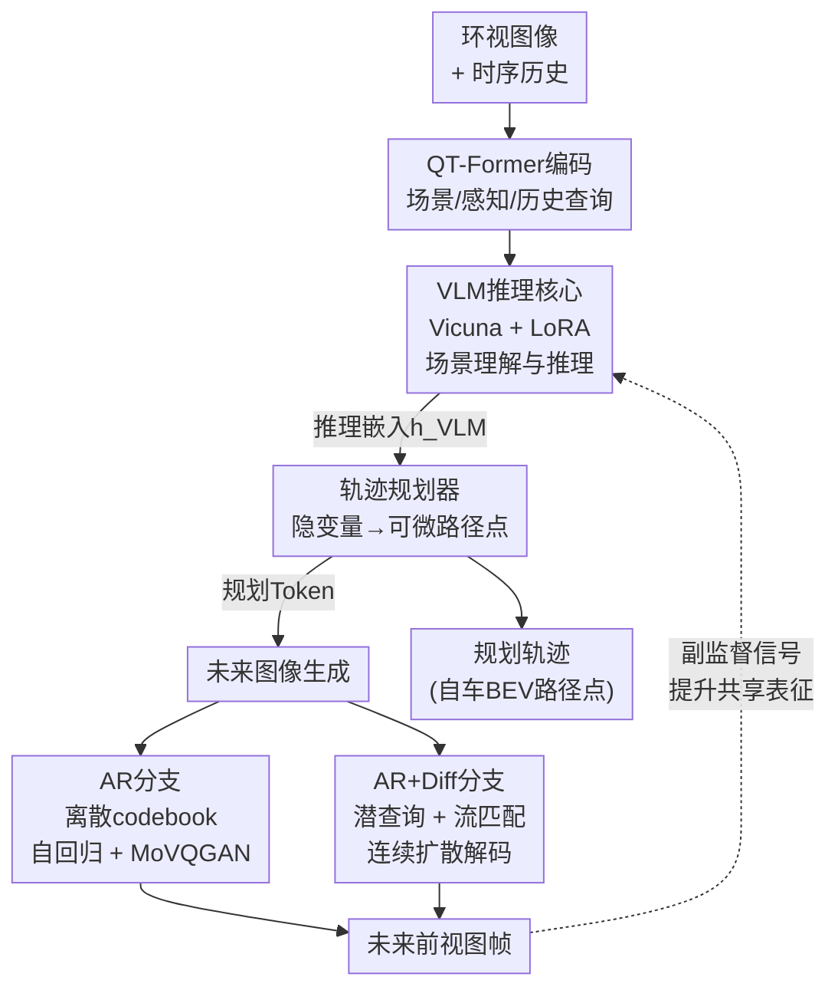

# UniDrive-WM: Unified Understanding, Planning and Generation World Model for Autonomous Driving

**会议**: ECCV2026  
**arXiv**: [2601.04453](https://arxiv.org/abs/2601.04453)  
**代码**: 无  
**领域**: 自动驾驶  
**关键词**: 世界模型, 轨迹规划, 未来图像生成, 视觉语言模型, 端到端驾驶

## 一句话总结

UniDrive-WM 在单一 VLM 框架中联合实现场景理解、轨迹规划和轨迹条件未来图像生成，通过规划→生成的可微双向耦合，在 Bench2Drive 闭环评估中将 Driving Score 从 77.74 提升至 79.31，L2 轨迹误差降低 7.3%、碰撞率降低 10.4%，并在两个互补的图像生成分支（离散自回归与连续扩散）之间系统分析了速度-保真度的权衡关系。

## 研究背景与动机

自动驾驶中的世界模型被定义为「理解当前场景并预测未来状态」的学习模型。近年来，视觉语言模型（VLM）在端到端驾驶规划上取得了显著进展，以 ORION 为代表的方案通过 VLM 的语义推理能力直接预测驾驶轨迹。然而，现有方法大多将感知、预测、规划和生成作为独立模块串联，VLM 在规划时往往以纯文本 token 作为中间表征——将多视图图像、时序历史、感知边界框等丰富的视觉几何线索先压缩为自然语言描述，再在后续阶段解码为轨迹或画面。这种文本瓶颈不仅造成不可逆的几何信息丢失，还使生成模块与规划模块之间缺乏可微的梯度通路——规划无法从生成中获益，生成也无法感知规划的意图。

与此同时，视觉生成模型（如 DriveDreamer、GEM、FSDrive）能够生成逼真的未来驾驶画面，但它们的架构通常缺少显式的结构化场景理解和推理能力：无法可靠地融入多视图线索或高层指令，也无法将生成的未来帧以可微方式回传到规划空间去验证决策的物理合理性。现实中的驾驶员并非逐模块运作——感知、预测、想象是同时发生的。一个驾驶员在决定转向之前已经在脑海中「看到了」转向后的画面。这种认知上的统一性在现有分离式架构中完全被割裂了。

**核心 idea：将场景理解、轨迹规划和未来图像生成在同一 VLM 框架中端到端联合学习，让规划 token 条件化图像生成（规划→生成决定「画面应该长什么样」），再让生成的未来帧通过共享的 VLM 表征辅助推理以进一步提升规划精度（生成→规划形成「想象的画面回馈决策」），从而构成「推理→动作→视觉想象」的双向可微闭环。**

## 方法详解

### 整体框架

UniDrive-WM 以 VLM 为认知核心，从多视图环视图像和历史时序信息出发，依次经过感知编码、语义推理、轨迹规划和未来图像生成四个阶段。轨迹规划器在 VLM 的推理嵌入之上通过隐变量建模输出可微路径点，生成的规划 token 立即作为条件输入图像生成模块。图像生成分支采用两种互补范式——离散自回归（AR）和连续自回归+流匹配扩散（AR+Diffusion）——共享同一 VLM 主干，在后端分别输出未来前视图帧。

### 关键设计

**1. QT-Former 多视图时空感知编码**

UniDrive-WM 沿用了 ORION 中的 QT-Former 作为视觉感知编码器，其核心是维护三组可学习的查询向量。场景查询（Scene Queries，512 个）用于压缩当前帧的多视图图像特征；感知查询（Perception Queries，600 个）连接到多个辅助检测头，输出 3D 检测框、车道线、交通状态和动态物体运动预测；历史查询（History Queries，16 个）配合一个容量为 16 帧的记忆库（Memory Bank）来检索和存储历史时序信息。三组查询在交叉注意力层中与带 3D 位置编码的多视图图像特征交互，最终通过 MLP 将更新后的场景和历史查询映射为 LLM 推理空间中的场景 token 和历史 token。这一设计的精髓在于：结构化感知信息（边界框位置、车道线拓扑）是以数值嵌入（而非纯文本描述）的形式直接传递到推理空间的，因而保留了空间精度，不会被自然语言抽象所稀释。在联合训练期间检测头被冻结，仅作为稳定的结构化感知特征源。

**2. 隐变量轨迹规划器：推理-动作空间的可微桥接**

轨迹规划器是连接 VLM 语义推理空间与连续轨迹动作空间的关键模块。VLM 输出的高层推理嵌入 h_VLM 通过轻量 MLP 投影到一个高斯隐变量空间，得到潜在动作变量 z_a（参数化为均值 μ_h 和方差 σ_h^2），经重参数化技巧采样后送入一个轻量的循环路径点解码器，输出自车 BEV 坐标系下的未来路径点序列 {(x_i, y_i)}。这一隐变量设计使 VLM 的语义意图可以平滑、可微地传递到数值化的轨迹输出。一个值得注意的工程经验是：作者发现显式的 KL 正则化项在大规模多模态 VLM 联合训练中会破坏稳定性，因此果断省去了 KL 散度项。规划器仅通过三种显式损失提供空间感知监督：碰撞损失 L_col 惩罚与预测 3D 边界框相交的轨迹，边界损失 L_bd 惩罚驶出可行驶区域的路径点，MSE 损失 L_mse 惩罚与真值轨迹的 L2 偏差。

**3. 双路径轨迹条件未来图像生成**

这是本文最核心的技术贡献。在共享 VLM 主干之上，设计了两种互补的解码范式来将规划 token 转为视觉输出：

- **离散自回归路径（AR）**：通过扩大 VLM 的联合 codebook 来激活视觉生成能力（代码表扩充为语言码本 Z_L 和视觉码本 Z_I 两部分），并引入 ⟨image_start⟩ 和 ⟨image_end⟩ 特殊 token 标记视觉序列边界。接收到规划 token 后，VLM 以自回归方式逐 token 预测未来前视图的离散视觉 token，经 MoVQGAN 解码为像素图像。由于离散 token 数与分辨率平方成正比，AR 路径在高分辨率下会遇到上下文窗口瓶颈，因此实践中推理分辨率为 192×128。其优势在于结构简单、推理速度快（2 fps on A100），适合延迟敏感的闭环控制场景。

- **连续 AR+扩散路径（AR+Diff）**：VLM 首先生成一个可学习的连续潜查询向量 Q，该查询通过注意力机制聚合 VLM 推理嵌入中的语义上下文，然后馈入流匹配（Flow Matching）扩散解码器——从高斯噪声 X_0 出发，沿线性插值路径 X_t = t·X_1 + (1-t)·X_0 逐步去噪到目标图像潜特征 X_1，扩散网络预测速度场 V_θ(X_t, Q, t) 并用 L_FM 约束。注意扩散解码器的训练采用确定性重建（而非随机采样），确保输出稳定性。此外引入 CLIP 语义对齐损失 L_CLIP 维持生成帧与真实帧的高层语义一致性。由于潜表示长度与分辨率解耦，VLM 只需预测一个紧凑的连续潜向量，即可由扩散解码器映射到高分辨率输出（512×1024），避免了 AR 路径的 token 数量平方爆炸问题。代价是推理速度降至 0.4 fps。

两个分支的表征特性高度互补：AR 的离散量化是一种信息瓶颈，提供了强语义正则化，使其轻量解码器在语义稳定性关键的反应式控制中表现稳健；AR+Diff 的连续通路保留了高频几何细节，在长时轨迹对齐（更低的 L2 误差和更高的 NDS）上更优秀。二者并行部署时，AR 适合前端的快速反应规划，AR+Diff 适合离线分析或复杂场景下的高保真预测。

**4. 因果顺序设计与两阶段联合训练**

UniDrive-WM 采用了一个简洁但关键的序列设计：规划 token 紧接在 VLM 推理输出之后，而图像 token（或图像潜查询）紧接在规划 token 之后，形成「推理→规划→生成」的严格因果链。消融实验（Tab. 7）验证了这一顺序的重要性——将生成放在规划之前（Generation→Planning）会导致规划指标和 FID 双双下降（Avg L2 从 0.64 升至 0.67、FID 从 7.2 升至 9.1），证明「先决定往哪开、再想象开过去会看到什么」的因果方向比反向更符合物理世界的动作→观察规律。训练采用两阶段策略：第一阶段联合优化轨迹规划与图像生成；第二阶段加入驾驶场景 VQA 数据（如场景描述、视觉问答）进一步对齐视觉-语言-规划空间。值得注意的是，加入图像生成分支后 VQA 指标（CIDEr、BLEU、ROUGE-L）一致改善，说明未来帧预测为当前场景理解提供了额外的结构化线索，使模型能够更准确地预判场景演变。

### 损失函数 / 训练策略

AR 分支的总损失为 L = L_CE + L_plan，其中 L_CE 为离散视觉 token 预测的交叉熵损失（教师强制）。AR+Diff 分支加入流匹配损失 L_FM 和 CLIP 语义对齐损失 L_CLIP，总损失为 L = L_CE + L_plan + L_FM + L_CLIP。LLM（Vicuna 1.5）采用 LoRA（rank=16, α=16）高效微调，QT-Former 的检测头在联合训练中冻结。图像分辨率：AR 分支 192×128、AR+Diff 分支 512×1024；训练使用 8× NVIDIA H200 GPU，EVA-02-L 作为视觉骨干，记忆库大小为 16 帧。

## 实验关键数据

### 主实验

**Bench2Drive 闭环评估（Tab. 1）**：

| 方法 | Driving Score ↑ | Success Rate ↑ | L2 (m) ↓ |
|------|----------------|---------------|----------|
| ORION | 77.74 | 54.62 | 0.68 |
| UniDrive-WM (AR) | 79.22 | 56.36 | 0.64 |
| UniDrive-WM (AR+Diff) | 79.31 | 56.42 | 0.63 |

**Bench2Drive 开环规划（Tab. 2，AR+Diff 结果）**：

| 配置 | L2 1s ↓ | L2 3s ↓ | Collision 3s ↓ | NDS ↑ |
|------|---------|---------|---------------|-------|
| ORION | 0.268 | 1.129 | 0.743 | 0.723 |
| Ours AR | 0.247 | 1.079 | 0.668 | 0.746 |
| Ours AR+Diff | 0.241 | 1.066 | 0.657 | 0.755 |

与 ORION 相比，AR+Diff 分支 3s L2 误差降低 7.3%（1.129→1.066），3s 碰撞率降低 10.4%（0.743→0.657）。

**未来帧生成 FID（Tab. 4）**：

| 方法 | Bench2Drive FID ↓ | nuScenes FID ↓ |
|------|------------------|----------------|
| Drive-WM (CVPR24) | 17.8 | 15.8 |
| GEM (CVPR25) | 13.2 | 10.5 |
| FSDrive (NeurIPS25) | 9.3 | 10.1 |
| Ours AR | 7.2 | 7.8 |
| Ours AR+Diff | 6.6 | 7.3 |

### 消融实验

| 配置 | L2 3s (m) ↓ | Collision 3s ↓ | NDS ↑ | mAP ↑ |
|------|------------|---------------|-------|-------|
| 无检测头 + 无图像生成 | 2.146 | 1.77 | - | - |
| 有检测头 + 无图像生成 | 1.130 | 0.746 | 0.721 | 0.642 |
| 有检测头 + 有图像生成 | 1.079 | 0.668 | 0.746 | 0.663 |

去掉图像生成分支后，L2 3s 从 1.079 升至 1.130（+4.7%），碰撞率从 0.668 升至 0.746（+11.7%），验证了未来帧预测对轨迹规划的促进价值。

| 顺序设置 | Avg L2 (m) ↓ | Avg Col (%) ↓ | FID ↓ |
|---------|-------------|---------------|-------|
| Generation→Planning | 0.67 | 0.45 | 9.1 |
| Planning→Generation（本文） | 0.64 | 0.43 | 7.2 |

### 关键发现

- 图像生成分支对规划精度的提升是系统性的：加入生成后 L2、碰撞率、感知 mAP 均一致改善，且 VQA 指标同步提升，说明未来帧预测为整个共享表征提供了超越当前帧的结构化上下文。
- 规划→生成的因果顺序比反向重要得多——L2 降低 0.03m、FID 降低 1.9，验证了「动作先于观察」的认知学合理性。
- AR+Diff 在高保真度（FID）和长时规划精度（L2/NDS）上略优于 AR 分支，但推理速度慢 5 倍（0.4 vs 2 fps），两种范式适合不同的部署场景。
- 在细粒度驾驶能力上（附录 Tab. 9），UniDrive-WM 在 Merging（+19.9%）、Overtaking（+4.9%）、Emergency Brake（+2.1%）、Traffic Sign（+3.4%）上全面超越 ORION，但 Give Way 任务持平（40%），说明在交互式防御性驾驶场景中仍有提升空间。

## 亮点与洞察

- **「规划→生成」的可微闭环**是本文最具启发性的思路。传统架构中生成和规划是两条平行线，本文用一条规划 token 将二者串成了因果链——规划告诉生成「要往哪开」，生成再通过共享表征告诉规划「开过去会看到什么」。这种双向增益的设计可以直接迁移到其他需要「决策+预测」耦合的任务（如机器人操作中的动作前景预测）。
- **双分支交换分析（Sec. 4.5）** 特别有工程参考价值。作者不仅提出了两种生成范式，还系统剖析了它们在速度、分辨率约束、表征特性上的取舍逻辑，为实际部署提供了清晰的选择决策树。
- **省去 KL 正则项**是一个反直觉但有效的经验发现。在大规模 VLM 联合训练场景下，标准的 VAE KL 正则化反而破坏稳定性——这一发现对后续多模态联合训练有直接的工程启示。
- **VQA 指标的同步改善**（Tab. 8）是一个"附送"但重要的结果：加入图像生成后 VQA 的 CIDEr 从 65.7 升到 66.7。这说明哪怕不做显示的未来推理，仅仅是要求模型具备预测未来视觉状态的能力，就已迫使它更深入地理解当前场景——这种间接迁移效应很值得关注。

## 局限与展望

- 图像生成仅限于未来前视图帧，尚未扩展到全景多视图或 BEV 视角的未来预测——后者可能为规划提供更完整的空间上下文（如侧后视的来车信息）。
- AR+Diff 分支 0.4 fps 的推理速度远达不到实时部署需求，作者也将其列为未来工作。在实际系统中如何压缩扩散解码器的推理延迟是落地的关键瓶颈。
- 训练依赖了 Bench2Drive 和 nuScenes 的密集帧标注（16 帧记忆库），在标注稀疏或域差异较大的场景（如极端天气、不同传感器配置）下的泛化能力有待验证。
- 当前评估以短期预测（2-3 秒）为主，更长规划视野下生成质量对规划的增益是否持续、是否存在衰减拐点尚未分析。

## 相关工作与启发

- **vs ORION**：UniDrive-WM 直接基于 ORION 的 QT-Former 感知骨干和 LoRA 方案构建，核心差异是新增了图像生成分支及其与规划的双向耦合。所有规划指标的增益均可归因于生成支路的引入。
- **vs FSDrive**：FSDrive 做的是「图像特征→规划」的方向，而 UniDrive-WM 做的是「规划 token→图像生成」的反向。Tab. 7 的消融实验直接证明 UniDrive-WM 的因果方向优于 FSDrive 的因果方向——这本质上是在论证「动作→观察」vs「观察→动作」作为世界模型底层假设的差异。
- **vs Drive-WM / GEM**：这些纯生成模型只关注画面质量，缺少结构化推理和规划能力。UniDrive-WM 将它们的能力作为联合框架的一个子模块，首次证明了生成质量可以反过来提升规划精度。

## 评分

- 新颖性: ⭐⭐⭐⭐  将规划条件化图像生成的反向思路与双路径生成范式相结合，在端到端驾驶世界模型中首次实现了「推理→规划→想象」的双向可微闭环。
- 实验充分度: ⭐⭐⭐⭐⭐  覆盖闭环/开环规划、3D 检测（mAP/NDS）、图像生成（FID）、VQA（DriveLM）四种评估，加上完整的因果顺序消融、模块消融和细粒度驾驶能力分析（附录 Tab. 9）。
- 写作质量: ⭐⭐⭐⭐  方法叙述条理清晰，公式和中文叙事比例均衡，图 2/3 的框架图和架构对比图有助于理解双分支设计。
- 价值: ⭐⭐⭐⭐  为 VLM-based 驾驶世界模型提供了一个可复用的统一范式，其因果顺序设计和双分支分析对后续工作有直接的参考价值，但推理速度问题限制了当前部署。

<!-- RELATED:START -->

## 相关论文

- [\[CVPR 2026\] GaussianDWM: 3D Gaussian Driving World Model for Unified Scene Understanding and Multi-Modal Generation](../../CVPR2026/autonomous_driving/gaussiandwm_3d_gaussian_driving_world_model_for_unified_scene_understanding_and_.md)
- [\[CVPR 2026\] DrivePI: Spatial-aware 4D MLLM for Unified Autonomous Driving Understanding, Perception, Prediction and Planning](../../CVPR2026/autonomous_driving/drivepi_spatial-aware_4d_mllm_for_unified_autonomous_driving_understanding_perce.md)
- [\[ICCV 2025\] Hermes: A Unified Self-Driving World Model for Simultaneous 3D Scene Understanding and Generation](../../ICCV2025/autonomous_driving/hermes_a_unified_self-driving_world_model_for_simultaneous_3d_scene_understandin.md)
- [\[ECCV 2026\] ExploreVLA: Dense World Modeling and Exploration for End-to-End Autonomous Driving](explorevla_dense_world_modeling_and_exploration_for_end-to-end_autonomous_drivin.md)
- [\[ECCV 2026\] UniTeD: Unified Temporal Diffusion for Joint Perception and Planning in Autonomous Driving](united_unified_temporal_diffusion_for_joint_perception_and_planning_in_autonomou.md)

<!-- RELATED:END -->
