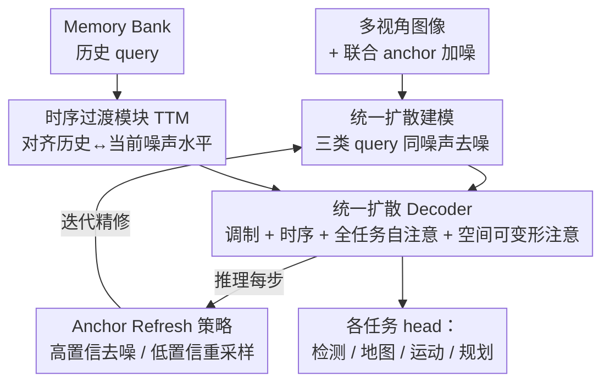

# UniTeD: Unified Temporal Diffusion for Joint Perception and Planning in Autonomous Driving

**会议**: ECCV 2026  
**arXiv**: [2606.25736](https://arxiv.org/abs/2606.25736)  
**代码**: 无  
**领域**: 自动驾驶 / 端到端 / 扩散模型  
**关键词**: 端到端自动驾驶, 统一扩散, 感知规划联合建模, 时序扩散, 稀疏 query

## 一句话总结
UniTeD 把感知（检测、地图、运动预测）和规划的 anchor query 放进同一个扩散去噪过程里联合建模，用时序过渡模块（TTM）对齐历史帧与当前帧的噪声水平、用 Anchor Refresh 策略缓解稀疏扩散的训练-推理分布偏移，仅用相机就在 NAVSIM、Bench2Drive 上超过判别式与「只对规划做扩散」的方法，拿到 90.2 PDMS / 87.3 DS。

## 研究背景与动机
端到端自动驾驶正在从「感知→预测→规划」的模块化流水线，走向一个完全可微、直接优化最终规划目标的整体系统。早期判别式方法里，UniAD、VAD 用串行管线把感知结果喂给下游规划器，TransFuser、PARA-Drive 则让感知和规划并行但交互很浅；后来 DriveTransformer、HiP-AD 引入统一 decoder 让所有 task query 逐层互相 attend，端到端性能明显提升。但这类判别式方法有一个根植于优化目标的共同短板：最小化监督损失会把预测往均值、往多数行为上拽，天然抓不住驾驶行为「同一场景下有多种合理走法」的多模态本质。为了解决这个问题，DiffusionDrive、ResAD、DiffRefiner 等引入了扩散生成建模——DiffusionDrive 用截断扩散策略稳定生成并压缩去噪步数，DiffRefiner 用两阶段框架先生成粗轨迹再用扩散精修。

问题在于，这些生成式框架都只把扩散用在规划这一环，把感知输出当成固定条件塞给规划器。这样一来感知误差会直接传播进生成过程，给出错误的引导、抬高优化难度，更关键的是彻底堵死了感知与规划之间「互相纠正」的可能，生成建模的潜力只发挥了一半。除此之外还有两个被忽视的坑：一是现有扩散规划器只用单帧信息、完全丢掉了时序动态；二是稀疏 query 扩散规划有严重的训练-推理不一致——训练时只有少数匹配到真值的规划 query 会被监督，其余 query 几乎收不到梯度，可推理时所有 query 每步都会被更新并反馈进下一轮，导致 query 分布逐步漂移、越去噪越糟，这恰恰和扩散「越去噪越好」的迭代精修原则相悖。

于是作者提出把感知和规划真正拉进同一个生成空间。**核心 idea：用一个统一扩散 decoder 同时对 agent、map、planning 三类 anchor query 做联合去噪，让它们在共享的生成空间里双向交换信息、互相精修；再用时序过渡模块解决历史帧与当前帧的噪声错配，用 Anchor Refresh 策略把低置信 query 拉回训练分布，从而把「统一 + 生成 + 时序」三件事一次性做进端到端驾驶。**

## 方法详解

### 整体框架
UniTeD 整体就是一个统一的扩散去噪过程。给定第 $k$ 帧的 $V$ 路多视角图像，先用图像 backbone 抽多尺度特征 $\mathbf{F}$；再定义一组联合 anchor $\mathbf{A}=\{\mathbf{A}^a, \mathbf{A}^m, \mathbf{A}^p\}$，分别对应 agent、map、planning 三类任务（论文用 900 个 agent anchor、100 个 map anchor、24 个 planning anchor，共 1024 个）。沿用截断扩散，给这些 anchor 加上以先验为中心的高斯噪声得到 $\mathbf{A}_{t_k}$，经 Anchor Embedding 投影进共享的隐 query 空间 $\mathbf{Q}_k=\{\mathbf{Q}^a,\mathbf{Q}^m,\mathbf{Q}^p\}$，然后一起送进统一扩散 decoder 去噪。为引入时序，一个 memory bank 缓存历史 query，TTM 把这些历史 query 重新对齐到当前帧的噪声水平后，连同多视角特征一起作为 decoder 的条件输入。去噪结束后各任务专属 head 输出最终的检测、地图、运动、规划结果。推理时每一步用 Anchor Refresh 策略更新预测、初始化下一步去噪，迭代精修到最后一个时间步。

### 关键设计

**1. 统一扩散建模：让感知和规划在同一个噪声水平下一起去噪**

现有生成式方法把扩散锁在规划一环、感知当固定条件，误差单向传播且没法互相纠正。UniTeD 的做法是把 agent、map、planning 三类 anchor 都当作扩散变量，前向过程给所有任务同时施加同一水平的噪声，反向过程由 decoder 一起把它们从噪声 anchor 恢复成干净输出。前向定义为

$$q(a_{t_k}\mid a)=\mathcal{N}\!\left(a_{t_k};\sqrt{\bar{\alpha}_{t_k}}\,a,\,(1-\bar{\alpha}_{t_k})\mathbf{I}\right),\quad t_k\in[1,T_{\text{trunc}}]$$

其中 $T_{\text{trunc}}\ll T_{\text{max}}$ 是截断步数。这种「同步注噪」让所有任务被嵌入统一的不确定性尺度，反向用 DDIM 采样迭代精修。这样有效的原因有两层：一是三类任务在共享生成空间里能双向交换信息（下一个设计详述），二是噪声条件下的多任务训练天然更鲁棒——每个任务都被逼着在「其他任务给出的中间输出是带噪、不完美的」前提下也要预测准，于是推理时更稳、泛化更好。消融里，规划从判别式换成扩散（+2.6 PDMS），把扩散进一步扩到感知端也带来额外 +0.7 PDMS。

**2. 统一扩散 Decoder 的四层交互：把跨任务的几何先验真正用起来**

光是让三类 query 一起去噪还不够，得设计好它们怎么在 decoder 里交互。每个 decoder block 串了四类交互层。首先是条件调制（Conditional Modulation），沿用 DiT 的 AdaLN：把当前时间步 $t_k$ 编码成条件 $\mathbf{C}_k$ 过 MLP 产生 $\{\alpha,\beta,\gamma\}$，动态把 task 特征投影到对应的分布层级，让去噪过程「知道自己现在处在生成的哪个阶段」。接着是时序交叉注意层，融合 TTM 对齐过的历史 query（见设计 3）。然后是这套设计的核心——统一自注意层（Unified Self-Attention）：把 $\mathbf{Q}^a,\mathbf{Q}^m,\mathbf{Q}^p$ 拼在一起做 all-to-all 注意，让每个 token 无视任务归属地 attend 到所有其他 token。这一步的价值很具体：ego 规划和 agent 意图会对地图重建施加空间约束，帮助补全被遮挡区域的地图；反过来地图拓扑又能正则化多模态轨迹生成，一次联合注意就把「地图-agent-规划」三者拉成物理和逻辑一致的场景。最后是空间可变形注意层，把每个 query 关联的 3D anchor 投影到各相机像平面，用多尺度可变形注意高效采样聚合图像特征，把隐空间特征锚定回真实 3D 空间。

**3. 时序过渡模块 TTM：消除历史帧与当前帧的噪声水平错配**

想引入时序就得用 memory bank 缓存历史 query，但直接融合会踩一个扩散特有的坑：历史 query $\{\mathbf{Q}_{k-i}\}$ 和当前 query $\mathbf{Q}_k$ 的去噪时间步是各自独立随机采样的，噪声水平根本对不齐，硬拼只会把噪声引进来。TTM 的思路是先把历史 query 重新投影到当前的噪声流形上再融合。它为每个历史帧构造一个更丰富的条件编码

$$\mathbf{C}_{k-i}=\texttt{MLP}\big([\texttt{TE}(t_{k-i}),\,\texttt{TE}(\Delta t_i),\,\texttt{TE}(\Delta k_i)]\big)$$

同时编码历史噪声水平 $t_{k-i}$、相对噪声偏移 $\Delta t_i=t_k-t_{k-i}$ 和帧间隔 $\Delta k_i$；再由这个条件过 MLP 生成 scale/shift 参数，以 $\tilde{\mathbf{Q}}_{k-i}=(1+\gamma_{k-i})\odot\text{LayerNorm}(\mathbf{Q}_{k-i})+\beta_{k-i}$ 的方式把历史 query 变换到当前噪声水平。对齐后的历史特征再进时序交叉注意层，让每个 task 实例继承过去 $n$ 帧的运动与结构先验、又不被跨物理时刻的噪声错配干扰。消融显示：只加 memory queue 带来的增益有限（+0.4 PDMS），而补上 TTM 做时间步对齐后 PDMS 从 89.4 直接涨到 90.2，说明「对齐噪声水平」才是时序融合真正吃紧的地方。

**4. Anchor Refresh 策略 ARS：把漂移的低置信 query 拉回训练分布**

稀疏 query 扩散规划的训练-推理不一致是个硬伤：训练时只有少数匹配真值的 query 有监督，推理时所有 query（包括训练里几乎没探索过的）每步都被更新并反馈进下一轮，query 分布逐步偏离训练时的 anchor 分布，误差沿去噪步累积、预测越来越烂。ARS 的做法很直接——推理每一步先由分类分支给出每个 anchor 的置信度，对高置信 query（$s_t^{(i)}>\tau$）走标准 DDIM 反向算子基于预测的干净状态精修，保证只传播 task-relevant 的信息；对低置信 query（$s_t^{(i)}\le\tau$）则丢弃其无约束输出、直接换回原始 anchor 先验并重投影到下一步 $t-m$ 的噪声水平。这样既保住了 query 的多样性，又让每步的输入分布始终贴近训练分布。ARS 对不同任务用异质阈值（检测 0.30、地图 0.45、运动与规划 0.30）以平衡召回与安全。消融里去掉 ARS，PDMS 从 90.2 掉到 88.2，是单个组件里掉点最狠的之一；阈值太高（0.5）又会过度剪掉高质量精修结果、频繁退回原始 anchor 反而略降。

### 损失函数 / 训练策略
整个框架端到端可微，多任务目标覆盖检测、运动预测、地图、规划四项，每项都含分类损失和回归损失，加权求和为

$$\mathcal{L}_{\text{total}}=\lambda_{\text{det}}\mathcal{L}_{\text{det}}+\lambda_{\text{mot}}\mathcal{L}_{\text{mot}}+\lambda_{\text{map}}\mathcal{L}_{\text{map}}+\lambda_{\text{plan}}\mathcal{L}_{\text{plan}}$$

具体权重上，检测分类用 focal loss（权重 2.0）+ SparseBox3D 回归；地图给折线采样点很高的回归权重 10.0 以保证车道/边界精度；运动两项各 0.2；规划轨迹选择 focal loss（0.5）+ 未来 waypoint 回归（1.0）。实现上用 ResNet-34 backbone、输入 640×352、6 层 decoder，训练时扩散调度在 1000 步里截断到 50 步，8 卡 L40、batch 64、AdamW、lr 4e-4 训 100 epoch。推理只用 2 步 DDIM（步长 $m=10$）、从 $t=8$ 的截断噪声起步、取 top-1 轨迹。

## 实验关键数据

### 主实验
UniTeD 仅用相机（C）就在多个 benchmark 上超过判别式和只对规划做扩散的方法，甚至压过用了激光雷达（C+L）的对手。

| 数据集 | 指标 | UniTeD | 之前 SOTA | 提升 |
|--------|------|--------|-----------|------|
| NAVSIM v1 | PDMS | 90.2 | DiffRefiner 89.4 (Gen-Sep) | +0.8 |
| NAVSIM v1 | PDMS | 90.2 | HiP-AD 88.6 (Dis-Uni) | +1.6 |
| NAVSIM v2 | EPDMS | 90.1 | DiffRefiner 86.2 | +3.9 |
| Bench2Drive | DS | 87.3 | HiP-AD 86.8 | +0.5 |
| nuScenes | 地图 mAP | 0.596 | HiP-AD 0.571 | +2.5% |
| nuScenes | 运动 minADE | 0.58 | SparseDrive-S 0.62 | -6.4% |

值得注意的是，Bench2Drive 上 UniTeD 只用 B2D 200K 数据就超过了用更大 TF++ 500K 数据训练的 DiffRefiner（+0.2 DS）和 DiffusionDrive（+9.6 DS）。效率上 1 步去噪即可跑到 10.5 FPS（RTX 4090，95.6 ms），比 SparseDrive（9.0 FPS）还快，2 步取得最优 90.23 PDMS。

### 消融实验

| 配置 | PDMS (NAVSIM v1) | 说明 |
|------|------------------|------|
| Full model | 90.2 | 统一 + 感知/规划都扩散 + TTM + ARS |
| 判别式分离基线 (ID0) | 84.1 | 感知规划分离 + 都用回归 |
| 分离→统一 (ID1 vs ID3) | 86.7→89.5 | 统一范式 +2.8 |
| 只规划扩散→感知也扩散 (ID3 vs ID4) | 89.5→90.2 | 感知端扩散 +0.7 |
| w/o TTM (ID3) | 89.4 | 只有 memory queue，掉 0.8 |
| w/o ARS (ID0) | 88.2 | 去掉 Anchor Refresh，掉 2.0 |

### 关键发现
- **统一范式的收益最大**：ID1→ID3 从分离切到统一，感知规划联合学习缓解了信息瓶颈和串行管线的误差累积，单这一步就 +2.8 PDMS，是所有改动里最大的一块。
- **TTM 的价值在「对齐」而非「加历史」**：只加 memory queue 增益有限（+0.3~0.4），补上 TTM 做噪声水平对齐后一举 +0.8（89.4→90.2），说明历史特征和当前去噪时间步的对齐才是时序扩散的真痛点。
- **ARS 是稀疏扩散的地基**：去掉后掉 2.0 PDMS，是单组件里掉点最多的之一；阈值需要按任务调（0.3 为最优），太高会过度剪掉好的精修结果。
- **生成建模天然抗噪**：可视化显示在阴影、停放 agent、遮挡、模糊车道等场景，判别式基线因输出训练均值（大多数 agent 在动）而误判静止车、漏检遮挡目标，UniTeD 靠采样多个合理假设选出与观测最一致的预测；闭环里每个控制周期从联合分布重新生成，天然「重置」累积噪声、防止误差沿时间放大。

## 亮点与洞察
- **把感知也扔进扩散**是最核心的一步：以往「感知固定 + 只对规划扩散」的范式其实是把误差单向锁死，UniTeD 让三类 query 同噪声联合去噪，噪声条件训练逼每个任务在别人给的带噪中间结果下也预测准，这既是精度增益也是鲁棒性来源。
- **TTM 揭示了「时序 + 扩散」的隐藏冲突**：历史帧和当前帧的去噪时间步独立随机采样导致噪声错配，naive 拼接反而引噪；把历史 query 用 AdaLN 式变换重投影到当前噪声流形，是一个可迁移到任何「跨帧/跨样本融合扩散中间态」场景的 trick。
- **ARS 用置信度做选择性去噪**：高置信走 DDIM、低置信退回 anchor 先验重采样，本质是在推理时主动把 query 分布拉回训练分布，思路可迁移到其他稀疏 query 扩散任务（如 DiffusionDet 式检测）去治训练-推理漂移。
- **纯相机压过激光雷达方案**且 6 层 decoder、无 RL、10.5 FPS，展示了统一时序扩散在不堆大模型参数的前提下抓多模态分布的性价比。

## 局限与展望
- 作者坦言未用 RL 训练，在 NAVSIM v1 上略逊于 FLARE(91.4)、DiffusionDriveV2(91.2) 等 RFT/RL 方法；架构可扩展、后续计划接入 RL 或更大参数获取更多监督。
- 置信度直接取自分类分支，阈值 $\tau$ 需按任务经验调（检测/运动/规划 0.30、地图 0.45），对新数据集可能要重调，缺乏自适应机制。
- Bench2Drive 上为精细控制换用了解耦的横纵向规划（路径 + 时序轨迹分开预测），与 NAVSIM 的统一轨迹输出不一致，说明统一扩散在闭环精细控制下未必是最优输出形式。
- memory bank 存历史 query 会随帧数增长带来显存/延迟开销，论文主要报告短时序（过去 $n$ 帧），长程时序稳定性未充分验证。

## 相关工作与启发
- **vs DiffusionDrive / DiffRefiner（Gen-Sep）**: 它们把扩散只用在规划、感知当固定条件，UniTeD 把感知也纳入同一扩散过程做联合去噪，避免误差单向传播并支持互相精修，NAVSIM v1 上 +0.8 PDMS、v2 上 +3.9 EPDMS。
- **vs HiP-AD / DriveTransformer（Dis-Uni）**: 同样统一 decoder 联合处理所有 task query，但它们是判别式、最小化监督损失会往均值收敛抓不住多模态；UniTeD 用生成建模，+1.6 PDMS / +0.5 DS，且相机就超它们的相机版本。
- **vs UniAD / VAD（Dis-Sep）**: 串行管线把感知结果喂下游规划、误差累积；UniTeD 联合建模 +6~7 PDMS，且 10.5 FPS 远快于 UniAD 1.8 FPS。
- **vs DiffusionDet**: ARS 的「训练-推理漂移」诊断与 anchor 重采样思路正是受 DiffusionDet 启发，把它从检测迁移并扩展到多任务稀疏扩散驾驶框架。

## 评分
- 新颖性: ⭐⭐⭐⭐⭐ 首个把感知与规划真正放进同一扩散过程联合去噪的端到端驾驶框架，TTM 解决时序扩散噪声错配、ARS 治训练-推理漂移都是扎实的新机制。
- 实验充分度: ⭐⭐⭐⭐⭐ NAVSIM v1/v2、Bench2Drive、nuScenes 四 benchmark 全覆盖，消融把统一/扩散/TTM/ARS 逐一拆开，还有效率与阈值敏感性分析和大量可视化。
- 写作质量: ⭐⭐⭐⭐ 范式对比图 (a)-(d) 清晰，方法逻辑连贯；个别组件（如条件调制细节）稍简，代码未开源。
- 价值: ⭐⭐⭐⭐⭐ 仅相机、6 层 decoder、无 RL 就拿 SOTA 且实时，为端到端驾驶的「统一生成」路线提供了强 baseline，多个 trick 可迁移到其他稀疏 query 扩散任务。

<!-- RELATED:START -->

## 相关论文

- [\[ECCV 2026\] UniDrive-WM: Unified Understanding, Planning and Generation World Model for Autonomous Driving](unidrive-wm_unified_understanding_planning_and_generation_world_model_for_autono.md)
- [\[CVPR 2026\] DrivePI: Spatial-aware 4D MLLM for Unified Autonomous Driving Understanding, Perception, Prediction and Planning](../../CVPR2026/autonomous_driving/drivepi_spatial-aware_4d_mllm_for_unified_autonomous_driving_understanding_perce.md)
- [\[ICLR 2026\] $AutoDrive\text{-}P^3$: Unified Chain of Perception-Prediction-Planning Thought via Reinforcement Fine-Tuning](../../ICLR2026/autonomous_driving/autodrivetext-p3_unified_chain_of_perceptionpredictionplanning_thought_via_reinf.md)
- [\[ICLR 2026\] BridgeDrive: Diffusion Bridge Policy for Closed-Loop Trajectory Planning in Autonomous Driving](../../ICLR2026/autonomous_driving/bridgedrive_diffusion_bridge_policy_for_closed-loop_trajectory_planning_in_auton.md)
- [\[CVPR 2026\] Diffusion Forcing Planner: History-Annealed Planning with Time-Dependent Guidance for Autonomous Driving](../../CVPR2026/autonomous_driving/diffusion_forcing_planner_history-annealed_planning_with_time-dependent_guidance.md)

<!-- RELATED:END -->
