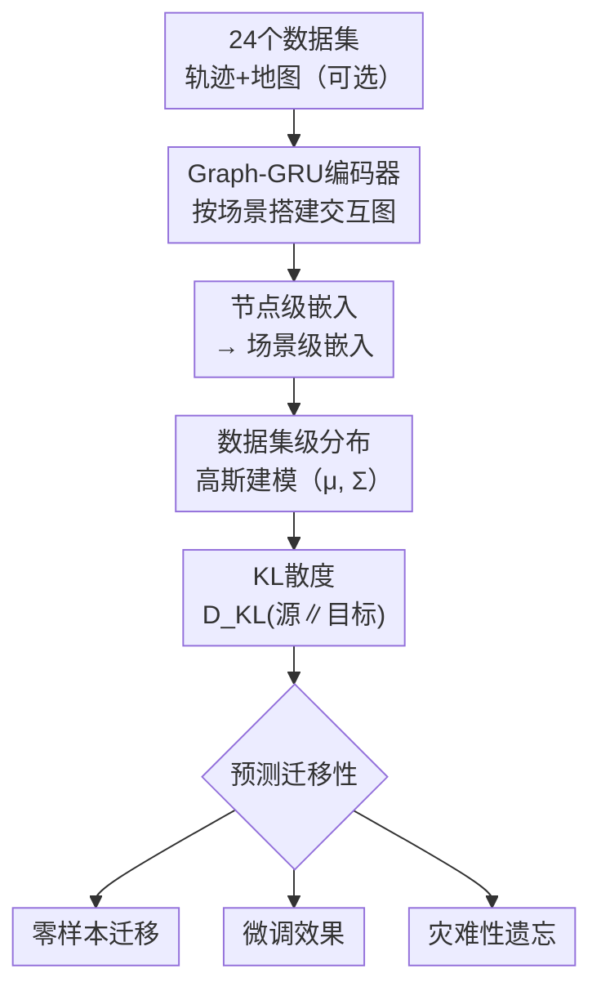

# Unveiling Transferability in Trajectory Prediction via Latent Scene Embeddings

**会议**: ECCV2026  
**arXiv**: [2606.30777](https://arxiv.org/abs/2606.30777)  
**代码**: [https://github.com/westny/transferatlas](https://github.com/westny/transferatlas)  
**领域**: 自动驾驶  
**关键词**: 轨迹预测, 迁移学习, 数据集嵌入, KL散度, 跨域泛化  

## 一句话总结

本文提出 TransferAtlas 框架，用一个图神经网络编码器将 24 个轨迹预测数据集共同映射到 32 维统一隐空间，数据集在此空间中表现为一个高斯分布，两个分布间的 KL 散度即可量化从源域到目标域的迁移难易程度——零样本迁移的 Spearman 秩相关系数达 0.811，为数据集选择、预训练源推荐和基础模型构建提供了原理性指导。

## 研究背景与动机

轨迹预测是自动驾驶和机器人领域的核心任务之一。近年来，随着深度学习的发展和大量开源数据集的出现（ETH/UCY、Argoverse、nuScenes、WOMD 等），数据驱动的预测模型取得了显著进展。然而，一个根深蒂固的问题也随之凸显：这些数据集在采集方式（车载摄像头/无人机/静态相机）、场景类型（城市/高速/混合）、代理类型（车辆/行人/混合）和地图信息上有天壤之别，导致在一个数据集上表现优异的模型迁移到另一个数据集时性能大幅下降。领域适应和泛化已成为轨迹预测走向实用化的关键瓶颈。

现有的迁移工作通常只针对有限的源-目标数据集对进行实验（如 Argoverse→nuScenes、WOMD→Argoverse 等），结论碎片化、缺乏系统性。一些工作基于表面统计特征（代理密度、速度分布、场景数量）来比较数据集，但这些粗粒度统计量无法捕捉交互模式、社会规范和任务意图等深层的"行为特征"。更深层的矛盾在于：我们没有一种**先验的**手段来判断"训练在数据集 A 上的模型，到底多大程度上能迁移到数据集 B"——这一问题目前只能通过穷举跨数据集实验来回答，成本极高。随着轨迹数据集数量持续增长，这种"盲选预训练源"的问题会越来越突出。

本文的切入角度是：与其直接解决迁移，不如先学会"预测迁移性"。受特征空间迁移学习（Task2Vec、Clark 等）的启发，作者设计了一个统一的隐嵌入模型，将所有数据集投影到一个共享的 32 维空间，然后用概率散度来量化两者的差异，并系统检验这个差异与实际迁移性能之间的相关性。**核心 idea：将轨迹数据集视为隐空间中的高斯分布，用两个分布间的 KL 散度（方向性）来预测从源域到目标域的迁移难度，在 552 个跨数据集迁移对上验证了这一度量与零样本/微调/遗忘三种迁移场景性能的强相关性（最高 ρ=0.874）。**

## 方法详解

### 整体框架

TransferAtlas 的核心是训练一个统一场景编码器，将来自不同数据集的交互场景映射到 32 维归一化隐空间，然后以场景级嵌入的均值和协方差汇聚出每个数据集的高斯分布，用 KL 散度作为跨数据集迁移性的先验度量。整个框架分两个阶段工作：第一阶段是**嵌入模型训练**（在所有数据集上联合训练一次），第二阶段是**迁移性查询**（训练完成后，给定任意源/目标数据集，用 KL 散度直接预测迁移效果，无需再做跨域实验）。

### 关键设计

**1. 双任务引导的隐空间学习：保留结构与预测双重信息**

为了让隐空间不仅反映表面特征（位置、速度），还能捕捉行为模式（交互方式、驾驶风格），编码器的训练目标由两个互补的监督信号构成：**输入重建**和**未来预测**。重建分支迫使嵌入保留输入场景的完整结构信息；预测分支则保证嵌入携带对未来轨迹有用的行为信息——后者恰恰是轨迹预测任务的核心。两个解码头在训练完成后被直接丢弃，只有编码器在推理阶段使用。

此外，嵌入向量被强制归一化到单位超球面（$\|\mathbf{z}\|_2=1$），这不仅防止了退化解（所有场景坍缩到原点），还使不同数据集、不同场景的嵌入具有可比较的尺度，为后续概率建模提供稳定基础。

**2. 层次化聚合：从节点到场景到数据集的概率表征**

场景中各智能体的嵌入 $\mathbf{z}_{s,i}$ 在智能体级别产生后，首先聚合成场景级分布 $(\boldsymbol{\mu}_s, \boldsymbol{\Sigma}_s)$（式 4），再汇聚为数据集级分布 $(\bar{\boldsymbol{\mu}}_\mathcal{D}, \boldsymbol{\Sigma}_\mathcal{D})$（式 5）。协方差的分解尤其巧妙：数据集级协方差被拆为**场景间方差**（不同场景均值的离散程度）和**场景内方差**（同一场景内各智能体嵌入的波动）之和——前者反映数据集的多样性，后者反映交互场景内部的噪声/不确定性水平。为避免高维协方差矩阵病态，使用 $r=16$ 的低秩近似加 jitter 正则（式 6），最终的 $\widetilde{\boldsymbol{\Sigma}}_\mathcal{D}$ 数值稳定且保持了分布的有意义差异。

**3. KL 散度作为方向性迁移性度量：不对称性反映真实迁移**

给定两个数据集 $\mathcal{D}_i, \mathcal{D}_j$ 的高斯近似，本文用 KL 散度 $\mathrm{D_{KL}}(\mathcal{D}_i \| \mathcal{D}_j)$ 衡量从源 $\mathcal{D}_j$ 迁移到目标 $\mathcal{D}_i$ 的效果。KL 散度的**不对称性**恰好匹配了真实迁移的不对称性——例如 nuScenes 到 WOMD 的散度远大于 WOMD 到 nuScenes（式 9），这与实际观测一致：在 WOMD 上预训练的模型微调到 nuScenes 效果好得多，反过来则差得多。相较 L1 距离、Wasserstein 距离和最大均值差异（MMD）这些对称度量，KL 散度在零样本和微调两个场景下均取得最高的秩相关系数（Tab. 2），说明概率分布的**方向性差异**才是迁移性的核心信号。

Lasso 回归分析进一步揭示（Fig. 8）：在 KL 散度与五个显式统计量（场景数、平均速度、代理数、代理类型分布、观测时长）的竞争中，KL 散度的系数在最强正则化下仍非零，而所有显式统计量（除平均速度外）都被正则到零——证明隐空间学到的分布差异捕获了远超简单统计量的深层行为特征。

### 损失函数 / 训练策略

编码器以联合重建与预测损失端到端训练（式 3），两个任务均为均方误差。训练采用加权采样策略（式 7）：大规模数据集权重被 $\alpha=0.5$ 的指数削弱，防止 WOMD（57.6 万条）和 openDD（37 万条）等巨无霸数据集主导嵌入空间。100 个 epoch，余弦退火从 $10^{-3}$ 衰减到 $10^{-5}$，前 25 轮使用 teacher forcing（概率从 1 线性衰减到 0）。QCNet 预测器在各数据集上独立调优训练（附录 Tab. 5）。

## 实验关键数据

### 主实验：KL 散度与实际迁移性能的关联

| 迁移场景 | 度量 | Spearman ρ | 95% CI | 数据集对数量 |
|---------|------|------------|--------|------------|
| 零样本迁移 | $\mathrm{D_{KL}}(\mathcal{D}_{eval}\|\mathcal{D}_{train})$ | 0.811 | (0.782, 0.840) | 552 |
| 微调后遗忘 | $\mathrm{D_{KL}}(\mathcal{D}_{source}\|\mathcal{D}_{target})$ | 0.729 | (0.403, 0.913) | 20 |
| 微调效果 | 同KL（方向相反） | 正相关 | — | 5源→Argoverse |

### 消融实验：不同度量和潜在维度对比

| 度量 | 零样本 ρ (L=16) | 零样本 ρ (L=32) | 零样本 ρ (L=64) | 零样本 ρ (L=128) |
|------|:---:|:---:|:---:|:---:|
| L1 距离 | 0.475 | 0.468 | 0.470 | 0.425 |
| Wasserstein 距离 | 0.489 | 0.482 | 0.482 | 0.448 |
| MMD | 0.410 | 0.412 | 0.410 | 0.362 |
| **KL 散度** | **0.781** | **0.811** | **0.746** | **0.736** |

| 度量 | 遗忘 ρ (L=16) | 遗忘 ρ (L=32) | 遗忘 ρ (L=64) | 遗忘 ρ (L=128) |
|------|:---:|:---:|:---:|:---:|
| **KL 散度** | 0.504 | 0.729 | **0.794** | **0.874** |

### 关键发现

- KL 散度在零样本迁移中最佳维度为 L=32（ρ=0.811），更高维度反会导致过拟合和相关性下降；但微调遗忘场景中较大维度反而更好（L=128, ρ=0.874），说明更细粒度的隐空间可能更适配区分类间差异
- 在数据集的隐空间聚类上，Lasso 回归验证 KL 散度在五个显式统计量（大小、速度、代理数、类型、时长）之上仍有显著增量贡献（Fig. 8）
- 隐空间揭示了一些有趣的关系：无人机采集的数据集（如 inD、openDD）与车载数据集（nuScenes、Argoverse 2）在发射空间中的距离很近，暗示跨模态迁移的潜力；行人类数据集（ETH/UCY）与其他数据集显著分离，提示直接迁移收益有限
- 单源最佳选择实验中（Tab. 6），KL 散度选择的前 3 名命中率 83.3%（平均排名 3.00），远超平均速度（37.5%）、最大数据集（20.8%）和随机（13.2%）

## 亮点与洞察

- **预测迁移性而非试错**：本文的思想简洁而实用——不解决迁移问题，而是先学会"预测迁移效果"，让后续研究者能在零实验成本下选择最佳预训练源。这是轨迹预测领域首次大规模、系统性地验证隐空间散度与迁移性之间的相关性。
- **不对称散度天然匹配不对称迁移**：KL 散度的非对称性恰对应"源数据集 A→目标 B"与"源 B→目标 A"不一致的真实现象（如 WOMD 送 nuScenes 很好，反过来差得多），这是对称度量（L1、Wasserstein、MMD）无法捕捉的关键信息。
- **离线复用、一次训练多次查询**：嵌入模型训练一次之后，新增数据集只需一次前向推理与协方差估计即可获得与已有数据集的全部迁移性预测，无需重新训练模型或跑跨域实验。
- **隐空间分析揭示意外关系**：t-SNE 投影揭示了传统的统计分类（车载/无人机/行人）并非迁移性的唯一决定因素——文中展示了多种跨采集模态但隐空间接近的例子，为科研社区指出尚未被充分利用的"隐藏"数据源。

## 局限与展望

- 隐空间高斯假设虽然通过实验验证（优于 MMD 等非参数方法），但在高度多模态的数据集上可能不够精确——某些数据集可能在隐空间中呈现多簇结构而非单峰高斯
- 本文使用 QCNet 作为唯一预测器进行评估，KL 散度与其他架构（如扩散模型、GNN 交互模型）的迁移性关联程度尚未验证
- 单源选择实验（Tab. 6）仅覆盖零样本单源场景，多源混合训练下的迁移性预测仍然开放——多个源数据集的分布如何"融合"并与目标匹配，目前尚无方案
- 嵌入模型的训练依赖对全部数据集的联合访问，隐私敏感场景（如不能共享原始轨迹数据的机构间协作）下如何实现分布式嵌入学习是一个有意义的扩展方向

## 相关工作与启发

- **vs [Task2Vec / Clark et al. 2022]**: Task2Vec 和 Clark 通过共享自编码器将时间序列数据集嵌入隐空间并计算 L1 距离来预测迁移，本文针对轨迹预测领域做了专业化适配：采用图神经网络编码智能体交互、加入预测头引导行为特征学习、并引入方向性 KL 散度替代对称度量，Spearman ρ 从 0.468（L1）提升至 0.811（KL）
- **vs [ScenarioNet / TrafficGen]**: ScenarioNet 同样用隐空间可视化数据集差异，但本质上是一种定性分析工具；本文在定量层面将隐空间差异与实际迁移性能建立统计关联，并提供了源选择、零样本评估等实用工具
- **vs [Dronalize / Trajdata / UniTraj]**: 这些工作致力于统一数据集接口和格式，降低跨域实验的门槛；本文与此互补——不是格式化数据，而是量化"迁移到什么程度上值得"这个更上层的决策问题

## 评分
- 新颖性: ⭐⭐⭐⭐ 用隐空间散度预测轨迹预测迁移性的想法简洁有效，但在 Task2Vec/Clark 等已有方向上属于领域专业化落地，核心思路并非全新
- 实验充分度: ⭐⭐⭐⭐⭐ 24 个数据集、552 个零样本迁移对、Lasso 回归验证、多种协方差估计消融、单源选择实验——实验设计系统而严谨，置信区间完整透明
- 写作质量: ⭐⭐⭐⭐⭐ 结构清晰，从"为什么需要预测迁移性"到"如何设计隐空间"再到"如何验证"，逻辑链紧密，附录补充完整
- 价值: ⭐⭐⭐⭐⭐ 提供了一种预训练源选择的先验工具，有望成为轨迹预测研究的标准前置步骤，对降低社区试错成本有实际意义

<!-- RELATED:START -->

## 相关论文

- [\[ECCV 2024\] Adaptive Human Trajectory Prediction via Latent Corridors](../../ECCV2024/autonomous_driving/adaptive_human_trajectory_prediction_via_latent_corridors.md)
- [\[CVPR 2026\] RAG-TP: A General Framework for Vehicle Trajectory Prediction via Retrieval-Augmented Generation](../../CVPR2026/autonomous_driving/rag-tp_a_general_framework_for_vehicle_trajectory_prediction_via_retrieval-augme.md)
- [\[CVPR 2026\] W2W: Language-Model-Based Trajectory Prediction with Reinforcement Learning](../../CVPR2026/autonomous_driving/w2w_language-model-based_trajectory_prediction_with_reinforcement_learning.md)
- [\[CVPR 2026\] Recover to Predict: Progressive Retrospective Learning for Variable-Length Trajectory Prediction](../../CVPR2026/autonomous_driving/recover_to_predict_progressive_retrospective_learning_for_variable-length_trajec.md)
- [\[CVPR 2025\] Certified Human Trajectory Prediction](../../CVPR2025/autonomous_driving/certified_human_trajectory_prediction.md)

<!-- RELATED:END -->
